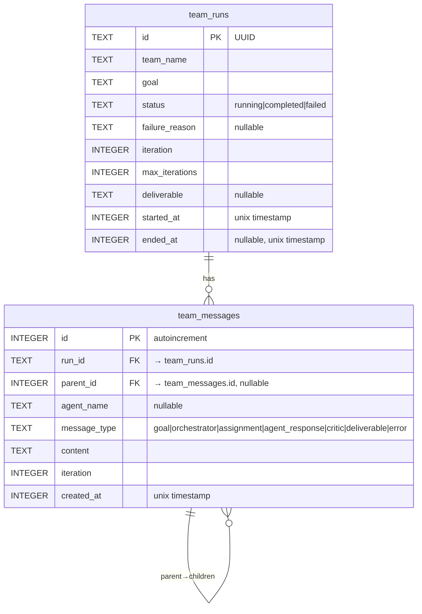

# Graph-structured team persistence with verbose mode

## Overview

Redesign team conversation storage to use graph-structured SQLite tables (replacing TOML files), persist all agent interactions during team runs, and add a verbose TUI mode that surfaces individual agent responses. This fixes the current gaps where team runs produce no DB records and agent responses are ephemeral.

## Problem Statement / Motivation

Three interrelated problems:

1. **Team errors not persisted:** When a team run fails (e.g., orchestrator returns prose instead of JSON), the TUI shows "Team error: ..." but nothing is saved to the database. The error and context are lost on restart.

2. **Agent responses are ephemeral:** Individual agent responses during team execution are discarded — `run_team_agent()` explicitly does NOT save to DB. Only the final deliverable survives. There's no way to see what each team member contributed.

3. **Flat, disconnected storage:** Team run history is in TOML files on disk, disconnected from the team's SQLite DB. The `conversations` table is a flat append-only log with no parent-child relationships. There's no graph structure linking a goal → task assignments → agent responses → critic feedback → deliverable.

## Proposed Solution

### New DB schema (migration v11)

Replace the TOML-based history and flat `conversations` table usage with two new tables in the team's SQLite DB (`~/.mika/teams/{name}/data/mika.db`):

```sql
-- Team run metadata (replaces TOML history files)
CREATE TABLE team_runs (
    id TEXT PRIMARY KEY,                          -- UUID run_id
    team_name TEXT NOT NULL,
    goal TEXT NOT NULL,
    status TEXT NOT NULL DEFAULT 'running',        -- running | completed | failed
    failure_reason TEXT,                           -- set when status = 'failed'
    iteration INTEGER NOT NULL DEFAULT 0,
    max_iterations INTEGER NOT NULL DEFAULT 3,
    deliverable TEXT,                              -- final output
    started_at INTEGER NOT NULL,                   -- Unix timestamp
    ended_at INTEGER                               -- Unix timestamp
);
CREATE INDEX idx_team_runs_started ON team_runs(started_at);

-- Graph-structured messages within a team run
CREATE TABLE team_messages (
    id INTEGER PRIMARY KEY AUTOINCREMENT,
    run_id TEXT NOT NULL REFERENCES team_runs(id),
    parent_id INTEGER REFERENCES team_messages(id), -- NULL for root nodes (goal)
    agent_name TEXT,                                -- NULL for user/system messages
    message_type TEXT NOT NULL,                     -- see enum below
    content TEXT NOT NULL,
    iteration INTEGER NOT NULL DEFAULT 0,
    created_at INTEGER NOT NULL DEFAULT (unixepoch())
);
CREATE INDEX idx_team_messages_run ON team_messages(run_id, created_at);
CREATE INDEX idx_team_messages_parent ON team_messages(parent_id);
```

**Message types** (enforced in Rust, not SQL):
- `goal` — user's input (root node, parent_id = NULL)
- `orchestrator` — task decomposition JSON from orchestrator
- `assignment` — individual task assigned to an agent (child of `orchestrator`)
- `agent_response` — specialist agent's text response (child of its `assignment`)
- `critic` — critic's review feedback (child of orchestrator at that iteration)
- `deliverable` — final output (child of goal)
- `error` — failure message at any level
- `progress` — transient status updates (NOT persisted to DB)

**Graph structure** (tree, not DAG — single parent per node):

```
goal (parent_id=NULL)
├── orchestrator (iteration=1)
│   ├── assignment: researcher
│   │   └── agent_response: researcher
│   └── assignment: analyst
│       └── agent_response: analyst
├── critic (iteration=1, feedback="needs revision")
├── orchestrator (iteration=2, re-decomposition)
│   ├── assignment: researcher
│   │   └── agent_response: researcher
│   └── assignment: analyst
│       └── agent_response: analyst
├── critic (iteration=2, approved=true)
└── deliverable
```

### Typed event callback (replaces string ProgressCallback)

```rust
// crates/mika-agent/src/teams/types.rs

pub enum TeamEvent {
    /// Transient progress message (not persisted)
    Progress(String),
    /// Orchestrator decomposed goal into tasks
    TasksAssigned { tasks: Vec<TaskAssignment>, iteration: u32 },
    /// Individual agent completed its task
    AgentCompleted { agent: String, response: String },
    /// Individual agent failed
    AgentFailed { agent: String, error: String },
    /// Critic reviewed outputs
    CriticReview { approved: bool, feedback: String, iteration: u32 },
    /// Final deliverable produced
    Deliverable(String),
    /// Run failed
    RunFailed(String),
}

pub type TeamEventCallback = Box<dyn Fn(TeamEvent) + Send + Sync>;
```

### Verbose mode in TUI

- New `/verbose` slash command toggles verbose display (persisted via `customer_config` in team DB, like `/think`)
- New `TeamResponse::AgentMessage { agent: String, content: String }` variant
- In verbose mode: agent responses shown as `ChatRole::System` with `[agent-name]` prefix
- In normal mode: only progress strings and final deliverable shown (current behavior)
- Startup history: always loads concise view (goals + deliverables). Verbose detail only for live runs.

### Engine changes

- `TeamEngine::new()` accepts `team_db: AsyncDatabase` parameter
- Engine persists `team_runs` row on creation, updates status on completion/failure
- Engine persists `team_messages` rows at each phase (decompose, execute, review, deliver)
- Agent responses captured from `run_team_agent()` return value and persisted
- Callback changed from `ProgressCallback` (string) to `TeamEventCallback` (typed enum)
- Remove TOML history writes from engine (replaced by DB)

### Management tool changes

- `get_team_history` reads from team DB instead of TOML files
- `get_team_status` reads from team DB
- Delete `crates/mika-agent/src/teams/history.rs` (TOML file I/O)

## Technical Considerations

- **Concurrent agent writes:** Specialist agents run in parallel via `JoinSet`. The team DB uses WAL mode with `busy_timeout = 5000`. Each agent write is a single INSERT, so contention is minimal. The engine holds the single `AsyncDatabase` handle (single writer thread).

- **Migration safety:** New tables only — no modification to existing tables. Migration v11 runs inside a single transaction. No virtual tables needed, so no transaction-splitting required. Databases that never used team mode get empty tables (harmless).

- **TOML removal:** Since no backward compatibility is needed, we delete TOML history code entirely. Existing TOML files on disk become orphaned but harmless.

- **JoinError gap fix:** When `JoinSet` returns a `JoinError` (panic/cancel), set `TaskStatus::Failed("task panicked or was cancelled")` on the task. Currently the status stays `Running` forever.

## System-Wide Impact

- **Interaction graph:** TUI sends goal → team worker calls `run_team()` → engine persists to team DB + emits `TeamEvent`s → TUI maps events to `TeamResponse` variants → `tick_team_mode()` renders messages. DB writes happen in the engine (background tokio task); TUI only reads for history.

- **Error propagation:** Engine errors flow through `TeamEvent::RunFailed` → `TeamResponse::Error` → TUI displays and persists error to `team_runs.failure_reason`.

- **State lifecycle:** `team_runs` row created at engine start (status=running), updated atomically on completion/failure. If engine crashes mid-run, the row stays as `running` with no `ended_at` — acceptable since there's no recovery mechanism.

- **API surface parity:** `run_team` management tool also gets the new DB persistence (it already opens a team DB path). `delegate_task` is unaffected (single-agent, not team).

## Acceptance Criteria

- [x] Migration v11 creates `team_runs` and `team_messages` tables
- [x] Team engine persists run metadata and all messages to team DB
- [x] Agent responses captured and persisted as `agent_response` messages
- [x] Critic feedback persisted as `critic` messages
- [x] Failed runs have `status='failed'` and `failure_reason` set in DB
- [x] `TeamEvent` enum replaces string `ProgressCallback`
- [x] TUI maps `TeamEvent` variants to appropriate `TeamResponse` messages
- [x] `/verbose` command toggles verbose display in team TUI mode
- [x] Verbose mode shows agent responses with `[agent-name]` prefix
- [x] Normal mode behavior unchanged (progress strings + deliverable)
- [x] `get_team_history` tool reads from team DB
- [x] `get_team_status` tool reads from team DB
- [x] TOML history code removed (`teams/history.rs`)
- [x] `JoinError` sets task status to `Failed` instead of leaving it `Running`
- [x] All existing tests pass; new tests for DB persistence and verbose mode
- [x] `cargo clippy` clean, `cargo test` passes

## ERD



## MVP Implementation Phases

### Phase 1: Schema + Engine persistence

**Files:**
- `crates/mika-agent/src/db.rs` — add `migrate_v11()`, bump `CURRENT_SCHEMA_VERSION` to 11, add team DB query methods
- `crates/mika-agent/src/teams/types.rs` — add `TeamEvent` enum, `TeamEventCallback` type
- `crates/mika-agent/src/teams/engine.rs` — accept `team_db: AsyncDatabase`, persist messages at each phase, emit `TeamEvent`s, fix `JoinError` gap
- `crates/mika-agent/src/teams/mod.rs` — update `run_team()` signature to accept team DB

### Phase 2: TUI integration + verbose mode

**Files:**
- `crates/mika-cli/src/tui/app.rs` — add `TeamResponse::AgentMessage`, `verbose_mode` field, handle new variants in `tick_team_mode()`, `/verbose` command
- `crates/mika-cli/src/commands/chat.rs` — update team worker to map `TeamEvent` → `TeamResponse`, open team DB and pass to engine
- `crates/mika-cli/src/tui/commands/handlers.rs` — add `/verbose` handler, persist preference

### Phase 3: Management tools + cleanup

**Files:**
- `crates/mika-agent/src/tools/get_team_history.rs` — read from team DB instead of TOML
- `crates/mika-agent/src/tools/get_team_status.rs` — read from team DB
- `crates/mika-agent/src/teams/history.rs` — DELETE this file
- `crates/mika-agent/src/teams/mod.rs` — remove `pub mod history;`

## Sources

- Engine code: `crates/mika-agent/src/teams/engine.rs`
- Types: `crates/mika-agent/src/teams/types.rs`
- TOML history: `crates/mika-agent/src/teams/history.rs`
- TUI team mode: `crates/mika-cli/src/tui/app.rs:610-668`
- Team worker: `crates/mika-cli/src/commands/chat.rs:444-498`
- DB migrations: `crates/mika-agent/src/db.rs:370-470`
- Team history tool: `crates/mika-agent/src/tools/get_team_history.rs`
- Learnings: `docs/solutions/integration-issues/team-tui-mode-cli-integration.md`
- Learnings: `docs/solutions/code-review-patterns/background-agent-mode-design-checklist.md`
