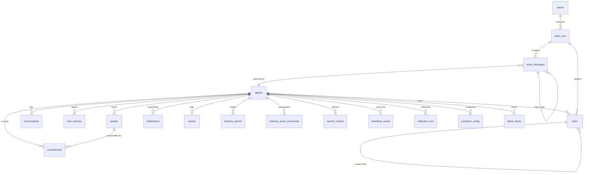

# refactor: Consolidate to Single Database Per Container

## Overview

The unified task engine brainstorm explicitly mandated a single `~/.mika/data/mika.db` per container, with agents and teams as rows in tables. The schema v1 implementation correctly added `agent_id` foreign keys to all tables, but the **database file topology was never consolidated** — each agent still gets its own `mika.db` file under `~/.mika/agents/{name}/data/mika.db`, and each team gets a separate `~/.mika/teams/{name}/data/mika.db`.

This makes foreign keys between tasks, conversations, memory, and team runs **impossible across agents**, defeating the core design.

## Problem Statement

The brainstorm stated:

> "There is no backward compatibility constraint. The entire SQLite schema can and should be redesigned from scratch. Design the schema holistically: agents, teams, tasks, conversations, memory — as one coherent model."

> "Single DB per container... The 'killer feature' — 'show me all my reminders, pending agent work, and upcoming calendar alerts' — is a single SQL query. With per-agent sharding it becomes ATTACH gymnastics."

**Current database files created:**

| Path pattern | Created by | Tables |
|---|---|---|
| `~/.mika/agents/{name}/data/mika.db` | CLI init, server, team engine, delegate_task | All schema v1 tables (agents, tasks, conversations, memory, etc.) |
| `~/.mika/teams/{name}/data/mika.db` | `open_or_create_team_db`, CLI team mode | Same schema v1 tables (duplicated) |

**Code locations that open per-agent DBs:**
- `crates/mika-cli/src/init.rs:184` — `settings.db_path = agent_home.join("data").join("mika.db")`
- `crates/mika-agent/src/server/mod.rs:78` — `Database::open(&agent_home.join("data").join("mika.db"))`
- `crates/mika-agent/src/teams/engine.rs:77-78` — per-agent DB for each team member
- `crates/mika-agent/src/tools/delegate_task.rs:81-83` — per-agent DB for delegated agent

**Code locations that open per-team DBs:**
- `crates/mika-agent/src/teams/mod.rs:39-46` — `open_team_db_sync`
- `crates/mika-agent/src/teams/mod.rs:64-68` — `open_or_create_team_db`
- `crates/mika-cli/src/commands/chat.rs:478-480` — CLI team mode

**Existing but unused:**
- `crates/mika-common/src/home.rs:17-18` — `container_db_path()` already returns `{home_dir}/data/mika.db` with the comment "single shared container database" — but nothing uses it.

## Proposed Solution

Consolidate all database access to a single file at `~/.mika/data/mika.db`. All `AsyncDatabase` instances (agents, teams, server, CLI) point to this one file. SQLite WAL mode supports concurrent readers with a single writer, which is sufficient for a single-user system.

### Key Changes

1. **`Settings.db_path`** defaults to `{global_home}/data/mika.db` (not `{agent_home}/data/mika.db`)
2. **Team DB functions** eliminated — teams use the shared DB
3. **`TeamEngine`** receives a shared `AsyncDatabase` instead of opening per-agent DBs
4. **`delegate_task`** uses the shared DB from `ToolContext`
5. **Server mode** opens DB at `{global_home}/data/mika.db`
6. **CLI team mode** uses the shared DB

## Technical Approach

### Phase 1: Config — Point db_path to Container DB

**File:** `crates/mika-common/src/config.rs`

Change `load_for_agent()` line 182-184:
```rust
// BEFORE: resolves to {agent_home}/data/mika.db
if settings.db_path == Path::new("mika.db") {
    settings.db_path = agent_home.join("data").join("mika.db");
}

// AFTER: resolves to {global_home}/data/mika.db
if settings.db_path == Path::new("mika.db") {
    settings.db_path = global_home.join("data").join("mika.db");
}
```

Update the `load()` backward-compatible wrapper to pass `home_dir` as global_home (already does this).

Update tests in config.rs to expect the new path.

### Phase 2: Eliminate Per-Team DB Functions

**File:** `crates/mika-agent/src/teams/mod.rs`

Delete:
- `TeamDbError` enum
- `open_team_db_sync()`
- `open_team_db()`
- `open_or_create_team_db()`

All callers now receive the shared `AsyncDatabase` from context.

### Phase 3: TeamEngine Uses Shared DB

**File:** `crates/mika-agent/src/teams/engine.rs`

Currently at line 75-93, the engine opens a separate DB per agent:
```rust
for ta in &team.agents {
    let home_dir = agent::agent_dir(global_home, &ta.name);
    let db_path = home_dir.join("data").join("mika.db");
    let db = Database::open(&db_path)?;  // PER-AGENT DB!
    // ...
}
```

Change to accept a shared `AsyncDatabase` (or the shared DB path) and clone it per agent, using `new_with_agent()` to set the agent_id context:
```rust
for ta in &team.agents {
    let home_dir = agent::agent_dir(global_home, &ta.name);
    db.register_agent(&ta.name, &ta.name, home_dir.to_str().unwrap_or(""))?;
    // Clone the shared async_db and rebind to this agent's ID
    let agent_db = shared_db.clone_with_agent(&ta.name);
    // ...
}
```

This requires adding `AsyncDatabase::clone_with_agent(agent_id)` — a clone that returns a new handle with a different `agent_id` but the same underlying DB connection thread.

### Phase 4: delegate_task Uses ToolContext DB

**File:** `crates/mika-agent/src/tools/delegate_task.rs`

Currently opens a fresh DB at line 81-83:
```rust
let db_path = agent_home.join("data").join("mika.db");
let db = Database::open(&db_path)?;
```

Change to clone the `ToolContext.db` and rebind agent_id:
```rust
let agent_db = ctx.db.clone_with_agent(&agent_name);
```

### Phase 5: Server Mode Uses Container DB

**File:** `crates/mika-agent/src/server/mod.rs`

Change line 78:
```rust
// BEFORE
let db = Database::open(&agent_home.join("data").join("mika.db"))?;

// AFTER
let db = Database::open(&home::container_db_path(global_home))?;
```

The `setup_agent_state` function needs a `global_home` parameter (or derive it from `agent_home`'s parent).

### Phase 6: CLI Team Mode Uses Shared DB

**File:** `crates/mika-cli/src/commands/chat.rs`

Change line 478-480:
```rust
// BEFORE
let data_dir = team_dir.join("data");
std::fs::create_dir_all(&data_dir)?;
let team_db = AsyncDatabase::open(&data_dir.join("mika.db"))?;

// AFTER — use the container DB from init context
// Pass the shared AsyncDatabase into run_team() instead
```

The `run_team()` function signature changes to accept a shared `AsyncDatabase`.

### Phase 7: Team Management Tools (get_team_status, get_team_history)

**Files:** `crates/mika-agent/src/tools/get_team_status.rs`, `get_team_history.rs`

These currently call `open_team_db_sync()` to read team run data. Change to use the shared DB from `ToolContext`.

### Phase 8: AsyncDatabase::clone_with_agent

**File:** `crates/mika-agent/src/async_db.rs`

Add a method:
```rust
impl AsyncDatabase {
    /// Clone this handle with a different agent_id context.
    /// Shares the same underlying DB thread and channel.
    pub fn clone_with_agent(&self, agent_id: &str) -> Self {
        Self {
            sender: self.sender.clone(),
            agent_id: agent_id.to_string(),
        }
    }
}
```

This is safe because all DB methods already use the `agent_id` field to scope queries. Multiple clones sharing the same DB thread is the whole point of `AsyncDatabase`'s channel-based design.

### Phase 9: Cleanup

- Delete per-agent `data/` directories (they'll no longer be created)
- Remove `container_db_path()` comment about "replaces per-agent databases" (it IS the path now)
- Update `home.rs` layout detection (`is_legacy_layout`, `is_initialized`) to check `~/.mika/data/mika.db`
- Remove `is_legacy_layout()` if no longer needed
- Update `bootstrap_fresh_install()` to create `~/.mika/data/` directory
- Clean up `migrate_to_multi_agent()` if it creates per-agent data dirs
- Update all tests that construct per-agent DB paths

## System-Wide Impact

### Interaction Graph

- `Settings::load_for_agent()` → `db_path` now points to container DB → all downstream `Database::open()` calls use single file
- `TeamEngine::new()` → no longer opens per-agent DBs → uses shared `AsyncDatabase` → `register_agent()` called on shared DB
- `delegate_task` → no longer opens fresh DB → clones shared DB with agent context
- CLI init → opens container DB → all slash commands and tools share it

### State Lifecycle Risks

- **WAL mode concurrency:** SQLite WAL supports concurrent readers and one writer. `AsyncDatabase` already serializes writes through a single OS thread + channel. Multiple `AsyncDatabase` clones sharing the same file is safe — they each have their own `Connection` to the same DB file, and WAL handles the concurrency.
- **Agent registration:** `register_agent()` uses `INSERT OR IGNORE`, so multiple calls are idempotent.
- **No orphaned data:** Since we're dropping and recreating (single user, no migration needed), there's no risk of orphaned rows.

### API Surface Parity

- `run_team()` function signature changes (accepts shared DB)
- `TeamEngine::new()` signature changes (accepts shared DB)
- `setup_agent_state()` needs `global_home` parameter
- Team DB functions deleted
- `delegate_task` tool internals change (no external API change)

## Acceptance Criteria

### Functional Requirements

- [x] Single `~/.mika/data/mika.db` file created on startup
- [x] No `~/.mika/agents/{name}/data/mika.db` files created
- [x] No `~/.mika/teams/{name}/data/mika.db` files created
- [x] CLI agent mode works with shared DB
- [x] CLI team mode works with shared DB
- [x] Server mode works with shared DB
- [x] `delegate_task` tool works with shared DB
- [x] `get_team_status` / `get_team_history` tools work with shared DB
- [x] Agent switching in CLI reuses the same DB connection
- [x] Task engine can query tasks across all agents in one query
- [x] `register_agent()` called for each agent that gets used

### Non-Functional Requirements

- [x] All existing tests pass (update paths as needed)
- [x] No per-agent or per-team database files created anywhere
- [x] `cargo clippy` clean
- [x] `cargo test` passes

## ERD Diagram



All tables live in **one** `~/.mika/data/mika.db` file. Foreign keys enforced.

## Sources

### Origin

- **Brainstorm document:** [docs/brainstorms/2026-03-04-unified-task-engine-brainstorm.md](docs/brainstorms/2026-03-04-unified-task-engine-brainstorm.md) — Key decisions: single DB per container, agents/teams as first-class DB citizens, all tables with agent_id FK

### Internal References

- Config path resolution: `crates/mika-common/src/config.rs:182-184`
- Container DB path (unused): `crates/mika-common/src/home.rs:17-18`
- Per-agent DB opens: `crates/mika-agent/src/server/mod.rs:78`, `teams/engine.rs:77-78`, `tools/delegate_task.rs:81-83`
- Per-team DB functions: `crates/mika-agent/src/teams/mod.rs:38-72`
- CLI team DB: `crates/mika-cli/src/commands/chat.rs:478-480`
- AsyncDatabase design: `crates/mika-agent/src/async_db.rs`
