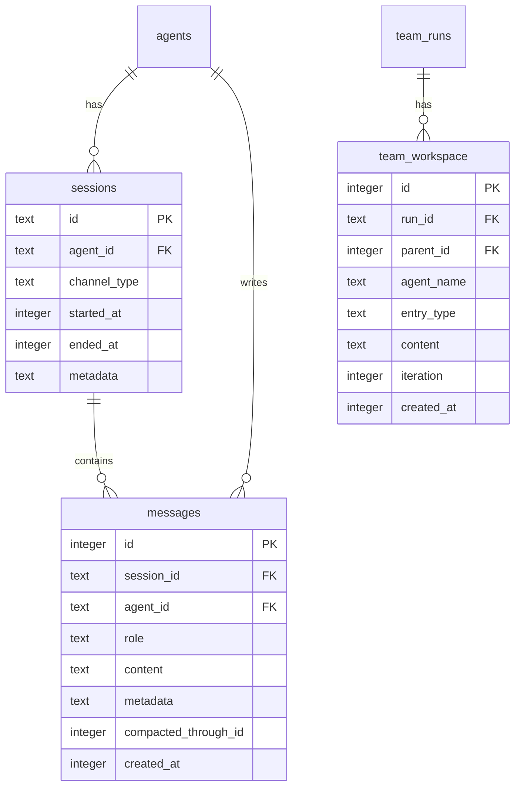

# refactor: Schema Redesign — Sessions + Messages

## Overview

Redesign Mika's data model to follow the industry-standard sessions + messages two-table pattern. Add a `sessions` table, rename `conversations` to `messages` (with `session_id` FK), rename `team_messages` to `team_workspace`, and split team data so agent text responses go into `messages` while structured artifacts stay in `team_workspace`. Schema version 2 -> 3 (clean-slate drop-and-recreate).

## Problem Statement / Motivation

The current model has unclear boundaries (see brainstorm: `docs/brainstorms/2026-03-07-schema-redesign-brainstorm.md`):
- `conversations` stores everything with a per-message `channel_type` when channel is really a per-session attribute
- `team_messages` mixes structured execution artifacts with agent text responses
- No explicit `sessions` table despite `session_id` being used in `memory_events` and `tasks.created_by_session`
- `session_id` exists on `AgentParams` (line 559 of `agent.rs`) but is never persisted to the conversations table

## Proposed Solution

1. Add `sessions` table with `(id, agent_id, channel_type, started_at, ended_at, metadata)`
2. Rename `conversations` -> `messages`, add `session_id` FK, remove `channel_type` column
3. Rename `team_messages` -> `team_workspace`, rename `message_type` -> `entry_type`
4. Rename `ConversationMessage` -> `SessionMessage` (add `session_id`, keep `channel_type` via JOIN)
5. Rename `TeamMessageRow` -> `TeamWorkspaceEntry` (rename `message_type` -> `entry_type`)
6. Split team writes: `agent_response`/`error`/`deliverable` -> `messages`; `goal`/`orchestrator`/`assignment`/`critic` -> `team_workspace`
7. Callbacks continue existing session via `tasks.created_by_session`
8. Schema version 2 -> 3, clean-slate (single user, no data migration)

### Channel types

`cli`, `telegram`, `team`, `api`, `system` (internal operations use `system` + metadata for distinction)

## Technical Approach

### Phase 1: Schema & Structs (`db.rs`)

**File:** `crates/mika-agent/src/db.rs`

#### 1.1 Struct renames

- `ConversationMessage` (line 111) -> `SessionMessage`: add `session_id: String`, keep `channel_type` (populated via JOIN)
- `TeamMessageRow` (line 210) -> `TeamWorkspaceEntry`: rename `message_type` -> `entry_type`
- Add new `Session` struct: `{ id: String, agent_id: String, channel_type: String, started_at: i64, ended_at: Option<i64>, metadata: Option<String> }`

#### 1.2 Schema DDL

- Bump `CURRENT_SCHEMA_VERSION` (line 21) from 2 to 3
- In `migrate_v1` (line 319): replace `conversations` DDL (lines 439-449) with `sessions` + `messages` tables per brainstorm schema. Replace `team_messages` DDL (lines 539-549) with `team_workspace`.
- Delete `migrate_v2` (lines 613-704) entirely — the old v2 migration for `tool_result` role and `delivered` status is folded into the new v1 DDL
- Add new `migrate_v3`: clean-slate drop-and-recreate for upgrade from schema v2

#### 1.3 New session methods

- `create_session(id: &str, agent_id: &str, channel_type: &str) -> Result<()>`
- `create_session_with_metadata(id: &str, agent_id: &str, channel_type: &str, metadata: Option<&str>) -> Result<()>`
- `end_session(id: &str) -> Result<()>` — sets `ended_at = unixepoch()`
- `get_or_create_system_session(agent_id: &str) -> Result<String>` — deterministic `"system-{agent_id}"` ID, INSERT OR IGNORE

#### 1.4 Update conversation methods

All methods currently reference `conversations` table. Changes:

| Method | Line | Changes |
|--------|------|---------|
| `save_message` | 1289 | Drop `channel_type` param, add `session_id` param. SQL: `INSERT INTO messages (session_id, agent_id, role, content)` |
| `save_message_with_metadata` | 1304 | Same signature change as `save_message` |
| `row_to_conversation_message` | 1320 | Rename to `row_to_session_message`. Map columns: `id, session_id, role, content, channel_type (from JOIN), metadata, created_at` |
| `load_recent_messages` | 1331 | Remove `channel_types` param. JOIN `sessions` on `session_id` to get `channel_type`. Filter `role != 'summary'`. Return `Vec<SessionMessage>` |
| `load_conversation_summary` | 1374 | Rename to `load_summary`. Update table name, JOIN for `channel_type`. Return `Option<SessionMessage>` |
| `count_messages` | 1387 | Update table name to `messages` |
| `load_messages_before_window` | 1396 | Update table name, JOIN for `channel_type` |
| `replace_with_summary` | 1429 | Use system session via `get_or_create_system_session(agent_id)` instead of hardcoded `channel_type='cli'` |
| `load_messages_after` | 1458 | Remove `channel_types` param. JOIN for `channel_type`. Return `Vec<SessionMessage>` |
| `max_message_id` | 1503 | Update table name |
| `get_conversations_since` | 1512 | Rename to `get_messages_since`. Update table name, JOIN for `channel_type` |
| `last_user_message_time` | 1532 | Update table name |

#### 1.5 Update team methods

| Method | Line | Changes |
|--------|------|---------|
| `insert_team_message` | 2437 | Rename to `insert_team_workspace_entry`. Change column `message_type` -> `entry_type`, table -> `team_workspace` |
| `load_assignment_msg_ids` | 2454 | Update table name, `message_type` -> `entry_type` |
| `load_team_messages` | 2470 | Rename to `load_team_workspace`. Return `Vec<TeamWorkspaceEntry>` |

#### 1.6 Update tests (~30-40 tests)

- All `save_message` calls: remove `channel_type`, add session creation + `session_id`
- Channel filter tests: remove or convert to session-based queries
- Table existence tests: update expected table list
- Raw SQL inserts in tests: update table/column names

---

### Phase 2: Async Wrappers (`async_db.rs`)

**File:** `crates/mika-agent/src/async_db.rs`

- Update imports: `ConversationMessage` -> `SessionMessage`, `TeamMessageRow` -> `TeamWorkspaceEntry`
- Add async wrappers: `create_session`, `create_session_with_metadata`, `end_session`, `get_or_create_system_session`
- Update `save_message` (line 346): drop `channel_type`, add `session_id`
- Update `save_message_with_metadata` (line 357): same
- Update `load_recent_messages` (line 375): drop `channel_filter` param
- Update `load_messages_after` (line 690): drop `channel_types` param
- Rename `get_conversations_since` (line 743) -> `get_messages_since`
- Rename `insert_team_message` (line 941) -> `insert_team_workspace_entry`
- Rename `load_team_messages` (line 972) -> `load_team_workspace`
- Update all return types to new struct names
- Update tests (lines 978+)

---

### Phase 3: Agent Loop (`agent.rs`)

**File:** `crates/mika-agent/src/agent.rs`

- **`AgentParams`** (line 552): `session_id` already exists (line 559). Keep `channel_type` for prompt context. All `save_message` calls use `params.session_id` instead of `params.channel_type`.
- **`SilentAgentParams`** (line 1124): has `session_id` (line 1131). Same save_message changes.
- **`TeamAgentParams`** (line 1435): has `session_id` (line 1443). Same save_message changes.
- **`LoopMode`** (lines 97-104): remove `channel_type` from both `Conversation` and `Silent` variants (channel info is on the session now, not the loop mode). The agent loop doesn't need channel_type for save operations.
- **`run_agent`** (line 586): update `save_message` calls to use `session_id`
- **`run_loop`** (line 328): update `save_message_with_metadata` calls to use `tool_ctx.session_id`
- **`run_silent_agent`** (line 1144): update save_message calls
- **`run_team_agent`** (line 1466): update save_message calls
- **`format_callback_framing`** (line 54): unchanged (just builds text)
- Callers of `run_agent`/`run_silent_agent`/`run_team_agent` must create session before calling (session creation moves to entry points in Phases 7-9)

---

### Phase 4: Compaction (`compaction.rs`)

**File:** `crates/mika-agent/src/compaction.rs`

- Update import: `ConversationMessage` -> `SessionMessage`
- `summarize_messages` (line 80): update param types to `Vec<SessionMessage>`
- `maybe_compact` (line 23): `replace_with_summary` now internally uses system session via `db.get_or_create_system_session(agent_id)` — no signature change needed here, just the DB method implementation

---

### Phase 5: Team Engine (`teams/engine.rs`)

**File:** `crates/mika-agent/src/teams/engine.rs`

Create team session at run start:
```rust
db.create_session(&format!("team-{}", run_id), orchestrator_agent_id, "team").await?;
```

Split `insert_team_message` calls based on actual message types used in code:

| Line | Current type | Destination | Notes |
|------|-------------|-------------|-------|
| 339 | `"goal"` | `team_workspace` | Structured artifact |
| 377-381 | `"error"` | `messages` | Agent error -> messages with metadata `{"team_run_id": ..., "source": "team_engine"}` |
| 588-593 | `"orchestrator"` | `team_workspace` | Structured artifact (decomposition) |
| 609-614 | `"orchestrator"` | `team_workspace` | Structured artifact (decomposition) |
| 625-630 | `"assignment"` | `team_workspace` | Structured artifact |
| 855-860 | `"agent_response"` | `messages` | Agent text -> messages with metadata `{"team_run_id": ..., "agent_name": ...}` |
| 879-884 | `"error"` | `messages` | Agent error -> messages with metadata |
| 1048-1053 | `"critic"` | `team_workspace` | Structured artifact |
| 1093-1098 | `"deliverable"` | `messages` | Deliverable -> messages with metadata |

Rename remaining `insert_team_message` -> `insert_team_workspace_entry` for artifact calls.

Update `load_assignment_msg_ids` and `load_team_messages` -> `load_team_workspace` calls.

---

### Phase 6: Tools

**Files and changes:**

- **`tools/get_team_status.rs`** (line 111): `load_team_messages` -> `load_team_workspace`, `msg.message_type` -> `entry.entry_type`
- **`tools/get_team_history.rs`**: Uses `load_team_runs` only — **no changes needed** (the original plan incorrectly included this)
- **`tools/send_message.rs`** (line 49): `save_message("assistant", text, "outbound")` -> `save_message("assistant", text, ctx.session_id)`. The `"outbound"` channel_type becomes a session-level attribute — the session for silent/server mode should already have the right channel_type.

---

### Phase 7: Task Engine (`task_engine/dispatcher.rs`)

**File:** `crates/mika-agent/src/task_engine/dispatcher.rs`

Each dispatch method already creates a `session_id` string. Add `create_session` call before `run_silent_agent`:

| Method | Line | Session ID format | channel_type | metadata |
|--------|------|-------------------|--------------|----------|
| `dispatch_skill_by_name` | 195 | `"skill-{name}-{uuid}"` | `"system"` | `{"trigger": "skill_run", "skill_name": "..."}` |
| `dispatch_resume_agent` | 251 | `"callback-{uuid}"` | `"system"` | `{"trigger": "callback"}` |
| `dispatch_heartbeat` | 410 | `"heartbeat-{uuid}"` | `"system"` | `{"trigger": "heartbeat"}` |
| `dispatch_reflection` | 518 | `"reflection-{date}"` | `"system"` | `{"trigger": "reflection"}` |

Rename `get_conversations_since` -> `get_messages_since` (line 492).

---

### Phase 8: CLI Entry Points

**`crates/mika-cli/src/commands/chat.rs`:**
- Line 55: After `session_id` creation, add `db.create_session(&session_id, agent_id, "cli").await?`
- Line 370: `load_recent_messages` — remove `POLLED_CHANNELS` filter param
- Line 642: Team-mode `load_recent_messages` — remove `vec!["team".into()]` filter
- Lines 244-250: Callback injection — `save_message_with_metadata` uses existing `session_id` (callbacks continue the session that spawned the task). Remove `"callback"` channel_type param.
- Line 275: `run_agent` with `is_callback_turn: true` — no change needed

**`crates/mika-cli/src/commands/ask.rs`:**
- Line 15: After `session_id` creation, add `db.create_session(&session_id, agent_id, "cli").await?`

**`crates/mika-cli/src/tui/app.rs`:**
- Line 341: Remove `POLLED_CHANNELS` constant (no longer needed — channel filtering is session-level)
- Lines 1028-1031: `load_messages_after` — remove channel filter param
- `SessionMessage.channel_type` still available via JOIN for display purposes

---

### Phase 9: Server Entry Point

**File:** `crates/mika-agent/src/server/handlers.rs`

- Line 200: After `session_id` creation, add `db.create_session(&session_id, agent_id, &req.channel).await?`
- Lines 212-232: `AgentParams` construction — `channel_type` still on `AgentParams` for prompt context, but no longer used for save operations

---

### Phase 10: Docs & CLAUDE.md

- Update `CLAUDE.md`: schema version 2 -> 3, table names (`sessions`, `messages`, `team_workspace`), struct names (`SessionMessage`, `TeamWorkspaceEntry`), method renames
- Update `docs/architecture.md` if it references old table/struct names

## System-Wide Impact

### Interaction Graph

- `save_message` is called from: `run_agent` -> `run_loop` (agent.rs), `send_message` tool, callback injection (chat.rs), server handler. All paths need `session_id` instead of `channel_type`.
- `load_recent_messages` / `load_messages_after` called from: TUI history loading, cross-channel polling, compaction pre-check. All lose the `channel_types` filter.
- `insert_team_message` called from: team engine only. Split into two paths (messages + team_workspace).

### Error Propagation

- Session creation failures (`create_session`) are `Result<()>` — bubble up as `anyhow::Error`, same as current DB operations.
- Missing session (FK violation on `messages.session_id`) would cause insert failure — must ensure session exists before any `save_message` call.

### State Lifecycle Risks

- **Orphaned sessions**: Sessions without messages are harmless (metadata only). No cleanup needed.
- **FK cascade**: `ON DELETE CASCADE` on `messages.session_id` means deleting a session deletes its messages. This is intentional (session is the unit of cleanup).
- **System session**: Deterministic `"system-{agent_id}"` created via INSERT OR IGNORE — safe for concurrent access.

### API Surface Parity

- `save_message` signature changes everywhere (7 call sites in agent.rs, 1 in send_message.rs, 1 in chat.rs callback)
- `load_recent_messages` / `load_messages_after` lose filter param (4 call sites)
- Team engine: 9 `insert_team_message` calls split into two paths

## Files NOT Modified

- `crates/mika-agent/src/prompt.rs` — uses `channel_type` from `PromptContext`, not storage
- `crates/mika-agent/src/skills/` — skill executor doesn't call `save_message` directly
- `crates/mika-agent/src/tools/delegate_task.rs` — delegates to `run_team_agent`
- `crates/mika-agent/src/tools/run_team.rs` — calls into team engine
- `crates/mika-agent/src/tools/list_agents.rs`, `list_teams.rs` — read-only metadata
- `crates/mika-gateway/` — own Postgres DB, no SQLite changes
- `crates/mika-common/` — no DB code
- `crates/mika-agent/src/mcp/` — no DB interaction
- Dockerfiles, CI workflows — unchanged

## Acceptance Criteria

### Functional Requirements

- [ ] `sessions` table created with correct schema
- [ ] `messages` table has `session_id` FK, no `channel_type` column
- [ ] `team_workspace` table uses `entry_type` column name
- [ ] `SessionMessage` struct has `session_id` and `channel_type` (from JOIN)
- [ ] All `save_message` calls use `session_id` instead of `channel_type`
- [ ] Team agent responses (`agent_response`, `error`, `deliverable`) saved to `messages`
- [ ] Team artifacts (`goal`, `orchestrator`, `assignment`, `critic`) saved to `team_workspace`
- [ ] Compaction summary uses deterministic system session
- [ ] Callback results injected into original session
- [ ] Session created at each entry point (CLI chat, CLI ask, server handler, task dispatchers)

### Quality Gates

- [ ] `cargo build` compiles without errors
- [ ] `cargo test` — all tests pass (many tests updated for session creation)
- [ ] `cargo clippy` — no warnings
- [ ] `CLAUDE.md` updated with new schema, struct names, method names

## ERD



## Verification

1. `cargo build` — all compilation errors from renames/signature changes resolved
2. `cargo test` — all ~917 tests pass
3. `cargo clippy` — no warnings
4. Manual TUI test: `cargo run --bin mika` — verify session created, messages saved, history loads
5. Manual team test: run a team, verify responses in `messages`, artifacts in `team_workspace`
6. Verify compaction: 50+ messages trigger summary with system session
7. Verify callback: long-running task callback injects into original session

## Sources & References

### Origin

- **Brainstorm document:** [docs/brainstorms/2026-03-07-schema-redesign-brainstorm.md](docs/brainstorms/2026-03-07-schema-redesign-brainstorm.md) — Key decisions: sessions table, team_workspace split, callback session continuity, system session convention
- **Original plan:** `~/temp/imperative-splashing-alpaca.md` — Reviewed and corrected for schema version (v2->v3 not v1->v2), actual team message types, and missing coverage

### Internal References

- Current schema: `crates/mika-agent/src/db.rs:319` (migrate_v1)
- ConversationMessage struct: `crates/mika-agent/src/db.rs:111`
- TeamMessageRow struct: `crates/mika-agent/src/db.rs:210`
- AgentParams.session_id: `crates/mika-agent/src/agent.rs:559`
- Team engine insert calls: `crates/mika-agent/src/teams/engine.rs` (lines 339, 377, 588, 609, 625, 855, 879, 1048, 1093)

### Institutional Learnings Applied

- `docs/solutions/database-issues/sqlite-datetime-format-mismatch.md` — Use INTEGER timestamps (already the case)
- `docs/solutions/database-issues/team-task-child-wrong-agent-id.md` — Task tree queries use `parent_task_id` not `agent_id` (unchanged by this refactor)
- `docs/solutions/database-issues/consolidate-per-agent-team-dbs-into-single-container-db.md` — Single container DB pattern preserved
- `docs/solutions/architecture-patterns/callback-tui-delivery-polling.md` — Table recreation pattern for CHECK constraints (used for v3 migration)

### Corrections from Original Plan

1. **Schema version**: v2->v3 (not v1->v2) — current schema is already v2
2. **Team message types**: Actual types in code are `goal`, `error`, `orchestrator`, `assignment`, `agent_response`, `critic`, `deliverable` — not the nine types the original plan referenced
3. **`get_team_history.rs`**: Only calls `load_team_runs` — no `load_team_messages` usage, no changes needed
4. **`SilentAgentParams` and `TeamAgentParams`**: Added to Phase 3 coverage (original plan missed these)
5. **`LoopMode`**: Has `channel_type` on both `Conversation` and `Silent` variants (original plan was vague)
6. **`send_message.rs`**: Currently uses `"outbound"` channel_type — needs session_id instead
