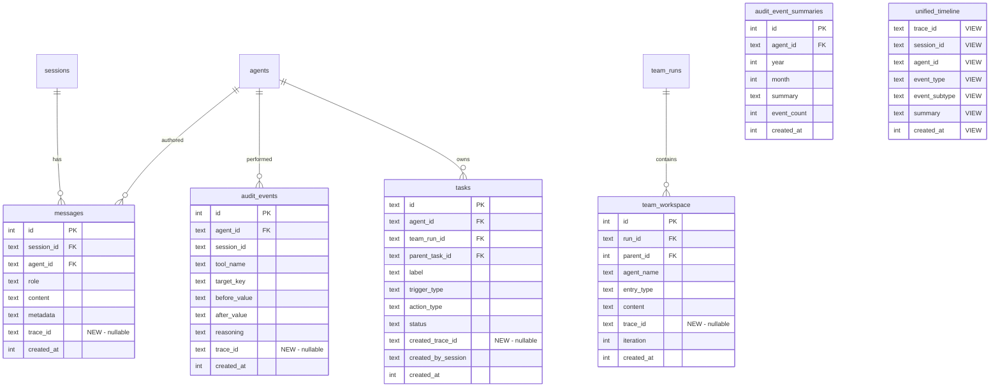

# feat: Orthogonal observability with EventContext and unified timeline

## Overview

Add a shared correlation language across all Mika subsystems by threading a `trace_id` through every database write path. Create a `unified_timeline` SQLite VIEW for cross-subsystem queries. Rename `memory_events` to `audit_events` to reflect its true role as an agent action audit log (closes #87). Add btrfs snapshot integration for filesystem-level observability.

Two orthogonal axes correlate all events:
- **Request axis (`trace_id`):** One per agent turn — correlates with Jaeger/Langfuse spans
- **System axis (`session_id` + `agent_id`):** Groups events within a conversation and by actor

(see brainstorm: `docs/brainstorms/2026-03-08-orthogonal-observability-brainstorm.md`)

## Problem Statement / Motivation

Mika has 5+ independent event systems that evolved without shared structure or correlation IDs:

| System | Captures | Has trace_id? | Has session_id? |
|---|---|---|---|
| `memory_events` | Fact/memory mutations | No | Yes |
| `messages.metadata` | Tool call summaries | No | Via message FK |
| `tracing` spans | agent_turn, team_run | Yes (OTel only) | No |
| `TeamEvent` / `team_workspace` | Phase changes, agent status | No | No |
| Task engine | Status transitions | No | No |

**Result:** Impossible to answer "what happened during this agent turn?" without querying each system separately. No way to correlate a Jaeger span to the database rows it produced.

## Proposed Solution

### Phase A: Schema migration v5 + trace_id generation utility

Add nullable `trace_id TEXT` columns to all event-producing tables. Rename `memory_events` → `audit_events`. Create `unified_timeline` VIEW. Update `migrate_v1` to create v5 schema directly. Build a `generate_trace_id()` utility that extracts from OTel span or falls back to random 32-char hex.

**No write path changes in Phase A** — columns are nullable, existing code continues to work with NULL trace_ids.

### Phase B: Thread trace_id through all write paths

Add `trace_id` field to `ToolContext`. Create `EventContext` at the start of each agent turn (conversation, silent, team). Pass through tool execution and all DB write functions. All new rows get a populated trace_id.

### Phase C: btrfs snapshot integration (separate PR)

Detect btrfs filesystem, create Mika-triggered read-only snapshots tagged with trace_id at agent turn boundaries. Graceful degradation when btrfs is unavailable.

## Technical Approach

### Architecture

#### EventContext and trace_id

```
                    ┌─────────────────────────────────┐
                    │  Agent Turn Entry Point          │
                    │  (run_agent / run_silent_agent)  │
                    │                                  │
                    │  trace_id = generate_trace_id()  │
                    │  info_span!("agent_turn",        │
                    │    trace_id = %trace_id, ...)    │
                    └──────────┬──────────────────────┘
                               │
                    ┌──────────▼──────────────────────┐
                    │  ToolContext { trace_id, ... }    │
                    └──────────┬──────────────────────┘
                               │
              ┌────────────────┼────────────────────┐
              │                │                    │
    ┌─────────▼────┐  ┌───────▼───────┐  ┌────────▼────────┐
    │ save_message  │  │ log_audit_    │  │ create_task     │
    │ (trace_id)    │  │ event         │  │ (created_       │
    │               │  │ (trace_id)    │  │  trace_id)      │
    └───────────────┘  └───────────────┘  └─────────────────┘
              │                │                    │
              └────────────────┼────────────────────┘
                               │
                    ┌──────────▼──────────────────────┐
                    │  unified_timeline VIEW           │
                    │  UNION ALL across all tables     │
                    └─────────────────────────────────┘
```

#### Key Design Decisions

**1. trace_id format: 32-char lowercase hex (both OTel and fallback)**

OTel trace_ids are 32-char hex. The UUID fallback generates 128-bit random and formats as 32-char hex (no hyphens). Consistent format across all rows regardless of whether telemetry is enabled.

```rust
// crates/mika-agent/src/trace.rs
pub fn generate_trace_id() -> String {
    #[cfg(feature = "telemetry")]
    {
        // Try to extract from current OTel span
        use tracing_opentelemetry::OpenTelemetrySpanExt;
        let ctx = tracing::Span::current().context();
        let span_ref = ctx.span();
        let sc = span_ref.span_context();
        if sc.trace_id() != opentelemetry::trace::TraceId::INVALID {
            return format!("{:032x}", sc.trace_id());
        }
    }
    // Fallback: random 128-bit hex
    let bytes: [u8; 16] = rand::random();
    hex::encode(bytes)
}
```

**2. trace_id on tasks: `created_trace_id` only**

A task is touched by 3-4 different trace_ids across its lifecycle (creation turn, tick-loop fire, external completion, delivery turn). A single column cannot represent this. The `tasks` table gets `created_trace_id` for provenance. Subsequent lifecycle transitions (fire, complete, expire, deliver) are logged as `audit_events` rows, each with the trace_id of the turn/tick that caused the transition.

**3. trace_id columns are nullable (incremental migration)**

Phase A adds nullable `TEXT` columns. Phase B populates them. A future Phase D (not in scope) can add `NOT NULL DEFAULT ''` after all write paths are updated. This de-risks the migration — schema and code changes in separate PRs.

**4. trace_id added directly to ToolContext (not a separate struct)**

`session_id` already exists on `ToolContext`. `agent_id` already exists on `AsyncDatabase`. The only new field needed is `trace_id: &'a str`. A full `EventContext` struct alongside `ToolContext` would require updating all ~25 tool signatures for a second parameter. Instead, add `trace_id` to `ToolContext` directly.

`EventContext` exists as a transient struct at the agent turn entry point for constructing the values, but it is not passed through the system — its fields are destructured into existing containers.

```rust
// At turn entry point only
struct EventContext {
    trace_id: String,
    session_id: String,
    agent_id: String,
}

// ToolContext gets the trace_id field
pub struct ToolContext<'a> {
    pub trace_id: &'a str,  // NEW
    pub db: &'a AsyncDatabase,
    pub session_id: &'a str,
    // ... existing fields unchanged
}
```

**5. Team workspace entries: trace_id of whoever creates them**

Orchestrator-generated entries (goal, orchestrator, critic) get the orchestrator's trace_id. Agent responses get the delegated agent's trace_id. The `agent_name` column already disambiguates.

**6. Compaction: summary message gets the compaction turn's trace_id**

Original trace_ids are lost when messages are deleted. This is acceptable — compaction already loses message-level detail. The unified_timeline reflects the current state, not a complete history.

**7. Task engine tick loop: trace_id per fired task, not per tick**

The 1-second tick loop does not get a trace_id. When it fires a task, it generates a trace_id for that dispatch. Status transitions (expire, cancel) are logged as audit_events with the tick's generated trace_id. Ticks that fire nothing generate no trace_ids.

**8. migrate_v1 updated to create v5 schema directly**

Consistent with the existing pattern where `migrate_v1` creates the latest schema and inserts the current version number. New databases get the v5 schema without running incremental migrations.

### Implementation Phases

#### Phase A: Schema migration v5 + trace_id utility

**Scope:** Schema changes only. No write path modifications. All existing code continues to work.

**Tasks:**

- [x] Create `crates/mika-agent/src/trace.rs` — `generate_trace_id()` function with OTel extraction (`#[cfg(feature = "telemetry")]`) and 128-bit random hex fallback
- [x] `crates/mika-agent/src/db.rs` — Bump `CURRENT_SCHEMA_VERSION` from 4 to 5
- [x] `crates/mika-agent/src/db.rs` — Add `migrate_v4_to_v5()` function (idempotent — each step checks existence before acting, since `ALTER TABLE RENAME TO` auto-commits outside transactions in SQLite):
  - Check `SELECT name FROM sqlite_master WHERE type='table' AND name='memory_events'` — only rename if old name still exists
  - `ALTER TABLE memory_events RENAME TO audit_events`
  - `DROP INDEX IF EXISTS idx_memev_agent_created` + recreate as `idx_audit_agent_created`
  - `DROP INDEX IF EXISTS idx_memev_session` + recreate as `idx_audit_session`
  - Check existence before renaming: `ALTER TABLE memory_event_summaries RENAME TO audit_event_summaries`
  - `ALTER TABLE messages ADD COLUMN trace_id TEXT`
  - `ALTER TABLE tasks ADD COLUMN created_trace_id TEXT`
  - `ALTER TABLE audit_events ADD COLUMN trace_id TEXT`
  - `ALTER TABLE team_workspace ADD COLUMN trace_id TEXT`
  - Create index: `CREATE INDEX idx_msg_trace ON messages(trace_id)` (partial: `WHERE trace_id IS NOT NULL`)
  - Create index: `CREATE INDEX idx_audit_trace ON audit_events(trace_id)` (partial: `WHERE trace_id IS NOT NULL`)
  - Create `unified_timeline` VIEW (see VIEW schema below)
- [x] `crates/mika-agent/src/db.rs` — Update `migrate_v1()` to create v5 schema directly:
  - Tables named `audit_events` and `audit_event_summaries` (not `memory_events`)
  - All tables include `trace_id` columns
  - `unified_timeline` VIEW included
  - Insert `schema_version = 5`
- [x] `crates/mika-agent/src/db.rs` — Update migration dispatch to call `migrate_v4_to_v5()` when version == 4
- [x] Rename all Rust types and functions:
  - `MemoryEvent` struct → `AuditEvent`
  - `log_memory_event()` → `log_audit_event()` (both `Database` and `AsyncDatabase`)
  - `get_memory_events()` → `get_audit_events()`
  - `get_memory_events_since()` → `get_audit_events_since()`
  - `count_memory_events_for_session()` → `count_audit_events_for_session()`
  - `compact_old_memory_events()` → `compact_old_audit_events()`
  - `memory_event_summaries` references → `audit_event_summaries`
  - Update all 10 call sites in tool files
  - Update all references in `async_db.rs`
  - Update prompt text that mentions "memory events" in `prompt.rs`
- [x] Update `save_message()` and `save_message_with_metadata()` signatures to accept `Option<&str>` for trace_id (default `None` for now)
- [x] Update `create_task()` signature to accept `Option<&str>` for `created_trace_id` (default `None` for now)
- [x] Update `insert_team_workspace_entry()` signature to accept `Option<&str>` for trace_id (default `None` for now)
- [x] Tests: verify v4→v5 migration, verify clean-slate v1 creates v5 schema, verify VIEW returns rows, verify `unified_timeline WHERE trace_id IS NULL` includes legacy rows
- [x] Tests: verify idempotent migration (running v4→v5 twice does not fail — handles partial state from interrupted first run)

**unified_timeline VIEW schema:**

```sql
CREATE VIEW unified_timeline AS
SELECT
    trace_id,
    session_id,
    agent_id,
    'message' AS event_type,
    role AS event_subtype,
    CASE
        WHEN length(content) > 200 THEN substr(content, 1, 200) || '...'
        ELSE content
    END AS summary,
    created_at
FROM messages
UNION ALL
SELECT
    trace_id,
    session_id,
    agent_id,
    'audit' AS event_type,
    tool_name AS event_subtype,
    target_key || ': ' || COALESCE(before_value, '(none)') || ' → ' || after_value AS summary,
    created_at
FROM audit_events
UNION ALL
SELECT
    created_trace_id AS trace_id,
    created_by_session AS session_id,
    agent_id,
    'task' AS event_type,
    action_type AS event_subtype,
    label || ' [' || status || ']' AS summary,
    created_at
FROM tasks;
```

**Note:** `team_workspace` is excluded from the initial VIEW because it lacks `session_id` and `agent_id` columns directly (they live on the parent `team_runs` table). A future iteration can add a JOIN-based subquery.

#### Phase B: Thread trace_id through all write paths

**Scope:** Generate trace_id at each agent turn entry point. Pass through ToolContext and all DB writes. After this phase, all new rows have populated trace_ids.

**Tasks:**

- [x] `crates/mika-agent/src/tools/mod.rs` — Add `pub trace_id: &'a str` field to `ToolContext`
- [x] `crates/mika-agent/src/agent.rs` — In `run_agent()` (line ~604): generate trace_id before span creation, add as span field:
  ```rust
  let trace_id = generate_trace_id();
  let span = info_span!(
      "agent_turn",
      agent = %agent_name,
      mode = "conversation",
      trace_id = %trace_id,
      channel = %params.channel_type,
  );
  ```
- [x] `crates/mika-agent/src/agent.rs` — In `run_agent_inner()`: pass `&trace_id` when constructing `ToolContext`
- [x] `crates/mika-agent/src/agent.rs` — In `run_silent_agent()` / `run_silent_inner()`: generate trace_id in inner function, passed to ToolContext
- [x] `crates/mika-agent/src/agent.rs` — Update all `save_message` / `save_message_with_metadata` calls in agent loop to pass `Some(&trace_id)`
- [x] `crates/mika-agent/src/agent.rs` — Compaction summaries use `None` trace_id (system-generated, not tied to agent turn)
- [x] Update all 10 `log_audit_event` call sites in tool files to pass `ctx.trace_id`:
  - `tools/update_core_memory.rs`
  - `tools/store_fact.rs` (4 call sites)
  - `tools/update_fact.rs`
  - `tools/cancel_task.rs`
  - `tools/create_reminder.rs`
  - `tools/create_task.rs`
  - `tools/complete_task.rs`
- [x] Update `create_task` and `create_reminder` tools to pass `ctx.trace_id` as `created_trace_id`
- [x] Task engine dispatcher: `run_silent_agent` now generates its own trace_id internally
- [x] Update team engine to generate trace_id and pass to `insert_team_workspace_entry` calls
- [x] `crates/mika-agent/src/teams/engine.rs` — `TeamEngine` has `trace_id` field; `run_team_agent` generates its own trace_id
- [x] `crates/mika-agent/src/server/handlers.rs` — `run_agent()` generates trace_id internally, no handler changes needed
- [ ] Add task lifecycle audit events: log `audit_event` rows when task engine fires, completes, expires, or delivers a task (trace_id from the tick that caused the transition)
- [x] Tests: verify trace_id propagation end-to-end (message + audit_event + task → unified_timeline query by trace_id)

#### Phase C: btrfs snapshot integration (separate PR)

**Scope:** Filesystem-level observability. Entirely independent from Phases A/B.

**Constraints:**
- Requires home directory to be a btrfs subvolume
- Requires `CAP_SYS_ADMIN` or root for snapshot creation
- Docker containers need explicit capability grants or sudoers configuration
- `btrfs` CLI must be installed (not currently in Dockerfile.agent)

**Tasks:**

- [ ] `crates/mika-agent/src/btrfs.rs` — btrfs detection utility:
  - Check if home_dir is on btrfs via `statfs` syscall (`f_type == 0x9123683E`)
  - Check if home_dir is a subvolume via `btrfs subvolume show <path>` exit code
  - Cache result (check once at startup, not every turn)
- [ ] `crates/mika-agent/src/btrfs.rs` — Snapshot creation:
  - `create_snapshot(home_dir: &Path, trace_id: &str) -> Result<Option<PathBuf>>`
  - Snapshot path: `{home_dir}/.snapshots/{trace_id}`
  - Read-only snapshot: `btrfs subvolume snapshot -r {home_dir} {snapshot_path}`
  - Returns `Ok(None)` if btrfs unavailable (graceful degradation)
  - Log warning once if btrfs detection fails, not every turn
- [ ] `crates/mika-agent/src/btrfs.rs` — Snapshot retention:
  - `prune_old_snapshots(home_dir: &Path, keep: usize) -> Result<()>`
  - Keep most recent N snapshots (default: 100), delete oldest via `btrfs subvolume delete`
  - Run at startup (alongside `prune_old_tasks`)
- [ ] `crates/mika-agent/src/agent.rs` — Call `create_snapshot` at the start of each agent turn (after trace_id generation, before tool loop)
- [ ] `crates/mika-agent/src/agent.rs` — Call `prune_old_snapshots` during startup recovery
- [ ] `Dockerfile.agent` — Add `btrfs-progs` to runtime deps (alongside `jq`, `gh`, etc.)
- [ ] Documentation: deployment guide update for btrfs subvolume setup
- [ ] Tests: unit tests with mock filesystem (no actual btrfs in CI)

## System-Wide Impact

### Interaction Graph

1. User message arrives → `run_agent()` generates trace_id → span created with trace_id field
2. `save_message(user_msg, trace_id)` → messages table row with trace_id
3. Tool loop: each tool receives `ToolContext { trace_id }` → tools call `log_audit_event(trace_id)` → audit_events rows
4. Tools that create tasks call `create_task(created_trace_id)` → tasks table row
5. `save_message(assistant_response, trace_id)` → messages table row with trace_id
6. Post-turn compaction (if threshold) → summary message gets compaction turn's trace_id
7. All rows queryable via `unified_timeline` VIEW filtered by `trace_id`

### Error Propagation

- `generate_trace_id()` is infallible (random fallback always succeeds)
- OTel span extraction failure → silent fallback to random hex (no error propagation)
- btrfs snapshot failure → logged warning, agent turn proceeds (no error propagation)
- DB write failures with trace_id are the same as existing DB write failures (unchanged error paths)

### State Lifecycle Risks

- **Partial migration:** If the process crashes during v4→v5 migration, SQLite transactions protect atomicity. The `ALTER TABLE RENAME TO` is DDL and auto-commits, so the migration function must execute renames in order and handle partial state on restart.
- **NULL trace_ids:** Old rows have NULL trace_ids forever. The unified_timeline VIEW includes them (no `WHERE trace_id IS NOT NULL` filter). Queries that need only traced rows filter explicitly.
- **Compaction destroys trace_ids:** Accepted trade-off. Compaction already loses message detail.

### API Surface Parity

- `save_message()` / `save_message_with_metadata()` — gain optional trace_id parameter
- `log_audit_event()` (renamed from `log_memory_event()`) — gains trace_id parameter
- `create_task()` — gains optional `created_trace_id` parameter
- `insert_team_workspace_entry()` — gains optional trace_id parameter
- `ToolContext` — gains `trace_id: &'a str` field
- All changes are additive (existing call sites pass `None` / empty until Phase B updates them)

### Integration Test Scenarios

1. **Full conversation turn trace:** Send user message → verify all messages, audit_events, and task rows created during that turn share the same trace_id → query unified_timeline by trace_id → verify complete timeline
2. **Silent agent turn trace:** Fire heartbeat task → verify silent agent's trace_id appears on all rows created during the turn
3. **Team run trace:** Run team → verify orchestrator and delegated agents get different trace_ids → verify team_workspace entries carry the correct trace_id per creator
4. **v4→v5 migration:** Open a v4 database with existing data → verify migration succeeds → verify old rows have NULL trace_id → verify new rows get populated trace_id → verify unified_timeline includes both
5. **Compaction with trace_id:** Create 60 messages with trace_ids → trigger compaction → verify summary message has new trace_id → verify old trace_ids are gone

## Acceptance Criteria

### Functional Requirements

- [ ] `generate_trace_id()` returns 32-char lowercase hex string
- [ ] When `telemetry` feature is enabled and OTel span is active, `generate_trace_id()` returns the OTel trace_id
- [ ] When `telemetry` feature is disabled, `generate_trace_id()` returns random 128-bit hex
- [ ] Schema v5 migration succeeds from v4 databases with existing data
- [ ] `memory_events` table renamed to `audit_events` with all indexes recreated
- [ ] `memory_event_summaries` renamed to `audit_event_summaries`
- [ ] `messages`, `tasks`, `audit_events`, `team_workspace` tables have trace_id columns
- [ ] `unified_timeline` VIEW returns rows from messages, audit_events, and tasks with consistent schema
- [ ] New databases created via `migrate_v1` get v5 schema directly
- [ ] All Rust types/functions renamed: `MemoryEvent` → `AuditEvent`, `log_memory_event` → `log_audit_event`, etc.
- [ ] `ToolContext` has `trace_id: &'a str` field
- [ ] Every agent turn (conversation, silent, team) generates a trace_id
- [ ] All `save_message`, `log_audit_event`, `create_task`, `insert_team_workspace_entry` calls pass trace_id
- [ ] Task lifecycle transitions (fire, expire, complete, deliver) logged as audit_events with trace_id
- [ ] `cargo test` passes (~925+ tests)
- [ ] `cargo clippy` clean

### Non-Functional Requirements

- [ ] No performance regression: `generate_trace_id()` < 1μs (random bytes + hex encode)
- [ ] Partial indexes on trace_id columns (WHERE NOT NULL) to avoid indexing legacy NULL rows
- [ ] Unified timeline VIEW query by trace_id < 10ms for typical database sizes

### Phase C (btrfs) Acceptance Criteria

- [ ] btrfs detection works via `statfs` syscall
- [ ] Snapshots created as read-only at `{home_dir}/.snapshots/{trace_id}`
- [ ] Graceful degradation: non-btrfs filesystems log a warning once and proceed
- [ ] Snapshot retention: prune to 100 most recent at startup
- [ ] `btrfs-progs` added to Dockerfile.agent

## Dependencies & Risks

| Risk | Likelihood | Impact | Mitigation |
|---|---|---|---|
| Migration fails on large databases | Low | High | SQLite ALTER TABLE ADD COLUMN is O(1). RENAME TO is metadata-only. Test with production-sized DBs. |
| Missed call sites leave NULL trace_ids | Medium | Medium | Compiler catches renamed functions. grep for old function names in CI. |
| btrfs unavailable in production | Medium | Low | Graceful degradation by design. btrfs is optional. |
| OTel trace_id extraction broken by dependency upgrade | Low | Low | Fallback always works. Integration test verifies extraction. |
| `rand` crate dependency for trace_id generation | Low | Low | `rand` is already a transitive dependency via multiple crates. |

## Alternative Approaches Considered

1. **Full EventContext struct passed alongside ToolContext** — Rejected. Would require updating all ~25 tool `execute()` signatures to accept a second parameter. Adding `trace_id` to ToolContext directly is simpler and achieves the same goal.

2. **Append-only event log table** — Rejected. Would duplicate data from messages/tasks/audit_events into a central table. Higher storage, more write paths, risk of inconsistency. The VIEW approach gives unified querying without duplication.

3. **NOT NULL trace_id columns** — Rejected for now. Would require atomic update of all write paths in a single PR. Nullable columns allow incremental migration across multiple PRs.

4. **UUID format for trace_id** — Rejected. Inconsistent with OTel 32-char hex format. Using 32-char hex everywhere ensures queries work regardless of telemetry feature state.

(see brainstorm: `docs/brainstorms/2026-03-08-orthogonal-observability-brainstorm.md` — decisions 1-5)

## Sources & References

### Origin

- **Brainstorm document:** [docs/brainstorms/2026-03-08-orthogonal-observability-brainstorm.md](docs/brainstorms/2026-03-08-orthogonal-observability-brainstorm.md) — Key decisions carried forward: hybrid enforcement (EventContext struct + schema migration), SQLite VIEW for unified timeline, 32-char hex trace_id format, btrfs as separate phase.

### Internal References

- Schema migration: `crates/mika-agent/src/db.rs:21` (CURRENT_SCHEMA_VERSION = 4)
- ToolContext: `crates/mika-agent/src/tools/mod.rs:53-69`
- Agent loop spans: `crates/mika-agent/src/agent.rs:604-613`
- Silent agent spans: `crates/mika-agent/src/agent.rs:1150-1160`
- log_memory_event: `crates/mika-agent/src/db.rs:1959-1984`
- AsyncDatabase wrapper: `crates/mika-agent/src/async_db.rs:729-751`
- Team workspace inserts: `crates/mika-agent/src/teams/engine.rs:350-1055`
- Task creation: `crates/mika-agent/src/db.rs:799-833`

### Related Work

- Issue #87: Rename memory_events table (folded into this work)


