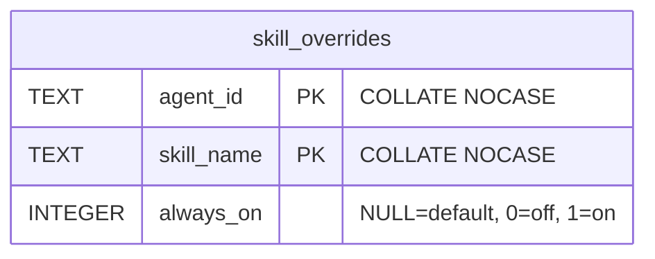

# feat: Respect user overrides for builtin skill always_on flag

## Overview

`seed_bundled_skills()` overwrites `skill.toml` on every startup, resetting any user-modified `always_on` value. This makes it impossible for users to persistently change whether a built-in skill is always-on. The fix: store `always_on` overrides in a SQLite table (`skill_overrides`) that survives the startup re-sync cycle. The DB is the override layer; the file always reflects the bundled default.

Additionally, change the bundled default for `web-search` to `always_on = true` — it's a core capability that should be active without keyword triggering.

## Problem Statement

1. User calls `update_skill` to set `always_on = true` on a built-in skill.
2. Tool writes to `skill.toml`.
3. On next startup, `seed_bundled_skills()` overwrites `skill.toml` with the bundled template.
4. User's preference is lost.

## Proposed Solution

Add a `skill_overrides` table (schema v7) with `always_on` overrides keyed by `(agent_id, skill_name)`. After `scan_skills_dir()` loads manifests from disk, a post-scan method on `SkillRegistry` applies DB overrides. `update_skill` detects built-in skills and writes to the DB instead of `skill.toml`. `list_skills` shows an `[override]` badge when the effective value differs from the bundled default.

## Design Decisions

**D1: `enabled` stays file-based (`.disabled` marker only).**
The `.disabled` file already survives `seed_bundled_skills()` (which never removes `.disabled` files). Adding a DB column for `enabled` creates two sources of truth. The `skill_overrides` table stores only `always_on`.

**D2: Post-scan overlay, not signature change on `scan_skills_dir()`.**
`scan_skills_dir(&Path)` is a pure filesystem function called from ~8 sites. Instead of adding a DB parameter (breaking all callers), add `SkillRegistry::apply_overrides(overrides: &[SkillOverride])` that mutates entries in-place. Callers with DB access fetch overrides first and pass them in. Callers without DB access (CLI `mika skills list`) see bundled defaults — acceptable for now, deferrable enhancement.

**D3: `toggle_skill` keeps current scope (enable/disable only).**
`toggle_skill` manages the `.disabled` marker. `update_skill` manages `always_on`. No scope creep. No `/toggle` TUI slash command needed.

**D4: Setting `always_on` to the bundled default deletes the override row.**
This prevents stale overrides from blocking future bundled default changes. Only actual deviations are stored.

**D5: `web-search` bundled default changes to `always_on = true`.**
Update the template `skill.toml` and `seed_bundled_skills()` constant. Existing agents already have the old `always_on = false` on disk — `seed_bundled_skills()` will overwrite it on next startup.

## Technical Approach

### Phase 1: DB Migration (v6 → v7)

**Files:**
- `crates/mika-agent/src/db.rs`

**Tasks:**
- [x] Bump `CURRENT_SCHEMA_VERSION` to 7
- [x] Add `skill_overrides` table to `migrate_v1()` (clean-slate path)
- [x] Add `migrate_v6_to_v7()` function:

```sql
CREATE TABLE IF NOT EXISTS skill_overrides (
    agent_id   TEXT NOT NULL COLLATE NOCASE,
    skill_name TEXT NOT NULL COLLATE NOCASE,
    always_on  INTEGER,  -- NULL=use default, 0=off, 1=on
    PRIMARY KEY (agent_id, skill_name)
);
```

- [x] Add dispatch in `migrate()`: `if (3..=6).contains(&version) { self.migrate_v6_to_v7()?; }`
- [x] Add DB methods on `Database`:
  - `get_skill_overrides(agent_id: &str) -> Result<Vec<SkillOverride>>`
  - `set_skill_override(agent_id: &str, skill_name: &str, always_on: bool) -> Result<()>` (UPSERT)
  - `delete_skill_override(agent_id: &str, skill_name: &str) -> Result<()>`
- [x] Add async wrappers on `AsyncDatabase`
- [x] Define `SkillOverride` struct: `{ skill_name: String, always_on: Option<bool> }`

### Phase 2: SkillRegistry Override Application

**Files:**
- `crates/mika-agent/src/skills/mod.rs`
- `crates/mika-agent/src/skills/index.rs`

**Tasks:**
- [x] Add `SkillRegistry::apply_overrides(&mut self, overrides: &[SkillOverride])` method
  - For each override, find matching `SkillEntry` by name (case-insensitive)
  - If `always_on` is `Some(val)`, set `entry.manifest.skill.always_on = val`
  - Track which entries have overrides (add `has_override: bool` to `SkillEntry` or return a set)
- [x] Add `has_override: bool` field to `SkillEntry` (default `false`), set to `true` when override is applied
- [x] Verify `always_on_skills()`, `safe_always_on_skills()`, and `match_skills()` work correctly with overridden values (they read from `manifest.skill.always_on`, so they automatically pick up overrides)

### Phase 3: Wire Overrides into Call Sites

**Files:**
- `crates/mika-agent/src/startup.rs` — main startup path (CLI + server)
- `crates/mika-agent/src/server/mod.rs` — server skill registry rebuild
- `crates/mika-agent/src/server/handlers.rs` — handler skill registry rebuild
- `crates/mika-agent/src/tools/delegate_task.rs` — delegated agent registry
- `crates/mika-agent/src/teams/engine.rs` — team agent registry

**Tasks:**
- [x] After each `SkillRegistry::from_dir(path)` call where `AsyncDatabase` (or `Database`) is available:
  1. Fetch overrides: `db.get_skill_overrides(agent_id).await?`
  2. Apply: `registry.apply_overrides(&overrides)`
- [x] For CLI `mika skills list` (`commands/skills.rs`): defer — no DB access in this path currently. Shows bundled defaults. Can be enhanced later.

### Phase 4: Modify `update_skill` Tool

**File:**
- `crates/mika-agent/src/tools/update_skill.rs`

**Tasks:**
- [x] Detect skill origin (built-in vs custom/marketplace) — use `bundled_skills::is_bundled(name)` or check origin on `SkillEntry`
- [x] If built-in AND `always_on` is being modified:
  - Read current bundled default from `manifest.skill.always_on` (file value)
  - If new value == bundled default → `db.delete_skill_override()` (D4: remove redundant override)
  - If new value != bundled default → `db.set_skill_override(agent_id, name, new_value)`
  - Do NOT write `always_on` to `skill.toml`
- [x] If custom/marketplace: existing behavior (write to `skill.toml`)
- [x] Set `skills_dirty = true` as before

### Phase 5: Modify `list_skills` Tool

**File:**
- `crates/mika-agent/src/tools/list_skills.rs`

**Tasks:**
- [x] After scanning skills, fetch overrides from DB (via `ctx.db`)
- [x] Apply overrides to determine effective values
- [x] Show `[override]` badge on skills where `has_override` is true
- [x] Output example: `self-knowledge [built-in] [always-on] [override]`

### Phase 6: Cleanup on Skill Deletion

**Files:**
- `crates/mika-agent/src/tools/delete_skill.rs`
- `crates/mika-agent/src/commands/skills.rs` (uninstall path)

**Tasks:**
- [x] In `delete_skill` tool: after removing skill directory, `db.delete_skill_override(agent_id, name)`
- [x] In CLI `mika skills uninstall`: add DB cleanup if DB is accessible (defer if not)

### Phase 7: Change `web-search` Bundled Default

**Files:**
- `crates/mika-agent/templates/skills/web-search/skill.toml`
- `crates/mika-agent/src/bundled_skills.rs` (if the default is embedded in the macro)

**Tasks:**
- [x] Set `always_on = true` in the web-search skill template
- [x] On next startup, `seed_bundled_skills()` overwrites the file — existing agents get the new default automatically
- [x] No migration-time override needed — the file overwrite handles it

## System-Wide Impact

### Interaction Graph
`update_skill(always_on)` → detects built-in → writes `skill_overrides` DB → sets `skills_dirty` → next turn `SkillRegistry::from_dir` + `apply_overrides` → `always_on_skills()` / `match_skills()` reflect new value.

### Error Propagation
DB write failure in `set_skill_override` → `update_skill` returns error to agent → agent reports to user. No partial state (override is atomic UPSERT).

### State Lifecycle Risks
- Orphaned override rows when a built-in skill is removed from bundle in future version: harmless (row exists but no matching `SkillEntry`). Can add periodic cleanup in `seed_bundled_skills()` if needed.
- `.disabled` and `skill_overrides` are independent — no conflict possible (they control different properties).

### API Surface Parity
- `update_skill` tool: modified (DB path for built-in)
- `list_skills` tool: modified (override badge)
- `delete_skill` tool: modified (cleanup)
- `toggle_skill` tool: unchanged
- CLI `mika skills list`: deferred (no DB access)
- CLI `mika skills enable/disable`: unchanged (`.disabled` marker)

## Acceptance Criteria

- [x] Schema v7 migration creates `skill_overrides` table with `COLLATE NOCASE`
- [x] `update_skill` on a built-in skill writes `always_on` to DB, not `skill.toml`
- [x] `update_skill` on a custom/marketplace skill still writes to `skill.toml`
- [x] Setting `always_on` to the bundled default removes the override row
- [x] Override survives agent restart (`seed_bundled_skills()` cycle)
- [x] `list_skills` shows `[override]` badge when effective value differs from bundled default
- [x] `delete_skill` cleans up override rows
- [x] `web-search` bundled default is `always_on = true`
- [x] All existing tests pass (`cargo test`)
- [x] New tests cover: override persistence across restart, badge display, built-in vs custom routing, cleanup on delete, COLLATE NOCASE behavior

## ERD



## Sources

- Related issue: #73
- Key files:
  - `crates/mika-agent/src/db.rs` — schema migrations
  - `crates/mika-agent/src/skills/mod.rs:22` — `SkillRegistry::from_dir()`
  - `crates/mika-agent/src/skills/index.rs:47` — `scan_skills_dir()`
  - `crates/mika-agent/src/bundled_skills.rs:148` — `seed_bundled_skills()`
  - `crates/mika-agent/src/tools/update_skill.rs` — current `always_on` write path
  - `crates/mika-agent/src/tools/list_skills.rs` — skill listing
  - `crates/mika-agent/src/tools/toggle_skill.rs` — enable/disable
- ADR-002: Filesystem-Based Skill Registry
- ADR-006: Git-Based Skills Marketplace
- Solution: `docs/solutions/integration-issues/adding-prompt-only-bundled-skill.md`
