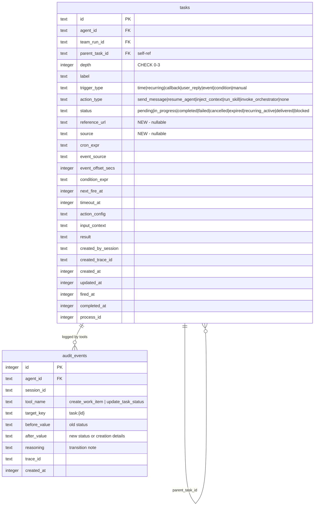

# feat: Add Generic Workflow Task Tracking (Work Items)

## Overview

Add first-class work item tracking to Mika. Work items are tasks with `trigger_type: 'manual'` — passive tracking records that the agent creates, progresses, and completes. Three new agent-facing tools (`create_work_item`, `update_task_status`, `list_work_items`) wrap the internal task engine with loop prevention guards and audit logging. Schema v7→v8 migration adds columns and updates CHECK constraints.

## Problem Statement / Motivation

Mika can create time-based reminders and the system creates callback tasks internally. But the agent cannot:
- Track "a thing to be done" as a first-class entity
- Link tasks to external references (GitHub issues, URLs, documents)
- Manually progress task status (pending → in_progress → blocked → completed)
- Build hierarchical work trees (work item → self-dev → claude-asked questions)

This blocks use cases like "Implement GitHub issue #123" (needs tracking + self-dev linking), "Wait for Sarah's reply" (needs blocked status), and dashboard observability of agent work.

## Proposed Solution

Work items are **tasks with `trigger_type: 'manual'`** in the existing `tasks` table. No new tables. The task engine ignores manual tasks entirely (fully inert). The agent decides when to create, progress, and complete them. (see brainstorm: docs/brainstorms/2026-03-11-work-item-tracking-brainstorm.md, "Why This Approach")

**Key design:** Agent-facing tools (`create_work_item`, `update_task_status`, `list_work_items`) wrap the internal `db.create_task()` engine function with hardcoded `trigger_type: 'manual'`, five code-level loop prevention guards, and audit event logging. (see brainstorm: "Key Decisions > Tool Layering")

## Technical Approach

### Architecture

```
┌─────────────────────────────────────────┐
│           Agent-Facing Layer            │
│  create_work_item  update_task_status   │
│  list_work_items                        │
│  ┌──────────────────────────────────┐   │
│  │  Loop Prevention Guards (5)      │   │
│  │  Audit Event Logging             │   │
│  │  Input Validation                │   │
│  └──────────────────────────────────┘   │
├─────────────────────────────────────────┤
│           Internal Engine               │
│  db.create_task()  db.update_task_*()   │
│  TaskEngine (ignores manual tasks)      │
├─────────────────────────────────────────┤
│           SQLite (tasks table)          │
│  + reference_url, source columns        │
│  + 'manual' trigger_type               │
│  + 'blocked' status, 'none' action_type│
└─────────────────────────────────────────┘
```

### Implementation Phases

#### Phase 1: Schema Migration (v7 → v8)

**SQLite CHECK constraint limitation:** `ALTER TABLE` cannot modify CHECK constraints. The migration must rebuild the `tasks` table entirely.

**Tasks:**

- [x] Bump `CURRENT_SCHEMA_VERSION` to 8 in `crates/mika-agent/src/db.rs:23`
- [x] Add `migrate_v7_to_v8()` function in `db.rs` (after line 1016):
  1. `CREATE TABLE tasks_new (...)` with updated CHECK constraints:
     - `trigger_type`: add `'manual'`
     - `status`: add `'blocked'`
     - `action_type`: add `'none'`
  2. Add new nullable columns: `reference_url TEXT`, `source TEXT`
  3. `INSERT INTO tasks_new SELECT *, NULL, NULL FROM tasks` (copy all existing data, NULL for new columns)
  4. `DROP TABLE tasks`
  5. `ALTER TABLE tasks_new RENAME TO tasks`
  6. Recreate all indexes (7 indexes from lines 627-644 + 2 unique indexes from lines 810-818 + trace index from v4-v5 migration)
  7. `INSERT INTO schema_version (version) VALUES (8)`
- [x] Add migration dispatch in `migrate()` function (after line 506): `if (3..=7).contains(&version) { self.migrate_v7_to_v8()?; }`
- [x] Update clean-slate schema (line 590+) to include new columns and updated CHECK constraints for fresh installs
- [x] Update `NewTask` struct (`db.rs:125-143`) — add `reference_url: Option<String>`, `source: Option<String>`
- [x] Update `Task` struct (`db.rs:97-122`) — add `reference_url: Option<String>`, `source: Option<String>`
- [x] Update `create_task()` INSERT SQL (`db.rs:1150`) to include new columns
- [x] Update `row_to_task()` / `TASK_COLUMNS` to include new columns in correct ordinal positions
- [x] Update all ~15 production `NewTask` construction sites to pass `reference_url: None, source: None`:
  - `tools/create_reminder.rs:152`
  - `tools/create_task.rs:218`
  - `skills/executor.rs:481`
  - `server/mod.rs:1139, 1313`
  - `task_engine/engine.rs:130`
  - `teams/engine.rs:790, 818`
  - All test construction sites

**Success criteria:** `cargo test` passes. Existing tasks table data preserved after migration. New columns present with NULL values.

#### Phase 2: Type Constants and Engine Exclusions

- [x] Add constants to `crates/mika-agent/src/task_engine/types.rs`:
  - `trigger_type::MANUAL = "manual"`
  - `task_status::BLOCKED = "blocked"`
  - `action_type::NONE = "none"`
- [x] **Critical fix:** Update `get_schedulable_tasks()` query (`db.rs:1299-1312`) to exclude manual tasks: `WHERE trigger_type NOT IN ('callback', 'manual')`. Without this, every pending work item produces a "task missing next_fire_at" warning log every 60 seconds.
- [x] **Critical fix:** Update `startup_recovery()` orphan marking (`engine.rs:81-96`) to exclude manual tasks from the `in_progress → failed` sweep: `AND trigger_type != 'manual'`. A container restart should not invalidate a human's ongoing work.

**Success criteria:** No spurious warning logs for manual tasks. Manual `in_progress` tasks survive container restarts.

#### Phase 3: New Tools — `create_work_item`

Create `crates/mika-agent/src/tools/create_work_item.rs`:

```rust
// Inputs
pub struct CreateWorkItemTool;
// Tool::definition() inputs:
//   label: String (required) — description of the work
//   reference_url: Option<String> — GitHub issue URL, document link, etc.
//   source: Option<String> — origin: 'user_request', 'github_issue', 'team_run', 'self_dev'
//   parent_task_id: Option<String> — nest as subtask of another work item

// Tool::execute() internals:
// 1. Validate inputs (empty check, MAX_INPUT_LEN)
// 2. Run loop prevention guards (see Phase 5)
// 3. Compute depth: if parent_task_id, query parent depth + 1; else 0
// 4. Construct NewTask {
//      agent_id: ctx.db.agent_id.clone(),
//      trigger_type: "manual",
//      action_type: "none",
//      status: "pending",
//      reference_url, source,
//      parent_task_id,
//      depth,
//      label,
//      next_fire_at: None,
//      timeout_at: None,
//      created_by_session: Some(ctx.session_id),
//      created_trace_id: Some(ctx.trace_id),
//      ...defaults
//    }
// 5. ctx.db.create_task(new_task)
// 6. Log audit_event: tool_name="create_work_item", target_key="task:{id}"
// 7. Return ToolOutput::success with task_id
```

- [x] Create the file following `create_reminder.rs` as template
- [x] Add `mod create_work_item;` to `tools/mod.rs`
- [x] Register in `default_tools()`: `registry.register(Box::new(create_work_item::CreateWorkItemTool))`
- [x] Write inline tests with `TestHarness`

#### Phase 4: New Tools — `update_task_status` and `list_work_items`

**`update_task_status`** — Create `crates/mika-agent/src/tools/update_task_status.rs`:

```rust
// Inputs:
//   task_id: String (required)
//   status: String (required) — in_progress, blocked, completed, cancelled
//   note: Option<String> — reason for status change
//
// Execute:
// 1. Validate inputs
// 2. Load task, verify trigger_type == 'manual'
// 3. Read current status (before_value for audit)
// 4. Update task status in DB (new method: db.update_manual_task_status)
// 5. If status == "completed", set completed_at = now
// 6. Log audit_event: tool_name="update_task_status",
//      target_key="task:{id}", before_value=old_status,
//      after_value=new_status, reasoning=note
// 7. Return old_status → new_status confirmation
```

- [x] Create the file
- [x] Add DB method `update_manual_task_status(task_id, status, completed_at)` to avoid name collision with existing `db.update_task_status`
- [x] Free transitions — no state machine validation (see brainstorm: "Key Decisions > Status Model")
- [x] Notes stored in audit_event.reasoning only — no new column (see brainstorm: "Key Decisions > Transition Notes")

**`list_work_items`** — Create `crates/mika-agent/src/tools/list_work_items.rs`:

```rust
// Inputs:
//   status: Option<String> — filter by status
//   source: Option<String> — filter by source
//   include_children: Option<bool> — include child task count
//
// Execute:
// 1. Query tasks WHERE trigger_type = 'manual' AND agent_id = ctx.db.agent_id
// 2. Apply optional status/source filters
// 3. If include_children, LEFT JOIN for child count
// 4. Order by created_at DESC, LIMIT 50
// 5. Return structured list: id, label, status, source, reference_url, created_at, child_count
```

- [x] Create the file
- [x] Add DB method `list_manual_tasks(agent_id, status_filter, source_filter, include_children)`
- [x] Register both tools in `default_tools()`
- [x] Write inline tests for both

#### Phase 5: Loop Prevention Guards

All guards in `create_work_item.rs`, enforced before `db.create_task()`:

**Guard 1 — No top-level creation from task context:**
- [x] Add `is_task_context: bool` to `ToolContext` struct (`tools/mod.rs:60-77`)
- [x] Set `is_task_context = true` in: callback turns (`agent.rs`), delegated agent runs (`tools/delegate_task.rs`), team agent runs (`teams/engine.rs`)
- [x] In `create_work_item`: if `ctx.is_task_context && parent_task_id.is_none()`, reject with "Cannot create top-level work items from within a task context"
- [x] Update all `ToolContext` construction sites to include the new field

**Guard 2 — Depth cap:**
- [x] Existing DB CHECK `depth BETWEEN 0 AND 3` handles this. Application-level: compute `parent.depth + 1`, reject if > 3 with clear error before hitting the DB constraint.

**Guard 3 — Callback/claude-asked turns block creation:**
- [x] In `create_work_item`: if `ctx.is_task_context` and the context is specifically a callback turn, reject all work item creation (not just top-level). Use the existing `is_callback_turn` signal surfaced through a new ToolContext field or the existing `is_task_context` with more granularity.
- [x] Simplification: Guard 1 already blocks top-level creation. Guard 3 additionally blocks child creation during callback turns. Consider combining: `is_callback_turn` blocks ALL work item creation.

**Guard 4 — One active self-dev per work item:**
- [x] This guard applies in the self-dev skill, not in `create_work_item`. When self-dev is invoked with `parent_task_id`, query: `SELECT COUNT(*) FROM tasks WHERE parent_task_id = ? AND status IN ('pending', 'in_progress') AND label LIKE '%self-dev%'`. Reject if > 0.
- [x] Deferred to self-dev skill implementation (not in scope for this plan's core deliverable).

**Guard 5 — 5 agent-created work items per session:**
- [x] In `create_work_item`: `SELECT COUNT(*) FROM tasks WHERE created_by_session = ? AND trigger_type = 'manual' AND source != 'user_request'`. Reject if >= 5.
- [x] Per-session DB query, no new state on ToolContext (see brainstorm: "Key Decisions > Cap Enforcement")

#### Phase 6: CLI Updates — `mika ask --parent-task`

- [x] Add `--parent-task` flag to CLI enum in `crates/mika-cli/src/cli.rs:42-49`:
  ```rust
  Ask {
      message: String,
      #[arg(long)]
      task_id: Option<String>,
      #[arg(long)]
      parent_task: Option<String>,
  },
  ```
- [x] Update destructure in `crates/mika-cli/src/main.rs:147`
- [x] In `ask.rs`: when `parent_task` is provided, include it in the message metadata so the agent knows this question is linked to a work item. Store as `input_context` or prefix the message with `[work-item:{parent_task}]` marker.
- [x] The agent can then use this context to avoid creating new tasks (Guard 3 behavior).

#### Phase 7: Prompt Context Updates

- [x] Add work item awareness to heartbeat prompt (`prompt.rs`):
  - Query pending/in_progress/blocked manual tasks for the agent
  - Inject as `<pending-work-items>` context block in `build_silent_prompt()`
  - Include: label, status, age (days since created_at), reference_url
  - Cap at 10 items to bound prompt size
- [x] Add prompt guidance in conversation mode system prompt:
  - "Use `create_work_item` to track significant pieces of work"
  - "Check `list_work_items` before creating to avoid duplicates"
  - "Use `update_task_status` to progress work items through their lifecycle"
- [x] Add callback turn guard text mentioning work item creation prohibition

#### Phase 8: CLAUDE.md and Documentation Updates

- [x] Update `CLAUDE.md`:
  - Add `'manual'` to trigger_type list, `'blocked'` to status list, `'none'` to action_type list
  - Document `create_work_item`, `update_task_status`, `list_work_items` tools
  - Document the 5 loop prevention guards
  - Update schema version reference to v8
  - Add `reference_url` and `source` to task column documentation
- [x] Update `docs/runtime-structure.md` — schema section for v8
- [x] Update OpenAPI spec if dashboard endpoints are added

## System-Wide Impact

### Interaction Graph

`create_work_item` → `db.create_task()` → SQLite INSERT → no engine pickup (manual tasks are inert). `update_task_status` → `db.update_manual_task_status()` → SQLite UPDATE + `log_audit_event()`. Heartbeat reads pending manual tasks for prompt injection. No callbacks, no dispatching, no cascading effects on existing flows.

### Error Propagation

- `create_work_item` validation errors → `ToolOutput::error()` → agent sees error, retries or adjusts
- Loop guard rejections → `ToolOutput::error()` with descriptive message → agent cannot bypass
- DB constraint violations (depth > 3) → `anyhow::Error` → tool error response
- Schema migration failure → application fails to start (existing pattern)

### State Lifecycle Risks

- **Container restart with in_progress manual task:** Mitigated by Phase 2 — `startup_recovery()` excludes manual tasks from orphan marking.
- **Cancelled work item with active children:** Not automatically cascaded. Children continue running. Orphan cleanup (existing tick loop) eventually SIGTERMs expired subprocesses. Agent is expected to cancel children manually (prompt guidance).
- **Concurrent `update_task_status` + child callback completion:** No conflict — manual tasks are not subject to `try_complete_parent_on_sibling_done()` auto-completion logic. Agent manually completes via `update_task_status`.

### API Surface Parity

- Work items visible in `unified_timeline` VIEW (existing) — no changes needed
- `query_timeline` introspection tool already shows tasks — works for work items
- Dashboard API: existing endpoints show tasks; work-item-specific tree view is a future enhancement (not in scope)
- `get_task` existing tool: will show new `reference_url`/`source` fields after struct update

### Integration Test Scenarios

1. Create work item → verify in DB with correct trigger_type/action_type → list_work_items returns it → update status to completed → verify audit_event logged
2. Create work item from callback turn → verify Guard 3 rejects
3. Create 6 agent-created work items in one session → verify Guard 5 rejects the 6th
4. Schema migration: populate tasks table with existing data → run v7→v8 → verify all data preserved, new columns NULL, CHECK constraints updated
5. Container restart with in_progress manual task → verify it remains in_progress (not marked failed)

## Acceptance Criteria

### Functional Requirements

- [x] `create_work_item` tool creates tasks with `trigger_type='manual'`, `action_type='none'`
- [x] `update_task_status` tool transitions manual task status with audit logging
- [x] `list_work_items` tool returns filtered list of manual tasks with child counts
- [x] All 5 loop prevention guards enforced at code level
- [x] Manual tasks survive container restarts (not marked failed by `startup_recovery`)
- [x] Manual tasks produce no warning logs in tick loop scan
- [x] `mika ask --parent-task` flag accepted and threaded to agent context
- [x] Heartbeat prompt includes pending work items
- [x] Schema v7→v8 migration preserves all existing data

### Non-Functional Requirements

- [x] All guard rejections return descriptive error messages (not silent failures)
- [x] Audit events include trace_id for correlation
- [x] No performance regression in tick loop (manual tasks excluded from scan)

### Quality Gates

- [x] All existing ~1095 tests pass
- [x] New inline tests for each new tool (minimum 5 per tool)
- [x] Migration test: v7 data → v8 migration → data integrity verified
- [x] `cargo clippy` clean
- [x] `cargo fmt` clean

## Dependencies & Risks

**Dependencies:**
- Self-dev skill (referenced in ideal flow) does not exist yet. Guard 4 and parent_task_id threading to self-dev are deferred to when that skill is implemented.
- Dashboard work item tree view requires new API endpoints — deferred to separate issue.

**Risks:**
- **Table rebuild migration complexity:** Rebuilding the `tasks` table with 9 indexes is the riskiest operation. Mitigation: thorough test with populated data, idempotent checks.
- **NewTask struct change blast radius:** ~15 production call sites + many tests need `reference_url: None, source: None`. Mitigation: compiler will catch all sites (new required fields cause build errors if `Option` isn't used with a default, but since we're adding to the struct, all construction sites must be updated).
- **ToolContext change blast radius:** Adding `is_task_context: bool` requires updating all construction sites. Mitigation: use `Default::default()` or a builder pattern; compiler catches misses.

## Resolved Questions (from SpecFlow Analysis)

| Question | Resolution | Rationale |
|----------|-----------|-----------|
| What `action_type` for manual tasks? | Add `'none'` to CHECK constraint | Manual tasks never dispatch; `resume_agent` would be misleading |
| `startup_recovery` for in_progress manual tasks? | Exclude `trigger_type='manual'` from orphan sweep | Human work persists across restarts |
| `get_schedulable_tasks` log noise? | Add `AND trigger_type != 'manual'` exclusion | Prevents spurious warnings every 60s |
| Note storage for status transitions? | Audit event `reasoning` field only | Brainstorm decision — no new columns |
| State transition validation? | Free transitions with audit logging | Brainstorm decision — trust agent judgment |
| `source` field: enum or free-form? | Free-form TEXT, no CHECK | Document recommended values, don't over-constrain |
| `reference_url` deduplication? | No — agent checks `list_work_items` first (prompt guidance) | YAGNI |
| Completed task pruning? | Same 30-day retention as other tasks | Consistent behavior |
| Multi-agent visibility in `list_work_items`? | Scoped to `ctx.db.agent_id` (current agent only) | Consistent with existing tool scoping |
| `try_complete_parent_on_sibling_done` for manual parents? | Does not apply — manual tasks are never auto-completed | Agent manually completes via `update_task_status` |

## Deferred to Future Work

- **Self-dev skill with `parent_task_id`** — skill doesn't exist yet; Guard 4 enforcement deferred
- **Dashboard work item tree view** — new API endpoint + frontend; separate issue
- **Child task cascading on cancel** — prompt guidance for now; code enforcement later if needed
- **Heartbeat staleness threshold** — hardcode 24h initially; make configurable later
- **`reference_url` validation** — basic non-empty check only; URL format validation later

## Sources & References

### Origin

- **Brainstorm document:** [docs/brainstorms/2026-03-11-work-item-tracking-brainstorm.md](docs/brainstorms/2026-03-11-work-item-tracking-brainstorm.md) — Key decisions carried forward: tool layering (agent-facing wrapper over internal engine), free transitions with audit logging, single URL column, notes in audit events only, tick loop fully inert for manual tasks

### Internal References

- Task engine structure: `crates/mika-agent/src/task_engine/` (engine.rs, dispatcher.rs, types.rs)
- Task schema: `crates/mika-agent/src/db.rs:590-636` (CREATE TABLE + indexes)
- NewTask struct: `crates/mika-agent/src/db.rs:125-143`
- Tool template: `crates/mika-agent/src/tools/create_reminder.rs`
- Migration pattern: `crates/mika-agent/src/db.rs:1000-1016` (v6→v7)
- ToolContext: `crates/mika-agent/src/tools/mod.rs:60-77`
- Callback guard: `crates/mika-agent/src/agent.rs:798` (is_callback_turn blocks LongRunningContext)
- CLI ask: `crates/mika-cli/src/commands/ask.rs`, `crates/mika-cli/src/cli.rs:42-49`
- Loop prevention patterns: `docs/solutions/architecture-patterns/callback-task-loop-prevention.md`
- Callback lifecycle: `docs/solutions/architecture/callback-resume-agent-lifecycle.md`
- Background agent checklist: `docs/solutions/code-review-patterns/background-agent-mode-design-checklist.md`

### ERD: Schema v8 Changes


