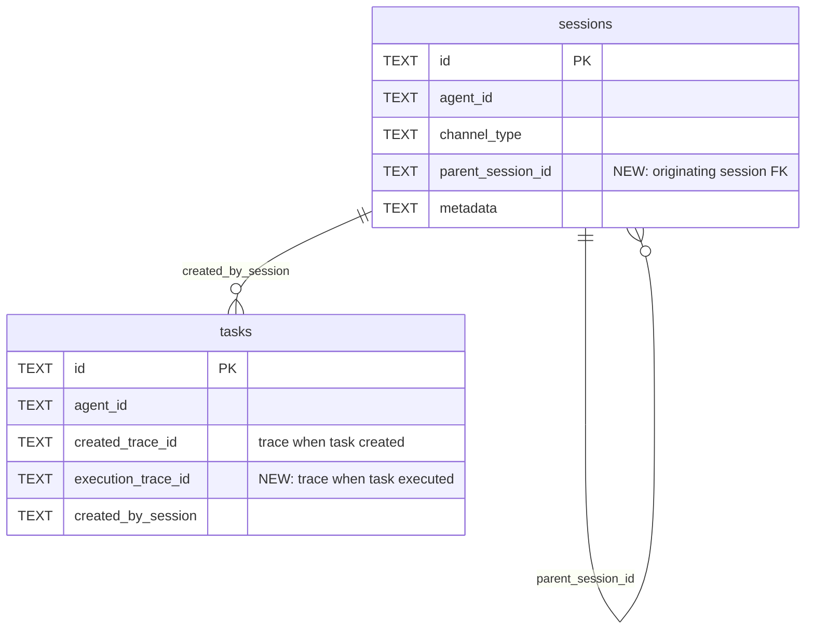

# Strengthen trace_id Structural Linkage

## Overview

Three structural gaps prevent end-to-end trace correlation across subsystems. Delegate agents generate disconnected trace_ids from their parent team run, silent agent execution trace_ids are never written back to the triggering task, and callback sessions have no link back to the originating conversation session. This plan closes all three gaps with schema v11 and targeted code changes.

## Problem Statement

The `unified_timeline` VIEW enables cross-subsystem queries by `trace_id`, but three propagation breaks limit its usefulness:

1. **Delegate agents in team runs** generate fresh `trace_id` at `agent.rs:1627` via `run_team_agent_inner_impl()`. The `TeamAgentParams` struct has no `trace_id` field. Result: delegate tool calls, audit events, and messages are invisible when querying by the team's trace_id.

2. **Silent agent execution** (heartbeat, callback, reflection, skill_run) generates fresh `trace_id` at `agent.rs:1425` via `run_silent_inner()`. The `tasks` table has `created_trace_id` (creation context) but no `execution_trace_id`. Result: you can find what created a task but not what happened when it ran.

3. **Callback sessions** (`callback-{uuid}`) have no `parent_session_id` FK. The task's `created_by_session` captures the originating session at task creation time, but the new session created by `dispatch_resume_agent` at `dispatcher.rs:264` is orphaned. Result: session chain traversal is broken.

## Proposed Solution

### Schema v11 Migration

Two `ALTER TABLE ADD COLUMN` statements (no table rebuild needed — no CHECK constraints involved):

```sql
-- crates/mika-agent/src/db.rs: migrate_v10_to_v11()
ALTER TABLE tasks ADD COLUMN execution_trace_id TEXT;
ALTER TABLE sessions ADD COLUMN parent_session_id TEXT;
CREATE INDEX IF NOT EXISTS idx_tasks_exec_trace ON tasks(execution_trace_id) WHERE execution_trace_id IS NOT NULL;
CREATE INDEX IF NOT EXISTS idx_sessions_parent ON sessions(parent_session_id) WHERE parent_session_id IS NOT NULL;
```

Update `unified_timeline` VIEW task leg: `COALESCE(execution_trace_id, created_trace_id) AS trace_id` — prefer execution trace when available, fall back to creation trace.

Update clean-slate schema (`create_schema()`) to include both new columns and indexes. Bump `CURRENT_SCHEMA_VERSION` to 11.

### ERD: New Columns



### Gap 1: Delegate Agent trace_id Propagation

**Pattern:** Add `trace_id: Option<String>` to `TeamAgentParams`. Use it in `run_team_agent_inner_impl()` instead of always generating fresh. Fall back to `generate_trace_id()` when `None`.

**Files:**
- `crates/mika-agent/src/agent.rs` — Add `trace_id` field to `TeamAgentParams` struct (~line 1519). In `run_team_agent_inner_impl()` (~line 1627), replace `let trace_id = generate_trace_id()` with `let trace_id = params.trace_id.unwrap_or_else(|| generate_trace_id())`.
- `crates/mika-agent/src/teams/engine.rs` — In `execute_tasks()` (~line 893), pass `self.trace_id.clone()` into `TeamAgentParams.trace_id`.
- `crates/mika-agent/src/tools/delegate_task.rs` — In `execute()` (~line 223), pass `Some(ctx.trace_id.to_string())` into `TeamAgentParams.trace_id`.

### Gap 2: Silent Agent Execution trace_id Writeback

**Pattern:** Add `trace_id: Option<String>` to `SilentAgentParams`. Dispatcher generates trace_id, passes it in, and writes it to the task as `execution_trace_id` after the run completes. Add `update_task_execution_trace_id(task_id, trace_id)` DB method.

**Files:**
- `crates/mika-agent/src/agent.rs` — Add `trace_id` field to `SilentAgentParams` (~line 1201). In `run_silent_inner()` (~line 1425), replace `let trace_id = generate_trace_id()` with `let trace_id = params.trace_id.unwrap_or_else(|| generate_trace_id())`.
- `crates/mika-agent/src/db.rs` — Add `execution_trace_id` to `Task` struct, `NewTask`, `TASK_COLUMNS` (28 columns), `TASK_COLUMN_COUNT` (28), `row_to_task()`. Add `update_task_execution_trace_id()` method.
- `crates/mika-agent/src/async_db.rs` — Add async wrapper for `update_task_execution_trace_id()`.
- `crates/mika-agent/src/task_engine/dispatcher.rs` — In each dispatch method (`dispatch_resume_agent`, `dispatch_heartbeat`, `dispatch_reflection`, `dispatch_skill_by_name`):
  1. Generate trace_id: `let trace_id = generate_trace_id()`
  2. Pass `Some(trace_id.clone())` into `SilentAgentParams.trace_id`
  3. After `run_silent_agent()` returns, call `db.update_task_execution_trace_id(task_id, &trace_id)`

### Gap 3: Callback Session parent_session_id

**Pattern:** Add `parent_session_id: Option<String>` to session creation. Populate from `task.created_by_session` when creating callback and skill_run sessions.

**Files:**
- `crates/mika-agent/src/db.rs` — Add `parent_session_id: Option<String>` to `Session` struct. Update `create_session_with_metadata()` to accept optional `parent_session_id`. Update clean-slate schema.
- `crates/mika-agent/src/async_db.rs` — Update async wrapper.
- `crates/mika-agent/src/task_engine/dispatcher.rs` — In `dispatch_resume_agent()` and `dispatch_skill_by_name()`, pass `task.created_by_session.as_deref()` as `parent_session_id` when creating the session. Heartbeat and reflection sessions get `None` (not triggered from user sessions).

**Scope limitation:** Team agent sessions (`team-{run_id}-{agent}`) do NOT get `parent_session_id` in this PR — they are already structurally linked by convention in the session ID.

## Technical Considerations

- **Column constant discipline:** `TASK_COLUMNS` and `TASK_COLUMN_COUNT` must be updated atomically with `Task` struct and `row_to_task()`. Per the `sql-column-mismatch-trace-detail-view` solution doc, positional index drift causes silent failures.
- **CLI/server parity:** The TUI callback path (`poll_callback_tasks`) reuses the existing session — no `parent_session_id` needed. Only the server-side `dispatch_resume_agent` creates orphaned sessions, so only it needs the fix.
- **Cross-agent query safety:** Per the `team-task-child-wrong-agent-id` solution doc, queries traversing `parent_task_id` or `team_run_id` must NOT filter by `agent_id`. The new `update_task_execution_trace_id()` should NOT scope by `agent_id` — the dispatcher may write execution_trace_id for tasks with different agent_ids.
- **`NewTask` struct:** The `execution_trace_id` field should always be `None` at creation time (it is written later by the dispatcher). No callers need to change.
- **Backward-compatible API:** `Session.parent_session_id` is `Option<String>` and serializes as `null` — dashboard TypeScript handles this gracefully.

## System-Wide Impact

- **unified_timeline VIEW:** Task leg changes from `created_trace_id AS trace_id` to `COALESCE(execution_trace_id, created_trace_id) AS trace_id`. Existing dashboard queries gain execution-time correlation automatically.
- **Dashboard:** No frontend changes required in this PR. `TraceDetail` page will automatically show delegate agent events when they share the team's trace_id. `parent_session_id` will appear in API responses as a nullable field.
- **Existing tests:** ~1290 tests. Migration tests will exercise v10→v11. Task/session tests may need updated struct construction.

## Acceptance Criteria

- [x] Schema v11 migration adds `execution_trace_id` to tasks and `parent_session_id` to sessions
- [x] Clean-slate schema matches migrated schema
- [x] Partial indexes created for both new columns
- [x] `unified_timeline` VIEW uses `COALESCE(execution_trace_id, created_trace_id)` for tasks
- [x] `TeamAgentParams.trace_id` field exists; team engine and delegate_task pass their trace_id
- [x] `run_team_agent_inner_impl` uses provided trace_id instead of generating fresh
- [x] `SilentAgentParams.trace_id` field exists; dispatcher generates and passes trace_id
- [x] `run_silent_inner` uses provided trace_id instead of generating fresh
- [x] Dispatcher writes `execution_trace_id` to task after silent agent run completes
- [x] Callback and skill_run sessions have `parent_session_id` from `task.created_by_session`
- [x] Heartbeat/reflection sessions have `parent_session_id = NULL`
- [x] `TASK_COLUMNS`, `TASK_COLUMN_COUNT`, `Task` struct, `row_to_task` updated atomically
- [x] `update_task_execution_trace_id` does NOT scope by `agent_id`
- [x] Tests: migration v10→v11, team agent trace propagation, execution_trace_id writeback, parent_session_id population

## Dependencies & Risks

- **Risk:** `row_to_task` positional index shift if `TASK_COLUMNS` order is wrong → mitigated by roundtrip test.
- **Risk:** `AsyncDatabase::get_task` filters by `agent_id` — dispatcher writing `execution_trace_id` for cross-agent tasks could silently fail → mitigated by making `update_task_execution_trace_id` NOT scope by `agent_id`.
- **Dependency:** Schema v10 must be current (it is — v9→v10 was the last migration).

## Sources & References

- **Issue:** [#161 — Strengthen trace_id structural linkage (Priority 2)](https://github.com/senara-solutions/mika/issues/161)
- **Solution doc:** `docs/solutions/database-issues/trace-id-observability-gaps-callback-team-timeline.md` — prevention checklist
- **Solution doc:** `docs/solutions/architecture-patterns/trace-id-correlation-unified-observability.md` — two-axis correlation model
- **Solution doc:** `docs/solutions/database-issues/sql-column-mismatch-trace-detail-view.md` — column constant discipline
- **Solution doc:** `docs/solutions/database-issues/team-task-child-wrong-agent-id.md` — cross-agent query safety
