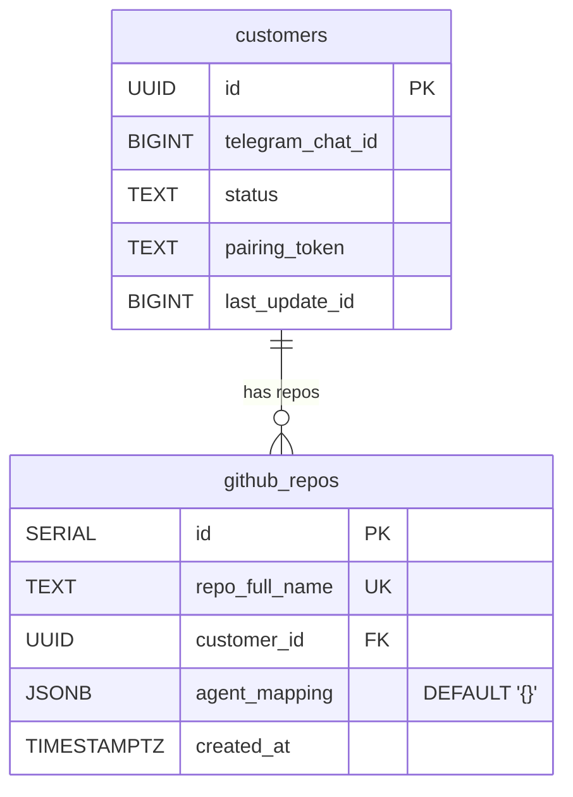

# feat(gateway): Multi-Tenant GitHub Webhook Routing — agent_mapping and Strict Mode

## Overview

Enhance the existing `github_repos` multi-tenant routing infrastructure with per-repo agent name overrides (`agent_mapping` JSONB column) and stricter authorization behavior when multi-tenant mode is active. The core routing lookup (`resolve_github_container_url()` + migration 004) already exists — this issue completes the feature.

## Current State

**Already implemented:**
- Migration 004: `github_repos(id, repo_full_name, customer_id, created_at)` with unique index on `repo_full_name`
- `resolve_github_container_url()` queries `github_repos` → constructs FQDN, falls back to `agent_base_url`
- `forward_github_event()` passes `repo_full_name` to the resolver
- `route_event()` returns hardcoded `&'static str` agent names (`"mika-dev"`, `"mika-qa"`)

**Gaps addressed by this plan:**
1. No `agent_mapping` column — cannot override agent names per customer/repo
2. Agent names hardcoded — all customers get the same `mika-dev`/`mika-qa` names
3. Fallback behavior is always permissive — unregistered repos route to `agent_base_url` even when multi-tenant `github_repos` entries exist
4. No structured logging for authorization decisions

## Proposed Solution

### 1. New Migration: Add `agent_mapping` Column

**File:** `crates/mika-gateway/migrations/005_github_repos_agent_mapping.sql`

```sql
ALTER TABLE github_repos ADD COLUMN agent_mapping JSONB NOT NULL DEFAULT '{}';
```

**Schema for `agent_mapping`:** Keys are the hardcoded agent names from `route_event()` output, values are the replacement agent names for this customer's repo.

```json
{
  "mika-dev": "acme-dev",
  "mika-qa": "acme-qa"
}
```

Empty `{}` means "use default agent names from `route_event()`." This is the zero-config default — existing rows (if any) are unaffected.

**Why not per-event-type keys?** Simpler schema, covers the primary use case (each customer has different agent container names), and `route_event()` remains the single source of truth for which events are routable. Expanding routability per-customer is a separate feature.

### 2. Apply Agent Mapping After Routing

**File:** `crates/mika-gateway/src/github.rs`

New function `apply_agent_mapping()`:

```rust
/// Apply per-repo agent name overrides from the `agent_mapping` JSONB column.
/// Returns the original agent name if no override exists for this agent.
fn apply_agent_mapping(
    agent_mapping: &serde_json::Value,
    default_agent: &str,
) -> String {
    agent_mapping
        .get(default_agent)
        .and_then(|v| v.as_str())
        .filter(|s| !s.is_empty())
        .unwrap_or(default_agent)
        .to_string()
}
```

**Call site:** In `handle_github_webhook()`, after `route_event()` determines the default agent name, pass it through `apply_agent_mapping()` with the mapping from the DB lookup.

### 3. Refactor `resolve_github_container_url()` to Return Mapping

Currently returns `Option<String>` (just the URL). Refactor to return a struct carrying both URL and agent mapping:

```rust
struct ResolvedRoute {
    container_url: String,
    agent_mapping: serde_json::Value,
}
```

The query changes from:
```sql
SELECT customer_id FROM github_repos WHERE repo_full_name = $1
```
to:
```sql
SELECT customer_id, agent_mapping FROM github_repos WHERE repo_full_name = $1
```

### 4. Tighten Fallback Behavior

**Decision: Keep `agent_base_url` fallback, but warn when mixed mode is detected.**

Rationale from SpecFlow analysis:
- Removing `agent_base_url` fallback breaks all single-tenant deployments (breaking change with no migration path)
- The current behavior is correct for single-tenant: no `github_repos` rows → fallback to `agent_base_url`
- The current behavior is also correct for multi-tenant: `github_repos` row found → route to customer FQDN

**What changes:** When a `github_repos` lookup returns no match AND `agent_base_url` is set, log at `warn!` level (currently `debug!`). This surfaces misconfigured repos in multi-tenant mode while preserving single-tenant functionality.

When a `github_repos` lookup returns no match AND `agent_base_url` is NOT set, the event is already dropped with a `debug!` log. Upgrade to `warn!` for operational visibility.

**Not adding an env var gate.** The behavior is already correct — multi-tenant mode (K8s with FQDN routing) naturally rejects unregistered repos because there's no `agent_base_url` to fall back to. Single-tenant mode (with `agent_base_url`) always routes to the single container. No configuration knob needed.

### 5. Structured Logging for Authorization Decisions

Add structured log fields to all routing decision points:

```rust
// Registered repo — route to customer
info!(
    repo = repo_name,
    customer_id = %customer_id,
    agent_mapping_active = !agent_mapping.is_null() && agent_mapping != json!({}),
    "resolved GitHub repo to customer"
);

// Unregistered repo — fallback
warn!(
    repo = repo_name,
    fallback = "agent_base_url",
    "GitHub repo not registered, falling back to single-tenant routing"
);

// Unregistered repo — dropped (multi-tenant, no fallback)
warn!(
    repo = repo_name,
    "GitHub repo not registered and no fallback configured, dropping event"
);
```

## Technical Considerations

### Migration Safety

- `ALTER TABLE ... ADD COLUMN ... DEFAULT` is a metadata-only operation in Postgres (no table rewrite for non-volatile defaults since PG 11). Safe for online execution.
- `JSONB NOT NULL DEFAULT '{}'` ensures existing rows get an empty mapping without data migration.
- `build.rs` with `cargo::rerun-if-changed=migrations` ensures new migration is picked up. (Documented gotcha from `docs/solutions/build-errors/sqlx-migration-stale-incremental-cache.md`.)

### Deserialization Safety

- `agent_mapping` is read as `serde_json::Value` (not a strongly-typed struct) to avoid deserialization failures on unexpected keys. (Lesson from `docs/solutions/runtime-errors/github-webhook-parse-fails-missing-app-id.md` — use `Option<T>` / flexible types for data that varies.)
- `apply_agent_mapping()` validates that the override value is a non-empty string before using it.

### Backward Compatibility

- Empty `agent_mapping` (`{}`) preserves existing behavior — no agent name remapping.
- `agent_base_url` fallback preserved for single-tenant deployments.
- No new environment variables required.
- Pre-1.0: no backward compatibility guarantees required, but this change is naturally backward-compatible anyway.

### Performance

- Single additional column in an already-executed query — negligible overhead.
- `agent_mapping` JSONB parsing happens once per webhook event, in-memory.
- No new DB queries introduced.

## System-Wide Impact

- **Interaction graph:** Webhook arrives → HMAC validation → dedup → parse → `route_event()` → `resolve_github_container_url()` (now returns `ResolvedRoute`) → `apply_agent_mapping()` → `forward_github_event()` → agent container `/message`. No new callbacks or observers.
- **Error propagation:** DB query failure in `resolve_github_container_url()` still falls through to `agent_base_url` (unchanged). Invalid `agent_mapping` JSON gracefully falls back to default agent name.
- **State lifecycle risks:** None — `agent_mapping` is read-only from the gateway's perspective. Stale mappings are a data management concern (follow-up: admin API).
- **API surface parity:** No other interfaces expose similar functionality. The A2A proxy routes by `customer_id` in the URL path, not by repo lookup.

## Acceptance Criteria

- [x] Migration 005 adds `agent_mapping JSONB NOT NULL DEFAULT '{}'` to `github_repos`
- [x] `resolve_github_container_url()` returns both URL and `agent_mapping`
- [x] `apply_agent_mapping()` remaps agent names when mapping has a matching key
- [x] Empty/null `agent_mapping` preserves default `route_event()` agent names
- [x] Unregistered repos in multi-tenant mode (no `agent_base_url`) logged at `warn!`
- [x] Unregistered repos in single-tenant mode (`agent_base_url` set) logged at `warn!` with fallback indication
- [x] Agent name after mapping is used in the forwarded `/message` payload
- [x] Existing tests pass (no behavioral regression for current flows)
- [x] New unit tests for `apply_agent_mapping()` (empty mapping, valid override, missing key, empty-string value, non-string value)
- [x] New unit tests for `route_event()` remain unchanged (agent mapping is applied externally)
- [x] Integration test: registered repo with agent mapping routes to correct customer with remapped agent name
- [x] Integration test: registered repo without agent mapping routes to correct customer with default agent name

## MVP Implementation

### `crates/mika-gateway/migrations/005_github_repos_agent_mapping.sql`

```sql
-- Add per-repo agent name overrides for multi-tenant webhook routing.
-- Keys are default agent names from route_event() (e.g. "mika-dev"),
-- values are the customer's replacement agent names (e.g. "acme-dev").
-- Empty {} means use defaults.
ALTER TABLE github_repos ADD COLUMN agent_mapping JSONB NOT NULL DEFAULT '{}';
```

### `crates/mika-gateway/src/github.rs` — Key Changes

```rust
/// Result of resolving a GitHub repo to a customer container.
struct ResolvedRoute {
    container_url: String,
    agent_mapping: serde_json::Value,
}

/// Apply per-repo agent name overrides.
fn apply_agent_mapping(agent_mapping: &serde_json::Value, default_agent: &str) -> String {
    agent_mapping
        .get(default_agent)
        .and_then(|v| v.as_str())
        .filter(|s| !s.is_empty())
        .unwrap_or(default_agent)
        .to_string()
}
```

### ERD



## Deferred / Follow-up

- **Admin API for `github_repos` management** — CRUD endpoints for registering/unregistering repos (currently direct SQL)
- **Repo rename handling** — listen for `repository.renamed`/`repository.transferred` events to update `full_name`
- **Customer status check** — JOIN `customers` table to filter suspended accounts
- **Per-installation webhook secrets** — currently single shared `MIKA_GITHUB_WEBHOOK_SECRET`
- **Expandable routing** — per-repo custom event routing rules beyond agent name remapping

## Sources

- Related issue: #411
- Existing implementation: `crates/mika-gateway/src/github.rs` (lines 448-489 — `resolve_github_container_url()`)
- Existing migration: `crates/mika-gateway/migrations/004_github_repos.sql`
- Learnings: `docs/solutions/build-errors/sqlx-migration-stale-incremental-cache.md`
- Learnings: `docs/solutions/runtime-errors/github-webhook-parse-fails-missing-app-id.md`
- Learnings: `docs/solutions/architecture/github-app-identity-and-agent-infrastructure.md`
