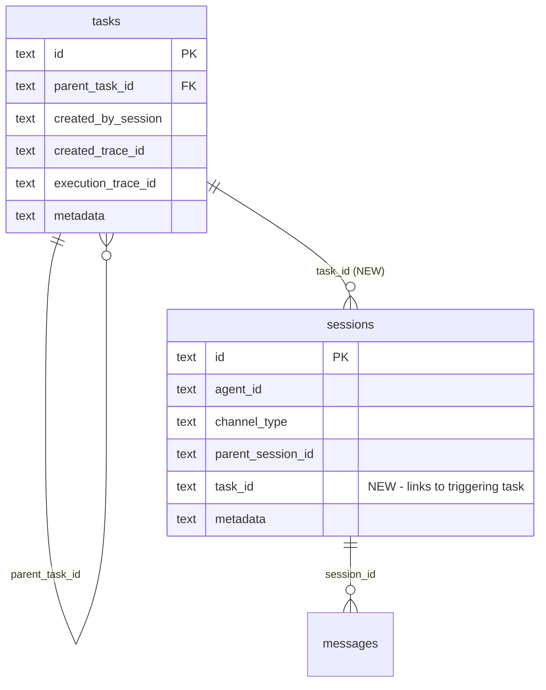

# Dashboard: Link claude-pilot sessions and child tasks to parent task

## Overview

The task detail page (`/dashboard/tasks/:id`) shows child tasks but doesn't link them to their sessions or traces. Sessions spawned by tasks have no reverse link. This feature adds bidirectional navigation between tasks and sessions — both rendering existing data that is already available but not displayed, and adding a new `task_id` column on sessions for reverse lookups.

## Problem Statement

When auditing dev runs or debugging task trees, users must manually correlate sessions to tasks via timestamps. The dashboard has the data but doesn't connect it:

1. **Child task rows** already have `created_by_session`, `created_trace_id`, and `execution_trace_id` in the API response — they just aren't rendered
2. **Callback/reminder sessions** are spawned by tasks but have no column linking back to the task
3. **CLI `--task-id` sessions** store `task_id` in JSON metadata only — no indexed column for efficient queries
4. **No "Sessions" section** exists on the task detail page to show all sessions in the task tree

## Proposed Solution

Three layers of work, ordered by dependency:

### Layer 1: Frontend-only — render existing child task links (no backend changes)

Update `TaskDetail.tsx` child task rows to show SESSION and TRACE badges using data already in `TaskResponse`.

### Layer 2: Schema v19 — add `task_id` column to sessions

Simple `ALTER TABLE` migration (no full rebuild needed — no CHECK constraints to widen):
- Add `task_id TEXT` column
- Add partial index for efficient lookups
- Backfill from existing `json_extract(metadata, '$.task_id')`

### Layer 3: Backend API + Frontend — sessions-for-task endpoint and Sessions section

New endpoint `GET /api/v1/tasks/:id/sessions` that collects all task IDs in the tree (parent + children) and returns linked sessions. Frontend renders a new "Sessions" card on the task detail page.

## Technical Approach

### Semantic of `session.task_id`

**Definition:** The task that directly caused this session to be created (the immediate trigger task).

- For callback sessions: the callback task's own ID (not the parent work item)
- For CLI `--task-id` sessions: the correlated task ID passed via CLI flag
- For delegate sessions: the work_item_id from delegate metadata (already available at creation time)
- For team sessions: skip for now — team runs have their own dedicated page, and `team_run_id` in metadata provides linkage

The parent work item can always be found via `tasks.parent_task_id` joins — keeping `task_id` normalized avoids denormalization and dual-source-of-truth issues.

### Phase 1: Schema Migration (v18 → v19)

**File:** `crates/mika-agent/src/db.rs`

```sql
-- Simple ALTER TABLE (no full rebuild needed)
ALTER TABLE sessions ADD COLUMN task_id TEXT;

-- Partial index for efficient reverse lookups
CREATE INDEX idx_sessions_task_id ON sessions(task_id) WHERE task_id IS NOT NULL;

-- Backfill from existing metadata JSON
UPDATE sessions SET task_id = json_extract(metadata, '$.task_id')
  WHERE json_extract(metadata, '$.task_id') IS NOT NULL;
```

Update `CURRENT_SCHEMA_VERSION` to 19. No `unified_timeline` VIEW changes needed — the VIEW doesn't include session-level `task_id`.

**Rust struct changes:**
- Add `task_id: Option<String>` to `Session` struct
- Add `task_id: Option<String>` to `SessionWithStats` struct
- Update `list_sessions_paginated` to use `COALESCE(s.task_id, json_extract(s.metadata, '$.task_id'))` for the task_id filter (backward compatible during transition)

### Phase 2: Session Creation — thread task_id

Add `task_id: Option<&str>` parameter to session creation functions. Four call sites need updates:

| Call site | File | task_id source |
|---|---|---|
| `mika ask --task-id` | `crates/mika-cli/src/commands/ask.rs` | CLI argument (already in scope) |
| Callback dispatch | `crates/mika-agent/src/task_engine/dispatcher.rs:346-362` | `task.id` (already in scope) |
| Reminder dispatch | Same dispatcher | `task.id` (already in scope) |
| Delegate task | `crates/mika-agent/src/tools/delegate_task.rs:244-255` | `work_item_id` from delegate metadata |

**Session creation function strategy:** Rather than adding yet another parameter to 4 overloaded functions, consolidate into `create_session_with_parent()` which already takes the most parameters. Add `task_id` as an `Option<&str>` there. Callers that don't need parent or task_id pass `None`. This avoids signature explosion.

Alternatively, add a new `create_session_full()` function that takes all optional fields and have the other functions delegate to it. The simpler approach: just add `task_id` to `create_session_with_metadata()` and `create_session_with_parent()` since those are the only variants used by the affected call sites.

### Phase 3: Backend API — task sessions endpoint

**New endpoint:** `GET /api/v1/tasks/:id/sessions`

```
GET /api/v1/tasks/:id/sessions
Authorization: Bearer <dashboard_token>

Response: {
  sessions: [
    {
      id: string,
      agent_id: string,
      channel_type: string,
      started_at: string,
      ended_at: string | null,
      task_id: string | null,
      task_label: string | null,  // denormalized for display
      message_count: number
    }
  ]
}
```

**Backend logic (4-layer pattern):**

1. **db.rs:** `get_sessions_for_task_tree(task_id) -> Vec<TaskSessionRow>`
   - Query: collect task IDs (parent + direct children via `parent_task_id`), then find sessions where `task_id IN (...)` or `COALESCE(task_id, json_extract(metadata, '$.task_id')) IN (...)`
   - Limit tree depth to 2 levels (parent + children) — sufficient for current task trees
   - Join with message count for stats

2. **async_db.rs:** `get_sessions_for_task_tree(task_id)` async wrapper

3. **dashboard.rs:** `handle_task_sessions(task_id)` handler
   - Maps `TaskSessionRow` → `TaskSessionResponse`

4. **mod.rs:** Route `.route("/api/v1/tasks/:id/sessions", get(handle_task_sessions))`

**Also update existing responses:**
- Add `task_id: Option<String>` to `SessionResponse` (list endpoint)
- No changes to `TaskResponse` or `TaskDetailResponse` needed — child tasks already carry `created_by_session` and trace IDs

### Phase 4: Frontend — child task links + Sessions section

**4a. Child task row links** (`dashboard/src/pages/TaskDetail.tsx`)

Update the child task list (currently lines 186-209) to render SESSION and TRACE badges for each child, using the existing `created_by_session`, `created_trace_id`, and `execution_trace_id` fields already in `TaskResponse`:

```tsx
{child.created_by_session && (
  <Link to={`/sessions/${child.created_by_session}`}>SESSION</Link>
)}
{child.execution_trace_id && (
  <Link to={`/traces/${child.execution_trace_id}`}>TRACE</Link>
)}
```

Conditional rendering — only show links when the field is non-null (e.g., `send_message` tasks won't have sessions).

**4b. Sessions section** (`dashboard/src/pages/TaskDetail.tsx`)

New card after the child tasks section:

```tsx
// New API call
const { data: taskSessions } = useQuery({
  queryKey: ['task-sessions', taskId],
  queryFn: () => fetchTaskSessions(taskId),
  enabled: !!taskId,
});

// Render as a card with table
<Card title="Sessions">
  {taskSessions?.sessions.map(session => (
    <Row>
      <Link to={`/sessions/${session.id}`}>{session.id}</Link>
      <span>{session.channel_type}</span>
      <span>{formatTime(session.started_at)}</span>
      <span>{session.ended_at ? duration(session.started_at, session.ended_at) : 'ongoing'}</span>
      <span>{session.message_count} messages</span>
      {session.task_label && <span>Task: {session.task_label}</span>}
    </Row>
  ))}
  {taskSessions?.sessions.length === 0 && <EmptyState message="No sessions" />}
</Card>
```

**4c. API types** (`dashboard/src/api/tasks.ts`)

```typescript
interface TaskSession {
  id: string;
  agent_id: string;
  channel_type: string;
  started_at: string;
  ended_at: string | null;
  task_id: string | null;
  task_label: string | null;
  message_count: number;
}

interface TaskSessionsResponse {
  sessions: TaskSession[];
}

function fetchTaskSessions(taskId: string): Promise<TaskSessionsResponse>;
```

## System-Wide Impact

- **Interaction graph:** Schema migration runs on startup → session creation paths write `task_id` → dashboard API reads it → frontend renders links. No callbacks/middleware affected.
- **Error propagation:** `task_id` is nullable and optional everywhere. Missing `task_id` degrades gracefully (no link rendered). Migration backfill failures are non-fatal (partial data is fine).
- **State lifecycle risks:** None. `task_id` is write-once at session creation. No partial-failure scenarios. Existing sessions without `task_id` simply show no link.
- **API surface parity:** Only dashboard read APIs affected (new endpoint + field additions). All additive — no breaking changes. Frontend TypeScript types need matching updates.

## Acceptance Criteria

- [x] **Schema v19:** `sessions` table has `task_id TEXT` column with partial index. Backfill populates from metadata JSON.
- [x] **Session creation:** Callback, reminder, and CLI `--task-id` session creation paths populate `task_id` column.
- [x] **Child task links:** Each child task row on task detail page shows clickable SESSION and TRACE links (conditional on data presence).
- [x] **Sessions endpoint:** `GET /api/v1/tasks/:id/sessions` returns all sessions linked to the task tree.
- [x] **Sessions section:** Task detail page shows "Sessions" card listing all sessions for the task tree with timestamps, channel type, duration, and message count.
- [x] **Empty states:** Sessions section only renders when sessions exist (conditional rendering).
- [x] **Tests:** Migration test, db getter test, COALESCE backward compat test, backfill compat test, session creation with task_id test.

## ERD



## Implementation Files

### Backend (Rust)

| File | Change |
|---|---|
| `crates/mika-agent/src/db.rs` | Schema v19 migration, `Session` struct update, `create_session_with_metadata()`/`create_session_with_parent()` add `task_id` param, `get_sessions_for_task_tree()` query, update `list_sessions_paginated` filter |
| `crates/mika-agent/src/async_db.rs` | Async wrapper for `get_sessions_for_task_tree()` |
| `crates/mika-agent/src/server/dashboard.rs` | `TaskSessionResponse` type, `handle_task_sessions()` handler, add `task_id` to `SessionResponse` |
| `crates/mika-agent/src/server/mod.rs` | Route `/api/v1/tasks/:id/sessions` |
| `crates/mika-agent/src/task_engine/dispatcher.rs` | Pass `task.id` as `task_id` to callback/reminder session creation |
| `crates/mika-cli/src/commands/ask.rs` | Pass CLI `--task-id` as `task_id` to session creation |
| `crates/mika-agent/src/tools/delegate_task.rs` | Pass `work_item_id` as `task_id` to delegate session creation |

### Frontend (TypeScript/React)

| File | Change |
|---|---|
| `dashboard/src/pages/TaskDetail.tsx` | Child task SESSION/TRACE badges, new Sessions card |
| `dashboard/src/api/tasks.ts` | `TaskSession` type, `fetchTaskSessions()` function |

## Sources

- Related issue: #436
- Pattern: `docs/solutions/dashboard-issues/add-restful-detail-pages-pattern.md` — 4-layer backend pattern
- Pattern: `docs/solutions/architecture-patterns/trace-id-structural-linkage-delegate-silent-callback.md` — session/trace linking
- Pattern: `docs/solutions/architecture-patterns/engine-level-callback-metadata-extraction.md` — claude_pilot metadata
- Pattern: `docs/solutions/architecture-patterns/task-id-correlation-intermediate-calls.md` — CLI --task-id flow
