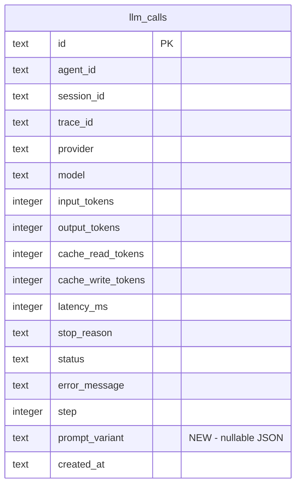

# Record Resolved Prompt Variant on llm_calls

## Overview

`SkillEntry::resolve_prompt()` silently resolves the best prompt through a 4-step fallback chain (hand-authored model variant -> generated model variant -> generated canonical variant -> base prompt). No metadata about which step won is recorded anywhere — not in logs, not in DB. This makes it impossible to verify that per-model prompt variants are actually being used in production turns, blocking the calibration workflow.

## Problem Statement

1. **Audit blindness:** Dashboard LLM call detail pages show provider/model but not which skill prompt variant was loaded. No way to tell if a `generated/deepseek/deepseek-v3.2/system_prompt.md` variant was used or if the engine fell back to base.
2. **Calibration unverifiable:** The model calibration workflow (`review_skill` generates variants -> deploy -> measure) has no "measure" step — we cannot confirm variants are being used.
3. **OpenRouter opacity:** Aggregator-namespace fallback (openrouter -> canonical provider) is completely silent. If canonical-key lookup misses, the base prompt is served with zero signal.

## Proposed Solution

Two complementary changes:

### 1. Return variant metadata from `resolve_prompt()`

Create a `ResolvedPrompt` struct that bundles the prompt text reference with a `PromptVariantSource` enum describing which fallback step won:

```rust
pub enum PromptVariantSource {
    HandAuthoredModel,   // step 1: model_prompts[requesting_key]
    GeneratedModel,      // step 2: generated_model_prompts[requesting_key]
    GeneratedCanonical,  // step 3: generated_model_prompts[canonical_key]
    Base,                // step 4: prompt_snippet
}

pub struct ResolvedPrompt<'a> {
    pub text: &'a str,
    pub source: PromptVariantSource,
    pub key: Option<String>,  // e.g., "anthropic/claude-sonnet-4-6" — None for Base
}
```

Add `tracing::debug!` instrumentation at the resolution site.

### 2. New `prompt_variant TEXT` column on `llm_calls`

Schema migration v20->v21. Nullable column. Populated with a compact JSON object mapping skill names to their resolved variant source:

```json
{"web-search": "base", "self-dev": "generated_model:anthropic/claude-sonnet-4-6"}
```

Format: `{source}` for base, `{source}:{key}` for variant hits. Machine-readable identifiers (`base`, `hand_authored_model`, `generated_model`, `generated_canonical`).

## Technical Approach

### Data flow

```
inject_skills_and_resolve_tools()
  -> calls entry.resolve_prompt(provider, model) per skill
  -> captures HashMap<skill_name, variant_descriptor>
  -> serializes to JSON string
  -> returns alongside tool_defs

run_loop(prompt_variant: Option<String>, ...)
  -> passes prompt_variant to save_llm_call() for every LLM call in the turn
```

### Design decisions

| Decision | Choice | Rationale |
|----------|--------|-----------|
| Column format | JSON TEXT, nullable | Preserves skill-to-variant mapping; NULL when no skills active |
| Per-call vs per-turn | Per-call (same value repeated) | Variant data is constant within a `run_loop()` invocation; storing per-call is simpler and aligns with the existing schema pattern |
| Empty prompts | Omit from variant map | Matches current behavior where empty prompts are skipped in system prompt injection |
| Error LLM calls | Record variant data | Variant describes what was *requested*, not what *succeeded* |
| VIEW recreation | Not needed | `unified_timeline` VIEW does not reference `prompt_variant` |
| `resolve_prompt` return type | New `ResolvedPrompt<'a>` struct | Avoids breaking the existing `&str` API too aggressively — callers that don't need variant info can use `.text` |

## Acceptance Criteria

- [x] `SkillEntry::resolve_prompt()` returns `ResolvedPrompt` with source + key metadata
- [x] `tracing::debug!` event emitted per skill resolution with skill name, source, and key
- [x] Schema migration v20->v21 adds `prompt_variant TEXT` to `llm_calls`
- [x] `save_llm_call()` (sync + async) accepts and stores `prompt_variant`
- [x] `run_loop()` receives `prompt_variant` and threads it to both success/error `save_llm_call()` paths
- [x] `inject_skills_and_resolve_tools()` returns variant map alongside tool definitions
- [x] All 3 call paths thread variant data: conversation mode, silent mode, team mode
- [x] `LlmCallRow` Rust struct includes `prompt_variant: Option<String>`
- [x] Dashboard `LlmCallRow` TypeScript interface includes `prompt_variant: string | null`
- [x] `LlmCallDetail.tsx` renders prompt variant when present
- [x] Unit test: `resolve_prompt` returns correct source for each of the 4 fallback steps
- [x] Clean-slate schema SQL updated with new column
- [x] `row_to_llm_call()` mapper updated for new column index

## MVP

### Phase 1: Core resolution metadata

#### `crates/mika-agent/src/skills/index.rs`

- Add `PromptVariantSource` enum with `Display` impl (produces `base`, `hand_authored_model`, `generated_model`, `generated_canonical`)
- Add `ResolvedPrompt<'a>` struct with `text: &'a str`, `source: PromptVariantSource`, `key: Option<String>`
- Change `resolve_prompt()` return type from `&str` to `ResolvedPrompt<'_>`
- Add `tracing::debug!` at the end of `resolve_prompt()` with fields: `skill`, `variant_source`, `variant_key`
- Add `format_variant_descriptor()` method on `ResolvedPrompt` -> produces `"base"` or `"generated_model:anthropic/claude-sonnet-4-6"`

#### `crates/mika-agent/src/agent.rs` — `inject_skills_and_resolve_tools()`

- Change return type to `(Vec<ToolDefinition>, Option<String>)` where second element is the serialized JSON variant map
- Capture variant info per skill during iteration; skip skills with empty resolved prompts
- Serialize `HashMap<String, String>` (skill_name -> variant_descriptor) to JSON; return `None` if empty

#### `crates/mika-agent/src/agent.rs` — `run_loop()`

- Add `prompt_variant: Option<&str>` parameter
- Pass to both `save_llm_call()` call sites (success at line ~628, error at line ~651)

#### `crates/mika-agent/src/agent.rs` — all `run_loop()` callers

- `run_agent()` (conversation mode): capture variant from `inject_skills_and_resolve_tools()`, pass to `run_loop()`
- `run_silent_agent()` (silent mode): same pattern
- `run_team_agent_inner_impl()` (team mode): same pattern

### Phase 2: Database layer

#### `crates/mika-agent/src/db.rs`

- Add `prompt_variant TEXT` to clean-slate `llm_calls` CREATE TABLE
- Add `fn migrate_v20_to_v21()`: `ALTER TABLE llm_calls ADD COLUMN prompt_variant TEXT` with `column_exists()` guard
- Update migration chain dispatch
- Bump `CURRENT_SCHEMA_VERSION` to 21
- Update `Database::save_llm_call()`: add `prompt_variant: Option<&str>` parameter, update INSERT SQL to include it
- Update `LlmCallRow` struct: add `prompt_variant: Option<String>`
- Update `row_to_llm_call()`: read new column (adjust column indices)
- Update all `SELECT` queries that read from `llm_calls` to include the new column

#### `crates/mika-agent/src/db.rs` — async wrapper

- Update `AsyncDatabase::save_llm_call()`: add `prompt_variant: Option<String>` parameter, thread to sync call

### Phase 3: Dashboard

#### `dashboard/src/api/llmCalls.ts`

- Add `prompt_variant: string | null` to `LlmCallRow` interface

#### `dashboard/src/pages/LlmCallDetail.tsx`

- Add metadata row for "Skill Variants" when `prompt_variant` is non-null
- Parse JSON and display as a readable list (e.g., `web-search: base, self-dev: generated_model:anthropic/claude-sonnet-4-6`)

### Phase 4: Tests

#### `crates/mika-agent/src/skills/index.rs` — unit tests

- Test `resolve_prompt` returns `Base` source when no variants exist
- Test `resolve_prompt` returns `HandAuthoredModel` when hand-authored variant exists
- Test `resolve_prompt` returns `GeneratedModel` when generated variant exists (no hand-authored)
- Test `resolve_prompt` returns `GeneratedCanonical` when only canonical generated variant exists (OpenRouter -> underlying provider)
- Test `format_variant_descriptor()` produces correct strings

## ERD



## Sources

- GitHub issue: [#481](https://github.com/senara-solutions/mika/issues/481)
- Related: `docs/solutions/architecture-patterns/per-provider-skill-variant-directories.md`
- Related: `docs/solutions/architecture-patterns/runtime-observability-llm-tool-call-recording.md`
- Related: `docs/solutions/database-issues/trace-id-as-observability-join-key.md`
- Precedent migration: v15->v16 (added `step` column to `llm_calls`)
