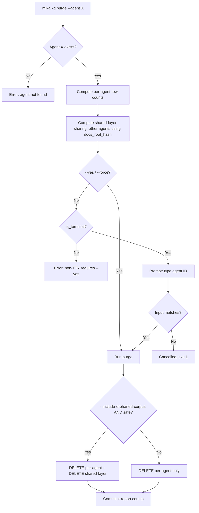

# feat(cli): KG management subcommands — mika kg status / list-agents / purge / validate

## Overview

The first four tickets in Milestone #17 make KG state per-agent-configurable and shared-by-docs_root_hash. This last ticket ships the operator-facing surface that makes all that state inspectable and manageable without raw SQL. Four subcommands: `mika kg status` (summary + per-agent detail), `mika kg list-agents` (quick enumeration), `mika kg purge --agent X` (remove an agent's per-agent KG state with typed-ID confirmation), `mika kg validate` (orphan/invariant checks with `[OK]/[WARN]/[FAIL]` output).

Two design threads tie the subcommands together. First, the status output **structurally teaches the shared-corpus model** — a top-level summary grouped by `docs_root_hash` shows which agents share which corpus, so "purge doesn't delete shared rows" follows visibly from what the operator already sees. Second, the subcommands follow the established `mika skills` + `mika agents validate` prior art (single-file `commands/kg.rs`, nested `KgCommand` enum, `OutputFormat` for `--format text|json`, exhaustive-match updates in `agent_override()`) rather than inventing new CLI shapes.

One net-new pattern: `mika kg purge` requires the operator to type the exact agent ID to confirm (not y/n). No prior doc covers typed-identifier destructive confirmation — #779 sets the precedent and will spawn a compound doc post-merge so `mika agents delete` (and other destructive ops) can adopt the same pattern.

## Problem Frame

Today KG state is invisible from the CLI. When an agent's startup emits the `#778` WARN (`agent X has docs_root pointing at <path> with hash <hash>; no matching rows in shared corpus`), operators drop to `sqlite3 ~/.mika/data/mika.db` to investigate. That raw-SQL cost for every inspection teaches operators the wrong mental model (KG state is only visible through schema internals) and makes routine cleanup (e.g., purging an agent's resolutions after a config change) an error-prone manual exercise.

The parallel with skills is exact: `mika skills list/install/uninstall` exists because skills are agent-scoped state operators routinely inspect and manage. Post-Milestone-#17, KG is agent-scoped state of the same shape. The ticket body calls out a specific operator-ergonomic cost: #778's startup WARN says "Use `mika kg purge --agent X` to clean up." That command doesn't exist; the WARN currently points at a non-existent tool. #779 makes the WARN honest.

Beyond the WARN, the subcommands enable the scenarios Milestone #17 was built for: the odds-engine team (`odds-engine-{ceo,cto,quant}`) will post-merge transition from shared platform-docs corpus to their own trading-domain corpus. Operators need to see the transition (`mika kg status` shows drift / new corpus), accept it (`mika kg purge --agent odds-engine-ceo` removes stale per-agent resolutions), and verify cleanliness (`mika kg validate` confirms no orphan FKs).

## Requirements Trace

- **R1.** `mika kg` subcommand group registered in clap with nested `KgCommand::{Status, ListAgents, Purge, Validate}` enum. Follows the `mika skills` single-file pattern.
- **R2.** `mika kg status` — summary line (total agents, unique corpora grouped by `docs_root_hash`) + per-agent detail table (chunks, subjects, resolved, pending, last_extraction). `--agent X` filters to one agent with extended detail. `--format text|json`.
- **R3.** `mika kg list-agents` — quick enumeration of `(agent_name, enabled, docs_root, docs_root_hash, chunk_count)`. Minimal output; faster than `status`. `--format text|json`.
- **R4.** `mika kg purge --agent X` — interactive typed-ID confirmation (operator types the agent ID exactly); `--yes` / `--force` bypass for scripting; `is_terminal()` guard so non-TTY contexts require `--yes`; transactional delete from `kg_subject_resolutions` and `kg_resolutions_log` where `agent_id = X`; output per-table row counts. `--format text|json`. Default does NOT delete shared-layer rows; `--include-orphaned-corpus` flag for the "no other agent references this hash" case.
- **R5.** `mika kg validate` — orphan checks across KG tables (`kg_chunk_subjects`, `kg_chunk_subject_relationships`, `kg_subject_resolutions`, `kg_resolutions_log` → FKs into `kg_chunks`/`kg_subject_entities`/`kg_subject_relationships`/`kg_entities`); NULL `source_doc_hash` check on `kg_chunks`; reuses `SkillDiagnostic`/`DiagnosticLevel::{Ok,Warn,Fail}` from `crates/mika-agent/src/validate.rs`. Exit 0 on clean, exit 1 on any Fail. `--format text|json`.
- **R6.** `--agent` flag on `Purge` and `ListAgents` (and optionally on `Status` for single-agent detail) uses the `AgentFlag` pattern flattened into `KgPurgeArgs`/`KgListAgentsArgs`. Exhaustive match in `agent_override()` updated to include the new `Commands::Kg(..)` variant.
- **R7.** Shared-corpus structural teaching — `status`'s summary line groups agents by `docs_root_hash`. Output makes visible which agents share which corpus, so operators understand why `purge` doesn't delete shared rows without a tutorial.
- **R8.** Database access pattern matches existing CLI convention: blocking `Database::open(&db_path)` where `db_path = mika_common::home::container_db_path(global_home)`, `bail!` on missing DB with a helpful message. No `AsyncDatabase` in CLI commands.
- **R9.** New helper `Database::purge_kg_for_agent(&self, agent_id: &str, force_delete_shared: bool) -> Result<PurgeCounts>` in `crates/mika-agent/src/db.rs`. Single transaction. Returns per-table row counts for the report.
- **R10.** Tests: inline `#[cfg(test)] mod tests` in each implementation file. Parser tests via `Cli::try_parse_from`. Function-level tests via `tempfile::tempdir()` + `Database::open_in_memory()` + direct helper call. No `assert_cmd` / process-spawn. Purge-confirmation test mocks the typed-ID validator directly.
- **R11.** Documentation: `crates/mika-cli/CLAUDE.md` gets a "Knowledge Graph CLI" section; root `mika/CLAUDE.md` adds the `kg` subcommand to the top-level list; `test_clap_markdown_contains_all_commands` in `main.rs` is updated to include `"kg"`.
- **R12.** Exit codes: `status`, `list-agents` — always 0 (informational). `purge` — 0 on success, 1 on user cancellation (didn't type matching ID), 1 on DB error. `validate` — 0 when all checks pass (`Ok`/`Warn` only), 1 when any check is `Fail`.

## Scope Boundaries

- **Non-goal:** `mika kg re-extract --agent X` and `mika kg re-resolve --agent X`. Deferred subcommands per ticket body — future tickets post-milestone-#17.
- **Non-goal:** schema changes, migrations, config schema extensions. #786, #787, #738, #778 own those.
- **Non-goal:** CLI management of domain-graph tables (`kg_entities`, `kg_relationships`). Those are rebuilt deterministically at startup from registries; no per-agent nuance to expose.
- **Non-goal:** dashboard / TUI UI layer for KG management. If desired, a separate effort.
- **Non-goal:** milestone-close workflow fix. Vincent's flagged concern at grooming start ("should be part of self-dev") is a workflow-level concern, not #779 code. See the post-merge observation note in Ownership and Capability Check.
- **Non-goal:** `mika kg` folded into `mika doctor`. Precedent (`mika agents validate`, `mika skills validate`) is dedicated subcommands. Keep `kg validate` separate.

### Deferred to Separate Tasks

- `mika kg re-extract --agent X`, `mika kg re-resolve --agent X`: future tickets post-milestone-#17.
- Post-merge compound doc on typed-identifier confirmation pattern: `/ce:compound` after #779 merges; first in this pattern family.
- Post-merge compound doc on operator-facing documentation of schema sharing models: also `/ce:compound` after merge; also precedent-setting.

## Context & Research

### Relevant code and patterns

- **CLI crate and entrypoint:** `crates/mika-cli/` with binary `mika`. `main.rs` (843 lines) has `#[tokio::main] async fn main()` that dispatches `match cli.command`. Top-level clap defs in `crates/mika-cli/src/cli.rs`; implementations in `crates/mika-cli/src/commands/<name>.rs`.
- **Root `Commands` enum:** `cli.rs:31-79`, 19 top-level variants. #779 adds `Kg(KgArgs)` as the 20th.
- **Closest prior art — `mika skills`:** `SkillsCommand::{List, Install, Uninstall, Validate, ...}` at `cli.rs:368-450`. Implementation at `commands/skills.rs` (1400+ lines). Pattern: single file, nested enum dispatched from `main.rs`. #779's `commands/kg.rs` follows the same shape.
- **`mika agents validate` — the validate pattern:** module at `crates/mika-agent/src/validate.rs` returns `Vec<SkillDiagnostic>` with `DiagnosticLevel::{Ok,Warn,Fail}`. CLI handler iterates targets, prints a summary, `bail!` on error. Reuse verbatim for `kg validate` — the diagnostic shape is already operator-facing and consistent.
- **`dialoguer = "0.11"`** in workspace (`crates/mika-cli/Cargo.toml:50`). Two existing styles: `dialoguer::Confirm` (y/n) at `skills.rs:865, 896, 1005, 1074, 1172`; hand-rolled `stdin().read_line()` at `agents.rs:140-159`, `teams.rs:313`. For typed-ID confirmation use `dialoguer::Input::<String>::new().validate_with(|s: &String| -> Result<(), String> { if s == expected { Ok(()) } else { Err(...) } })`. No prior typed-ID pattern exists.
- **`OutputFormat` enum:** `cli.rs:224-231`, single shared `OutputFormat::{Text, Json}`. 9 commands use `--format text|json`. Reuse verbatim; do not define a new enum.
- **`AgentFlag` pattern:** per `docs/solutions/architecture-patterns/cli-flag-subcommand-scoping.md`, `--agent` uses `#[command(flatten)] pub agent_flag: AgentFlag` on the args struct, and the exhaustive match in `agent_override()` returns the agent override per variant. #779 adds a match arm for `Commands::Kg(..)`.
- **DB access convention:** `mika-cli` depends on `mika-agent` and `mika-common`. CLI commands use blocking `Database::open(&db_path)` (not `AsyncDatabase`). `db_path = mika_common::home::container_db_path(global_home)`. Pattern at `skills.rs:130-138, 261-265, 739-746`. On missing DB: `bail!("Mika database not found at {}. Run 'mika status' to initialize the agent.", db_path.display())`.
- **Terminal detection:** stdlib `std::io::IsTerminal` via `std::io::stdin().is_terminal()`. Example at `skills.rs:11, 1164`. No `atty`/`is-terminal` crate in workspace.
- **Output formatting:** hand-rolled `println!` with fixed-width padding and raw ANSI escapes. `doctor.rs:117-121` uses `"\x1b[32m[OK]\x1b[0m"`, `"\x1b[33m[WARN]\x1b[0m"`, `"\x1b[31m[FAIL]\x1b[0m"`. No table crate. `mika kg validate` mirrors `doctor.rs` tag style; `mika kg status` hand-rolls the per-agent table with column padding.
- **JSON output pattern:** for structured reports (like `doctor`), use `#[derive(serde::Serialize)]` on typed structs + `serde_json::to_string_pretty(&report)`. For list-style output (like `skills list`), inline `serde_json::json!({...})`. For `status` + `validate`, use typed structs (doctor-style). For `list-agents`, inline json (skills-style).
- **No existing deletes from `kg_subject_resolutions` / `kg_resolutions_log`:** grep confirmed. `entity_resolver.rs:872-932` comments explicitly note these are write-only from the resolver. New `Database::purge_kg_for_agent` helper in `mika-agent/src/db.rs` — transactional wrapper.
- **Tests in mika-cli:** no `tests/` directory. Inline `#[cfg(test)] mod tests` in each `.rs` file. Parser tests via `Cli::try_parse_from(["mika", "kg", "status", "--format", "json"])`. Function-level tests via `tempfile::tempdir()` + seed DB + call helper directly. No `assert_cmd`.
- **`test_clap_markdown_contains_all_commands`:** `main.rs:462-490` has a list of expected top-level subcommands. Adding `Kg` variant requires updating this list to include `"kg"`.
- **Post-#778 consumer surface:** `resolve_per_agent_docs_root(&identity, &settings) -> Result<KgAgentConfig, KgConfigError>` lives in `crates/mika-agent/src/kg/config.rs`. `status` and `list-agents` call this for each agent to get the configured `(docs_root, docs_root_hash)`. Drift detection compares configured hash vs observed hash (hash of rows in shared-layer tables that agent's resolutions point at).

### Institutional learnings

- **`docs/solutions/cli-features/validate-agents-teams-commands.md`** — direct precedent for `mika kg validate`. Reuse `SkillDiagnostic`/`DiagnosticLevel::{Ok,Warn,Fail}` verbatim. Keep as dedicated subcommand, not folded into `doctor`.
- **`docs/solutions/architecture-patterns/cli-flag-subcommand-scoping.md`** — `AgentFlag` pattern + exhaustive match. Adding new `Commands` variant must update `agent_override()` match.
- **`docs/solutions/architecture-patterns/cli-format-json-nine-commands.md`** + **`cli-output-format-list-commands.md`** — `--format text|json` on all four leaves from day one. Types crossing JSON boundary need `serde::Serialize`.
- **`docs/solutions/best-practices/list-tool-status-summary-reduces-redundant-calls.md`** — aggregate summary server-side, grouped by `docs_root_hash`. Opportunity: structurally teach the shared-corpus model. The summary makes "purge doesn't delete shared rows" self-evident.
- **`docs/solutions/ux-improvements/cli-agent-team-creation-wizard.md`** — `dialoguer` + `is_terminal()` + `--no-interactive` pattern. For typed-ID confirmation, `dialoguer::Input::<String>::new().validate_with(...)`.
- **`docs/solutions/architecture/removing-bundled-skill.md`** — "orphaned state on existing installs" pattern. `kg purge`'s shared-corpus explanation ("removes the agent's rows but shared-corpus rows keyed by `docs_root_hash` persist for other agents") should match this register.
- **`docs/solutions/workflow-issues/kg-milestone-14-autonomous-execution-retrospective-2026-04-22.md`** — full `/mika` pipeline non-negotiable; `/ce:review` catches real KG bugs; merge-all-then-deploy-once applies across the four-ticket sequence.
- **Typed-ID confirmation — no prior art.** #779 sets the precedent. Compound doc post-merge.

## Key Technical Decisions

- **Single-file `commands/kg.rs` with nested `KgCommand` enum.** Follows `skills.rs` pattern. Rejected alternative: submodule (`commands/kg/mod.rs` + `commands/kg/status.rs` etc.) — overkill for 4 leaves.

- **Reuse `OutputFormat::{Text, Json}` from `cli.rs:224-231`.** Do not define a new enum. All four leaves accept `--format text|json`.

- **`--agent` flag via `AgentFlag` flattened into per-leaf args, not `global = true`.** Matches `cli-flag-subcommand-scoping` precedent. Exhaustive match in `agent_override()` updated for `Commands::Kg(..)`.

- **Typed-identifier confirmation for `purge`.** Operator types the agent ID exactly; `dialoguer::Input::<String>` with `.validate_with()` compares to expected. Not `y/n`. Rationale: fat-finger protection for a destructive op. No prior typed-ID pattern in the codebase — #779 sets it. Expected signature: `Input::<String>::new().with_prompt(format!("Type the agent ID to confirm: ")).validate_with(|s: &String| if s == expected_id { Ok(()) } else { Err(format!("Agent ID mismatch — aborting.")) }).interact()`. `--yes` / `--force` bypasses the prompt; `is_terminal()` guard refuses to purge non-interactively without `--yes`.

- **`validate` reuses `SkillDiagnostic`/`DiagnosticLevel` from `crates/mika-agent/src/validate.rs`.** Dedicated `mika kg validate` subcommand, NOT folded into `mika doctor`. Precedent: `mika agents validate`, `mika skills validate`, `mika teams validate` — all dedicated. Each diagnostic is a separate check (orphan class, invariant); count + example row ID surfaced per check.

- **`status` output teaches shared-corpus structurally.** Top-level summary groups agents by `docs_root_hash` with one-line-per-corpus enumeration, followed by the per-agent detail table (matching ticket body's shape). Example:
  ```
  KG state summary (11 agents — 3 unique corpora + 0 disabled)
    • abc1234567890abc  (mika/docs/solutions)         5 agents: mika, mika-dev, mika-qa, mika-relay, mika-planner
    • def4567890abcdef  (polymarket/docs)              3 agents: odds-engine-ceo, odds-engine-cto, odds-engine-quant
    • (drift)                                           3 agents: archive-bot, scratch-agent, test-agent

  Agent              enabled  docs_root                           chunks    subjects  resolved  pending  last_extraction
  ...
  ```
  Rationale: operators see the sharing topology before drilling into numbers. `[DRIFT]` tag on individual rows becomes less surprising because the summary already surfaces the grouping. JSON output mirrors the structure: `{ "summary": { "total_agents": N, "corpora": [...] }, "agents": [...] }`.

- **Purge semantics under shared-corpus model, three-way distinction.**
  - **(a) Agent's per-agent rows — always deleted on `purge --agent X`:** `kg_subject_resolutions WHERE agent_id = X`, `kg_resolutions_log WHERE agent_id = X`.
  - **(b) Shared-layer rows — only deleted with `--include-orphaned-corpus`, and only if no other agent currently references that `docs_root_hash`:** JOIN-check against other agents' configured + observed hashes. If check says "other agents still use this hash," the flag fails loudly ("cannot purge shared corpus: still referenced by agents A, B, C"); operator must purge those first (or choose not to).
  - **(c) Shared-layer rows via `--agent` scoping WITHOUT the flag — never deleted.** Default `purge --agent X` leaves the shared corpus alone.
  The three-way distinction is surfaced in the confirmation prompt so the operator sees what will and won't be touched before confirming.

- **`Database::purge_kg_for_agent(&self, agent_id: &str, force_delete_shared: bool) -> Result<PurgeCounts>` helper lives in `mika-agent/src/db.rs`.** Single `BEGIN IMMEDIATE; DELETE FROM kg_subject_resolutions WHERE agent_id = ?; DELETE FROM kg_resolutions_log WHERE agent_id = ?; [if force_delete_shared] DELETE FROM kg_chunks WHERE docs_root_hash = ?; ... COMMIT;`. Returns `PurgeCounts { resolutions_deleted, resolution_log_deleted, shared_layer_deleted: Option<HashMap<&'static str, u64>> }`. #779 owns this helper; no prior code deletes from these tables.

  **Caller-helper contract (CRITICAL):** the parameter is named `force_delete_shared`, not `include_orphaned_corpus`, because the helper treats it as a pre-authorization, NOT operator intent. The helper does NOT re-verify whether the hash is orphaned — the CLI layer runs the safety check (JOIN against other agents' configured + observed hashes) and only passes `true` when the check confirms no other agent references the hash. Doc comment on the helper must spell this out: **"Caller MUST verify no other agent references the docs_root_hash before passing `true`. The helper does not re-verify — this flag is a pre-authorization, not operator intent."** Rationale: the flag name makes misuse visible at call site review ("why are we force-deleting without a safety check?") rather than hiding it behind an innocent-sounding "include_orphaned" name. The CLI-surface flag is still `--include-orphaned-corpus` (operator-facing language); internal helper parameter is `force_delete_shared` (pre-authorization language).

- **Drift detection via JOIN, not via a tracking table.** Per #778's committed decision (no `kg_agent_state`). For each agent: (i) call `resolve_per_agent_docs_root` to get the configured `docs_root_hash`; (ii) run `SELECT DISTINCT c.docs_root_hash FROM kg_subject_resolutions r JOIN kg_subject_entities se ON se.id = r.subject_entity_id JOIN kg_chunk_subjects cs ON cs.subject_entity_id = se.id JOIN kg_chunks c ON c.id = cs.chunk_id WHERE r.agent_id = ?`. If result contains a hash that differs from configured, flag `[DRIFT]`. Result runs once per agent per `status` invocation — not a hot path, acceptable.

- **Blocking DB access from CLI.** `Database::open(&db_path)` — sync. Command functions are `fn` (not `async fn`); `main.rs`'s async shell dispatches via `spawn_blocking` if needed, but existing commands like `skills.rs::run_skill_llm` are plain sync and work fine. Follow that pattern.

- **No new crates added.** `dialoguer` (already in workspace), `serde_json` (already), `std::io::IsTerminal` (stdlib). No `comfy-table`/`tabled` — hand-rolled fixed-width padding matches existing style.

- **Exit code semantics.** `status`, `list-agents` always 0. `purge` returns 0 on successful purge, 1 on user cancellation (typed wrong ID, declined prompt), 1 on DB error. `validate` returns 0 iff all `DiagnosticLevel::Fail` counts are 0; 1 otherwise (`Warn` is fine, not a fail). Matches `mika doctor`'s `has_failures = summary.fail > 0` pattern at `doctor.rs:107,132-134`.

## Open Questions

### Resolved during planning

- **Q: Fold `kg validate` into `mika doctor`?** → No. Precedent is dedicated `mika agents validate` / `mika skills validate` / `mika teams validate`. Keep separate.
- **Q: Typed-ID vs y/n confirmation for `purge`?** → Typed-ID. Fat-finger protection. New pattern; compound doc post-merge.
- **Q: Subcommand layout — single file or submodule?** → Single file (`commands/kg.rs`), matches `skills.rs` precedent.
- **Q: Status output — flat table or grouped by corpus?** → Flat table (matches ticket body) PLUS summary line grouped by `docs_root_hash`. Teaching-by-structure without restructuring the detail table.
- **Q: Purge shared-layer semantics?** → Three-way distinction (a/b/c) with `--include-orphaned-corpus` flag. Default leaves shared rows alone.
- **Q: Drift detection mechanism?** → JOIN-based, not a tracking table. Per #778 committed decision.
- **Q: New crate dependencies?** → None. `dialoguer`, `serde_json`, stdlib sufficient.
- **Q: Blocking or async DB access?** → Blocking, matches existing CLI convention.

### Deferred to implementation

- **Exact shape of `PurgeCounts` struct.** Likely `{ resolutions_deleted: u64, resolution_log_deleted: u64, shared_layer_deleted: Option<Vec<(String, u64)>> }`. Implementer picks final field ordering/naming based on usage.
- **Exact SQL shape of the drift-detection JOIN.** Pseudo-SQL in High-Level Technical Design; final SQL emerges from running against fixtures.
- **Whether `--agent` is a first-class arg on `KgStatusArgs`** or a filter applied in the `status` handler after full query. Implementer picks; probably first-class for consistency with `--agent` elsewhere.
- **Exact `Input::validate_with` closure return type for typed-ID confirmation.** `Result<(), String>` or `Result<(), Box<dyn std::error::Error>>` — check dialoguer 0.11 docs during implementation.
- **Color output defaults.** `is_terminal()` → color; non-TTY → plain. Whether to honor `NO_COLOR` env var: check existing `doctor.rs` behavior; mirror.

## High-Level Technical Design

> *This illustrates the intended approach and is directional guidance for review, not implementation specification.*

### Drift-detection JOIN (pseudo-SQL)

For each agent, find hashes the agent's existing resolutions point at:

```sql
SELECT DISTINCT c.docs_root_hash
FROM kg_subject_resolutions r
JOIN kg_subject_entities se   ON se.id = r.subject_entity_id
JOIN kg_chunk_subjects    cs  ON cs.subject_entity_id = se.id
JOIN kg_chunks            c   ON c.id = cs.chunk_id
WHERE r.agent_id = ?
```

Result set size is 0 (no prior ingestion) or 1 (normal) or 2+ (drift — agent has resolutions spanning multiple corpora). Compare against the configured `docs_root_hash` from `resolve_per_agent_docs_root`:
- configured = observed single hash → OK
- configured ≠ observed single hash → DRIFT
- observed has 2+ hashes → DRIFT (multi-corpus pollution; rare, operator should purge and re-ingest)
- observed is empty AND configured is known → first-run-pending (no WARN; ingestion hasn't happened yet)

### `kg status` output shape (text format)

```
KG state summary (11 agents — 3 unique corpora + 0 disabled)
  • abc1234567890abc  (mika/docs/solutions)         5 agents: mika, mika-dev, mika-qa, mika-relay, mika-planner
  • def4567890abcdef  (polymarket/docs)              3 agents: odds-engine-ceo, odds-engine-cto, odds-engine-quant
  • (drift)                                           3 agents: archive-bot, scratch-agent, test-agent

Agent              enabled  docs_root                           chunks    subjects  resolved  pending  last_extraction
-----------------  -------  ----------------------------------  --------  --------  --------  -------  ------------------
mika               true     mika/docs/solutions                 2,347     6,128     5,250       878    2026-04-23T20:50
mika-dev           true     mika/docs/solutions                 2,347     6,243     5,951       292    2026-04-23T20:52
...
odds-engine-ceo    true     polymarket/docs                     1,234     3,456       820       412    2026-04-23T20:52
...
archive-bot        true     mika/docs/solutions  [DRIFT]        2,347     6,140     5,306       834    2026-04-23T20:52
...
```

### `kg purge --agent odds-engine-ceo` interactive flow

```
About to purge KG state for agent 'odds-engine-ceo':

  Per-agent rows (will be deleted):
    - kg_subject_resolutions      : 820 rows
    - kg_resolutions_log          : 834 rows

  Shared-layer rows (will NOT be deleted without --include-orphaned-corpus):
    - docs_root_hash abc1234567890abc is shared with 4 other agents (mika, mika-dev, mika-qa, mika-relay)
    - 2,347 kg_chunks / 6,140 kg_subject_entities / ... remain untouched

Type the agent ID to confirm: odds-engine-ceo

Purging... done.
  Deleted 820 rows from kg_subject_resolutions.
  Deleted 834 rows from kg_resolutions_log.
```

### Purge decision tree (flowchart)



## Implementation Units

### Unit 1: Clap scaffolding — `Kg(KgArgs)` variant, `KgCommand` enum, stub `commands/kg.rs`

- [ ] **Unit 1**

**Goal:** Wire the subcommand group through clap with a stub implementation. Parser works; handlers return `unimplemented!()` or print a TODO. `cargo build --workspace` passes. Parser tests cover all flag combinations.

**Requirements:** R1, R6, R11 (parser-test + clap-markdown list update).

**Dependencies:** None.

**Files:**
- Modify: `crates/mika-cli/src/cli.rs` — add `Kg(KgArgs)` to `Commands` enum; add `KgArgs { #[command(subcommand)] command: KgCommand }`; add `KgCommand::{Status(KgStatusArgs), ListAgents(KgListAgentsArgs), Purge(KgPurgeArgs), Validate(KgValidateArgs)}`; add per-leaf args structs with `#[command(flatten)] agent_flag: AgentFlag` on `Status`, `ListAgents`, `Purge` (Validate is workspace-wide, no agent filter).
- Modify: `crates/mika-cli/src/main.rs` — add `Commands::Kg(args) => kg::run(args, global_home, …).await?` to the dispatch match. Also update the exhaustive match in `agent_override()` to include `Commands::Kg(args) => args.command.agent_flag()` or equivalent.
- Modify: `crates/mika-cli/src/main.rs:462-490` — update `test_clap_markdown_contains_all_commands` to include `"kg"`.
- Create: `crates/mika-cli/src/commands/kg.rs` — stub `pub async fn run(args: KgArgs, global_home: &Path, ...) -> Result<()>` that matches on `args.command` and returns `unimplemented!()` for each leaf (replaced in later units).
- Modify: `crates/mika-cli/src/commands/mod.rs` — add `pub mod kg;`.

**Approach:**
- Mirror `SkillsArgs`/`SkillsCommand` structure from `cli.rs:368-450` verbatim. Field names where inherited (`format: OutputFormat`, `agent: Option<String>` via `AgentFlag`) match precedent.
- `AgentFlag` is defined elsewhere in `cli.rs` — reuse it. Do not create a new agent-filter type.

**Patterns to follow:**
- `crates/mika-cli/src/cli.rs:368-450` — `SkillsCommand` enum + sub-args structs.
- `crates/mika-cli/src/commands/skills.rs::run` — stub shape for the dispatch function.
- `cli-flag-subcommand-scoping` learning — `AgentFlag` pattern.

**Test scenarios:**
- Happy path (parse): `Cli::try_parse_from(["mika", "kg", "status"])` → `Commands::Kg(KgArgs { command: KgCommand::Status(KgStatusArgs { agent_flag: AgentFlag { agent: None, .. }, format: OutputFormat::Text }) })`.
- Happy path (with agent): `Cli::try_parse_from(["mika", "kg", "status", "--agent", "mika-dev", "--format", "json"])` → `Status(KgStatusArgs { agent: Some("mika-dev"), format: Json, .. })`.
- Happy path (purge): `Cli::try_parse_from(["mika", "kg", "purge", "--agent", "X", "--yes"])` → `Purge(KgPurgeArgs { agent: Some("X"), yes: true, include_orphaned_corpus: false, format: Text })`.
- Happy path (validate): `Cli::try_parse_from(["mika", "kg", "validate", "--format", "json"])` → `Validate(KgValidateArgs { format: Json })`.
- Error path: `Cli::try_parse_from(["mika", "kg"])` → clap error (missing required subcommand).
- Error path: `Cli::try_parse_from(["mika", "kg", "purge"])` → clap error (missing `--agent`).
- Integration: `test_clap_markdown_contains_all_commands` includes `"kg"`.

**Verification:**
- `cargo build --workspace` passes.
- `cargo test -p mika-cli` passes all parser tests.
- `cargo run --bin mika -- kg --help` shows the four subcommands.

### Unit 2: `Database::purge_kg_for_agent` helper

- [ ] **Unit 2**

**Goal:** Transactional DB helper that `mika kg purge` will call. Deletes per-agent KG rows; optionally deletes shared-layer rows when the agent's corpus has no other references. Returns typed `PurgeCounts`.

**Requirements:** R4 (partial — DB helper), R9.

**Dependencies:** None (purely a new `mika-agent` helper).

**Files:**
- Modify: `crates/mika-agent/src/db.rs` — add `pub fn purge_kg_for_agent(&self, agent_id: &str, force_delete_shared: bool) -> Result<PurgeCounts>` method on `Database`.
- Modify: `crates/mika-agent/src/db.rs` or a new sibling file — add `pub struct PurgeCounts { pub resolutions_deleted: u64, pub resolution_log_deleted: u64, pub shared_layer_deleted: Option<Vec<(String, u64)>> }` with `#[derive(serde::Serialize)]`.
- Test: inline `#[cfg(test)] mod tests` in `db.rs` (consistent with existing tests there).

**Approach:**
- Single `self.conn.unchecked_transaction()?` wrapping all DELETEs. On any error, SQLite rolls back.
- Step 1 (always): `DELETE FROM kg_subject_resolutions WHERE agent_id = ?1` → capture `changes()`.
- Step 2 (always): `DELETE FROM kg_resolutions_log WHERE agent_id = ?1` → capture `changes()`.
- Step 3 (conditional — `include_orphaned_corpus == true`):
  - Resolve agent's configured `docs_root_hash` by reading the current `resolve_per_agent_docs_root(&identity, &settings)` — caller passes hash in (don't re-resolve inside the helper; keeps the helper pure).
  - Check whether any OTHER agent currently references this hash. Two inputs: (i) other agents' configured hashes (from `resolve_per_agent_docs_root` called for each agent — caller passes the set in); (ii) other agents' observed hashes via the drift-detection JOIN (caller also computes and passes in). If any other agent references this hash (configured or observed), skip step 3 and return `Ok(PurgeCounts { shared_layer_deleted: None, ... })`.
  - If safe: DELETE from each shared-layer table WHERE `docs_root_hash = ?1`: `kg_chunks`, `kg_subject_entities`, `kg_subject_relationships`, `kg_chunk_subjects`, `kg_chunk_subject_relationships`, `kg_extractions`. Capture per-table counts.
- Step 4 (always): commit transaction.

**Alternative considered:** have the helper do its own resolution + other-agent-hash-check. Rejected — would require the helper to load Identity for every agent on the host, which is CLI-specific concern. Cleaner to have the CLI compute the safety check and pass the result in as a boolean or pre-computed set. Helper stays focused on SQL.

**Patterns to follow:**
- `crates/mika-agent/src/db.rs` — existing transactional helper methods (e.g., search for `fn delete_` or similar).
- `crates/mika-agent/src/kg/entity_resolver.rs:872-932` — existing write patterns into `kg_subject_resolutions` / `kg_resolutions_log` for context on row shape.

**Test scenarios:**
- Happy path: seed DB with 10 resolution rows for agent A + 5 for agent B. Call `purge_kg_for_agent("A", false)` → returns counts `{ resolutions_deleted: 10, resolution_log_deleted: N, shared_layer_deleted: None }`. Post-call: 0 rows for A in per-agent tables; B's rows untouched; shared-layer tables untouched.
- Happy path (`force_delete_shared = true`): seed DB where only agent A uses `docs_root_hash = H`. CLI has already run the safety check externally and passes `true`. Call `purge_kg_for_agent("A", true)` → per-agent rows for A deleted; shared-layer rows with `docs_root_hash = H` deleted. `shared_layer_deleted` is `Some([("kg_chunks", N), ...])`.
- Happy path (`force_delete_shared = false`): seed DB where agents A and B both use `docs_root_hash = H`. CLI's safety check identifies the hash is still in use and passes `false`. Call `purge_kg_for_agent("A", false)` → per-agent rows for A deleted; shared-layer rows untouched. `shared_layer_deleted` is `None`.
- Contract test: the helper does NOT run any "is the hash orphaned" check itself. Verify by constructing a scenario where B also uses hash H, then pass `force_delete_shared = true` → helper deletes the shared rows (because the caller asserted safety). This is the scenario that must NEVER happen in production (the CLI's safety check prevents it), but the test confirms the helper's trust posture: **it trusts the caller**. This test exists specifically so a future editor who tries to add "defensive" logic inside the helper sees the test pin the contract.
- Error path (transaction rollback): mock a failing mid-transaction DELETE. Assert nothing deleted (all rollback).
- Edge case: agent with no KG rows → counts `{ 0, 0, None }`; returns Ok.
- Edge case: `agent_id = ""` → counts `{ 0, 0, None }` (no rows match; succeeds vacuously). CLI-level validation catches non-existent agent IDs before reaching the helper.

**Verification:**
- `cargo test -p mika-agent db::tests::purge_kg_for_agent` passes.
- `cargo build --workspace` passes.

### Unit 3: `mika kg status` + `mika kg list-agents`

- [ ] **Unit 3**

**Goal:** Two read-only informational subcommands. `status` renders the grouped-summary + per-agent detail table. `list-agents` renders a minimal enumeration. Both support `--format text|json`. `status --agent X` scopes to one agent with extended detail.

**Requirements:** R2, R3, R7.

**Dependencies:** Unit 1 (scaffolding), #778 (`resolve_per_agent_docs_root`).

**Files:**
- Modify: `crates/mika-cli/src/commands/kg.rs` — implement `run_status` and `run_list_agents` in the `match args.command` dispatch. Helper functions for drift detection, per-agent row-count queries, and output formatting.
- Add: typed structs for JSON output (`#[derive(serde::Serialize)]`) — `KgStatusReport { summary: CorpusSummary, agents: Vec<AgentKgState> }`, `CorpusSummary { total_agents: usize, corpora: Vec<CorpusGroup> }`, `CorpusGroup { docs_root_hash: String, docs_root: String, agents: Vec<String> }`, `AgentKgState { agent_id, enabled, docs_root, docs_root_hash, chunks, subjects, resolved, pending, last_extraction, drift: bool }`, and a `KgListAgentsReport { agents: Vec<AgentListing> }` for the lighter subcommand.

**Approach:**
- Load DB via `Database::open(&db_path)` pattern. `bail!` on missing.
- **Per-agent isolation contract (mirrors #778's server-side policy):** one agent's `KgConfigError` must NOT fail the entire `status` command. `status` exists specifically to help operators diagnose bad configs; failing hard on the first bad config makes it useless precisely when it's most needed. Each agent's resolution is wrapped in its own `Result` handler; errors tag the agent's row but do not propagate.
- For each registered agent:
  1. Load `Identity` via `prompt::load_identity(&agent_home)` (infallible per #778).
  2. Load `Settings` via `Settings::load_for_agent(global_home, agent_home)`. If this fails, tag the agent's row as `[CONFIG-ERROR]` with the error message and continue to the next agent.
  3. Call `resolve_per_agent_docs_root(&identity, &settings)` → `Result<KgAgentConfig, KgConfigError>`.
     - `Ok(Disabled)` → tag as disabled.
     - `Ok(Enabled { docs_root, docs_root_hash })` → proceed to step 4.
     - `Err(e)` → tag the agent's row as `[CONFIG-ERROR]` with the error message (e.g., `"docs_root /nonexistent does not exist"`); skip step 4; continue to the next agent.
  4. For enabled (non-error) agents: run the drift-detection JOIN; query per-agent row counts. If the JOIN query itself fails (DB error, not a config error), tag as `[DB-ERROR]` and continue.
  5. Populate `AgentKgState` with the computed state + any error tag.
- **Exit code stays 0** even when individual agents have `[CONFIG-ERROR]` tags. `status` is informational; the tag is the signal. For scripted consumers using `--format json`, each `AgentKgState` has an optional `error: Option<String>` field they can check.
- **Log visibility:** per-agent errors also emit a `warn!` log (not `error!`) so they surface in the terminal without overwhelming stdout. The text table's `[CONFIG-ERROR]` tag is the primary operator signal.
- Build `CorpusSummary` by grouping `AgentKgState`s by `docs_root_hash` (or a "(disabled)" / "(drift)" bucket for non-hash agents).
- Text output: print summary block, then the per-agent detail table with fixed-width padding matching the ticket-body example.
- JSON output: `serde_json::to_string_pretty(&KgStatusReport)`.
- `list-agents` is a simpler variant: just `Vec<AgentListing { agent_id, enabled, docs_root_hash }>`. One-line-per-agent text output.

**Patterns to follow:**
- `commands/skills.rs::list_skills` at `skills.rs:274-420+` — `OutputFormat` branching + hand-rolled `println!`.
- `commands/doctor.rs` — typed-struct serde pattern for JSON.
- `list-tool-status-summary-reduces-redundant-calls` learning — summary-line pattern.

**Test scenarios:**
- Happy path (text, single corpus): 3 agents all pointing at same `docs_root` → summary shows "1 unique corpus, 3 agents", detail table shows all 3 rows.
- Happy path (text, multiple corpora): 3 agents across 2 corpora → summary shows "2 unique corpora", detail table groups.
- Happy path (JSON): parse output as `KgStatusReport` — round-trip succeeds.
- Happy path (`status --agent mika`): output filters to one agent's detail row; summary still shows all corpora.
- Happy path (`list-agents`): one line per agent with enabled flag and short `docs_root_hash` (first 16 chars).
- **Per-agent isolation (`status`):** seed 3 agents where agent M has `identity.toml [kg] docs_root = "/nonexistent"`, agents N and O have valid configs. Run `status`. Assert: three rows in output; M's row shows `[CONFIG-ERROR]` with the error message; N and O's rows show normal state; exit code 0; JSON output includes `M.error = "docs_root /nonexistent does not exist"` field set on M, `None` on N and O. `warn!` log emitted for M. This test pins the isolation contract so a future editor who tries to propagate the error and fail the whole command sees the test block them.
- Drift detection: agent with configured `docs_root_hash = A` but observed rows with `docs_root_hash = B` → `[DRIFT]` tag on that row; corpus B listed in summary even though no agent is currently configured for it.
- Disabled agent: agent with `identity.kg.enabled = false` → appears in summary's "(disabled)" group, detail table row shows `false` in `enabled` column, other columns N/A or 0.
- Empty DB: no agents registered → summary shows "0 agents", empty detail table, exit 0.
- Error: DB missing → `bail!("Mika database not found at ... Run 'mika status' to initialize.")`.
- JSON shape stability: `serde_json::from_str::<KgStatusReport>(&output)` succeeds; fields are stable across runs (modulo timestamps).

**Verification:**
- `cargo test -p mika-cli commands::kg::tests::status` + `::list_agents` pass.
- `cargo run --bin mika -- kg status` on a dev DB produces readable text output.
- `cargo run --bin mika -- kg status --format json | jq .` produces valid JSON.

### Unit 4: `mika kg validate`

- [ ] **Unit 4**

**Goal:** Orphan-check subcommand. Reuses `SkillDiagnostic`/`DiagnosticLevel` from `crates/mika-agent/src/validate.rs`. Each check (orphan chunk_subjects, orphan resolutions, etc.) produces one diagnostic. Exit 0 when all Fail counts are 0; exit 1 otherwise.

**Requirements:** R5, R12 (validate exit semantics).

**Dependencies:** Unit 1.

**Files:**
- Modify: `crates/mika-cli/src/commands/kg.rs` — implement `run_validate`. Each check is a separate helper function returning `SkillDiagnostic`. Aggregate + format.
- Modify: `crates/mika-agent/src/validate.rs` (possibly) — if `SkillDiagnostic` needs a "kg" context variant, add it. Otherwise reuse existing variants.

**Approach:**
- Each check is a single SQL query + diagnostic construction:
  - **Orphan kg_chunk_subjects (chunk_id):** `SELECT COUNT(*), MIN(id) FROM kg_chunk_subjects WHERE chunk_id NOT IN (SELECT id FROM kg_chunks)`. Count > 0 → `Fail` with count + example id.
  - **Orphan kg_chunk_subjects (subject_entity_id):** same shape, different FK.
  - **Orphan kg_chunk_subject_relationships (chunk_id):** same shape.
  - **Orphan kg_chunk_subject_relationships (subject_relationship_id):** same shape.
  - **Orphan kg_subject_resolutions (subject_entity_id):** `SELECT COUNT(*), MIN(id) FROM kg_subject_resolutions WHERE subject_entity_id NOT IN (SELECT id FROM kg_subject_entities)`.
  - **Orphan kg_subject_resolutions (domain_entity_id):** same shape against `kg_entities`.
  - **Orphan kg_resolutions_log (subject_entity_id):** same shape.
  - **NULL source_doc_hash in kg_chunks:** `SELECT COUNT(*) FROM kg_chunks WHERE source_doc_hash IS NULL`. Count > 0 → `Warn` (not Fail — v24+ has NOT NULL but pre-v24 rows may exist on very old DBs).
- Aggregate into `KgValidateReport { checks: Vec<SkillDiagnostic>, summary: ValidateSummary }`. `serde::Serialize`.
- Text output: one line per check using `doctor.rs`'s `[OK]/[WARN]/[FAIL]` ANSI tag style. Summary at end: `"8 checks run: 7 OK, 1 WARN, 0 FAIL"`.
- Exit code: 0 iff `summary.fail == 0`. `Warn` does not affect exit.

**Patterns to follow:**
- `crates/mika-agent/src/validate.rs` — `SkillDiagnostic`/`DiagnosticLevel` reuse.
- `commands/doctor.rs:107,132-134` — exit-code and summary pattern.
- `validate-agents-teams-commands` learning — dedicated subcommand shape.

**Test scenarios:**
- Happy path (clean DB): seed DB with valid rows, no orphans. All checks return `Ok`. `summary.fail == 0`. Exit 0.
- Orphan detection: manually insert an orphan row (e.g., `kg_chunk_subjects` with `chunk_id` not in `kg_chunks`). Run `validate`. Assert: one `Fail` diagnostic, count 1, example id matches the inserted row. Exit 1.
- Multiple orphan classes: seed 2 orphans in one check, 5 in another. Assert: two `Fail` diagnostics with correct counts.
- NULL source_doc_hash: seed one row with NULL `source_doc_hash`. Assert: one `Warn` diagnostic. `summary.fail == 0`. Exit 0 (Warn doesn't fail).
- JSON output: validate the serialized report parses back into `KgValidateReport`.
- Empty DB: no orphans (trivially clean). All checks `Ok`. Exit 0.
- DB missing: `bail!` with helpful message.

**Verification:**
- `cargo test -p mika-cli commands::kg::tests::validate` passes.
- Run against a real dev DB: `cargo run --bin mika -- kg validate` → exit 0, shows `[OK]` per check.

### Unit 5: `mika kg purge`

- [ ] **Unit 5**

**Goal:** Destructive subcommand with typed-ID confirmation. Calls `Database::purge_kg_for_agent` from Unit 2. `--yes` / `--force` bypasses; `is_terminal()` guard refuses non-TTY without `--yes`. `--include-orphaned-corpus` gates shared-layer deletion.

**Requirements:** R4, R12 (purge exit semantics).

**Dependencies:** Unit 1, Unit 2 (DB helper), Unit 3 (reuses corpus-membership logic).

**Files:**
- Modify: `crates/mika-cli/src/commands/kg.rs` — implement `run_purge`. Reuses corpus-group-building logic from Unit 3 (refactor into a shared helper if needed, or call the Unit 3 helper).

**Approach:**
- Resolve target agent: validate agent exists; bail with clear error otherwise.
- Compute counts: per-agent resolution + resolution_log row counts for this agent; shared-corpus membership (which other agents use this hash, configured and observed).
- Print pre-confirmation summary (the interactive flow shown in High-Level Technical Design).
- Confirmation:
  - `--yes` or `--force` → skip prompt, proceed.
  - `!is_terminal()` and no `--yes` → `bail!("non-interactive terminal requires --yes flag to bypass confirmation. Use: mika kg purge --agent {agent_id} --yes")`. Including the exact command-line the operator should use is deliberate — operators reading a CI log want a copy-paste fix, not a principle.
  - Otherwise: `dialoguer::Input::<String>::new().with_prompt("Type the agent ID to confirm").validate_with(|s: &String| if s == agent_id { Ok(()) } else { Err("Agent ID mismatch — aborting.".to_string()) }).interact()` — on error, exit 1 with "Cancelled".
- Determine if shared-layer deletion is safe: if `--include-orphaned-corpus` AND no other agent references this hash → pass `is_safe = true` to the DB helper. Otherwise `false`. Log the decision before calling the helper.
- **Pre-confirmation display — commit both flows, don't let the implementer improvise.** Default flow (no `--include-orphaned-corpus`):
  ```
  About to purge KG state for agent 'odds-engine-ceo':

    Per-agent rows (will be deleted):
      - kg_subject_resolutions      : 820 rows
      - kg_resolutions_log          : 834 rows

    Shared-layer rows (will NOT be deleted without --include-orphaned-corpus):
      - docs_root_hash abc1234567890abc is shared with 4 other agents: mika, mika-dev, mika-qa, mika-relay
      - 2,347 kg_chunks / 6,140 kg_subject_entities / ... remain untouched

  Type the agent ID to confirm:
  ```
  `--include-orphaned-corpus` + safety-check-passed flow (shared rows WILL be deleted):
  ```
  About to purge KG state for agent 'odds-engine-ceo':

    Per-agent rows (will be deleted):
      - kg_subject_resolutions      : 820 rows
      - kg_resolutions_log          : 834 rows

    ⚠ Shared-layer rows (WILL BE DELETED — no other agent references docs_root_hash abc1234567890abc):
      - kg_chunks                   : 2,347 rows
      - kg_subject_entities         : 6,140 rows
      - kg_subject_relationships    :  N rows
      - kg_chunk_subjects           :  N rows
      - kg_chunk_subject_relationships: N rows
      - kg_extractions              :  N rows

  Type the agent ID to confirm:
  ```
  `--include-orphaned-corpus` + safety-check-FAILED flow (shared rows still in use; won't be deleted even with flag):
  ```
  About to purge KG state for agent 'odds-engine-ceo':

    Per-agent rows (will be deleted):
      - kg_subject_resolutions      : 820 rows
      - kg_resolutions_log          : 834 rows

    ⚠ Shared-layer rows (--include-orphaned-corpus was passed BUT cannot delete — docs_root_hash abc1234567890abc is still referenced by 4 other agents: mika, mika-dev, mika-qa, mika-relay):
      - shared rows will NOT be deleted
      - to remove the shared corpus, first purge all other agents referencing it

  Type the agent ID to confirm:
  ```
  The emoji `⚠` + the "WILL BE DELETED" capitalization in the second flow is deliberate: a visually different display for the rare destructive shared-delete case than for the common default case. The third flow makes the "you asked but we won't" case visible instead of silently down-grading to default behavior.
- Call `db.purge_kg_for_agent(agent_id, is_safe)` — where `is_safe: bool` is the CLI's pre-authorization, derived from the safety check (combining `resolve_per_agent_docs_root` for every other agent + the drift-detection JOIN). Per Unit 2's contract, the helper does NOT re-verify; the CLI is the sole source of truth on this flag.
- Print result: per-table row counts (text or JSON).
- Exit 0 on success, 1 on cancellation/error.

**Patterns to follow:**
- `commands/agents.rs:140-159` — existing `y/N` pattern (we're upgrading to typed-ID).
- `commands/skills.rs:865, 896, ...` — `dialoguer::Confirm` usage (typed-ID uses `Input` instead).
- `cli-agent-team-creation-wizard` learning — `is_terminal()` guard + `--no-interactive`/`--yes` flag.

**Test scenarios:**
- Happy path (`--yes`): seed DB with agent A's rows, run `purge --agent A --yes`. Assert: rows deleted, stdout shows count summary, exit 0.
- Happy path (typed-ID confirmation, TTY): mock stdin with correct agent ID. Assert: rows deleted, exit 0. (Test at the validator-function level since dialoguer is hard to mock — see Open Questions.)
- Error path (wrong typed ID): mock stdin with wrong ID. Assert: no rows deleted, error message "Agent ID mismatch — aborting", exit 1.
- Error path (non-TTY without --yes): `is_terminal()` returns false; no `--yes`. Assert: `bail!("non-interactive terminal requires --yes")`, no rows deleted, exit 1.
- Error path (agent doesn't exist): `purge --agent nonexistent --yes`. Assert: `bail!("agent 'nonexistent' not found")`, no rows deleted.
- **Typed-ID typing ergonomics (hyphen):** agent ID `odds-engine-ceo` (contains hyphens). Mock typed input = `"odds-engine-ceo"`. Assert: confirmation validator accepts, purge proceeds.
- **Typed-ID typing ergonomics (underscore):** agent ID `archive_bot_v2` (contains underscores). Mock typed input = `"archive_bot_v2"`. Assert: validator accepts, purge proceeds. (These two tests don't check correctness — they confirm the validator doesn't accidentally apply `str::replace('-', '_')` or similar normalization that would mask a wrong-ID input.)
- **Typed-ID near-miss (rejected):** agent ID `odds-engine-ceo`, mock typed input `"odds_engine_ceo"` (underscores instead of hyphens). Assert: validator rejects with "Agent ID mismatch"; no rows deleted. Strict equality, no normalization.
- Happy path (`--include-orphaned-corpus`, safe): agent A is the only user of hash H. Run `purge --agent A --include-orphaned-corpus --yes`. Assert: per-agent rows AND shared-layer rows deleted.
- Error path (`--include-orphaned-corpus`, unsafe): agents A and B both use hash H. Run `purge --agent A --include-orphaned-corpus --yes`. Assert: per-agent rows deleted, shared-layer rows NOT deleted, warning printed about other agents still referencing hash, exit 0 (per-agent purge succeeded, just not the shared cleanup).
- JSON output (`--format json`): parses as typed struct with `{ per_agent_deleted: {...}, shared_layer_deleted: null | {...} }`.

**Verification:**
- `cargo test -p mika-cli commands::kg::tests::purge` passes all scenarios.
- Run against a disposable dev DB: `cargo run --bin mika -- kg purge --agent test-agent --yes` produces expected output.

### Unit 6: Documentation

- [ ] **Unit 6**

**Goal:** Keep operator-facing docs in sync with the new subcommand group.

**Requirements:** R11.

**Dependencies:** Units 1-5 (docs describe implemented behavior).

**Files:**
- Modify: `crates/mika-cli/CLAUDE.md` — add `kg` to the top-level subcommand list; add a "Knowledge Graph CLI" section modeled on the existing "Webhook CLI", "Skills CLI", "MCP CLI" sections. Document the four subcommands, their flags (`--agent`, `--yes`, `--include-orphaned-corpus`, `--format`), the shared-corpus semantics, and exit-code behavior; add the four subcommands to the "Other `--format text|json` Commands" enumeration.
- Modify: `mika/CLAUDE.md` (repo root) — one bullet in the architecture / conventions section pointing at `mika kg` and cross-referencing `crates/mika-cli/CLAUDE.md`.
- Modify: `docs/configuration.md` (if the file has a CLI reference table) — add `mika kg` rows.
- Verify: the `#778` startup WARN text that points at `mika kg purge --agent X` matches the actual subcommand. If the WARN text differs, update either the WARN (in `server/mod.rs`) or the docs to match.

**Approach:**
- Keep docs factual and short. Operational details (e.g., "what does `--include-orphaned-corpus` do") belong in this doc; policy framing ("why purge doesn't touch shared rows") lives in the compound doc that spawns from `/ce:compound` post-merge.
- Link from `crates/mika-cli/CLAUDE.md` to `crates/mika-agent/CLAUDE.md`'s KG section (from #778 Unit 5) so operators have one discovery path from CLI docs → underlying KG semantics docs.

**Patterns to follow:**
- Existing "Skills CLI" / "Webhook CLI" sections in `crates/mika-cli/CLAUDE.md`.
- One-bullet-per-subcommand style in the subcommand list.

**Test expectation:** none — pure documentation. Operator spot-check at PR review.

**Verification:**
- `rg '\bkg\b' crates/mika-cli/CLAUDE.md mika/CLAUDE.md` shows the new section and root reference.
- Manual read-through: an operator landing on root `CLAUDE.md` can find `mika kg` in under 30 seconds.
- The `#778` startup WARN text (grep `server/mod.rs`) references an **interactive command shape** — i.e., one that works verbatim in a TTY without needing `--yes`. Example acceptable WARN: `"Use 'mika kg purge --agent X' to clean up"`. Example unacceptable WARN: `"Use 'mika kg purge --agent X --yes' to clean up"` (that shape bypasses the typed-ID guard; defeats the point of the WARN). AND the documentation in `crates/mika-cli/CLAUDE.md` includes at least one explicit non-interactive invocation example (`mika kg purge --agent X --yes`) for operators scripting against the tool. This two-part check (interactive in WARN, non-interactive documented elsewhere) ensures operators can copy-paste the WARN on their terminal AND have a known path for scripted cleanup.

## System-Wide Impact

- **Interaction graph:** `mika kg` commands read the v27 schema via `Database::open` blocking; `purge` writes only through `Database::purge_kg_for_agent`. No runtime coupling with the agent process — these commands run as standalone CLI invocations against `~/.mika/data/mika.db`.
- **Error propagation:** `anyhow::Result` throughout. CLI errors surface via `bail!` with operator-readable messages. Exit codes: 0 success, 1 any error or cancellation (per Unix convention).
- **State lifecycle risks:**
  - Purge is destructive. Typed-ID confirmation + `is_terminal()` guard + `--yes` gate + `--include-orphaned-corpus` gate compose the safety surface.
  - Drift-detection JOIN runs once per agent per `status` invocation. Not hot path.
  - Validate runs one query per check. Bounded workload.
- **API surface parity:**
  - `Database::purge_kg_for_agent` is net-new on `mika-agent`'s public API. Consumed only by `mika-cli` currently.
  - `resolve_per_agent_docs_root` (from #778) and `hash_docs_root` (from #786) are read-only consumers; no change to their contracts.
- **Integration coverage:** Unit 3's status integration test covers end-to-end (fixture DB → CLI parse → DB query → formatted output). Unit 5's purge integration test covers the destructive path. Unit 4 covers validate against synthetic orphans.
- **Unchanged invariants:**
  - v27 schema, `docs_root_hash` keying, `schema_meta` marker — unchanged.
  - #778's `KgAgentConfig` enum + `KgConfigError` — consumed read-only.
  - #738/#786/#787 contracts — unchanged.
  - Existing CLI subcommands — unchanged. `mika skills list` etc. behave identically post-#779.
  - `Database::open` signature — unchanged.

## Risks & Dependencies

| Risk | Mitigation |
|------|------------|
| **Typed-ID confirmation is a new pattern** and may have sharp edges (e.g., Unicode in agent IDs, whitespace handling). | Use `dialoguer::Input`'s `.validate_with()` for strict equality — no trimming, no case-folding. Document in the compound doc post-merge. If issues surface, a follow-up ticket can refine. Initial blast radius is one command (`purge`). |
| **Drift-detection JOIN is expensive on very large DBs** (>100K rows). | Acceptable — `status` is not a hot path (run once on demand). Plus the current prod scale is ~132K subject entities pre-coalesce; post-coalesce it drops to ~12K. Worst case a few hundred ms per agent. If it becomes a problem, add an index on `kg_subject_resolutions.agent_id` (likely already present via the UNIQUE constraint). |
| **Purge of shared-layer rows is subtle** — the "is safe to delete" check must consider both configured AND observed hashes of other agents. If the check misses an edge case, rows get deleted that shouldn't. | The safety check composes two sources: (i) `resolve_per_agent_docs_root` for each other agent → configured hashes; (ii) JOIN against existing rows → observed hashes. Union is the full set of "hashes still in use." If either source is wrong, the check fails closed (delete skipped) rather than deleting rows. Test scenario explicitly covers the "unsafe" case. |
| **Operator mis-uses `purge` in a scripted context without `--yes`** — `is_terminal()` guard refuses but error message might be unclear. | Error message explicitly says `"non-interactive terminal requires --yes flag to bypass confirmation"`. Documented in CLAUDE.md. If this still causes operator confusion post-deploy, add an example to the docs. |
| **`mika kg validate` exit-1 on `Fail` may trip CI/automation** that runs `mika kg validate` as a health check. | This is the desired behavior — `Fail` means data corruption that should alert. Document prominently in CLAUDE.md that `Warn` does not trip exit-1 (for normal "nothing to flag" automation) and `Fail` does (for actionable-corruption alerts). |
| **#738 amendment requirement** — if Vincent chose option (a') in #778's review, `resolve_kg_docs_root` returns `PathBuf` only (not tuple). #779 doesn't call this fn directly (only via `resolve_per_agent_docs_root`), so no direct impact — but if per-agent resolver falls back to option (a'), its behavior is slightly different. | #779's plan doesn't depend on which option #778 implements. The per-agent resolver's return type is stable (`KgAgentConfig`) regardless. Flag for implementation-time verification. |
| **Documentation sync drift** — `#778`'s startup WARN text may not exactly match the subcommand name once implemented. | Unit 6 Verification step explicitly greps the WARN text against the subcommand name. Any mismatch is caught at PR review. |

## Ownership and Capability Check (Autonomous-Loop Gate)

Per Milestone #17 dispatch constraint: every AC-path step must be mika-dev-executable.

| Step | Executor | Capability verified |
|------|----------|---------------------|
| Unit 1 (clap scaffolding) | mika-dev | `cargo build --workspace && cargo test -p mika-cli --lib` |
| Unit 2 (purge helper) | mika-dev | `cargo test -p mika-agent db::tests::purge_kg_for_agent` |
| Unit 3 (status + list-agents) | mika-dev | `cargo test -p mika-cli commands::kg::tests::status` + `::list_agents` |
| Unit 4 (validate) | mika-dev | `cargo test -p mika-cli commands::kg::tests::validate` |
| Unit 5 (purge) | mika-dev | `cargo test -p mika-cli commands::kg::tests::purge` |
| Unit 6 (documentation) | mika-dev | Grep-based verification + operator-docs spot-check at PR review |
| PR creation | mika-dev | Standard `/mika` pipeline |
| CI pass | mika-dev | Standard CI; no new workflow steps |
| Merge | mika-dev | Auto-merge once CI green |
| **Milestone #17 close** | mika-dev (should be automatic) OR Vincent (fallback) | After #779 merges, Vincent observes whether mika-dev closes milestone #17 structurally via self-dev. If yes, the "by law" integration is durable. If no (still transient per the bundled-skill-disabled context), Vincent files a follow-up ticket to encode milestone-close as a self-dev step. **NOT on #779's AC path — this is a post-merge observation, not a code change in this PR.** |
| **Deploy (post-milestone)** | Vincent, post-milestone | With all four Milestone #17 tickets merged (#786/#787/#778/#779), Vincent runs `make deploy` once. Per the `kg-milestone-14-autonomous-execution-retrospective` merge-all-then-deploy-once rule. |
| Post-merge compound doc: typed-ID confirmation pattern | Vincent, post-merge | Run `/ce:compound` after #779 merges. First doc in the pattern family. NOT on AC path. |
| Post-merge compound doc: operator-facing schema-sharing model docs | Vincent, post-merge | Same. NOT on AC path. |

No SQL, no manual deploy, no human-in-the-loop on AC path. Safe for full-autonomous dispatch. The milestone-close observation and post-merge compound docs are explicitly labeled as NOT on AC path — they're Vincent's follow-up tasks.

## Sources & References

- **Origin issue:** [senara-solutions/mika#779](https://github.com/senara-solutions/mika/issues/779)
- **Milestone:** [senara-solutions/mika#17](https://github.com/senara-solutions/mika/milestone/17)
- **DAG position:** Blocked by #778 (per-agent config read). Nothing blocks after #779.
- **Upstream plans:**
  - `docs/plans/2026-04-24-005-feat-kg-docs-root-config-plan.md` (#738)
  - `docs/plans/2026-04-24-006-feat-kg-schema-v27-docs-root-hash-plan.md` (#786)
  - `docs/plans/2026-04-24-007-feat-kg-data-migration-v27-coalesce-plan.md` (#787)
  - `docs/plans/2026-04-24-008-feat-kg-per-agent-docs-root-config-plan.md` (#778)
- **Institutional learnings:**
  - `docs/solutions/cli-features/validate-agents-teams-commands.md` — direct validate precedent
  - `docs/solutions/architecture-patterns/cli-flag-subcommand-scoping.md` — `AgentFlag` pattern
  - `docs/solutions/architecture-patterns/cli-format-json-nine-commands.md` — `--format text|json` universal
  - `docs/solutions/architecture-patterns/cli-output-format-list-commands.md` — list-style output
  - `docs/solutions/best-practices/list-tool-status-summary-reduces-redundant-calls.md` — summary-line teaching pattern
  - `docs/solutions/ux-improvements/cli-agent-team-creation-wizard.md` — `dialoguer` + `is_terminal()` + `--no-interactive`
  - `docs/solutions/architecture/removing-bundled-skill.md` — operator-facing register for shared-state explanation
  - `docs/solutions/workflow-issues/kg-milestone-14-autonomous-execution-retrospective-2026-04-22.md` — milestone directives
- **Anchor files:**
  - `crates/mika-cli/src/cli.rs:31-79` — `Commands` enum (add `Kg` variant)
  - `crates/mika-cli/src/cli.rs:224-231` — `OutputFormat` enum (reuse)
  - `crates/mika-cli/src/cli.rs:368-450` — `SkillsCommand` (structural precedent)
  - `crates/mika-cli/src/main.rs:462-490` — `test_clap_markdown_contains_all_commands` (update)
  - `crates/mika-cli/src/commands/skills.rs` — implementation precedent (1400+ lines)
  - `crates/mika-cli/src/commands/doctor.rs:107,132-134` — exit-code pattern
  - `crates/mika-cli/src/commands/doctor.rs:117-121` — ANSI tag style
  - `crates/mika-cli/src/commands/agents.rs:140-159` — existing y/N confirmation (upgrading to typed-ID)
  - `crates/mika-agent/src/validate.rs` — `SkillDiagnostic`/`DiagnosticLevel` (reuse)
  - `crates/mika-agent/src/db.rs` — target for `purge_kg_for_agent` helper
  - `crates/mika-agent/src/kg/config.rs` — #778's `resolve_per_agent_docs_root` (read-only consumer)
  - `crates/mika-common/src/home.rs::container_db_path` — DB-path helper
- **Compound-doc candidates (post-merge):**
  - Typed-identifier destructive confirmation pattern — first in family.
  - Operator-facing documentation of schema sharing models — first in family.
- **Post-merge observation (NOT in plan):** Vincent confirms mika-dev closed milestone #17 structurally after #779 merge. If transient, file follow-up for self-dev to encode milestone-close as a workflow step.
