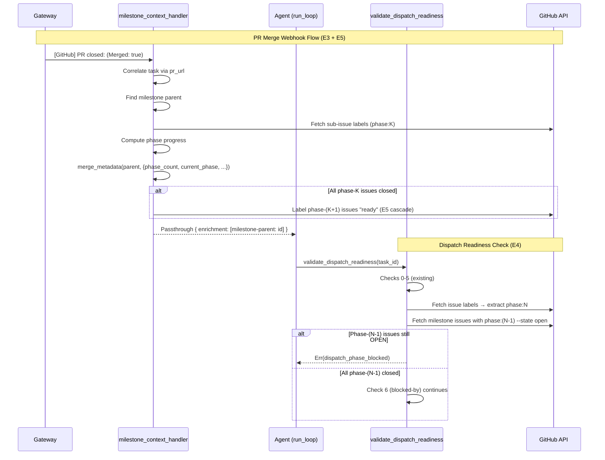

# feat(self-dev): milestone-as-unit dispatch — phase metadata, dispatch guard, ready-label cascade

## Overview

Milestones >8 sub-issues must be split into sequential phases (≤8 each) at grooming time. Three engine primitives are missing to make phased dispatch work: (1) metadata tracking of phase progress on milestone tasks, (2) a dispatch-readiness guard that gates phase-K dispatch on phase-(K-1) completion, and (3) a ready-label cascade that auto-labels phase-(K+1) issues when phase-K completes. A prerequisite gap — `validate_gh_api_scope()` blocking milestone API calls — must also be resolved.

## Problem Frame

`tasks.type='milestone'` exists but is a passive marker. The autonomous loop cannot trust phase boundaries because:

- Milestone progress is not tracked in `tasks.metadata` — heartbeat and dashboard have no visibility into which phase is active or how many sub-issues remain.
- `validate_dispatch_readiness()` does not read phase labels — a phase-2 issue can be dispatched while phase-1 issues are still open (the `blockedBy` GraphQL guard provides defense, but phase-label checking is the primary structural gate).
- No cascade fires phase-(K+1) `ready` labels when phase-K closes — the operator must manually label issues to trigger the autonomous dispatch loop.

Three of six acceptance criteria (E1, E2, E6) are already closed. This plan covers E3, E4, E5, and a prerequisite gap.

## Requirements Trace

- R1. (E3) `tasks.metadata` on milestone-type parent tasks carries `{phase_count, current_phase, phase_K_total, phase_K_completed}`, updated on every PR-merge webhook for sub-issues with matching milestone. Enables dashboard view + heartbeat resume.
- R2. (E4) `validate_dispatch_readiness()` reads `phase:N` labels on the target issue. Rejects dispatch when any phase-(N-1) sub-issue in the same milestone is OPEN or its PR is unmerged. Defense-in-depth over the existing `blockedBy` GraphQL guard.
- R3. (E5) Ready-label cascade: on `pull_request.merged` webhook, if sub-issue's milestone has a next phase and all current-phase sub-issues are closed, label every phase-(K+1) sub-issue `ready`. Idempotent.
- R4. (Prerequisite) `validate_gh_api_scope()` allows scoped write operations for milestone lifecycle (PATCH close + GET readback). Currently blocks all non-GET API calls, making the M5 milestone-close step a dead letter.

## Scope Boundaries

- Phase encoding convention: `phase:N` GitHub labels (N=1,2,3,...) on sub-issues. No new DB schema — phase is read from GitHub labels at query time, not stored locally.
- Phase count cap: N=8 default, configurable via `MIKA_MILESTONE_PHASE_CAP` env var. This plan does not mandate a specific cap — the cap is enforced at grooming time by the `mika-arch-groom-milestone` skill, not by the engine.
- The `validate_dispatch_readiness()` phase guard is structural defense-in-depth. The primary gate remains `blockedBy` edges on GitHub (check #6). The phase guard catches cases where `blockedBy` edges are missing or malformed.

### Deferred to Separate Tasks

- Prompt-layer changes to `mika-arch-groom-milestone` for phase decomposition at grooming time — companion mika-platform ticket.
- Aggregate dashboard view of phase progress — separate ticket if needed.
- Multi-milestone concurrency — cross-milestone parallelism is out of scope.
- `gh api` milestone GET read allowlist expansion — covered in R4 but kept minimal (milestone close + readback only). Broader read access (e.g., listing milestones) deferred.

## Context & Research

### Relevant Code and Patterns

- `crates/mika-agent/src/skills/executor.rs:840` — `validate_dispatch_readiness()` with 7 sequential checks, cheapest-first ordering. Pattern: build `serde_json::json!({...})` rejection, call `record_dispatch_rejection()`, return `Err`.
- `crates/mika-agent/src/server/milestone_context_handler.rs` — PR-close → milestone-parent correlation via `db.find_active_task_by_pr_url()`. Returns `VerdictAction::Passthrough { enrichment }`. Only handler that always returns `Passthrough` (never `Handled`).
- `crates/mika-agent/src/server/handlers.rs:776` — Webhook handler chain: verdict → ci_success → ci_failure → milestone_context. Sequential, self-selecting on event type.
- `crates/mika-agent/src/task_metadata.rs` — `merge_metadata()` two-level shallow merge. Fire-and-forget pattern from `try_extract_callback_metadata()`.
- `crates/mika-agent/src/github_graphql.rs` — `fetch_open_blockers()` (GraphQL), `fetch_issue_body()` (REST), `fetch_pr_summary()` (REST). All use `reqwest` directly with Bearer auth and 10s timeout.
- `crates/mika-agent/src/skills/builtin_handlers.rs:1641` — `GH_API_READ_ALLOWED_PATTERNS` with GET-only restriction at `validate_gh_api_scope()`.
- `crates/mika-agent/src/tools/check_task.rs:14` — `GitHubRef` enum + `parse_github_ref()` for extracting owner/repo/number from reference URLs.

### Institutional Learnings

- `docs/solutions/architecture-patterns/blocked-by-dispatch-guard-graphql-validation-2026-04-21.md` — GraphQL variables for injection safety. Expensive checks last. Fail-open for missing config, fail-closed for API errors. Parse functions extracted as standalone pure functions for testability.
- `docs/solutions/architecture-patterns/webhook-milestone-advance-guard-structural-parity-2026-05-20.md` — Two-layer architecture (server handler marker injection + inline agent guard). Milestone-context handler runs AFTER ci_failure_handler. Fail-open on DB errors.
- `docs/solutions/architecture-patterns/milestone-close-claim-guard-github-state-enforcement-2026-05-17.md` — Verify-post-state discipline: PATCH (intent) → readback (completion) → branch on state. The `state=closed` substring check narrows the satisfying-call surface.
- `docs/solutions/architecture-patterns/dispatch-readiness-guard-long-running-status-validation.md` — Guard stays type-agnostic (status-based, not type-based). Structured JSON errors for programmatic LLM feedback. Fail-closed on DB errors.
- `docs/solutions/logic-errors/run-gh-allowlist-hallucinated-subcommands-2026-05-17.md` — `milestone` and `project` are NOT real `gh` CLI subcommands. `api` was added to `GH_ALLOWED_SUBCOMMANDS` but `validate_gh_api_scope()` restricts to GET-only. M5 milestone-close PATCH calls are currently rejected.
- `docs/solutions/workflow-issues/ready-label-dispatch-handler-regression-2026-04-27.md` — Prose-routing across sections is structurally weak. Correct pattern: inline steps in handler, add `INTENT_GUARDS` entry.
- `docs/solutions/best-practices/per-skill-tool-registration-for-dispatch-family-2026-05-17.md` — Each dispatch skill owns its own tool. Union-enum-on-host regressed 5 times.
- `docs/solutions/logic-errors/deferred-dispatch-promotion-deadlock-2026-05-10.md` — Deferred wrappers can fail to promote after blocking dispatch completes, causing multi-hour stalls. Critical for any sequential dispatching pattern.

## Key Technical Decisions

- **Phase encoding via GitHub labels (not DB):** Phases are encoded as `phase:N` labels on GitHub issues. The engine reads them via REST API at dispatch-readiness check time and webhook-handler time. No new DB column needed — phase is transient context derived from the issue's current label set. Rationale: labels are visible in the GitHub UI, survives agent restart/compaction, and aligns with the existing `blockedBy` encoding which also lives on GitHub.

- **Phase guard position in `validate_dispatch_readiness()`:** Between check 5 (grooming-marker) and check 6 (blocked-by). Phase checking requires a GitHub REST API call (medium cost), making it more expensive than the grooming-marker check but cheaper than the GraphQL blocked-by check. This preserves cheapest-first ordering.

- **Ready-label cascade is auto by default with env var opt-out:** `MIKA_PHASE_CASCADE_AUTO=true` (default). When `false`, the cascade writes a heartbeat-visible `phase_cascade_pending` flag to the milestone task metadata instead of labeling — the operator then applies `ready` labels manually. Rationale: auto-cascade matches the "milestone-as-unit verb" goal. The operator can opt out for high-risk milestones.

- **Cascade runs inside `milestone_context_handler` extension:** The cascade logic extends the existing PR-close handler rather than adding a new handler. The handler already correlates PR-close events to milestone parents and has the DB context needed. The cascade is a natural continuation of the marker-injection flow.

- **`validate_gh_api_scope()` scoped write allowlist:** A new `GH_API_WRITE_ALLOWED_PATTERNS` array allows specific PATCH operations on milestone endpoints. The validation function checks write patterns only when the method is non-GET. This is narrower than a general write allowlist and follows the YAGNI principle — only milestone lifecycle writes are enabled.

- **Open question resolution — N=8 cap:** The brainstorm showed clean ships at 5-8 tickets and catastrophic degradation at 9. The cap is enforced at grooming time by `mika-arch-groom-milestone`, not by the engine. This plan does not hardcode a cap constant — the engine's phase guard works regardless of phase size.

## Open Questions

### Resolved During Planning

- **Auto-cascade vs operator-consent (E5):** Auto-cascade with env var opt-out. The autonomous loop's value proposition is reducing operator toil. Operator-consent reintroduces the manual labeling step that milestones-as-unit-dispatch is designed to eliminate. The env var provides the safety valve for high-stakes milestones.
- **Where to read phase labels — REST or GraphQL?** REST via `github_graphql::fetch_issue_labels()` (new helper). The `gh issue list --milestone N --label phase:K --state open` shape works for the cascade check, but the dispatch guard needs individual issue label inspection. REST is simpler and faster for single-issue label reads.
- **Phase label format:** `phase:N` (colon-separated, lowercase). Matches GitHub's label naming convention and avoids conflicts with existing labels. The `.github/labels.yml` taxonomy will need entries for `phase:1` through `phase:8`.

### Deferred to Implementation

- Exact error message wording for the phase guard rejection — follows the established `serde_json::json!({...})` pattern, but the specific `reason` text is best written in context.
- Whether the cascade's `gh issue edit --add-label ready` calls need rate-limiting for large phase rollovers (up to 8 issues labeled in one handler invocation) — likely fine since GitHub's API rate limits are per-hour and 8 calls is negligible.
- Dashboard rendering of phase metadata — the metadata fields are exposed via existing task detail API, but how the dashboard visualizes them is a separate concern.

## High-Level Technical Design

> *This illustrates the intended approach and is directional guidance for review, not implementation specification. The implementing agent should treat it as context, not code to reproduce.*

## Implementation Units

- [ ] **Unit 1: Expand `validate_gh_api_scope()` for milestone write operations**

**Goal:** Unblock M5 milestone-close PATCH calls and milestone GET readbacks that are currently rejected by the GET-only API restriction.

**Requirements:** R4

**Dependencies:** None

**Files:**
- Modify: `crates/mika-agent/src/skills/builtin_handlers.rs`
- Test: `crates/mika-agent/src/skills/builtin_handlers.rs` (inline `#[cfg(test)]`)

**Approach:**
- Add `GH_API_WRITE_ALLOWED_PATTERNS` const array with pattern: `^/?repos/[^/]+/[^/]+/milestones/\d+$`
- Add `GH_API_READ_MILESTONE_PATTERNS` with same pattern (for GET readback in M5 step 3b)
- Modify `validate_gh_api_scope()`: after the current GET-only check, if method is non-GET, check against write patterns. If method is GET and the path doesn't match read patterns, also check milestone read patterns.
- Scoped write: only PATCH method allowed on write patterns (not POST, PUT, DELETE)
- Compile write patterns via `LazyLock` matching the existing `GH_API_READ_COMPILED` pattern

**Patterns to follow:**
- `GH_API_READ_ALLOWED_PATTERNS` + `GH_API_READ_COMPILED` at `builtin_handlers.rs:1641`
- `validate_gh_api_scope()` at `builtin_handlers.rs:1862`

**Test scenarios:**
- Happy path: `["api", "-X", "PATCH", "/repos/o/r/milestones/14", "-f", "state=closed"]` → Ok
- Happy path: `["api", "/repos/o/r/milestones/14", "--jq", ".state"]` → Ok (GET readback)
- Edge case: `["api", "-X", "POST", "/repos/o/r/milestones", "-f", "title=new"]` → Err (POST not allowed, only PATCH)
- Edge case: `["api", "-X", "DELETE", "/repos/o/r/milestones/14"]` → Err (DELETE not allowed)
- Edge case: `["api", "-X", "PATCH", "/repos/o/r/issues/14"]` → Err (PATCH only allowed on milestones)
- Edge case: `["api", "-X", "PATCH", "/repos/o/r/milestones"]` → Err (no milestone number — path doesn't match `\d+$`)
- Integration: existing `test_gh_api_milestones_not_allowed` test should be updated — GET milestone reads are now allowed, but the test should verify that arbitrary non-milestone PATCH calls are still rejected

**Verification:**
- Existing `run_gh` tests pass
- New tests for milestone PATCH and GET patterns pass
- `test_gh_api_milestones_not_allowed` updated to reflect the new allowlist

---

- [ ] **Unit 2: GitHub REST helpers for phase label operations**

**Goal:** Add reusable helpers for fetching issue labels and querying milestone sub-issues by phase label.

**Requirements:** R1, R2, R3 (foundation)

**Dependencies:** None (these are pure helper functions)

**Files:**
- Modify: `crates/mika-agent/src/github_graphql.rs`
- Test: `crates/mika-agent/src/github_graphql.rs` (inline `#[cfg(test)]`)

**Approach:**
- Add `fetch_issue_labels(token, owner, repo, number) -> Result<Vec<String>>` — REST GET `/repos/{owner}/{repo}/issues/{number}/labels`, returns label names. 10s timeout, Bearer auth, same error handling as existing helpers.
- Add `parse_phase_label(labels: &[String]) -> Option<u32>` — pure function that extracts phase number from a `phase:N` label. Returns `None` if no phase label found. Rejects `phase:0` (phases are 1-indexed).
- Add `fetch_milestone_issues_by_state(token, owner, repo, milestone_number, state) -> Result<Vec<MilestoneIssue>>` — REST GET `/repos/{owner}/{repo}/issues?milestone={number}&state={state}&per_page=100`, returns `Vec<MilestoneIssue>` where `MilestoneIssue` is a lightweight struct with `number`, `state`, `labels: Vec<String>`.
- These are standalone REST helpers following the existing `fetch_issue_body()` and `fetch_open_blockers()` patterns.

**Patterns to follow:**
- `fetch_issue_body()` at `github_graphql.rs` — REST call pattern, error handling, timeout
- `extract_open_blocker_numbers()` — pure JSON parser for testability

**Test scenarios:**
- Happy path: `parse_phase_label(&["bug", "phase:2", "p1-important"])` → `Some(2)`
- Happy path: `parse_phase_label(&["phase:1"])` → `Some(1)`
- Edge case: `parse_phase_label(&[])` → `None`
- Edge case: `parse_phase_label(&["enhancement", "agent-core"])` → `None` (no phase label)
- Edge case: `parse_phase_label(&["phase:0"])` → `None` (phases are 1-indexed)
- Edge case: `parse_phase_label(&["phase:abc"])` → `None` (non-numeric)
- Edge case: `parse_phase_label(&["phase:1", "phase:2"])` → `Some(1)` (first match wins, with WARN log)
- Happy path: `MilestoneIssue` deserialization from GitHub API JSON response shape

**Verification:**
- All parse tests pass
- Helper functions compile and follow the established `reqwest` pattern

---

- [ ] **Unit 3: Phase metadata tracking on PR merge (E3)**

**Goal:** When a PR merges for a milestone sub-issue, compute and persist phase progress on the parent milestone task's metadata.

**Requirements:** R1

**Dependencies:** Unit 2

**Files:**
- Modify: `crates/mika-agent/src/server/milestone_context_handler.rs`
- Modify: `crates/mika-agent/src/task_metadata.rs` (if new constants needed)
- Test: `crates/mika-agent/src/server/milestone_context_handler.rs` (inline `#[cfg(test)]`)

**Approach:**
- Extend `try_handle_pr_closed_milestone_context()` with a new phase after step 6 (marker emission).
- After finding the milestone parent, extract the milestone number from the parent's `reference_url` (e.g., `https://github.com/senara-solutions/mika/milestone/14` → `14`).
- Call `fetch_milestone_issues_by_state(token, owner, repo, milestone_number, "all")` to get all sub-issues with their labels.
- For each sub-issue, call `parse_phase_label()` to extract its phase number.
- Compute: `phase_count` (max phase number across all sub-issues), `current_phase` (lowest phase with any OPEN issue, or `phase_count` if all closed), `phase_K_total` (count of issues in current phase), `phase_K_completed` (count of CLOSED issues in current phase).
- Write to parent task metadata via `db.update_task_metadata()` using `merge_metadata()` with key `"phase_progress"`: `{"phase_count": N, "current_phase": K, "phase_total": M, "phase_completed": C}`.
- Fire-and-forget pattern: errors logged as `warn!`, never block the marker emission flow.
- If no sub-issues have phase labels, skip phase tracking entirely (non-phased milestone — pre-existing workflow).
- The handler needs `github_token` — thread it through from `run_agent_for_message()` where `settings.agent_github_token()` is already available.

**Patterns to follow:**
- `try_extract_callback_metadata()` at `dispatcher.rs:1233` — fire-and-forget metadata enrichment
- `merge_metadata()` at `task_metadata.rs` — two-level shallow merge

**Test scenarios:**
- Happy path: PR merge for phase-1 issue with 3/5 phase-1 issues now closed → metadata `{phase_count: 3, current_phase: 1, phase_total: 5, phase_completed: 3}`
- Happy path: Last phase-1 issue closes → `current_phase` advances to 2
- Edge case: Non-phased milestone (no phase labels on any sub-issue) → no `phase_progress` key written
- Edge case: Milestone parent `reference_url` doesn't contain `/milestone/` path → skip phase tracking with debug log
- Error path: GitHub API call fails → warn log, marker emission still proceeds (fail-open)
- Error path: DB metadata write fails → warn log, marker emission still proceeds (fire-and-forget)
- Integration: marker emission (`[milestone-parent: ...]`) is unaffected by phase tracking success/failure

**Verification:**
- Phase metadata appears on milestone parent tasks after sub-issue PR merges
- Non-phased milestones continue to work without phase metadata
- Marker emission is never blocked by phase tracking failures

---

- [ ] **Unit 4: Dispatch readiness phase guard (E4)**

**Goal:** Add a dispatch-readiness check that rejects phase-K dispatch when phase-(K-1) sub-issues are still OPEN.

**Requirements:** R2

**Dependencies:** Unit 2

**Files:**
- Modify: `crates/mika-agent/src/skills/executor.rs`
- Modify: `crates/mika-agent/src/github_graphql.rs` (if `fetch_issue_labels` not yet sufficient)
- Test: `crates/mika-agent/src/skills/executor.rs` (inline `#[cfg(test)]`)

**Approach:**
- Add check between existing checks 5 (grooming-marker) and 6 (blocked-by), sharing the hoisted `github_ref` binding.
- Gate on: task type is `issue`, `github_ref` is `Some(GitHubRef::Issue { owner, repo, number })`, and `github_token` is `Some`.
- Call `fetch_issue_labels()` to get the target issue's labels. Extract phase via `parse_phase_label()`. If no phase label → skip (non-phased issue, bypass guard).
- If phase > 1: extract milestone number from the issue (via REST API or from parent task's `reference_url`). Call `fetch_milestone_issues_by_state(token, owner, repo, milestone, "open")` and filter for `phase:(N-1)` labels. If any OPEN phase-(N-1) issues exist → reject with `dispatch_phase_blocked` error.
- Fail-open when no `github_token` (skip with warn, matching check #6 pattern).
- Fail-closed on API errors (reject dispatch, matching check #6 pattern).
- Bypass: phase-1 issues always pass (no prior phase to check). Issues without phase labels always pass.
- Structured rejection JSON: `{"error": "dispatch_phase_blocked", "task_id": task_id, "phase": N, "blocking_phase": N-1, "open_issues_in_prior_phase": [list of issue numbers], "reason": "..."}`.
- Call `record_dispatch_rejection()` for observability.

**Patterns to follow:**
- Check #6 (blocked-by) at `executor.rs:1113` — GitHub API call pattern, fail-open/fail-closed semantics, `parse_github_ref()` usage
- Check #5 (grooming-marker) at `executor.rs:1014` — skill-specific bypass predicate (`is_issue_type`)

**Test scenarios:**
- Happy path: Phase-1 issue with no prior phase → guard passes (no check needed)
- Happy path: Phase-2 issue where all phase-1 issues are closed → guard passes
- Happy path: Non-phased issue (no `phase:N` label) → guard passes (bypass)
- Error path: Phase-2 issue where 2 of 5 phase-1 issues are still OPEN → `dispatch_phase_blocked` rejection with the 2 open issue numbers
- Edge case: Milestone type task (not issue) → guard passes (only gates issue-type tasks, matching check #5 pattern)
- Edge case: No `github_token` → skip with warn, guard passes (fail-open)
- Error path: GitHub API error fetching labels → reject dispatch (fail-closed)
- Edge case: Issue has `phase:1` label but no milestone → skip (can't determine which milestone to check prior phases against)
- Integration: rejection includes `open_issues_in_prior_phase` list for LLM feedback

**Verification:**
- Dispatch of phase-2+ issues is correctly gated on prior phase completion
- Phase-1 and non-phased issues are not affected
- Existing dispatch checks continue to work (regression-free)

---

- [ ] **Unit 5: Ready-label cascade on phase rollover (E5)**

**Goal:** When all phase-K sub-issues in a milestone are closed, automatically label phase-(K+1) sub-issues `ready` to trigger the autonomous dispatch loop.

**Requirements:** R3

**Dependencies:** Unit 2, Unit 3 (cascade uses the same milestone sub-issue fetch)

**Files:**
- Modify: `crates/mika-agent/src/server/milestone_context_handler.rs`
- Test: `crates/mika-agent/src/server/milestone_context_handler.rs` (inline `#[cfg(test)]`)

**Approach:**
- Extend the phase tracking logic from Unit 3 with cascade logic.
- After computing phase progress, check: if `phase_K_completed == phase_K_total` (all current-phase issues closed), and `current_phase < phase_count` (there is a next phase), trigger cascade.
- Cascade: for each sub-issue in phase-(K+1) that does not already have a `ready` label, call `run_gh_label_issue()` — a new helper that runs `gh issue edit {number} --add-label ready --repo {owner}/{repo}` using `Command::new("gh")` with the same env-scrubbing pattern as `run_gh` in `builtin_handlers.rs`. Alternatively, use the GitHub REST API directly: `POST /repos/{owner}/{repo}/issues/{number}/labels` with body `{"labels": ["ready"]}`.
- Gate on `MIKA_PHASE_CASCADE_AUTO` env var (default: `true`). When `false`, write `phase_cascade_pending: true` to milestone metadata instead of labeling — the operator sees this via heartbeat or dashboard and manually applies `ready` labels.
- Idempotent: check if the issue already has a `ready` label before adding it. GitHub's label API is idempotent (adding a label that already exists is a no-op), so the check is a nice-to-have for reducing API calls, not a correctness requirement.
- Log `info!` with `phase_cascade_triggered` event: `agent_id`, `milestone_number`, `from_phase`, `to_phase`, `issues_labeled`, `trace_id`.
- Fire-and-forget: labeling failures logged as `warn!`, never block the handler flow. Individual issue labeling failures don't block other issues from being labeled.

**Patterns to follow:**
- `try_handle_pr_closed_milestone_context()` — self-contained handler with fail-open pattern
- `run_gh` command spawning at `builtin_handlers.rs:1916` — `Command::new("gh")` with env scrubbing

**Test scenarios:**
- Happy path: Last phase-1 issue closes (5/5 completed) with phase-2 issues existing → 3 phase-2 issues labeled `ready`
- Happy path: Phase-2 issue closes but 2/4 phase-2 issues still OPEN → no cascade (phase not complete)
- Edge case: Last phase closes (phase-3 of 3) → no cascade (no next phase)
- Edge case: Non-phased milestone → no cascade (no phase labels detected)
- Edge case: `MIKA_PHASE_CASCADE_AUTO=false` → metadata `phase_cascade_pending: true` written instead of labeling
- Edge case: Phase-(K+1) issue already has `ready` label → skip labeling for that issue (idempotent)
- Error path: GitHub label API fails for one issue → warn, continue labeling remaining issues
- Integration: cascade + metadata tracking run in the same handler invocation without interfering

**Verification:**
- Phase rollover triggers automatic `ready` labeling on next-phase issues
- The autonomous dispatch loop picks up newly-labeled issues via the existing `self-dev-webhook-ready-label` handler
- Non-phased milestones are unaffected
- Env var opt-out works correctly

---

- [ ] **Unit 6: Phase labels in `.github/labels.yml`**

**Goal:** Add `phase:1` through `phase:8` labels to the canonical label taxonomy.

**Requirements:** R1, R2, R3 (all depend on phase labels existing)

**Dependencies:** None

**Files:**
- Modify: `.github/labels.yml`

**Approach:**
- Add 8 labels: `phase:1` through `phase:8` with description "Phase N of phased milestone" and a consistent color (e.g., `c5def5` — light blue, matching GitHub's default label palette).
- Follow the existing label taxonomy structure.

**Test expectation: none** — pure configuration, no behavioral code.

**Verification:**
- Labels exist in `.github/labels.yml`
- `gh label list` shows the new labels after sync

---

- [ ] **Unit 7: Self-dev prompt updates for phased milestones**

**Goal:** Update the M3 and M4 milestone workflow steps to handle phased milestones with phase labels and cascade awareness.

**Requirements:** R1, R3 (prompt layer)

**Dependencies:** Units 1-5 (engine primitives must exist before prompt references them)

**Files:**
- Modify: `skills/bundled/self-dev/system_prompt.md`

**Approach:**
- **M3 extension:** After creating child tasks (Step M3), if the milestone has phase labels on its sub-issues, add a step to verify that all child tasks have the correct `phase:N` label. If any child is unlabeled, warn the operator.
- **M4 extension:** Add phase-awareness to the callback loop. When the current phase's issues are all completed, note in the notification that the cascade will fire automatically (or that manual labeling is needed if `MIKA_PHASE_CASCADE_AUTO=false`).
- **M4 heartbeat extension:** Update the stalled-milestone heartbeat check (existing lines 105-113) to include phase progress from `tasks.metadata.phase_progress` in the health report.
- Keep changes minimal — the engine handles phase gating and cascade structurally. The prompt updates are defense-in-depth awareness, not primary enforcement.

**Test expectation: none** — prompt-only changes. Behavioral correctness is enforced by engine guards (Units 3-5).

**Verification:**
- M3 step mentions phase label verification
- M4 callback loop is phase-aware
- Heartbeat includes phase progress when available

## System-Wide Impact

- **Interaction graph:** The cascade (Unit 5) creates a new write path: `milestone_context_handler` → GitHub Labels API → `self-dev-webhook-ready-label` handler → `validate_dispatch_readiness()` → `run_claude_pilot` dispatch. This is an intentional feedback loop — the cascade fires the same dispatch path that individual `ready` labels already trigger.
- **Error propagation:** All new code follows the fire-and-forget pattern established by `milestone_context_handler`. Phase tracking and cascade failures never block the core PR-merge handling flow. The marker injection (`[milestone-parent: ...]`) is unaffected.
- **State lifecycle risks:** The cascade labels issues `ready` which triggers webhook dispatch. If the cascade fires but the dispatch guard (Unit 4) rejects because phase-(K-1) cleanup hasn't propagated to GitHub yet, the `blockedBy` guard (check #6) provides the backstop. This is defense-in-depth by design.
- **API surface parity:** The `tasks.metadata.phase_progress` fields are exposed through the existing task detail API (`GET /api/v1/tasks/{id}`). No new API endpoints needed.
- **Integration coverage:** The end-to-end flow (PR merge → phase metadata update → cascade → ready-label webhook → dispatch) spans 4 handler boundaries. Unit tests cover each boundary independently; the full flow requires either a real GitHub webhook sequence or manual testing against a live milestone.
- **Unchanged invariants:** The existing milestone workflow (M1-M5) for non-phased milestones is unchanged. The phase guard (Unit 4) bypasses when no phase labels are present. The cascade (Unit 5) does not fire for non-phased milestones. The `validate_dispatch_readiness()` check ordering and fail-closed/fail-open semantics are preserved.

## Risks & Dependencies

| Risk | Mitigation |
|------|------------|
| GitHub API rate limits during cascade (up to 8 label API calls) | 8 calls is negligible against GitHub's 5000/hour limit. Log call count for monitoring. |
| Phase label missing on some sub-issues → inconsistent phase counts | Phase tracking skips non-labeled issues. The phase guard only fires when the dispatch target has a phase label. Partial labeling degrades gracefully. |
| Cascade + dispatch guard race: cascade labels issue `ready` before phase-(K-1) issues are fully closed on GitHub | The `blockedBy` GraphQL guard (check #6) catches this as defense-in-depth. The phase guard (Unit 4) re-checks at dispatch time. |
| `validate_gh_api_scope()` write allowlist too narrow | Scoped to PATCH on `/milestones/\d+` only. No other write operation is enabled. The pattern can be extended later if needed. |
| Deferred-dispatch promotion deadlock with phase-gated issues | Existing `DeferredDispatch` promotion logic handles this — when a phase-blocked dispatch is rejected, the deferred wrapper stays pending until the blocking dispatch completes and the phase condition is re-evaluated. |

## Sources & References

- **Origin document:** `../../../docs/brainstorms/2026-05-16-milestone-dispatch-capacity-baseline-brainstorm.md`
- Related issues: mika#1153 (umbrella), mika#797 (closed — milestone close API), mika#789 (closed — verify-post-state), mika#788 (closed — run_gh allowlist)
- Related code: `crates/mika-agent/src/skills/executor.rs:840` (validate_dispatch_readiness), `crates/mika-agent/src/server/milestone_context_handler.rs` (PR-close handler), `crates/mika-agent/src/github_graphql.rs` (GitHub helpers)
- Architecture docs: `docs/solutions/architecture-patterns/blocked-by-dispatch-guard-graphql-validation-2026-04-21.md`, `docs/solutions/architecture-patterns/webhook-milestone-advance-guard-structural-parity-2026-05-20.md`
