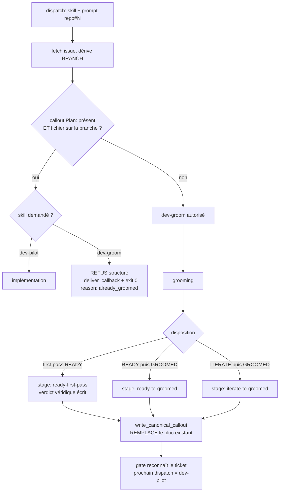

# fix(dispatch): fermer la boucle de re-grooming — le verdict first-pass READY est invisible au gate

## Goal Capsule

Le loop dev re-groome indéfiniment des tickets déjà groomés : 25 requeues mesurés sur 5 tickets en 13 h, 6 branches ne contenant que des plans markdown, zéro code. La cause n'est pas que le modèle « choisit mal » — **il existe déjà un gate de grooming, et il a un faux négatif par construction**. Ce plan le ferme, rend tout refus visible, et empêche les effets de bord que la boucle a produits (callouts empilés, chemins de plan morts).

---

## Problem Frame

### La chaîne causale, établie en source primaire

1. **Le gate exige trois marqueurs.** `crates/mika-agent/src/skills/executor.rs:955` — `check_grooming_markers` renvoie `missing` si l'un manque : `> - **Branch:**`, `docs/plans/`, et un verdict matchant `second-pass \(GROOMED[\s\)\.,;:—-]` ou `second-pass \(READY, paraphrased GROOMED`.

2. **Le troisième marqueur n'est écrit que par deux chemins.** `skills/bundled/_shared/dispatch-lib.sh` (`write_canonical_callout`) ne connaît que deux `stage` : `ready-to-groomed` et `iterate-to-groomed`. Son propre commentaire l'assume : *« Both forms include "second-pass (GROOMED)" to satisfy the dispatch-gate has_verdict regex »*. Tout autre stage tombe sur `*)` → `WARN` sur stderr + `return 1`.

3. **Le chemin first-pass READY est légitime et n'a pas de stage.** `/mika-groom-ticket` Phase 3 étape 10 : *« Disposition: READY — plan is sound. Commit the staged plan […] and skip to Phase 5 »*. Ce chemin ne produit aucune ligne `second-pass`.

4. **Conséquence.** Un ticket groomé en un seul passage est **structurellement invisible au gate**. Il reste éternellement « non groomé », est re-dispatché en `dev-groom`, se fait re-groomer, et le cycle recommence.

### La preuve terrain

**mika#1962** — `gh api repos/…/issues/1962/events` :

```
2026-08-26T11:59:45Z  +ready  par samidarko
2026-08-26T18:39:19Z  -ready  par mika-platform-dev
2026-08-26T18:39:20Z  +ready  par mika-platform-dev
2026-08-26T19:39:23Z  -ready  par mika-platform-dev
2026-08-26T19:39:25Z  +ready  par mika-platform-dev
2026-08-26T20:59:29Z  -ready  par mika-platform-dev
2026-08-26T20:59:32Z  +ready  par mika-platform-dev
```

Le body porte **deux blocs** de callouts. Le plus ancien : `/ce:plan → mika-arch first-pass (READY, no revisions needed)` — **aucun `second-pass`**. Le plus récent : `first-pass (READY) → second-pass (GROOMED) — session-id: …`. Le premier grooming a laissé le ticket invisible ; le re-dispatch a produit un second grooming, qui a empilé son bloc au lieu de remplacer.

**Requeues mesurés** (`event=labeled`, `label=ready`, `actor=mika-platform-dev`) : #1664 = 11, #1957 = 7, #1962 = 3, #1934 = 3, #1963 = 1 — **25 au total** depuis 09:49Z le 26/08.

### Le défaut secondaire, même origine

Le check d'idempotence de `write_canonical_callout` utilise les mêmes trois signaux. Un ticket sans verdict le rate, donc l'écriture est autorisée, et la composition préfixe le nouveau bloc au body existant (`printf '%s\n\n%s' "$callout_block" "$current_body"`) — d'où l'empilement. Sur #1962, les deux blocs portent des chemins différents : `docs/plans/…` et `mika/docs/plans/…`. Vérifié : `git cat-file -e origin/<branche>:mika/docs/plans/…` échoue, `docs/plans/…` existe. **Le callout le plus visible désigne un fichier absent.**

### Pourquoi ça compte

La file `ready` se vide et se remplit toute seule, les branches se multiplient, rien n'atterrit. On peut groomer quinze tickets par jour et livrer zéro — l'illusion d'activité que la doctrine Rolex-in-a-Rolls interdit. Chaque requeue consomme un cycle de pilot complet pour produire un plan déjà écrit.

---

## Requirements

- **R1** — Un ticket dont le grooming s'est terminé en first-pass READY doit être reconnu comme groomé par le gate de dispatch. (AC1 du ticket)
- **R2** — Un dispatch `skill=dev-groom` sur un ticket déjà groomé doit être refusé, et le refus doit être explicite et journalisé — jamais un no-op silencieux. (AC1, AC2)
- **R3** — La reconnaissance « déjà groomé » exige **deux** conditions : le callout `Plan:` présent **et** le fichier existant sur la branche cible. Le callout seul est falsifiable ; le fichier seul est ambigu. (AC1)
- **R4** — Un body de ticket ne contient jamais plus d'un bloc `Branch:`/`Plan:`. Le grooming remplace, il n'empile pas. (AC3)
- **R5** — Le callout `Plan:` porte un chemin relatif au repo cible, vérifié existant avant écriture. (AC4)
- **R6** — Un re-grooming reste possible mais devient visible : au-delà du premier, l'événement est journalisé. (AC5)
- **R7** — Couverture de test sur chaque branche du gate. (AC6)

---

## Key Technical Decisions

### KTD1. Réparer le gate existant plutôt qu'en ajouter un second

Le ticket #2012 décrit le problème comme « aucun gate déterministe n'existe ». **C'est faux et je le corrige ici** : `check_grooming_markers` *est* ce gate. Ajouter un deuxième gate en parallèle créerait deux sources de vérité sur « ce ticket est-il groomé ? » qui divergeraient à la première évolution. Le fix porte sur le faux négatif du gate en place.

*Conséquence pour le ticket :* mettre à jour le corps de #2012 pour remplacer « aucun gate n'existe » par « le gate existe et son verdict a un faux négatif ». Un ticket qui ment sur la cause produit un plan qui répare la mauvaise chose.

### KTD2. Le refus utilise `_deliver_callback` + `exit 0`, jamais `exit 1`

`dispatch-lib.sh` documente l'incident mika#988 : un `exit 1` sur une condition prévisible a été enveloppé par l'EXIT trap en `HANDLER CRASH`, mika-dev a lu l'enveloppe de crash, posé une question de confirmation, et le loop a stallé ~7 h. Le commentaire en place tranche : *« The correct exit semantics for foreseeable races: exit 0 + structured JSON delivered via _deliver_callback(). Reserve exit 1 for actual handler bugs. »*

Un re-grooming refusé est une condition prévisible, pas un bug. Le refus suit donc le motif `auto_skipped` existant, avec un `reason` propre et une indication explicite de l'action correcte (`dev-pilot`).

### KTD3. Refuser plutôt que convertir silencieusement en `dev-pilot`

L'AC2 laisse le choix. Convertir serait un changement de comportement invisible depuis l'extérieur — exactement la classe de « filet qui masque la panne » que RT#009 a condamnée. Le refus structuré nomme l'action correcte et laisse mika-dev re-dispatcher ; la boucle devient observable au lieu d'être absorbée.

### KTD4. La source de vérité du verdict est le code, pas le prompt

Le troisième marqueur doit être écrit par `write_canonical_callout` sur **tous** les chemins de sortie du grooming, y compris first-pass READY. Un correctif de prompt (« pense à écrire la ligne ») a déjà échoué au niveau substrat dans ce repo. Ajouter un stage est structurel ; demander au modèle d'y penser ne l'est pas.

**Nuance à respecter :** le stage first-pass-READY ne doit **pas** écrire `second-pass (GROOMED)` — ce serait un mensonge dans le body (aucune seconde passe n'a eu lieu). Il faut une forme de verdict distincte et véridique, et élargir la reconnaissance côté `executor.rs` pour l'accepter.

---

## High-Level Technical Design



Le point de bascule est le nœud J : aujourd'hui il n'existe pas, `write_canonical_callout` renvoie `1`, aucun verdict n'est écrit, et le graphe reboucle indéfiniment de N vers D.

---

## Implementation Units

### U1. Rendre le verdict first-pass READY écrivable et reconnaissable

**Goal** — Fermer le faux négatif : un grooming terminé en un passage écrit un verdict véridique, et le gate le reconnaît.

**Requirements** — R1, R7.

**Dependencies** — aucune.

**Files**
- `skills/bundled/_shared/dispatch-lib.sh` (le `case "$stage"` de `write_canonical_callout`)
- `crates/mika-agent/src/skills/executor.rs` (`check_grooming_markers` + ses regex statiques)
- `crates/mika-agent/src/skills/executor.rs` (module de tests, section `check_grooming_markers tests (#919)`)
- `skills/bundled/_shared/test-dispatch-lib.sh`

**Approach**
1. Ajouter un troisième `stage` au `case` — nom suggéré `ready-single-pass` — dont la `history_line` décrit fidèlement ce qui s'est passé : first-pass READY, sans seconde passe, avec `session-id`.
2. Ajouter côté Rust une regex reconnaissant cette forme, à côté de `GROOMED_VERDICT_RE` et `PARAPHRASED_GROOMED_RE`. L'ancrage doit rester structurel (préfixe + délimiteur) pour ne pas matcher de la prose, selon la rationale déjà documentée au-dessus de `GROOMED_VERDICT_RE`.
3. Ne **pas** réutiliser le libellé `second-pass (GROOMED)` pour ce chemin : le body doit rester véridique.
4. Faire échouer bruyamment le `*)` : le `return 1` actuel n'écrit qu'un `WARN` sur stderr, ce qui est précisément comment ce trou est resté invisible. Journaliser le stage inconnu de façon opérateur-visible.

**Patterns to follow** — la structure `LazyLock<Regex>` et les commentaires d'ancrage existants au-dessus de `GROOMED_VERDICT_RE`.

**Test scenarios**
- Un body portant la nouvelle ligne first-pass READY → `check_grooming_markers` retourne un vecteur vide.
- Un body portant `second-pass (GROOMED)` → toujours vide (non-régression).
- Un body portant `second-pass (READY, paraphrased GROOMED` → toujours vide (non-régression).
- De la prose contenant « GROOMED » sans le préfixe de verdict → `groomed_verdict` toujours signalé manquant.
- Un body sans aucun verdict → `groomed_verdict` manquant.
- `write_canonical_callout` avec `stage=ready-single-pass` → compose une ligne contenant le marqueur attendu.
- `write_canonical_callout` avec un stage inconnu → retourne non-zéro **et** émet un diagnostic opérateur-visible.

**Verification** — le vecteur `missing` est vide pour les trois formes de verdict légitimes, et non vide pour la prose et l'absence.

---

### U2. Gate de refus sur `dev-groom` d'un ticket déjà groomé

**Goal** — Refuser explicitement un dispatch de grooming redondant, sans jamais staller le loop.

**Requirements** — R2, R3, R7.

**Dependencies** — U1 (sans le verdict réparé, le gate refuserait à tort les tickets first-pass READY… ou plutôt ne les verrait jamais comme groomés — l'ordre est load-bearing).

**Files**
- `skills/bundled/_shared/dispatch-lib.sh` (bloc `repo#number`, après la dérivation de `BRANCH`)
- `skills/bundled/_shared/test-dispatch-lib.sh`

**Approach**
1. Placer le gate **après** la dérivation de `BRANCH` et de `SUB_REPO_DIR` — les deux sont nécessaires pour résoudre le fichier sur la branche, et tous deux sont disponibles à cet endroit.
2. Double condition (R3) : extraire le chemin du callout `> - **Plan:** \`<path>\`` depuis `ISSUE_BODY`, puis vérifier son existence sur la branche cible via un test git non destructif contre la ref distante.
3. Si les deux conditions tiennent **et** que `SKILL` vaut `dev-groom` : composer un `RESULT` structuré sur le modèle `auto_skipped` existant (`status`, `reason`, `issue`, `note`), nommant explicitement `dev-pilot` comme action correcte, puis `_deliver_callback` et `exit 0`.
4. `dev-pilot` n'est jamais bloqué par ce gate — il n'a aucune raison de l'être, et un gate qui bloque l'implémentation aggraverait exactement ce qu'on répare.
5. Callout absent, ou présent mais fichier introuvable → grooming autorisé. Le callout ment ; le grooming est le comportement correct.

**Execution note** — écrire d'abord le test du cas « callout présent mais fichier absent » : c'est celui qui distingue ce gate d'une vérification naïve, et celui qu'une implémentation pressée simplifiera à tort.

**Patterns to follow** — le bloc `issue_closed` / `auto_skipped` immédiatement au-dessus : même composition de `RESULT`, même `_deliver_callback`, même `exit 0`.

**Test scenarios**
- `skill=dev-groom`, callout présent, fichier présent sur la branche → refus, `exit 0`, `RESULT` contient le motif et nomme `dev-pilot`.
- `skill=dev-groom`, callout présent, fichier **absent** → grooming autorisé.
- `skill=dev-groom`, aucun callout → grooming autorisé.
- `skill=dev-pilot`, callout et fichier présents → dispatch autorisé (le gate ne touche pas l'implémentation).
- Refus → le callback est délivré (pas de sortie silencieuse) et le code de sortie est `0`, jamais `1`.
- Mode free-text (prompt non `repo#N`) → gate inactif, comportement inchangé.

**Verification** — un dispatch `dev-groom` sur un ticket groomé se termine en `exit 0` avec un callback livré ; le worktree n'est pas créé et aucun pilot n'est lancé.

---

### U3. Remplacement du bloc de callouts et chemin vérifié

**Goal** — Un seul bloc `Branch:`/`Plan:` par body, portant un chemin qui résout.

**Requirements** — R4, R5, R7.

**Dependencies** — U1 (le check d'idempotence partage les signaux de verdict).

**Files**
- `skills/bundled/_shared/dispatch-lib.sh` (`write_canonical_callout` : composition du `new_body`, et le calcul de `plan_relpath`)
- `skills/bundled/_shared/test-dispatch-lib.sh`

**Approach**
1. Avant de composer `new_body`, retirer du body courant tout bloc de callouts canonique déjà présent, puis préfixer le nouveau. Le remplacement doit être conservateur : ne toucher qu'aux lignes de callout reconnues, jamais au corps rédactionnel du ticket.
2. `plan_relpath` est actuellement obtenu par `${plan_path#"$WORKTREE_DIR/"}`. Vérifier que le résultat est bien relatif au repo cible et ne conserve pas de préfixe de sous-repo ; ajouter une vérification d'existence du fichier avant écriture, et abandonner l'écriture du callout plutôt que d'écrire un chemin mort.
3. Le cas observé (`mika/docs/plans/…`) doit être couvert par un test de non-régression explicite.

**Test scenarios**
- Body sans callout → un bloc écrit.
- Body avec un bloc existant → toujours exactement un bloc après écriture, portant les nouvelles valeurs.
- Body avec deux blocs empilés (l'état hérité de la boucle) → normalisé à un seul.
- Le corps rédactionnel du ticket (sections `## WHY`, `## Acceptance criteria`) est intact après remplacement.
- `plan_relpath` ne commence jamais par le nom du sous-repo.
- Fichier de plan introuvable → aucun callout écrit, diagnostic émis, code de retour non nul.

**Verification** — sur un body de test reproduisant #1962 (deux blocs, chemins divergents), une écriture produit un body à bloc unique dont le chemin résout sur la branche.

---

### U4. Rendre le re-grooming visible

**Goal** — Un deuxième grooming du même ticket ne peut plus passer inaperçu trois heures durant.

**Requirements** — R6.

**Dependencies** — U2.

**Files**
- `skills/bundled/_shared/dispatch-lib.sh`
- `skills/bundled/_shared/test-dispatch-lib.sh`

**Approach**
Au moment du refus (U2) comme au moment d'un grooming autorisé sur un ticket portant déjà des traces de grooming antérieur, émettre un signal opérateur-visible. Préférer la surface qui existe déjà — le `RESULT` structuré délivré par `_deliver_callback`, et le motif de rejet de dispatch écrit dans `tasks.result` (`record_dispatch_rejection`, mika#1108) — plutôt que d'inventer un compteur persistant. Un compteur nouveau serait un état de plus à maintenir ; le journal de rejet existe déjà et alimente `mika tasks list` et le dashboard.

**Test scenarios**
- Un refus produit un motif structuré exploitable par `jq`.
- Un grooming autorisé sur un ticket déjà porteur de callouts (cas fichier-absent) émet un avertissement distinct du cas nominal.

**Verification** — après un refus, le motif est lisible sur une surface opérateur sans inspection de la base.

---

## Verification Contract

- La suite `test-dispatch-lib.sh` passe intégralement.
- Les tests Rust de `executor.rs` passent, dont la section `check_grooming_markers tests (#919)` étendue.
- `cargo clippy` sans nouvel avertissement sur les fichiers touchés.
- Preuve de bout en bout, à faire avant de considérer le ticket clos : sur un ticket de test portant un callout et un plan existant, un dispatch `dev-groom` se termine en `exit 0` avec refus délivré et **aucun worktree créé**.

---

## Definition of Done

- [ ] Les quatre units sont implémentées et testées.
- [ ] Aucun chemin de sortie du grooming ne laisse un ticket sans verdict reconnaissable.
- [ ] Le refus de dispatch n'utilise jamais `exit 1`.
- [ ] Le corps de mika#2012 est corrigé : le gate existait, son verdict avait un faux négatif.
- [ ] La preuve de bout en bout ci-dessus est exécutée et son résultat consigné.

## Acceptance criteria

- [ ] **AC1** — Un dispatch `skill=dev-groom` est refusé quand le ticket porte un callout `Plan:` **et** que le fichier existe sur la branche cible ; les deux conditions sont requises.
- [ ] **AC2** — Le refus est explicite et journalisé, jamais un no-op silencieux ; il nomme `dev-pilot` comme action correcte et sort en `exit 0`.
- [ ] **AC3** — Le grooming remplace son bloc de callouts au lieu de l'empiler ; un body ne contient jamais plus d'un bloc `Branch:`/`Plan:`.
- [ ] **AC4** — Le callout `Plan:` porte un chemin relatif au repo cible, dont l'existence est vérifiée avant écriture.
- [ ] **AC5** — Un re-grooming est visible sur une surface opérateur, sans inspection de la base.
- [ ] **AC6** — Tests couvrant : ticket déjà groomé → refus ; ticket non groomé → grooming autorisé ; callout présent mais fichier absent → grooming autorisé ; non-empilement des callouts ; verdict first-pass READY reconnu ; non-régression des deux formes de verdict existantes.

---

## Scope Boundaries

**Dans le périmètre** — le gate de verdict, le refus de dispatch redondant, la normalisation des callouts, la visibilité du re-grooming.

**Hors périmètre**
- mika#1781 (`LLM response parse error`) — cause distincte : le cycle *meurt* au lieu d'aboutir. Ordre arbitré avec samidarko le 27/08 : #2012 d'abord, parce que tant que l'aiguillage envoie tout sur la voie de garage, réparer #1781 ne produit aucun signal observable.
- mika#1901 (hang du pilot au tour N+1) — le pilot s'arrête ; ici il termine normalement.
- La raison pour laquelle mika-dev *préfère* `dev-groom` quand les deux sont ouverts. Une fois le gate fermé, la question devient largement théorique ; si elle persiste, elle appelle un correctif de prompt distinct, qui ne remplacera jamais le gate.

### Deferred to Follow-Up Work
- Purger les callouts empilés déjà présents sur les tickets touchés par la boucle (#1664, #1957, #1962, #1934, #1963). Le fix empêche la récidive ; le nettoyage de l'existant est une passe séparée.

---

## Risks & Dependencies

- **Un gate trop large gèlerait le grooming légitime.** Mitigé par la double condition de R3 et par le fait qu'un callout mensonger laisse passer le grooming.
- **La reconnaissance du verdict vit à deux endroits** (bash pour l'écriture, Rust pour la lecture). Ils doivent rester cohérents. U1 les modifie ensemble et les teste des deux côtés ; c'est la raison pour laquelle ils forment une seule unit et non deux.
- **Le remplacement de bloc touche des bodies de tickets réels.** L'opération doit être conservatrice et testée sur un body reproduisant #1962 avant d'être lâchée.

---

## Assumptions

- **A1** — Le chemin first-pass READY est un chemin de sortie voulu du grooming, pas un bug à supprimer. Fondé sur `/mika-groom-ticket` Phase 3 étape 10, qui l'énonce explicitement.
- **A2** — Les 25 requeues mesurés relèvent tous de ce mécanisme. **Non prouvé** : j'ai établi la chaîne causale complète et l'ai vérifiée sur #1962, mais je n'ai pas audité les 24 autres. Si des requeues subsistent après ce fix, ils appellent une seconde investigation plutôt qu'un élargissement du gate.

## Sources & Research

- `crates/mika-agent/src/skills/executor.rs:955` — `check_grooming_markers`, les trois marqueurs et leurs regex.
- `skills/bundled/_shared/dispatch-lib.sh` — `_validate_inputs` (champ `skill`), bloc `repo#number` (dérivation de `BRANCH`), `write_canonical_callout` (`case "$stage"`, check d'idempotence, composition du body), commentaire d'incident mika#988 sur la sémantique de sortie.
- `.claude/commands/mika-groom-ticket.md` Phase 3 étape 10 — la disposition READY comme sortie légitime.
- `gh api repos/senara-solutions/mika/issues/{1664,1957,1962,1934,1963}/events` — les 25 requeues.
- `git cat-file -e origin/fix/1962/…:{mika/,}docs/plans/…` — la preuve du chemin mort.
