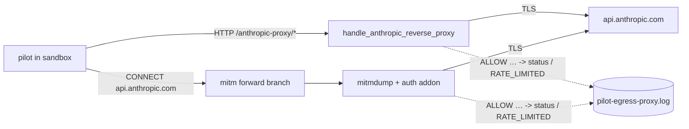

# Pilot egress-proxy upstream-status visibility - Plan

## Goal Capsule

**Objective:** the pilot egress log alone tells an operator whether an Anthropic call was accepted, throttled, rejected, or never answered — no ad-hoc probe, no host-side `curl`.

**Means:** capture and parse the upstream HTTP status line on both Anthropic paths, then log it (KTD1, KTD3).

**Authority hierarchy:** requirements (R-IDs) govern behaviour; KTDs govern mechanism; units override neither.

**Stop conditions:** stop before changing any auth logic, any retry or backoff behaviour, and any request-shaping that would alter how Anthropic sees the pilot.

**Execution profile:** small, high-blast-radius surface — the reverse proxy carries every pilot LLM call. Byte-exactness of the relayed stream is the dominant constraint.

**Tail ownership:** the guardrail-side classification (pilot exit code) is out of scope and stays in `claude-pilot-py`; see Scope Boundaries.

---

## Product Contract

### Summary

Add upstream-status visibility to the two host-side paths that carry pilot traffic to `api.anthropic.com`. The reverse-proxy handler learns to read the response status line while still relaying every byte as it arrives; the mitmproxy addon gains a read-only response hook. Both emit a status-bearing log line, plus a distinct `RATE_LIMITED` line on HTTP 429 carrying the quota headers Anthropic returns.

### Problem Frame

On 2026-08-06 a pilot session (`c58c49b0-fdcc-4180-b53b-36b6797f0dfa`) stalled for 606s and was killed by the `idle_timeout` guardrail. The pilot log showed `[anthropic-proxy] ALLOW POST /v1/messages?beta=true` and nothing else — no tool request, no policy deny, no traceback. Half a day of investigation followed: cpp#103 was suspected and cleared by a Diag-1 predicate test, an A/B pre-install run reproduced the hang without the suspect code, and only an instrumented copy of the proxy (`STREAM_START` with no `STREAM_END`) plus a host-side `curl` established the fact — `HTTP 429 rate_limit_error`, request `req_011CdmbTL5FH62zfwP7ieMhu`, on a token still valid for 1h48. The 2026-08-07 correction narrowed it further: the throttle was selective, since interactive Claude Code sessions on the same credential kept returning 200.

The proxy already had that fact in its hands and threw it away. `handle_anthropic_reverse_proxy` in `scripts/mika-pilot-egress-proxy` relays the upstream response as an opaque byte loop and then prints `ALLOW <method> <path>` unconditionally. A 429, a 401, a 500 and a 200 all produce the same line. `ALLOW` names an allowlist verdict, not an upstream outcome — but read at 3am it looks like success, which is what sent the investigation toward the γ streaming layer.

The rail split of 2026-08-24 keeps `claude-pilot` on subscription OAuth, and the API-key fallback is closed for cost reasons. Throttling is therefore a standing condition of the loop, not an incident. It has to cost one grep, not one day.

This repo has already paid for the same lesson once: `docs/solutions/runtime-errors/anthropic-billing-400-classified-as-generic-httperror-2026-05-12.md` records 1086 WARN lines over four hours from Anthropic 400 billing rejections that were indistinguishable from transient failures until the error was given a type and its actionable message preserved.

### Requirements

**Reverse-proxy path (`/anthropic-proxy/*`)**

R1. The handler records the upstream HTTP status code for every forwarded request.
R2. The existing `ALLOW` line carries that status code.
R3. A 429 response also emits a distinct line whose first token identifies the rate-limit class.
R4. The 429 line carries Anthropic's quota headers when present: `retry-after`, any `anthropic-ratelimit-*`, and `request-id`.
R5. An upstream that closes without sending a status line emits a distinct line naming that outcome.
R6. The bytes relayed to the sandbox client are unchanged in content, order, and arrival timing.

**CONNECT path (mitmproxy addon)**

R7. The addon logs the upstream status code for every `api.anthropic.com` response it sees.
R8. The addon emits the same rate-limit class line, with the same header set as R4, on a 429.
R9. The addon does not read, buffer, or alter any response body.

**Log discipline (both paths)**

R10. No log line contains the Bearer token, an `Authorization` header value, or any request- or response-body byte.
R11. Header logging is allowlist-driven: only the names named in R4 are eligible, matched case-insensitively.

### Key Decisions

- **Keep `ALLOW` as the line prefix and append the status.** Governs R2. `ALLOW` is the allowlist verdict and existing operator habits grep for it; changing the prefix would break them to fix a word.
- **Cover both Anthropic paths in one ship.** Governs R7, R8. A pilot that falls through to the CONNECT tunnel would otherwise reproduce the original silence exactly.

### Success Criteria

- An operator who greps `RATE_LIMITED` in `pilot-egress-proxy.log` reaches the 2026-08-06 conclusion without writing a probe.
- The 2026-08-06 log tail, replayed through the new code, would have named the 429 on its first line.

### Scope Boundaries

**In scope:** status capture and logging on both host-side Anthropic paths, and a test harness for the parsing helpers.

**Deferred to follow-up work:**

- Propagating a distinct exit code to the pilot so `idle_timeout` classifies rate-limit separately from a true stall. That guardrail lives in `claude-pilot-py`; it needs its own ticket, referenced from the PR.
- Any retry, backoff, or queueing response to a 429 in the proxy. This plan makes the condition visible; deciding what to do about it is a separate call with its own risk surface.
- An end-to-end socket-level test of the reverse-proxy handler. `ANTHROPIC_UPSTREAM_HOST` is a module constant; making it injectable touches the auth path, which this plan is barred from. See Open Questions.

**Outside this work's identity:** anything that changes how Anthropic sees the pilot — header rotation, user-agent mimicry, endpoint variation. The 2026-08-07 operator directive rules this out as ToS-borderline and against the intent of a subscription.

### Sources

- `scripts/mika-pilot-egress-proxy` — `handle_anthropic_reverse_proxy` (relay loop and the unconditional `ALLOW` print), `handle_host_client` (the `MITM_FORWARD_HOSTS` branch that makes the second path real).
- `scripts/mika-pilot-anthropic-auth-addon.py` — has `requestheaders` only; no response hook exists yet.
- `skills/bundled/_shared/dispatch-lib.sh` — sets `ANTHROPIC_BASE_URL` / `CLAUDE_CODE_API_BASE_URL` to the reverse-proxy endpoint, and writes the proxy log to `pilot-egress-proxy.log`.
- `docs/solutions/runtime-errors/anthropic-billing-400-classified-as-generic-httperror-2026-05-12.md` — prior art on typing an Anthropic error class and preserving its actionable payload.
- `scripts/verify-egress-no-log.sh` — checked, not applicable: its no-log invariant is scoped to `crates/mika-gateway/src/egress_search/`.

---

## Planning Contract

### Key Technical Decisions

KTD1. **Forward each chunk first, then append it to a bounded header buffer until `\r\n\r\n` appears.** Satisfies R1 and R6 together. The alternative — buffer the response head before relaying — adds latency to every SSE stream and risks truncating a body whose head arrives split. Writing first makes the capture a passive tap.

KTD2. **Cap the header buffer at 64 KiB and stop accumulating once headers complete or the cap trips.** A malformed or hostile upstream must not grow proxy memory per connection. On cap-trip, treat the status as unparsed and take the R5 path.

KTD3. **Give the addon a `responseheaders` hook, not a `response` hook.** `responseheaders` fires before the body is read, so mitmproxy's streaming decision is untouched — which is what R9 requires. A `response` hook would force the body into memory.

KTD4. **Allowlist header names; never log a header the allowlist does not name.** Satisfies R11 and protects R10 structurally rather than by care. A wildcard dump would eventually print `Authorization` after an upstream change.

KTD5. **Include `request-id` in the rate-limit line.** It is an opaque Anthropic correlation id, not user content, and it is exactly what a support conversation asks for — the 2026-08-06 investigation cited one.

KTD6. **Test the parsing helpers as pure functions via a stdlib `unittest` script wired into `make test`.** Mirrors the existing `@bash scripts/test-dispatch-symmetry.sh` pattern in the `test` target and adds no dependency. `scripts/mika-pilot-egress-proxy` has no `.py` extension, so the test module loads it by path.

### Assumptions

- The two 429 log lines land in `pilot-egress-proxy.log` (or its `/tmp` fallback), which is where an operator already looks; no new sink is needed.
- Anthropic returns its quota headers on a 429 for this endpoint. If a given 429 carries none, the line still fires with the class and the status — the headers are additive detail, not a precondition.

### High-Level Technical Design

The two paths are independent doors to the same upstream. Today only the left one logs, and it logs without a status. Both get the same two lines so the log reads the same regardless of which door the pilot used.

### Sequencing

U1 produces the helpers. U2 and U3 consume them independently — U3 does not depend on U2. U4 tests U1's helpers and can be written alongside U1.

---

## Implementation Units

### U1. Response-head capture and parsing helpers

**Goal:** pure, testable functions that turn raw response bytes into a status code and an allowlisted header set.

**Requirements:** R1, R4, R11.

**Dependencies:** none.

**Files:**
- `scripts/mika-pilot-egress-proxy` (modify — add module-level helpers near the existing `_extract_oauth_token` / `read_subscription_token` block)

**Approach:**
1. Add a small accumulator that takes successive chunks and reports whether the header terminator has been seen, honouring the KTD2 cap.
2. Add a status-line parser returning the integer status, or `None` when the bytes are absent or malformed.
3. Add an allowlist header selector returning name/value pairs for `retry-after`, `anthropic-ratelimit-*` and `request-id`, matched case-insensitively per R11.
4. Keep all three free of I/O so U4 can test them without sockets.

**Patterns to follow:** the existing module-level helper style in this file — plain functions, byte-oriented, `re` for header matching, no classes.

**Test scenarios:**
- A complete `HTTP/1.1 200 OK` head arriving in one chunk parses to `200`.
- A head split mid-status-line across two chunks parses to `429` once the second chunk arrives.
- Bytes that are not a status line (an early upstream error, binary noise) parse to `None`.
- A head that never terminates within the 64 KiB cap stops accumulating and reports unparsed.
- Header selection returns `retry-after` and `anthropic-ratelimit-requests-remaining` from a mixed head, in the casing the upstream sent.
- Header selection returns nothing for a head carrying only `content-type` and `authorization`, proving R10 by construction.

**Verification:** the helpers behave correctly on the scenarios above with no socket, no event loop, and no network.

### U2. Wire status-aware logging into the reverse-proxy relay

**Goal:** the reverse-proxy path names the upstream outcome on every request.

**Requirements:** R1, R2, R3, R4, R5, R6, R10.

**Dependencies:** U1.

**Files:**
- `scripts/mika-pilot-egress-proxy` (modify — the upstream-to-client relay loop and the `ALLOW` print in `handle_anthropic_reverse_proxy`)

**Approach:**
1. In the relay loop, write and drain each chunk to the client first, then feed it to the U1 accumulator while the head is still open (KTD1).
2. Replace the unconditional `ALLOW <method> <path>` print with a status-bearing form.
3. On status 429, emit the additional rate-limit class line carrying the U1-selected headers.
4. When no status was parsed — upstream closed without a response — emit the R5 line instead of a bare `ALLOW`.
5. Leave the request-forwarding half of the function untouched.

**Execution note:** the byte-exactness of the relay is the load-bearing property here. Prove it before proving the log lines — a test that shows the forwarded byte sequence is identical with and without the tap is worth more than any assertion about log text.

**Patterns to follow:** existing `print(..., file=sys.stderr, flush=True)` calls in this file; `flush=True` is what makes the line visible in a live tail.

**Test scenarios:**
- A 200 response logs an `ALLOW` line ending in the status.
- A 429 response logs both the `ALLOW` line and the rate-limit class line.
- The rate-limit line includes `retry-after` when the upstream sent it and omits it silently when it did not.
- An upstream that closes with zero bytes logs the R5 line and no `ALLOW`.
- A multi-chunk SSE body is relayed byte-identically to the client, with the tap active.
- No emitted line contains the token or any body byte, for each of the cases above.

**Verification:** replaying the 2026-08-06 failure shape through the handler produces a line naming 429 as the first diagnostic.

### U3. Read-only response logging in the mitmproxy addon

**Goal:** the CONNECT path reports the same outcomes as the reverse-proxy path.

**Requirements:** R7, R8, R9, R10, R11.

**Dependencies:** U1 (for the allowlist shape; the addon needs its own copy since mitmproxy loads it as a standalone script).

**Files:**
- `scripts/mika-pilot-anthropic-auth-addon.py` (modify — add a `responseheaders` hook alongside the existing `requestheaders`)

**Approach:**
1. Add a `responseheaders` hook that reads `flow.response.status_code` and the allowlisted headers (KTD3, KTD4).
2. Scope it to `api.anthropic.com` the way `requestheaders` already scopes itself, so non-Anthropic flows stay untouched.
3. Emit the same two line shapes as U2 so a single grep covers both paths.
4. Do not set `flow.response.stream`, do not touch `flow.response.content`, and do not mutate the flow (R9).

**Patterns to follow:** the host-scoping guard and module-docstring conventions already in this addon; its existing property note that the sandbox never sees the token.

**Test scenarios:**
- A 200 Anthropic flow logs a status-bearing line.
- A 429 Anthropic flow logs the rate-limit class line with the allowlisted headers.
- A non-Anthropic flow logs nothing from this hook.
- The hook does not access `flow.response.content` — verified by inspection of the diff, since touching it is the failure mode R9 forbids.

**Verification:** a mitmdump run over a mocked or replayed Anthropic response emits the expected lines while the body still streams.

### U4. Test harness for the proxy helpers

**Goal:** the U1 helpers have automated coverage that runs with the rest of the suite.

**Requirements:** R1, R4, R6, R11.

**Dependencies:** U1.

**Files:**
- `scripts/test-pilot-egress-proxy-status.py` (create)
- `Makefile` (modify — add the invocation to the `test` target)

**Approach:**
1. Load `scripts/mika-pilot-egress-proxy` by path, since it has no `.py` extension and is not importable by name.
2. Cover the U1 and byte-exactness scenarios with stdlib `unittest` — no pytest, no uv package, no new dependency (KTD6).
3. Add the script to the `test` target next to the existing bash test scripts, and give it its own named target for a focused run, matching how `test-dispatch-symmetry` is exposed.

**Test scenarios:** the U1 scenarios plus the U2 relay byte-identity case, which is the one an implementer is most likely to skip and most likely to regress.

**Verification:** `make test` runs the new script and it passes from a clean checkout with no setup step.

---

## Verification Contract

- `make test` — the full suite, now including `scripts/test-pilot-egress-proxy-status.py`.
- `python3 -m py_compile scripts/mika-pilot-egress-proxy scripts/mika-pilot-anthropic-auth-addon.py` — both files are executed by an interpreter, not compiled by cargo, so syntax is otherwise only proven at pilot-launch time.
- `bash scripts/verify-egress-no-log.sh` and `bash scripts/verify-egress-request-shape.sh` — must stay green. Neither covers `scripts/`, so this is a confirmation that the change did not drift into the substrate they do cover.
- Manual smoke: start the proxy, issue one request through `/anthropic-proxy/v1/messages`, and confirm the log line carries the status. Under a live 429, confirm the rate-limit line appears.
- `bash scripts/verify-pipeline.sh` before the PR.

---

## Definition of Done

- Every requirement R1-R11 holds.
- Both Anthropic paths emit a status-bearing line, and a 429 on either path emits the rate-limit class line.
- Relayed bytes are unchanged in content, order, and timing.
- No log line can carry the token, an `Authorization` value, or a body byte — enforced by the allowlist, not by review vigilance.
- The follow-up ticket for guardrail-side classification in `claude-pilot-py` is filed and referenced in the PR body.
- No dead-end or experimental code remains in the diff — no leftover probe, no commented-out buffering variant, no debug print.

---

## Acceptance criteria

- [ ] AC1 — A forwarded request whose upstream returns 200 produces an `ALLOW` line carrying `200`, on the reverse-proxy path.
- [ ] AC2 — A forwarded request whose upstream returns 429 produces both the status-bearing `ALLOW` line and a distinct rate-limit class line, on the reverse-proxy path.
- [ ] AC3 — The rate-limit line carries `retry-after`, `anthropic-ratelimit-*`, and `request-id` when the upstream sends them, and omits each silently when it does not.
- [ ] AC4 — An upstream that closes without a status line produces a distinct line naming that outcome, not a bare `ALLOW`.
- [ ] AC5 — Response bytes reach the sandbox client identical in content, order, and arrival timing, with the status tap active; proven by a multi-chunk SSE test.
- [ ] AC6 — The mitmproxy addon logs the status for `api.anthropic.com` responses and the rate-limit line on 429, without reading `flow.response.content` and without setting `flow.response.stream`.
- [ ] AC7 — Header logging is allowlist-driven; a head containing `authorization` yields no header output.
- [ ] AC8 — No emitted line contains the Bearer token, an `Authorization` value, or any body byte.
- [ ] AC9 — `make test` runs the new helper tests and passes from a clean checkout with no setup step.
- [ ] AC10 — `scripts/verify-egress-no-log.sh` and `scripts/verify-egress-request-shape.sh` stay green.
- [ ] AC11 — The auth path is untouched: no change to `read_subscription_token`, to Bearer injection, or to request-header construction.

---

## Open Questions

- **Deferred:** an end-to-end socket-level test of `handle_anthropic_reverse_proxy` needs `ANTHROPIC_UPSTREAM_HOST` to be injectable. That constant sits inside the auth path this plan may not touch, so U4 covers the helpers and the relay tap instead. If a future ticket makes the upstream injectable for other reasons, the end-to-end test becomes cheap and should be added then.

---

## Risks & Dependencies

- **The relay loop carries every pilot LLM call.** A defect here does not degrade the loop, it stops it. KTD1's write-first ordering keeps the tap passive, and AC5 is the guard; treat a failure there as blocking, not cosmetic.
- **`responseheaders` semantics are mitmproxy-version-dependent.** The hook must stay read-only; a future mitmproxy that changes when the hook fires relative to body streaming could turn R9 into a latency regression. The addon's host-scoping guard limits the blast radius to Anthropic flows.
- **Quota-header names are Anthropic's to change.** The allowlist is a prefix match on `anthropic-ratelimit-*` plus two fixed names, so a renamed header degrades to a missing detail rather than a broken line.
