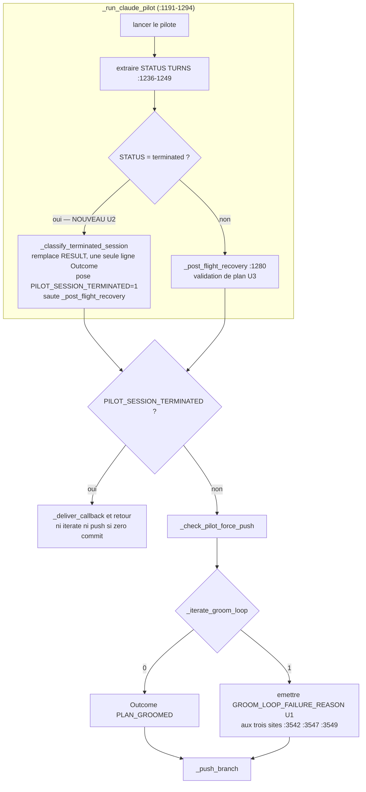

# fix(loop-substrate): le callback dev-groom doit dire ce qui s'est réellement passé

## Goal Capsule

- **Objective.** Un opérateur qui lit un callback de grooming en échec apprend, dès la première ligne, ce qui a réellement arrêté la session — et ne perd plus de temps à chercher un plan ou un verdict architecte qui n'ont jamais existé.
- **Means.** Faire porter au message la raison mesurée plutôt qu'une phrase codée en dur : `_iterate_groom_loop` nomme sa cause d'échec, et une session pilote tuée par un garde-fou est classée comme telle avant que la validation de contenu ne s'exécute (KTD1, KTD2).
- **Authority.** Le corps du ticket mika#1772 et ses deux commentaires opérateur (séparation cause / rapport faux) priment sur les hypothèses A/B/C héritées de mika#1725.
- **Stop conditions.** Arrêter et remonter si la correction demande de modifier le contrat de convergence architecte (`_arch_ask`, `_parse_disposition`, `_parse_verdict`, `_write_canonical_callout`) : ce plan ne touche pas la convergence, seulement son compte rendu et son gardiennage d'entrée.
- **Execution profile.** Bash uniquement (`skills/bundled/_shared/`), plus un câblage Makefile/CI. Aucun changement Rust.
- **Tail ownership.** PR sur `fix/1772/loop-substrate-dev-groom-iterate-groom`, **`Refs #1772`** — pas `Closes`. Le critère de succès (c) du ticket (« dev-groom no longer returns non-zero on the failure class ») n'est pas atteint par ce PR : la session continuera d'être tuée en amont, elle sera seulement rapportée honnêtement et cessera de produire du travail inutile. La fermeture de #1772 attend les tickets de suivi nommés au Definition of Done.

---

## Product Contract

### Summary

`dispatch-lib.sh` produit, pour une session de grooming échouée, un callback contenant **trois affirmations fausses et une vraie**, les fausses en premier. Ce plan supprime les fausses, fait porter au message la raison réelle, et classe une session pilote tuée par garde-fou comme telle — avant que la chaîne de validation de contenu ne s'exécute et n'invente un diagnostic.

### Problem Frame

#### Ce que le callback dit, et ce qui est vrai

Tâches `f4fff3ff-4e57-4005-b4b6-bda13d68872d` (2026-08-28T18:08:14Z) et `74504478-184d-4af4-8d1f-cadb1b1fdce9` (2026-08-28T19:08:47Z), dispatches `ready`-label sur mika#2013. Les deux callbacks sont identiques mot pour mot.

| Affirmation du callback | Vrai ? | Preuve |
|---|---|---|
| `architect convergence did not complete … Plan exists on branch but architect verdict is missing.` | **faux** | `origin/bug/2013/…` == `origin/main` ; `git ls-tree` ne contient aucun fichier `2013`. Aucun plan n'existe, et la boucle n'a jamais atteint l'architecte. |
| `_find_issue_plan returned empty for mika#2013 …` | **vrai** | Aucun plan sur disque ni sur la branche. |
| `… and no /ce:plan invocation detected in session log` | **faux** | `/var/log/claude-pilot/f4fff3ff-….log` **n'existe pas**. Le log n'a pas été lu, donc rien n'y a été « détecté ». |
| `Note: HEAD unchanged on dev-groom re-dispatch — plan already committed from prior run.` | **faux** | Aucun plan de ce ticket n'a jamais été commité. Le garde teste la présence d'un plan *quelconque* dans `docs/plans/`, où `main` en apporte 769. |

L'ordre aggrave l'erreur : la phrase fausse est *préfixée* (`dispatch-lib.sh:3549`) au-dessus de la phrase vraie, donc c'est elle que l'opérateur lit. Elle envoie chercher un verdict architecte manquant alors que rien n'a été écrit — du mauvais côté du problème.

#### Ce qui s'est réellement passé

Les deux sessions portent la même signature, en source primaire (`tasks.result` + `/var/log/claude-pilot/<id>.stderr`) :

```
claude-pilot completed (status: terminated).
Turns: 2
Duration: 602410ms
[guardrail] idle_timeout: No meaningful progress for 300s
```

La session pilote a été **tuée par le garde-fou `idle_timeout` de claude-pilot** au tour 1–2. La trace d'outils du stderr le confirme au-delà du compteur de tours : `f4fff3ff` ne porte **aucune** ligne `[tool:request]`, `74504478` en porte **une seule** (un `Bash` d'inspection `.git`). Aucun appel d'écriture n'a eu lieu. `Push: pushed to origin/bug/2013/… (mode=first-push)` — `dispatch-lib` a ensuite poussé une branche vide.

Cette signature est déjà documentée dans le fichier lui-même, `dispatch-lib.sh:325` : « Anthropic 401 / SDK stall → guardrail idle_timeout 300s → pilot dies at Turns:1 with HEAD unchanged (n=6 dispatches observed) ». Elle appartient à la voie egress/auth du pilote, **pas** à la logique de grooming.

#### Pourquoi le diagnostic est faux par construction

`dispatch-lib` traite `terminated` comme un déroulement normal. Aucune branche du fichier ne lit `STATUS` pour distinguer une session tuée d'une session aboutie — `grep -in 'terminat' skills/bundled/_shared/dispatch-lib.sh` ne renvoie **aucune** occurrence. La chaîne complète — validation de plan, `_iterate_groom_loop`, push — s'exécute donc sur une session qui n'a jamais tourné, et chaque étage produit son propre diagnostic de contenu pour un contenu inexistant.

Au dernier étage, `_iterate_groom_loop` a **18 sites de `return 1`** entre `dispatch-lib.sh:2780` et `:2950` — garde manquante, plan introuvable, `_arch_ask` en échec, réponse sans `.content`, `ESCALATE` première passe, verdict second-passe non-`GROOMED`, pilote de révision non convergé, disposition non parsée après retry. Les 18 s'effondrent sur la même phrase codée en dur à `:3549`. La boucle sait exactement pourquoi elle a échoué ; l'appelant jette cette information et en invente une autre.

#### Deux classes distinctes vivent dans ce ticket

Ce plan reproduit et traite **la classe du 2026-08-28** : session tuée au tour 1–2, aucun plan écrit, la boucle n'atteint jamais l'architecte.

**La classe du 2026-07-04 (mika#1723) est différente et reste non reproduite.** Le corps du ticket rapporte qu'un `/mika-ask-arch` manuel y a produit `Disposition: GROOMED` en une seconde passe — ce qui suppose un plan existant, donc un `_iterate_groom_loop` réellement atteint puis en échec. Les preuves du 08-28 ne peuvent pas invalider les hypothèses A (continuité de session) et B (paraphrases architecte) de mika#1725 §Mechanism 1 : elles portent sur des étages que ces sessions n'ont jamais atteints. Seule C (escalade diagnostique) est traitée ici, reformulée. La classe du 07-04 part en ticket de suivi (§Definition of Done).

#### La lignée egress ne possède pas cette cause

mika#1901 est CLOSED et PR#2019 MERGED à `2026-08-28T15:50Z`, avant les deux échecs. Deux faits indépendants écartent quand même cette lignée :

1. **Le binaire déployé datait du 2026-08-27 15:45 CEST** (`stat ~/.local/bin/mika-spirit`), soit plus de 24 h avant la fusion de #2019. `dispatch-lib.sh` est un skill embarqué semé depuis le binaire construit : le code de #2019 ne tournait pas pendant les échecs.
2. PR#2019 rend un 429 **visible** dans le log egress ; elle n'empêche aucun calage. Même déployée, elle n'aurait rien prévenu.

La cause amont du calage reste donc **sans porteur** après ce PR. Le Definition of Done exige l'ouverture de son ticket.

### Key Decisions

- **La cause amont du blocage pilote est hors périmètre, et sans porteur actuel.** Ce ticket rend le compte rendu honnête et empêche le travail inutile ; il ne répare pas ce qui fait caler le pilote. La lignée egress (mika#1901 / PR#2019) ne la couvre pas — voir §Problem Frame. Un ticket de suivi p1 est requis au DoD. Gouverne R5, R9.
- **Deux volets livrables séparément**, à la demande explicite de l'opérateur (commentaires mika#1772) : le rapport honnête (R1–R4, R10) est autonome et testable seul ; le gardiennage de session terminée (R5–R7) peut suivre. Gouverne R1, R5.

### Requirements

**Compte rendu honnête (volet « rapport »)**

- R1. `_iterate_groom_loop` expose la raison de son échec à son appelant, distincte pour chacun de ses sites de `return 1`.
- R2. Le message d'échec de convergence porte cette raison, et n'affirme la présence d'un plan que d'après une mesure : `VALID_PLAN` (réponse du worktree, déjà résolue par `_find_issue_plan`) d'abord, `_committed_plan_on_branch` (réponse du distant) en repli. Deux mesures, deux phrases distinctes — jamais une phrase pour les deux.
- R3. Le message de plan introuvable n'affirme l'absence d'invocation `/ce:plan` que lorsque le log de session a effectivement été lu ; log absent et log lu sans correspondance sont deux états distincts dans le texte.
- R4. La note « plan déjà commité lors d'un run antérieur » ne se déclenche que si un plan **de ce ticket** existe, déterminé par `_find_issue_plan`.
- R10. Le message d'échec zéro-commit nomme le code de sortie réellement observé ; il n'affirme pas `exited 0` sans avoir lu `PILOT_EXIT`.

**Gardiennage de session terminée (volet « cause »)**

- R5. Une session du pilote principal — celui lancé par `_run_claude_pilot` — dont `status` vaut `terminated` **et qui n'a laissé aucun travail** (HEAD immobile, arbre propre) est classée comme échec de session avant que `_post_flight_recovery` ne s'exécute ; le message nomme la cause d'arrêt réelle, issue de `.subtype`, et le nombre de tours atteints.
- R6. Sur session terminée **sans travail**, `_iterate_groom_loop` n'est pas invoqué et rien n'est poussé. Une session terminée **avec** du travail traverse la récupération, la convergence et le push comme n'importe quelle autre — elle conserve son travail, y compris les fichiers non commités que le sauvetage mika#1282 récupère.
- R7. Le callback d'une session terminée sans travail porte une seule ligne `Outcome:`, `PIPELINE_INCOMPLETE` avec la cause de terminaison, et aucun diagnostic de contenu. Le callback d'une session terminée avec travail porte une bannière qui n'affirme rien d'autre que ce qui a été mesuré, et laisse la chaîne de récupération écrire son `Outcome:`.
- R11. Le harnais d'assertions est déterministe et indépendant de la configuration git de l'hôte, condition pour que R9 ne transforme pas une dépendance ambiante en blocage de fusion.

**Exécutabilité de la garantie**

- R8. Chaque comportement de R1–R7 et R10 est couvert par une assertion dans `skills/bundled/_shared/test-dispatch-lib.sh`, exécutable sans pilote ni CLI `mika` réels.
- R9. `test-dispatch-lib.sh` s'exécute dans `make test` et dans CI, de sorte qu'une régression casse la CI.

### Success Criteria

- Un callback d'échec ne contient aucune affirmation non dérivée d'un état mesuré au moment de l'écriture.
- Rejouer la classe d'échec du 2026-08-28 (session terminée, branche vide) produit un message dont la première ligne nomme la terminaison par garde-fou, et aucune ligne ne mentionne de plan ni de verdict architecte.

### Scope Boundaries

**Hors périmètre**

- La cause amont du calage pilote (401 / 429 / proxy egress). Sans porteur — ticket de suivi requis au DoD.
- Le contrat de convergence architecte lui-même : `_arch_ask`, `_parse_disposition`, `_parse_verdict`, `_write_canonical_callout` restent inchangés.
- Le garde-fou `idle_timeout` de claude-pilot (seuil, comportement) — dépôt `claude-pilot-py`.
- La classe du 2026-07-04 (mika#1723 : plan présent, convergence architecte réellement atteinte puis en échec) — ticket de suivi requis au DoD.

**Reporté (tickets de suivi distincts — un par défaut, pas de ticket parapluie)**

- `dispatch-lib.sh:3542` — sur la voie de succès, `sed '/^PIPELINE FAILURE:/d'` ne supprime que la **première** ligne d'un marqueur multi-lignes. Le message policy-deny de la voie dev-pilot (`:1335`) porte quatre lignes de contenu dont une seule commence par `PIPELINE FAILURE:` — trois lignes orphelines survivent au nettoyage. La voie dev-groom a son propre message policy-deny à `:1673`, de même forme.
- L'absence de sauvetage « worktree sale » pour `dev-groom` : le bloc mika#1282 (`:1360`) est gardé par `[ "$SKILL" = "dev-pilot" ]`. Un plan écrit mais non commité par un pilote de grooming n'est pas récupéré, et le worktree est supprimé au dispatch suivant (`:1034`).
- `_launch_revise_pilot` (`:2462`) lance une seconde session pilote sans jamais extraire de `status` : la garantie d'honnêteté de R5 ne s'y applique pas.
- `/var/log/mika/pilot-egress-proxy.log` ne porte aucun horodatage, ce qui a empêché de corréler les fenêtres d'échec du 2026-08-28 aux statuts amont.

### Open Questions

- Déclencheur amont exact du calage (401 vs 429 vs perte de connexion proxy) — **non bloquant** pour ce plan, indécidable avec les logs actuels. N'affecte aucune unité ; part au ticket de suivi.

### Sources

- `skills/bundled/_shared/dispatch-lib.sh:1191-1294` — `_run_claude_pilot`, qui **contient** l'appel `_post_flight_recovery` à `:1280`.
- `skills/bundled/_shared/dispatch-lib.sh:1236-1249` — extraction de `STATUS`, `TURNS`, `COST`, `DURATION` depuis la sortie JSON du pilote.
- `skills/bundled/_shared/dispatch-lib.sh:1350-1352` — message `claude-pilot exited 0 but HEAD unchanged`, émis sans lire `PILOT_EXIT`.
- `skills/bundled/_shared/dispatch-lib.sh:1346` — note « plan already committed from prior run ».
- `skills/bundled/_shared/dispatch-lib.sh:1640-1649`, `:1682-1690` — `CE_PLAN_INVOKED` et les deux messages `_find_issue_plan returned empty`.
- `skills/bundled/_shared/dispatch-lib.sh:857` — `_committed_plan_on_branch`, autorité existante sur « ce plan est-il commité sur la branche ? ».
- `skills/bundled/_shared/dispatch-lib.sh:1796` — `PUSH_VIOLATION_EVIDENCE`, précédent de variable globale portant une preuve jusqu'à l'appelant.
- `skills/bundled/_shared/dispatch-lib.sh:1801-1806` — `_push_branch` pousse « any local-ahead commits to origin regardless of pilot exit code ».
- `skills/bundled/_shared/dispatch-lib.sh:2084-2181` — `_find_issue_plan`, découverte en trois tiers.
- `skills/bundled/_shared/dispatch-lib.sh:2754-2952` — `_iterate_groom_loop`, 18 sites de `return 1`, dont trois sorties `_escalate_groom` (`:2886`, `:2937`, `:2943`) sans aucun `WARN`.
- `skills/bundled/_shared/dispatch-lib.sh:3490` — appel `_run_claude_pilot "$ENTRY_COMMAND"` ; bloc de violation de push `:3492-3506` (motif de sortie anticipée).
- `skills/bundled/_shared/dispatch-lib.sh:3542`, `:3547`, `:3549` — les trois occurrences de `architect convergence did not complete`.
- `skills/bundled/_shared/dispatch-lib.sh:325` — chaîne `stall → idle_timeout 300s → Turns:1`, n=6 antérieurs.
- Preuve primaire : `tasks.result` et `/var/log/claude-pilot/<id>.stderr` pour `f4fff3ff-…` et `74504478-…`.
- `skills/bundled/_shared/test-dispatch-lib.sh` — harnais ; en-tête : « We cannot run the full `dispatch_claude_pilot()` in a test environment ». Exécute des fonctions isolées (`_find_issue_plan` à `:2835`, `_post_flight_recovery` à `:2999` et `:3052`) et inspecte les grosses fonctions par `declare -f` (`:537-542`).
- `Makefile:4` (`.PHONY`), `:123` (cible `test`), `:132` (`test-dispatch-symmetry`, modèle) ; `.github/workflows/ci.yml:81` (`make verify-bundled-skills`, point d'accroche).
- `docs/solutions/workflow-issues/2026-06-14-dev-groom-drift-misdiagnosis-policy-deny-halt.md` — précédent exact de la même classe : un symptôme pris pour la cause.

---

## Planning Contract

### Key Technical Decisions

- KTD1. **La raison d'échec voyage dans une variable globale, pas dans le code de retour.** `_iterate_groom_loop` écrit `GROOM_LOOP_FAILURE_REASON` avant chaque `return 1` ; l'appelant l'émet. Le fichier utilise déjà ce style (`PUSH_VIOLATION_EVIDENCE` à `:1796`, affectée sans `local`), et des codes de sortie multiples imposeraient une table de correspondance dans l'appelant — un second endroit à maintenir. La boucle est appelée directement (`if _iterate_groom_loop; then`, `:3520`), sans sous-shell ni pipeline : la portée globale se propage. Gouverne R1, R2.
- KTD2. **Le garde de session terminée vit à l'intérieur de `_run_claude_pilot`, entre l'extraction de `STATUS` et l'appel `_post_flight_recovery`.** C'est le seul point qui satisfait R7 : `_post_flight_recovery` est imbriqué dans `_run_claude_pilot`, donc il produit ses diagnostics de contenu **avant** tout retour dans `dispatch_claude_pilot`. Un garde placé après l'appel arriverait trop tard et ne pourrait que préfixer un texte déjà faux. Gouverne R5, R6, R7.
- KTD6. **`terminated` recouvre deux populations, et seule l'une des deux peut sauter la chaîne de récupération.** claude-pilot pose `status: terminated` pour un abort de garde-fou (`subtype` ∈ `stall_detected|empty_response|idle_timeout`) **et** pour une limite SDK (`error_max_turns|error_max_budget_usd`). La première tue une session qui n'a en général rien fait ; la seconde en tue une qui a souvent beaucoup produit. `_pilot_left_no_work` mesure la différence — HEAD immobile et arbre propre — et seule ce cas saute `_post_flight_recovery` et mérite l'affirmation « rien n'a été écrit ». Une session terminée avec du travail traverse toute la récupération, sauvetage worktree-sale de mika#1282 compris, et reçoit une bannière qui énonce la plage de commits au lieu de la nier. La cause d'arrêt vient de `.subtype`/`.termination_reason` déjà présents dans le résultat structuré ; le grep de stderr est le repli. Gouverne R5, R6, R7.
- KTD7. **Le harnais devait devenir déterministe avant d'être promu en gate de fusion.** `printf | grep -q` dans les deux helpers d'assertion est un piège SIGPIPE sous `set -o pipefail` : `grep` sort à la première correspondance, `printf` meurt en écrivant le reste, `pipefail` rapporte 141, et l'assertion échoue sur une chaîne pourtant présente. Et la suite dépendait silencieusement de la config git du développeur — `commit.gpgsign=true` l'abandonne à 247/381 en exit 128, et sans `init.defaultBranch=main` sept fixtures de rebase tombent en rc=128. Câbler en CI une suite portant ces deux défauts aurait produit des rouges non reproductibles sur des PR sans rapport. Gouverne R9, R11.
- KTD3. **La détection lit `STATUS`, avec la ligne `[guardrail]` du stderr persistant comme enrichissement, jamais comme condition.** `STATUS=terminated` est structuré et suffit à classer ; le stderr ne sert qu'à nommer le garde-fou dans le message. Un stderr absent dégrade le texte, ne change pas la classification. Gouverne R5.
- KTD4. **La note de re-dispatch réutilise `_find_issue_plan`, elle ne réimplémente pas de recherche.** `_find_issue_plan` est déjà l'autorité de découverte (trois tiers, filtre 500 octets, mika#1421/#1602/#1617). Le glob actuel `find … -name "*-plan.md"` est une seconde implémentation qui a divergé. Gouverne R4.
- KTD5. **La classification est extraite dans une fonction appelable, `_classify_terminated_session`.** Le harnais ne peut pas exécuter `dispatch_claude_pilot` ni `_run_claude_pilot` (dépendances pilote/CLI réelles) ; il exécute en revanche des fonctions isolées avec un environnement injecté, comme il le fait déjà pour `_find_issue_plan` et `_post_flight_recovery`. Sans cette extraction, R8 est inatteignable pour R5–R7 et les scénarios de U2 ne sont pas écrivables. Gouverne R5, R8.

### High-Level Technical Design

Chaîne réelle et point d'insertion du gardiennage. L'imbrication est le point : `_post_flight_recovery` s'exécute **dans** `_run_claude_pilot`.



Aujourd'hui la branche `oui` n'existe pas : une session tuée traverse `C`, `F`, `G` et `J`, produisant trois diagnostics de contenu et une branche vide poussée.

### Assumptions

- `STATUS` est vide lorsque le pilote n'émet pas de JSON structuré (branche `elif [ "$PILOT_EXIT" -eq 0 ]`, `:1261`). Le garde de U2 ne se déclenche donc que sur un `terminated` explicite ; la voie non structurée reste inchangée.
- `dispatch-lib.sh` ne contient aucun `set -e` : appeler `_find_issue_plan` en position de condition depuis `_post_flight_recovery` (U3b) est sûr.

### Sequencing

U1, U2 et U3 sont indépendants et peuvent être implémentés dans n'importe quel ordre. U4 dépend des trois. U5 est indépendant mais doit précéder la fusion pour que R9 tienne.

Découpage en volets, si le travail doit être scindé : **volet rapport** = U1 + U3 + U5 + les assertions U4 couvrant R1–R4 et R10 ; **volet cause** = U2 + les assertions U4 couvrant R5–R7.

---

## Implementation Units

### U1. Nommer la raison d'échec de `_iterate_groom_loop`

- **Goal.** L'appelant émet la raison réelle de l'échec de convergence au lieu d'une phrase codée en dur, aux trois endroits où elle apparaît.
- **Requirements.** R1, R2.
- **Files.** `skills/bundled/_shared/dispatch-lib.sh`
- **Approach.** Initialiser `GROOM_LOOP_FAILURE_REASON=""` en tête de `_iterate_groom_loop` (`:2754`) — **sans `local`** : la portée globale est le mécanisme de KTD1, comme `PUSH_VIOLATION_EVIDENCE`. Avant chacun des 18 `return 1` (`:2780`–`:2950`), lui affecter une phrase courte et spécifique. Quinze sites reprennent le texte du `WARN` déjà présent ; les trois sorties `_escalate_groom` (`:2886`, `:2937`, `:2943`) n'ont aucun `WARN` — composer leur raison à partir de la classe d'escalade déjà passée en premier argument (par exemple `architecte ESCALATE (first-pass)`), car ce sont précisément les cas où l'architecte a réellement refusé le plan, la classe que R2 doit distinguer d'un échec de garde. Dans `dispatch_claude_pilot`, remplacer la phrase codée en dur aux **trois** occurrences de `architect convergence did not complete` — `:3542` (le `sed` qui réécrit la ligne `Outcome:`), `:3547` (le repli qui l'ajoute) et `:3549` (le préfixe) — par la valeur de la variable, avec un repli explicite (`raison non enregistrée`) si elle est vide. Pour la mention d'un plan sur la branche : ne pas la supprimer aveuglément mais la **calculer** — appeler `_committed_plan_on_branch` (`:857`) au moment d'écrire le message et n'affirmer la présence d'un plan que si l'appel réussit. Sur la classe du 08-28 l'appel échoue et la mention disparaît ; sur la classe du 07-04 elle reste, et vraie.
- **Test scenarios.**
  - Garde `WORKTREE_DIR` vide : la boucle retourne 1 et `GROOM_LOOP_FAILURE_REASON` nomme la garde manquante.
  - Plan introuvable pour le ticket : la raison nomme `_find_issue_plan`, pas la convergence architecte.
  - Sortie `_escalate_groom` première passe : la raison nomme le refus architecte, pas une garde.
  - Le corps de `_iterate_groom_loop` affecte `GROOM_LOOP_FAILURE_REASON` au moins autant de fois qu'il contient de `return 1`, et ne la déclare pas `local`.
  - Le corps de `dispatch_claude_pilot` ne contient plus la chaîne `architect convergence did not complete` ni `Plan exists on branch`.
- **Verification.** `bash skills/bundled/_shared/test-dispatch-lib.sh`

### U2. Classer une session pilote terminée avant tout diagnostic de contenu

- **Goal.** Une session tuée par garde-fou est rapportée comme telle, et la chaîne de contenu ne s'exécute pas sur du vide.
- **Requirements.** R5, R6, R7.
- **Files.** `skills/bundled/_shared/dispatch-lib.sh`
- **Approach.** Extraire une fonction `_classify_terminated_session` (KTD5) qui lit `STATUS`, `TURNS`, `DURATION` et `LOG_ID`, compose le `RESULT` de terminaison et le retourne. Elle nomme la terminaison, le nombre de tours et la durée, enrichis si disponible de la ligne `[guardrail]` extraite de `/var/log/claude-pilot/${LOG_ID}.stderr` — même lecture ANSI-strippée que le pré-contrôle policy-deny (`:1341`). Elle **remplace** `RESULT`, elle ne le préfixe pas : R7 exige une seule ligne `Outcome:`. Elle pointe vers `dispatch-lib.sh:325` et vers le ticket de suivi de la cause amont, pour que l'opérateur parte du bon côté.

  L'appeler dans `_run_claude_pilot`, après l'extraction de `STATUS` (`:1236-1249`) et **avant** l'appel `_post_flight_recovery` (`:1280`), sous `[ "$STATUS" = "terminated" ]` ; poser `PILOT_SESSION_TERMINATED=1` et sauter `_post_flight_recovery`. Le test structurel existant « `_post_flight_recovery` called in `_run_claude_pilot` » (`test-dispatch-lib.sh:2910`) doit rester vert : l'appel demeure, il devient conditionnel.

  Dans `dispatch_claude_pilot`, après `_run_claude_pilot "$ENTRY_COMMAND"` (`:3490`), tester `PILOT_SESSION_TERMINATED` : sauter `_check_pilot_force_push` et `_iterate_groom_loop`, appeler `_deliver_callback` et retourner — même motif de sortie anticipée que le bloc de violation de push (`:3492-3506`). Le push n'est sauté que si la branche ne porte aucun commit en avance (R6) : `_push_branch` pousse « any local-ahead commits regardless of pilot exit code » (`:1801-1806`) et le worktree est supprimé au dispatch suivant (`:1034`), donc sauter le push inconditionnellement perdrait le travail d'une session tuée **après** avoir commité — le cas que décrit mika#1901, « pilot hang Turn N+1 post-attestation ».
- **Execution note.** Écrire d'abord les assertions sur `_classify_terminated_session`, puis le câblage : c'est le seul moyen de prouver que la chaîne de contenu ne s'exécute plus.
- **Test scenarios.**
  - `STATUS=terminated` : le `RESULT` retourné nomme la terminaison et le nombre de tours, et ne contient ni `_find_issue_plan` ni `architect convergence`.
  - `STATUS=terminated` avec un stderr de fixture portant `[guardrail] idle_timeout` : le message nomme `idle_timeout`.
  - `STATUS=terminated` avec stderr absent : le message reste correct et classe toujours la terminaison.
  - Le `RESULT` composé contient exactement une ligne commençant par `Outcome:`.
  - `STATUS=success` : la fonction n'est pas appelée, la chaîne existante est inchangée.
  - Ordre structurel : dans le corps de `_run_claude_pilot`, le garde `terminated` précède `_post_flight_recovery` ; dans `dispatch_claude_pilot`, le test `PILOT_SESSION_TERMINATED` précède `_check_pilot_force_push` et `_iterate_groom_loop`.
  - Session terminée avec un commit en avance : le push a lieu.
- **Verification.** `bash skills/bundled/_shared/test-dispatch-lib.sh`

### U3. Supprimer les trois affirmations fausses restantes du callback

- **Goal.** Le callback distingue « log absent » de « log lu sans correspondance », ne prétend plus qu'un plan antérieur existe quand aucun ne concerne le ticket, et ne prétend pas un code de sortie qu'il n'a pas lu.
- **Requirements.** R3, R4, R10.
- **Files.** `skills/bundled/_shared/dispatch-lib.sh`
- **Approach.** Trois corrections dans `_post_flight_recovery`.

  (a) `:1682` — scinder la condition `[ "$CE_PLAN_INVOKED" != "1" ]` pour traiter `unknown` séparément : le texte ne doit affirmer l'absence d'invocation `/ce:plan` que dans le cas `CE_PLAN_INVOKED=""` (log lu, aucune correspondance). Pour `unknown`, dire que le log de session était indisponible et nommer le chemin attendu.

  (b) `:1341-1349` — remplacer le glob `find "$WORKTREE_DIR/docs/plans" -name "*-plan.md" -size +500c` par `_find_issue_plan`, de sorte que la note de re-dispatch ne se déclenche que pour un plan de ce ticket. `_find_issue_plan` est déjà appelé plus bas dans la même fonction (`:1634`, pour `VALID_PLAN`) : hisser cet appel en tête de fonction et réutiliser sa valeur évite un second parcours `find` du même worktree.

  (c) `:1350-1352` — la branche `else` voisine, que la correction (b) rend désormais atteignable sur cette classe, affirme `claude-pilot exited 0 but HEAD unchanged` sans lire `PILOT_EXIT`. Sur les tâches du 08-28, `PILOT_EXIT=1` (`Note: process exited with code 1`). Composer ce message à partir de `PILOT_EXIT` et `STATUS` réellement lus. Sans cette correction, le correctif (b) remplacerait une affirmation fausse par une autre.
- **Test scenarios.**
  - Log de session absent, aucun plan : le message dit que le log était indisponible et ne prétend pas avoir détecté l'absence de `/ce:plan`.
  - Log présent sans mention de `ce:plan`, aucun plan : le message conserve son affirmation actuelle, qui est vraie.
  - Worktree contenant des plans d'autres tickets mais aucun de `$ISSUE_NUM`, `HEAD` inchangé : la note « plan already committed from prior run » ne s'émet pas.
  - Worktree contenant `*-<ISSUE_NUM>-*-plan.md` >500 octets, `HEAD` inchangé : la note s'émet.
  - `PILOT_EXIT=1`, `HEAD` inchangé : le message zéro-commit nomme le code 1 et ne contient pas `exited 0`.
  - `PILOT_EXIT=0`, `HEAD` inchangé : le message nomme le code 0.
- **Verification.** `bash skills/bundled/_shared/test-dispatch-lib.sh`

### U4. Couverture de régression

- **Goal.** Chaque comportement de R1–R7 et R10 est verrouillé par une assertion.
- **Requirements.** R8.
- **Files.** `skills/bundled/_shared/test-dispatch-lib.sh`
- **Approach.** Ajouter une section par unité, dans le style existant du fichier : exécution de fonctions isolées en sous-shell avec environnement injecté pour les invariants comportementaux — le motif déjà employé pour `_find_issue_plan` (`:2835`) et `_post_flight_recovery` (`:2999`, `:3052`) — et `assert_contains` sur le corps extrait par `declare -f` réservé aux seuls invariants d'ordre et d'absence de chaîne. `_classify_terminated_session` (U2) est conçue pour être appelable ainsi ; `dispatch_claude_pilot` ne l'est pas et reste inspectée par `declare -f`. Une fixture reproduit la classe du 2026-08-28 : worktree dont `docs/plans/` contient des plans d'autres tickets et aucun du ticket courant, `HEAD` inchangé, `STATUS=terminated`, `PILOT_EXIT=1`, et un fichier `.stderr` portant la ligne `[guardrail] idle_timeout`.
- **Test scenarios.** Les scénarios énumérés dans U1, U2 et U3, plus une assertion d'anti-régression : ni `Plan exists on branch`, ni `architect convergence did not complete`, ni l'affirmation `no /ce:plan invocation detected` sur la voie `unknown`, ni `exited 0` sur la voie `PILOT_EXIT != 0`, ne sont atteignables.
- **Verification.** `bash skills/bundled/_shared/test-dispatch-lib.sh` — toutes les assertions passent, sortie 0.

### U5. Câbler la suite de tests dans `make test` et dans CI

- **Goal.** Une régression sur R1–R7 et R10 casse la CI au lieu de passer inaperçue.
- **Requirements.** R9.
- **Files.** `Makefile`, `.github/workflows/ci.yml`
- **Approach.** `test-dispatch-lib.sh` n'est appelé ni par le `Makefile` ni par CI — il n'est cité que dans un commentaire de `dispatch-lib.sh:1419` et dans quelques docs. Ajouter une cible `test-dispatch-lib` sur le modèle exact de `test-dispatch-symmetry` (`Makefile:132`), l'inscrire dans la liste `.PHONY` (`Makefile:4`) comme toutes les autres cibles, et l'appeler depuis la cible `test` (`Makefile:123`) aux côtés des trois scripts déjà présents. Dans `ci.yml`, l'exécuter dans le job `Check`, à côté de `make verify-bundled-skills` (`:81`).

  **Préalable vérifié.** Le câblage transforme une suite préexistante de 345 assertions en gate de fusion permanent, ce qui ne serait pas acceptable si elle était rouge. Mesuré le 2026-08-29 sur `3cbb6553` : **345 passed, 0 failed, exit 0**. Aucune assertion préexistante ne bloquera une PR future.
- **Test scenarios.** `Test expectation: none — câblage de build.` Vérifié par exécution des commandes, pas par assertion.
- **Verification.** `make test-dispatch-lib` puis `make test` passent en local.

---

## Verification Contract

| Gate | Commande | Portée |
|---|---|---|
| Suite dispatch-lib | `bash skills/bundled/_shared/test-dispatch-lib.sh` | U1–U4 |
| Suite complète | `make test` | U5 — prouve que la suite est bien atteinte |
| Symétrie des handlers | `make test-dispatch-symmetry` | Non-régression : `dev-pilot` / `dev-groom` restent structurellement symétriques |
| Invariants des skills embarqués | `make verify-bundled-skills` | Non-régression sur `skills/bundled/` |
| Lint shell | `bash -n skills/bundled/_shared/dispatch-lib.sh` | Toutes les unités |

`cargo test`, `cargo clippy` et `cargo fmt` restent requis par la CI ; aucune unité ne touche de code Rust, ils servent ici de non-régression.

**Le correctif n'existe qu'après déploiement.** `dispatch-lib.sh` est un skill embarqué semé depuis le binaire construit : une PR fusionnée ne change rien au comportement du loop tant que `make deploy` n'a pas tourné. Le binaire portait plus de 24 h de retard sur `main` pendant les échecs du 2026-08-28 (§Problem Frame) — la même classe de retard invaliderait la vérification de ce correctif.

**Preuve de bout en bout, après fusion et déploiement.** Rejouer un dispatch de grooming et vérifier que le callback ne contient aucune affirmation non mesurée. La classe du 2026-08-28 étant déclenchée en amont, cette preuve dépend d'une occurrence naturelle — elle ne conditionne pas la fusion, la fixture de U4 la couvre structurellement.

---

## Definition of Done

**Global**

- Les quatre affirmations du tableau §Problem Frame sont soit vraies, soit supprimées, et aucune nouvelle affirmation fausse n'est introduite à leur place.
- Aucune chaîne de diagnostic dans `dispatch-lib.sh` n'affirme un état sans l'avoir lu au moment de l'écriture.
- Tous les gates du Verification Contract passent.
- Aucun code d'approche abandonnée ne subsiste dans le diff.
- **Six tickets de suivi distincts sont ouverts, un par défaut** — pas de ticket parapluie : (1) la cause amont du calage pilote, p1, avec la preuve que la lignée egress ne la couvre pas ; (2) la classe du 2026-07-04 (mika#1723, plan présent, convergence réellement atteinte) ; (3) le `sed` multi-lignes de `:3542` ; (4) l'absence de sauvetage worktree-sale pour `dev-groom` ; (5) `_launch_revise_pilot` hors garantie d'honnêteté ; (6) l'absence d'horodatage dans `pilot-egress-proxy.log`.

**Par unité**

| Unité | Signal de complétion |
|---|---|
| U1 | `GROOM_LOOP_FAILURE_REASON` affectée sur chaque site de `return 1`, sans `local` ; les chaînes `architect convergence did not complete` et `Plan exists on branch` ne sont plus codées en dur dans `dispatch_claude_pilot` |
| U2 | `_classify_terminated_session` est appelable par le harnais ; le garde précède `_post_flight_recovery` dans `_run_claude_pilot` ; une seule ligne `Outcome:` ; aucune branche vide poussée, et une branche portant des commits est poussée |
| U3 | `unknown` et `""` produisent deux textes distincts ; la note de re-dispatch passe par `_find_issue_plan` ; le message zéro-commit nomme le `PILOT_EXIT` réel |
| U4 | Toutes les assertions passent ; la fixture reproduit la classe du 2026-08-28 |
| U5 | `make test` exécute `test-dispatch-lib.sh` ; la cible est dans `.PHONY` ; le job CI `Check` l'exécute aussi |

## Acceptance criteria

- [ ] La cause racine de la **classe du 2026-08-28** est classifiée avec preuve en source primaire : session du pilote principal tuée par le garde-fou `idle_timeout` au tour 1–2, avant tout appel d'outil d'écriture. La classe du 2026-07-04 (mika#1723, plan présent) est explicitement nommée comme non reproduite et renvoyée à un ticket de suivi.
- [ ] `dispatch-lib.sh` ne contient plus la chaîne `Plan exists on branch but architect verdict is missing`.
- [ ] Les trois occurrences de `architect convergence did not complete` (`:3542`, `:3547`, `:3549`) portent la raison enregistrée par `_iterate_groom_loop`.
- [ ] La présence d'un plan n'est affirmée qu'après une mesure, `VALID_PLAN` avant `_committed_plan_on_branch`, avec une phrase distincte par mesure.
- [ ] Le message de plan introuvable distingue « log de session indisponible » de « log lu, aucune invocation `/ce:plan` ».
- [ ] La note « plan already committed from prior run » ne s'émet que pour un plan du ticket courant, via `_find_issue_plan`.
- [ ] Le message zéro-commit nomme le code de sortie réellement observé et n'affirme pas `exited 0` quand `PILOT_EXIT` vaut 1.
- [ ] Une session `STATUS=terminated` **qui n'a laissé aucun travail** est classée avant l'exécution de `_post_flight_recovery` et ne déclenche pas `_iterate_groom_loop`. Une session terminée qui a laissé du travail traverse la récupération complète, sauvetage worktree-sale compris.
- [ ] La cause d'arrêt est lue dans `.subtype`/`.termination_reason` ; une limite SDK n'est pas rapportée comme un garde-fou.
- [ ] `_pilot_left_no_work` distingue les quatre états (propre/sale × HEAD immobile/déplacé) et est couvert par des assertions comportementales.
- [ ] Le harnais est déterministe : plus de piège SIGPIPE dans les helpers, et la suite passe sous une config git hôte normale, hostile et vide.
- [ ] Le callback d'une session terminée nomme le garde-fou et le nombre de tours atteints, et porte une seule ligne `Outcome:`.
- [ ] Aucune branche vide n'est poussée sur session terminée sans travail, et une session terminée après commit conserve et publie son travail.
- [ ] Le garde de push pilote (mika#1318) n'est pas désactivé par la terminaison.
- [ ] Un test de régression sur fixture reproduit la classe d'échec (branche vide, session terminée, `PILOT_EXIT=1`) et échoue sans le correctif.
- [ ] `test-dispatch-lib.sh` s'exécute dans `make test` et dans CI.
