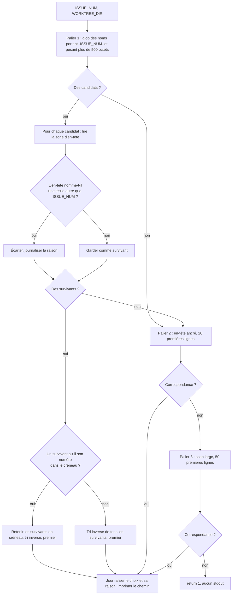

# fix(dispatch): le palier 1 de `_find_issue_plan` réfute les candidats qui appartiennent à une autre issue

**Ticket:** mika issue#2038

---

## Goal Capsule

- **Objective.** Un pilote dispatché pour un ticket travaille sur le plan de ce ticket. Un opérateur qui lit la commande d'entrée du pilote, ou le callout `> - **Plan:**` du corps de l'issue, voit un plan qui appartient à cette issue — sans avoir à ouvrir `dispatch-lib.sh`.
- **Means.** Le palier 1 collecte tous les candidats du glob, puis écarte ceux dont l'en-tête nomme une autre issue, au lieu de retourner le premier résultat (KTD1, KTD2).
- **Authority.** Le corps de mika#2038 fixe les critères d'acceptation. Ce plan fixe le mécanisme. Là où la lettre du ticket et le corpus mesuré divergent, KTD1 porte la résolution.
- **Stop conditions.** Ne pas modifier la **sémantique de correspondance** des paliers 2 et 3 — leurs motifs, leurs zones et leur ordre restent tels quels ; la réfutation est une garde ajoutée après leur correspondance, pas une correspondance différente. Ne pas prétendre corriger mika#2029. Arrêter et remonter si la correction demande de toucher `_detect_plan_on_branch` ou le contrat de convergence architecte.
- **Execution profile.** Bash uniquement (`skills/bundled/_shared/`) plus deux suites de tests. Aucun changement Rust, aucun build, aucun déploiement.
- **Tail ownership.** PR sur `bug/2038/dispatch-le-glob-de-s-lection-de-plan`, **`Closes #2038`**. Les quatre critères d'acceptation du ticket sont couverts par ce PR.

---

## Product Contract

### Summary

Ancrer la sélection de plan à l'issue qui l'a demandée. Le palier 1 de `_find_issue_plan` conserve son glob permissif mais cesse de faire confiance au premier résultat : chaque candidat est confronté à son propre en-tête, et tout candidat dont l'en-tête nomme une autre issue est écarté. Quand plusieurs candidats survivent, celui dont le numéro occupe le créneau d'issue du nom de fichier l'emporte, et le choix est écrit sur stderr pour devenir observable.

### Problem Frame

Le 2026-08-29 à 05:50 CEST, un pilote dispatché pour mika#2026 a été lancé avec `--command "/ce-work docs/plans/2026-04-11-003-chore-deps-bump-rand-clear-rustsec-2026-0097-plan.md"` — un plan du 11 avril sur le bump de la crate `rand` pour un avis RustSec.

Le palier 1 globe `*-${ISSUE_NUM}-*-plan.md`. Pour `ISSUE_NUM=2026`, ce motif matche `rustsec-2026-0097`. Le palier 1 réussit, retourne, et les paliers 2 et 3 — qui lisent l'en-tête — ne s'exécutent jamais. Ils auraient trouvé le bon plan.

Toute la conception en paliers a été bâtie contre le **faux négatif** : le plan existe et n'est pas trouvé. mika#1602 a élargi l'union des en-têtes à n=3 ; mika#1617 est cité comme « discovery bug » ; les trois messages `PIPELINE FAILURE` de la branche d'échec dev-groom décrivent tous un plan introuvable. Personne n'a gardé la direction inverse. Un palier 1 qui matche par accident ne rate rien — il répond avec assurance et court-circuite les paliers qui auraient corrigé.

Le dégât survit à la session. `_iterate_groom_loop` écrit le chemin sélectionné dans le corps de l'issue sous la forme `> - **Plan:** \`<relpath>\` (committed on branch @ \`<sha>\`)` ; `_detect_plan_on_branch` relit ce callout et pose `ENTRY_COMMAND="/ce-work $PLAN_PATH"`. Le corps de mika#2026 porte encore aujourd'hui le chemin d'avril, donc chaque re-dispatch de ce ticket répète l'erreur.

### Requirements

**Correction de la sélection**

- R1. Le palier 1 ne retourne pas un plan dont l'en-tête nomme une issue autre que `ISSUE_NUM`.
- R2. Le palier 1 retourne toujours un plan dont le nom de fichier porte `ISSUE_NUM` hors de la position canonique du créneau.
- R3. Le palier 1 retourne toujours un plan qui ne porte aucun en-tête de ticket, quand son nom de fichier matche.
- R4. Quand plus d'un candidat survit à la réfutation, le palier 1 préfère celui dont le numéro occupe le créneau d'issue du nom de fichier, puis le plus récent par tri inverse.

**Observabilité**

- R5. Le palier 1 écrit sur stderr le plan retenu et la raison de sa victoire, ainsi que la raison de l'écartement de chaque candidat rejeté.
- R6. Ce stderr atteint l'opérateur au point d'appel vivant, au lieu d'être jeté.
- R7. Un candidat réfuté n'est pas rendu par un palier ultérieur : la garde tient au palier qui lit les corps, pas seulement au palier 1.
- R8. Quand un candidat a été écarté, le message d'échec du pipeline le dit, au lieu d'affirmer que rien n'a matché.

### Key Decisions

- **Réfuter, pas confirmer** — un candidat n'est rejeté que sur preuve positive qu'il appartient à une autre issue. Governs R1, R3.
- **Garder le glob permissif** — la convention de nommage n'est pas assez respectée pour servir de filtre. Governs R2.

### Scope Boundaries

- La sémantique des paliers 2 et 3 est inchangée. Leurs expressions régulières, leurs zones d'en-tête (20 et 50 lignes) et leur ordre restent tels quels.
- Ce ticket ne traite pas mika#2029. mika#2013 et mika#1963 ont reçu le bon plan la même nuit et se sont arrêtés de façon identique (zéro appel d'outil, `idle_timeout` 300 s). Défaut distinct.

#### Deferred to Follow-Up Work

- Le corps de mika#2026 porte encore le chemin du plan d'avril dans son callout `> - **Plan:**`. Réparer ce corps est une remédiation opérateur sur un objet GitHub vivant, pas un changement de code, et n'appartient pas à ce PR.
- Une garde qui validerait le callout à la lecture dans `_detect_plan_on_branch` (confronter l'en-tête du plan cité à l'issue qui le porte) rattraperait un corps déjà empoisonné. Hors scope ici : ce plan corrige l'écrivain, pas le lecteur.

### Sources

- `skills/bundled/_shared/dispatch-lib.sh` — `_find_issue_plan` (les trois paliers et leur commentaire de conception), son point d'appel vivant dans `_post_flight_recovery`, l'écriture du callout dans la boucle de grooming, et `_detect_plan_on_branch`.
- `docs/solutions/workflow-issues/find-issue-plan-header-shape-widening-2026-06-27.md` — la lignée faux-négatif (mika#1381, mika#771, mika#1600) et sa consigne permanente de tester par le comportement plutôt qu'en ré-encodant l'expression régulière.
- Mesuré sur les 745 fichiers `*-plan.md` de `docs/plans/` à `origin/main` — voir le tableau du corpus en Planning Contract.

---

## Planning Contract

### Mesures du corpus

Ces quatre nombres décident de la conception. Tous sont des comptages sur les 745 fichiers `*-plan.md` de `docs/plans/`.

| Mesure | Compte | Part |
|---|---|---|
| Fichiers conformes positionnellement à `<date>-<NNN>-<type>-<issue>-` | 255 | 34 % |
| Fichiers avec un en-tête ancré de palier 2 dans les 20 premières lignes | 208 | 28 % |
| Fichiers avec seulement un marqueur large de palier 3 dans les 50 premières lignes | 442 | 59 % |
| Fichiers sans aucun marqueur de numéro d'issue | 95 | 13 % |

Les noms de fichier portant un nombre à quatre chiffres hors du créneau d'issue se répartissent en trois classes.

- **Faux positif** — `2026-04-11-003-chore-deps-bump-rand-clear-rustsec-2026-0097-plan.md`. Le `2026` est l'année d'un avis RustSec. Son en-tête porte `**Issue:** #539`.
- **Correct mais hors créneau** — `2026-05-19-feat-1150-send-message-guard-cohort-F2-plan.md` (pas de compteur `NNN`), `2026-06-28-004-1615-fix-dispatch-lib-post-flight-recovery-plan.md` (issue avant le type), `2026-06-10-001-fix-mika-1475-deploy-info-off-main-abort-plan.md` (préfixe `mika-`). Un filtre positionnel casse ces trois-là.
- **Réellement ambigu** — `2026-06-30-011-fix-1679-dispatch-lib-mika-1383-recovery-guards-plan.md` cite un autre ticket dans son slug. Son frontmatter porte `issue: 1679`.

### Key Technical Decisions

- KTD1. **Garder le glob du palier 1 permissif ; ne pas l'ancrer positionnellement comme filtre exclusif.** Seuls 34 % du corpus respectent la convention de créneau. Un glob positionnel strict échangerait un faux positif contre environ 490 fichiers tombant hors du palier 1 — la classe de faux négatif que cette fonction existe pour prévenir. Le premier critère d'acceptation du ticket demande un ancrage positionnel ; son intention déclarée est qu'un `-2026-` dans un slug ne puisse pas passer pour le créneau d'issue. Cette intention est satisfaite par KTD2 plus KTD4 : le créneau est un signal de départage et de classement, pas une porte. Governs R2, R4.

- KTD2. **Un candidat n'est rejeté que si son en-tête nomme une autre issue.** L'absence d'en-tête n'est pas une preuve contre un candidat — 13 % du corpus ne porte aucun marqueur, et exiger une confirmation positive rendrait ces plans indécouvrables au palier 1. Le silence n'est pas une réfutation. Governs R1, R3.

- KTD3. **Le motif de réfutation est plus large que le motif de correspondance du palier 2.** Le palier 2 exige `mika[[:space:]]?(issue)?#N`. L'en-tête du cas fondateur est `**Issue:** #539` — sans préfixe `mika` — donc une sonde de forme palier 2 ne le verrait pas et le bug survivrait à la correction. La réfutation doit aussi lire un `#N` nu après une étiquette ticket/issue, et les clés YAML `issue:`/`ticket:`/`number:` suivies d'une valeur numérique nue, forme que porte `2026-06-30-011-fix-1679-...`. Scanner la même zone d'en-tête de 20 lignes que le palier 2, pour qu'une prose de corps citant un autre ticket ne puisse pas rejeter un candidat valide. Governs R1.

- KTD4. **La position dans le créneau classe les survivants ; elle n'en élimine aucun.** Après réfutation, préférer un candidat dont le numéro occupe le créneau `<date>-<NNN>-<type>-<issue>-` ; à défaut, retomber sur l'ordre de tri inverse. C'est ce qui rend l'intention positionnelle du ticket porteuse sans la rendre excluante. Governs R4.

- KTD6. **La réfutation tient aussi au palier 3, pas seulement au palier 1.** Mesuré sur le corpus réel après la première implémentation : réfuter au seul palier 1 déplace le défaut au lieu de le fermer. Pour `ISSUE_NUM=2026` le palier 1 écartait bien le plan d'avril, puis le palier 3 rendait un plan appartenant à mika#2038 — dont le Problem Frame nomme mika#2026 — et le pilote repartait sur un plan étranger. Même forme pour #1383, qui recevait le plan de #1685. Le palier 3 matche une simple mention du numéro dans les 50 premières lignes ; c'est un motif conçu pour trouver une raison d'**accepter**, où l'erreur est rattrapable, et la réfutation en est la garde compensatoire. Le palier 2 n'a pas besoin de garde : il matche un en-tête ancré qui nomme CETTE issue, donc un candidat qu'il accepte ne peut pas être réfuté. Governs R7.

- KTD7. **Une réfutation doit remonter jusqu'au message d'échec.** Les trois chaînes `PIPELINE FAILURE` affirment « no filename match … no anchored header match … » et orientent l'opérateur vers un bug de découverte ou une dérive du pilote. Après une réfutation, c'est faux : un plan a matché et a été écarté délibérément. La cause réelle la plus probable est un en-tête qui nomme le mauvais ticket — un parent de milestone au lieu de la sous-issue — et cela se corrige dans l'en-tête, pas en élargissant la découverte. `_find_issue_plan` publie donc ses écartements dans `FIND_ISSUE_PLAN_REFUTED`, sur le même contrat de globale non-`local` que `GROOM_LOOP_FAILURE_REASON`. Governs R8.

- KTD5. **Journaliser sur stderr, garder stdout propre.** `_find_issue_plan` communique en imprimant le chemin sur stdout ; les appelants le capturent par substitution de commande. Les diagnostics vont sur stderr, dans la forme `echo ... >&2` que `_detect_plan_on_branch` utilise déjà. Governs R5.

### High-Level Technical Design

Le palier 1 passe de « le premier gagne » à « collecter, réfuter, classer ». Les paliers 2 et 3 sont intacts et s'exécutent toujours quand le palier 1 ne rend rien.

### Risques

- **Sur-déclenchement de la réfutation.** Un motif de réfutation trop large rejetterait des candidats valides et rouvrirait la classe faux-négatif. La preuve exigée est le diff de corpus de la note d'exécution de U2, pas la lecture du code.

### Assumptions

- La zone d'en-tête retenue pour la réfutation est celle des 20 premières lignes, comme au palier 2. Un plan qui ne nomme son ticket qu'en dessous de la ligne 20 n'est pas réfutable par ce mécanisme et sera accepté — acceptable sous KTD2, l'acceptation étant la direction sûre pour un candidat non réfuté.
- La réfutation lit **tous** les numéros d'issue que la zone d'en-tête revendique, pas seulement le premier. Un en-tête qui en nomme plusieurs — un plan pour un ticket dont le titre cite d'autres tickets — ne réfute que si aucun des numéros nommés n'est `ISSUE_NUM`.
- `docs/plans/` sur un worktree de pilote a la même forme de corpus que celle mesurée sur `origin/main`, où les mesures ont été prises.

---

## Implementation Units

### U1. Helper de réfutation d'en-tête

**Goal:** une fonction unique qui répond à « l'en-tête de ce fichier de plan revendique-t-il une issue autre que `ISSUE_NUM` ? ».

**Requirements:** R1

**Dependencies:** aucune

**Files:**
- `skills/bundled/_shared/dispatch-lib.sh` (nouveau helper, placé à côté de `_find_issue_plan`)

**Approach:**
1. Prendre le chemin du candidat et le numéro d'issue cible en arguments ; ne pas lire de globales, pour que le helper soit testable isolément.
2. Lire les 20 premières lignes une seule fois.
3. Extraire tous les numéros d'issue que l'en-tête revendique, selon les formes nommées en KTD3 : une étiquette ticket/issue suivie de `mika#N`, `mika issue#N` ou `#N` nu ; et les clés YAML `issue:`/`ticket:`/`number:` avec valeur numérique nue.
4. Retourner « réfuté » seulement si au moins un numéro a été extrait et qu'aucun n'égale la cible. Aucun numéro extrait signifie non réfuté.
5. Utiliser une correspondance à frontière de mot sur le numéro, pour que `ISSUE_NUM=160` ne matche pas `#1600` — la même discipline `\b` sur laquelle repose déjà l'expression régulière du palier 2.

**Patterns to follow:** le grep du palier 2 dans `_find_issue_plan` pour le cadrage de la zone d'en-tête et la gestion des frontières ; la forme de validation d'arguments de `_arch_ask` pour un helper qui prend des arguments explicites.

**Test scenarios:**
- En-tête `**Issue:** #539`, cible 2026 → réfuté. C'est le cas fondateur mot pour mot.
- En-tête `**Ticket:** mika issue#2038`, cible 2038 → non réfuté.
- Frontmatter YAML `issue: 1679`, cible 1383 → réfuté.
- Frontmatter YAML `issue: 1679`, cible 1679 → non réfuté.
- Aucun en-tête (que du remplissage), cible 2026 → non réfuté.
- L'en-tête nomme la cible en ligne 3 et un autre ticket en ligne 12, cible présente → non réfuté.
- En-tête `**Ticket:** mika#1600`, cible 160 → réfuté, pas de correspondance par préfixe.
- Référence de ticket située en ligne 40, cible absente des 20 premières lignes → non réfuté, la zone d'en-tête n'a vu aucune revendication.

**Verification:** le helper rend les deux verdicts correctement pour chaque scénario quand il est sourcé directement, sans dépendre de `WORKTREE_DIR`.

---

### U2. Le palier 1 devient collecter, réfuter, classer

**Goal:** le palier 1 cesse de retourner le premier résultat du glob et retourne le meilleur candidat survivant.

**Requirements:** R1, R2, R3, R4, R5

**Dependencies:** U1

**Files:**
- `skills/bundled/_shared/dispatch-lib.sh` (bloc du palier 1 de `_find_issue_plan` et son commentaire de conception)

**Approach:**
1. Conserver le glob `find ... -name "*-${ISSUE_NUM}-*-plan.md" -size +500c` inchangé (KTD1). Collecter toutes les correspondances au lieu de les passer à `head -1`.
2. Filtrer chaque candidat par le helper de U1 ; journaliser chaque écartement sur stderr avec le chemin du candidat et l'issue que son en-tête revendiquait.
3. Classer les survivants : d'abord ceux dont le numéro occupe le créneau `<date>-<NNN>-<type>-<issue>-`, puis par ordre de tri inverse des noms au sein de chaque groupe (KTD4).
4. Imprimer le gagnant sur stdout et journaliser sur stderr la sélection et la raison de sa victoire (KTD5).
5. Quand aucun candidat ne survit, retomber sur le palier 2 au lieu de retourner — un palier 1 entièrement réfuté est le même état qu'un palier 1 vide.
6. Corriger le commentaire de bloc périmé au-dessus de `_find_issue_plan` qui affirme que les primitives de la boucle iterate n'ont pas de point d'appel dans le chemin de dispatch vivant. `_post_flight_recovery` l'appelle sous `SKILL = dev-groom`, et c'est ce chemin qui a écrit le callout de mika#2026.

**Execution note:** avant de déclarer cette unité terminée, exécuter l'ancien et le nouveau `_find_issue_plan` sur le corpus réel de 745 fichiers de `docs/plans/`, pour chaque numéro d'issue apparaissant dans un nom de fichier, et comparer les deux ensembles de résultats. Le diff attendu est petit et chaque entrée doit s'expliquer comme un faux positif corrigé. Un diff large signifie que le classement ou la réfutation sur-déclenche et que la classe faux-négatif a été rouverte. Cette comparaison est jetable : c'est une preuve de vérification, pas un test à committer.

**Patterns to follow:** les boucles `while IFS= read -r candidate; do ... done < <(find ...)` déjà présentes aux paliers 2 et 3 — même forme d'itération, même garde `[ -r "$candidate" ] || continue`.

**Test scenarios:**
- Les fixtures ne contiennent que `2026-04-11-003-chore-deps-bump-rand-clear-rustsec-2026-0097-plan.md` avec l'en-tête `**Issue:** #539` ; cible 2026 → le palier 1 ne rend rien et la fonction retombe sur les paliers suivants.
- Même jeu de fixtures plus un plan correctement en-têté pour 2026 dont le nom omet `-2026-` ; cible 2026 → le bon plan est retourné via le palier 2.
- Le plan d'avril seul, cible 2026 → le palier 3 ne le reprend pas non plus ; la fonction retourne non nul. Ce scénario vérifie le risque nommé en Planning Contract au lieu de le supposer.
- Fixture `2026-05-19-feat-1150-send-message-guard-cohort-F2-plan.md` avec l'en-tête `ticket: mika#1150` ; cible 1150 → retourné par le palier 1 malgré le nom hors créneau.
- Fixture au nom correspondant et sans aucun en-tête ; cible correspondante → retourné par le palier 1.
- Deux survivants, un en créneau et un hors créneau ; cible correspondant aux deux → celui en créneau est retourné.
- Deux survivants en créneau de dates différentes → celui que le tri inverse place en premier est retourné.
- Un candidat écarté produit une ligne stderr nommant son chemin et l'issue revendiquée par son en-tête.
- Une sélection réussie produit une ligne stderr nommant le chemin retenu.
- `docs/plans/` vide, cible quelconque → retour non nul sans stdout, comme avant.

**Verification:** les deux suites existantes passent inchangées, les nouveaux scénarios passent, et le diff de corpus de la note d'exécution ne contient que des corrections explicables.

---

### U3. Faire parvenir le journal du palier 1 à l'opérateur

**Goal:** le raisonnement de sélection écrit en U2 n'est pas avalé au point d'appel vivant.

**Requirements:** R6

**Dependencies:** U2

**Files:**
- `skills/bundled/_shared/dispatch-lib.sh` (l'appel à `_find_issue_plan` dans `_post_flight_recovery`)

**Approach:**
1. L'appel vivant est `VALID_PLAN=$(_find_issue_plan 2>/dev/null) || VALID_PLAN=""`. La redirection jette exactement les diagnostics que U2 ajoute : sans cette unité, R5 produit un journal que personne ne lit.
2. Établir ce que le `2>/dev/null` protégeait avant de le retirer. Les trois `find` internes redirigent déjà leur propre stderr, donc la fonction n'écrivait rien sur stderr avant U2 et la redirection externe ne couvrait aucun bruit réel. Consigner cette vérification ; si elle contredit l'attente, garder la redirection et router le journal autrement plutôt que de laisser fuir du bruit.
3. Laisser passer stderr. Conserver le repli `|| VALID_PLAN=""` pour qu'un retour non nul rende toujours une chaîne vide et que la logique de récupération environnante reste inchangée.
4. Confirmer qu'aucun autre appelant ne dépend du silence de `_find_issue_plan` sur stderr — greper le nom de la fonction dans le dépôt et examiner chaque occurrence.

**Test scenarios:**
- Avec des fixtures où le palier 1 écarte un candidat, le stderr du chemin de récupération contient la ligne d'écartement.
- `VALID_PLAN` est toujours vide quand aucun plan n'est trouvé, et la branche de récupération qui dépend de cette vacuité se comporte comme avant.

**Verification:** les tests existants de la branche de récupération dev-groom passent, et la ligne d'écartement est visible dans le stderr capturé.

---

### U4. Étendre les deux suites de tests

**Goal:** le cas fondateur devient un test de régression littéral, et la lignée faux-négatif est protégée.

**Requirements:** R1, R2, R3, R4, R5

**Dependencies:** U1, U2, U3

**Files:**
- `skills/bundled/_shared/tests/test_find_issue_plan.sh`
- `skills/bundled/_shared/test-dispatch-lib.sh` (Test 16)

**Approach:**
1. Ajouter le cas `rustsec-2026-0097` à la suite dédiée, avec le nom de fichier exact et l'en-tête `**Issue:** #539` exact du plan d'avril. Moins que le cas littéral laisserait l'incident fondateur non testé.
2. Ajouter les survivants hors créneau (les formes de nom `-1150-` et `-1475-`) comme cas explicites de non-régression contre KTD1.
3. Ajouter les cas de classement de U2, les deux assertions stderr de R5, et le scénario qui vérifie que le palier 3 ne reprend pas le plan d'avril.
4. Conserver chaque assertion existante des deux suites. Les cas mika#1421, mika#1602 et mika#1617 sont la lignée faux-négatif ; un changement qui exige de les assouplir est le mauvais changement.
5. Tester par le comportement — sourcer `dispatch-lib.sh` et appeler les fonctions sur des fixtures temporaires. Ne pas ré-encoder le motif de réfutation dans le test, conformément à la consigne permanente de `docs/solutions/workflow-issues/find-issue-plan-header-shape-widening-2026-06-27.md` : un motif ré-encodé laisserait passer une faute de frappe des deux côtés.

**Patterns to follow:** le helper de fixture `write_plan` et la forme `assert_eq` / `assert_empty` déjà présents dans `tests/test_find_issue_plan.sh` ; la forme de sonde à environnement injecté du Test 16 de `test-dispatch-lib.sh`.

**Test scenarios:** ceux énumérés en U1 et U2 — cette unité est l'endroit où ils atterrissent.

**Verification:** les deux suites sortent en 0 avec les nouvelles assertions comptées, et chacune rapporte toujours ses assertions préexistantes.

---

### U5. Fermer la classe au palier 3 et rendre l'échec honnête

**Goal:** un candidat réfuté n'est rendu par aucun palier, et l'opérateur apprend qu'un plan a été écarté.

**Requirements:** R7, R8

**Dependencies:** U1, U2

**Files:**
- `skills/bundled/_shared/dispatch-lib.sh` (boucle du palier 3 ; les trois chaînes `PIPELINE FAILURE` ; le point d'appel de `_post_flight_recovery`)
- `skills/bundled/_shared/tests/test_find_issue_plan.sh`

**Approach:**
1. Consulter `_plan_header_refutes_issue` dans la boucle du palier 3, après sa correspondance et avant de retenir le candidat. Ne pas toucher au motif de correspondance lui-même.
2. Ne pas ajouter la garde au palier 2 : il matche un en-tête ancré qui nomme la cible, donc il est immunisé par construction. Une garde y serait du code mort.
3. Publier les écartements dans `FIND_ISSUE_PLAN_REFUTED`, vidée à l'entrée de `_find_issue_plan`, sur le contrat de globale non-`local` déjà utilisé par `GROOM_LOOP_FAILURE_REASON`.
4. Faire porter aux trois messages `PIPELINE FAILURE` une note conditionnelle nommant les candidats écartés et l'issue que leur en-tête revendique.

**Execution note:** les fixtures des unités précédentes remplissent leurs corps de texte de remplissage qui ne cite jamais le numéro cible — le palier 3 ne peut donc structurellement pas s'y déclencher, et une assertion « non retourné » y est verte sans rien prouver. Écrire d'abord une fixture dont le corps cite `mika#<cible>` dans les 50 premières lignes ; elle doit échouer avant la correction.

**Test scenarios:**
- Un candidat réfuté au palier 1 dont un autre plan, appartenant à une autre issue, cite la cible dans son corps → aucun plan retourné.
- Après une réfutation, `FIND_ISSUE_PLAN_REFUTED` nomme le candidat écarté et l'issue que son en-tête revendique.
- Un appel propre après un appel réfutant → `FIND_ISSUE_PLAN_REFUTED` vide (pas de revendication périmée héritée).

**Verification:** le diff de corpus montre `(none)` pour #2026 au lieu d'un plan étranger, et aucun `(none)` ne correspond à une issue qui possède réellement un plan.

---

## Verification Contract

| Porte | Commande | Porte sur |
|---|---|---|
| Suite de découverte dédiée | `bash skills/bundled/_shared/tests/test_find_issue_plan.sh` | U1, U2, U4 |
| Suite dispatch-lib | `bash skills/bundled/_shared/test-dispatch-lib.sh` | U2, U3, U4 |
| Lint shell | `shellcheck skills/bundled/_shared/dispatch-lib.sh` | U1, U2, U3 |
| Diff de corpus | comparaison jetable des résultats du palier 1 avant/après sur le corpus réel de `docs/plans/` | U2 |
| Artefacts de pipeline | `bash scripts/verify-pipeline.sh` | le PR entier |

Les deux suites doivent sortir en 0. Le diff de corpus est une preuve attachée au corps du PR, pas un test committé.

---

## Definition of Done

- Le palier 1 ne retourne plus un plan dont l'en-tête nomme une autre issue, prouvé par la fixture littérale `rustsec-2026-0097`.
- Le palier 1 retourne toujours les plans hors créneau et les plans sans en-tête, prouvé par les fixtures de non-régression.
- Aucun palier ne rend un candidat réfuté, prouvé par une fixture dont le corps cite la cible — la forme que les fixtures de remplissage ne peuvent pas produire.
- Sur le corpus réel, `ISSUE_NUM=2026` ne rend plus aucun plan au lieu d'un plan étranger.
- Après une réfutation, le message d'échec nomme le candidat écarté au lieu d'affirmer que rien n'a matché.
- Chaque assertion préexistante des deux suites passe toujours, sans modification.
- Le commentaire périmé « no call sites in the live dispatch path » est corrigé.
- Le journal de sélection du palier 1 atteint stderr au point d'appel vivant, après vérification de ce que la redirection couvrait.
- Le diff de corpus a été exécuté et son résultat est consigné dans le corps du PR.
- Aucun code d'impasse ou expérimental issu d'approches abandonnées ne subsiste dans le diff.

---

## Acceptance criteria

- [ ] Le palier 1 ancre le numéro d'issue à sa position réelle dans la convention de nommage (`<date>-<NNN>-<type>-<issue>-<slug>-plan.md`), au lieu d'un `*-N-*` libre. Un `-2026-` apparu dans un slug ne doit pas pouvoir se faire passer pour le créneau d'issue.
- [ ] Un palier 1 qui matche est confirmé par le contenu avant d'être retenu : si l'en-tête du fichier nomme une autre issue, ce n'est pas le bon plan. Le mécanisme de lecture d'en-tête existe déjà aux paliers 2 et 3 — il s'agit de le consulter, pas de l'écrire.
- [ ] Une garde anti-vacuité au test : un plan dont le nom contient `-<autre-nombre>-` ne doit PAS être retenu pour l'issue courante. Le cas `rustsec-2026-0097` fait un cas de test littéral.
- [ ] Quand plusieurs plans matchent, `sort -r | head -1` choisit en silence. Le choix mérite d'être journalisé — un pilote qui part sur un plan doit dire lequel et pourquoi.

**Note sur le premier critère.** L'ancrage positionnel est implémenté comme une préférence de classement (KTD4) doublée d'une réfutation par en-tête (KTD2), et non comme un filtre de glob exclusif. Mesuré sur le corpus réel, seuls 255 des 745 plans respectent la convention de créneau : un filtre positionnel exclusif ferait tomber environ 490 plans hors du palier 1 et rouvrirait la classe faux-négatif que cette fonction existe pour prévenir. L'intention déclarée du critère — qu'un `-2026-` dans un slug ne passe pas pour le créneau d'issue — est satisfaite : le plan d'avril est écarté par réfutation, et la position dans le créneau départage les survivants.
