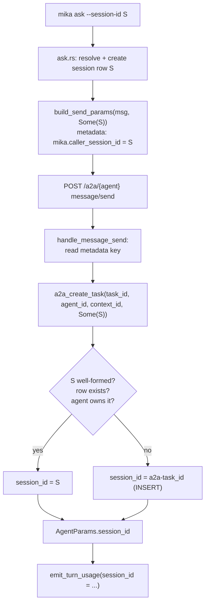

# Caller session_id reaches AgentParams - Plan

## Goal Capsule

- **Objective:** An operator who ran a `mika ask` invocation can name every LLM turn that invocation paid for, by filtering `turn_usage` on the session id the invocation itself chose - with no time window and no attribution guess when the substrate is busy.
- **Means:** Carry the caller's session id over `message/send` request metadata; spirit adopts it as the agent-loop session when it already owns that session row (KTD1, KTD2).
- **Authority:** senara-solutions/mika#2070 owns product behavior. The RT-005 measurement channel (`emit_turn_usage`, `crates/mika-agent/src/agent_loop/mod.rs`) is the consumer this serves.
- **Execution profile:** Small, surgical, three-crate touch. Degradation is the load-bearing property - every unknown, malformed, or foreign session id must fall back to today's behavior rather than fail the turn.
- **Stop conditions:** Stop before making `session_id` required anywhere. Stop before running any RT-005 batch - this plan unblocks the run, it does not perform it.
- **Tail ownership:** The live `/var/log/mika/server.log` verification needs the rebuilt spirit binary deployed; that is an operator/mika-dev acceptance step, not part of this plan's execution.

---

## Product Contract

### Summary

`mika ask` sends its prompt to the local mika-spirit daemon over A2A `message/send`. The CLI's session id stays on the client side; spirit mints `a2a-<task_id>` and runs the agent loop under that. Every `turn_usage` event therefore carries spirit's session, never the caller's. This plan puts the caller's session id in the `message/send` request metadata and lets spirit adopt it as the agent-loop session when the session row already belongs to that agent.

### Problem Frame

Since mika#1727 the CLI is a thin A2A client: the session it creates locally is not the session the turn executes in, and nothing links the two. `crates/mika-cli/src/commands/ask.rs` records this as a deferred follow-up in its own source ("the local bookkeeping session created above no longer records agent turns (spirit owns the execution session); reconciling the two is a follow-up").

That follow-up stopped being a convenience when RT-005 made `turn_usage` its primary measure. RT-005's estimand is a confidence x reliability interaction on planning tokens across 80 runs in 4 cells. Attributing turns to runs by time slice works only while nothing else speaks. `/var/log/mika/server.log` holds 21 084 `turn_usage` events from all origins, and the substrate speaks constantly - heartbeats, reflections, loop dispatches. Slice attribution over that pool mixes in turns the run never paid for, and the resulting error tracks load, so it can track the experimental cell. A treatment-correlated contamination is exactly what a 2x2 design cannot absorb.

The orchestrator already passes `--session-id` per run (`research/rt005-physics-pilot/orchestration/run-batch.sh`) and already documents that the flag never crosses the wire. The wire is the missing piece.

### Requirements

**Wire carriage**

- R1. `mika ask` sends its resolved session id to spirit as part of the `message/send` request, under a stable, namespaced metadata key.
- R2. The `--remote` path (`run_remote` / `dispatch_remote`) sends no caller session id - it holds no session row the remote agent could own.

**Adoption and degradation**

- R3. Spirit runs the agent loop under the caller's session id when that id is well-formed, names an existing session row, and that row belongs to the agent handling the request.
- R4. When any condition in R3 fails - key absent, malformed value, unknown session, session owned by another agent - spirit falls back to minting `a2a-<task_id>` exactly as today. The turn still runs and `turn_usage` is still emitted.
- R5. `session_id` stays non-optional in `AgentParams` and gains no `Option` wrapper anywhere on this path.

**Measurement**

- R6. The `turn_usage` event for a turn started by `mika ask --session-id S` carries `session_id = S`.
- R7. Two invocations with distinct session ids produce disjoint `turn_usage` sets under a `session_id` filter, with no time-window narrowing.

**Task isolation**

- R9. A Task's returned history contains only that task's messages, even when several tasks share an adopted session.

**Source hygiene**

- R8. The deferred-follow-up comment in `crates/mika-cli/src/commands/ask.rs` no longer describes session reconciliation as outstanding.

### Key Decisions

- **Adopt an existing session; never create one from a wire-supplied id.** Governs R3, R4. A request may name a session, not conjure one - that keeps an id arriving over the network from inserting rows or attaching turns to another agent's history.
- **Degradation is silent and total.** Governs R4. RT-005 needs the event more than it needs the correlation; a rejected id must never cost a turn.

### Acceptance Examples

- AE1. **Covers R3, R6.** Given agent `mika` and an existing CLI session `rt005-c1-r7`, when `mika ask --agent mika --session-id rt005-c1-r7 "..."` runs, then the emitted `turn_usage` events carry `session_id: rt005-c1-r7`.
- AE2. **Covers R4.** Given a `message/send` whose metadata names `does-not-exist`, when spirit handles it, then the loop runs under `a2a-<task_id>` and `turn_usage` is emitted with that id.
- AE3. **Covers R4.** Given a session row owned by agent `mika-dev` and a request handled by agent `mika`, when spirit handles it, then the id is refused and the loop runs under `a2a-<task_id>`.
- AE5. **Covers R9.** Given two `mika ask` invocations sharing session `S`, when the second returns, then its `Task` history holds only the second turn's messages — not the first turn's reply concatenated ahead of it.
- AE4. **Covers R7.** Given two invocations with session ids `probe-a` and `probe-b`, when both have completed, then filtering the log on `probe-a` yields only the first invocation's turns and filtering on `probe-b` only the second's.

### Scope Boundaries

**Deferred for later**

- Verbose `tokens.*` in the CLI metadata envelope - the first of the two follow-ups quoted in `ask.rs`. It is a display convenience, not the measurement channel, and mika#2070 puts it out of scope.
- Signal O documentation, handled separately.

**Outside this change**

- Any RT-005 run, of 80 or of 3. This plan removes the blocker; the run is operator-gated.
- Threading `--model` / `--enable-skill` / `--disable-skill` to spirit (the other deferred follow-up in the same comment block) - it needs a config channel, not a session id.

### Sources

- `crates/mika-cli/src/commands/ask.rs` - session resolution (lines ~107-165), spirit dispatch (~330-345), the deferred-follow-up comment block (~300-312).
- `crates/mika-agent/src/server/a2a.rs` - `handle_message_send`, `handle_message_stream`, `run_a2a_agent`.
- `crates/mika-agent/src/a2a_db.rs:70` - `a2a_create_task`, which mints `a2a-<task_id>`.
- `crates/mika-agent/src/agent_loop/mod.rs` - `AgentParams.session_id`, `emit_turn_usage`.
- `crates/mika-common/src/home.rs:75-78` - the single shared container database `{home_dir}/data/mika.db`, which is why the CLI's session row is already visible to spirit.
- `research/rt005-physics-pilot/orchestration/run-batch.sh:415-416` - the slice-correlation net this replaces.

---

## Planning Contract

### Key Technical Decisions

- KTD1. **Carry the id in `MessageSendParams.metadata` under `mika.caller_session_id`.** Governs R1. The A2A `Message.contextId` field is the tempting alternative, but spirit already stores it in `a2a_task_map.context_id` with conversation-context meaning; overloading it would change an existing field's semantics for every A2A client. Request-level `metadata` is additive, already in the protocol type, and ignored by servers that do not read it.
- KTD2. **Adopt-if-owned, in `a2a_create_task`.** Governs R3, R4. The CLI and spirit share one database (`{home_dir}/data/mika.db`), so by the time `message/send` arrives, the caller's session row already exists. Adoption is therefore a lookup plus an ownership check - no INSERT, no foreign-key risk, no path by which a wire value creates state. Rejecting instead of creating is what makes R4's fallback the only failure mode.
- KTD5. **Scope a Task's history by task id, not by session id.** Governs R9. `a2a_get_messages` filtered on `session_id` alone, which was exact only because a session belonged to exactly one task. Adoption makes that many-to-one, so the filter now also matches the task: the agent loop stamps the A2A task id as each message's `trace_id`, and `a2a_insert_message` records it under `metadata.a2a_task_id`. Matching either keeps tasks that predate adoption readable. Without this, the grooming retry in `skills/bundled/_shared/dispatch-lib.sh` — which reuses one session on purpose — would receive both turns' replies concatenated and parse the wrong verdict.
- KTD6. **One constant in `mika-a2a`, not one per crate.** Governs R1. The wire key is a protocol element, and both `mika-cli` and `mika-agent` depend on `mika-a2a`, so it lives beside `MessageSendParams`. A copy per crate with a matching literal test would let a one-sided rename pass both suites green and kill correlation silently.
- KTD3. **Validate shape before the lookup.** Governs R4. The id reaches `tracing` as a structured field; reject empty, over-length (>200 bytes), and control-character values before touching the database, so a malformed value cannot reach the log line.
- KTD4. **Both `message/send` and `message/stream` adopt.** Governs R3. The two handlers already call `a2a_create_task` identically; No in-repo client streams today — the TUI runs the loop in process and never touches A2A — but the rule is a property of the protocol surface, not of today's callers, and a second call site is exactly where a parameter goes missing unnoticed.

### High-Level Technical Design



### Known limits of the correlation

These bound what a `session_id` filter can attribute. Named here because the measurement, not the mechanism, is what this work serves.

- A caller that reuses one session id across invocations shares its `turn_usage` across them. That is the caller's choice — a singleton agent's canonical session, or a retry that wants the agent to see its own prior turn. Per-run attribution needs a per-run `--session-id`, which the RT-005 orchestrator already passes.
- A turn that delegates or starts a team run spends tokens under `delegate-*` / `team-*` sessions of its own. Filtering on the caller's id captures the turn, not its fan-out.
- Adoption needs a shared database, so it does not reach across the gateway. `--remote` therefore sends nothing.

### Assumptions

- The CLI and the spirit daemon addressed by `MIKA_SPIRIT_URL` run against the same `{home_dir}/data/mika.db`. This holds for the local thin-client path this plan targets; the `--remote` path does not, which is why R2 sends nothing there.
- No agent in the current fleet sets `[session] singleton = true`, so no invocation resolves to a canonical session today. When one does, adoption makes `mika ask` share that agent's canonical session - restoring the pre-mika#1727 behavior mika#1401 intended, not introducing a new one. Named here because it changes how much history such an agent's turn loads.

### Sequencing

U1 and U2 are independent - U1 puts the value on the wire, U2 teaches the server to read it. U3 depends on both being in the diff. U4 is the end-to-end proof and runs last.

---

## Implementation Units

### U1. CLI sends the caller session id

- **Goal:** The `message/send` request body carries `metadata["mika.caller_session_id"]` for the local spirit path, and carries nothing new for `--remote`. Satisfies R1, R2.
- **Files:** `crates/mika-cli/src/remote_ask.rs`, `crates/mika-cli/src/commands/ask.rs`
- **Approach:** Give `build_send_params` and `send_message_to_agent` a `caller_session_id: Option<&str>` parameter. When `Some`, populate `MessageSendParams.metadata` with the single key `mika.caller_session_id`; when `None`, leave `metadata: None` so the serialized body is byte-identical to today. `ask.rs` passes `Some(&session_id)` - the same id it uses for local bookkeeping and for `end_session_unless_canonical`. `dispatch_remote` passes `None` per R2. Define the key as a `pub const` in `remote_ask.rs` so the server-side test can reference one spelling.
- **Test scenarios** (`crates/mika-cli/src/remote_ask.rs` unit tests, `crates/mika-cli/tests/remote_ask_integration.rs`):
  - `build_send_params(msg, Some("s1"))` produces metadata containing exactly `mika.caller_session_id: "s1"`.
  - `build_send_params(msg, None)` produces `metadata: None`, and the serialized JSON has no `metadata` key.
  - Integration: the mock A2A server captures a `dispatch_remote` request body and asserts no `mika.caller_session_id` key is present (guards R2).
  - Integration: a `send_message_to_agent(..., Some("probe-a"))` call against the mock captures `params.metadata["mika.caller_session_id"] == "probe-a"`.
- **Verification:** `cargo test -p mika-cli`

### U2. Spirit adopts an owned caller session

- **Goal:** `a2a_create_task` returns the caller's session id when it is well-formed, present, and owned by the handling agent; otherwise it returns `a2a-<task_id>` as today. Satisfies R3, R4, R5.
- **Files:** `crates/mika-agent/src/a2a_db.rs`, `crates/mika-agent/src/async_db.rs`, `crates/mika-agent/src/server/a2a.rs`
- **Approach:** Add a fourth parameter `caller_session_id: Option<&str>` to `Database::a2a_create_task` and its `AsyncDatabase` wrapper. Inside, a private `fn adoptable_session_id(&self, candidate: &str, agent_id: &str) -> bool` applies KTD3's shape check (non-empty, <= 200 bytes, no control characters) then a single `SELECT agent_id FROM sessions WHERE id = ?` and compares against `agent_id`. On adoption, skip the `INSERT INTO sessions` and use the caller's id for the `tasks.created_by_session` column and the `a2a_task_map.session_id` mapping. On refusal, log at `debug` with the reason and take today's path unchanged. In `server/a2a.rs`, add `fn caller_session_id(params: &MessageSendParams) -> Option<&str>` reading the `mika.caller_session_id` key as a string, and pass it at both `a2a_create_task` call sites (KTD4). Nothing about `AgentParams` changes - it already receives whatever `a2a_create_task` returned.
- **Test scenarios** (`crates/mika-agent/src/a2a_db.rs` unit tests, extending the existing `a2a_create_task` block):
  - Caller session exists and is owned by the agent: returned id equals the caller's, no new `sessions` row is created, and `a2a_task_map.session_id` names it.
  - Caller session id names a row owned by a different agent: returned id is `a2a-<task_id>`, and the other agent's session is untouched.
  - Caller session id is unknown: returned id is `a2a-<task_id>`.
  - Caller session id is empty, over 200 bytes, or contains `\n`: returned id is `a2a-<task_id>` and no lookup-driven side effect occurs.
  - `None` caller session id: byte-for-byte today's behavior (regression guard for R4/R5).
  - `server/a2a.rs` unit test: `caller_session_id` extracts the string from request metadata, and returns `None` for a missing key, a null value, and a non-string value.
- **Verification:** `cargo test -p mika-agent a2a`

### U3. Retire the resolved follow-up

- **Goal:** The comment block in `ask.rs` no longer lists session reconciliation as deferred. Satisfies R8.
- **Files:** `crates/mika-cli/src/commands/ask.rs`
- **Approach:** Delete the third bullet ("the local bookkeeping session created above no longer records agent turns...") from the `Deferred follow-ups` block and replace it with a short note stating that the caller's session id now travels in `message/send` metadata and spirit adopts it when it owns the row (mika#2070). Leave the first two bullets - the config channel and verbose `tokens.*` - intact; both are still deferred, and the ticket puts them out of scope.
- **Test scenarios:** None - comment-only. The guard is U4's grep.
- **Verification:** `rg -n 'reconciling the two is a follow-up' crates/` returns nothing.

### U5. Server-seam coverage

- **Goal:** A test fails if either `a2a_create_task` call site stops forwarding the caller session id. Satisfies R3 at the seam.
- **Files:** `crates/mika-agent/src/server/mod.rs` (tests)
- **Approach:** POST a real JSON-RPC `message/send` body through `test_app`'s router with `returnImmediately: true` — which binds the session without starting the agent loop or an LLM call — then assert `a2a_get_session_id(task_id)` names the caller's session. Repeat for `message/stream`, reading the task id out of the SSE frames. Cover the refusal and the no-metadata cases through the same hop.
- **Test scenarios:** caller session adopted on `message/send`; adopted on `message/stream`; no metadata mints `a2a-<task_id>`; a session owned by another agent is refused.
- **Verification:** `cargo test -p mika-agent --lib server::tests::message`, and the tests must fail when both call sites are changed to pass `None`.

### U6. Correct the documents this makes false

- **Goal:** No repo document tells a reader that `--session-id` never crosses the wire. Satisfies R10.
- **Files:** `research/rt005-physics-pilot/orchestration/README.md`, `research/rt005-physics-pilot/orchestration/run-batch.sh` (comments only), `research/rt005-physics-pilot/orchestration/tests/test_run_batch.sh` (comment only), `docs/solutions/best-practices/stale-doc-plus-matching-stub-hides-a-dead-measurement-channel-2026-08-30.md`
- **Approach:** Comments and prose only. The orchestrator's slice-capture logic stays exactly as it is — it is the fallback for a spirit that predates this fix. The compounding entry keeps its incident narrative and gains a dated state note; its lesson is unchanged.
- **Test scenarios:** None — prose. The RT-005 suite must still pass 174/174, proving no logic moved.
- **Verification:** `bash research/rt005-physics-pilot/orchestration/tests/test_run_batch.sh`

### U4. Concurrent-separation proof

- **Goal:** Demonstrate that two concurrent invocations with distinct session ids produce disjoint `turn_usage` sets under a `session_id` filter. Satisfies R6, R7, AE4.
- **Files:** `crates/mika-agent/tests/a2a_caller_session_correlation.rs` (new)
- **Approach:** Follow the `crates/mika-agent/tests/ask_correlation.rs` shape - an in-memory `AsyncDatabase` with two registered agents. Create two CLI-shaped sessions, interleave two `a2a_create_task` calls carrying those ids, and assert the returned session ids are distinct, equal to the callers', and that a third call with an unknown id lands on its own `a2a-` id disjoint from both. This proves the property `turn_usage` filtering depends on: the id reaching `AgentParams.session_id` is the caller's and does not collide across concurrent tasks. The remaining hop - `AgentParams.session_id` to the `session_id` field of the log line - is a direct argument pass in `emit_turn_usage` with no branching.
- **Test scenarios:**
  - Two interleaved tasks with caller sessions `probe-a` / `probe-b` return exactly those ids.
  - A third interleaved task with no caller session returns an `a2a-` id equal to neither.
  - The `a2a_task_map` rows map each task to its own session, so a later `a2a_build_task` reads back the right one.
- **Verification:** `cargo test -p mika-agent --test a2a_caller_session_correlation`

---

## Verification Contract

| Gate | Command | Applies to |
|---|---|---|
| Format | `cargo fmt --all -- --check` | all |
| Lint | `cargo clippy --all-targets -- -D warnings` | all |
| CLI tests | `cargo test -p mika-cli` | U1 |
| Agent tests | `cargo test -p mika-agent a2a` | U2, U4 |
| Follow-up retired | `rg -n 'reconciling the two is a follow-up' crates/` returns nothing | U3 |
| Server seam | `cargo test -p mika-agent --lib server::tests::message` | U5 |
| RT-005 harness intact | `bash research/rt005-physics-pilot/orchestration/tests/test_run_batch.sh` | U6 |
| Wire shape unchanged when absent | `build_send_params(msg, None)` serializes without a `metadata` key | U1 |

**Live verification (operator/mika-dev acceptance, post-merge).** The `/var/log/mika/server.log` half of AC2 needs the rebuilt spirit binary running. After deploy:

```bash
mika ask --agent mika --session-id probe-a "say ok" >/dev/null &
mika ask --agent mika-dev --session-id probe-b "say ok" >/dev/null &
wait
for s in probe-a probe-b; do
  echo "$s: $(jq -r 'select(.fields.event=="turn_usage") | .fields.session_id' /var/log/mika/server.log | grep -c "^$s$")"
done
```

Each filter must return a non-zero count, and no event may carry both ids. Two agents are used because a single agent serializes concurrent A2A requests on its agent lock.

---

## Definition of Done

**Global**

- [ ] All Verification Contract gates pass.
- [ ] No `Option<...>` wrapper was added to `AgentParams.session_id` (R5).
- [ ] No RT-005 batch was run.
- [ ] No abandoned or experimental code remains in the diff.
- [ ] PR body records the live-verification recipe above as the remaining acceptance step, and states plainly that it was not executed here.

**Per unit**

- [ ] U1 - the request body carries `mika.caller_session_id` on the spirit path and is unchanged on the `--remote` path.
- [ ] U2 - all five adoption/refusal cases pass, and the `None` case is byte-identical to prior behavior.
- [ ] U3 - the grep returns nothing and the two still-deferred follow-ups survive.
- [ ] U4 - the concurrent-separation test passes.
- [ ] U5 - both seam tests fail when the call sites pass `None`.
- [ ] U6 - the RT-005 suite still passes 174/174.

## Acceptance criteria

- [ ] AC1 - The caller's `session_id` crosses `message/send` and reaches `AgentParams.session_id`; the `turn_usage` event emitted for that turn carries it.
- [ ] AC2 - A `mika ask` invocation produces `turn_usage` events whose `session_id` isolates exactly its turns in `/var/log/mika/server.log`, with no time window. Proof: two concurrent invocations, and the `session_id` filter that separates their turns.
- [ ] AC3 - The path degrades cleanly: a caller that supplies no session breaks nothing and the event is still emitted, with spirit's session as today.
- [ ] AC4 - The `ask.rs` comment describing this follow-up is removed or updated; the follow-up does not survive its own resolution.
