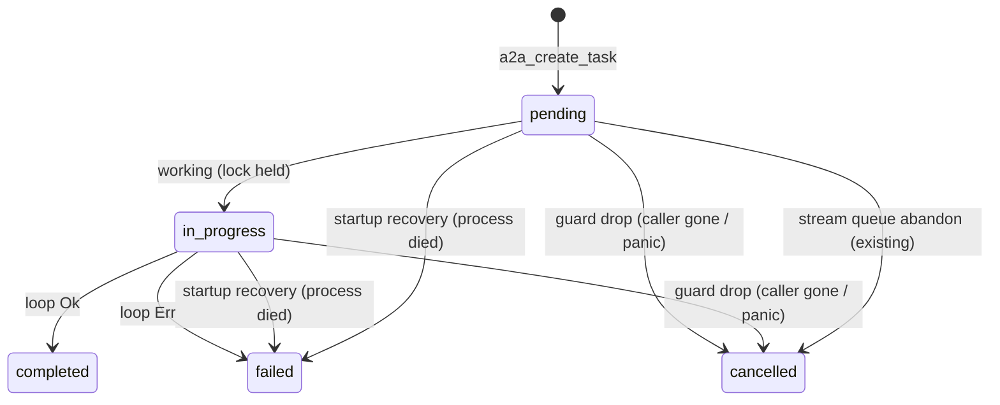

# A2A abandoned turn terminal state - Plan

## Goal Capsule

- Objective: an operator reading the `tasks` ledger (or the monitor that reads it) sees every A2A turn end in a terminal state that says how it ended, and an A2A turn abandoned by its caller leaves a server-side trace naming it, so `in_progress` means "a turn is running now" and nothing else.
- Means: a drop guard on the turn that writes a terminal state when the turn's future ends without one (KTD1, KTD2), plus A2A-specific handling folded into the existing startup recovery for rows a dead process left behind (KTD5).
- Authority: this plan > issue mika#2379 body > orchestrator investigation notes below. The fix shape is session-settled (see KTDs).
- Stop conditions: stop and report if implementation shows a code path other than the spirit daemon's A2A handlers creates `trigger_type='a2a'` rows, or that some consumer schedules `pending` A2A rows (either would invalidate KTD5's safety argument).
- Execution profile: Rust, `crates/mika-agent`; unit tests inline (`#[cfg(test)]`); no schema change.
- Finish/ship: the `/mika` pipeline on branch `bug/2379/agent-les-t-ches-mika-arch-orphelines` opens the PR closing mika#2379.

---

## Product Contract

### Summary

A2A task rows for `mika-arch` stay `in_progress` (`updated_at == created_at`) until the next daemon restart, and new ones keep appearing after it. They are what's left of turns whose HTTP caller hung up mid-turn. Give each abandoned turn a terminal state and a log line the moment it is abandoned, and make the existing restart recovery close A2A rows properly (with `completed_at`, a reason, and a count).

### Problem Frame

Measured on 2026-09-18 (orchestrator investigation, `~/.mika/data/mika.db` + `/var/log/mika/server.log`):

- 11 live orphan rows at 15:39Z, all `agent_id='mika-arch'`, `trigger_type='a2a'`, label `A2A task <uuid>`, `updated_at == created_at`, no `fired_at`.
- `handle_message_send` (`crates/mika-agent/src/server/a2a.rs`) runs the agent turn inside the axum handler future: create row (`pending`) → `working` (same second, hence `updated_at == created_at`) → `run_a2a_agent(...).await` → only then `completed` / `failed`.
- When the caller disconnects, hyper drops the handler future mid-turn. Neither terminal write runs, and no log line says the turn was abandoned.
- Why the caller disconnects: the client send budget (`mika_a2a::client`) is `max(MIKA_A2A_TIMEOUT_SECS=600, MIKA_AGENT_TOTAL_TIMEOUT_SECS)` = 660 s in prod. The server turn has the same 660 s ceiling, but its clock starts later (transit plus the agent-lock queue wait), so on a slow turn the client always hangs up first.
- Log evidence: traces `17ba0089…`, `035e962b…`, `3d8ab24d…`, `2cbc1f35…`, `ff071c78…` all stop abruptly mid-LLM-call about 660 s after creation, with no `A2A task completed via agent loop` or `A2A agent loop failed` line.
- A daemon restart kills in-flight turns the same way, but `TaskEngine::startup_recovery` (`crates/mika-agent/src/task_engine/engine.rs`, step 2, run from `run_server` before `axum::serve`) already marks every non-manual `in_progress` row `failed` at startup. The DB confirms it: the issue's 4 pre-restart orphans are `failed` with `updated_at = 2026-09-18T04:00:55Z`, the restart instant. That recovery sets neither `completed_at` nor a reason, logs nothing, and ignores `pending` rows. So "the restart purges them" is this recovery, and every live orphan comes from a caller hang-up after it.
- `message/stream` runs its turn inside `tokio::spawn`, which a disconnect does not cancel. It leaks only on a panic inside the spawned task.
- No dispatch gate reads these rows (searched `status IN ('pending','in_progress')` sites). The harm is a ledger that lies, and a caller-side timeout the server never records. The underlying slowness (kimi-k2.5 transport timeouts) is a separate concern.

### Requirements

- R1. An A2A `message/send` turn whose handler future is dropped before a terminal write leaves its row `cancelled` with `completed_at` set, never `pending` / `in_progress`.
- R2. The same holds for a `message/stream` turn whose spawned task ends (panic unwind) without a terminal write.
- R3. The abandonment write never overwrites a terminal state (`completed`, `failed`, `cancelled`) already written.
- R4. Each abandonment emits one WARN line with `event = "a2a_turn_abandoned"`, carrying agent, A2A task id, port (`send` / `stream`), and elapsed ms since the turn started.
- R5. At spirit startup, before the router accepts requests, every `trigger_type='a2a'` row in `pending` or `in_progress` for each agent is marked `failed` with `completed_at` and a reason. One `a2a_orphans_swept` line reports the count per agent when it is non-zero. This covers a `message/stream` row still waiting in the lock queue when the process died, which stays `pending` and which today's recovery ignores.
- R6. On the `returnImmediately` branch (row left `pending` by design, no turn runs) the guard is not armed, so a live process never cancels such a row. At the next startup it is swept with the rest (R5). No production caller sets `returnImmediately` (only tests in `server/mod.rs`), and nothing ever runs such a row after a restart.

### Scope Boundaries

- Out: changing timeout budgets (client 600/660 s vs server 660 s). Aligning them is its own ticket; this plan makes the consequence visible and truthful, not rarer.
- Out: cancelling child processes or LLM requests of an abandoned turn. Dropping the future already stops the loop.
- Out: an age-based reaper (see KTD4).
- Out: `tasks/cancel` racing a running stream turn that later writes `completed`. That behavior exists today and is unrelated.

---

## Planning Contract

### Key Technical Decisions

- KTD1. The terminal write rides an RAII guard armed right after the row exists, disarmed after the normal terminal write. Dropping it while armed covers every non-normal exit (disconnect drop, panic unwind) in one place instead of instrumenting each exit. (session-settled: user-directed — chosen over detaching the `message/send` turn into `tokio::spawn`: a detached turn would keep running and hold `agent_lock` for a caller who is gone, which is the cost mika#2163 AC7 already refused on the stream port.)
- KTD2. The guard's `Drop` cannot await. It spawns the write on the current runtime (`tokio::runtime::Handle::try_current()`); with no runtime it logs and gives up, and the startup recovery (KTD5) catches the row on the next start. The write is conditional (`WHERE status IN ('pending','in_progress')`) so R3 holds by construction, and the WARN fires only when a row actually changed. (session-settled: user-directed)
- KTD3. Caller hang-up → `cancelled` (A2A `canceled`, the client walked away). Process death → `failed` (the turn could not finish; no caller chose that). Both write a short reason into `tasks.result` (e.g. `abandoned: caller disconnected before the turn finished` / `orphaned: the daemon running this turn exited`) so the ledger explains itself. (session-settled: user-directed — the issue asked for done/failed; the split keeps the A2A meaning of `canceled` = client-initiated.)
- KTD4. No time-based reaper. A turn is bounded by `MIKA_AGENT_TOTAL_TIMEOUT_SECS`, and the guard plus the startup recovery cover every way a turn can end: normal, error, drop, panic, process death (including a stream turn killed while still `pending` in the lock queue, per R5). An age threshold could reap a live turn that is queued or slow. (session-settled: user-directed — chosen over the issue's suggested N-minute reaper modeled on #2277; that reaper exists because a pilot is an external process with no in-process owner, whereas an A2A turn always has one.)
- KTD5. The A2A sweep lives inside `TaskEngine::startup_recovery` step 2 (`crates/mika-agent/src/task_engine/engine.rs`), run before the generic `in_progress` loop so that loop no longer sees A2A rows. It does not get a second startup sweep of its own. That recovery already owns "fail what a dead process left `in_progress`" and runs from `run_server` before `axum::serve`. Two writers for one transition would race silently. The alternatives are both wrong: `startup_cleanup` is spawned after the router serves, and `init_agent` also runs lazily from `AppState::resolve_agent` (`server/state.rs`) while requests are live, so either could reap a live row. The sweep is safe because A2A rows are created only by this daemon's handlers (`AsyncDatabase::a2a_create_task` is called only from `server/a2a.rs`), and systemd stops the previous process before starting the next. (Revised after document review: an earlier draft put a new sweep in `init_agent`. Evidence: the existing recovery already failed the issue's pre-restart orphans at 04:00:55Z, and `init_agent` has a lazy caller.)

### High-Level Technical Design

A2A task row lifecycle after this change (the dashed edges are the new ones):

A live process never cancels a `returnImmediately` row; it stays `pending` until the next startup (R6).

### Assumptions

- hyper drops the axum handler future when the peer closes the connection. The log evidence (traces that stop mid-call with no terminal line) is consistent with this. The U2 test exercises the guard directly, not hyper.
- Graceful shutdown may drop in-flight turn futures while the runtime is winding down, so a guard-spawned write may never run. The startup recovery (U3) covers that case by design.

---

## Implementation Units

### U1. Conditional abandon and sweep DB operations

**Goal:** Two DB operations the guard and the sweep call.

**Requirements:** R1, R3, R5, KTD2, KTD3

**Dependencies:** none

**Files:**
- `crates/mika-agent/src/a2a_db.rs` (methods + tests)
- `crates/mika-agent/src/async_db.rs` (wrappers, agent-bound like `a2a_create_task`)

**Approach:**
1. `a2a_abandon_task_if_live(a2a_task_id, reason) -> Result<bool>`: sets `status='cancelled'`, `updated_at`, `completed_at`, `result=reason` on the mapped task only when its status is `pending` or `in_progress`. Returns whether a row changed. An unknown id returns `false`, not an error, because the guard must never fail loudly on a missing row.
2. `a2a_sweep_orphans(agent_id, reason) -> Result<usize>`: sets `status='failed'`, `completed_at`, `updated_at`, `result=reason` on every `trigger_type='a2a'` row of that agent in `pending` or `in_progress`. Returns the count.

**Patterns to follow:** `Database::a2a_update_task_state` (same subquery through `a2a_task_map`), `timestamp::now()`.

**Test scenarios:**
- A row in `in_progress` → `abandon` returns `true`, the row is `cancelled` with `completed_at` and `result` set.
- A row in `pending` → `true`, `cancelled`.
- A row already `completed` (and, separately, `failed`) → `false`, status and `completed_at` unchanged.
- Unknown A2A id → `Ok(false)`.
- Sweep: two `in_progress` A2A rows and one `pending` A2A row for agent `mika-arch`, one `completed` A2A row, one `in_progress` non-A2A row (`trigger_type='manual'`), and one `in_progress` A2A row for another agent → returns 3; only those three become `failed`; every other row is unchanged.
- Sweep on a clean DB → returns 0.

**Verification:** the new tests pass; `a2a_update_task_state` tests unchanged.

### U2. Turn guard wired into both ports

**Goal:** Every A2A turn ends in a terminal state even when its future does not finish.

**Requirements:** R1, R2, R3, R4, R6, KTD1, KTD2

**Dependencies:** U1

**Files:**
- `crates/mika-agent/src/server/a2a.rs` (guard type, wiring, tests)

**Approach:**
1. A small guard type holding the per-agent `AsyncDatabase` clone, the A2A task id, the port label, the start `Instant`, and an armed flag. `disarm()` clears the flag. `Drop` while armed spawns U1's abandon call, then logs the `a2a_turn_abandoned` WARN only if the call returned `true`. With no current runtime it logs a WARN saying the row is left for the startup recovery.
2. `handle_message_send`: arm the guard only on the synchronous branch, after `a2a_create_task` succeeds (R6). Disarm it after the `completed` / `failed` write.
3. Stream port: arm the guard at the top of the spawned task (the row already exists when the spawn starts, and no `.await` sits between create and spawn). Disarm it after each terminal write the task makes: the queue-abandon `canceled`, the post-wait refusal `failed`, and `completed` / `failed` in `run_a2a_stream_turn`. Carrying the guard inside `StreamTurn` is the natural way to reach the last two.

**Execution note:** write the guard's drop-while-armed test first; that test is the proof the bug class is closed.

**Patterns to follow:** `BroadcasterGuard` in the same file (a Drop guard that owns cleanup across panics).

**Test scenarios:**
- A guard armed on an `in_progress` row and dropped inside a tokio test runtime → after yielding, the row is `cancelled` and `result` names the abandonment.
- A guard disarmed after a `completed` write and then dropped → the row stays `completed`.
- A guard armed but dropped after the row was already written `failed` (simulating a race) → the row stays `failed` (R3).
- A future holding an armed guard is dropped mid-`.await` (build the future, poll it once against a pending inner future, drop it) → the row ends `cancelled`. This is the disconnect shape.
- A guard dropped inside a spawned task that panics → the row ends `cancelled`.

**Verification:** tests pass. Reading the diff shows no terminal-write path in either port that leaves the guard armed.

### U3. A2A handling in the existing startup recovery

**Goal:** Rows a previous process left open are closed before this process takes requests, with a reason and a count.

**Requirements:** R5, R6, KTD3, KTD5

**Dependencies:** U1

**Files:**
- `crates/mika-agent/src/task_engine/engine.rs` (`startup_recovery` step 2 + test)
- `docs/architecture.md` (A2A lifecycle sentence near the `trigger_type='a2a'` note), plus its crate-local copy synced via `scripts/sync-agent-docs.sh`

**Approach:**
1. In `TaskEngine::startup_recovery`, before the step-2 loop over `in_progress` tasks, call U1's sweep for the engine's agent with the `orphaned:` reason.
2. A non-zero count logs `a2a_orphans_swept` (agent, count) at WARN, because a non-zero count means turns were lost at the last shutdown.
3. A sweep error is logged and recovery continues. The generic loop then fails any A2A rows the sweep missed, exactly as today.
4. Document the lifecycle in `docs/architecture.md`: A2A rows end `completed` / `failed` / `cancelled`, abandoned turns become `cancelled` (`a2a_turn_abandoned`), and rows orphaned by a restart become `failed` at the next start (`a2a_orphans_swept`).

**Patterns to follow:** step 2b `sweep_null_pid_phantoms_at_startup` in the same function (a narrow startup sweep with its own log line, sitting beside the generic loop).

**Test scenarios:**
- An engine over a DB holding an `in_progress` A2A row, a `pending` A2A row, and an `in_progress` non-manual non-A2A row → after `startup_recovery`, both A2A rows are `failed` with `completed_at` and the `orphaned:` reason, and the non-A2A row is `failed` through the unchanged generic path.
- A manual `in_progress` row is untouched, as today.

**Verification:** tests pass; the existing `startup_recovery` tests are unchanged. After deploy, the live orphan count query below returns 0 and `server.log` shows one `a2a_orphans_swept` line for `mika-arch`.

---

## Verification Contract

- `cargo test -p mika-agent` (new tests in `a2a_db.rs` and `server/a2a.rs`)
- `cargo clippy --all-targets -- -D warnings`, `cargo fmt --check`
- `scripts/sync-agent-docs.sh` run if `docs/architecture.md` changes (CI `docs-sync` job)
- Post-merge live check (operator / orchestrator, after `make deploy`): the orphan count query above returns 0. The next A2A call that times out client-side produces an `a2a_turn_abandoned` WARN and a `cancelled` row, not a fresh `in_progress` row.

## Definition of Done

- U1–U3 landed with their tests passing, clippy and fmt clean, docs synced.
- No terminal-write path in `server/a2a.rs` leaves the guard armed; no abandonment path skips the conditional write.
- No abandoned-attempt code left in the diff.
- The PR body leads with the WHY (the 660 s race, log evidence) and says `Closes #2379`.

## Acceptance criteria

- [ ] An A2A `message/send` turn whose handler future is dropped mid-turn leaves its task row `cancelled` with `completed_at` and a `result` reason, never `in_progress` (test: drop-while-armed).
- [ ] A `message/stream` turn whose spawned task panics leaves its row `cancelled` (test: panic-drop).
- [ ] The abandonment write never overwrites `completed` / `failed` / `cancelled` (test: terminal rows untouched).
- [ ] Each abandonment emits exactly one `a2a_turn_abandoned` WARN naming agent, task id, port, and elapsed ms.
- [ ] Spirit startup recovery marks every `trigger_type='a2a'` `pending` / `in_progress` row of each agent `failed` with `completed_at` and a reason before the router serves, and logs `a2a_orphans_swept` with the count; non-A2A rows keep today's recovery and other agents' rows are untouched (test: sweep scenarios).
- [ ] No guard is armed on the `returnImmediately` branch, so a live process never cancels such a row.
- [ ] After deploy, zero `mika-arch` A2A rows are `in_progress` outside a running turn.

## Sources

- Issue senara-solutions/mika#2379; related #2263, #2277 (pilot reaper, contrasted in KTD4), #2163 (A2A wait queue, AC7 abandonment).
- `crates/mika-agent/src/server/a2a.rs` (`handle_message_send`, `handle_message_stream`, `run_a2a_stream_turn`, `BroadcasterGuard`)
- `crates/mika-agent/src/a2a_db.rs` (`a2a_create_task`, `a2a_update_task_state`, state mapping)
- `crates/mika-agent/src/server/mod.rs` (`run_server` startup order, `startup_cleanup`), `crates/mika-agent/src/server/state.rs` (`resolve_agent` lazy init)
- `crates/mika-agent/src/task_engine/engine.rs` (`startup_recovery`)
- `crates/mika-a2a/src/client.rs` (`DEFAULT_TIMEOUT`, send-budget floor)
