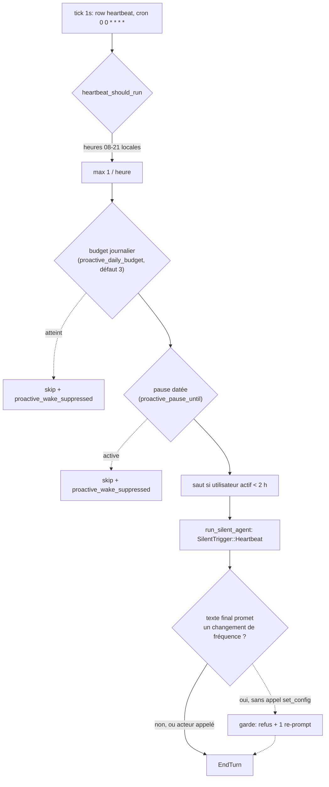
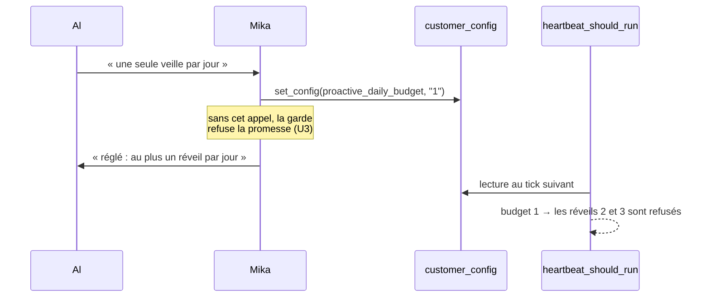

# Une consigne de fréquence sans site d'inscription — Plan

## Goal Capsule

- **Objectif :** une consigne de fréquence donnée en conversation (« une seule veille par jour ») a un site d'inscription durable que le **seul** producteur de messages proactifs lit avant de réveiller l'agent ; et un tour qui promet une correction de fréquence ne peut pas se clore sans que l'outil qui l'exécute ait été appelé.
- **Moyens :** deux clés `customer_config` (budget journalier + pause datée) ajoutées à l'allowlist `SETTABLE_CONFIG_KEYS` — donc réglables par l'outil `set_config` **déjà exposé au modèle**, sans nouvelle surface d'outil (U1) ; lues par `heartbeat_should_run`, qui porte aujourd'hui un littéral `3` (U2) ; une garde EndTurn qui refuse la promesse sans acteur (U3) ; l'observabilité qui rend le budget effectif et ses refus lisibles (U4).
- **Autorité :** ce plan > le corps de mika#2358 > les commentaires. **Le plan rectifie le diagnostic du ticket sur ses trois défauts** — la rectification est le premier livrable, elle est mesurée sur le code, et elle est détaillée en § *Problem Frame*. Le commentaire 2/3 (ground-truth du registre d'Al) est la mesure qui a ouvert la rectification ; ce plan la poursuit jusqu'à la cause.
- **Conditions d'arrêt — deux ont été levées par la mesure, une a été déclenchée et est rapportée ici.**
  - **(a) DÉCLENCHÉE.** « Arrêter et rapporter s'il existe un producteur de messages proactifs vers l'utilisateur autre que `Heartbeat` et `Reminder`. » Il en existe deux (M8, M9), dont **un actif chez Al** : `curator_review`. Le rapport est M8, et il ne suspend pas le plan — il en corrige le périmètre : R8 est rectifié, R9 et U6 sont ajoutés, et ce qui reste hors périmètre est nommé. La condition a fait son travail : elle a converti une complétude supposée en périmètre mesuré.
  - **(b) LEVÉE.** Les écriveurs de `customer_config` en production sont l'outil `set_config` (`tools/set_config.rs:87`), le `/config set` opérateur (`mika-cli/src/commands/config.rs:205`, `tui/commands/handlers.rs:473`) et `server/handlers.rs:303`/`:445` — ce dernier écrivant **uniquement la clé littérale `chat_id`**. Aucun chemin de démarrage ne réécrit ni ne purge une clé arbitraire. Le site d'inscription de KTD1 tient.
  - **(c) LEVÉE.** Le plafond de 3/jour est un littéral `>= 3` (`dispatcher.rs:2019`), atteignable par aucun réglage : `SETTABLE_CONFIG_KEYS` ne porte que `chat_id`, `timezone`, `thinking_level` (`config_keys.rs:7`).
- **Profil d'exécution :** Rust, `crates/mika-agent` + `crates/mika-common` (une ligne d'allowlist) ; tests unitaires inline (`#[cfg(test)]`) ; **aucun changement de schéma** (la table `customer_config` existe, clé/valeur libre).
- **Finish/ship :** le pipeline `/mika` sur la branche `feat/2358/r-currences-veille-consigne-de-fr-quence` ouvre la PR qui clôt mika#2358.

---

## Product Contract

### Summary

Al a demandé une seule veille technique par jour et en a reçu trois. Le registre des récurrences dit `0 0 9 * * *` — une fois par jour, conforme. Les messages excédentaires ne viennent pas d'une récurrence en doublon mais de deux producteurs que personne ne lui a demandés : le **heartbeat**, qui réveille l'agent jusqu'à trois fois par jour avec un prompt l'invitant à partager « quelque chose d'opportun et utile » et qui ne connaît aucune consigne de fréquence ; et la **revue du curateur**, qui lui envoie chaque jour vers 10h locale un message anglais en jargon d'infrastructure (`[Curator] N skill(s) idle… Run mika skills curator status`) sur le canal prévu pour « notifier l'opérateur » — un tenant famille n'ayant pas d'opérateur distinct de son utilisateur. Interrogée, Mika a promis une correction qu'elle ne pouvait pas exécuter : le seul geste atteignable sur la cause est trop grossier pour la consigne reçue, et il est effacé au redémarrage suivant. Ce plan donne à la consigne un site d'inscription que rien ne réécrit, le fait lire par le pré-filtre du heartbeat, tait la notification du curateur sur une persona famille, et refuse la promesse quand l'acteur n'a pas été appelé.

### Problem Frame

Toutes les mesures ci-dessous sont lues sur le code de la branche (HEAD `6cdc6f1d`) ou proviennent de la ground-truth du commentaire 2/3 du ticket. **Le ticket se trompe sur les trois défauts qu'il énonce ; les trois rectifications sont le premier livrable.**

**M1 — Le site que le ticket désigne n'est pas un chemin de production.** `crates/mika-agent/src/tools/create_scheduled_task.rs:17` porte `#[cfg_attr(not(test), allow(dead_code))]` et le doc-comment « Removed from `default_tools()` — long-running skills auto-create callback tasks. Retained for tests ». L'outil est absent du registre (`tools/mod.rs:1064`–`1112`). Le chemin réel par lequel une veille utilisateur est créée est `create_reminder` (registre `tools/mod.rs:1069`) avec `cron_expr` + `timezone` + `action_type = "resume_agent"`, ce qui correspond exactement à la ligne « Veille technique Mika » du registre d'Al (cron `0 0 9 * * *`, créée le 2026-09-09).

**M2 — D1 est faux sur son motif : les leviers de récurrence sont atteignables, par composition.** Le ticket affirme qu'il n'y a « pas d'outil symétrique clairement exposé ». Mesure :

- `list_reminders` (`tools/list_reminders.rs:66`–`79`) rend, pour chaque ligne, **l'`id` et le `cron_expr`** : `- {id}: "{label}" next: {…} (recurring: {cron}, tz: {tz}) [auto]`.
- `get_user_visible_tasks` (`db.rs:7711`) filtre `action_type IN ('send_message','resume_agent')` et `status IN ('pending','in_progress','recurring_active')` — la veille d'Al satisfait les deux, elle **est** donc visible.
- `cancel_task` (`db.rs:6869`) accepte tout statut hors `('completed','failed','cancelled','expired','delivered')` : un `recurring_active` est annulable. `cancel_reminder` délègue à `CancelTaskTool` (`tools/cancel_reminder.rs:35`).
- `create_reminder` insère par `create_task` (`tools/create_reminder.rs:270`), **pas** `create_recurring_task_if_absent` : le veto anti-zombie mika#1742 ne s'applique pas, donc la re-création après annulation aboutit.

Le chemin `list_reminders` → `cancel_task` → `create_reminder` existe donc et fonctionne. Ce qui manque est **l'atomicité** (deux écritures, l'`id` change, un échec du second geste perd la veille), pas l'accès. Et surtout : la veille d'Al était **déjà** à une fois par jour, donc aucun outil de récurrence ne pouvait corriger ce qu'Al a vécu.

**M3 — La cause mesurée du symptôme est le heartbeat, et son plafond est le nombre rapporté.** `HEARTBEAT_CRON = "0 0 * * * *"` (`server/mod.rs:92`), inscrit par `ensure_recurring_task(&db, "heartbeat", HEARTBEAT_CRON, …)` (`server/mod.rs:1606`). Le pré-filtre `heartbeat_should_run` (`task_engine/dispatcher.rs:1987`–2037) applique quatre conditions :

1. heures actives `08:00–21:00` dans le fuseau du client (`if !(8..21).contains(&hour)`) ;
2. max **1 par heure** (`count_heartbeat_sends_last_hour() >= 1`) ;
3. max **3 par jour** (`count_heartbeat_sends_today(&tz_str) >= 3`) — littéral `3` en dur ;
4. saut si l'utilisateur a écrit dans les 2 h.

Le plafond journalier vaut **3**, et Al écrit « **3 rapports techniques**, comme hier ? ». Le framing du tour (`agent_loop/mod.rs:5096`–5101) est : *« This is a scheduled HEARTBEAT check-in. Review the user's commitments, upcoming events, and recent context. If there is something timely and worthwhile to share, use send_message. Otherwise, do nothing. »* — aucune borne de catégorie, et **aucune connaissance d'une consigne de fréquence**. Budget vécu maximal : 1 (la récurrence de 9 h, via `SilentTrigger::Reminder`, dont le framing prescrit explicitement `send_message`, `agent_loop/mod.rs:5148`) + 3 (heartbeat) = **4 messages proactifs par jour**, dont la part « veille technique » suit le centre d'intérêt mémorisé d'Al.

**M4 — D2 est vrai, mais pour un autre motif que celui énoncé, et le motif réel est plus dur.** La promesse d'Al porte sur le heartbeat. Trois mesures établissent qu'aucun acteur ne lui était accessible :

- **Le réglage existant est binaire et hors de portée.** `[heartbeat].enabled` dans `identity.toml` (mika#1404, lu par `task_engine/mod.rs:129`–136, défaut `true`). Il n'est dans aucune surface d'outil.
- **Aucune clé de configuration ne porte une fréquence.** `SETTABLE_CONFIG_KEYS = ["chat_id", "timezone", "thinking_level"]` (`config_keys.rs:7`), l'allowlist partagée par `set_config` (`tools/set_config.rs:32`) et `/config set`.
- **Le seul geste atteignable est trop grossier, et il est effacé au redémarrage.** Le modèle *peut* voir la row `heartbeat` — `list_scheduled_tasks` l'annonce en clair (« including reminders, recurring heartbeat, reflection ») et n'applique aucun filtre sur `action_type`, là où `list_reminders` l'exclut (la row est créée avec `action_type = RUN_SKILL`, `task_engine/mod.rs:81`, hors du `IN ('send_message','resume_agent')` de M2). Il *peut* l'annuler par `cancel_task`. Mais (a) cela exprime « aucun », jamais « un seul » — la consigne reçue n'est pas représentable ; et (b) au démarrage suivant, `ensure_recurring_task` appelle `revert_config_cancel_recurring_task` (`db.rs:6432`), dont le prédicat est `status = 'cancelled'` **sans aucune discrimination de l'origine de l'annulation** : il marque la row `RECURRING_CONFIG_CANCEL_REVERTED_PATH`, ce qui l'exclut de la requête `dead_sibling` du veto mika#1742 (`db.rs:6263`–6267), et le heartbeat est recréé. Une annulation faite au nom de l'utilisateur est donc levée par un mécanisme écrit pour lever les annulations d'opérateur (mika#2271), **dans la fenêtre de grâce de 24 h** (`RECURRING_ZOMBIE_GRACE_HOURS = 24`, `db.rs:45`) comme au-delà, et sans trace de la consigne.

**M5 — D3 n'est pas manifeste, et la phrase qui l'affirme est une fabrication.** La ground-truth (commentaire 2/3) montre exactement une récurrence « Veille technique », `zombie_veto_active = false`, aucun doublon. La phrase du bot « instances récurrentes zombies » n'est ancrée sur aucun résultat d'outil : c'est une auto-explication inventée — la classe que traitent les gardes de fabrication (#953), et un second symptôme du même trou d'observabilité que M4 (le modèle n'a pas d'instrument qui nomme le producteur réel de ses propres messages).

**M6 — Le compteur borne les réveils, pas les envois.** `record_heartbeat_send` (`dispatcher.rs:1429`) est appelé **inconditionnellement** après `run_silent_agent`, y compris quand le tour n'a envoyé aucun message. Le nom dit « send », la mesure dit « réveil ». Conséquence pour la conception, à dire plutôt qu'à corriger ici : un budget posé à cet endroit borne les **occasions** d'envoyer, pas les messages (voir KTD4).

**M7 — Antécédent direct, même utilisateur, et c'est lui qui décide où placer le frein.** Le DDL de `served_content` nomme son incident fondateur (`db.rs:2157`–2162) : *« Al (Vietnam tester) 2026-07-28 — same zen proverb served twice, 6 days apart »*. mika#1867 y a répondu par un ledger dont **l'écriture est confiée au modèle** (l'outil `record_served_content`), avec des catégories fermées (`proverb, quote, joke, poem, recommendation, story, fact`) qui n'incluent pas la veille technique. Sept semaines plus tard, le même utilisateur re-vit une répétition d'une autre nature. C'est la mesure qui tranche le placement : le frein va au substrat, pas au prompt (`feedback_prompt_enforcement_empirically_confirmed_at_loop_substrate` ; mika#2120 a mesuré neuf récurrences sous prompt contre zéro à la main).

**M8 — Il y a un troisième producteur, il est actif chez Al, et il envoie du jargon opérateur en anglais à un tenant famille.** `dispatch_curator_review` (`dispatcher.rs:1784`–1821) se termine par :

```rust
// Notify operator if message_sender is available
if let Some(ref sender) = self.message_sender {
    let summary = format!(
        "[Curator] {} skill(s) idle >{}d for agent {}. Run `mika skills curator status --agent {}` for details.",
        …);
    let _ = sender.send(&summary).await;
}
```

Quatre faits se composent, et c'est leur composition qui est le défaut :

1. **Le commentaire dit « operator », le canal dit « utilisateur ».** `self.message_sender` est le même champ que celui du heartbeat (`dispatcher.rs:1399`) : chez un tenant mono-agent, il route vers le `chat_id` Telegram du client. « Opérateur » et « utilisateur » sont confondus par la topologie, pas par l'intention du code.
2. **Il est actif chez Al.** La ground-truth du commentaire 2/3 porte `curator_review`, cron `0 0 3 * * *`, `recurring_active`, créé le 2026-07-17.
3. **Il tombe en pleine journée chez lui.** Le cron est UTC (`next_fire_at: 2026-09-19T03:00Z`) ; Al est au Vietnam (UTC+7), donc **10h00 heure locale**. Aucun terme d'heures actives ne s'applique à ce chemin — contrairement au heartbeat, `dispatch_curator_review` n'a **aucun pré-filtre** hormis « la liste des candidats est-elle vide ».
4. **Le texte est exactement ce qu'Al a nommé.** Un message anglais commençant par `[Curator]`, comptant des « skills idle » et prescrivant une commande shell, reçu quotidiennement à 10h par un utilisateur famille non technique, est un « rapport technique » dans son vocabulaire à lui. Et `FAMILY_SOUL` interdit en toutes lettres « toute mention … de l'infrastructure sous-jacente — jamais, même si on te le demande » : ce message viole la persona que Vincent a approuvée, par un chemin qui ne traverse aucun prompt.

**Statut épistémique, à ne pas surinterpréter :** c'est un **candidat sérieux** comme composante du « 3 rapports techniques », pas une certitude. L'émission est conditionnelle à `!candidates.is_empty()` — un tenant famille dont l'allowlist est étroite (`FAMILY_AGENT_SKILL_ALLOWLIST`) laisse beaucoup de skills inutilisées au-delà de `max_idle_days` (défaut 30), ce qui rend l'émission probable, mais la ground-truth disponible ne porte **pas** l'historique d'envoi. Ce qui est certain sans cette confirmation : le message part sur le canal utilisateur, il est en anglais, il est en jargon, il est quotidien, et rien ne le borne. Cela suffit à le corriger ; la sonde post-déploiement tranchera sa part exacte dans le vécu d'Al.

**M9 — `SilentTrigger::Reflection` peut techniquement écrire à l'utilisateur, mais n'est pas active chez Al.** Le doc-comment de `run_silent_agent` (`agent_loop/mod.rs:4988`) énonce la règle pour **tous** les tours silencieux : *« If no `send_message` call is made, the run is a silent no-op »* — l'outil est donc disponible, et le framing de `Reflection` (`agent_loop/mod.rs:5115`), qui ne liste que `update_core_memory` / `store_fact` / `update_fact` / `search_memory`, est une **invitation, pas une clôture**. La récurrence `reflection` est inscrite au démarrage à côté du heartbeat (`server/mod.rs:1616`–1626), conditionnée à `identity.reflection.enabled`. Elle est **absente du registre d'Al**, donc désactivée sur ce tenant : elle n'a pas pu contribuer au symptôme, et elle reste hors périmètre (§ *Scope Boundaries*), nommée pour que la prochaine lecture de R8 n'ait pas à la redécouvrir.

### Requirements

- **R1.** Une clé de configuration client borne le nombre de réveils proactifs par jour pour un tenant, avec pour défaut la valeur en vigueur (`3`), de sorte qu'un tenant qui ne la pose pas ne change pas de comportement.
- **R2.** `heartbeat_should_run` applique ce budget à la place du littéral `3`. La règle « max 1 par heure », les heures actives et le saut à 2 h d'activité utilisateur sont inchangés.
- **R3.** La valeur `0` supprime tout réveil proactif (le levier « plus aucun message »), et elle est distinguable de « clé absente ».
- **R4.** Une pause datée est exprimable et bornée : jusqu'à un instant donné, aucun réveil proactif. C'est la moitié de la promesse d'Al que le budget seul ne couvre pas (« plus aucun **aujourd'hui**, et demain un seul »).
- **R5.** Les deux clés sont réglables par le modèle via l'outil `set_config` **déjà exposé**, avec validation par clé qui refuse une valeur hors domaine en nommant le domaine. Aucun nouvel outil n'est ajouté.
- **R6.** Un tour qui, dans son texte final, promet de changer la fréquence de ses messages proactifs (ou d'en suspendre l'envoi) sans avoir appelé l'outil qui l'exécute pendant ce tour est refusé une fois et re-prompté. Un tour qui a appelé l'outil, ou qui dit ce qu'il ne peut pas faire, passe.
- **R7.** Observabilité : (a) un refus de réveil imputable au budget ou à la pause émet une ligne nommant la cause et la valeur en vigueur ; (b) le budget effectif et sa provenance sont lisibles sans lire la base ; (c) le déclenchement et la non-correction de la garde R6 émettent deux événements distincts, joints par un `guard_correlation_id`, selon la famille #953.
- **R8 (rectifié par M8/M9).** Le périmètre est dit dans le code, et il énumère **quatre** producteurs de messages non sollicités, pas un :
  | producteur | sollicité ? | actif chez Al | traité ici |
  |---|---|---|---|
  | `SilentTrigger::Heartbeat` | non | oui (horaire) | **borné par le budget** (U2) |
  | `curator_review` | non | oui (quotidien, 10h locale) | **tu sur un tenant famille** (U6) |
  | `SilentTrigger::Reflection` | non | **non** (désactivée) | hors périmètre, nommé (M9) |
  | `SilentTrigger::Reminder` | **oui** — l'utilisateur l'a demandée | oui (la veille de 9h) | **non borné, délibérément** |
  Le budget de R1 ne borne que le premier. Borner `Reminder` reviendrait à refuser à l'utilisateur ce qu'il a explicitement demandé — c'est l'inverse du défaut à corriger.
- **R9.** Un message dont le contenu est destiné à l'opérateur (jargon d'infrastructure, nom de skill, commande shell) n'est pas émis vers le canal utilisateur d'un tenant dont la persona est `Family`. Sur un tenant opérateur, il est inchangé.

### Scope Boundaries

- **Hors — un outil `update_recurring_task_cron` / `cancel_recurring_task_by_label` exposé au modèle**, que le corps du ticket demande en correctif 1. Motif mesuré (M2) : le chemin existe par composition, il fonctionne, et la récurrence d'Al était déjà conforme — l'ajouter n'aurait rien fermé de ce qu'Al a vécu. Ce qui manque réellement est l'atomicité d'un changement de cron, dont aucune mesure ne montre aujourd'hui le coût. **Ticket de suivi**, à ouvrir si une mesure montre une veille perdue entre le `cancel` et le `create`.
- **Hors — le dédoublonnage sémantique par label normalisé au boot** (correctif 2 du ticket). Motif mesuré (M5) : aucun doublon n'est manifeste dans le registre d'Al, et la dédup par label exact (`create_recurring_task_if_absent`, `COLLATE NOCASE`) n'est franchie par aucun chemin observé. Normaliser un label est un changement de clé d'identité des récurrences : blast radius large (veto mika#1742, mika#2271, mika#2337 s'appuient tous sur l'égalité de label), pour un défaut non mesuré. **Ticket de suivi**, avec pour préalable une mesure : un registre portant deux récurrences de même intention sous deux labels.
- **Hors — faire du compteur `heartbeat_sends` un compteur d'envois** (M6). Le rate-limit horaire en dépend, et déplacer `record_heartbeat_send` derrière un envoi effectif changerait la sémantique des deux bornes en même temps. Nommé en KTD4, laissé intact.
- **Hors — le framing du tour heartbeat.** Lui apprendre la consigne serait la moitié prompt, dont M7 mesure qu'elle ne tient pas seule. U3 protège, U2 borne ; le framing n'est pas touché, donc aucune régression de ton n'est introduite.
- **Hors — l'endpoint admin d'inspection** (commentaire 1/3) : déjà livré (mika#2366 / mika-cloud#246), c'est lui qui a produit la ground-truth du commentaire 2/3.
- **Hors — la cause du 09-17 côté re-enregistrement transitoire** (#2351 / #1742, hypothèse (a) du commentaire 2/3). M3 fournit une explication complète du symptôme par le heartbeat, sans recourir à un doublon transitoire ; ce plan ne durcit rien de ce côté.
- **Hors — borner `SilentTrigger::Reflection`** (M9). Elle peut techniquement appeler `send_message`, mais elle est désactivée chez Al, son framing ne l'y invite pas, et aucune mesure ne montre un tour de réflexion ayant écrit à un utilisateur. La borner supposerait de décider si une réflexion qui a quelque chose d'important à dire doit se taire — une question produit qu'aucune mesure n'ouvre aujourd'hui. **Ticket de suivi**, avec pour préalable une mesure : un `send_message` émis depuis un tour `Reflection`.
- **Hors — faire du message du curator un message utile au client famille** (M8/KTD8). La retenue de U5 supprime un message que le destinataire ne peut pas actionner ; lui en substituer un reformulé supposerait qu'il existe une version que ce destinataire *puisse* actionner, ce qui est faux — l'archivage d'une skill est un geste opérateur.
- **Hors — le pré-filtre d'heures actives du curator.** `dispatch_curator_review` n'en a aucun (M8, fait 3), donc il peut tomber à n'importe quelle heure locale. Pour un tenant famille la retenue de U5 rend le point sans objet ; pour un tenant opérateur, recevoir une notification d'infrastructure à 3h du matin est le régime accepté aujourd'hui et personne ne s'en est plaint. **Ticket de suivi** si une mesure le demande.
- **Hors — un budget par personne.** `customer_config` est clé par `agent_id` (`db.rs:12354`), soit par tenant. Un tenant famille/cloud a un utilisateur ; la limite est nommée en KTD1 et dans le doc-comment.

---

## Planning Contract

### Key Technical Decisions

- **KTD1. Le site d'inscription est `customer_config`, parce que c'est le seul que rien ne réécrit au démarrage.** *(plan-settled : mesuré sur M4.)* C'est précisément la propriété qui manquait : une annulation de row est levée par `revert_config_cancel_recurring_task`, et une édition d'`identity.toml` est exposée à la réconciliation des sections code-owned (mika#2330). `customer_config` n'a aucun réécriveur de démarrage, et `heartbeat_should_run` **lit déjà** cette table pour le fuseau (`dispatcher.rs:1990`) : la lecture du budget y est une ligne, au bon endroit, sans nouveau chemin d'accès. Écarté : une section `[heartbeat]` étendue dans `identity.toml` (non atteignable par le modèle, et réconciliable) ; une nouvelle table (une clé/valeur par tenant existe déjà).
- **KTD2. Aucun nouvel outil : l'allowlist `SETTABLE_CONFIG_KEYS` est le geste.** *(plan-settled.)* `set_config` est déjà enregistré (`tools/mod.rs:1090`), son schéma expose l'`enum` des clés depuis la constante, et sa description est construite depuis `settable_keys_display()` — donc ajouter une clé la rend **découvrable par le modèle** sans écrire une ligne de prompt. `config_keys.rs` est déjà « shared between the CLI `/config set` handler and the agent's `set_config` tool » : la clé arrive du même coup dans la surface opérateur. Écarté : un outil `set_proactive_frequency` dédié — une seconde porte vers la même table, à tenir cohérente avec la première, pour aucune capacité de plus.
- **KTD3. Deux clés, pas une, parce que la promesse d'Al a deux moitiés de natures différentes.** *(plan-settled : lu sur le verbatim.)* « plus aucun message de veille aujourd'hui » est une **suspension datée** ; « demain, un seul » est un **régime permanent**. Un budget seul ne peut pas exprimer la première (le mettre à 0 puis compter sur quelqu'un pour le relever demain est un état qui fuit) ; une pause seule ne peut pas exprimer la seconde. D'où `proactive_daily_budget` (entier `0..=24`) et `proactive_pause_until` (instant ISO 8601 UTC, ou la chaîne `none` pour lever). La pause est **bornée par construction** : elle porte un instant, jamais un booléen, donc elle expire d'elle-même et ne peut pas devenir un silence permanent que personne ne se rappelle avoir armé.
- **KTD4. Le budget borne les réveils, et le nom de la clé ne prétend pas le contraire.** *(plan-settled : mesuré sur M6.)* `record_heartbeat_send` étant inconditionnel, `count_heartbeat_sends_today` compte des réveils. `proactive_daily_budget` est donc documentée comme « nombre maximal de réveils proactifs par jour », et la garde U3 ne promet jamais un nombre de messages à l'utilisateur. Conséquence chiffrée, à dire : budget `1` laisse au plus 1 réveil heartbeat + 1 récurrence = **2 messages/jour**, non 1. C'est une amélioration mesurable (de 4 à 2) et une borne honnête, pas la borne exacte que le mot « fréquence » suggère. Rendre le compteur exact est l'objet du ticket de suivi nommé en § *Scope Boundaries*.
- **KTD5. La garde R6 est conjonctive sujet × assertion × absence d'acteur, sur le modèle de `detect_false_local_hosting_claim`.** *(plan-settled : modèle mika#2290, `evidence/guards.rs:874`–903.)* Le vocabulaire de la promesse contient les mots de la phrase vraie qu'on veut laisser dire (« je ne peux pas régler ça moi-même » parle aussi de réglage et de fréquence), donc une garde sur un mot interdirait la phrase honnête. Trois termes, tous requis : **(A) sujet** — une locution de fréquence ou de suspension des messages proactifs (`veille`, `moins souvent`, `une seule fois par jour`, `plus aucun message`, `fewer`, `only once a day`…) ; **(B) assertion performative** — une promesse ou une affirmation d'effet portant son propre sujet (`je vais corriger`, `c'est corrigé`, `je ne t'enverrai plus`, `I'll fix`, `done`), les formes interrogatives, modales et les aveux d'incapacité étant simplement hors liste ; **(C) absence d'acteur** — aucun appel à `set_config` sur l'une des deux clés dans les `ToolCallSummary` du tour. Un tour qui a appelé l'outil passe ; un tour qui dit son incapacité passe. La garde est une fonction pure prenant les résumés d'appels en paramètre, pour que « avoir appelé l'outil suffit » soit une propriété testable de la fonction et non une branche de la boucle.
- **KTD6. La garde s'applique au mode conversation ET aux tours silencieux, et n'est pas sautée par `skip_remaining_guards`.** *(plan-settled : même raison littérale que les gardes 5c/5d, `agent_loop/mod.rs:2172`–2177.)* Une promesse de fréquence faite dans un tour heartbeat est aussi fausse qu'en conversation, et l'historique compacté la transporte dans le tour suivant. Budget de re-prompt : **un seul**, via `intent_guard_retries`, comme toute la famille ; une garde qui re-prompte indéfiniment transforme un silence en boucle.
- **KTD7. Trois paliers de lecture, et `0` n'est pas une valeur invalide.** *(plan-settled : convention maison, cf. `MIKA_AUTO_PULL_MAX_REDRIVES`.)* Absente ou vide → défaut `3` ; illisible ou hors domaine → défaut `3` **avec un WARN nommant la valeur entre guillemets** ; `0` → honoré comme « aucun réveil proactif ». La distinction est portante : `0` est le levier que R3 demande, et le confondre avec une erreur rendrait la coupure impossible ; inversement, une faute de frappe qui couperait silencieusement les messages d'un tenant serait la panne que ce plan existe pour fermer. La validation d'écriture (`validate_config_value`) refuse en amont, donc le palier « illisible » ne couvre qu'une valeur écrite hors de l'outil (édition directe, héritage).

- **KTD8. Le curator est tu par la persona, pas par le budget — deux défauts de natures différentes ne se corrigent pas au même endroit.** *(plan-settled : mesuré sur M8.)* Le réflexe serait de faire passer `curator_review` sous le budget de R1, puisque c'est un réveil proactif de plus. Trois mesures l'écartent. (1) **Ce n'est pas un problème de fréquence mais de destinataire** : même une fois par mois, un message prescrivant `mika skills curator status --agent mika` n'a rien à faire chez Al, et une fois par jour chez Vincent est exactement ce que ce message existe pour faire. Le borner par le budget le rendrait *plus rare* chez celui qui ne devrait jamais le voir et *plus rare aussi* chez celui à qui il est destiné — un réglage qui se trompe sur les deux tenants à la fois. (2) **Le chemin n'est pas le même** : `dispatch_curator_review` court-circuite avant `run_silent_agent` (c'est écrit sur la variante `CuratorReview`), donc il ne passe par aucun des compteurs `heartbeat_sends` ; l'y raccorder ferait porter au budget « heartbeat » un producteur qui n'en est pas un, et la ligne `proactive_wake_suppressed` mentirait sur sa cause. (3) **Le précédent du repo tranche dans ce sens** : mika#2290 a eu exactement ce choix pour la formulation du hosting et a séparé `PersonaProfile::Operator` de `PersonaProfile::Family` par un `match` exhaustif, plutôt que d'ajouter un réglage. Le tier est déjà sur le dispatcher (`dispatcher.rs:348`, caché à l'init par mika#1962), donc la garde est une condition, pas un nouveau chemin d'accès. Écarté aussi : reformuler le message en langage famille — il n'existe aucune formulation utile pour un destinataire qui ne peut pas agir dessus, et `emit_curator_proposal` conserve la proposition en base pour l'opérateur, qui reste le seul acteur possible.

### High-Level Technical Design

Chemin d'un réveil proactif après ce changement (les arêtes pointillées sont les nouvelles) :



Et le chemin par lequel la consigne devient un fait, qui est ce qui manquait :



### Assumptions

- `customer_config` n'est réécrit par aucun chemin de démarrage. Vérifié par recherche des appelants de `set_customer_config` (outil `set_config` et handler CLI `/config set` uniquement) ; **la condition d'arrêt (b) du Goal Capsule en fait une vérification d'implémentation**, pas une hypothèse dormante.
- Un tenant famille/cloud sert un utilisateur, donc un budget par `agent_id` est le bon grain (KTD1, limite nommée).
- Le fuseau du client est posé dans `customer_config("timezone")` — déjà supposé par le code existant (`dispatcher.rs:1990`, défaut `UTC`). La pause datée est un instant **UTC** pour ne pas dépendre de cette hypothèse.

---

## Implementation Units

### U1. Les deux clés, leur domaine et leur lecture

**Fichiers :** `crates/mika-agent/src/config_keys.rs`, `crates/mika-agent/src/tools/set_config.rs` (description d'exemple seulement).

- Ajouter `"proactive_daily_budget"` et `"proactive_pause_until"` à `SETTABLE_CONFIG_KEYS`.
- Étendre `validate_config_value` : budget = entier `0..=24` (24 = le nombre de réveils qu'un cron horaire peut produire, donc la borne supérieure utile) ; pause = `none` (lève) ou un instant RFC 3339 analysable. Les messages d'erreur nomment le domaine, comme les trois bras existants.
- Un lecteur unique, non-paniquant, exposant la valeur **et** sa provenance (`config` / `default`), pour que U2 et U4 ne fassent pas deux lectures divergentes. Les trois paliers de KTD7 vivent là, avec le WARN.
- Compléter la description de la valeur dans le schéma de `set_config` d'un exemple par clé (la liste des clés, elle, est déjà générée depuis la constante — rien à écrire).

**Tests :** domaine accepté/refusé aux bornes (`0`, `24`, `25`, `-1`, `abc`, `""`) ; `none` et un instant valide/invalide pour la pause ; les trois paliers du lecteur, dont `0` honoré et distinct du défaut ; la présence des deux clés dans l'allowlist (le test `test_allowlist_contains_expected_keys` existant est étendu).

### U2. Le pré-filtre lit le budget et la pause

**Fichier :** `crates/mika-agent/src/task_engine/dispatcher.rs` (`heartbeat_should_run`).

- Remplacer le littéral `>= 3` par le budget résolu via U1. Court-circuit : budget `0` → refus avant toute requête de comptage.
- Ajouter le terme de pause après le budget, avant le terme d'activité utilisateur : si `proactive_pause_until` est un instant futur, refuser. Une valeur illisible **ne suspend pas** (fail-open, cohérent avec le reste de ce pré-filtre, dont chaque lecture ratée laisse passer) et émet le WARN de U1.
- Aucun changement aux heures actives, au max horaire, ni au terme d'activité utilisateur.

**Tests :** budget par défaut → comportement actuel à l'identique (contrôle négatif : le test doit rougir si le défaut dérive) ; budget `1` → le second réveil du jour est refusé ; budget `0` → refus sans comptage ; pause future → refus ; pause passée et pause `none` → passage ; pause illisible → passage + WARN.

### U3. La garde « promesse de fréquence sans acteur »

**Fichiers :** `crates/mika-agent/src/evidence/guards.rs` (prédicat pur), `crates/mika-agent/src/agent_loop/mod.rs` (mise en vigueur).

- `detect_unactioned_frequency_promise(text, tool_summaries) -> Option<FrequencyPromise>` : les trois termes de KTD5, dans cet ordre, avec une fenêtre de proximité sujet↔assertion dans la même phrase (le modèle `CLAIM_GAP_MAX` de mika#2290), exclusion des questions et des aveux d'incapacité. FR et EN, les deux registres du produit.
- Mise en vigueur au même endroit que la garde 5d : `stop_reason == EndTurn`, non déjà retentée (`intent_guard_retries`), non sautée par `skip_remaining_guards`, un `guard_correlation_id`, un texte de correction qui nomme l'outil et les deux clés — et qui offre explicitement la sortie honnête (« ou dis ce que tu ne peux pas faire »), sans quoi la garde pousserait à appeler l'outil pour se débarrasser d'elle.

**Tests :** le verbatim d'Al (« Je vais corriger ça concrètement : plus aucun message de veille technique aujourd'hui. Et demain, un seul ») déclenche sans appel d'outil ; le même texte **ne** déclenche pas quand un `set_config` sur l'une des deux clés est dans les résumés ; l'aveu d'incapacité passe ; la question (« tu veux que je réduise ? ») passe ; la phrase honnête post-action passe ; un texte parlant de fréquence sans rien promettre passe ; le budget d'un seul re-prompt est respecté (second EndTurn accepté).

### U4. Observabilité

**Fichiers :** `dispatcher.rs`, `agent_loop/mod.rs`, `config_keys.rs`.

- `proactive_wake_suppressed` (INFO, `target: "mika::otel"`) : un refus imputable au budget ou à la pause, portant `agent_id`, `reason` (`daily_budget` | `paused`), `budget`, `sends_today`, `pause_until`. **Uniquement pour ces deux causes** — les trois termes préexistants gardent leur `debug!` actuel, sans quoi un tenant nominal écrirait 24 lignes/jour et le signal serait noyé (doctrine mika#2131).
- `proactive_budget_resolved` (INFO) : émis à la résolution, dédupliqué sur le couple (budget, provenance), pour répondre à « quel budget est réellement en vigueur pour ce tenant ? » sans lire la base — sur le modèle de `llm_budget_resolved` (mika#2293), y compris sa leçon : un réglage qu'on ne peut pas observer n'est pas un réglage.
- `guard.unactioned_frequency_promise` et `guard.unactioned_frequency_promise_uncorrected` (WARN), joints par `guard_correlation_id`, famille #953. Régime attendu du second : **zéro**.
- Une ligne `audit_events` par écriture de l'une des deux clés est déjà produite par `set_config` (rien à ajouter) ; la documenter comme la surface SQL qui répond à « quand cette consigne a-t-elle été posée, et par quelle session ? ».

### U5. Le message du curator ne part pas vers un canal famille

**Fichier :** `crates/mika-agent/src/task_engine/dispatcher.rs` (`dispatch_curator_review`).

- Conditionner le bloc `if let Some(ref sender) = self.message_sender` à `self.tier.persona_profile()`, par un `match` exhaustif sans bras `_` (modèle `dispatch_substrate_diagnostic`, cité par mika#2290) : `Operator` → envoi inchangé, `Family` → pas d'envoi. Toute persona ajoutée plus tard forcera une décision au lieu d'hériter silencieusement d'un défaut.
- **Ne rien changer d'autre.** `emit_curator_proposal` écrit la proposition en base **avant** ce bloc et reste inconditionnel : la revue du curateur continue de fonctionner, seule sa **notification** est retenue. `mika skills curator status --agent <a>` reste la surface opérateur, et elle est la bonne — elle n'a jamais eu besoin de passer par Telegram.
- Émettre `curator_notification_withheld` (INFO) quand la retenue s'applique, portant `agent_id` et `candidates`. Sans cette ligne, un curateur tu se lit exactement comme un curateur sans candidats (mika#2205 : un scan silencieusement inactif se lit comme un scan oisif).

**Tests :** persona `Operator` → le message est envoyé, texte inchangé (contrôle négatif : le comportement opérateur ne bouge pas) ; persona `Family` → aucun envoi, une ligne `curator_notification_withheld` ; `emit_curator_proposal` est appelé dans les deux cas (c'est la propriété qui distingue « la notification est tue » de « la revue est désarmée ») ; l'absence de candidats ne produit ni envoi ni ligne de retenue, sur les deux personas.

### U6. Documentation

**Fichiers :** `CLAUDE.md` (§ *Environment Variables* → sous-section des clés `customer_config`), `docs/configuration.md` si les clés client y sont listées.

Les deux clés, leur domaine, les trois paliers, la limite de KTD4 (budget = réveils, donc `1` ⇒ au plus 2 messages/jour), le tableau des quatre producteurs de R8 avec ce qui borne chacun, la retenue de U5 et son grep, les greps de U4 avec leur régime attendu, et la halte : si le symptôme d'Al reparaît alors que `proactive_wake_suppressed` est vide, **ne pas baisser le budget par réflexe** — c'est qu'un producteur hors du périmètre de R8 émet, et le tableau dit lesquels restent possibles. Lancer `scripts/sync-agent-docs.sh` si `docs/` bouge (job CI `docs-sync`).

---

## Verification Contract

- `cargo test -p mika-agent` (nouveaux tests dans `config_keys.rs`, `task_engine/dispatcher.rs`, `evidence/guards.rs`, `agent_loop/mod.rs`)
- `cargo clippy --all-targets -- -D warnings`, `cargo fmt --check`
- `scripts/sync-agent-docs.sh` si `docs/` change (job CI `docs-sync`)
- **Contrôle négatif obligatoire :** un tenant sans aucune des deux clés produit exactement le comportement d'avant (budget 3, aucune pause, aucune ligne `proactive_wake_suppressed`). Un test le pose ; il doit rougir si le défaut dérive.
- **Contrôle négatif du tenant opérateur (U5) :** sur une persona `Operator`, le message du curator part inchangé, au mot près. Un test le pose. C'est la moitié qui garantit que U5 retient un destinataire et ne désarme pas une fonction.
- **Sonde post-déploiement (opérateur), avec ses haltes.** Sur le tenant d'Al, poser `proactive_daily_budget = 1` par la conversation, puis à 48 h : (a) `grep proactive_budget_resolved` rend `budget: 1, source: "config"` — si `source: "default"`, l'écriture n'a pas atterri et la cause est dans `set_config`, pas dans le budget ; (b) `grep proactive_wake_suppressed | jq 'select(.reason == "daily_budget")'` est non vide les jours où l'agent aurait voulu se réveiller trois fois — c'est la preuve directe que le frein mord ; (c) Al reçoit au plus 2 messages proactifs/jour (KTD4) ; (d) `grep guard.unactioned_frequency_promise_uncorrected` est vide ; (e) `grep curator_notification_withheld | jq 'select(.agent_id == "…")'` **mesure la part du curator dans le vécu d'Al** — non vide signifie qu'un message `[Curator]` partait bel et bien chez lui chaque jour où des candidats existaient, ce qui confirme rétrospectivement M8 ; vide signifie que l'émission n'avait pas lieu (aucun candidat), auquel cas U5 est une protection préventive et **la part du symptôme reste à attribuer au heartbeat seul**. Les deux résultats sont informatifs ; c'est la sonde qui tranche l'hypothèse que M8 laisse ouverte.
  **Haltes.** Si Al re-vit une sur-fréquence alors que (b) est non vide et (c) est tenu : un producteur hors R8 émet — ne pas retoucher le budget, lire le tableau de R8 et établir lequel. Si (e) est non vide **et** qu'Al reçoit encore un message en jargon : la retenue ne couvre pas tous les chemins d'émission opérateur — chercher un second `sender.send` non conditionné plutôt qu'élargir U5 au jugé.

## Definition of Done

- U1–U6 livrées, tests verts, clippy et fmt propres, docs synchronisées.
- Le comportement d'un tenant **opérateur** est inchangé sur les deux axes : budget par défaut `3`, message du curator émis au mot près.
- Aucun tenant sans configuration ne change de comportement (contrôle négatif vert).
- Le littéral `3` a disparu de `heartbeat_should_run` ; le défaut `3` est nommé une seule fois, dans `config_keys.rs`.
- La garde U3 offre la sortie honnête dans son texte de correction, et son budget d'un seul re-prompt est testé.
- Aucun code d'une tentative abandonnée ne reste dans le diff ; aucun outil ajouté au registre.
- Le corps de PR mène par le POURQUOI — **la rectification des trois défauts du ticket (M1–M6) avant le correctif** — et porte `Closes #2358`.

## Acceptance criteria

*Dérivés des Requirements et du Verification Contract : le corps de mika#2358 ne porte pas de section `## Acceptance criteria`.*

- [ ] **AC1.** Le corps de PR rectifie explicitement, mesures à l'appui, les trois défauts du ticket : D1 (les leviers de récurrence sont atteignables par composition — M2), D2 (vrai, mais parce que la consigne porte sur le heartbeat, dont le seul geste atteignable est trop grossier et effacé au redémarrage — M4), D3 (non manifeste ; la phrase du bot est une fabrication — M5). Il nomme la cause mesurée du symptôme : le plafond de 3 réveils/jour du heartbeat (M3).
- [ ] **AC2.** `proactive_daily_budget` et `proactive_pause_until` sont dans `SETTABLE_CONFIG_KEYS`, donc dans l'`enum` du schéma de `set_config` et dans sa description, sans qu'aucun outil ait été ajouté au registre (test : allowlist + absence d'ajout au registre).
- [ ] **AC3.** `validate_config_value` refuse une valeur hors domaine pour chacune des deux clés en nommant le domaine, et accepte `0`, `24`, `none` et un instant RFC 3339 (test : bornes).
- [ ] **AC4.** `heartbeat_should_run` refuse le réveil dès que le nombre de réveils du jour atteint le budget résolu ; avec la clé absente, le budget vaut `3` et le comportement est identique à celui d'avant (test : contrôle négatif + budget `1`).
- [ ] **AC5.** Le budget `0` refuse le réveil sans exécuter de requête de comptage, et reste distinct de « clé absente » (test : court-circuit).
- [ ] **AC6.** Une `proactive_pause_until` future refuse le réveil ; passée ou `none`, elle le laisse passer ; illisible, elle le laisse passer et émet un WARN nommant la valeur (test : les quatre cas).
- [ ] **AC7.** Le verbatim d'Al déclenche la garde quand aucun `set_config` sur ces clés n'a eu lieu dans le tour, et **ne** la déclenche pas quand l'appel a eu lieu (test : les deux sens — le second est le contrôle qui distingue « la garde lit les appels » de « la garde lit un mot »).
- [ ] **AC8.** Un aveu d'incapacité, une question, et une affirmation post-action passent la garde (test : les trois).
- [ ] **AC9.** La garde re-prompte au plus une fois par tour ; un second EndTurn non corrigé est accepté et émet `guard.unactioned_frequency_promise_uncorrected` (test : budget de re-prompt).
- [ ] **AC10.** Un refus imputable au budget ou à la pause émet exactement une ligne `proactive_wake_suppressed` portant `reason`, `budget` et `sends_today` ; un refus imputable aux trois termes préexistants n'en émet aucune (test : sélectivité).
- [ ] **AC11.** `proactive_budget_resolved` rend le budget et sa provenance (`config` / `default`), dédupliqué sur le couple résolu (test : émission + déduplication).
- [ ] **AC12.** `CLAUDE.md` documente les deux clés, les trois paliers, la limite « le budget borne les réveils, pas les envois » avec son chiffre (budget `1` ⇒ au plus 2 messages/jour), le tableau des quatre producteurs de R8, et la halte de la sonde post-déploiement.
- [ ] **AC13.** Sur une persona `Family`, `dispatch_curator_review` n'émet aucun message vers `message_sender` et émet une ligne `curator_notification_withheld` ; sur une persona `Operator`, le message part **au mot près** comme avant (test : les deux sens — le second est le contrôle qui distingue « la notification est retenue » de « la fonction est désarmée »).
- [ ] **AC14.** `emit_curator_proposal` est appelé quelle que soit la persona, donc la revue du curateur et la surface opérateur `mika skills curator status` restent intactes (test : appel constaté sur les deux personas).
- [ ] **AC15.** Le corps de PR nomme le troisième producteur (M8) — un message en jargon opérateur anglais partant quotidiennement vers le canal utilisateur d'un tenant famille, en violation de `FAMILY_SOUL` — et dit son statut : candidat sérieux comme composante du « 3 rapports techniques » d'Al, confirmé ou infirmé par la sonde (e), non par ce plan.

## Sources

- Issue senara-solutions/mika#2358 (corps + commentaires 1/3, 2/3, 3/3) ; ground-truth du registre d'Al obtenue via mika#2366 / mika-cloud#246.
- Antécédents : mika#1404 (opt-out heartbeat per-agent, binaire, `identity.toml`) ; mika#1867 (`served_content`, même utilisateur, incident du 2026-07-28, discipline confiée au modèle) ; mika#1742 / mika#2271 / mika#2337 (veto anti-zombie des récurrences et ses deux exemptions) ; mika#2290 (garde 5d, modèle de prédicat conjonctif) ; mika#2293 (`llm_budget_resolved`, modèle d'observabilité d'un réglage) ; mika#2131 (doctrine journal vs `audit_events`) ; mika#2120 (mesure de l'inefficacité de l'enforcement par prompt).
- `crates/mika-agent/src/task_engine/dispatcher.rs` (`heartbeat_should_run`, `dispatch_heartbeat`, `record_heartbeat_send`, `dispatch_curator_review`, champ `tier`)
- `crates/mika-common/src/home.rs` (`AgentTier::persona_profile`, `PersonaProfile`, `FAMILY_SOUL`, `FAMILY_AGENT_SKILL_ALLOWLIST`)
- `crates/mika-agent/src/server/mod.rs` (`HEARTBEAT_CRON`, inscription des récurrences intégrées)
- `crates/mika-agent/src/task_engine/mod.rs` (`ensure_recurring_task`, `heartbeat_enabled_for_agent`)
- `crates/mika-agent/src/db.rs` (`get_user_visible_tasks`, `cancel_task`, `create_recurring_task_if_absent`, `revert_config_cancel_recurring_task`, `count_heartbeat_sends_today`, `get_customer_config`/`set_customer_config`, DDL `served_content`)
- `crates/mika-agent/src/config_keys.rs` (`SETTABLE_CONFIG_KEYS`, `validate_config_value`)
- `crates/mika-agent/src/tools/` (`set_config.rs`, `create_reminder.rs`, `list_reminders.rs`, `cancel_reminder.rs`, `cancel_task.rs`, `list_scheduled_tasks.rs`, `create_scheduled_task.rs`, `mod.rs` registre)
- `crates/mika-agent/src/agent_loop/mod.rs` (framings `SilentTrigger`, mise en vigueur des gardes EndTurn)
- `crates/mika-agent/src/evidence/guards.rs` (`detect_false_local_hosting_claim`, `detect_fabricated_action_claim`)
