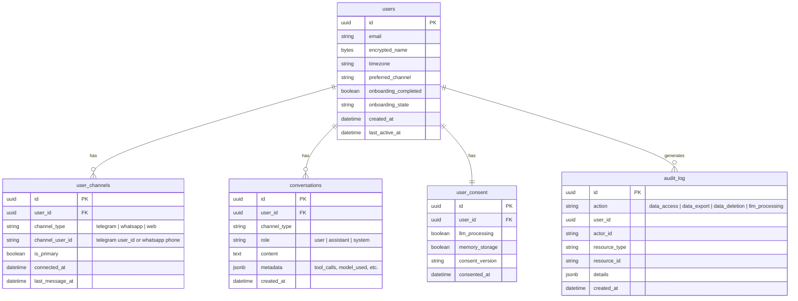

# feat: Mika MVP Implementation

## Overview

Build Mika, a conversation-first AI executive assistant that lives in Telegram (then WhatsApp), with persistent memory via a Neo4j knowledge graph, proactive follow-ups via Celery, and a web dashboard for settings and memory management. The entire codebase is greenfield -- zero code exists today.

**Core product loop:** Listen -> Remember -> Reason -> Act -> Follow Up

**Stack:** Python 3.12+, LangGraph, Neo4j, PostgreSQL, Celery + Redis, Claude (Sonnet 4.5 + Opus 4.6), aiogram 3.x (Telegram), PyWa (WhatsApp), Railway

**Build approach:** Agent-first. Get the Telegram bot + agent + memory working before investing in the web dashboard.

## Problem Statement

Busy professionals (founders, CEOs, senior leaders) spend 8-15 hours/week on tasks an EA would handle. Human EAs cost $3-5K/month. Current AI assistants (ChatGPT, Claude) are stateless -- no memory, no follow-through, no proactive action. Mika fills the gap at $49-199/month with persistent memory, proactive behavior, and zero-friction delivery via messaging apps.

## Proposed Solution

A 4-phase, 12-week build delivering an agent-first MVP:

| Phase | Weeks | Focus |
|-------|-------|-------|
| 0 | Pre-work | Project scaffolding, gap resolution, infrastructure setup |
| 1 | 1-2 | Telegram bot + LangGraph agent + Neo4j memory |
| 2 | 3-4 | Proactive intelligence (Celery), onboarding flow, follow-ups |
| 3 | 5-8 | Web dashboard + WhatsApp integration |
| 4 | 9-12 | Google Calendar, polish, beta launch |

---

## Technical Approach

### Project Structure

Single-package Python monorepo. All services (API, bot, workers) share the same codebase with different entry points.

```
mika/
├── pyproject.toml
├── .env.example
├── .gitignore
├── CLAUDE.md
├── Dockerfile
├── docker-compose.yml              # Local dev: Neo4j, Redis, Postgres
├── railway.toml                    # Railway deployment config
│
├── app/
│   ├── __init__.py
│   ├── config.py                   # pydantic-settings (Settings class)
│   │
│   ├── agent/                      # LangGraph agent
│   │   ├── __init__.py
│   │   ├── graph.py                # StateGraph definition & compilation
│   │   ├── state.py                # MikaState TypedDict
│   │   ├── prompts.py              # System prompts, personality templates
│   │   └── nodes/
│   │       ├── __init__.py
│   │       ├── retrieve_memory.py
│   │       ├── listen_and_reason.py
│   │       ├── decide_action.py
│   │       ├── execute_action.py
│   │       └── respond.py
│   │
│   ├── tools/                      # LangChain tool definitions
│   │   ├── __init__.py
│   │   ├── drafting.py
│   │   ├── search.py
│   │   └── research.py
│   │
│   ├── memory/                     # Neo4j memory layer
│   │   ├── __init__.py
│   │   ├── repository.py           # UserMemoryRepository (all queries user-scoped)
│   │   ├── extractor.py            # Entity extraction via Claude
│   │   ├── schema.py               # Node/relationship type definitions
│   │   └── driver.py               # Neo4j driver factory
│   │
│   ├── worker/                     # Celery
│   │   ├── __init__.py
│   │   ├── celery_app.py           # App config, queues, routing
│   │   ├── tasks/
│   │   │   ├── __init__.py
│   │   │   ├── memory_extraction.py
│   │   │   ├── follow_ups.py
│   │   │   ├── briefings.py
│   │   │   └── maintenance.py      # Summarization, backups
│   │   └── beat_schedule.py        # Celery Beat periodic task config
│   │
│   ├── channels/                   # Message router + channel adapters
│   │   ├── __init__.py
│   │   ├── router.py               # Channel-agnostic message router
│   │   ├── base.py                 # Abstract channel adapter interface
│   │   ├── telegram/
│   │   │   ├── __init__.py
│   │   │   ├── bot.py              # aiogram bot setup
│   │   │   ├── handlers.py         # Message, command, callback handlers
│   │   │   └── middleware.py       # Auth, rate limiting, typing indicator
│   │   └── whatsapp/               # Phase 3
│   │       ├── __init__.py
│   │       ├── client.py           # PyWa setup
│   │       └── handlers.py
│   │
│   ├── api/                        # Web API (Phase 3 dashboard)
│   │   ├── __init__.py
│   │   ├── main.py                 # FastAPI app + webhook endpoints
│   │   └── routes/
│   │       ├── __init__.py
│   │       ├── webhooks.py         # Telegram/WhatsApp webhook receivers
│   │       ├── auth.py
│   │       ├── dashboard.py
│   │       └── privacy.py          # Data export/deletion endpoints
│   │
│   ├── models/                     # SQLAlchemy / Postgres models
│   │   ├── __init__.py
│   │   ├── user.py
│   │   ├── channel.py              # user_channels mapping
│   │   ├── conversation.py         # Message history storage
│   │   ├── consent.py              # Privacy consent tracking
│   │   └── audit.py                # Audit log (append-only)
│   │
│   └── common/
│       ├── __init__.py
│       ├── llm.py                  # ChatAnthropic factory (Sonnet/Opus)
│       ├── encryption.py           # Fernet field encryption for PII
│       └── logging.py              # Structured logging
│
├── alembic/                        # Postgres migrations
│   ├── alembic.ini
│   └── versions/
│
├── tests/
│   ├── conftest.py
│   ├── test_agent/
│   ├── test_memory/
│   ├── test_worker/
│   ├── test_channels/
│   └── test_api/
│
├── scripts/
│   ├── setup_neo4j_indexes.py
│   └── seed_dev_data.py
│
└── docs/
    ├── brainstorms/
    └── plans/
```

### Key Dependencies (`pyproject.toml`)

```toml
[project]
name = "mika"
version = "0.1.0"
requires-python = ">=3.12"
dependencies = [
    "langgraph>=0.4",
    "langchain-core>=0.3",
    "langchain-anthropic>=0.3",
    "neo4j>=5.0",
    "celery[redis]>=5.4",
    "redis>=5.0",
    "aiogram>=3.10",
    "fastapi>=0.115",
    "uvicorn[standard]>=0.30",
    "pydantic-settings>=2.0",
    "sqlalchemy[asyncio]>=2.0",
    "alembic>=1.14",
    "asyncpg>=0.30",
    "cryptography>=44.0",
    "httpx>=0.28",
]

[project.optional-dependencies]
dev = [
    "pytest>=8.0",
    "pytest-asyncio>=0.24",
    "ruff>=0.9",
    "mypy>=1.14",
]
whatsapp = [
    "pywa>=3.8",
]
```

### Architecture

```
┌──────────┐       ┌──────────────────────────────────────────────────┐
│ Telegram │◄──┐   │                    Railway                       │
│  User    │   │   │                                                  │
└──────────┘   │   │  ┌──────────────────────────────────────────┐    │
┌──────────┐   ├──►│  │  FastAPI Server                          │    │
│ WhatsApp │◄──┘   │  │  ├── /webhook/telegram  (aiogram feed)  │    │
│  User    │       │  │  ├── /webhook/whatsapp  (PyWa feed)     │    │
└──────────┘       │  │  └── /api/*             (dashboard)      │    │
┌──────────┐       │  └───────────────┬──────────────────────────┘    │
│ Web App  │◄─────►│                  │                               │
│ (Browser)│       │        ┌─────────▼──────────┐                    │
└──────────┘       │        │  Message Router     │                    │
                   │        │  (channel-agnostic) │                    │
                   │        └─────────┬──────────┘                    │
                   │                  │                               │
                   │        ┌─────────▼──────────┐                    │
                   │        │  LangGraph Agent    │                    │
                   │        │  per-request        │                    │
                   │        │                     │                    │
                   │        │  retrieve_memory    │                    │
                   │        │  listen_and_reason  │───► Claude API     │
                   │        │  decide_action      │    (Sonnet/Opus)   │
                   │        │  execute_action     │                    │
                   │        │  respond            │                    │
                   │        └────┬────────────┬───┘                    │
                   │             │            │                        │
                   │   ┌─────────▼──┐  ┌──────▼──────────────┐        │
                   │   │ PostgreSQL │  │     Neo4j           │        │
                   │   │ (Users,    │  │ (Knowledge Graph)   │        │
                   │   │  Messages, │  │  user-scoped        │        │
                   │   │  Consent,  │  │  subgraphs          │        │
                   │   │  Audit)    │  └─────────────────────┘        │
                   │   └────────────┘                                  │
                   │   ┌────────────┐  ┌─────────────────────┐        │
                   │   │   Redis    │◄►│  Celery Workers     │        │
                   │   │  (Broker)  │  │  + Beat Scheduler   │        │
                   │   └────────────┘  │                     │        │
                   │                   │  memory_extraction   │        │
                   │                   │  follow_up_scanner   │        │
                   │                   │  morning_briefing    │        │
                   │                   │  conversation_summary│        │
                   │                   └─────────────────────┘        │
                   └──────────────────────────────────────────────────┘
```

### Data Model

#### PostgreSQL (via SQLAlchemy + Alembic)



#### Neo4j Knowledge Graph

**Node types and MERGE keys:**

| Node Label | MERGE Key | Properties | Example |
|-----------|-----------|------------|---------|
| `User` | `(user_id)` | user_id, created_at | The anchor node for all user memory |
| `Person` | `(user_id, canonical_name)` | name, relationship, context, sentiment, last_mentioned | "Sarah Chen -- head of partnerships" |
| `Commitment` | `(user_id, description_hash)` | description, due_date, status, priority, source | "Send proposal to Sarah by Friday" |
| `Topic` | `(user_id, name)` | name, importance, recency | "Q2 hiring plan" |
| `Pattern` | `(user_id, type, description_hash)` | type, description, confidence | "Procrastinates on finance tasks" |
| `Preference` | `(user_id, category)` | category, value, confidence | "Prefers bullet points in drafts" |
| `Fact` | `(user_id, key)` | key, value, source, timestamp | "Team size: 12" |

**Relationships:**

| Relationship | From | To | Properties |
|-------------|------|----|------------|
| `HAS_MEMORY` | User | * (all nodes) | created_at | User anchor scoping |
| `KNOWS` | User | Person | context, since |
| `COMMITTED_TO` | User | Commitment | created_at |
| `INVOLVES` | Commitment | Person | role |
| `INTERESTED_IN` | User | Topic | since |
| `EXHIBITS` | User | Pattern | first_observed, occurrences |
| `PREFERS` | User | Preference | since |

**Indexes (run at startup via `scripts/setup_neo4j_indexes.py`):**

```cypher
CREATE INDEX user_id_idx IF NOT EXISTS FOR (u:User) ON (u.user_id);
CREATE INDEX person_merge_idx IF NOT EXISTS FOR (p:Person) ON (p.user_id, p.canonical_name);
CREATE INDEX commitment_merge_idx IF NOT EXISTS FOR (c:Commitment) ON (c.user_id, c.description_hash);
CREATE INDEX fact_merge_idx IF NOT EXISTS FOR (f:Fact) ON (f.user_id, f.key);
CREATE INDEX topic_merge_idx IF NOT EXISTS FOR (t:Topic) ON (t.user_id, t.name);
CREATE INDEX preference_merge_idx IF NOT EXISTS FOR (p:Preference) ON (p.user_id, p.category);
```

### LangGraph Agent Design

```python
# app/agent/state.py
class MikaState(TypedDict):
    user_id: str
    messages: Annotated[list[BaseMessage], add_messages]
    memory_context: str
    pending_actions: list
    personality_context: str
    step_count: int
    error: Optional[str]
```

**Graph flow:**

```
START -> retrieve_memory -> listen_and_reason -> decide_action
                                                      |
                                          ┌───────────┼───────────┐
                                          ▼           ▼           ▼
                                   execute_action   respond      END
                                          |           |      (step limit)
                                          ▼           ▼
                                   listen_and_reason  END
                                   (interpret result)
```

**Error handling:**
- `RetryPolicy(max_attempts=3)` on `retrieve_memory` (Neo4j) and `execute_action` (tools)
- `recursion_limit=10` on graph compilation
- If Neo4j is unreachable: proceed without memory context (stateless fallback)
- If Claude API fails after retries: send "I'm having trouble right now. I'll follow up shortly." and queue for retry
- `step_count` hard-stop prevents infinite loops
- All errors written to `state["error"]` for LLM-based recovery

**Model routing:**
- Default: Claude Sonnet 4.5 (`claude-sonnet-4-5-20250929`)
- Opus 4.6 (`claude-opus-4-6-20260205`) for: complex drafting, nuanced reasoning, ambiguous requests
- Routing decision made in `listen_and_reason` node based on task complexity classification

### Conversation History Strategy

- **Storage:** PostgreSQL `conversations` table (user_id, role, content, metadata, created_at)
- **Agent context window:** Load last 20 messages + Neo4j memory summary into agent state
- **Summarization:** Weekly Celery task compresses conversations older than 7 days into summaries stored as `Fact` nodes in Neo4j
- **Token budget:** ~4K tokens for conversation history, ~2K for memory context, ~2K for system prompt = ~8K input tokens per request (well within Claude's context window)

### Telegram-Specific Handling

- **Bot commands:** `/start` (onboarding), `/help`, `/export`, `/delete`, `/settings`
- **Typing indicator:** Send `sendChatAction: typing` immediately on message receipt, refresh every 5 seconds during processing
- **Message splitting:** Split responses > 4096 chars at paragraph boundaries. For very long content (> 10K chars), send as a `.md` document file
- **Unsupported content types:** Phase 1 supports text only. For photos, voice, documents: "I can't process that yet, but it's coming soon. Can you describe it in text?"
- **Group chats:** Explicitly disabled. One-time message: "I work best in private conversations. Message me directly!" Then ignore all group messages.
- **Edited messages:** Not processed in Phase 1 (acknowledged as a future enhancement)
- **Rate limits:** Queue proactive messages through Celery with 1 msg/sec rate limiting per chat

### Phase 1 Signup Flow (Telegram-Only)

For Phase 1, signup happens entirely within Telegram. No web form required.

```
1. User finds @MikaBot (via link from landing page or word of mouth)
2. User sends /start
3. Bot handler:
   a. Check if telegram_user_id exists in user_channels table
   b. If new: create User record in Postgres, create user_channels record
   c. Create User anchor node in Neo4j
   d. Send privacy disclosure message (LLM processing, data storage)
   e. Wait for consent ("Sounds good" / "Tell me more")
4. After consent: begin onboarding conversation
5. Collect: name, role, timezone, "what's eating your time?"
6. Store in Postgres (user record) and Neo4j (initial facts)
7. Set onboarding_completed = true after the "wow moment" interaction
```

### Privacy Engineering

- **Encryption at rest:** Railway managed Postgres uses encrypted volumes. Neo4j self-hosted uses Railway's encrypted disk. Application-level Fernet encryption for PII fields (name, email, phone) in Postgres via `app/common/encryption.py`
- **Encryption in transit:** TLS everywhere. Railway provides TLS termination. Neo4j bolt connection uses TLS.
- **Audit logging:** Append-only `audit_log` table. Log data access, export, deletion, consent changes. Never log PII content -- only metadata.
- **Data export:** JSON package of user profile, conversation history, Neo4j subgraph (serialized). Triggered via `/export` command or dashboard.
- **Data deletion:** Cascade delete: Neo4j subgraph (DETACH DELETE) -> Postgres conversations -> Postgres user record -> Redis cache invalidation. Audit log retained (with user_id only, no PII).
- **LLM disclosure:** Transparent that messages are processed by Claude API. Anthropic's API data policy: not used for training. Disclosed during onboarding consent flow.
- **Pitch deck corrections needed:** Remove "end-to-end encryption" (incompatible with server-side LLM processing), "zero-knowledge architecture" (Mika must read messages), and "SOC 2 compliant" (not yet achieved). Replace with accurate claims.

---

## Implementation Phases

### Phase 0: Project Scaffolding (Pre-work, 2-3 days)

#### Tasks

- [ ] `git init`, `.gitignore` (Python, .env, .idea, __pycache__, neo4j data)
- [ ] Create `pyproject.toml` with all Phase 1 dependencies
- [ ] Create `CLAUDE.md` with project conventions (directory structure, naming, testing patterns)
- [ ] Create `app/` directory structure per the project structure above
- [ ] Create `app/config.py` with `pydantic-settings` `Settings` class
- [ ] Create `.env.example` with all required environment variables
- [ ] Create `docker-compose.yml` for local dev (Neo4j 5 Community, Redis 7, Postgres 16)
- [ ] Create `Dockerfile` (multi-stage, Python 3.12 slim)
- [ ] Initialize Alembic for Postgres migrations
- [ ] Create initial migration: `users`, `user_channels`, `conversations`, `user_consent`, `audit_log` tables
- [ ] Create `scripts/setup_neo4j_indexes.py` -- run Cypher index creation
- [ ] Create `app/common/llm.py` -- `ChatAnthropic` factory for Sonnet and Opus
- [ ] Create `app/common/encryption.py` -- Fernet field encryptor
- [ ] Create `app/common/logging.py` -- structured JSON logging
- [ ] Set up `pytest` with `conftest.py` (fixtures for mock LLM, test Neo4j driver, test DB)
- [ ] Set up `ruff` for linting

#### Acceptance Criteria

- [ ] `docker compose up` starts Neo4j, Redis, Postgres locally
- [ ] `pytest` runs with no errors (empty test suite passes)
- [ ] Neo4j indexes created successfully via script
- [ ] Alembic migration applies cleanly
- [ ] `Settings` class loads from `.env`

---

### Phase 1: Core Agent Skeleton (Weeks 1-2)

#### Phase 1a: Telegram Bot + Message Router (Week 1, Days 1-3)

##### `app/channels/base.py` -- Channel Adapter Interface

```python
from abc import ABC, abstractmethod
from dataclasses import dataclass

@dataclass
class IncomingMessage:
    user_id: str              # Internal Mika user_id (UUID)
    channel_type: str         # "telegram" | "whatsapp"
    channel_user_id: str      # Platform-specific user ID
    text: str
    message_type: str         # "text" | "photo" | "voice" | etc.
    raw_data: dict            # Platform-specific payload

@dataclass
class OutgoingMessage:
    user_id: str
    channel_type: str
    channel_user_id: str
    text: str
    parse_mode: str = "Markdown"

class ChannelAdapter(ABC):
    @abstractmethod
    async def send_message(self, msg: OutgoingMessage) -> None: ...

    @abstractmethod
    async def send_typing_indicator(self, channel_user_id: str) -> None: ...
```

##### Tasks

- [ ] Implement `app/channels/base.py` -- `IncomingMessage`, `OutgoingMessage`, `ChannelAdapter` ABC
- [ ] Implement `app/channels/router.py` -- routes `IncomingMessage` to agent handler, sends `OutgoingMessage` via correct adapter
- [ ] Implement `app/channels/telegram/bot.py` -- aiogram `Bot` + `Dispatcher` setup
- [ ] Implement `app/channels/telegram/handlers.py`:
  - `/start` command: check/create user in Postgres + Neo4j, send consent message
  - `/help` command: feature overview
  - Text message handler: convert to `IncomingMessage`, route to agent
  - Unsupported content type handler: polite "text only for now" response
  - Group chat handler: one-time "DM me instead" message, then ignore
- [ ] Implement `app/channels/telegram/middleware.py`:
  - Typing indicator middleware (send on every incoming message)
  - User lookup middleware (attach `user_id` to handler context)
- [ ] Implement `app/api/main.py` -- FastAPI app with `/webhook/telegram` endpoint that feeds updates to aiogram
- [ ] Implement message splitting utility for > 4096 char responses
- [ ] Write tests: bot command handlers, message routing, group chat blocking

##### Acceptance Criteria

- [ ] Bot responds to `/start` with consent message
- [ ] Text messages are routed through the message router
- [ ] Group chat messages are blocked with a polite redirect
- [ ] Typing indicator shows while processing
- [ ] Non-text messages get a "text only" response

#### Phase 1b: LangGraph Agent (Week 1, Days 3-5)

##### Tasks

- [ ] Implement `app/agent/state.py` -- `MikaState` TypedDict
- [ ] Implement `app/agent/prompts.py` -- system prompt template with personality ("warm, competent, slightly opinionated"), onboarding variant, memory context injection format
- [ ] Implement `app/agent/nodes/retrieve_memory.py`:
  - Query Neo4j for user's facts, commitments, people, patterns, preferences
  - Format as structured text for system prompt injection
  - Graceful fallback if Neo4j unreachable (return empty context, log warning)
  - `RetryPolicy(max_attempts=3)`
- [ ] Implement `app/agent/nodes/listen_and_reason.py`:
  - Build system prompt: personality + memory context + onboarding state
  - Call Claude Sonnet with conversation history (last 20 messages from Postgres)
  - Classify task complexity; switch to Opus if complex
  - Return reasoning and any tool call decisions
- [ ] Implement `app/agent/nodes/decide_action.py`:
  - If tool calls present in LLM response -> route to `execute_action`
  - If no tool calls -> route to `respond`
  - If `step_count > 10` -> force route to `respond` (hard stop)
- [ ] Implement `app/agent/nodes/execute_action.py`:
  - Execute tool calls with timeout (30s per tool)
  - On success: route back to `listen_and_reason` (LLM interprets result)
  - On failure: write error to state, route to `listen_and_reason` (LLM recovers)
- [ ] Implement `app/agent/nodes/respond.py`:
  - Extract final response text
  - Increment `step_count`
  - Return response to message router
- [ ] Implement `app/agent/graph.py`:
  - Build `StateGraph` with all nodes and conditional edges
  - Compile with `recursion_limit=10`
  - Use `MemorySaver` checkpointer (dev), plan for `PostgresSaver` (prod)
- [ ] Implement basic tools in `app/tools/`:
  - `drafting.py`: Claude-powered document/email/message drafting
  - `search.py`: Web search via Tavily API (or SerpAPI)
- [ ] Wire agent into message router: incoming message -> load history from Postgres -> invoke agent -> save response to Postgres -> send via channel adapter
- [ ] Write tests: agent graph end-to-end with mocked LLM, individual node unit tests

##### Acceptance Criteria

- [ ] Agent responds conversationally to text messages
- [ ] Agent uses memory context when available (after extraction runs)
- [ ] Agent can draft a document when asked
- [ ] Agent can search the web when asked
- [ ] Hard stop at 10 steps prevents infinite loops
- [ ] Graceful fallback when Neo4j is unreachable

#### Phase 1c: Neo4j Memory Layer (Week 2)

##### Tasks

- [ ] Implement `app/memory/schema.py` -- node type definitions, merge keys, relationship types (as Python constants/enums)
- [ ] Implement `app/memory/driver.py` -- Neo4j driver factory (singleton, connection pooling)
- [ ] Implement `app/memory/repository.py` -- `UserMemoryRepository`:
  - `get_user_context(user_id, limit=30)` -- retrieve memory formatted for LLM
  - `write_entities(user_id, entities)` -- batch MERGE with UNWIND
  - `write_relationship(user_id, source, rel_type, target)`
  - `delete_user_memory(user_id)` -- GDPR cascade delete
  - All methods enforce `user_id` scoping (defense in depth: `user_id` on both relationships AND node properties)
- [ ] Implement `app/memory/extractor.py` -- entity extraction pipeline:
  - Takes conversation text, calls Claude Sonnet with structured extraction prompt
  - Returns typed list of entities (Person, Commitment, Fact, Preference, etc.)
  - Handles entity resolution ("Sarah" and "Sarah Chen" -> same Person)
  - Returns empty list on extraction failure (never crashes)
- [ ] Implement `app/worker/celery_app.py` -- Celery config with `memory` and `scheduled` queues
- [ ] Implement `app/worker/tasks/memory_extraction.py`:
  - `extract_and_store_memory(user_id, conversation_text)` Celery task
  - Retry 3x with exponential backoff (30s, 120s, 480s)
  - `acks_late=True`, `task_reject_on_worker_lost=True`
  - Dead letter logging after max retries
- [ ] Wire memory extraction into agent flow: after `respond` node, fire `extract_and_store_memory.delay()`
- [ ] Write tests: repository CRUD, extractor with mocked LLM, Celery task execution

##### Acceptance Criteria

- [ ] Memory extraction runs as background task after every conversation turn
- [ ] Extracted entities appear in Neo4j with correct user scoping
- [ ] Next conversation retrieves previously extracted memory
- [ ] Entity resolution merges duplicate mentions (MERGE on canonical_name)
- [ ] Failed extraction retries and eventually dead-letters without crashing
- [ ] `delete_user_memory` removes all user nodes and relationships

#### Phase 1 End-to-End Acceptance Criteria

- [ ] User sends `/start` to Telegram bot -> consent flow -> onboarding questions -> Mika extracts facts -> next message shows Mika remembers
- [ ] User asks "draft an email to Sarah about the Q2 plan" -> Mika uses memory about Sarah + user's preferences -> delivers a personalized draft
- [ ] Response latency: P50 < 5s, P95 < 15s
- [ ] All tests pass

---

### Phase 2: Proactive Intelligence (Weeks 3-4)

#### Phase 2a: Onboarding Flow (Week 3)

##### Tasks

- [x] Design onboarding state machine:
  - States: `awaiting_consent` -> `collecting_basics` -> `exploring_pain` -> `identifying_stuck_task` -> `delivering_wow` -> `completed`
  - Store state in Postgres `users.onboarding_state`
  - Handle: one-word answers (follow-up prompt), topic changes (acknowledge then redirect), abandonment and resumption (resume from last state)
- [x] Implement onboarding-specific prompts in `app/agent/prompts.py`:
  - Consent prompt (transparent about LLM processing)
  - Three sharp questions (adapted from MVP spec)
  - Inference prompt ("So you're running a 12-person team...")
  - Stuck task identification prompt
  - Drafting prompt for the "wow moment"
- [x] Update `listen_and_reason` node to check `onboarding_state` and use appropriate prompt variant
- [x] Implement timezone detection: ask during onboarding, store in Postgres, default to UTC
- [x] Write tests: onboarding state transitions, edge cases (abandonment, one-word answers)

##### Acceptance Criteria

- [x] New user experiences the full 5-minute onboarding flow
- [x] Mika makes an inference by question 3
- [x] Mika identifies a stuck task and delivers a draft
- [x] Onboarding state persists across session breaks
- [x] Timezone is captured and stored

#### Phase 2b: Commitment Tracking + Follow-Ups (Week 3-4)

##### Tasks

- [x] Enhance memory extraction to specifically identify commitments:
  - "I need to send Sarah the proposal by Friday" -> `Commitment` node with due_date, status=pending
  - "Done with the proposal" -> update `Commitment.status` to completed
- [x] Implement `app/worker/tasks/follow_ups.py`:
  - `scan_pending_commitments()` -- Celery Beat task, runs every 4 hours
  - Query Neo4j for all users' pending commitments approaching due date
  - For each flagged commitment: compose a nudge message via the agent
  - Send via message router (respecting preferred channel and timezone)
- [x] Implement timezone-aware scheduling:
  - Celery Beat fires dispatcher every 15 minutes
  - Dispatcher checks: is it within the user's "active hours" (default 8 AM - 9 PM local)?
  - Only send proactive messages during active hours
- [x] Implement rate limiting for proactive messages:
  - Max 1 proactive message per user per hour
  - Max 3 proactive messages per user per day
  - Track in Redis with TTL-based counters
- [x] Write tests: commitment extraction, follow-up scanning, timezone handling, rate limiting

##### Acceptance Criteria

- [x] Mika extracts commitments from conversation ("I need to send the proposal by Friday")
- [x] Mika follows up on overdue/approaching commitments
- [x] Follow-ups respect timezone (no 3 AM nudges)
- [x] Rate limiting prevents spam
- [x] Commitment status updates when user says "done"

#### Phase 2c: Morning Briefing (Week 4)

##### Tasks

- [x] Implement `app/worker/tasks/briefings.py`:
  - `morning_briefing_dispatcher()` -- Celery Beat task, runs every 15 minutes
  - For each user whose local time is in briefing window (default 7:00-7:15 AM):
    - Query Neo4j: pending commitments, recent topics, patterns
    - Compose briefing via Claude Sonnet (not full agent -- simpler, faster)
    - Send via preferred channel
- [x] Briefing format: concise, actionable. Example:
  ```
  Good morning! Here's what's on your plate today:

  Pending:
  - Proposal for Sarah (due today)
  - Review hiring plan draft

  Yesterday you mentioned wanting to research competitor pricing.
  Want me to get started on that?
  ```
- [x] Add user preference: opt-in/out of morning briefings (default: on)
- [x] Write tests: briefing composition, timezone dispatcher, opt-out handling

##### Acceptance Criteria

- [x] Users receive a morning briefing at their configured time
- [x] Briefing includes pending commitments and recent context
- [x] Users can opt out via `/settings` or by telling Mika

#### Phase 2d: Conversation Summarization (Week 4)

##### Tasks

- [x] Implement `app/worker/tasks/maintenance.py`:
  - `summarize_old_conversations()` -- weekly Celery Beat task
  - For each user: conversations older than 7 days are summarized via Claude Sonnet
  - Summary stored as `Fact` nodes in Neo4j (key: `weekly_summary_YYYY_WW`)
  - Original messages retained in Postgres but not loaded into agent context
- [x] Update `retrieve_memory` node to include recent weekly summaries in context
- [x] Write tests: summarization task, context window loading

##### Acceptance Criteria

- [x] Old conversations are summarized weekly
- [x] Summaries appear in agent memory context
- [x] Agent context window stays within token budget (~8K input tokens)

---

### Phase 3: Web Dashboard + WhatsApp (Weeks 5-8)

#### Phase 3a: Web Framework + Auth (Week 5)

##### Tasks

- [x] Decide: Django or FastAPI for dashboard (recommendation: FastAPI + Jinja2 templates for consistency with existing FastAPI webhook server)
- [x] Implement auth: email/password signup + session-based auth
- [x] Implement Telegram account linking: generate deep link token on web signup, user clicks `t.me/MikaBot?start=<token>`, bot handler links accounts
- [x] Implement dashboard layout: sidebar nav, responsive design
- [x] Implement settings page: timezone, notification preferences, channel connections, active hours

#### Phase 3b: Memory Viewer + Conversation History (Week 6)

##### Tasks

- [x] Implement memory viewer: Neo4j subgraph visualization (people, commitments, facts, patterns)
- [x] Implement memory correction: user can edit/delete individual memory nodes
- [x] Implement conversation history viewer: paginated message list from Postgres
- [x] Implement search across conversations

#### Phase 3c: WhatsApp Integration (Weeks 7-8)

##### Tasks

- [ ] Start Meta business verification (should have been initiated Week 1-2)
- [x] Implement `app/channels/whatsapp/__init__.py` -- WhatsAppAdapter using httpx + Meta Cloud API
- [x] Implement `app/channels/whatsapp/handlers.py` -- webhook verification + message handler (reuses message router)
- [x] Implement 24-hour window tracking: `user_channels.last_message_at` for WhatsApp entries
- [x] Register WhatsApp adapter and router in `app/api/main.py` (conditional on config)
- [ ] Design and submit WhatsApp message templates to Meta:
  - Follow-up nudge: "Hi {{1}}, you mentioned {{2}}. Want me to help with that?"
  - Morning briefing: "Good morning {{1}}! Here's your daily update from Mika."
  - Re-engagement: "Hi {{1}}, it's been a while. Anything I can help with today?"
- [ ] Update proactive message sending to check WhatsApp window:
  - If window open: send free-form message
  - If window closed: send approved template
  - If template not approved: fall back to Telegram
- [ ] Handle multi-channel: unified conversation history, channel preference per user
- [x] Write tests: WhatsApp message handling, adapter, webhook verification (11 tests)

#### Phase 3d: Privacy APIs (Week 8)

##### Tasks

- [x] Implement `app/api/routes/privacy.py`:
  - `POST /api/privacy/export` -- ZIP data export (Postgres + Neo4j + conversations)
  - `POST /api/privacy/delete` -- cascade delete (Neo4j -> Postgres -> Redis)
  - `GET /api/privacy/export` -- dashboard privacy page
- [x] Implement `/export` and `/delete` Telegram commands (trigger same privacy functions)
- [x] Export format: ZIP containing JSON files (profile.json, channels.json, conversations.json, memory.json)
- [x] Deletion: Neo4j subgraph -> Postgres user (cascade) -> Redis cache keys

---

### Phase 4: Integrations + Polish (Weeks 9-12)

#### Phase 4a: Google Calendar (Weeks 9-10)

- [ ] OAuth 2.0 flow for Google Calendar (non-restricted scope, no CASA)
- [ ] Calendar read access: fetch today's events
- [ ] Enhance morning briefing with calendar data
- [ ] Meeting prep: research attendees (web search tool), draft agenda
- [ ] Post-meeting follow-up: "You said you'd send Sarah the proposal. Done?"

#### Phase 4b: Beta Launch Prep (Weeks 11-12)

- [ ] Railway production deployment: API server + Celery worker + Celery Beat + Neo4j + Postgres + Redis
- [ ] Environment variables configured via Railway dashboard
- [ ] Health check endpoint (`/health`)
- [ ] Monitoring: structured logging, error alerting
- [ ] Neo4j backup: daily Celery task, dump to object storage
- [ ] Landing page: static site linking to `t.me/MikaBot?start=beta`
- [ ] Onboard first 10 beta users from personal network
- [ ] Collect feedback, iterate on personality and onboarding

---

## Alternative Approaches Considered

| Approach | Why Rejected |
|----------|-------------|
| **Django instead of FastAPI** | FastAPI is already used for webhooks. Adding Django creates two frameworks. FastAPI + Jinja2 templates is sufficient for the dashboard. |
| **python-telegram-bot instead of aiogram** | aiogram 3.x is async-native, uses Pydantic v2, and has a cleaner router pattern. Better fit for the async FastAPI stack. |
| **Vector-only memory (no knowledge graph)** | RAG is flexible but lossy. Can't reliably query "what are my pending commitments?" A knowledge graph gives structured, queryable memory. |
| **LangGraph Cloud (managed)** | Adds vendor dependency and cost. Self-hosted LangGraph gives full control, and Railway handles the hosting. |
| **Multi-model routing from day 1** | Adds complexity without proportional value. Claude Sonnet + Opus covers the quality/cost spectrum. Add cheaper models later if margins require it. |
| **Separate databases per user (Neo4j Enterprise)** | Overkill for MVP scale. Property-based isolation with User anchor nodes is sufficient for hundreds of users. |

---

## Acceptance Criteria

### Functional Requirements

- [ ] New user can sign up via Telegram `/start` and complete onboarding in under 5 minutes
- [ ] Mika remembers facts, preferences, commitments, and people across conversations
- [ ] Mika proactively follows up on pending commitments (via Celery scheduled tasks)
- [ ] Mika delivers morning briefings at the user's local time
- [ ] Mika can draft documents, emails, and messages using the user's tone
- [ ] Mika can research people and topics via web search
- [ ] Users can connect via WhatsApp (Phase 3) with unified memory
- [ ] Web dashboard shows settings, memory graph, and conversation history (Phase 3)
- [ ] Users can export and delete all their data

### Non-Functional Requirements

- [ ] Response latency: P50 < 5s, P95 < 15s, P99 < 30s
- [ ] Memory extraction completes within 30s of response (background)
- [ ] System handles 50 concurrent users without degradation
- [ ] Per-user data isolation: no cross-tenant data access in Neo4j queries
- [ ] PII encrypted at rest (Fernet in Postgres, encrypted volumes)
- [ ] TLS in transit for all connections
- [ ] Audit log for all data access, export, and deletion operations

### Quality Gates

- [ ] Test coverage: >80% for agent nodes, memory repository, and channel handlers
- [ ] All Celery tasks have retry policies and dead letter handling
- [ ] `ruff` linting passes with zero errors
- [ ] `CLAUDE.md` documents all project conventions

---

## Success Metrics

| Metric | Target | Measurement |
|--------|--------|-------------|
| Onboarding completion rate | >80% | Users who reach "wow moment" / users who send `/start` |
| Daily active users | >70% of total | Users who message Mika at least once per day |
| Memory accuracy | >90% | Spot-check: do extracted facts match what users said? |
| Response latency P95 | <15 seconds | Instrumented in agent graph |
| Follow-up relevance | >80% | User engagement with proactive messages (replied vs ignored) |
| Beta user retention (Week 4) | >60% | Users still active after 4 weeks |

---

## Dependencies & Prerequisites

| Dependency | Type | Status | Blocker? |
|-----------|------|--------|----------|
| Anthropic API key (Claude) | API access | Needed Day 1 | Yes |
| Telegram Bot Token (via BotFather) | API access | Needed Day 1 | Yes |
| Railway account | Infrastructure | Available (MCP connected) | No |
| Neo4j Docker image | Infrastructure | Available (neo4j:5-community) | No |
| Meta Business Verification (WhatsApp) | Compliance | Start Week 1-2, takes 1-4 weeks | Yes for Phase 3 |
| Google Cloud project (Calendar OAuth) | API access | Start Week 8 | Yes for Phase 4 |
| Tavily API key (web search) | API access | Needed Phase 1b | No (can use free tier) |
| Domain name (for webhooks + landing page) | Infrastructure | Needed before production | No (Railway provides URLs for dev) |

---

## Risk Analysis & Mitigation

| Risk | Severity | Mitigation |
|------|----------|------------|
| Claude API latency exceeds UX tolerance (>15s) | High | Typing indicator, streaming responses (Phase 2+), cache common queries, use Haiku for simple classification |
| Neo4j performance degrades with large subgraphs | Medium | Index all MERGE keys, limit context retrieval to 30 nodes, archive old data, benchmark at 5K nodes per user |
| Memory extraction produces inaccurate entities | High | Structured extraction prompts with examples, entity resolution step, user-facing correction mechanism (Phase 3 dashboard) |
| WhatsApp template rejection by Meta | Medium | Submit templates early (Week 5), have fallback templates ready, design templates conservatively |
| Solo dev burnout / scope creep | High | Strict phase gates, cut scope before extending timeline, Phase 3 dashboard is the most cuttable scope |
| Competitive threat (OpenAI/Anthropic add memory) | High | Move fast, build deeper memory graph than surface-level memory, proactive action is the differentiator |
| Telegram Bot API changes or restrictions | Low | aiogram abstracts most of this, monitor Telegram Bot API changelog |

---

## References & Research

### Internal References

- Architecture brainstorm: `docs/brainstorms/2026-02-16-mika-technical-architecture-brainstorm.md`
- MVP spec: `MVP-SPEC.md`
- Business case: `BUSINESS_CASE_VA.md`
- Launch plan: `30-60-90-launch-plan.md`

### External References

- [LangGraph Documentation](https://docs.langchain.com/oss/python/langgraph/quickstart)
- [aiogram 3.x Documentation](https://docs.aiogram.dev/)
- [PyWa (WhatsApp Cloud API)](https://pywa.readthedocs.io/en/latest/)
- [Neo4j Python Driver](https://neo4j.com/docs/python-manual/current/)
- [Neo4j Cypher MERGE](https://neo4j.com/docs/cypher-manual/25/clauses/merge)
- [Celery Documentation](https://docs.celeryq.dev/en/stable/)
- [Railway Config as Code](https://docs.railway.com/reference/config-as-code)
- [Railway Neo4j Template](https://railway.com/deploy/ZVljtU)
- [WhatsApp 24-hour Messaging Window](https://business.whatsapp.com/policy)
- [Anthropic Claude API](https://docs.anthropic.com/en/api)
- [LangGraph + Anthropic Integration](https://docs.langchain.com/oss/python/integrations/chat/anthropic)
