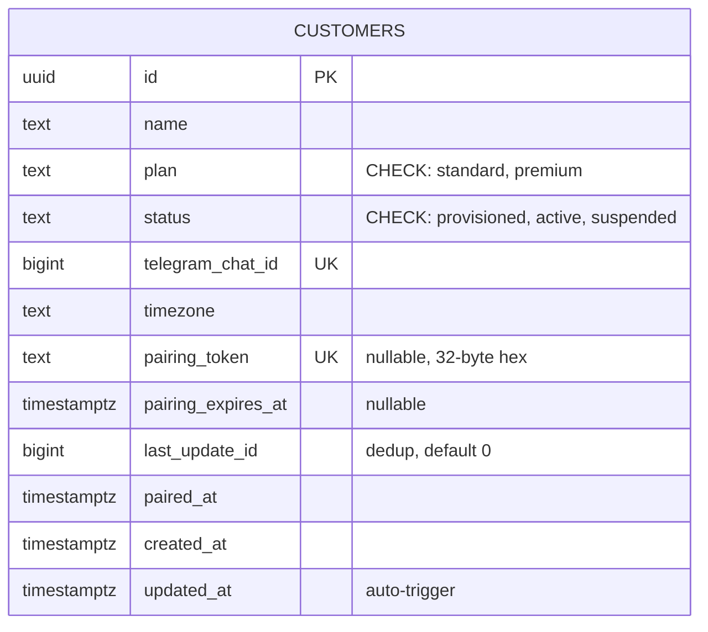

# mika-gateway — Telegram Webhook Router

## Overview

New Rust crate (~400-500 lines) that receives Telegram webhooks and routes messages to per-customer Mika containers. Stateless Axum HTTP service backed by shared Postgres for customer registry. This is Phase 3 of the platform systems plan.

**Prerequisites (all complete):**
- Phase 0: AsyncDatabase ✅
- Phase 1: Agent features (compaction, tools, silent mode, scheduler) ✅
- Phase 2: Container HTTP server (Axum /message, /heartbeat, /health + outbound routing) ✅

## Problem Statement

Mika containers can receive HTTP requests and route outbound messages via a gateway, but no gateway exists yet. Without it, there is no path from Telegram users to their Mika containers.

## Proposed Solution

A thin Axum service that:
1. Receives Telegram webhooks, validates them, and routes to the correct container
2. Handles customer pairing via deep link (`/start <pairing_token>`)
3. Relays outbound messages from containers to the Telegram API
4. Registers the Telegram webhook URL on startup

## Technical Approach

### Architecture

```
Telegram ──webhook──► ┌──────────────┐    ┌──────────────┐
                      │ mika-gateway │───►│  Postgres     │
                      │ (Axum)       │    │  (customers)  │
                      └──────┬───────┘    └──────────────┘
                             │
            POST /message    │    POST /send (callback)
            (computed URL)   │         ▲
                             ▼
                 ┌─────────────────────┐
                 │ mika-{customer_id}  │
                 │ Axum + agent loop   │
                 │ SQLite (PVC)        │
                 └─────────────────────┘
```

Container URLs are computed deterministically from customer_id — not stored in the database. This eliminates SSRF risk. *(Review #136)*

### Crate Structure

```
crates/mika-gateway/
├── Cargo.toml
├── src/
│   ├── main.rs           # Entry point, startup, setWebhook, health
│   ├── config.rs          # Gateway-specific settings (config-rs, MIKA_ prefix)
│   ├── routes.rs          # Axum router + all handlers (webhook, send, pairing, routing)
│   └── telegram.rs        # TelegramApiError, Update parsing, sendMessage wrapper
```

Consolidated from 7 files to 4. Pairing, routing, and DB queries live in `routes.rs` — each is a single function, not worth a separate file. *(Review #148)*

### Endpoints

| Endpoint | Method | Auth | Body Limit | Purpose |
|----------|--------|------|-----------|---------|
| `POST /webhook/telegram` | Inbound | Telegram secret_token header | 64 KB | Receives Telegram updates |
| `POST /send` | Inbound | Bearer MIKA_INTERNAL_TOKEN | 256 KB | Containers send outbound messages |
| `GET /health` | Health | None | — | K8s liveness/readiness probe |

Body size limits enforced via `tower_http::limit::RequestBodyLimitLayer`. *(Review #138)*

### Implementation Phases

---

#### Phase 3.1: Crate Setup + Postgres Schema

Create the gateway crate skeleton and shared Postgres schema.

**Cargo.toml dependencies:**
```toml
[dependencies]
mika-common = { path = "../mika-common" }
axum = "0.8"
sqlx = { version = "0.8", features = ["runtime-tokio", "postgres", "uuid", "chrono"] }
reqwest = { workspace = true }
tokio = { workspace = true }
serde = { workspace = true }
serde_json = { workspace = true }
tracing = { workspace = true }
tracing-subscriber = { workspace = true }
anyhow = { workspace = true }
uuid = { version = "1", features = ["v4"] }
subtle = "2"
secrecy = "0.10"
tower-http = { version = "0.6", features = ["limit", "set-header"] }
rand = "0.9"
hex = "0.4"
```

Add `sqlx` and `uuid` to workspace `[workspace.dependencies]` for version consistency. *(Review #153)*

**Postgres schema** (`migrations/001_customers.sql`):
```sql
CREATE TABLE customers (
    id UUID PRIMARY KEY,
    name TEXT NOT NULL,
    plan TEXT NOT NULL DEFAULT 'standard'
        CHECK (plan IN ('standard', 'premium')),
    status TEXT NOT NULL DEFAULT 'provisioned'
        CHECK (status IN ('provisioned', 'active', 'suspended')),
    telegram_chat_id BIGINT UNIQUE,
    timezone TEXT NOT NULL DEFAULT 'UTC',
    pairing_token TEXT UNIQUE,
    pairing_expires_at TIMESTAMPTZ,
    last_update_id BIGINT NOT NULL DEFAULT 0,
    paired_at TIMESTAMPTZ,
    created_at TIMESTAMPTZ NOT NULL DEFAULT now(),
    updated_at TIMESTAMPTZ NOT NULL DEFAULT now()
);

CREATE INDEX idx_customers_status ON customers(status);
CREATE INDEX idx_customers_pairing_token ON customers(pairing_token) WHERE pairing_token IS NOT NULL;

-- Auto-update updated_at on row change
CREATE OR REPLACE FUNCTION update_updated_at()
RETURNS TRIGGER AS $$
BEGIN
    NEW.updated_at = now();
    RETURN NEW;
END;
$$ LANGUAGE plpgsql;

CREATE TRIGGER customers_updated_at
    BEFORE UPDATE ON customers
    FOR EACH ROW EXECUTE FUNCTION update_updated_at();
```

Schema changes from review:
- **Removed `service_url`** — container URLs computed from customer_id *(Review #136)*
- **Added `pairing_token` + `pairing_expires_at`** — cryptographically random token replaces UUID in deep links *(Review #137)*
- **Added `last_update_id`** — persistent dedup replaces fragile in-memory HashMap *(Review #140)*
- **Added `updated_at`** with auto-update trigger *(Review #142)*
- **Added CHECK constraints** on `status` and `plan` *(Review #142)*
- **Removed redundant `idx_customers_telegram_chat_id`** — UNIQUE already creates an index *(Review #142)*
- **Added partial index** on `pairing_token` for active pairing lookups

**Files:**
- New: `crates/mika-gateway/` (entire directory)
- Edit: root `Cargo.toml` (workspace deps for sqlx, uuid)

**Tests:**
- sqlx migration runs successfully
- Customer CRUD operations
- CHECK constraints reject invalid status/plan values
- updated_at auto-updates on row change

---

#### Phase 3.2: Telegram Webhook Handler

Parse Telegram Update payloads, validate signature, dispatch to routing or pairing.

**Webhook validation:** Use constant-time comparison (`subtle::ConstantTimeEq`) for the `X-Telegram-Bot-Api-Secret-Token` header, matching the security pattern from `crates/mika-agent/src/server/auth.rs`. Pad shorter value before comparison to avoid timing side-channel on length.

**Typed errors** (`TelegramApiError`):
```rust
#[derive(Debug, thiserror::Error)]
pub enum TelegramApiError {
    #[error("rate limited")]
    RateLimited { retry_after: Option<u64> },
    #[error("bot blocked by user")]
    BotBlocked,
    #[error("bad request: {message}")]
    BadRequest { message: String },
    #[error("unauthorized")]
    Unauthorized,
    #[error("telegram api error: {status}")]
    Other { status: u16, body: String },
    #[error("network error")]
    Network(#[from] reqwest::Error),
}
```

Follows the `ClaudeApiError` pattern from `crates/mika-common/src/claude.rs`. *(Review #143)*

**Update parsing:**
```rust
pub fn parse_update(update: &TelegramUpdate) -> ParsedMessage {
    if let Some(text) = &update.message.text {
        if let Some(payload) = text.strip_prefix("/start ") {
            return ParsedMessage::Start { chat_id, pairing_token: payload.trim().to_string() };
        }
        return ParsedMessage::Text { chat_id, text: text.clone(), update_id };
    }
    ParsedMessage::Unsupported { chat_id }
}
```

**Non-text message handling:** Reply with "I can only read text messages right now. Please type your message."

**Deduplication:** Persistent via Postgres `last_update_id` column per customer. On each webhook:
1. Look up customer by `telegram_chat_id`
2. If `update.update_id <= customer.last_update_id`, drop as duplicate
3. After successful forward, UPDATE `last_update_id` to current `update_id`

This replaces the in-memory HashMap, which was lost on restart and broken for multi-replica. *(Review #140)*

**Async error replies:** All Telegram error replies (unknown user, suspended, etc.) are sent via `tokio::spawn` — fire-and-forget. The webhook handler always returns 200 to Telegram immediately, regardless of downstream outcome. *(Review #145)*

**Request body limit:** `RequestBodyLimitLayer::new(64 * 1024)` on the webhook route. *(Review #138)*

**Files:**
- New: `crates/mika-gateway/src/telegram.rs`
- New: `crates/mika-gateway/src/routes.rs`

**Tests:**
- Valid signature accepted
- Invalid/missing signature rejected (constant-time)
- Text message parsed correctly
- /start command parsed with pairing_token payload
- Non-text update returns Unsupported
- Duplicate update_id (≤ last_update_id) is dropped
- Oversized request body returns 413

---

#### Phase 3.3: Customer Routing

Look up customer by `telegram_chat_id` in Postgres, compute container URL, forward message.

```rust
/// Compute container URL deterministically from customer ID.
/// Eliminates SSRF — no user-controlled URLs. (Review #136)
fn container_url(customer_id: &Uuid) -> String {
    format!("http://mika-{customer_id}.mika-agents.svc.cluster.local:8080")
}

pub async fn route_message(
    pool: &PgPool,
    client: &reqwest::Client,
    internal_token: &str,
    chat_id: i64,
    text: &str,
    update_id: i64,
    request_id: &str,
) -> Result<(), RoutingError> {
    let customer = sqlx::query_as!(Customer,
        "SELECT id, status, last_update_id FROM customers WHERE telegram_chat_id = $1",
        chat_id
    )
    .fetch_optional(pool)
    .await?;

    let customer = match customer {
        Some(c) => c,
        None => return Err(RoutingError::UnknownUser),
    };

    // Dedup: drop if already processed (Review #140)
    if update_id <= customer.last_update_id {
        return Ok(());
    }

    if customer.status == "suspended" {
        return Err(RoutingError::Suspended);
    }

    let url = container_url(&customer.id);
    let resp = client.post(format!("{url}/message"))
        .bearer_auth(internal_token)
        .json(&json!({
            "text": text,
            "chat_id": chat_id,
            "channel": "telegram",
            "request_id": request_id
        }))
        .timeout(Duration::from_secs(2))  // 2s timeout (Review #153)
        .send()
        .await?;

    // Update last_update_id after successful forward
    sqlx::query!("UPDATE customers SET last_update_id = $1 WHERE id = $2",
        update_id, customer.id)
        .execute(pool).await?;

    Ok(())
}
```

**Error responses to Telegram** — consolidated to 3 generic categories *(Review #149)*:

| Scenario | Telegram reply |
|----------|---------------|
| Unknown chat_id (not paired) | "Please pair your account first. Use your invite link to get started." |
| All transient errors (container unreachable, busy, internal) | "I'm having trouble right now. Please try again in a moment." |
| Suspended customer | *(silent drop + log — user can't act on this)* |

This reduces information leakage — distinct messages for "container unreachable" vs "container busy" helped attackers enumerate system state. *(Review #149)*

**Key decisions:**
- **Container URL computed, not stored:** `container_url(customer_id)` follows K8s service naming convention. *(Review #136)*
- **2-second timeout:** Containers should respond quickly to `/message` (they return 202 immediately). *(Review #153)*
- **request_id generation:** UUID per webhook, used as `request_id` for container forwarding.

**Files:**
- Routing logic in: `crates/mika-gateway/src/routes.rs`

**Tests:**
- Route to active customer → forward succeeds
- Unknown chat_id → "pair your account" error
- Suspended customer → silent drop + error log
- Container unreachable (timeout) → "try again" reply
- Container busy (429) → "try again" reply
- Duplicate update_id → silently dropped
- container_url generates correct K8s service URL

---

#### Phase 3.4: Customer Pairing

Handle `/start <pairing_token>` deep links for single-use pairing.

Pairing uses a cryptographically random token (32-byte hex) instead of the customer UUID. Tokens have a configurable expiry (default 24h). *(Review #137)*

```rust
/// Generate a new pairing token (32 random bytes, hex-encoded)
pub fn generate_pairing_token() -> String {
    let mut bytes = [0u8; 32];
    rand::fill(&mut bytes);
    hex::encode(bytes)
}

pub async fn pair_customer(
    pool: &PgPool,
    pairing_token: &str,
    chat_id: i64,
) -> Result<PairingResult, PairingError> {
    // Atomic: only pairs if token valid, not expired, not already paired, status is 'provisioned'
    let result = sqlx::query!(
        "UPDATE customers
         SET telegram_chat_id = $1, paired_at = now(), status = 'active',
             pairing_token = NULL, pairing_expires_at = NULL
         WHERE pairing_token = $2
           AND telegram_chat_id IS NULL
           AND status = 'provisioned'
           AND (pairing_expires_at IS NULL OR pairing_expires_at > now())",
        chat_id, pairing_token
    )
    .execute(pool)
    .await?;

    if result.rows_affected() == 0 {
        return Err(PairingError::InvalidOrExpired);
    }

    Ok(PairingResult::Paired { customer_id })
}
```

**Key decisions:**
- **Pairing token, not UUID:** Deep link is `/start <64-char-hex-token>`, not `/start <uuid>`. Tokens are cryptographically random, not guessable. *(Review #137)*
- **Token cleared on pairing:** Set `pairing_token = NULL` after successful pairing. Single-use enforcement.
- **Expiry check:** `pairing_expires_at > now()` in the atomic UPDATE. Default 24h, set during provisioning.
- **Status guard:** `AND status = 'provisioned'` prevents re-pairing suspended customers.
- **Single error for all failures:** "Invalid or expired invite link" — doesn't reveal whether token existed, was used, or expired. *(Review #149)*
- **After pairing:** Forward a synthetic message `"Hello!"` to the container. The container's `check_onboarding` flag handles onboarding detection.

**Files:**
- Pairing logic in: `crates/mika-gateway/src/routes.rs`

**Tests:**
- Pair with valid token → success, status becomes 'active', token cleared
- Pair with expired token → rejection
- Pair with already-used token (NULL) → rejection
- Pair with invalid token → rejection
- Pair suspended customer → rejection (status guard)
- Race condition: two simultaneous pairing attempts → only one wins (UNIQUE constraint)
- generate_pairing_token produces 64-char hex string

---

#### Phase 3.5: Outbound Relay (/send)

Containers call `/send` to deliver messages to users via Telegram API.

```rust
async fn handle_send(
    State(state): State<AppState>,
    Json(payload): Json<SendPayload>,
) -> impl IntoResponse {
    // Validate payload (Review #144)
    if payload.text.is_empty() || payload.text.len() > 50_000 {
        return StatusCode::BAD_REQUEST;
    }

    // Send directly — no message splitting for now (Review #151)
    match state.send_telegram_message(payload.chat_id, &payload.text).await {
        Ok(_) => StatusCode::OK,
        Err(TelegramApiError::BotBlocked) => {
            // Log for manual review — do NOT auto-suspend (Review #140)
            warn!(chat_id = payload.chat_id, "bot blocked by user");
            StatusCode::GONE
        }
        Err(TelegramApiError::RateLimited { retry_after }) => {
            // Return 429 with Retry-After header
            let mut headers = HeaderMap::new();
            if let Some(secs) = retry_after {
                headers.insert("retry-after", secs.to_string().parse().unwrap());
            }
            (StatusCode::TOO_MANY_REQUESTS, headers).into_response()
        }
        Err(e) => {
            warn!(chat_id = payload.chat_id, error = %e, "telegram send failed");
            StatusCode::BAD_GATEWAY
        }
    }
}
```

**Key changes from review:**
- **No message splitting:** Send text as-is to Telegram. If it exceeds 4096 chars (unlikely — Claude max_tokens defaults to ~3000 chars of English), Telegram rejects it and we log the error. Add splitting later if observed in production. *(Review #151)*
- **No auto-suspension on 403:** Bot blocked (403) returns GONE to container and logs for manual review. The in-memory consecutive 403 counter was fragile (lost on restart) and enabled a mass-suspension attack vector. *(Review #140)*
- **Payload validation:** Text must be 1-50,000 chars. *(Review #144)*
- **No parse_mode:** Send plain text for Phase 3. Add markdown support later.
- **No message content logging:** Log only metadata (chat_id, message length, request_id).

**SendPayload schema:**
```rust
struct SendPayload {
    chat_id: i64,
    text: String,
    request_id: Option<String>,  // For log correlation
}
```

**Request body limit:** `RequestBodyLimitLayer::new(256 * 1024)` on the /send route. *(Review #138)*

Note: The container's `GatewayMessageSender` currently sends `{ chat_id, text }` without `request_id`. Update `messaging.rs` to include `request_id` from the current session.

**Files:**
- Send handler in: `crates/mika-gateway/src/routes.rs`
- Edit: `crates/mika-agent/src/messaging.rs` (add request_id to /send payload)

**Tests:**
- Send short message → success
- Empty text → 400
- Text > 50,000 chars → 400
- Telegram returns 403 (bot blocked) → log + return GONE (no auto-suspend)
- Telegram returns 429 (rate limited) → return 429 with Retry-After
- Telegram returns 500 → return 502 to container
- Oversized request body → 413

---

#### Phase 3.6: Startup + setWebhook + Health

**Startup sequence:**
1. Load config via config-rs with `MIKA_` prefix *(Review #146)*
2. Validate `MIKA_TELEGRAM_WEBHOOK_URL` with `url::Url::parse()`
3. Connect to Postgres (sqlx pool, min 2 / max 10 connections, 1s acquire timeout)
4. Run sqlx migrations
5. Call Telegram `setWebhook` API — verify response `ok: true` *(Review #152)*
6. Set ready flag (`AtomicBool`) to true *(Review #147)*
7. Bind Axum listener
8. Health endpoint starts returning 200

**setWebhook call:**
```rust
// Bot token stored as SecretString, never logged (Review #139)
let url = format!("https://api.telegram.org/bot{}/setWebhook",
    bot_token.expose_secret());

let resp = client.post(&url)
    .json(&json!({
        "url": webhook_url,
        "secret_token": webhook_secret,
        "allowed_updates": ["message"],  // Minimal (Review #153)
        "max_connections": 40
    }))
    .send().await?;

// Verify response (Review #152)
let body: serde_json::Value = resp.json().await?;
if body["ok"] != true {
    return Err(anyhow!("setWebhook failed: {}", body));
}
info!(webhook_url = %webhook_url, "webhook registered successfully");
```

Note: The `format!()` URL contains the bot token, but it is never logged. Errors from this call redact the URL. The `secrecy::SecretString` type ensures the token is not accidentally printed via Debug/Display. *(Review #139)*

**Graceful shutdown:** Axum `with_graceful_shutdown` + SIGTERM handler. 15-second drain timeout.

**Health endpoint** — minimal public response *(Review #150)*:
```rust
async fn health(State(state): State<AppState>) -> impl IntoResponse {
    if !state.ready.load(Ordering::Relaxed) {
        return StatusCode::SERVICE_UNAVAILABLE;
    }
    // Quick pool connectivity check (Review #147)
    match sqlx::query("SELECT 1").execute(&state.pool).await {
        Ok(_) => StatusCode::OK,
        Err(_) => StatusCode::SERVICE_UNAVAILABLE,
    }
}
```

No body, no version, no uptime. K8s probes only need status codes. *(Review #150)*

**Security headers** via `tower-http` *(Review #153)*:
```rust
.layer(SetResponseHeaderLayer::overriding(
    header::X_CONTENT_TYPE_OPTIONS, HeaderValue::from_static("nosniff")))
```

**Shared `reqwest::Client`** in AppState for both container forwarding and Telegram API calls — connection pooling. *(Review #153)*

**Files:**
- New: `crates/mika-gateway/src/main.rs`
- New: `crates/mika-gateway/src/config.rs`

**Tests:**
- Health returns 200 after ready flag set
- Health returns 503 before ready flag set
- Health returns 503 if Postgres unreachable

---

### Configuration

| Env var | Required | Description |
|---------|----------|-------------|
| `MIKA_DATABASE_URL` | Yes | Postgres connection string |
| `MIKA_TELEGRAM_BOT_TOKEN` | Yes | Bot API token (stored as SecretString) |
| `MIKA_TELEGRAM_WEBHOOK_SECRET` | Yes | Secret token for validating inbound webhooks |
| `MIKA_TELEGRAM_WEBHOOK_URL` | Yes | Public URL for Telegram to call |
| `MIKA_INTERNAL_TOKEN` | Yes | Shared bearer token for gateway ↔ container auth |
| `MIKA_GATEWAY_PORT` | No | Listen port (default: 8080) |

All env vars use the `MIKA_` prefix via config-rs, matching the existing codebase convention. *(Review #146)*
All secrets redacted in Debug output via manual `Debug` impl (matching `crates/mika-common/src/config.rs` pattern). `MIKA_DATABASE_URL` credentials also redacted. *(Review #153)*

---

## ERD



---

## Acceptance Criteria

### Functional Requirements

- [x] Gateway receives Telegram webhooks and routes text messages to correct customer container
- [x] Deep link pairing works: click link → /start `<pairing_token>` → paired → onboarding starts
- [x] Pairing tokens are cryptographically random (32-byte hex), expire after 24h, single-use
- [x] Single-use enforcement: token cleared after successful pairing
- [x] Unpaired users receive "pair your account" reply
- [x] Transient errors → generic "try again" reply
- [x] Non-text messages → "text only" reply
- [x] Outbound /send relay delivers messages to Telegram
- [x] /send validates text (1-50,000 chars)
- [x] Bot blocked (403) logged for manual review (no auto-suspend)
- [x] Duplicate updates deduplicated via persistent `last_update_id`

### Non-Functional Requirements

- [x] Webhook signature validated with constant-time comparison (length-padded)
- [x] /send authenticated with Bearer token (constant-time)
- [x] Container URLs computed from customer_id — no user-controlled URLs (SSRF prevention)
- [x] Bot token stored as `SecretString`, never logged
- [x] Request body limits: 64KB webhook, 256KB /send
- [x] Security headers on all responses (X-Content-Type-Options: nosniff)
- [x] No message content in gateway logs (metadata only)
- [x] Postgres connection pool bounded (min 2, max 10, 1s acquire timeout)
- [x] Readiness gate: health returns 503 until Postgres connected
- [x] Graceful shutdown drains in-flight requests (15s)
- [x] setWebhook called on startup, response verified `ok: true`
- [x] All secrets redacted in Debug output (including DATABASE_URL credentials)
- [x] Error replies to Telegram sent async (tokio::spawn, fire-and-forget)
- [x] All env vars use `MIKA_` prefix

### Quality Gates

- [x] All tests pass
- [x] `cargo clippy` clean
- [x] `cargo fmt` applied
- [x] Bearer auth included on all container forwards
- [x] Schema CHECK constraints tested

---

## Dependencies & Prerequisites

- **Postgres instance** — needed for development. Use Docker: `docker run -d -p 5432:5432 -e POSTGRES_PASSWORD=dev postgres:16`
- **Telegram Bot Token** — create via @BotFather for dev/staging
- **Phase 2 container** — must be running to test end-to-end routing

---

## Risk Analysis

| Risk | Likelihood | Impact | Mitigation |
|------|-----------|--------|------------|
| Telegram API changes | Low | High | Pin to Bot API version, typed `TelegramApiError` enum |
| Duplicate message processing (multi-replica) | Low | Low | Persistent `last_update_id` in Postgres per customer *(Review #140)* |
| Wrong person pairs via deep link | Very Low | High | Cryptographic pairing tokens with 24h expiry *(Review #137)* |
| Postgres connection pool exhaustion | Low | High | Bounded pool (max 10), 1s acquire timeout, health check |
| Message loss during gateway restart | Low | Medium | Container `failed_sends` retries on next interaction |
| SSRF via container forwarding | None | — | Eliminated: URLs computed from customer_id *(Review #136)* |
| Bot token exposure in logs | None | — | Eliminated: `SecretString` + redacted Debug *(Review #139)* |
| Mass auto-suspension attack | None | — | Eliminated: no auto-suspend, manual review only *(Review #140)* |

---

## Operational Runbook

### Un-pair a customer
```sql
UPDATE customers SET telegram_chat_id = NULL, status = 'provisioned',
    paired_at = NULL, last_update_id = 0
WHERE id = '<customer_id>';
```

### Suspend a customer
```sql
UPDATE customers SET status = 'suspended' WHERE id = '<customer_id>';
```

### Regenerate pairing token
```sql
UPDATE customers SET pairing_token = encode(gen_random_bytes(32), 'hex'),
    pairing_expires_at = now() + interval '24 hours'
WHERE id = '<customer_id>' AND status = 'provisioned';
```

### Check routing health
```sql
SELECT id, name, status, telegram_chat_id IS NOT NULL AS paired,
    last_update_id, updated_at
FROM customers ORDER BY created_at;
```

---

## Review Findings Incorporated

This plan was updated based on 18 findings from a multi-agent technical review (todos 136-153):

| ID | Priority | Finding | Resolution |
|----|----------|---------|------------|
| 136 | P1 | SSRF via service_url | Removed service_url, compute container URL from customer_id |
| 137 | P1 | Deep link pairing security | Replaced UUID with cryptographic pairing_token + 24h expiry |
| 138 | P1 | Missing body size limits | Added RequestBodyLimitLayer (64KB/256KB) |
| 139 | P1 | Bot token in URLs | secrecy::SecretString, redacted Debug, never logged |
| 140 | P2 | Fragile in-memory state | Removed HashMap/403 counter; persistent last_update_id in Postgres; no auto-suspend |
| 141 | P2 | No admin API | Deferred — tracked as future work (admin API adds scope) |
| 142 | P2 | Schema gaps | CHECK constraints, updated_at trigger, removed redundant index |
| 143 | P2 | No typed Telegram errors | TelegramApiError enum (matches ClaudeApiError pattern) |
| 144 | P2 | /send payload unbounded | Validate text 1-50,000 chars |
| 145 | P2 | Sync error replies | Async via tokio::spawn (fire-and-forget) |
| 146 | P2 | Env var naming | MIKA_ prefix on all env vars via config-rs |
| 147 | P2 | No readiness gate | AtomicBool ready flag + Postgres check in health |
| 148 | P3 | Over-modularized (7 files) | Consolidated to 4 files |
| 149 | P3 | Error message leakage | 3 generic categories (pair, retry, silent drop) |
| 150 | P3 | Health endpoint disclosure | Minimal response (status code only, no body) |
| 151 | P3 | Message splitting YAGNI | Deferred — send as-is, add splitting if observed |
| 152 | P3 | Webhook verification | Verify setWebhook response ok: true |
| 153 | P3 | Misc optimizations | Security headers, shared Client, 2s timeout, allowed_updates |

---

## References

### Internal
- Brainstorm: `docs/brainstorms/2026-02-24-platform-systems-brainstorm.md`
- Parent plan: `docs/plans/2026-02-24-feat-platform-systems-gateway-provisioning-heartbeat-plan.md` (Phase 3 section)
- Phase 2 server patterns: `crates/mika-agent/src/server/` (auth, handlers, state, types)
- Container auth: `crates/mika-agent/src/server/auth.rs` (constant-time Bearer validation)
- Outbound messaging: `crates/mika-agent/src/messaging.rs` (GatewayMessageSender)
- Review findings: `todos/136-ready-p1-*.md` through `todos/153-ready-p3-*.md`

### External
- Telegram Bot API: https://core.telegram.org/bots/api
- Telegram setWebhook: https://core.telegram.org/bots/api#setwebhook
- sqlx crate: https://docs.rs/sqlx/latest/sqlx/
- secrecy crate: https://docs.rs/secrecy/latest/secrecy/
