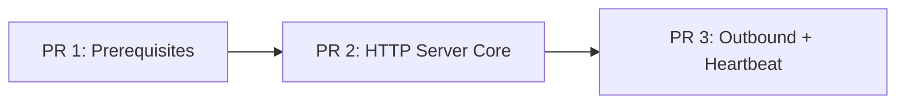

# Phase 2 — Container HTTP Server

## Overview

Transform mika-agent from CLI-only to an Axum HTTP server that accepts messages from the gateway and replies via outbound callbacks. This is the next step after Phase 0+1 (agent core + AsyncDatabase wrapper, 132 tests, schema v6).

After this phase, each customer's Mika container exposes:
- `POST /message` — gateway forwards Telegram user messages
- `POST /heartbeat` — K8s CronJob triggers proactive check-ins
- `GET /health` — K8s liveness/readiness probe

## Problem Statement

Mika runs as a CLI binary. To serve 20-30 executives via Telegram, each customer container needs an HTTP endpoint the gateway can call. The agent loop, tools, scheduler, and compaction are ready — they just need an HTTP entry point and outbound message routing.

## Current State (Phase 0+1 Complete)

| Component | Status | Key File |
|-----------|--------|----------|
| AsyncDatabase (closure-dispatch) | Done | `async_db.rs` (417 lines) |
| Agent loops (conversation + silent) | Done | `agent.rs` |
| 8 tools (memory, reminders, messaging) | Done | `tools/` |
| Conversation compaction | Done | `compaction.rs` |
| ReminderScheduler (recovery only) | Done | `scheduler.rs` |
| MessageSender trait | Done | `messaging.rs` |
| Schema v6 | Done | `db.rs` |
| 132 tests | Done | All modules |

## Architecture

```
Gateway                          Customer Container (this plan)
  │                                    │
  │  POST /message                     │
  │  { text, chat_id, channel,         │
  │    request_id }                    │
  │  Authorization: Bearer <token>     │
  │ ──────────────────────────────────►│
  │  202 Accepted                      │
  │ ◄──────────────────────────────────│  → Mutex try_lock
  │                                    │  → run_agent() (async)
  │                                    │  → tool calls, memory updates
  │         POST /send                 │  → agent calls send_message
  │  Authorization: Bearer <token>     │
  │  { chat_id, text, request_id }     │
  │ ◄──────────────────────────────────│
  │                                    │
  │  POST /heartbeat                   │
  │  { trigger, request_id }           │
  │ ──────────────────────────────────►│
  │  204 (skipped) or 200 (accepted)   │  → pre-filter → try_lock
  │ ◄──────────────────────────────────│  → run_silent_agent() if warranted
```

## Key Design Decisions

### 1. Mutex Policy: try_lock for all, 429 if busy

Use `tokio::sync::Mutex<()>`. All request types use `try_lock()`:
- **User messages**: Return `429 Too Many Requests` if Mutex held. Gateway can retry or buffer.
- **Heartbeats**: Return `204 No Content` if Mutex held (heartbeat is skippable).
- **Reminder timer fires**: Use `try_lock()`, reschedule for 30s later if held.

Rationale: Avoids unbounded queuing. With one user per container and async processing, 429 is rare — only happens if user sends a message while the previous is still being processed. The gateway handles retry.

### 2. chat_id Lifecycle

`chat_id` is unknown at container startup (only known after Telegram pairing in the gateway). Flow:
1. Gateway includes `chat_id` in every `/message` payload
2. Container extracts and stores: `db.set_customer_config("chat_id", ...)`
3. `GatewayMessageSender` reads `chat_id` from DB on each `send()` call
4. Heartbeat/reminder sends also read from DB

### 3. Reminder Recovery Timing

Split into two phases:
- **Before health check**: Schedule future reminder Tokio timers (fast, no agent loops)
- **After health check**: Fire past-due reminders in background task (slow, runs agent loops)

This keeps cold start < 5s while still recovering past-due reminders.

### 4. Graceful Shutdown

SIGTERM → stop accepting connections → wait for Mutex (in-flight agent loop completes, max 5 min) → drop AsyncDatabase sender (signals DB thread) → exit.

`terminationGracePeriodSeconds: 310` in Helm chart (5-min agent timeout + 10s buffer).

### 5. Compaction Outside Mutex

After the agent loop releases the Mutex, spawn compaction as a separate task. Compaction re-acquires the Mutex for its DB operations. The race (new message between agent response and compaction) is benign since compaction is idempotent and threshold-based.

### 6. Error Notification After 202

If the agent loop fails after returning 202, attempt to send an error message via `GatewayMessageSender`: "Sorry, I had a hiccup processing your message. Could you try again?" On fatal errors (DB thread stopped), set health to unhealthy for K8s restart.

## Implementation Phases

---

### PR 1: Prerequisites — DB Resilience + Settings + Scheduler Redesign

Fix blocking issues that make the HTTP server unreliable, and prepare shared infrastructure.

#### 1a. DB Thread Panic Resilience (todo #112)

Wrap the closure execution in `catch_unwind` so a single panicking operation doesn't kill the thread.

```rust
// crates/mika-agent/src/async_db.rs — modify the thread loop
std::thread::spawn(move || {
    while let Ok(f) = rx.recv() {
        if let Err(panic) = std::panic::catch_unwind(std::panic::AssertUnwindSafe(|| f(&db))) {
            tracing::error!(?panic, "DB closure panicked — thread continues");
        }
    }
});
```

**Files:** `crates/mika-agent/src/async_db.rs`
**Tests:** `test_async_db_survives_panic` — send a panicking closure, then a normal one

#### 1b. Add Missing DB Methods

```rust
// crates/mika-agent/src/db.rs — new methods

/// Most recent user message timestamp (for heartbeat pre-filter)
pub fn last_user_message_time(&self) -> Result<Option<String>> {
    // SELECT created_at FROM conversations
    // WHERE role = 'user' AND channel_type IN ('cli', 'telegram')
    // ORDER BY id DESC LIMIT 1
}

/// Record a heartbeat send (for rate limiting)
pub fn record_heartbeat_send(&self) -> Result<()> {
    // INSERT INTO heartbeat_sends (sent_at) VALUES (datetime('now'))
}

/// Save a failed outbound send for later retry
pub fn save_failed_send(&self, text: &str, request_id: Option<&str>) -> Result<i64> {
    // INSERT INTO failed_sends (text, request_id) VALUES (?1, ?2)
}

/// Get oldest failed sends for flushing (limit 5, max retry_count 3, max age 24h)
pub fn get_pending_failed_sends(&self, limit: usize) -> Result<Vec<FailedSend>> {
    // SELECT * FROM failed_sends WHERE retry_count < 3
    //   AND created_at > datetime('now', '-24 hours')
    //   ORDER BY created_at ASC LIMIT ?1
}

/// Delete a successfully flushed send
pub fn delete_failed_send(&self, id: i64) -> Result<()>

/// Increment retry count on a failed flush
pub fn increment_failed_send_retry(&self, id: i64) -> Result<()>
```

Plus corresponding `AsyncDatabase` wrapper methods.

**Files:** `crates/mika-agent/src/db.rs`, `crates/mika-agent/src/async_db.rs`
**Tests:** 6 tests for failed_send lifecycle + last_user_message_time

#### 1c. Settings Additions

```rust
// crates/mika-common/src/config.rs — add to Settings
pub server_port: Option<u16>,           // MIKA_SERVER_PORT, default 8080
pub internal_token: Option<String>,     // MIKA_INTERNAL_TOKEN, bearer auth
```

Redact `internal_token` in the manual `Debug` impl (same pattern as `anthropic_api_key`).

**Files:** `crates/mika-common/src/config.rs`, `config/default.toml`
**Tests:** Config loading with new fields

#### 1d. ReminderScheduler Ownership Redesign

The current `ReminderScheduler` uses `&'a` borrowed references. The HTTP server needs `Arc`-based ownership for `AppState`. Redesign:

```rust
// crates/mika-agent/src/scheduler.rs
pub struct ReminderScheduler {
    pub db: AsyncDatabase,                          // was &'a AsyncDatabase
    pub claude: ClaudeClient,                       // was &'a ClaudeClient (ClaudeClient is Clone)
    pub tools: Arc<ToolRegistry>,                   // was &'a ToolRegistry
    pub home_dir: PathBuf,                          // was &'a Path
    pub message_sender: Option<Arc<dyn MessageSender>>,  // was Option<&'a dyn MessageSender>
}
```

**Breaking change for MessageSender trait:** Currently `#[async_trait(?Send)]`. For `Arc<dyn MessageSender>` to work with `Send` bounds, the trait must become `#[async_trait]` (Send). This requires the `CliMessageSender` future to be `Send` (it is — just prints to stdout).

```rust
// crates/mika-agent/src/messaging.rs
#[async_trait]  // was #[async_trait(?Send)]
pub trait MessageSender: Send + Sync {
    async fn send(&self, text: &str) -> Result<()>;
}
```

This also changes `ToolContext.message_sender` from `Option<&'a dyn MessageSender>` to `Option<Arc<dyn MessageSender>>`.

**Impact on tool files:** All 8 tool test files construct `ToolContext`. The `message_sender: None` stays the same. `send_message.rs` changes from `&dyn` to `Arc<dyn>`.

**Files:** `scheduler.rs`, `messaging.rs`, `tools/mod.rs`, `tools/send_message.rs`, `agent.rs`, `cli.rs`, `test_utils.rs`
**Tests:** All 132 existing tests must pass. New: `test_scheduler_owned_types`

**PR 1 total: ~8 files, ~200 lines, ~10 new tests**

---

### PR 2: Axum Server Core — Scaffold, Health, Auth, Message Handler

The core HTTP server with the primary `/message` endpoint.

#### 2a. Dependencies

```toml
# crates/mika-agent/Cargo.toml — add
axum = "0.8"
tower-http = { version = "0.6", features = ["trace"] }
subtle = "2"  # constant-time token comparison
```

**Files:** `crates/mika-agent/Cargo.toml`, workspace `Cargo.toml`

#### 2b. Server Module Structure

```
crates/mika-agent/src/
  server/
    mod.rs          — Router setup, run_server() entry point (~100 lines)
    state.rs        — AppState struct with Arc-wrapped deps (~40 lines)
    handlers.rs     — POST /message, GET /health handlers (~150 lines)
    auth.rs         — Bearer token middleware (~30 lines)
    errors.rs       — ServerError enum → JSON responses (~50 lines)
    types.rs        — Request/response structs (~40 lines)
```

#### 2c. AppState

```rust
// crates/mika-agent/src/server/state.rs
pub struct AppState {
    pub db: AsyncDatabase,                   // Clone (shares mpsc::Sender)
    pub claude: ClaudeClient,                // Clone
    pub tools: Arc<ToolRegistry>,
    pub scheduler: Arc<ReminderScheduler>,
    pub agent_lock: Arc<tokio::sync::Mutex<()>>,
    pub ready: Arc<AtomicBool>,              // Health check readiness
    pub internal_token: String,
    pub gateway_url: String,                 // For GatewayMessageSender
    pub home_dir: PathBuf,
    pub startup_time: std::time::Instant,
}

impl Clone for AppState { /* all fields are Clone or Arc */ }
```

#### 2d. Bearer Token Middleware

```rust
// crates/mika-agent/src/server/auth.rs
pub async fn require_internal_token(
    State(state): State<AppState>,
    req: axum::extract::Request,
    next: axum::middleware::Next,
) -> impl IntoResponse {
    let token = req.headers()
        .get("authorization")
        .and_then(|v| v.to_str().ok())
        .and_then(|v| v.strip_prefix("Bearer "));

    match token {
        Some(t) if subtle::ConstantTimeEq::ct_eq(
            t.as_bytes(), state.internal_token.as_bytes()
        ).into() => next.run(req).await,
        _ => StatusCode::UNAUTHORIZED.into_response(),
    }
}
```

**Files:** `crates/mika-agent/src/server/auth.rs`

#### 2e. Health Endpoint

```rust
// No auth required (K8s probes)
async fn handle_health(State(state): State<AppState>) -> impl IntoResponse {
    if !state.ready.load(Ordering::Relaxed) {
        return (StatusCode::SERVICE_UNAVAILABLE, Json(json!({
            "status": "starting"
        })));
    }
    (StatusCode::OK, Json(json!({
        "status": "ok",
        "uptime_secs": state.startup_time.elapsed().as_secs(),
    })))
}
```

#### 2f. Message Handler

```rust
// crates/mika-agent/src/server/handlers.rs
#[derive(Deserialize)]
pub struct MessageRequest {
    pub text: String,
    pub chat_id: i64,
    pub channel: String,        // "telegram", "whatsapp"
    pub request_id: String,
}

async fn handle_message(
    State(state): State<AppState>,
    Json(req): Json<MessageRequest>,
) -> impl IntoResponse {
    // Validate
    if req.text.is_empty() || req.text.len() > 50_000 {
        return (StatusCode::BAD_REQUEST, Json(json!({
            "error": "text must be 1-50000 characters"
        })));
    }

    // Try to acquire the agent lock (non-blocking)
    let lock = match state.agent_lock.clone().try_lock_owned() {
        Ok(guard) => guard,
        Err(_) => return (StatusCode::TOO_MANY_REQUESTS, Json(json!({
            "request_id": req.request_id,
            "error": "agent busy"
        }))),
    };

    // Store chat_id on first message (for outbound sends)
    let _ = state.db.set_customer_config("chat_id", &req.chat_id.to_string()).await;

    let request_id = req.request_id.clone();

    // Spawn async agent processing
    let s = state.clone();
    tokio::spawn(async move {
        let _lock = lock;  // Hold lock for duration of agent loop

        let session_id = uuid::Uuid::new_v4().to_string();
        let sender = GatewayMessageSender::new(
            s.gateway_url.clone(),
            s.internal_token.clone(),
            s.db.clone(),
        );
        let sender_arc: Arc<dyn MessageSender> = Arc::new(sender);

        let params = AgentParams {
            db: &s.db,
            claude: &s.claude,
            tools: &s.tools,
            user_message: &req.text,
            channel_type: &req.channel,
            session_id: &session_id,
            home_dir: &s.home_dir,
            is_onboarding: check_onboarding(&s.db).await,
            message_sender: Some(sender_arc.clone()),
        };

        match run_agent(&params).await {
            Ok(_response) => {
                // Response already sent via send_message tool or as final output
                // For conversation mode: send final response via GatewayMessageSender
                if let Err(e) = sender_arc.send(&_response).await {
                    tracing::error!(error = %e, request_id, "failed to send response");
                }
            }
            Err(e) => {
                tracing::error!(error = %e, request_id, "agent loop failed");
                // Attempt to notify user of error
                let _ = sender_arc.send(
                    "Sorry, I had a hiccup processing your message. Could you try again?"
                ).await;
            }
        }

        // Spawn compaction outside the lock (lock dropped here)
        drop(_lock);
        let db = s.db.clone();
        let claude = s.claude.clone();
        tokio::spawn(async move {
            if let Err(e) = crate::compaction::maybe_compact(&db, &claude).await {
                tracing::warn!(error = %e, "post-turn compaction failed");
            }
        });
    });

    (StatusCode::ACCEPTED, Json(json!({
        "request_id": request_id,
        "status": "accepted"
    })))
}
```

#### 2g. Server Entry Point

```rust
// crates/mika-agent/src/server/mod.rs
pub async fn run_server(settings: &Settings) -> Result<()> {
    let home_dir = &settings.home_dir;
    let db = AsyncDatabase::open(&settings.db_path)?;
    let claude = ClaudeClient::new(
        settings.anthropic_api_key.clone(),
        settings.claude_model.clone(),
        settings.claude_max_tokens,
    );
    let tools = Arc::new(default_tools());
    let ready = Arc::new(AtomicBool::new(false));

    // Validate required settings for server mode
    let gateway_url = settings.routing_url.clone()
        .ok_or_else(|| anyhow!("MIKA_ROUTING_URL is required in server mode"))?;
    let internal_token = settings.internal_token.clone()
        .ok_or_else(|| anyhow!("MIKA_INTERNAL_TOKEN is required in server mode"))?;

    let state = AppState {
        db: db.clone(),
        claude: claude.clone(),
        tools: tools.clone(),
        scheduler: Arc::new(ReminderScheduler { /* ... */ }),
        agent_lock: Arc::new(tokio::sync::Mutex::new(())),
        ready: ready.clone(),
        internal_token,
        gateway_url,
        home_dir: home_dir.to_path_buf(),
        startup_time: std::time::Instant::now(),
    };

    let app = Router::new()
        .route("/health", get(handle_health))
        .route("/message", post(handle_message))
        .route("/heartbeat", post(handle_heartbeat))
        .route_layer(axum::middleware::from_fn_with_state(
            state.clone(), require_internal_token
        ))
        .route("/health", get(handle_health))  // Health outside auth layer
        .with_state(state);

    let port = settings.server_port.unwrap_or(8080);
    let listener = TcpListener::bind(("0.0.0.0", port)).await?;
    info!(port, "mika-agent server listening");

    // Schedule future reminders (fast), then mark ready
    let scheduler = state.scheduler.clone();
    scheduler.schedule_future_reminders().await?;
    ready.store(true, Ordering::Release);

    // Fire past-due reminders in background (slow)
    tokio::spawn(async move {
        scheduler.fire_past_due_reminders().await;
    });

    // Serve with graceful shutdown
    axum::serve(listener, app)
        .with_graceful_shutdown(shutdown_signal())
        .await?;

    Ok(())
}

async fn shutdown_signal() {
    tokio::signal::ctrl_c().await.ok();
    info!("shutdown signal received, draining...");
}
```

#### 2h. mika-server Binary

```rust
// crates/mika-agent/src/bin/mika-server.rs
#[tokio::main]
async fn main() -> anyhow::Result<()> {
    let home_dir = mika_common::home::resolve_home_dir()?;
    mika_common::home::bootstrap_home(&home_dir)?;
    let settings = mika_common::config::Settings::load(&home_dir)?;
    mika_common::logging::init_logging(&settings.log_level);

    mika_agent::server::run_server(&settings).await
}
```

```toml
# crates/mika-agent/Cargo.toml — add binary
[[bin]]
name = "mika-server"
path = "src/bin/mika-server.rs"
```

**PR 2 files:**
- New: `server/mod.rs`, `server/state.rs`, `server/handlers.rs`, `server/auth.rs`, `server/errors.rs`, `server/types.rs`, `bin/mika-server.rs`
- Edit: `lib.rs` (add `pub mod server`), `Cargo.toml`

**PR 2 tests:**
- `test_health_returns_503_before_ready`
- `test_health_returns_200_after_ready`
- `test_message_returns_401_without_token`
- `test_message_returns_401_with_wrong_token`
- `test_message_returns_202_accepted`
- `test_message_returns_429_when_busy`
- `test_message_returns_400_for_empty_text`
- `test_message_stores_chat_id`

**PR 2 total: ~10 files, ~500 lines, ~8 new tests**

---

### PR 3: Outbound Routing + Heartbeat + Timer Scheduling

#### 3a. GatewayMessageSender

```rust
// crates/mika-agent/src/messaging.rs — add implementation
pub struct GatewayMessageSender {
    client: reqwest::Client,
    gateway_url: String,
    internal_token: String,
    db: AsyncDatabase,           // For chat_id lookup + failed_sends
}

#[async_trait]
impl MessageSender for GatewayMessageSender {
    async fn send(&self, text: &str) -> Result<()> {
        let chat_id = self.db.get_customer_config("chat_id").await?
            .ok_or_else(|| anyhow!("chat_id not configured — no Telegram pairing yet"))?
            .parse::<i64>()?;

        let payload = json!({ "chat_id": chat_id, "text": text });

        // First attempt
        match self.try_send(&payload).await {
            Ok(()) => return Ok(()),
            Err(e) => tracing::warn!(error = %e, "first /send attempt failed, retrying in 2s"),
        }

        // Retry after 2s
        tokio::time::sleep(Duration::from_secs(2)).await;
        match self.try_send(&payload).await {
            Ok(()) => Ok(()),
            Err(_) => {
                // Save to failed_sends for later flush
                self.db.save_failed_send(text, None).await?;
                tracing::warn!("saved to failed_sends after retry exhaustion");
                Ok(())  // Return Ok — message queued, don't confuse Claude
            }
        }
    }
}

impl GatewayMessageSender {
    async fn try_send(&self, payload: &serde_json::Value) -> Result<()> {
        let resp = self.client
            .post(format!("{}/send", self.gateway_url))
            .bearer_auth(&self.internal_token)
            .json(payload)
            .timeout(Duration::from_secs(10))
            .send()
            .await?;

        if resp.status().is_success() {
            Ok(())
        } else {
            anyhow::bail!("gateway /send returned {}", resp.status())
        }
    }
}
```

#### 3b. Failed Sends Flush

```rust
// crates/mika-agent/src/server/handlers.rs — in handle_message, before agent loop
async fn flush_failed_sends(state: &AppState) {
    let sends = match state.db.get_pending_failed_sends(5).await {
        Ok(s) => s,
        Err(_) => return,
    };

    let sender = GatewayMessageSender::new(/* ... */);
    for send in sends {
        match sender.send(&send.text).await {
            Ok(()) => { let _ = state.db.delete_failed_send(send.id).await; }
            Err(_) => { let _ = state.db.increment_failed_send_retry(send.id).await; }
        }
    }
}
```

#### 3c. Heartbeat Handler with Pre-filter

```rust
async fn handle_heartbeat(
    State(state): State<AppState>,
    Json(req): Json<HeartbeatRequest>,
) -> impl IntoResponse {
    // Pre-filter (no Mutex, no Claude call)
    if !heartbeat_should_run(&state.db).await {
        return StatusCode::NO_CONTENT;
    }

    // try_lock — heartbeat is skippable
    let lock = match state.agent_lock.clone().try_lock_owned() {
        Ok(guard) => guard,
        Err(_) => return StatusCode::NO_CONTENT,
    };

    // Spawn silent agent loop
    let s = state.clone();
    tokio::spawn(async move {
        let _lock = lock;
        let session_id = uuid::Uuid::new_v4().to_string();
        let sender = GatewayMessageSender::new(/* ... */);
        let sender_arc: Arc<dyn MessageSender> = Arc::new(sender);

        let params = SilentAgentParams {
            db: &s.db,
            claude: &s.claude,
            tools: &s.tools,
            trigger: SilentTrigger::Heartbeat,
            home_dir: &s.home_dir,
            session_id: &session_id,
            message_sender: Some(sender_arc),
        };

        if let Err(e) = run_silent_agent(&params).await {
            tracing::warn!(error = %e, "heartbeat agent loop failed");
        }

        // Record heartbeat send (if send_message was called — track via flag)
        // Note: recording happens inside send_message tool when trigger=Heartbeat
    });

    StatusCode::OK
}

async fn heartbeat_should_run(db: &AsyncDatabase) -> bool {
    let tz = db.get_customer_config("timezone").await
        .ok().flatten().unwrap_or_else(|| "UTC".to_string());

    // 1. Active hours check (8:00-21:00 in customer's timezone)
    let now_utc = chrono::Utc::now();
    // Use chrono-tz for timezone conversion
    let tz_parsed: chrono_tz::Tz = tz.parse().unwrap_or(chrono_tz::UTC);
    let now_local = now_utc.with_timezone(&tz_parsed);
    let hour = now_local.hour();
    if hour < 8 || hour >= 21 { return false; }

    // 2. Rate limit: max 1 organic heartbeat/hour
    if db.count_heartbeat_sends_last_hour().await.unwrap_or(0) >= 1 { return false; }

    // 3. Rate limit: max 3 organic heartbeats/day
    if db.count_heartbeat_sends_today(&tz).await.unwrap_or(0) >= 3 { return false; }

    // 4. Skip if user messaged recently (within last 2 hours)
    if let Ok(Some(last_msg)) = db.last_user_message_time().await {
        if let Ok(parsed) = chrono::NaiveDateTime::parse_from_str(&last_msg, "%Y-%m-%d %H:%M:%S") {
            let elapsed = now_utc.naive_utc() - parsed;
            if elapsed < chrono::Duration::hours(2) { return false; }
        }
    }

    true
}
```

#### 3d. Tokio Timer Scheduling for create_reminder

Wire `ReminderScheduler` into the `create_reminder` tool so newly created reminders fire without waiting for a container restart.

```rust
// crates/mika-agent/src/scheduler.rs — add method
impl ReminderScheduler {
    pub async fn schedule_reminder(&self, id: i64, fire_at: DateTime<Utc>) -> Result<()> {
        let delay = (fire_at - Utc::now()).to_std().unwrap_or(Duration::ZERO);
        let scheduler = self.clone();  // needs Clone
        tokio::spawn(async move {
            tokio::time::sleep(delay).await;
            // try_lock — reminders yield to user messages
            // If busy, reschedule for 30s later
            scheduler.fire_single_reminder(id).await;
        });
        Ok(())
    }
}
```

Add `scheduler: Option<Arc<ReminderScheduler>>` to `ToolContext`. The `create_reminder` tool calls `scheduler.schedule_reminder()` after DB insert.

**Files:** `scheduler.rs`, `tools/mod.rs`, `tools/create_reminder.rs`

#### 3e. Split Reminder Recovery

```rust
// crates/mika-agent/src/scheduler.rs
impl ReminderScheduler {
    /// Fast: schedule future reminders as Tokio timers (call before health)
    pub async fn schedule_future_reminders(&self) -> Result<()> {
        let future = self.db.get_future_reminders().await?;
        for reminder in future {
            if let Ok(fire_at) = DateTime::parse_from_rfc3339(&reminder.fire_at) {
                self.schedule_reminder(reminder.id, fire_at.with_timezone(&Utc)).await?;
            }
        }
        Ok(())
    }

    /// Slow: fire past-due reminders (call after health, in background)
    pub async fn fire_past_due_reminders(&self) {
        let past_due = match self.db.get_past_due_reminders().await {
            Ok(r) => r,
            Err(e) => { tracing::warn!(error = %e, "failed to get past-due reminders"); return; }
        };
        for reminder in past_due.into_iter().take(5) {
            self.fire_single_reminder(reminder.id).await;
        }
    }
}
```

#### 3f. Dependencies

```toml
# Add to workspace Cargo.toml
chrono-tz = "0.10"
```

**PR 3 files:**
- Edit: `messaging.rs` (GatewayMessageSender), `scheduler.rs` (timer scheduling, split recovery), `tools/create_reminder.rs` (wire scheduler), `tools/mod.rs` (add scheduler to ToolContext), `server/handlers.rs` (heartbeat handler + flush)
- New: none (all edits)

**PR 3 tests:**
- `test_gateway_sender_includes_bearer_token` (mock HTTP server)
- `test_gateway_sender_retries_once_on_failure`
- `test_gateway_sender_saves_to_failed_sends_after_retry`
- `test_heartbeat_skips_outside_active_hours`
- `test_heartbeat_skips_when_rate_limited`
- `test_heartbeat_skips_when_recently_messaged`
- `test_heartbeat_returns_204_when_mutex_held`
- `test_create_reminder_schedules_timer` (timer fires within test)
- `test_past_due_recovery_fires_in_background`

**PR 3 total: ~6 files, ~400 lines, ~9 new tests**

---

## Dependency Graph



All sequential — each PR builds on the previous.

## Relevant Pending Todos

| Todo | Priority | Status in This Plan |
|------|----------|-------------------|
| #110 — Missing index on memory_events.created_at | P1 | Fix alongside PR 1 (quick) |
| #111 — VACUUM blocks DB thread | P2 | Defer — switch to incremental_vacuum in Phase 3 |
| #112 — DB thread panic resilience | P2 | **Fixed in PR 1a** |
| #113 — Compaction SQL GROUP BY | P2 | Defer — not blocking |
| #114 — Duplicated prompt assembly | P2 | Defer — not blocking |
| #115 — Test setup boilerplate | P3 | Defer |
| #116 — Graceful DB thread shutdown | P3 | Partially addressed by graceful shutdown in PR 2 |
| #117 — Blocking fs reads in async | P3 | Defer — tiny files, 20-30 users |

## Acceptance Criteria

### Functional
- [x] `POST /message` returns 202 and processes agent loop asynchronously
- [x] Agent response delivered via `POST /send` to gateway
- [x] `POST /message` returns 429 when agent is busy
- [x] `POST /message` returns 401 without valid bearer token
- [x] `GET /health` returns 503 during startup, 200 when ready
- [x] `POST /heartbeat` pre-filters (active hours, rate limits, recency)
- [x] `POST /heartbeat` returns 204 when skipped (pre-filter or busy)
- [ ] Newly created reminders fire via Tokio timer without restart (deferred)
- [x] Past-due reminders fire in background after health check passes
- [x] Failed /send attempts save to `failed_sends` and flush on next interaction
- [x] `chat_id` extracted from first message and stored for outbound sends
- [x] Graceful shutdown waits for in-flight agent loop

### Non-Functional
- [x] Container cold start < 5s to health 200
- [x] All 147 tests pass (132 → 147)
- [x] `cargo clippy` clean, 0 warnings
- [x] `mika-cli` still works (no regression)
- [x] `mika-server` binary builds and starts

### Quality Gates
- [x] 15 new tests (10 + 8 + 2 heartbeat — timer tests deferred with timer scheduling)
- [x] CLAUDE.md updated with server commands and new architecture
- [x] Bearer token uses constant-time comparison

## Risk Analysis

| Risk | Likelihood | Mitigation |
|------|-----------|------------|
| MessageSender trait change (?Send → Send) breaks tool tests | Medium | All existing senders are Send; compiler catches mismatches |
| ReminderScheduler redesign (refs → owned) cascades through agent.rs | Medium | CLI path uses owned types too; single migration |
| Axum version incompatibility with reqwest | Low | Both use hyper/tokio ecosystem |
| try_lock too aggressive — user messages get 429 too often | Low | Single user per container; agent loop is 5-min max; gateway retries |
| Compaction race outside Mutex | Low | Benign — compaction is idempotent and threshold-based |
| 25-min past-due recovery blocking health | Eliminated | Split recovery: fast (timers) before health, slow (fire) after |

## References

- Parent plan: `docs/plans/2026-02-24-feat-platform-systems-gateway-provisioning-heartbeat-plan.md`
- Brainstorm: `docs/brainstorms/2026-02-24-platform-systems-brainstorm.md`
- AsyncDatabase pattern: `docs/solutions/architecture/async-database-wrapper-pattern.md`
- Learnings: `docs/learnings-for-rust-rewrite.md` (sections 1.2-1.8 for HTTP patterns)
- Current agent loop: `crates/mika-agent/src/agent.rs`
- Current scheduler: `crates/mika-agent/src/scheduler.rs`
- Current messaging: `crates/mika-agent/src/messaging.rs`
