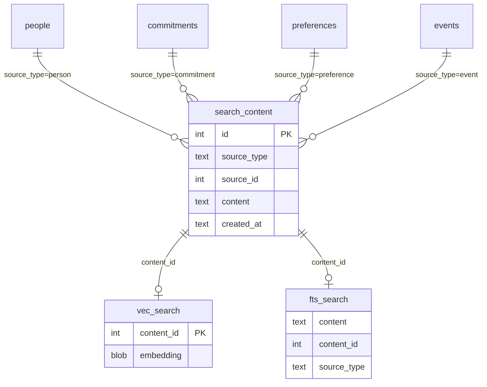

# Layer 3: Vector Search Memory

## Overview

Add semantic search to Mika's memory system via sqlite-vec (vector similarity) + FTS5 (BM25 keyword search) in a hybrid search pipeline. This is the third and final layer of Mika's three-layer memory model, enabling long-tail recall when Layers 1-2 (core memory + structured facts) don't have the answer.

**Since nobody has used the project yet**, migrations and config changes can be consolidated freely — no backward compatibility concerns.

## Problem Statement

The current `search_memory` tool uses SQL `LIKE '%query%'` substring matching. This fails for:

- **Semantic queries**: "what did we discuss about my career change?" won't match "considering switching from engineering to product management"
- **Paraphrased recall**: "that thing about the budget" won't find "Q4 financial review commitments"
- **Conversation history search**: Compacted summaries are injected into the system prompt but aren't searchable by the agent

## Proposed Solution

A three-tier search pipeline that gracefully degrades:

```
                     ┌─────────────────────┐
                     │   search_memory()   │
                     └──────────┬──────────┘
                                │
                    ┌───────────▼───────────┐
                    │  Embedding API key?   │
                    └──┬────────────────┬───┘
                       │ Yes            │ No
               ┌───────▼───────┐  ┌─────▼──────┐
               │ Hybrid Search │  │ FTS5-only  │
               │ (vec0 + FTS5) │  │ (BM25)     │
               └───────┬───────┘  └─────┬──────┘
                       │                │
                       └────────┬───────┘
                                │
                    ┌───────────▼───────────┐
                    │ FTS5 index populated? │
                    └──┬────────────────┬───┘
                       │ Yes            │ No
                       │           ┌────▼─────┐
                       │           │ LIKE     │
                       │           │ fallback │
                       │           └──────────┘
                       ▼
                    Results
```

## Technical Approach

### Architecture

#### New crate module: `crates/mika-common/src/embedding.rs`

Embedding client using direct reqwest (reusing Mika's existing HTTP client — no new dependency for the client itself).

```rust
pub struct EmbeddingClient {
    client: reqwest::Client,
    api_key: SecretString,
    model: String,
    dimensions: u32,
}

impl EmbeddingClient {
    pub async fn embed(&self, text: &str) -> Result<Vec<f32>> { ... }
    pub async fn embed_batch(&self, texts: &[&str]) -> Result<Vec<Vec<f32>>> { ... }
}
```

**Provider**: OpenAI `text-embedding-3-small` at **512 dimensions** (Matryoshka truncation — 98% quality at 3x storage savings). The API shape is a simple POST with JSON in/out.

#### Schema v8: Three new tables

```sql
-- Unified content table for all searchable text
CREATE TABLE search_content (
    id INTEGER PRIMARY KEY AUTOINCREMENT,
    source_type TEXT NOT NULL,         -- 'person', 'commitment', 'preference', 'event', 'summary'
    source_id INTEGER,                 -- FK to source table (NULL for summaries)
    content TEXT NOT NULL,             -- searchable text blob
    created_at TEXT NOT NULL DEFAULT (datetime('now'))
);

-- Vector embeddings (sqlite-vec)
CREATE VIRTUAL TABLE vec_search USING vec0(
    content_id INTEGER PRIMARY KEY,    -- FK to search_content.id
    embedding float[512]
);

-- FTS5 keyword index (BM25 ranking)
CREATE VIRTUAL TABLE fts_search USING fts5(
    content,
    content_id UNINDEXED,
    source_type UNINDEXED,
    tokenize='porter unicode61'
);
```

**Why a unified `search_content` table**: Decouples search from the source tables. Avoids complex JOINs across people/commitments/preferences/events during search. The `source_type` + `source_id` columns link back to the original record for display.

#### Hybrid search: Reciprocal Rank Fusion (RRF)

```sql
WITH vec_matches AS (
    SELECT content_id,
           row_number() OVER (ORDER BY distance) AS rank_number,
           distance
    FROM vec_search
    WHERE embedding MATCH ?1 AND k = ?2
),
fts_matches AS (
    SELECT content_id,
           row_number() OVER (ORDER BY rank) AS rank_number,
           rank AS score
    FROM fts_search WHERE fts_search MATCH ?3
    LIMIT ?2
),
combined AS (
    SELECT coalesce(f.content_id, v.content_id) AS content_id,
           coalesce(1.0 / (60 + f.rank_number), 0.0)
             + coalesce(1.0 / (60 + v.rank_number), 0.0)
             AS combined_score
    FROM fts_matches f
    FULL OUTER JOIN vec_matches v ON v.content_id = f.content_id
    ORDER BY combined_score DESC
)
SELECT sc.id, sc.source_type, sc.source_id, sc.content,
       c.combined_score
FROM combined c
JOIN search_content sc ON sc.id = c.content_id
LIMIT ?4
```

RRF constant = 60 (standard). Equal weights for FTS5 and vector (tunable later).

### Implementation Phases

#### Phase 1: Foundation (Embedding Client + Schema + Init)

**Files to create:**
- `crates/mika-common/src/embedding.rs` — `EmbeddingClient` struct with `embed()` and `embed_batch()`

**Files to modify:**
- `Cargo.toml` — Add `sqlite-vec = "=0.1.7-alpha.10"` and `zerocopy = "0.7"` to workspace deps
- `crates/mika-agent/Cargo.toml` — Add `sqlite-vec` and `zerocopy` dependencies
- `crates/mika-common/Cargo.toml` — (no changes, reqwest already available)
- `crates/mika-common/src/lib.rs` — Add `pub mod embedding;`
- `crates/mika-common/src/config.rs` — Add embedding config fields to `Settings`
- `crates/mika-agent/src/db.rs:6` — Bump `CURRENT_SCHEMA_VERSION` to 8
- `crates/mika-agent/src/db.rs:97-124` — Add `migrate_v8()` call and method
- `crates/mika-agent/src/bin/mika-server.rs` — Call `init_sqlite_vec()` at startup
- `crates/mika-cli/src/main.rs` — Call `init_sqlite_vec()` at startup
- `.env.example` — Add `MIKA_OPENAI_API_KEY`
- `config/default.toml` — Add embedding defaults

**Config additions to `Settings`:**
```rust
/// OpenAI API key for embeddings (optional; enables Layer 3 vector search)
#[serde(default)]
pub openai_api_key: Option<String>,

/// Embedding model ID (default: text-embedding-3-small)
#[serde(default = "default_embedding_model")]
pub embedding_model: String,

/// Embedding dimensions (default: 512)
#[serde(default = "default_embedding_dimensions")]
pub embedding_dimensions: u32,
```

**sqlite-vec initialization** (call once in main before any DB connections):
```rust
pub fn init_sqlite_vec() {
    unsafe {
        rusqlite::ffi::sqlite3_auto_extension(Some(std::mem::transmute(
            sqlite_vec::sqlite3_vec_init as *const (),
        )));
    }
}
```

**Success criteria:**
- [x] `EmbeddingClient::embed("test")` returns a 512-dim `Vec<f32>` (integration test with real API)
- [x] Schema v8 migration creates all 3 tables successfully
- [x] `init_sqlite_vec()` enables `vec0` virtual tables in SQLite
- [x] Config loads `MIKA_OPENAI_API_KEY` from env
- [x] `Settings::Debug` redacts the OpenAI key

#### Phase 2: Index on Write (Embed Facts + Summaries)

**Files to modify:**
- `crates/mika-agent/src/db.rs` — Add `index_content()`, `index_content_with_embedding()`, `delete_search_content()` methods
- `crates/mika-agent/src/async_db.rs` — Add async wrappers for new DB methods
- `crates/mika-agent/src/tools/store_fact.rs` — After storing a fact, index it for search
- `crates/mika-agent/src/tools/update_fact.rs` — After updating a fact, re-index it
- `crates/mika-agent/src/compaction.rs` — After producing a summary, index it for search
- `crates/mika-agent/src/tools/mod.rs:25-32` — Add `embedding_client: Option<&'a EmbeddingClient>` to `ToolContext`
- `crates/mika-agent/src/agent.rs` — Thread `EmbeddingClient` through `AgentParams` → `ToolContext`

**Embedding content strategy** — what gets indexed:

| Source | Content Template | When |
|--------|-----------------|------|
| Person | `"{name} — {relationship}. {notes}"` | `store_fact(category=person)` |
| Commitment | `"{description} (due: {due_date}, status: {status})"` | `store_fact(category=commitment)` |
| Preference | `"{category}: {value}"` | `store_fact(category=preference)` |
| Event | `"{description} on {event_date}. {context}"` | `store_fact(category=event)` |
| Summary | Full compaction summary text | `maybe_compact()` after summarization |

**FTS5 sync**: Populate `fts_search` in the same transaction as `search_content` inserts. No triggers needed — we control all write paths.

**Embedding flow**: Generate embedding via `EmbeddingClient`, then store in a single transaction:
```rust
async fn index_fact_for_search(
    db: &AsyncDatabase,
    embedding_client: Option<&EmbeddingClient>,
    source_type: &str,
    source_id: i64,
    content: &str,
) -> Result<()> {
    // Always index in FTS5 (works without API key)
    let content_id = db.index_content(source_type, source_id, content).await?;

    // Optionally generate and store vector embedding
    if let Some(client) = embedding_client {
        match client.embed(content).await {
            Ok(embedding) => {
                db.index_embedding(content_id, &embedding).await?;
            }
            Err(e) => {
                warn!(error = %e, "embedding generation failed, FTS-only for this content");
            }
        }
    }
    Ok(())
}
```

**Success criteria:**
- [x] `store_fact` for each category populates `search_content` + `fts_search`
- [x] With `MIKA_OPENAI_API_KEY` set, embeddings are stored in `vec_search`
- [x] Without API key, only FTS5 is populated (no errors)
- [x] Compaction summaries are indexed
- [x] Updating a fact re-indexes it (delete old + insert new)
- [x] All existing tests still pass (ToolContext gains optional field)

#### Phase 3: Hybrid Search

**Files to modify:**
- `crates/mika-agent/src/db.rs` — Add `hybrid_search()`, `fts_search()`, `vec_search()` methods
- `crates/mika-agent/src/async_db.rs` — Add async wrappers
- `crates/mika-agent/src/tools/search_memory.rs` — Upgrade to use hybrid search for `all` category

**New data struct:**
```rust
#[derive(Debug, Clone)]
pub struct SearchResult {
    pub id: i64,
    pub source_type: String,
    pub source_id: Option<i64>,
    pub content: String,
    pub score: f64,
}
```

**Search upgrade strategy in `search_memory` tool:**

The existing per-category LIKE search stays for category-specific queries (`person`, `commitment`, etc.) — these are precise and fast. The upgrade targets the `all` category path:

```rust
// In SearchMemoryTool::execute():
if category == "all" {
    // Try hybrid search first (FTS5 + optional vector)
    let hybrid_results = ctx.db.hybrid_search(
        query,
        embedding_client,  // None if no API key
        10,                // top-k
    ).await?;

    if !hybrid_results.is_empty() {
        // Format and return hybrid results
        return Ok(format_hybrid_results(&hybrid_results));
    }
    // Fall through to existing LIKE search as ultimate fallback
}
// ... existing per-category LIKE search ...
```

**Graceful degradation chain:**
1. Hybrid (vec0 + FTS5) — when embedding API key is configured and index is populated
2. FTS5-only — when no API key, or embedding generation fails
3. LIKE fallback — when FTS5 index is empty (fresh DB, or pre-Layer-3 data)

**Success criteria:**
- [x] `search_memory(query="career change")` finds "switching from engineering to product management" via vector similarity
- [x] `search_memory(query="budget")` still finds "Q4 budget" via FTS5 keyword match
- [x] With no API key, FTS5-only search works correctly
- [x] With empty index, falls back to existing LIKE behavior
- [x] Per-category searches unchanged (person, commitment, etc.)
- [x] Results include relevance scores for debugging

#### Phase 4: Backfill + Polish

**Files to create:**
- `crates/mika-agent/src/backfill.rs` — One-time backfill of existing facts into search index

**Files to modify:**
- `crates/mika-agent/src/db.rs` — Add `get_all_facts_for_indexing()` method
- `CLAUDE.md` — Update schema version, add Layer 3 architecture docs
- `crates/mika-agent/src/tools/search_memory.rs:19` — Update tool description to mention semantic search

**Backfill strategy**: On first startup after migration to v8, detect that `search_content` is empty while Layer 2 tables have data, and backfill:

```rust
pub async fn backfill_search_index(
    db: &AsyncDatabase,
    embedding_client: Option<&EmbeddingClient>,
) -> Result<()> {
    let content_count = db.count_search_content().await?;
    if content_count > 0 {
        return Ok(()); // Already indexed
    }

    let people = db.list_people().await?;
    let commitments = db.list_commitments_all().await?;
    let preferences = db.list_preferences().await?;
    let events = db.list_events().await?;

    // Index all facts (FTS5 always, vec0 if client available)
    // Use batch embedding for efficiency
    // ...
}
```

Backfill runs at startup (in `main()` after DB init). Uses `embed_batch()` for efficiency — a typical customer with 50-200 facts would need 1-2 API calls.

**Success criteria:**
- [x] Existing facts are searchable via hybrid search after upgrade
- [x] Backfill is idempotent (safe to run multiple times)
- [x] Batch embedding minimizes API calls
- [x] CLAUDE.md reflects new architecture
- [x] Tool description updated for users

## Alternative Approaches Considered

| Approach | Verdict | Reason |
|----------|---------|--------|
| pgvector on shared Postgres | Rejected | Violates per-customer isolation; adds shared infrastructure dependency |
| In-process embedding model | Deferred | Rust ecosystem for local models (llama.cpp bindings) is immature; 200MB+ model adds to container image |
| FTS5 only (no vectors) | Considered | Good starting point but misses semantic understanding — the core value of Layer 3 |
| Separate semantic_search tool | Rejected | Adds complexity to skill system; better to enhance existing search_memory |
| async-openai crate | Rejected | Adds ~15 transitive deps for a single API endpoint; direct reqwest is simpler |
| 1536 dimensions | Rejected | 512d retains 98% quality at 3x storage savings; brute-force KNN is fast enough at this scale |

## Acceptance Criteria

### Functional Requirements

- [x] `search_memory(query="career change")` finds semantically related facts (not just substring matches)
- [x] `search_memory(query="budget", category="commitment")` still uses precise LIKE search
- [x] `search_memory(query="anything")` works without `MIKA_OPENAI_API_KEY` (FTS5 fallback)
- [x] Newly stored facts are immediately searchable via both FTS5 and vector search
- [x] Conversation summaries from compaction are indexed and searchable
- [x] Existing facts are backfilled on first startup after upgrade

### Non-Functional Requirements

- [x] Embedding API failures don't break fact storage (warn and continue with FTS5-only)
- [x] Hybrid search completes in <100ms for per-customer scale (hundreds of facts)
- [x] No regressions in existing 166 tests
- [x] Docker agent image size increase <5MB (sqlite-vec C extension is ~300KB)
- [x] `Settings::Debug` redacts OpenAI API key

### Quality Gates

- [x] All new code has inline `#[cfg(test)] mod tests` with unit tests
- [x] Integration tests cover: hybrid search, FTS5-only fallback, LIKE fallback, backfill
- [x] `cargo clippy` passes with no new warnings
- [x] `cargo test` passes (target: ~180+ tests)

## Dependencies & Prerequisites

| Dependency | Version | Purpose | Risk |
|-----------|---------|---------|------|
| `sqlite-vec` | `=0.1.7-alpha.10` | vec0 virtual tables for vector similarity | Alpha; pin exact version |
| `zerocopy` | `0.7` | Zero-copy `&[f32]` → `&[u8]` for sqlite-vec | Stable, widely used |
| OpenAI Embeddings API | - | text-embedding-3-small at 512 dims | External API; handled by graceful degradation |
| FTS5 | Built-in | BM25 keyword search | Ships with SQLite bundled feature |

**No new crate dependencies for the embedding client** — reuses existing `reqwest`, `serde`, `serde_json`, `secrecy`.

## Risk Analysis & Mitigation

| Risk | Likelihood | Impact | Mitigation |
|------|-----------|--------|------------|
| sqlite-vec alpha instability | Medium | High | Pin exact version; abstract behind DB methods; FTS5-only fallback always works |
| OpenAI API rate limits | Low | Low | Batch embeddings; embed on write (not read); backfill with delays |
| Embedding drift (model changes) | Low | Medium | Store model name in search_content; re-backfill if model changes |
| FTS5 index size growth | Low | Low | Per-customer DB; hundreds of facts = KB-range index |
| vec0 + in-memory DB for tests | Medium | Medium | Tests use on-disk tempfile DBs (already the pattern); init sqlite-vec in test setup |

## Future Considerations

- **Re-ranking with MMR** (Maximal Marginal Relevance) for diversity in results — follow OpenClaw's pattern
- **Temporal decay** — boost recent facts over old ones
- **Local embedding model** — eliminate OpenAI dependency for self-hosted deployments
- **Automatic re-indexing** — when embedding model changes, detect and re-embed all content
- **Agent-driven semantic recall** — inject top vector search results into system prompt alongside core memory (proactive recall)

## References & Research

### Internal References

- Architecture: Three-layer memory model — `CLAUDE.md:61`
- Original v2 plan schema — `docs/plans/2026-02-23-feat-mika-v2-rust-rewrite-plan.md:289-308`
- Original brainstorm — `docs/brainstorms/2026-02-23-mika-v2-rust-rewrite-brainstorm.md:113-132`
- Current search tool — `crates/mika-agent/src/tools/search_memory.rs`
- DB schema + migrations — `crates/mika-agent/src/db.rs:6,97-124`
- AsyncDatabase wrapper — `crates/mika-agent/src/async_db.rs`
- Config system — `crates/mika-common/src/config.rs:7-47`
- Compaction — `crates/mika-agent/src/compaction.rs`
- Store fact tool — `crates/mika-agent/src/tools/store_fact.rs`
- ToolContext — `crates/mika-agent/src/tools/mod.rs:25-32`
- Encryption strip (unblocked search) — `docs/solutions/refactoring/strip-field-level-encryption-refactor.md`

### External References

- [sqlite-vec documentation](https://alexgarcia.xyz/sqlite-vec/)
- [sqlite-vec hybrid search blog](https://alexgarcia.xyz/blog/2024/sqlite-vec-hybrid-search/index.html)
- [sqlite-vec Rust crate](https://crates.io/crates/sqlite-vec)
- [OpenAI Embeddings API](https://platform.openai.com/docs/guides/embeddings)
- [FTS5 documentation](https://www.sqlite.org/fts5.html)

### Reference Implementation

- OpenClaw hybrid search — `/home/samidarko/workspace/senara-solutions/openclaw/src/memory/hybrid.ts`
- OpenClaw embedding provider — `/home/samidarko/workspace/senara-solutions/openclaw/src/memory/embeddings.ts`
- OpenClaw memory schema — `/home/samidarko/workspace/senara-solutions/openclaw/src/memory/memory-schema.ts`

## ERD


