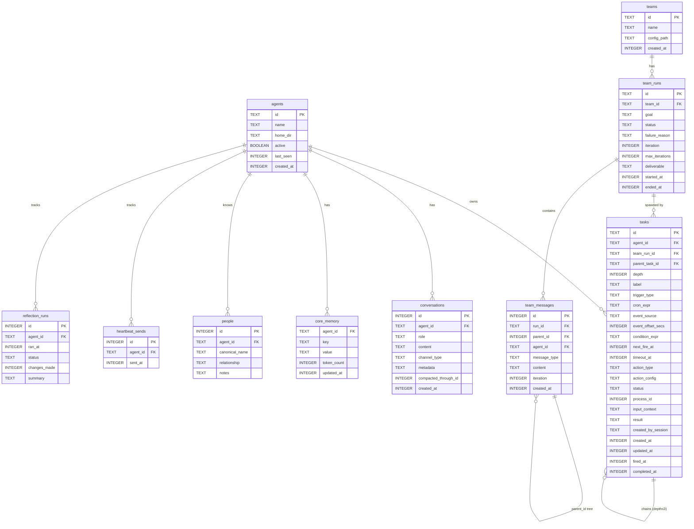

# feat: Unified Task Engine — Reactive Scheduler and Clean-Slate Schema

## Overview

Replace Mika's three disconnected scheduling mechanisms (Tokio cron scheduler for reminders, Python calendar sidecar, synchronous blocking team delegation) with a single unified durable task engine backed by SQLite. Simultaneously consolidate all per-agent and per-team SQLite databases into one container-level `mika.db`, with agents and teams as first-class database citizens.

The core insight: a reminder, a calendar alert, a heartbeat, a team delegation, a user input request, and a long-running tool are all the same thing — *a trigger fires, with context, producing an outcome*. They should all be one system.

This is a complete architectural replacement. No backward compatibility constraint. Single user, clean slate.

---

## Problem Statement

Three separate systems handle proactive behavior today:

| System | Location | Mechanism | Problem |
|---|---|---|---|
| Reminders | `crates/mika-agent/src/scheduler.rs` | `ReminderScheduler` + Tokio interval | In-memory timer, SQLite only for storage; restarts lose state mid-loop |
| Heartbeat | `crates/mika-agent/src/server/handlers.rs` | External cron → POST `/heartbeat` | Separate mechanism with duplicated pre-filter logic; can't see reminders |
| Team delegation | `crates/mika-agent/src/teams/` | Synchronous `await` inside agent tool call | Blocks parent agent loop 0–180s; causes 429s if message arrives; no resume |

Additionally, the codebase has:
- One SQLite file **per agent** (`~/.mika/agents/{id}/data/mika.db`) — no cross-agent queries possible
- One SQLite file **per team** (`~/.mika/teams/{id}/data/mika.db`) — disconnected from agent DBs
- Heartbeat sends table uses TEXT timestamps; reminders table was already migrated to INTEGER (v9); `created_at` columns use TEXT `datetime('now')` — timestamp format inconsistency across the schema
- No way for the agent to ask the user a question and wait for the answer
- No way to call a long-running tool without blocking the whole agent loop

---

## Proposed Solution

### The Unified Task Model

Every proactive behavior is a **task**: a row in the `tasks` table describing what to do (`action_type`), when to do it (`trigger_type` + `next_fire_at`), and which agent owns it (`agent_id`).

**Trigger types:** `time` | `recurring` | `callback` | `user_reply` | `event` | `condition`

**Action types:** `send_message` | `resume_agent` | `inject_context` | `run_skill` | `invoke_orchestrator`

**Task states:** `pending` → `in_progress` → `completed` | `failed` | `cancelled` | `expired` | `recurring_active`

### Single DB Per Container

All per-agent and per-team SQLite files merge into `~/.mika/data/mika.db`. Agents and teams become rows in `agents` and `teams` tables. All tasks, conversations, memory, and team runs reference `agent_id` or `team_id` via foreign keys. The unified view query — "show me all my reminders, pending agent work, and calendar alerts" — becomes one SQL statement.

### TaskEngine Replaces ReminderScheduler

`TaskEngine` struct owns an `AsyncDatabase` reference and an in-memory `BinaryHeap<QueuedTask>` sorted by `next_fire_at`. A 1-second Tokio interval checks for due tasks and dispatches them. External triggers (callback endpoint, user reply) bypass the tick loop and dispatch immediately.

---

## Technical Approach

### Architecture

```
┌─────────────────────────────────────────────────────────────────┐
│  mika-agent container                                            │
│                                                                  │
│  ┌──────────────┐    ┌─────────────────────────────────────┐    │
│  │  TaskEngine  │    │         mika.db (single file)        │    │
│  │              │    │                                       │    │
│  │  BinaryHeap  │◄───│  agents  teams  tasks  conversations │    │
│  │  (next_fire) │    │  memory  team_runs  team_messages    │    │
│  │              │    │  heartbeat_sends  reflection_runs    │    │
│  │  tick (1s)   │    └────────────────────────────────────-─┘    │
│  └──────┬───────┘              ▲                                  │
│         │ dispatch             │ write/read                       │
│         ▼                      │                                  │
│  ┌──────────────────┐   ┌──────────────┐                        │
│  │  TaskDispatcher  │   │ AsyncDatabase │  (single OS thread)   │
│  │                  │   └──────────────┘                        │
│  │  send_message    │                                            │
│  │  resume_agent    │   ┌──────────────────────────────────┐    │
│  │  inject_context  │   │  Axum server (mika-server)        │    │
│  │  run_skill       │   │                                   │    │
│  │  invoke_orch.    │   │  POST /message                    │    │
│  └──────────────────┘   │  POST /heartbeat  (→ task lookup) │    │
│                          │  POST /tasks/{id}/complete        │    │
│                          └──────────────────────────────────┘    │
└─────────────────────────────────────────────────────────────────┘
```

### Full Schema (v12 — Clean Slate)

All timestamps: `INTEGER` unix timestamps via `unixepoch()`. All enum columns: `CHECK` constraints. `COLLATE NOCASE` on human-entered unique identifiers. WAL mode, NORMAL synchronous, `foreign_keys = ON`, `busy_timeout = 5000`.

#### ERD Diagram



#### Full DDL

```sql
-- Identity
CREATE TABLE agents (
    id TEXT PRIMARY KEY,
    name TEXT NOT NULL,
    home_dir TEXT NOT NULL,
    active BOOLEAN NOT NULL DEFAULT 1,
    last_seen INTEGER,
    created_at INTEGER NOT NULL DEFAULT (unixepoch())
);

CREATE TABLE teams (
    id TEXT PRIMARY KEY,
    name TEXT NOT NULL,
    config_path TEXT NOT NULL,
    created_at INTEGER NOT NULL DEFAULT (unixepoch())
);

-- Core primitive
CREATE TABLE tasks (
    id TEXT PRIMARY KEY,
    agent_id TEXT NOT NULL REFERENCES agents(id),
    team_run_id TEXT REFERENCES team_runs(id),
    parent_task_id TEXT REFERENCES tasks(id),
    depth INTEGER NOT NULL DEFAULT 0 CHECK (depth BETWEEN 0 AND 3),
    label TEXT NOT NULL,
    trigger_type TEXT NOT NULL CHECK (trigger_type IN (
        'time', 'recurring', 'callback', 'user_reply', 'event', 'condition'
    )),
    cron_expr TEXT,
    event_source TEXT,
    event_offset_secs INTEGER,
    condition_expr TEXT,
    next_fire_at INTEGER,
    timeout_at INTEGER,
    action_type TEXT NOT NULL CHECK (action_type IN (
        'send_message', 'resume_agent', 'inject_context', 'run_skill', 'invoke_orchestrator'
    )),
    action_config TEXT NOT NULL DEFAULT '{}',
    status TEXT NOT NULL DEFAULT 'pending' CHECK (status IN (
        'pending', 'in_progress', 'completed', 'failed', 'cancelled', 'expired', 'recurring_active'
    )),
    process_id INTEGER,
    input_context TEXT,
    result TEXT,
    created_by_session TEXT,
    created_at INTEGER NOT NULL DEFAULT (unixepoch()),
    updated_at INTEGER NOT NULL DEFAULT (unixepoch()),
    fired_at INTEGER,
    completed_at INTEGER
);
CREATE INDEX idx_tasks_fire_queue ON tasks(next_fire_at, status)
    WHERE status IN ('pending', 'recurring_active');
CREATE INDEX idx_tasks_agent_status ON tasks(agent_id, status);
CREATE INDEX idx_tasks_user_reply ON tasks(agent_id, trigger_type, status)
    WHERE trigger_type = 'user_reply';
CREATE INDEX idx_tasks_team_run ON tasks(team_run_id) WHERE team_run_id IS NOT NULL;
CREATE INDEX idx_tasks_parent ON tasks(parent_task_id) WHERE parent_task_id IS NOT NULL;
CREATE INDEX idx_tasks_created ON tasks(agent_id, created_at);

-- Conversations
CREATE TABLE conversations (
    id INTEGER PRIMARY KEY AUTOINCREMENT,
    agent_id TEXT NOT NULL REFERENCES agents(id),
    role TEXT NOT NULL CHECK (role IN ('user', 'assistant', 'system')),
    content TEXT NOT NULL,
    channel_type TEXT NOT NULL,
    metadata TEXT,
    compacted_through_id INTEGER,
    created_at INTEGER NOT NULL DEFAULT (unixepoch())
);
CREATE INDEX idx_conversations_agent_id ON conversations(agent_id, id);
CREATE INDEX idx_conversations_channel ON conversations(agent_id, channel_type, id);
CREATE INDEX idx_conversations_created ON conversations(agent_id, created_at);

-- Memory layer (all tables get agent_id FK)
CREATE TABLE core_memory (
    agent_id TEXT NOT NULL REFERENCES agents(id),
    key TEXT NOT NULL,
    value TEXT NOT NULL,
    token_count INTEGER NOT NULL DEFAULT 0,
    updated_at INTEGER NOT NULL DEFAULT (unixepoch()),
    PRIMARY KEY (agent_id, key)
);

CREATE TABLE people (
    id INTEGER PRIMARY KEY AUTOINCREMENT,
    agent_id TEXT NOT NULL REFERENCES agents(id),
    canonical_name TEXT NOT NULL COLLATE NOCASE,
    relationship TEXT,
    notes TEXT,
    first_mentioned INTEGER NOT NULL DEFAULT (unixepoch()),
    last_mentioned INTEGER NOT NULL DEFAULT (unixepoch()),
    UNIQUE (agent_id, canonical_name)
);

CREATE TABLE commitments (
    id INTEGER PRIMARY KEY AUTOINCREMENT,
    agent_id TEXT NOT NULL REFERENCES agents(id),
    description TEXT NOT NULL COLLATE NOCASE,
    status TEXT NOT NULL DEFAULT 'pending' CHECK (status IN ('pending', 'completed', 'cancelled')),
    due_date TEXT,
    person_id INTEGER REFERENCES people(id),
    created_at INTEGER NOT NULL DEFAULT (unixepoch()),
    completed_at INTEGER,
    UNIQUE (agent_id, description)
);
CREATE INDEX idx_commitments_status ON commitments(agent_id, status);

CREATE TABLE preferences (
    id INTEGER PRIMARY KEY AUTOINCREMENT,
    agent_id TEXT NOT NULL REFERENCES agents(id),
    category TEXT NOT NULL COLLATE NOCASE,
    value TEXT NOT NULL,
    updated_at INTEGER NOT NULL DEFAULT (unixepoch()),
    UNIQUE (agent_id, category)
);

CREATE TABLE events (
    id INTEGER PRIMARY KEY AUTOINCREMENT,
    agent_id TEXT NOT NULL REFERENCES agents(id),
    description TEXT NOT NULL,
    event_date TEXT,
    context TEXT,
    created_at INTEGER NOT NULL DEFAULT (unixepoch())
);
CREATE INDEX idx_events_date ON events(agent_id, event_date);

CREATE TABLE memory_events (
    id INTEGER PRIMARY KEY AUTOINCREMENT,
    agent_id TEXT NOT NULL REFERENCES agents(id),
    session_id TEXT NOT NULL,
    tool_name TEXT NOT NULL,
    target_key TEXT NOT NULL,
    before_value TEXT,
    after_value TEXT,
    reasoning TEXT,
    created_at INTEGER NOT NULL DEFAULT (unixepoch())
);
CREATE INDEX idx_memory_events_agent ON memory_events(agent_id, session_id);
CREATE INDEX idx_memory_events_created ON memory_events(agent_id, created_at);

CREATE TABLE memory_event_summaries (
    id INTEGER PRIMARY KEY AUTOINCREMENT,
    agent_id TEXT NOT NULL REFERENCES agents(id),
    year INTEGER NOT NULL,
    month INTEGER NOT NULL,
    tool_counts TEXT NOT NULL,
    category_counts TEXT NOT NULL,
    total_mutations INTEGER NOT NULL,
    top_targets TEXT NOT NULL,
    created_at INTEGER NOT NULL DEFAULT (unixepoch()),
    UNIQUE (agent_id, year, month)
);

-- Layer 3 search
CREATE TABLE search_content (
    id INTEGER PRIMARY KEY AUTOINCREMENT,
    agent_id TEXT NOT NULL REFERENCES agents(id),
    source_type TEXT NOT NULL,
    source_id INTEGER,
    content TEXT NOT NULL,
    created_at INTEGER NOT NULL DEFAULT (unixepoch())
);
CREATE INDEX idx_search_content_agent ON search_content(agent_id, source_type, source_id);

CREATE VIRTUAL TABLE fts_search USING fts5(
    content,
    content_id UNINDEXED,
    agent_id UNINDEXED,
    source_type UNINDEXED,
    tokenize='porter unicode61'
);

CREATE VIRTUAL TABLE vec_search USING vec0(
    content_id INTEGER PRIMARY KEY,
    embedding float[512]
);

-- Team tables
CREATE TABLE team_runs (
    id TEXT PRIMARY KEY,
    team_id TEXT NOT NULL REFERENCES teams(id),
    goal TEXT NOT NULL,
    status TEXT NOT NULL DEFAULT 'running' CHECK (status IN ('running', 'completed', 'failed')),
    failure_reason TEXT,
    iteration INTEGER NOT NULL DEFAULT 0,
    max_iterations INTEGER NOT NULL DEFAULT 3,
    deliverable TEXT,
    started_at INTEGER NOT NULL DEFAULT (unixepoch()),
    ended_at INTEGER
);
CREATE INDEX idx_team_runs_team ON team_runs(team_id, started_at);

CREATE TABLE team_messages (
    id INTEGER PRIMARY KEY AUTOINCREMENT,
    run_id TEXT NOT NULL REFERENCES team_runs(id),
    parent_id INTEGER REFERENCES team_messages(id),
    agent_id TEXT REFERENCES agents(id),
    message_type TEXT NOT NULL CHECK (message_type IN (
        'goal', 'orchestrator', 'assignment', 'agent_response', 'error', 'deliverable'
    )),
    content TEXT NOT NULL,
    iteration INTEGER NOT NULL DEFAULT 0,
    created_at INTEGER NOT NULL DEFAULT (unixepoch())
);
CREATE INDEX idx_team_messages_run ON team_messages(run_id, created_at);
CREATE INDEX idx_team_messages_parent ON team_messages(parent_id);

-- Operational
CREATE TABLE heartbeat_sends (
    id INTEGER PRIMARY KEY AUTOINCREMENT,
    agent_id TEXT NOT NULL REFERENCES agents(id),
    sent_at INTEGER NOT NULL DEFAULT (unixepoch())
);
CREATE INDEX idx_heartbeat_sends ON heartbeat_sends(agent_id, sent_at);

CREATE TABLE reflection_runs (
    id INTEGER PRIMARY KEY AUTOINCREMENT,
    agent_id TEXT NOT NULL REFERENCES agents(id),
    ran_at INTEGER NOT NULL DEFAULT (unixepoch()),
    status TEXT NOT NULL DEFAULT 'completed' CHECK (status IN ('completed', 'failed')),
    changes_made INTEGER DEFAULT 0,
    summary TEXT
);
CREATE INDEX idx_reflection_runs ON reflection_runs(agent_id, ran_at);

CREATE TABLE customer_config (
    agent_id TEXT NOT NULL REFERENCES agents(id),
    key TEXT NOT NULL,
    value TEXT NOT NULL,
    PRIMARY KEY (agent_id, key)
);

CREATE TABLE failed_sends (
    id INTEGER PRIMARY KEY AUTOINCREMENT,
    agent_id TEXT NOT NULL REFERENCES agents(id),
    text TEXT NOT NULL,
    request_id TEXT,
    created_at INTEGER NOT NULL DEFAULT (unixepoch()),
    retry_count INTEGER NOT NULL DEFAULT 0
);
```

### Implementation Phases

#### Phase 1: Database Foundation

**Goal:** New schema in place; migration from v11 to v12 complete; single `AsyncDatabase` instance shared across all agents.

**Files to create/modify:**

- `crates/mika-agent/src/db.rs` — full rewrite:
  - Schema v12 DDL (all tables above)
  - Migration v12: create `agents`, `teams` tables; add `agent_id` FK to every table; consolidate data from per-agent DBs; convert `heartbeat_sends.sent_at` to INTEGER; drop `reminders` table (data migrated to `tasks`); drop per-team DB references
  - New `Database::open_container(path)` constructor (opens `~/.mika/data/mika.db`, not per-agent path)
  - All existing query methods updated to include `agent_id` parameter
  - New `agents` CRUD: `register_agent`, `update_agent_last_seen`, `list_agents`
  - New `teams` CRUD: `register_team`, `list_teams`
  - New `tasks` CRUD: `create_task`, `update_task_status`, `get_due_tasks`, `get_pending_user_reply_task`, `cancel_task`, `get_tasks_by_agent`, `mark_tasks_expired`
  - GC method: `prune_completed_tasks(older_than_secs: i64)` — deletes terminal tasks older than 90 days
  - Cap check: `count_pending_tasks(agent_id)` — returns count; engine checks < 100 before inserting

- `crates/mika-agent/src/async_db.rs` — update all method signatures to pass `agent_id`; single shared `AsyncDatabase` instance is now created once at container startup

- `crates/mika-common/src/home.rs` — add `container_db_path()` helper returning `~/.mika/data/mika.db`

**Migration plan (v11 → v12):**

```sql
BEGIN;

-- 1. Create identity tables
CREATE TABLE agents (...);
CREATE TABLE teams (...);

-- 2. Auto-register agents from known directories
-- (done in Rust startup code, not raw SQL)

-- 3. Add agent_id FK to all tables (SQLite: recreate tables)
-- ALTER TABLE conversations ADD COLUMN agent_id TEXT NOT NULL DEFAULT 'main';
-- ... same for people, commitments, preferences, events, memory_events, etc.

-- 4. Migrate reminders → tasks
INSERT INTO tasks (id, agent_id, label, trigger_type, action_type, action_config,
                   next_fire_at, timeout_at, status, created_at)
SELECT
    lower(hex(randomblob(16))),
    'main',
    'Reminder: ' || message,
    'time',
    'send_message',
    json_object('text', message),
    fire_at,
    NULL,
    CASE status
        WHEN 'pending' THEN 'pending'
        WHEN 'delivered' THEN 'completed'
        WHEN 'failed' THEN 'failed'
        WHEN 'cancelled' THEN 'cancelled'
        ELSE 'pending'
    END,
    unixepoch(created_at)
FROM reminders;

-- 5. Convert heartbeat_sends.sent_at from TEXT to INTEGER
-- (same pattern as v9 migration for reminders)

-- 6. Register heartbeat as a recurring task
INSERT INTO tasks (id, agent_id, label, trigger_type, cron_expr, action_type, action_config, status)
VALUES (lower(hex(randomblob(16))), 'main', 'Heartbeat', 'recurring', '0 */4 * * *', 'run_skill',
        '{"skill_name": "heartbeat"}', 'recurring_active');

-- 7. Register reflection as a recurring task
INSERT INTO tasks (id, agent_id, label, trigger_type, cron_expr, action_type, action_config, status)
VALUES (lower(hex(randomblob(16))), 'main', 'Memory Reflection', 'recurring', '0 2 * * *', 'run_skill',
        '{"skill_name": "reflection"}', 'recurring_active');

-- 8. Drop reminders table
DROP TABLE reminders;

-- 9. Migrate team_runs and team_messages from per-team DBs
-- (done in Rust startup code using ATTACH)

-- 10. Add teams to teams table from filesystem
-- (done in Rust startup code)

INSERT INTO schema_version (version) VALUES (12);
COMMIT;
```

**Success criteria:**
- [ ] `cargo test` passes with new schema
- [ ] Migration completes without data loss (verified by row count checks)
- [ ] Single `mika.db` file exists at container root; per-agent DB files are no longer created
- [ ] All existing tests still pass (DB layer is transparent to test code via agent_id parameter)

---

#### Phase 2: TaskEngine Core

**Goal:** `TaskEngine` replaces `ReminderScheduler`; tick loop dispatches tasks; startup recovery works.

**Files to create:**

- `crates/mika-agent/src/task_engine/mod.rs` — main module, re-exports
- `crates/mika-agent/src/task_engine/engine.rs` — `TaskEngine` struct and tick loop
- `crates/mika-agent/src/task_engine/queue.rs` — `QueuedTask` (implements `Ord` by `next_fire_at`)
- `crates/mika-agent/src/task_engine/dispatcher.rs` — `TaskDispatcher` with match on `action_type`
- `crates/mika-agent/src/task_engine/cron.rs` — `next_fire_from_cron(expr: &str, after: i64) -> Result<i64>` using `cron` crate

**Key structs:**

```rust
// crates/mika-agent/src/task_engine/engine.rs

pub struct TaskEngine {
    db: AsyncDatabase,
    queue: BinaryHeap<QueuedTask>,
    dispatcher: Arc<TaskDispatcher>,
    agent_id: String,
}

#[derive(Eq, PartialEq)]
pub struct QueuedTask {
    pub task_id: String,
    pub next_fire_at: i64,
    pub trigger_type: TriggerType,
    pub action_type: ActionType,
}

// Reverse order so BinaryHeap is a min-heap by next_fire_at
impl Ord for QueuedTask { ... }

impl TaskEngine {
    pub async fn new(db: AsyncDatabase, dispatcher: Arc<TaskDispatcher>, agent_id: String) -> Result<Self>;

    /// Called at startup. Loads pending/recurring tasks, recovers in_progress, expires timed-out tasks.
    pub async fn startup_recovery(&mut self) -> Result<()>;

    /// Spawns the 1-second tick loop as a background task.
    pub fn spawn_tick_loop(self: Arc<Mutex<Self>>) -> JoinHandle<()>;

    /// External trigger: callback or user_reply. Bypasses tick queue.
    pub async fn complete_task(&self, task_id: &str, result: serde_json::Value) -> Result<()>;

    /// Called by create_task tool to insert and enqueue a new task.
    pub async fn enqueue(&mut self, task: NewTask) -> Result<String>;
}
```

**Startup recovery sequence:**

```rust
async fn startup_recovery(&mut self) -> Result<()> {
    let now = chrono::Utc::now().timestamp();

    // 1. Expire tasks past their timeout_at
    self.db.mark_tasks_expired(self.agent_id.clone(), now).await?;

    // 2. Recover in_progress tasks
    let in_progress = self.db.get_tasks_by_status(&self.agent_id, "in_progress").await?;
    for task in in_progress {
        if let Some(pid) = task.process_id {
            // Check if process is still alive
            if process_is_alive(pid) {
                // Re-enqueue with callback trigger — it will complete via /tasks/{id}/complete
                continue;
            }
        }
        // Process is dead or no PID: mark failed
        self.db.update_task_status(&task.id, "failed", Some("recovered: process not running")).await?;
    }

    // 3. Load pending + recurring_active tasks into BinaryHeap
    let pending = self.db.get_schedulable_tasks(&self.agent_id).await?;
    for task in pending {
        if task.trigger_type == "recurring" {
            let next = next_fire_from_cron(&task.cron_expr.unwrap(), now)?;
            self.db.update_task_next_fire_at(&task.id, next).await?;
            self.queue.push(QueuedTask::from(task).with_next_fire(next));
        } else {
            self.queue.push(QueuedTask::from(task));
        }
    }

    Ok(())
}
```

**Tick loop (1-second interval, MissedTickBehavior::Skip):**

```rust
pub fn spawn_tick_loop(engine: Arc<Mutex<Self>>) -> JoinHandle<()> {
    tokio::spawn(async move {
        let mut interval = tokio::time::interval(Duration::from_secs(1));
        interval.set_missed_tick_behavior(MissedTickBehavior::Skip);
        loop {
            interval.tick().await;
            let mut eng = engine.lock().await;
            eng.tick().await;
            // Lock released here — dispatch runs in spawned tasks below
        }
    })
}

async fn tick(&mut self) {
    let now = chrono::Utc::now().timestamp();
    const MAX_PER_TICK: usize = 10;
    let mut fired = 0;

    while fired < MAX_PER_TICK {
        match self.queue.peek() {
            Some(t) if t.next_fire_at <= now => {
                let task = self.queue.pop().unwrap();
                self.fire_task(task).await;
                fired += 1;
            }
            _ => break,
        }
    }
}

async fn fire_task(&mut self, queued: QueuedTask) {
    // Mark in_progress in DB synchronously (fast, just a row update)
    self.db.update_task_status(&queued.task_id, "in_progress", None).await.ok();

    // IMPORTANT: Dispatch runs in a spawned task so the engine lock is released immediately.
    // dispatch_resume_agent() and dispatch_run_skill() can run for up to 300s.
    // Holding Mutex<TaskEngine> during dispatch would:
    //   - Block the tick loop for the entire agent run
    //   - Deadlock any tool call that tries task_engine.lock() (ToolContext)
    let dispatcher = self.dispatcher.clone();
    let db = self.db.clone();
    let task_id = queued.task_id.clone();
    let trigger_type = queued.trigger_type.clone();
    let cron_expr = queued.cron_expr.clone(); // carried for recurring re-schedule

    tokio::spawn(async move {
        let result = dispatcher.dispatch(&task_id).await;
        match result {
            Ok(_) => {
                if trigger_type == TriggerType::Recurring {
                    // Re-schedule: compute next fire time, update DB
                    let next = cron_expr
                        .as_deref()
                        .and_then(|e| next_fire_from_cron(e, chrono::Utc::now().timestamp()).ok())
                        .unwrap_or(i64::MAX);
                    db.update_task_next_fire_at(&task_id, next).await.ok();
                    db.update_task_status(&task_id, "recurring_active", None).await.ok();
                    // Note: re-enqueue into BinaryHeap is handled by engine on next startup
                    // OR via a separate channel back to the engine. See Phase 2 implementation note.
                } else if trigger_type != TriggerType::InjectContext {
                    // inject_context stays in_progress; agent loop marks it completed.
                    // All other one-shot actions complete here.
                    db.update_task_completed(&task_id, "completed").await.ok();
                }
            }
            Err(e) => {
                db.update_task_completed(&task_id, "failed").await.ok();
                tracing::error!(task_id = %task_id, error = %e, "task dispatch failed");
            }
        }
    });
    // Engine lock is released when fire_task() returns — immediately after spawn
}
```

**Phase 2 implementation note on recurring re-enqueue:** After dispatch completes in the spawned task, the `BinaryHeap` in the engine struct is no longer accessible (we don't hold the lock). Two clean solutions:
1. **Channel approach:** Spawned task sends `(task_id, next_fire_at)` on an `mpsc::Sender<ReEnqueue>` that the tick loop drains each tick. Simple and non-blocking.
2. **DB-only approach:** Don't re-enqueue in memory; simply let startup recovery rebuild the queue. Acceptable since recurring tasks fire at multi-hour intervals — a container restart is the only gap scenario.

**Dispatcher (`dispatcher.rs`):**

```rust
pub struct TaskDispatcher {
    pub db: AsyncDatabase,
    pub claude: ClaudeClient,
    pub tools: Arc<ToolRegistry>,
    pub skills: Arc<SkillRegistry>,
    pub message_sender: Option<Arc<dyn MessageSender>>,
    pub global_home_dir: PathBuf,
    // ... other agent params
}

impl TaskDispatcher {
    pub async fn dispatch(&self, task_id: &str) -> Result<()> {
        let task = self.db.get_task(task_id).await?;
        let config: serde_json::Value = serde_json::from_str(&task.action_config)?;

        match task.action_type.as_str() {
            "send_message" => self.dispatch_send_message(&task, &config).await,
            "resume_agent" => self.dispatch_resume_agent(&task, &config).await,
            "inject_context" => self.dispatch_inject_context(&task, &config).await,
            "run_skill" => self.dispatch_run_skill(&task, &config).await,
            "invoke_orchestrator" => self.dispatch_invoke_orchestrator(&task, &config).await,
            _ => Err(anyhow!("unknown action_type: {}", task.action_type)),
        }
    }

    async fn dispatch_send_message(&self, task: &Task, config: &Value) -> Result<()> {
        let text = config["text"].as_str().ok_or_else(|| anyhow!("missing text"))?;
        if let Some(sender) = &self.message_sender {
            sender.send(text).await?;
        }
        Ok(())
    }

    async fn dispatch_resume_agent(&self, task: &Task, config: &Value) -> Result<()> {
        // Rebuild fresh system prompt — do NOT use stored prompt (see brainstorm)
        // Load conversation messages by IDs stored in task.input_context
        // Inject task.result as the tool/callback result
        // Call run_agent_inner()
        todo!()
    }

    async fn dispatch_inject_context(&self, task: &Task, config: &Value) -> Result<()> {
        // inject_context tasks have a two-phase lifecycle:
        //
        // Phase 1 (this function, runs in spawned task):
        //   The context payload is already in task.action_config (set at creation time).
        //   Nothing to do here — the task was already marked in_progress by fire_task().
        //   Return Ok(()); the spawned task in fire_task() will NOT mark it completed
        //   because trigger_type == InjectContext is special-cased.
        //
        // Phase 2 (agent loop, at prompt build time):
        //   agent.rs queries: SELECT * FROM tasks WHERE agent_id=? AND action_type='inject_context'
        //     AND status='in_progress' ORDER BY created_at LIMIT 10
        //   For each row: reads action_config JSON, injects context into system prompt.
        //   Then marks each consumed task completed:
        //     UPDATE tasks SET status='completed', completed_at=unixepoch() WHERE id=?
        //
        // This ensures context is injected exactly once, at the next user interaction,
        // regardless of when the tick loop fired the task.
        Ok(())
    }

    async fn dispatch_run_skill(&self, task: &Task, config: &Value) -> Result<()> {
        let skill_name = config["skill_name"].as_str().ok_or_else(|| anyhow!("missing skill_name"))?;
        // Build SilentPromptContext for the skill
        // Call run_silent_agent() with appropriate trigger
        todo!()
    }

    async fn dispatch_invoke_orchestrator(&self, task: &Task, config: &Value) -> Result<()> {
        // Check if all sibling tasks in config["sibling_task_ids"] are completed
        // If yes: assemble results, call run_team_agent() on orchestrator
        // If no: no-op (another sibling will call this when it completes)
        todo!()
    }
}
```

**New crate dependency:**
```toml
# crates/mika-agent/Cargo.toml
cron = "0.12"   # for parsing cron expressions and computing next fire time
uuid = { version = "1", features = ["v4"] }  # already likely present
```

**Files to modify:**

- `crates/mika-agent/src/lib.rs` — add `pub mod task_engine;`
- `crates/mika-agent/src/server/mod.rs` — replace `ReminderScheduler` with `TaskEngine`; share single `AsyncDatabase` across all agent states
- `crates/mika-agent/src/server/handlers.rs` — **remove `/heartbeat` endpoint entirely**. Heartbeat is now a `recurring` task managed by the engine internally. The external cron job that previously POSTed to `/heartbeat` should be decommissioned. (Cross-reference: Phase 6 cleanup and OpenAPI spec update.)
- `crates/mika-agent/src/agent.rs` — add inject_context consumption at prompt build time; add compaction guard (check pending `resume_agent` tasks before compacting)

**Success criteria:**
- [ ] TaskEngine starts, loads tasks, builds BinaryHeap
- [ ] A one-shot time task fires within 1s of `next_fire_at` and transitions to `completed`
- [ ] A recurring task re-queues itself with next cron time after firing
- [ ] Startup recovery marks orphaned `in_progress` tasks as `failed`
- [ ] `MAX_PER_TICK = 10` cap prevents tick overrun

---

#### Phase 3: Migrate Existing Features to Tasks

**Goal:** Reminders, heartbeat, reflection all route through the task engine. `ReminderScheduler` is deleted.

**Files to modify:**

- `crates/mika-agent/src/tools/create_reminder.rs` — change from `db.add_reminder(fire_at, message)` to `task_engine.enqueue(NewTask { trigger_type: Time, action_type: SendMessage, next_fire_at: fire_at, label: message, ... })`. Tool now takes `ToolContext` which has a `task_engine: Arc<Mutex<TaskEngine>>` field.
- `crates/mika-agent/src/tools/cancel_reminder.rs` — change from `db.cancel_reminder(id)` to `task_engine.cancel_task(id)` (which SIGTERMs process if PID set)
- `crates/mika-agent/src/tools/list_reminders.rs` — change from `db.get_pending_reminders()` to `db.get_tasks_by_agent_and_type(agent_id, "time", "send_message")`. Display format unchanged.
- `crates/mika-agent/src/scheduler.rs` — **delete entire file**
- `crates/mika-agent/src/server/handlers.rs` — `/heartbeat` endpoint is **removed** (done in Phase 2). The pre-filter logic (active hours, rate limit checks via `heartbeat_sends`) moves into `dispatch_run_skill()` for the heartbeat action — it reads `heartbeat_sends` before deciding whether to run the silent agent.
- `crates/mika-agent/src/agent.rs` — `ReflectionConfig` struct deleted; reflection is now a `recurring` task registered at startup (cron: `0 2 * * *`).

**ToolContext update:**

```rust
// crates/mika-agent/src/tools/mod.rs
pub struct ToolContext {
    pub db: AsyncDatabase,
    pub session_id: String,
    pub home_dir: PathBuf,
    pub core_memory_edit_count: Arc<AtomicUsize>,
    pub is_onboarding: bool,
    pub message_sender: Option<Arc<dyn MessageSender>>,
    pub embedding_client: Option<EmbeddingClient>,
    pub brave_api_key: Option<String>,
    pub task_engine: Arc<Mutex<TaskEngine>>,  // NEW: for create_task, cancel_task, list_tasks tools
    pub agent_id: String,                      // NEW: identifies which agent is running
}
```

**Feature mapping verification:**

| Old mechanism | New mechanism | Verified |
|---|---|---|
| `scheduler.rs::ReminderScheduler` | `TaskEngine` | - [ ] |
| `reminders` table | `tasks` table with `trigger='time'` | - [ ] |
| `heartbeat_sends` pre-filter | stays in heartbeat dispatch | - [ ] |
| `reflection_runs` trigger | `recurring` task (cron: `0 2 * * *`) | - [ ] |

**Success criteria:**
- [ ] `mika reminders` still shows pending reminders (now from `tasks` table)
- [ ] `create_reminder` tool creates task, not reminder row
- [ ] `cancel_reminder` tool cancels task, SIGTERMs process if any
- [ ] Heartbeat fires on schedule without `/heartbeat` endpoint intervention
- [ ] Reflection fires nightly at 2am UTC

---

#### Phase 4: New Capabilities

**Goal:** User reply routing, long-running tools, and async team delegation work end-to-end.

##### 4a: User Reply Routing (`user_reply` trigger)

New tool: **`ask_user` tool** (builtin, not skill):

```rust
// crates/mika-agent/src/tools/ask_user.rs
// Inputs: question (str), timeout_secs (int, default 1800)
// Output: "Question sent. Task ID: {id}. I'll resume when you reply."

// Creates task: trigger='user_reply', action='resume_agent'
// Sends question to message_sender
// Saves current conversation message IDs to task.input_context
// Returns graceful exit signal to agent loop
```

**Gateway update** (`crates/mika-gateway/src/`):
- Before routing inbound user message to agent container, query: `GET /tasks/pending_user_reply`
- If a `user_reply` task exists for this chat_id with `status='pending'` and `timeout_at > now`:
  - Route message to: `POST /tasks/{id}/complete` with `{"result": "<user_message_text>"}`
  - Agent container's `TaskEngine.complete_task()` fires → `dispatch_resume_agent()`
- If no pending `user_reply` task (or expired): normal `POST /message` routing

New endpoint on `mika-server`:
- `GET /tasks/pending_user_reply` → returns `{task_id, label, timeout_at}` if a user_reply task is pending, else 404
- `POST /tasks/{id}/complete` → accepts `{"result": <json>}`, calls `engine.complete_task(id, result)`

##### 4b: Long-Running Tools (`callback` trigger)

**tools.json schema extension:**
```json
{
    "name": "analyze_codebase",
    "handler": {
        "type": "exec",
        "command": "handlers/run.sh",
        "long_running": true,
        "estimated_duration_secs": 120
    }
}
```

**`execute_tool()` changes** (`crates/mika-agent/src/agent.rs`):
```rust
if skill.handler.long_running {
    // 1. Create callback task, save conversation message IDs to input_context
    let task_id = ctx.task_engine.lock().await.enqueue(NewTask {
        trigger_type: TriggerType::Callback,
        action_type: ActionType::ResumeAgent,
        input_context: Some(current_message_ids_json()),
        label: format!("Long-running: {}", tool_name),
        timeout_at: Some(now + estimated_duration_secs * 3),
        ..Default::default()
    }).await?;

    // 2. Spawn handler with MIKA_TASK_ID and MIKA_CALLBACK_URL env vars
    let child = Command::new(&skill.handler.command)
        .env("MIKA_TASK_ID", &task_id)
        .env("MIKA_CALLBACK_URL", "http://localhost:{port}/tasks/{task_id}/complete")
        .env_clear()
        // allowlist same as current exec handler
        .spawn()?;

    // 3. Store PID
    ctx.task_engine.lock().await.set_process_id(&task_id, child.id()).await?;

    // 4. Return graceful exit to agent loop
    return Ok(ToolOutput::long_running_submitted(task_id));
}
```

**Agent loop graceful exit on `long_running_submitted`:**
```rust
// In run_loop(), after execute_tool():
if output.is_long_running_submitted() {
    // Return the task-submitted message as the assistant's response
    // Save to conversations DB
    // Exit loop cleanly (not a timeout)
    return Ok(AgentOutput { text: output.text, ... });
}
```

##### 4c: Async Team Delegation (`invoke_orchestrator` action)

**TeamEngine changes** (`crates/mika-agent/src/teams/engine.rs`):
- Replace synchronous `JoinSet::join_next()` blocking with task creation:
  - For each specialist assignment: create `tasks` row with `trigger='callback'`, `action='invoke_orchestrator'`
  - Spawn specialist agent in background `tokio::spawn`
  - Specialist completes → posts to `/tasks/{id}/complete`
  - `invoke_orchestrator` dispatcher checks if all siblings complete → fires orchestrator
- The orchestrator tool call (`run_team`) returns immediately after creating all tasks
- Orchestrator gets fresh context with all sibling results when re-invoked

**Note:** This is the most complex phase. The synchronous team engine is a significant redesign. It may be deferred to a follow-up PR if the core engine (Phases 1–3) needs to ship first.

**Success criteria for Phase 4:**
- [ ] `ask_user` tool sends question, creates user_reply task, exits agent gracefully
- [ ] Gateway detects pending user_reply task and routes reply to `/tasks/{id}/complete`
- [ ] Agent resumes with fresh context + user's answer
- [ ] Long-running skill creates callback task, spawns process, exits cleanly
- [ ] Process posts to callback URL on completion; agent resumes with result

---

#### Phase 5: TUI Integration

**Goal:** `/tasks` slash command, footer badge, team dashboard uses task status.

**Files to modify:**

- `crates/mika-cli/src/tui/commands/handlers.rs` — add `/tasks` command handler:
  ```
  /tasks          → list all pending/active tasks for current agent
  /tasks cancel <id>  → cancel a task by ID
  ```

- `crates/mika-cli/src/tui/app.rs` — add `pending_task_count: usize` to app state; poll every 5s from DB; show in footer as `[3 tasks]` badge

- `crates/mika-cli/src/tui/chat.rs` — footer rendering: append task badge when count > 0

- `crates/mika-cli/src/tui/team.rs` — team dashboard right panel reads from `tasks` table (where `team_run_id = current_run`) for per-agent status instead of `TeamEvent::AgentStarted` signals

- `crates/mika-cli/src/commands/reminders.rs` — `mika reminders` subcommand now queries `tasks WHERE trigger_type='time' AND action_type='send_message'`

- New: `crates/mika-cli/src/commands/tasks.rs` — `mika tasks` subcommand (list, cancel)

- Tab completion: add `tasks` to slash command completions in `crates/mika-cli/src/tui/completion.rs`

**Success criteria:**
- [ ] `/tasks` shows pending reminders, calendar alerts, and agent callbacks in one view
- [ ] Footer shows `[N tasks]` badge when tasks are pending
- [ ] `mika tasks` CLI subcommand works
- [ ] Team dashboard reads task state, not just events

---

#### Phase 6: Cleanup

**Goal:** Remove all dead code; update CLAUDE.md; verify tests pass.

**Files to delete:**
- `crates/mika-agent/src/scheduler.rs` (replaced by task_engine)

**Files to update:**
- `crates/mika-agent/src/lib.rs` — remove `pub mod scheduler;`
- `crates/mika-agent/src/server/mod.rs` — remove `ReminderScheduler` references; remove `/heartbeat` endpoint if heartbeat is now task-driven
- `crates/mika-agent/src/agent.rs` — remove `ReflectionConfig` struct and `check_and_fire_reflection()` references
- `crates/mika-agent/src/db.rs` — remove all `reminders`-related methods
- `crates/mika-agent/src/async_db.rs` — remove reminder methods
- `crates/mika-common/src/home.rs` — remove per-agent DB path helpers (or keep for filesystem structure)
- `docs/openapi/mika-server.yaml` — update to add `/tasks/{id}/complete`, `GET /tasks/pending_user_reply`; update or remove `/heartbeat` if removed
- `CLAUDE.md` — update schema version to 12, update Architecture section, update features table
- `.env.example` — remove any calendar sidecar env vars if present

**Success criteria:**
- [ ] `cargo build` — no warnings, no dead code warnings
- [ ] `cargo clippy` — clean
- [ ] `cargo test` — all tests pass (adapt broken tests to new schema/API)
- [ ] `CLAUDE.md` schema version shows 12

---

## Alternative Approaches Considered

### Keep Per-Agent DB Sharding, Add Shared Tasks DB
Maintain per-agent `mika.db` files but add a shared `tasks.db` that all agents write to.

**Rejected because:** Adds a second connection lifecycle to manage; foreign keys across DB files require ATTACH gymnastics; the "unified view" query still requires joins across files; more complex startup initialization.

### Use a Priority Queue (3-tier: urgent/normal/background)
Add a priority integer to tasks and process them in priority order at each tick.

**Rejected because:** Single-user system processing ~20 tasks/day — two tasks firing simultaneously is nearly impossible. FIFO is correct for the actual workload. Priority adds complexity to every task-creation code path for a collision that won't happen. (See brainstorm decision.)

### Keep Synchronous Team Delegation (skip Phase 4c)
Don't convert team delegation to async tasks; keep `JoinSet` blocking.

**Viable:** Phase 4c (async team delegation) is the most complex change and can be deferred. Phases 1–3 deliver the unified model for reminders/heartbeat/reflection. Phase 4c can be a follow-up PR.

---

## System-Wide Impact

### Interaction Graph

**`create_reminder` tool call:**
1. `create_reminder` tool → calls `task_engine.enqueue(NewTask)`
2. `TaskEngine.enqueue()` → validates cap (< 100 pending tasks), inserts into `tasks` table via `AsyncDatabase`
3. `AsyncDatabase` thread writes row, returns task_id
4. `task_engine.queue.push(QueuedTask)` — in-memory queue updated
5. On `next_fire_at`: tick loop pops task → `dispatcher.dispatch_send_message()` → `message_sender.send()` → HTTP POST to gateway → Telegram → user
6. Task row transitions: `pending` → `in_progress` → `completed`

**Inbound user message (server mode):**
1. POST `/message` → `handle_message()` (handlers.rs)
2. Handler calls `GET /tasks/pending_user_reply` (internal, same process) → check DB for active `user_reply` task
3. If found and within timeout: route to `POST /tasks/{id}/complete` instead of normal agent loop
4. `engine.complete_task()` → update task.result in DB → `dispatcher.dispatch_resume_agent()` → `run_agent_inner()` with fresh context
5. If not found: normal `run_agent()` → conversation stored in `conversations` with `agent_id`

**Heartbeat (recurring task):**
1. Tick loop fires recurring task → `dispatcher.dispatch_run_skill("heartbeat")` (in spawned task, engine lock already released)
2. Dispatcher reads `heartbeat_sends` table to check rate limits (active hours, 1/hour, 3/day)
3. If pre-filter passes: tries `agent_lock.try_lock()` — if agent is busy (holding conversation), heartbeat is silently skipped (same behavior as current `try_lock_owned()` in server handler)
4. If lock acquired: runs `run_silent_agent()`, then inserts row into `heartbeat_sends`
5. Recurring task re-queues with next cron time (via re-enqueue channel or next startup recovery)

### Error & Failure Propagation

**Task dispatch failure:**
- `dispatcher.dispatch()` returns `Err` → `fire_task()` catches → sets task status to `failed` → logs `tracing::error!`
- No panic; tick loop continues to next task
- `recurring` tasks that fail: re-queue anyway with next cron time (heartbeat failure should not stop future heartbeats)

**Startup recovery failure:**
- `startup_recovery()` errors are logged but non-fatal; engine starts with whatever tasks it could load
- Individual task load failures skip that task and continue

**AsyncDatabase thread death:**
- Currently: any `with_db()` call returns `Err("database has been shut down")` after thread exits
- New: single shared DB means any DB failure affects all agents simultaneously (vs. per-agent isolation before)
- Mitigation: `catch_unwind` already in AsyncDatabase thread; panic in one closure doesn't kill the thread

**`cancel_task` + `SIGTERM` failure:**
- PID may not exist (process already exited naturally) → `libc::kill()` returns `ESRCH` → ignore
- Process may be a zombie → same treatment

### State Lifecycle Risks

**Migration (v11 → v12):**
- Reminders migrated to tasks: if migration fails mid-transaction, reminders still exist in old table. Migration is wrapped in `BEGIN/COMMIT` — either all rows migrate or none.
- Per-team DB consolidation: done in Rust code using SQLite ATTACH. If the startup consolidation fails, the per-team DB files still exist and can be retried on next startup. After successful consolidation, per-team DB files are renamed to `.migrated` (not deleted immediately).

**Task in `in_progress` when container restarts:**
- Background task process was spawned, container restarts before process posts result
- Recovery: check if PID is alive (`/proc/{pid}/` existence on Linux). If not: mark task `failed`, notify agent on next interaction.
- Process may have completed and its callback POST was lost. No receipt acknowledgment exists — the task just fails. Acceptable for single-user system.

**`user_reply` task expires while user is composing:**
- User sends reply 31 minutes after agent's question (30-minute default window)
- Task transitions to `expired` at minute 30 (checked on startup and on each tick)
- User's reply routes to normal conversation; agent handles it without the task context
- Agent may need to re-ask the question if the context is stale

**Compaction + suspended conversation:**
- Before compacting: `SELECT COUNT(*) FROM tasks WHERE agent_id=? AND status IN ('pending', 'in_progress') AND action_type='resume_agent'`
- If > 0: skip compaction for that agent. Conversation is preserved for resumption.
- Risk: compaction never runs while a long-running task is pending. Acceptable — the long-running tool should complete in minutes, not days. Task expiry (via `timeout_at`) prevents indefinite suspension.

### API Surface Parity

**New endpoints on `mika-server`:**
- `GET /tasks/pending_user_reply?agent_id={id}` — gateway calls this before routing
- `POST /tasks/{id}/complete` — background processes and gateway call this

**Changed endpoints:**
- `POST /heartbeat` — may be removed (heartbeat is now internal recurring task). If removed, the external cron job that POSTs to `/heartbeat` should be decommissioned.

**Unchanged endpoints:**
- `POST /message` — same interface, but internally may route to `/tasks/{id}/complete`
- `GET /health` — unchanged

**Tool API surface:**
- `create_reminder` tool: same inputs, different internal implementation
- `cancel_reminder` tool: same interface, now uses task_id
- New: `ask_user` tool (inputs: `question`, `timeout_secs`)
- New: `list_tasks` tool (inputs: `status_filter`, `type_filter`)
- New: `cancel_task` tool (inputs: `task_id`)

### Integration Test Scenarios

1. **Reminder round-trip:** Create reminder via tool → wait for tick loop → verify `send_message` called and task transitions to `completed`.

2. **User reply routing:** Agent calls `ask_user` → gateway receives next message → gateway checks `/tasks/pending_user_reply` → message routes to `/tasks/{id}/complete` → agent resumes with user's answer in context.

3. **Recurring task persistence:** Container restarts mid-interval → startup recovery loads recurring tasks → next tick fires at correct `next_fire_at` → no double-fire.

4. **Compaction blocked by suspension:** Agent suspends with `resume_agent` task → compaction check runs → compaction is skipped → task completes → compaction unblocked on next run.

5. **Concurrent agent + task dispatch:** Agent loop is running (holds `agent_lock`) → heartbeat task due → dispatcher tries `try_lock()` → defers → agent loop completes → heartbeat fires on next tick.

---

## Acceptance Criteria

### Functional Requirements

- [ ] All existing reminders are migrated to `tasks` table during v12 migration with no data loss
- [ ] `create_reminder` tool creates a `time` trigger task; reminder fires within 2 seconds of scheduled time
- [ ] `cancel_reminder` tool cancels the task; background process receives SIGTERM if PID is set
- [ ] Heartbeat fires on its cron schedule without any external POST to `/heartbeat`
- [ ] Memory reflection fires nightly at 2am UTC
- [ ] `ask_user` tool creates a `user_reply` task, sends question, suspends agent gracefully
- [ ] Gateway routes user reply to pending `user_reply` task when within timeout window
- [ ] User reply task routes to normal conversation when expired
- [ ] `/tasks` slash command shows all pending/active tasks for current agent
- [ ] `mika tasks` CLI subcommand lists tasks
- [ ] TUI footer shows pending task count badge
- [ ] Task chain depth > 3 is rejected at insert time with a clear error
- [ ] Single `mika.db` at `~/.mika/data/mika.db`; no per-agent DB files created
- [ ] Cross-agent unified view query returns correct results
- [ ] Team dashboard reads task status for per-agent status display

### Non-Functional Requirements

- [ ] Tick loop adds < 1ms CPU overhead per second when no tasks are due
- [ ] Startup recovery completes in < 500ms for up to 100 pending tasks
- [ ] No query without a LIMIT clause on result sets > 100 rows
- [ ] All new timestamp columns use INTEGER unix timestamps
- [ ] `GET /tasks/pending_user_reply` responds in < 5ms (indexed query)
- [ ] GC prune runs during reflection job; no unbounded table growth

### Quality Gates

- [ ] `cargo test` — all tests pass (including adapted tests for new schema)
- [ ] `cargo clippy` — no warnings
- [ ] `cargo fmt` — clean
- [ ] `cargo test --features telemetry` — passes
- [ ] CLAUDE.md updated: schema version 12, Architecture section, feature table
- [ ] OpenAPI spec updated: new endpoints documented
- [ ] ADR written for the unified task engine decision (ADR-00N)

---

## Risk Analysis & Mitigation

| Risk | Severity | Likelihood | Mitigation |
|---|---|---|---|
| Migration corrupts existing reminders | High | Low | Full transaction; count-check before/after; rename old DB files instead of deleting |
| Per-team DB consolidation loses team history | High | Low | ATTACH-based copy; verify row counts; keep `.migrated` backup files |
| Tick loop eats CPU | Medium | Low | 1s interval + `MissedTickBehavior::Skip`; max 10 tasks per tick; profiling in test |
| Single DB creates contention | Medium | Low | Single OS thread (AsyncDatabase) serializes all writes naturally; SQLite WAL handles reads |
| `invoke_orchestrator` phase 4c scope creep | High | High | Explicitly defer to follow-up PR; phases 1-3 are independently valuable |
| Compaction perpetually blocked by orphaned task | Medium | Low | `timeout_at` expiry ensures tasks can't pend forever; recovery marks orphaned tasks failed |
| User reply routed wrong (task vs. new conversation) | Medium | Low | `timeout_at` window is per-task, conservative default 30min; after expiry it's always normal conversation |
| `cron` crate incompatibility with existing toolchain | Low | Low | Evaluate `cron = "0.12"` against `rust-toolchain.toml` edition 2024; fallback: hand-roll simple interval calculation for the 3 cron expressions actually used |

---

## Dependencies & Prerequisites

- `cron = "0.12"` — cron expression parsing and next-fire computation
- `uuid = "1"` with `v4` feature — task ID generation (likely already present)
- All other dependencies already in workspace

---

## Future Considerations

- **Calendar skill:** Once task engine is live, a calendar sync skill can create `event` trigger tasks. The `event_source` + `event_offset_secs` columns are already in the schema.
- **Condition tasks:** The `condition` trigger type is in the schema. The heartbeat agent evaluates conditions expressed as plain text. First condition task can be added without schema changes.
- **Async team delegation (Phase 4c):** The `invoke_orchestrator` action type is in the schema. Team delegation can migrate to async when prioritized.
- **Task visibility to agent:** `list_tasks` tool lets the agent query its own pending tasks. The schema supports it immediately.
- **WhatsApp channel adapter:** The `user_reply` routing logic in the gateway is channel-agnostic (checks by `agent_id`, not by Telegram-specific chat_id). WhatsApp adapter can reuse the same flow.

---

## Documentation Plan

- `CLAUDE.md` — update schema version (11→12), Architecture section (DB topology, task engine, new capabilities), Environment Variables (remove calendar sidecar vars if any)
- `docs/openapi/mika-server.yaml` — add `GET /tasks/pending_user_reply`, `POST /tasks/{id}/complete`; update or remove `/heartbeat`
- `docs/adr/` — new ADR for unified task engine decision
- `docs/configuration.md` — update any references to per-agent DB paths
- `docs/architecture.md` — update DB schema appendix

---

## Sources & References

### Origin

- **Brainstorm document:** [docs/brainstorms/2026-03-04-unified-task-engine-brainstorm.md](../brainstorms/2026-03-04-unified-task-engine-brainstorm.md)

  Key decisions carried forward:
  1. Single DB per container (one `mika.db`, agents and teams as rows)
  2. FIFO task execution, cap at depth 3 for chains, per-task timeout for user_reply
  3. SIGTERM via `process_id` on cancel; inject_context via task scan at prompt build time; condition_expr evaluated as plain text by heartbeat LLM

### Internal References

- Current scheduler: `crates/mika-agent/src/scheduler.rs`
- Agent loop: `crates/mika-agent/src/agent.rs`
- DB schema: `crates/mika-agent/src/db.rs` (v11)
- AsyncDatabase: `crates/mika-agent/src/async_db.rs`
- Server handlers: `crates/mika-agent/src/server/handlers.rs`
- Team engine: `crates/mika-agent/src/teams/engine.rs`
- Tool context: `crates/mika-agent/src/tools/mod.rs`

### Institutional Learnings

- [`docs/solutions/database-issues/sqlite-datetime-format-mismatch.md`](../solutions/database-issues/sqlite-datetime-format-mismatch.md) — always INTEGER timestamps for comparison columns; migration pattern with `unixepoch()` backfill
- [`docs/solutions/runtime-errors/reminders-never-fire-at-scheduled-time.md`](../solutions/runtime-errors/reminders-never-fire-at-scheduled-time.md) — polling patterns: `MissedTickBehavior::Skip`, per-cycle cap, skip first tick, `try_lock()` for agent lock
- [`docs/solutions/database-issues/team-graph-persistence-replacing-toml-history.md`](../solutions/database-issues/team-graph-persistence-replacing-toml-history.md) — per-team DB → main DB consolidation pattern; tree structure via `parent_id`
- [`docs/solutions/code-review-patterns/background-agent-mode-design-checklist.md`](../solutions/code-review-patterns/background-agent-mode-design-checklist.md) — defensive patterns: LIMIT on all queries, index new timestamp columns, prune old data, don't reload config from disk per tick

### Related Work

- Schema version history: `crates/mika-agent/src/db.rs` (v1–v11)
- Previous team persistence plan: `docs/plans/2026-03-03-feat-team-graph-persistence-verbose-mode-plan.md`
- Previous reflection plan: `docs/plans/2026-03-03-feat-periodic-memory-reflection-plan.md`
