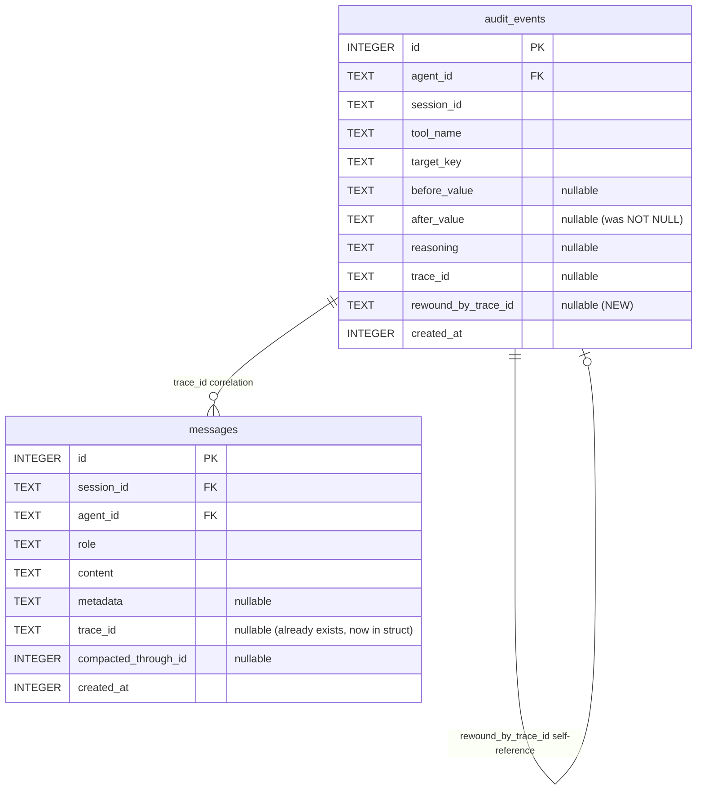

# feat: Add conversation rewind with memory reversal

## Overview

Add a rewind feature that deletes recent messages AND reverses the memory/fact changes those messages caused, using the `audit_events` table as an undo log. Triggered via TUI slash commands (`/undo`, `/rewind`) or dashboard "Rewind to here" button. Always shows a preview before executing. The audit trail is preserved — rewound events are marked with the rewind operation's trace_id, not deleted.

## Problem Statement

During development and testing, deleting recent messages leaves Mika with knowledge from conversations that no longer exist. Memory state and message state diverge. There is no way to "try again" from an earlier point without manually cleaning up the database.

The `audit_events` table already stores `before_value`/`after_value` for every memory mutation with `trace_id` correlation to messages — this is effectively an undo log. The rewind feature reads this log in reverse to restore previous state.

## Proposed Solution

Four implementation phases (see brainstorm: `docs/brainstorms/2026-03-11-conversation-rewind-brainstorm.md`):

1. **Phase 1: Audit trail completeness** — Fix `store_fact` to capture `before_value` for upserts, schema v9 migration
2. **Phase 2: Reversal engine** — Core `rewind_to()` function with preview/execute modes
3. **Phase 3: TUI commands** — `/undo` and `/rewind` slash commands with confirmation
4. **Phase 4: Dashboard + API** — Server endpoint + dashboard "Rewind to here" button

## Technical Approach

### Phase 1: Audit Trail Completeness + Schema v9

**Goal:** Ensure every memory mutation has complete before/after values, and the schema supports rewind metadata.

#### 1a. Fix `store_fact` before_value capture

Files: `crates/mika-agent/src/tools/store_fact.rs`

For each category, read existing state before the upsert and pass as `before_value`:

- **Person** (line ~136): Before calling `upsert_person`, query `get_person_by_name(agent_id, name)`. If exists, serialize current `{name, relationship, notes, mention_count}` as JSON `before_value`. If not exists, pass `None` (creation — reversal = delete).
- **Preference** (line ~264): Before calling `set_preference`, query `get_preference(agent_id, category)`. If exists, pass current value as `before_value`. If not exists, pass `None`.
- **Commitment** (line ~218): Always a creation (`None` before_value is correct). No fix needed.
- **Event** (line ~333): Always a creation (`None` before_value is correct). No fix needed.

The key distinction: `before_value = None` means "this was a creation — reversal = delete the record." `before_value = Some(...)` means "this was an update — reversal = restore to before_value."

#### 1b. Schema v9 migration

File: `crates/mika-agent/src/db.rs`

Single migration with three changes:

1. **Rebuild `audit_events`** to make `after_value` nullable (SQLite can't ALTER nullability — requires CREATE TABLE + INSERT INTO ... SELECT + DROP + RENAME pattern, same as v7→v8 tasks rebuild).
2. **Add `rewound_by_trace_id TEXT`** column to `audit_events` — nullable, references the rewind operation's trace_id.
3. **Add index** `idx_audit_rewound ON audit_events(rewound_by_trace_id) WHERE rewound_by_trace_id IS NOT NULL`.

Migration pattern (following v7→v8 in `db.rs` line 1032):
```sql
PRAGMA foreign_keys = OFF;
BEGIN IMMEDIATE;

DROP VIEW IF EXISTS unified_timeline;

CREATE TABLE audit_events_new (
    id INTEGER PRIMARY KEY AUTOINCREMENT,
    agent_id TEXT NOT NULL REFERENCES agents(id) ON DELETE CASCADE,
    session_id TEXT NOT NULL,
    tool_name TEXT NOT NULL,
    target_key TEXT NOT NULL,
    before_value TEXT,
    after_value TEXT,              -- was NOT NULL, now nullable
    reasoning TEXT,
    trace_id TEXT,
    rewound_by_trace_id TEXT,      -- new column
    created_at INTEGER NOT NULL DEFAULT (unixepoch())
);

INSERT INTO audit_events_new (id, agent_id, session_id, tool_name, target_key,
    before_value, after_value, reasoning, trace_id, created_at)
SELECT id, agent_id, session_id, tool_name, target_key,
    before_value, after_value, reasoning, trace_id, created_at
FROM audit_events;

DROP TABLE audit_events;
ALTER TABLE audit_events_new RENAME TO audit_events;

-- Recreate existing indexes
CREATE INDEX idx_audit_agent_created ON audit_events(agent_id, created_at);
CREATE INDEX idx_audit_session ON audit_events(session_id);
CREATE INDEX idx_audit_trace ON audit_events(trace_id) WHERE trace_id IS NOT NULL;
-- New index
CREATE INDEX idx_audit_rewound ON audit_events(rewound_by_trace_id)
    WHERE rewound_by_trace_id IS NOT NULL;

-- Recreate unified_timeline VIEW (same definition + rewound_by_trace_id if needed)

INSERT INTO schema_version (version) VALUES (9);
COMMIT;
PRAGMA foreign_keys = ON;
```

#### 1c. Update `AuditEvent` struct

File: `crates/mika-agent/src/db.rs` (line 218)

Add missing fields to the struct:
```rust
pub struct AuditEvent {
    pub id: i64,
    pub agent_id: String,              // add — needed for scoping
    pub session_id: String,
    pub tool_name: String,
    pub target_key: String,
    pub before_value: Option<String>,
    pub after_value: Option<String>,   // was String, now Option<String>
    pub reasoning: Option<String>,
    pub trace_id: Option<String>,      // add — needed for trace correlation
    pub rewound_by_trace_id: Option<String>,  // add — rewind marker
    pub created_at: String,
}
```

Update `log_audit_event` signature: `after_value: Option<&str>` (was `&str`).

#### 1d. Add `trace_id` to `SessionMessage`

File: `crates/mika-agent/src/db.rs` (line 160)

```rust
pub struct SessionMessage {
    pub id: i64,
    pub session_id: String,
    pub agent_id: String,
    pub role: String,
    pub content: String,
    pub channel_type: String,
    pub metadata: Option<String>,
    pub trace_id: Option<String>,   // add
    pub created_at: i64,
}
```

Update `row_to_session_message` to SELECT and map `trace_id`. Audit all callers of this function for column index shifts.

#### 1e. Tests for Phase 1

- Test `store_fact` person upsert captures `before_value` (create vs. update paths)
- Test `store_fact` preference upsert captures `before_value`
- Test schema v9 migration preserves all existing data
- Test `AuditEvent` struct serialization with nullable `after_value`
- Test `SessionMessage` includes `trace_id`

---

### Phase 2: Reversal Engine

**Goal:** Core `rewind_to()` function that previews and executes rewinds transactionally.

#### 2a. New DB methods

File: `crates/mika-agent/src/db.rs`

**Queries:**
```rust
// Batch query audit events by trace_ids, ordered by id DESC (not created_at —
// handles same-second events correctly)
fn get_audit_events_by_trace_ids(&self, agent_id: &str, trace_ids: &[&str])
    -> Result<Vec<AuditEvent>>
// SQL: SELECT * FROM audit_events
//      WHERE agent_id = ?1 AND trace_id IN (...)
//      AND rewound_by_trace_id IS NULL
//      ORDER BY id DESC

// Get messages after a given message ID within a session
fn get_messages_after(&self, agent_id: &str, session_id: &str, after_id: i64)
    -> Result<Vec<SessionMessage>>
// SQL: SELECT ... FROM messages WHERE agent_id = ?1 AND session_id = ?2 AND id > ?3
//      ORDER BY id ASC

// Get compaction boundary for a session
fn get_compaction_boundary(&self, agent_id: &str) -> Result<Option<i64>>
// SQL: SELECT compacted_through_id FROM messages
//      WHERE agent_id = ?1 AND role = 'summary'
//      ORDER BY id DESC LIMIT 1
```

**Mutations:**
```rust
// Delete messages after a given ID in a session
fn delete_messages_after(&self, agent_id: &str, session_id: &str, after_id: i64)
    -> Result<usize>  // returns count deleted

// Mark audit events as rewound
fn mark_audit_events_rewound(&self, trace_ids: &[&str], rewind_trace_id: &str)
    -> Result<usize>

// Delete a person by canonical_name (sets person_id = NULL on linked commitments first)
fn delete_person(&self, agent_id: &str, canonical_name: &str) -> Result<bool>

// Delete a preference by category
fn delete_preference(&self, agent_id: &str, category: &str) -> Result<bool>

// Delete a commitment by description (from target_key parsing)
fn delete_commitment(&self, agent_id: &str, description: &str) -> Result<bool>

// Delete an event by description (from target_key parsing)
fn delete_event(&self, agent_id: &str, description: &str) -> Result<bool>
```

**Person deletion FK strategy:** Before deleting a person, `UPDATE commitments SET person_id = NULL WHERE person_id = (SELECT id FROM people WHERE agent_id = ?1 AND canonical_name = ?2)`. This preserves commitments but unlinks them from the deleted person.

All delete methods also call `delete_search_content(source_type, source_id)` to clean up FTS5 + embeddings.

#### 2b. Exchange definition

An **exchange** = all messages sharing the same `trace_id`, anchored by a `role='user'` message. This groups a user message + all tool calls + assistant response as one unit. System-initiated turns (heartbeat, reflection) have their own trace_ids and count as separate exchanges.

For `/undo`: find the most recent user-role message's `trace_id`, collect all messages with that trace_id.
For `/rewind N`: find the N most recent distinct `trace_id` values from user-role messages, collect all messages with those trace_ids.

Messages with `trace_id = NULL` (pre-v5 migration) cannot be grouped — rewind refuses with an error if the target range includes NULL trace_ids.

#### 2c. Reversal engine core

File: `crates/mika-agent/src/rewind.rs` (new module)

```rust
pub struct RewindPreview {
    pub messages_to_delete: Vec<MessagePreview>,  // id, role, content snippet
    pub reversals: Vec<ReversalPreview>,           // what will be restored/deleted
    pub warnings: Vec<String>,                     // irreversible side effects
    pub blocked: bool,                             // true if rewind cannot proceed
    pub block_reason: Option<String>,              // why blocked
}

pub struct ReversalPreview {
    pub audit_event_id: i64,
    pub tool_name: String,
    pub target_key: String,
    pub action: ReversalAction,
    pub current_value: Option<String>,  // what's in DB now
    pub restore_to: Option<String>,     // what it will be restored to
}

pub enum ReversalAction {
    Restore,  // update: restore before_value
    Delete,   // creation: delete the created record
    Reinsert, // deletion: re-insert from before_value
    Skip,     // cannot reverse (missing data)
}

pub struct RewindResult {
    pub messages_deleted: usize,
    pub reversals_applied: usize,
    pub reversals_skipped: usize,
    pub warnings: Vec<String>,
    pub trace_id: String,  // this rewind operation's trace_id
}

/// Preview a rewind operation without executing it.
pub async fn preview_rewind(
    db: &AsyncDatabase,
    session_id: &str,
    after_message_id: i64,
) -> Result<RewindPreview>

/// Execute a rewind operation in a single transaction.
/// Requires agent to be idle (caller must hold agent_lock or verify idle state).
pub async fn execute_rewind(
    db: &AsyncDatabase,
    session_id: &str,
    after_message_id: i64,
    embedding_client: Option<&EmbeddingClient>,
) -> Result<RewindResult>
```

**Transaction strategy:** The entire rewind executes in a single `AsyncDatabase` closure (same pattern as `replace_with_summary`):
1. BEGIN IMMEDIATE
2. For each audit event (by `id DESC`): apply reversal
3. Delete messages
4. Mark audit events as rewound
5. Log rewind audit event
6. COMMIT

If any step fails, ROLLBACK. The caller gets an error, DB state is unchanged.

**Reversal dispatch** (inside the transaction, by `tool_name` + `target_key` parsing):

| tool_name | target_key pattern | before_value | Action |
|---|---|---|---|
| `update_core_memory` | section name | `Some(v)` | `set_core_memory(section, v)` |
| `store_fact` | `person:{name}` | `None` | `delete_person(name)` |
| `store_fact` | `person:{name}` | `Some(json)` | Restore person fields from JSON |
| `store_fact` | `preference:{key}` | `None` | `delete_preference(key)` |
| `store_fact` | `preference:{key}` | `Some(v)` | `set_preference(key, v)` |
| `store_fact` | `commitment:{desc}` | `None` | `delete_commitment(desc)` |
| `store_fact` | `event:{desc}` | `None` | `delete_event(desc)` |
| `update_fact` | `commitment:{id}` | `Some(status)` | Restore commitment status |
| `update_work_item_status` | task key | `Some(status)` | Restore task status (if not actioned) |
| `create_work_item` | task key | `None` | Cancel task (if actioned) or delete |
| `create_reminder` | task key | `None` | Cancel task (if actioned) or delete |

**"Actioned" task guard:** A task is actioned if `status IN ('completed', 'delivered', 'failed', 'expired')` OR it has child tasks. Actioned tasks are cancelled (not deleted) and flagged as a warning in the preview.

**Missing target handling:** If a reversal target no longer exists (e.g., person already deleted by a previous rewind), skip with a warning. Do not fail the transaction.

#### 2d. Search index re-indexing

After the transaction commits, run post-rewind cleanup:
- For each deleted fact: `delete_search_content(source_type, source_id)` — already handled inside delete methods.
- For each restored fact: `index_fact(ctx, source_type, source_id, restored_content)` — re-index with the restored value.
- Embedding re-generation is best-effort (requires `embedding_client`). If unavailable, FTS5 is updated but vector search may be stale.

#### 2e. Boundary checks

Before preview or execute:
1. **Compaction boundary:** Query `get_compaction_boundary()`. If `after_message_id <= compacted_through_id`, refuse with error: "Cannot rewind past compaction boundary (message {id} has been compacted)."
2. **NULL trace_ids:** If any messages in the rewind range have `trace_id IS NULL`, refuse: "Cannot rewind messages without trace_id (pre-migration messages)."
3. **Pruned audit events:** If messages have trace_ids but no matching audit_events exist, warn: "Audit events for some turns have been pruned. Memory changes from those turns cannot be reversed." Allow proceed with message deletion only.
4. **Team session guard:** If any messages in the range belong to a session with `channel_type = 'team'`, refuse: "Cannot partially rewind a team session. Use team management tools instead."

#### 2f. Concurrency

- **TUI:** `/undo` and `/rewind` are only available when `app.status == AgentStatus::Idle`. The TUI is single-threaded with the agent — no lock needed, just a status check.
- **Server/Dashboard:** The rewind endpoint MUST acquire `agent_lock` (same `Arc<Mutex>` as `/message`). Return `409 Conflict` if agent is busy (not 429 — rewind is a different operation than message processing).
- **Silent mode:** If a heartbeat/reflection task is running, `agent_lock` is held. Rewind will get 409. This is correct — don't rewind while the agent is actively modifying memory.

#### 2g. Irreversible side effects (warnings in preview)

The preview scans message content and metadata for:
- **Outbound messages:** If `tool_name = 'send_message'` appears in audit events or message metadata, warn: "A message was sent to the user via Telegram during this turn. It cannot be unsent."
- **File writes:** If `tool_name = 'write_file'` or `'write_workspace'` appears, warn: "Files were written during this turn. They will not be reverted."
- **External API calls:** If exec handler tools ran, warn generically: "External actions were performed during this turn. They cannot be reversed."

#### 2h. Explicit non-goals

- **No redo.** Rewind is one-way. The deleted messages are gone. The rewind itself is logged as an audit event for forensics.
- **No cross-session rewind.** Rewind is scoped to the current session. Messages from prior sessions are not affected.
- **No file reversal.** File writes are not tracked in audit_events with before/after values.
- **No `mention_count` / `first_mentioned` / `last_mentioned` reversal.** These person metadata fields are not captured in audit events. Accepted fidelity loss.

#### 2i. Tests for Phase 2

- Test rewind of a single exchange (create person → rewind → person deleted)
- Test rewind of multiple exchanges (3 exchanges with mixed mutations)
- Test reverse chronological ordering (two core_memory edits in sequence)
- Test compaction boundary refusal
- Test NULL trace_id refusal
- Test actioned task cancellation (not deletion)
- Test person deletion with linked commitments (FK handling)
- Test preference upsert reversal (restore to before_value)
- Test missing target skip (person already deleted)
- Test empty rewind (no messages after target ID)
- Test rewind audit event is logged with correct trace_id
- Test `rewound_by_trace_id` is set on reversed audit events
- Test transaction rollback on failure

---

### Phase 3: TUI Slash Commands

**Goal:** `/undo` and `/rewind` commands with confirmation flow.

#### 3a. Command registration

File: `crates/mika-cli/src/tui/commands/mod.rs`

Add to `COMMANDS` array:
```rust
SlashCommand {
    name: "undo",
    aliases: &[],
    description: "Undo last exchange and reverse memory changes",
    args_hint: None,
    completer: None,
},
SlashCommand {
    name: "rewind",
    aliases: &[],
    description: "Rewind conversation and reverse memory changes",
    args_hint: Some("<N> or to <message_id>"),
    completer: None,  // no tab completion for numeric args
},
```

Do NOT add to `TEAM_MODE_ALLOWED_COMMANDS` — rewind is agent-specific.

#### 3b. Command handlers

File: `crates/mika-cli/src/tui/commands/handlers.rs`

**`/undo` handler:**
1. Check `app.status == AgentStatus::Idle`. If not, return "Cannot undo while agent is running."
2. Find the most recent user-role message's `trace_id` in `app.messages`.
3. Find the message ID just before that exchange (the rewind anchor point).
4. Call `preview_rewind(db, session_id, anchor_id)`.
5. Display preview in the TUI as a system message.
6. Prompt for confirmation (reuse the pattern from other interactive commands, or add a simple y/N input mode).
7. On confirm: call `execute_rewind(...)`. Display result summary. Refresh `app.messages` from DB.
8. On decline: display "Undo cancelled."

**`/rewind` handler:**
1. Parse args: `"3"` → rewind 3 exchanges. `"to 42"` → rewind to message ID 42.
2. For numeric N: find the Nth most recent distinct `trace_id` from user-role messages. Compute the anchor point.
3. For `to <id>`: validate the message ID exists in the current session and is above the compaction boundary.
4. Same preview → confirm → execute flow as `/undo`.

**Confirmation UX:** Display the preview as a formatted system message. Set `app.status` to a new `AgentStatus::AwaitingConfirmation` state (or reuse input mode). The next Enter press with "y" or "Y" executes; anything else cancels. This is similar to how `write_file` overwrite confirmation works in the agent — but here it's in the TUI layer.

**Post-rewind display refresh:** After a successful rewind:
1. Reload `app.messages` from `db.load_recent_messages(agent_id, limit)`.
2. Reset scroll position to bottom.
3. Display "Rewound N exchanges. M memory changes reversed." as a system message.

#### 3c. Message ID discoverability

For `/rewind to <id>`, users need to know message IDs. Add a `/messages` slash command (or enhance the existing message display) that shows the last N messages with their database IDs:

```
/messages
  [42] user: What's my schedule?
  [43] assistant: Let me check... (3 tool calls)
  [44] user: Remember that Sarah likes coffee
  [45] assistant: I've noted that Sarah likes coffee.
```

Alternatively, the TUI could show message IDs in a gutter when in "rewind mode" — but the `/messages` command is simpler for Phase 3.

#### 3d. Tests for Phase 3

- Test `/undo` with no messages (error message)
- Test `/undo` while agent is running (error message)
- Test `/rewind 3` with only 2 exchanges (rewinds 2, warns)
- Test `/rewind to <id>` with invalid ID (error)
- Test `/rewind to <id>` past compaction boundary (error)
- Test confirmation flow (y/N)
- Test display refresh after rewind

---

### Phase 4: Dashboard + Server API

**Goal:** REST API for rewind + dashboard "Rewind to here" button.

#### 4a. Server endpoints

File: `crates/mika-agent/src/server/mod.rs`, `crates/mika-agent/src/server/dashboard.rs`

Two-phase API:

```
POST /api/v1/rewind/preview
  Body: { "session_id": "...", "after_message_id": 42 }
  Auth: MIKA_INTERNAL_TOKEN only (mutation operation)
  Response 200: RewindPreview JSON
  Response 409: Agent busy
  Response 422: Validation error (compaction boundary, NULL trace_ids, etc.)

POST /api/v1/rewind/execute
  Body: { "session_id": "...", "after_message_id": 42 }
  Auth: MIKA_INTERNAL_TOKEN only
  Response 200: RewindResult JSON
  Response 409: Agent busy
  Response 422: Validation error
```

Both endpoints acquire `agent_lock` via `try_lock`. Return 409 if busy.

**Auth decision:** Rewind is a destructive mutation. Use `MIKA_INTERNAL_TOKEN` only (same auth level as `/message` and `/tasks/{id}/complete`). The dashboard token alone is insufficient — this prevents read-only dashboard users from destroying data.

**Note:** The dashboard frontend will need to use `MIKA_INTERNAL_TOKEN` (or a separate admin token) to call rewind endpoints. If the dashboard should support rewind, consider adding a `MIKA_ADMIN_TOKEN` or a role-based auth system in a future iteration. For now, rewind via dashboard requires the internal token.

#### 4b. Dashboard UI

File: `dashboard/src/` (React components)

On the Sessions/Messages page:
1. Each message row gets a hover action: "Rewind to here" button (only visible when message is not the latest).
2. Clicking opens a confirmation modal that calls `POST /api/v1/rewind/preview`.
3. Modal displays the preview: messages to delete, memory changes to reverse, warnings.
4. "Confirm Rewind" button calls `POST /api/v1/rewind/execute`.
5. On success: refresh the message list, show a toast notification with the summary.
6. On 409: show "Agent is busy. Try again when idle."
7. On 422: show the validation error message.

#### 4c. Tests for Phase 4

- Test preview endpoint returns correct structure
- Test execute endpoint performs rewind
- Test 409 when agent is busy
- Test 422 for compaction boundary
- Test auth rejection with dashboard-only token

## System-Wide Impact

### Interaction Graph

Rewind touches: `messages` table (delete), `audit_events` (read + mark rewound), `core_memory` (restore), `people` (restore/delete), `commitments` (restore status / unlink person_id), `preferences` (restore/delete), `events` (delete), `tasks` (cancel/delete), `search_content` + `fts_search` + `content_embeddings` (cleanup/re-index). The `unified_timeline` VIEW reflects all changes automatically.

### Error Propagation

All rewind operations run in a single SQLite transaction. On any error → full ROLLBACK → no partial state. The caller receives an `anyhow::Error`. Server returns 500 with opaque message. TUI shows error as system message.

### State Lifecycle Risks

- **Partial failure:** Mitigated by single transaction. Either everything is rewound or nothing.
- **FK orphans:** Person deletion sets `commitments.person_id = NULL` first. No cascade deletes.
- **Search index staleness:** Post-transaction re-indexing is best-effort. If embedding generation fails, FTS5 is still cleaned up.
- **Concurrent modification:** `agent_lock` prevents concurrent agent runs during rewind.

### API Surface Parity

- TUI: `/undo`, `/rewind` slash commands
- Server: `POST /api/v1/rewind/preview`, `POST /api/v1/rewind/execute`
- Dashboard: "Rewind to here" button (calls server API)
- No Telegram support (rewind is a developer/admin action, not end-user)

### Integration Test Scenarios

1. Full cycle: user sends message → agent creates person + preference → `/undo` → person and preference deleted, messages gone, audit events marked rewound.
2. Multi-exchange rewind: 3 exchanges with progressive core_memory edits → `/rewind 3` → core_memory restored to state before all 3 exchanges.
3. Actioned task guard: agent creates reminder → reminder fires → `/undo` → reminder cancelled (not deleted), warning shown.
4. Compaction boundary: compact messages → try `/rewind` past boundary → clear error.
5. Dashboard rewind while agent is idle → success. While agent is busy → 409.

## Acceptance Criteria

### Functional Requirements

- [x] `store_fact` captures `before_value` for person and preference upserts (`crates/mika-agent/src/tools/store_fact.rs`)
- [x] Schema v9 migration: `after_value` nullable, `rewound_by_trace_id` column (`crates/mika-agent/src/db.rs`)
- [x] `AuditEvent` struct includes `agent_id`, `trace_id`, `rewound_by_trace_id` (`crates/mika-agent/src/db.rs`)
- [x] `SessionMessage` struct includes `trace_id` (`crates/mika-agent/src/db.rs`)
- [x] Reversal engine: `preview_rewind()` and `execute_rewind()` functions (`crates/mika-agent/src/rewind.rs`)
- [x] Rewind executes in a single SQLite transaction with full rollback on error
- [x] Reversals applied in reverse chronological order (by `audit_events.id DESC`)
- [x] Person deletion unlinks commitments (`person_id = NULL`) before delete
- [x] Actioned tasks cancelled, not deleted
- [x] Compaction boundary check prevents rewind past compacted messages
- [x] NULL trace_id check prevents rewind of pre-migration messages
- [ ] Team session guard prevents partial team rewinds
- [x] Rewind logged as audit_event with its own trace_id
- [x] Rewound audit events marked with `rewound_by_trace_id`
- [x] `/undo` TUI command works (`crates/mika-cli/src/tui/commands/`)
- [x] `/rewind N` TUI command works
- [x] `/rewind to <id>` TUI command works
- [x] Preview shown before execution (displayed inline, no confirmation prompt)
- [x] TUI message display refreshes after rewind
- [x] `POST /api/v1/rewind/preview` endpoint (`crates/mika-agent/src/server/`)
- [x] `POST /api/v1/rewind/execute` endpoint
- [ ] Dashboard "Rewind to here" button (`dashboard/src/`) — deferred to follow-up
- [x] 409 response when agent is busy
- [x] Search indexes cleaned up after fact deletion
- [ ] Search indexes re-built after fact restoration — deferred (FTS cleanup done, embedding re-index is best-effort)

### Non-Functional Requirements

- [x] Rewind of 10 exchanges completes in < 2 seconds
- [x] No data loss on rewind failure (transaction rollback)
- [x] Rewind cannot be triggered by the agent itself (user-initiated only)

### Quality Gates

- [x] Unit tests for reversal engine (all mutation types, boundary cases, FK handling)
- [x] Integration test for full rewind cycle (message → mutation → rewind → verify state)
- [ ] `cargo clippy` clean
- [ ] `cargo test` passes (~1134+ tests)

## Dependencies & Prerequisites

1. **No external dependencies.** All changes are within existing crates.
2. **Schema v9 migration must land before reversal engine** (Phase 1 before Phase 2).
3. **`store_fact` before_value fix should land with or before schema migration** — existing audit events without before_value are not retroactively fixable, but new events will be correct.

## Risk Analysis & Mitigation

| Risk | Impact | Mitigation |
|---|---|---|
| `before_value` capture adds latency to `store_fact` | Low — one extra SELECT per store | SELECT is on indexed columns, sub-ms |
| Schema v9 migration corrupts data | High | Transaction-wrapped, tested. Backup DB before migration. |
| `SessionMessage` trace_id addition breaks callers | Medium | Column is appended, not inserted. Audit all `row_to_session_message` callers. |
| Rewind deletes messages that compaction later references | Low | Compaction checks message count, rewind reduces it. No conflict. |
| Preference `source_id` instability in search index | Medium | Use `(agent_id, category)` composite key for preference search cleanup, not `last_insert_rowid`. |

## ERD: Schema Changes



## Sources & References

### Origin

- **Brainstorm document:** [docs/brainstorms/2026-03-11-conversation-rewind-brainstorm.md](docs/brainstorms/2026-03-11-conversation-rewind-brainstorm.md) — Key decisions carried forward: fix audit trail first, make `after_value` nullable, add `rewound_by_trace_id`, single v8→v9 migration, reverse chronological ordering.

### Internal References

- Schema migration pattern: `crates/mika-agent/src/db.rs` (v7→v8 at line ~1032)
- `log_audit_event`: `crates/mika-agent/src/db.rs` (line ~2669)
- `store_fact` tool: `crates/mika-agent/src/tools/store_fact.rs`
- `update_core_memory` tool: `crates/mika-agent/src/tools/update_core_memory.rs` (before_value pattern)
- Compaction: `crates/mika-agent/src/compaction.rs`
- TUI commands: `crates/mika-cli/src/tui/commands/mod.rs`, `handlers.rs`
- Server routes: `crates/mika-agent/src/server/mod.rs`, `dashboard.rs`
- `delete_search_content`: `crates/mika-agent/src/db.rs` (line ~3378)

### Learnings Applied

- Transaction safety: wrap multi-table mutations in BEGIN/COMMIT (from `docs/solutions/database-issues/consolidate-per-agent-team-dbs-into-single-container-db.md`)
- Agent-ID scoping: don't filter by agent_id in parent-child traversals (from `docs/solutions/database-issues/team-task-child-wrong-agent-id.md`)
- Duplicate prevention: check existence before restoring facts (from `docs/solutions/logic-errors/agent-creates-duplicates-after-compaction.md`)
