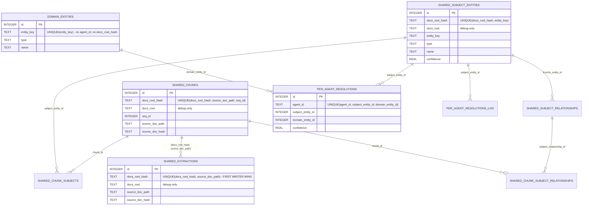

# feat(kg): schema v27 — docs_root_hash as shared-corpus primary key (T-A)

## Overview

Today 11 mika agents share a single hardcoded `docs_root` but each runs KG extraction independently, producing N× duplicate rows on the shared-corpus layer (`kg_chunks`, `kg_subject_entities`, `kg_subject_relationships`, `kg_chunk_subjects`, `kg_chunk_subject_relationships`, `kg_extractions`). This plan bumps the database schema from v26 to v27 by changing the primary-key scope of those six tables from `agent_id` to `docs_root_hash = sha256(fs::canonicalize(docs_root))[:16]`. Subject entities, chunks, and extractions become shared; resolutions stay per-agent; domain-graph tables stay unchanged. The Rust column constants, `LexicalIngestor` / `SubjectExtractor` write paths, the resolution joins, and the `query_knowledge_graph` read paths are all cut over in this plan. The data migration from v26 rows (coalesce by majority-vote) ships separately as **#787 (T-B)**.

## Problem Frame

**Cost side.** Extraction over the same ~2,400 chunks runs once per agent today. At 11 agents, that's 11× the LLM spend for identical output. But the cost story is secondary — the correctness story is primary.

**Correctness side.** Empirical drift measured at filing time (2026-04-24): 26–43 distinct entity names across 11 agents on the same doc — a ~65% spread. Each agent's graph is subtly different because LLM extraction is non-deterministic, even with `temperature=0` and identical prompts. An odds-engine agent answering a trading-strategy question can pull coherent context from platform-engineering entities that its own extraction happened to produce. Coherence borrowed from the wrong (or a drifted) corpus looks structurally right and is behaviorally wrong.

**Agent-agnostic extraction verified (2026-04-24).** `build_extraction_prompt(annotated_text: &str)` takes only text. The system prompt interpolates only `{approved_entity_types}`, which is global. `chunk_doc(text: &str) -> Vec<Chunk>` is pure. A grep across `crates/mika-agent/src/kg/` found zero agent-scoped template variables. So a shared subject graph is semantically clean — the drift is entropy, not intent.

**Scope of #786 alone.** Schema v27 DDL + Rust type updates + write/read path cut-over. The data migration from v26 rows to v27 (the coalesce SQL that preserves paid LLM output) is #787. The per-agent `docs_root` config read that enforces hard-error startup is #778. The CLI to manage post-v27 state is #779.

## Requirements Trace

- **R1.** Six shared-layer tables (`kg_chunks`, `kg_subject_entities`, `kg_subject_relationships`, `kg_chunk_subjects`, `kg_chunk_subject_relationships`, `kg_extractions`) are keyed by `docs_root_hash` in v27 — not `agent_id`.
- **R2.** Per-agent tables (`kg_subject_resolutions`, `kg_resolutions_log`) keep `agent_id`.
- **R3.** Domain tables (`kg_entities`, `kg_relationships`) unchanged.
- **R4.** `docs_root_hash` computation: `sha256(fs::canonicalize(docs_root))[:16]` — 16 hex chars = 64 bits. Per-host stability only. Lives in a `pub fn hash_docs_root(path: &Path) -> String` that #778 can also call.
- **R5.** Every shared-layer table carries a `docs_root TEXT` debug column next to `docs_root_hash`. Hash is the unique key; text is advisory.
- **R6.** `UNIQUE(docs_root_hash, source_doc_path)` on `kg_extractions` with first-writer-wins semantics (`INSERT OR IGNORE`, not `ON CONFLICT DO UPDATE`).
- **R7.** `CURRENT_SCHEMA_VERSION` bumps from 26 to 27. `migrate_v26_to_v27()` method added; dispatch arm wired; clean-slate `migrate_v1()` produces v27 tables directly on fresh installs.
- **R8.** `KG_*_COLUMNS` constants in `db/kg_schema.rs` updated. Write paths (`lexical_ingestor.rs`, `subject_extractor.rs`) pass `docs_root_hash` instead of `agent_id`. Read paths (`query.rs`) join on `docs_root_hash` on shared-layer tables.
- **R9.** Schema convergence test: a fresh DB built via clean-slate `migrate_v1()` is structurally equal (PRAGMA introspection table-by-table) to a DB built by starting at v1 and running every incremental migration up to v27. Catches drift between clean-slate and upgrade paths.
- **R10.** Test fixture builder (`tests/eval/kg_fixtures/mod.rs`) is updated: `PINNED_SCHEMA_VERSION = 27`, seed SQL emits `docs_root_hash` on the six shared-layer tables.
- **R11.** Post-migration safety: a `schema_meta` table with a `v27_coalesce_complete` marker row, plus a startup guard in `Database::open()` that refuses to return a live `Database` handle when `schema_version == 27` and the marker is absent. (Guard pins to `== 27`, not `>= 27` — future v28 should carry its own marker + guard rather than inherit v27's; this prevents v27's error message from firing on future-incomplete-migration scenarios it has no business diagnosing.) `migrate_v1` writes the marker on fresh installs; `migrate_v26_to_v27` does NOT (it's #787's job to write it after coalesce). This is the primary safety against unplanned restarts between #786 merge and #787 merge.
- **R12.** Non-destructive migration: v26 shared-layer tables are renamed to `*_v26_backup` rather than dropped. v26 data is preserved untouched until #787's coalesce reads and drops the backups. This is the secondary safety — data recoverable even if the guard is bypassed.

## Scope Boundaries

- **Non-goal:** data migration from v26 rows to v27 (coalesce SQL). Owned by **#787 (T-B)**. #786 ships the migration method body with a TODO placeholder where #787's coalesce SQL will land.
- **Non-goal:** per-agent `docs_root` config read. Owned by **#778**. The hash function added here is callable from #778's per-agent resolver — that's the only coordination.
- **Non-goal:** KG CLI. Owned by **#779**.
- **Non-goal:** near-duplicate entity cleanup (e.g., "Kubernetes" vs "K8s"). Deliberately deferred — normalization is exact-match lowercase-trim only.
- **Non-goal:** backward compatibility. One-shot migration. SQLite transaction rollback is the only failure path.
- **Non-goal:** cross-host hash stability. `docs_root_hash` is per-host. `~/.mika/data/mika.db` is machine-local (same category as `~/.cache`). Documented as a comment on `hash_docs_root`.
- **Non-goal:** multi-path docs_root. Single `PathBuf`.

### Deferred to Separate Tasks

- Data coalesce SQL for v26 → v27 rows: **#787** (same milestone).
- Per-agent `docs_root` config with hard-error startup: **#778** (same milestone, blocked by this).
- Operator CLI for KG state (`mika kg status / purge / validate`): **#779** (same milestone, blocked by #778).

## Context & Research

### Relevant code and patterns

- **Schema version constant:** `crates/mika-agent/src/db.rs:27` — `pub const CURRENT_SCHEMA_VERSION: i64 = 26;`. Read by `Database::schema_version()`, then surfaced to `commands/status.rs`, `commands/doctor.rs`, and `tui/commands/handlers.rs`.
- **Migration dispatch:** `crates/mika-agent/src/db.rs:716-830` — a chained `if (3..=N).contains(&version) { self.migrate_vN_to_vN+1()?; info!(version = M, "..."); }` block. One arm per increment. #786 appends `if (3..=26).contains(&version) { self.migrate_v26_to_v27()?; info!(version = 27, "database migrated to v27"); }`.
- **v25→v26 idiom as template** (`crates/mika-agent/src/db.rs:2959-2979`): `execute_batch` with `BEGIN IMMEDIATE; ... COMMIT;`, idempotent via `column_exists` guard. This plan's migration is larger (multi-table rebuild) and uses the same transaction shape but gets its own idempotency via the "check for docs_root_hash column existence on kg_chunks" guard.
- **v24→v25 (KG table creation) as precedent:** `crates/mika-agent/src/db.rs:2788-2957` — 170 lines inline, `CREATE TABLE IF NOT EXISTS`, `CREATE INDEX IF NOT EXISTS`, FKs inline (`REFERENCES kg_entities(id) ON DELETE CASCADE`). Plan's v27 rebuild will be comparably sized.
- **Clean-slate fresh-install DDL:** `crates/mika-agent/src/db.rs:1288-1386` — six shared-layer KG tables defined here, plus the `INSERT INTO schema_version (version) VALUES (26);` seed at line 885. Both update sites land in the cutover unit.
- **Column constants:** `crates/mika-agent/src/db/kg_schema.rs:127-164` — `KG_CHUNK_COLUMNS`, `KG_SUBJECT_ENTITY_COLUMNS`, `KG_SUBJECT_RELATIONSHIP_COLUMNS`, `KG_CHUNK_SUBJECT_COLUMNS`, `KG_CHUNK_SUBJECT_RELATIONSHIP_COLUMNS`, `KG_EXTRACTION_COLUMNS`. Each currently contains `"agent_id"`; each gets swapped to `"docs_root_hash, docs_root"` in the cutover. `KG_SUBJECT_RESOLUTION_COLUMNS` and `KG_RESOLUTION_LOG_COLUMNS` stay as-is (per-agent).
- **Idempotency-key doc block:** `crates/mika-agent/src/db/kg_schema.rs:55-93` — documents the `kg_extractions` primary-key contract. Rewrite to reference `(docs_root_hash, source_doc_path)` as the new unique key and "first-writer-wins" as the conflict semantics.
- **Write-path call graph:** `agent_id` flows via `AsyncDatabase::agent_id: String` (`crates/mika-agent/src/async_db.rs:31`). Callers clone `self.db.agent_id` inside write closures. No struct carries `pub agent_id` on shared-layer rows — rows are read positionally (`row.get(0)`) so no `#[serde(rename)]` surgery needed.
- **Write sites to update:**
  - `crates/mika-agent/src/kg/lexical_ingestor.rs:310-321` — `kg_chunks` INSERT inside `ingest_single_doc_inner()`. `docs_root_hash` derived once at `LexicalIngestor::new`, passed through.
  - `crates/mika-agent/src/kg/subject_extractor.rs:1015-1180` — five INSERTs (`kg_subject_entities`, `kg_chunk_subjects`, `kg_subject_relationships`, `kg_chunk_subject_relationships`, `kg_extractions`). All get the `docs_root_hash` cut-over. The `kg_extractions` ON-CONFLICT shape changes from `DO UPDATE SET ...` to `OR IGNORE` for first-writer-wins.
  - `crates/mika-agent/src/kg/entity_resolver.rs:886, 932` — `kg_subject_resolutions` and `kg_resolutions_log` INSERTs stay agent-keyed. No changes.
- **Constructor signatures to update:**
  - `LexicalIngestor::new(db, docs_root, trace_id)` at `kg/lexical_ingestor.rs:88` — already takes `docs_root`. Add internal derivation of `docs_root_hash` at construction time.
  - `IngestionOrchestrator::new(db, docs_root, extraction_llm, resolution_llm, resolution_budget, trace_id, session_id)` at `kg/ingestion_orchestrator.rs:66-74` — same.
  - `SubjectExtractor::new(db, llm, docs_root, trace_id)` at `kg/subject_extractor.rs:393` — same.
  - `SubjectEntityResolver::new(db, llm, trace_id)` at `kg/entity_resolver.rs:160` — unchanged (resolutions stay agent-keyed).
- **Server callers:** `crates/mika-agent/src/server/mod.rs:787, 851, 973` — startup loop iterating `for (agent_name, agent_state) in &agents`. Passes the shared `docs_root.clone()` to each agent's KG constructors. After #738 lands, `docs_root` is sourced via `kg::config::resolve_kg_docs_root(&settings)`; this plan assumes that convention is already in place.
- **Read sites to update** (all in `crates/mika-agent/src/kg/query.rs`):
  - `:588-598` — semantic path C chunk-subjects join, currently filters by `cs.agent_id = ?`. Becomes `cs.docs_root_hash = ?`.
  - `:675-683` — subject→domain resolver. The `kg_subject_resolutions.agent_id = ?` predicate STAYS (per-agent). The join onto `kg_subject_entities` now effectively scoped by the resolver's upstream query, which must include `docs_root_hash`.
  - `:359, 515, 918, 991` — additional `agent_id = ?` predicates on shared-layer tables. All cut over to `docs_root_hash = ?`.
  - `:1193-1204` — chunk-prose join for context enrichment. `cs.agent_id = ?` → `cs.docs_root_hash = ?`.
- **Test fixture:** `crates/mika-agent/tests/eval/kg_fixtures/mod.rs:25` — `const PINNED_SCHEMA_VERSION: i32 = 26;`. Bumps to 27 in cutover. Seed SQL for `seed_chunk`, `seed_subject_entity`, `seed_chunk_subject`, `seed_resolution` updates to emit `docs_root_hash` + `docs_root` on shared-layer inserts. Downstream tests at `crates/mika-agent/tests/eval/kg_self_knowledge/*.rs` keep compiling if the fixture API surface stays stable (callers don't touch `agent_id` → `docs_root_hash` mechanically).

### Institutional learnings

- **`docs/solutions/workflow-issues/kg-milestone-14-autonomous-execution-retrospective-2026-04-22.md`** — Milestone #14 playbook. Direct lineage for this milestone. Establishes: *merge all PRs in milestone, deploy once at close*. Applies literally to #786/#787 sequencing — #786 cannot deploy alone; the deploy happens after #787 (and ideally after #778 + #779 too).
- **`docs/solutions/database-issues/kg-schema-three-layer-sqlite-design.md`** — v25 migration structure. `migrate_vN_to_vN+1()` lives in `db.rs`, column constants live in `db/kg_schema.rs`, schema convergence test is mandatory. Explicitly documents v25's D1 decision ("agent_id on shared-layer tables") — this plan reverses that decision for the shared subset; the plan must cite and amend D1, not silently override it.
- **`docs/solutions/best-practices/first-boot-cost-spike-after-tracking-table-migration-2026-04-23.md`** — **Migration immutability rule**: historical migrations are frozen. `migrate_v25_to_v26` must NOT be edited retroactively; all v27 changes live in `migrate_v26_to_v27` alone, and `migrate_v1`'s clean-slate updates to reflect v27. Also: names the "first-boot" state risk — when #786 merges, the first fresh clone that runs `migrate_v26_to_v27` produces empty v27 tables (stubbed coalesce). #787 fills in the actual coalesce SQL. Since neither has deployed to prod during this milestone, #787 can still edit `migrate_v26_to_v27`'s body without violating immutability.
- **`docs/solutions/database-issues/iso8601-timestamp-migration.md`** — closest structural analog for this plan: a prior "rewrite primary key across many tables" migration covering 17 tables. Key rules: SQLite does NOT support `ALTER COLUMN`; use the table-rebuild pattern (create `_new`, INSERT SELECT enumerated columns, DROP old, RENAME new). Bracket with `PRAGMA foreign_keys = OFF; BEGIN IMMEDIATE; ...; COMMIT; PRAGMA foreign_keys = ON;`. NEVER `SELECT *` in migration copy steps — enumerate columns. Post-migration check with `SELECT typeof(col), col FROM table LIMIT 10`. This plan mirrors that shape for its six shared-layer tables.
- **`docs/solutions/best-practices/kg-lexical-ingestion-composed-write-2026-04-22.md`** — shared-write contract precedent. Uses content-hash idempotency + single-transaction composed writes. The new `UNIQUE(docs_root_hash, source_doc_path)` on `kg_extractions` with `INSERT OR IGNORE` mirrors this exactly — first-writer-wins, no UPDATE, subsequent agents' attempts no-op.
- **`docs/solutions/best-practices/socratic-multi-ticket-milestone-planning-2026-04-21.md`** — reinforces the "amend earlier tickets, don't fork v28" rule. If #787 planning surfaces a gap in #786, amend #786's plan or migration method while the branch is still open — don't file a v28 follow-up.
- **`docs/solutions/best-practices/kg-subject-extraction-constrained-ner-2026-04-22.md`** — documents the existing `INSERT ... ON CONFLICT DO UPDATE` pattern in `subject_extractor.rs`. For `kg_extractions` specifically, this plan REPLACES that with `INSERT OR IGNORE` to match the shared first-writer-wins contract. The other four shared-layer tables keep `ON CONFLICT DO UPDATE` (merging extractor output across agents on overlap is fine — they wrote the same extraction result, and the UPDATE is idempotent).

## Key Technical Decisions

- **Deployment coordination: Option (c) — runtime startup guard is the default, not a fallback.** The "Vincent's discipline" safety in Option (b) doesn't cover the real failure mode. The real failure mode is not "Vincent forgets and runs `make deploy`." It is "an unrelated event restarts the service" — package upgrade, kernel upgrade, power cycle, cron-driven restart, OpenRC `supervise-daemon` auto-restart after a transient crash, pod eviction in a K8s context. Any of those re-invokes `Database::open()` → migration dispatch → stub runs → v26 data lost. Peer review explicitly flagged this. The guard (Unit 3) refuses startup if `schema_version == 27` and the `schema_meta.v27_coalesce_complete` marker is absent. Combined with a non-destructive stub that **preserves v26 rows in `*_v26_backup` tables until #787 coalesces them**, the window between #786 merge and #787 merge is safe even under unplanned restart. Option (b) (pure non-deployment discipline, no guard) remains available as an explicit opt-out — flag at peer review — but it is the opt-out, not the default.

- **Table-rebuild pattern using `PRAGMA defer_foreign_keys = ON` inside the transaction.** SQLite doesn't support `ALTER COLUMN`, and the primary-key-scope change touches six tables. Rather than `_new / DROP / RENAME` (which would destroy v26 rows in the stub state), #786 renames the six v26 shared-layer tables to `*_v26_backup` and creates fresh v27 tables with the canonical names. v26 data is preserved untouched; #787's coalesce reads from the backup tables. `defer_foreign_keys = ON` is transaction-scoped and survives `execute_batch`; unlike `foreign_keys = OFF`, which is connection-scoped and becomes a no-op if toggled inside an open transaction. If `defer_foreign_keys` proves insufficient for any specific operation, fall back to `PRAGMA foreign_keys = OFF; BEGIN IMMEDIATE; ...; COMMIT; PRAGMA foreign_keys = ON;` with the PRAGMAs outside the transaction (matches `iso8601-timestamp-migration.md`). Explicit column enumeration on every `INSERT INTO _new SELECT ... FROM ...` (never `SELECT *`).

- **Data-copy step is a TODO stub in #786; #787 replaces it. The stub is non-destructive.** #786's migration renames v26 tables to `*_v26_backup`, creates empty v27 tables under the canonical names, and exits. v26 rows are preserved, untouched, in the backup tables. The `INSERT INTO kg_chunks SELECT coalesce(...) FROM kg_chunks_v26_backup` block is a single `-- TODO(#787): coalesce SQL; then DROP *_v26_backup; then INSERT schema_meta v27_coalesce_complete.` comment. Running `migrate_v26_to_v27` on a v26 DB post-#786 leaves the DB in a "v27 schema present, v27 tables empty, v26 data in backup tables, coalesce_complete marker absent" state — the startup guard (from the first decision) refuses to open the DB in that state, so no silent broken operation. When #787 merges, its replacement body reads from the backup tables, coalesces into v27 tables, drops the backups, and writes the marker. Migration-immutability is not violated — neither has run in prod yet.

- **Hash function placement: `crates/mika-agent/src/kg/config.rs`.** This is the module #738 creates. Adding `pub fn hash_docs_root(path: &Path) -> String` there keeps the hash next to `resolve_kg_docs_root` — one place for KG-scoped config helpers. Alternatives considered: `db/kg_schema.rs` (next to `format_entity_key` — sibling purpose, but `mika-agent/src/prompt.rs` shouldn't import DB schema internals when #778 lands) and `mika-common` (rejected — `mika-common` doesn't depend on KG concepts, and layering is `mika-agent → mika-common`, not the other way). If #786 lands before #738 in merge order, Unit 1 CREATES `kg/config.rs` with `hash_docs_root` as its first member; #738 adds `resolve_kg_docs_root` on top. The DAG has #738 first, so this contingency is unlikely to fire.

- **Hash semantics: `sha256(fs::canonicalize(docs_root))[:16]` — 16 hex chars = 64 bits.** Per-host only. `fs::canonicalize` resolves symlinks and relative paths; two symlinked paths to the same docs tree produce the same hash. Collision probability at 64 bits is negligible at our scale (<< 10⁹ distinct docs roots across all hosts combined, expected collisions ≈ 0).

- **Migration inline in `db.rs`, not a separate binary.** The learnings doc (`kg-schema-three-layer-sqlite-design.md`) notes "if SQL grows beyond ~100 lines, factor into a standalone migration binary." v27's DDL will exceed that threshold, but v25's precedent (170 lines inline at `db.rs:2788-2957`) shows the project's actual bar is higher. Keeping #786 in `db.rs` matches the house style; creating a new `mika-migrations` crate just for this bumps scope and conflicts with the project's preference for minimal surface.

- **`kg_extractions` write shape changes to `INSERT OR IGNORE`.** Current `ON CONFLICT(agent_id, source_doc_path) DO UPDATE SET source_doc_hash = excluded.source_doc_hash` becomes `INSERT OR IGNORE` against `UNIQUE(docs_root_hash, source_doc_path)`. Rationale: first-writer-wins matches the committed "cost N× → 1× for identical corpora" contract. The other four shared-layer tables keep `ON CONFLICT DO UPDATE` — their UPDATE path is idempotent-by-content (same extraction writes the same entity_key), so concurrent agent writes on overlap are safe.

- **Positional row reads, no `serde(rename)` surgery.** Research confirms KG shared-layer rows are read via `row.get(0)`, not via serde. Column-order change (`agent_id` → `docs_root_hash, docs_root` at the same positional slots) requires only the column-constant updates in `db/kg_schema.rs` and the Rust tuple-destructure sites in the read paths. No Rust struct rename or derive changes.

- **Big cutover unit is unavoidable.** Column constants, Rust write/read paths, `migrate_v1` clean-slate DDL, `CURRENT_SCHEMA_VERSION` bump, dispatch arm, and `PINNED_SCHEMA_VERSION` in the fixture builder are all coupled. Any commit that updates one without the others breaks the build or fails existing tests. Unit 3 is this single atomic commit. This is a known trade-off for schema bumps in this codebase — v25 had the same shape.

- **Schema convergence test is mandatory.** Two DBs: `fresh_db` built via clean-slate `migrate_v1()` (which produces v27 directly post-cutover) and `upgraded_db` built by seeding a v26 snapshot and running `migrate_v26_to_v27()`. PRAGMA introspection on both yields table-list, column-list-per-table, index-list, FK-list. Assertion: byte-identical after normalizing whitespace and autoincrement-counter differences. Catches drift between clean-slate and upgrade paths.

## Open Questions

### Resolved during planning

- **Q: Destructive migration vs non-destructive rename-preserve?** → Non-destructive rename-preserve. Peer review flagged that "destructive with stub + Vincent's discipline" doesn't cover unplanned restarts (package upgrade, kernel upgrade, OpenRC auto-restart). The rename-preserve pattern keeps v26 rows in `*_v26_backup` tables until #787's coalesce reads them. Combined with the startup guard (R11), this gives three layers of safety: guard refuses startup, backup preserves data, discipline minimizes incidents. The committed "No backward compatibility. One-shot migration." decision is honored because v26 tables go away within #787's transaction — they're a transient backup, not a long-lived compat layer.
- **Q: Rebuild pattern for all six tables, or `ALTER TABLE ADD COLUMN` where possible?** → Rebuild all six. `ALTER TABLE ADD COLUMN` can't change the primary-key constraint; the coalesce step requires row-count reduction (11 agents → 1 shared entry) which can't happen via `ALTER`. Full rebuild is mandatory.
- **Q: `INSERT OR IGNORE` vs `ON CONFLICT DO UPDATE` on `kg_extractions`?** → `INSERT OR IGNORE`. First-writer-wins matches the shared-corpus contract; UPDATE would let later agents silently overwrite the first extraction's trace_id and timing metadata.
- **Q: Keep `docs_root TEXT` debug column alongside `docs_root_hash`?** → Yes. Grep-ability in production debugging is worth one TEXT column per table. Hash is the unique constraint; text is advisory.
- **Q: Is `migrate_v26_to_v27` legally modifiable by #787?** → Yes, until it runs in prod. Neither #786 nor #787 deploy until both merge. #787 editing the migration body is fine.
- **Q: Create `kg/config.rs` from #786 or rely on #738?** → DAG says #738 first. Unit 1 for #786 extends an existing module. Contingency if ordering slips: Unit 1 creates the module.

### Deferred to implementation

- **Exact column order on `kg_chunks`, `kg_subject_entities`, etc.** The `_v27` rebuild replaces `agent_id` with `docs_root_hash, docs_root` at the same positional index — but the implementer should choose the most readable order (probably: `id, docs_root_hash, docs_root, <rest>`). Verify against the column-constant update in `db/kg_schema.rs`.
- **Exact wording of the `TODO(#787)` comment inside `migrate_v26_to_v27`.** Something like `-- TODO(#787): coalesce v26 rows into _new tables via majority-vote by (docs_root_hash, source_doc_path, entity_key). Preserve paid LLM output. See mika#787 for coalesce SQL.` — implementer picks the precise phrasing.
- **Exact text of updated idempotency-key doc block at `db/kg_schema.rs:55-93`.** Rewrite to match v27 contract; exact wording at implementation time.
- **Test fixture seeder API changes.** If `seed_chunk(db, agent, path, seq, text)` grows a `docs_root_hash` parameter, decide: positional arg vs derive-from-default. Prefer derive-from-default (sha256 of `"test-docs-root"`) so existing call sites don't need editing.

## High-Level Technical Design

> *These illustrate the intended approach and are directional guidance for review, not implementation specification. The implementing agent should treat them as context, not code to reproduce.*

### v27 schema — entity-relationship overview



Key: `SHARED_*` tables are keyed by `docs_root_hash` — one row per doc per `docs_root_hash` regardless of how many agents use that corpus. `PER_AGENT_*` tables keep `agent_id`. `DOMAIN_*` is projected from registries and has no per-agent or per-corpus keying.

### Multi-agent shared-write flow — first-writer-wins on `kg_extractions`

```mermaid
sequenceDiagram
    participant A as Agent A (mika)
    participant B as Agent B (mika-dev)
    participant DB as SQLite (shared)

    Note over A,B: Both agents share docs_root = /repo/docs/solutions<br/>Both compute docs_root_hash = HASH_X

    A->>DB: BEGIN
    A->>DB: INSERT OR IGNORE INTO kg_extractions (HASH_X, "doc1.md", ...)
    DB-->>A: 1 row inserted
    A->>DB: INSERT INTO kg_chunks (HASH_X, 0, "doc1.md", ...) [chunk 1]
    A->>DB: ... full extraction batch ...
    A->>DB: COMMIT

    B->>DB: BEGIN
    B->>DB: INSERT OR IGNORE INTO kg_extractions (HASH_X, "doc1.md", ...)
    DB-->>B: 0 rows inserted (UNIQUE conflict)
    B->>B: Detect "already extracted" - skip chunk/subject writes for doc1.md
    Note over B,DB: Cost N× → 1× achieved. Second writer no-ops.
    B->>DB: COMMIT (empty)

    Note over A,B: Later: Agent A's resolution runs (per-agent)
    A->>DB: INSERT INTO kg_subject_resolutions (agent="A", subject_entity_id=42, ...)
    Note over A,B: Later: Agent B's resolution runs (per-agent)
    B->>DB: INSERT INTO kg_subject_resolutions (agent="B", subject_entity_id=42, ...)
    Note over A,B: Both agents' resolutions reference the SAME subject_entity_id<br/>(shared table row). Resolution is per-agent; subject graph is shared.
```

## Implementation Units

### Unit 1: Add `hash_docs_root` to `crates/mika-agent/src/kg/config.rs`

- [ ] **Unit 1**

**Goal:** Provide a `pub fn hash_docs_root(path: &Path) -> String` that computes `sha256(fs::canonicalize(path))[:16]` (16 hex chars). Callable by #786's write paths, #778's per-agent resolver, and any future KG consumer.

**Requirements:** R4.

**Dependencies:** #738's plan landed or merged — `crates/mika-agent/src/kg/config.rs` exists with `resolve_kg_docs_root`. Contingency: if not, Unit 1 creates the module (and #738's Unit 1 merges into it later).

**Files:**
- Modify (expected): `crates/mika-agent/src/kg/config.rs` — append `hash_docs_root` function and its tests.
- Contingency (if #738 not merged): Create `crates/mika-agent/src/kg/config.rs` with `hash_docs_root` as the first function. Also modify `crates/mika-agent/src/kg/mod.rs` to add `pub mod config;`.

**Approach:**
- Signature: `pub fn hash_docs_root(path: &Path) -> String`.
- Body sketch (directional):
  ```
  let canonical = std::fs::canonicalize(path).unwrap_or_else(|_| path.to_path_buf());
  let mut hasher = sha2::Sha256::new();
  hasher.update(canonical.as_os_str().as_encoded_bytes());
  let digest = hasher.finalize();
  hex::encode(&digest[..8])  // 8 bytes = 16 hex chars = 64 bits
  ```
- Doc comment notes: (1) per-host stability only — `mika.db` is machine-local, same category as `~/.cache`; (2) public contract consumed by #778's per-agent resolver — signature changes require coordinated update; (3) if canonicalize fails (e.g., path doesn't exist), hash the uncanonicalized path — consumers that care about existence (#778) check separately; (4) canonicalization is OS-dependent — on Windows, `fs::canonicalize` yields UNC-prefixed paths (`\\?\C:\...`) so the hash differs from the un-canonicalized form but remains stable on that host. The codebase targets Linux/macOS (OpenRC + `~/.mika/data/`), so Windows behavior is documented rather than tested.
- Imports: `sha2` and `hex` are both already workspace deps per repo research (verify during implementation; add if missing, but they're standard in the crate).

**Patterns to follow:**
- `crates/mika-agent/src/kg/config.rs` (when it exists post-#738) — mirror module style.
- Doc-comment style from `resolve_kg_docs_root` (public contract notes).

**Test scenarios:**
- Happy path: `hash_docs_root(Path::new("/tmp/foo"))` returns a 16-hex-char string, deterministic across calls.
- Determinism: two calls with the same path return the same hash.
- Canonicalization: inside a `tempdir()`, create real directories at `<tempdir>/target` and `<tempdir>/aux`, then assert `hash_docs_root(<tempdir>.join("./aux/../target"))` equals `hash_docs_root(<tempdir>.join("target"))`. Do NOT rely on `/tmp/foo` or `/tmp/bar` existing on the test runner — `std::fs::canonicalize` fails silently on non-existent paths and the test becomes a flaky "sometimes canonicalize, sometimes fallback" artifact.
- Non-existent path: `hash_docs_root(Path::new("/does/not/exist/xyz"))` returns SOME 16-char string (doesn't panic); determinism across calls still holds.
- Contract: compile-time signature binding — `let _: fn(&Path) -> String = hash_docs_root;` in a `#[test]`. Prevents silent drift (same approach as #738 Unit 2).
- Different paths produce different hashes: `hash_docs_root("/a") != hash_docs_root("/b")`.

**Verification:**
- `cargo test -p mika-agent kg::config::tests::hash_docs_root` passes.
- `rg "hash_docs_root" crates/mika-agent/src/` finds the function and its call sites from Unit 3.

### Unit 2: Add `migrate_v26_to_v27()` method (dead code, not yet dispatched)

- [ ] **Unit 2**

**Goal:** Land the migration method body with DDL for the six-table rebuild + all index recreations + PRAGMA bracketing. The `-- TODO(#787)` placeholder for data coalesce is a single-line comment where #787's INSERT statements will go. Method exists but is NOT dispatched — `CURRENT_SCHEMA_VERSION` stays at 26 in this unit. Pre-existing behavior unchanged.

**Requirements:** R1, R2, R3, R5, R6, R7 (partial — method exists, not yet wired), R11 (schema_meta table created here; marker insertion and guard live in Unit 3), R12 (rename-preserve pattern for v26 tables).

**Dependencies:** None.

**Files:**
- Modify: `crates/mika-agent/src/db.rs` — add `fn migrate_v26_to_v27(&self) -> Result<()>` as a method on `Database`. Place it after `migrate_v25_to_v26` around line 2979.

**Approach:**
- Single `execute_batch` wrapping `BEGIN IMMEDIATE; PRAGMA defer_foreign_keys = ON; <DDL>; INSERT INTO schema_version (version) VALUES (27); COMMIT;`. **Do NOT use `PRAGMA foreign_keys = OFF` inside the transaction** — that setting is connection-scoped and becomes a no-op when toggled inside an open transaction, leaving FKs active during the DDL and causing the rename of `kg_subject_entities` to fail while `kg_subject_resolutions` still references it. `defer_foreign_keys` is transaction-scoped and defers FK validation to COMMIT — exactly what the rename-preserve-create-empty pattern needs. Fallback if `defer_foreign_keys` misbehaves on any specific step: move the PRAGMA outside the transaction — `PRAGMA foreign_keys = OFF; BEGIN IMMEDIATE; <DDL>; COMMIT; PRAGMA foreign_keys = ON;`.
- **Create the `schema_meta` table** as the first DDL step. Schema: `CREATE TABLE IF NOT EXISTS schema_meta (key TEXT PRIMARY KEY, value TEXT NOT NULL)`. Used by Unit 3's startup guard; the stub does NOT insert the `v27_coalesce_complete` marker (that's #787's job).
- **For each of the six shared-layer tables (non-destructive rename pattern):**
  1. `ALTER TABLE <name> RENAME TO <name>_v26_backup;` — preserves v26 rows untouched. v26 indexes rename with the table; recreate them later on the new v27 tables.
  2. `CREATE TABLE <name> (id INTEGER PRIMARY KEY AUTOINCREMENT, docs_root_hash TEXT NOT NULL, docs_root TEXT NOT NULL, <rest of v26 columns except agent_id>, <UNIQUE constraints with docs_root_hash in place of agent_id>);` — fresh v27 table under the canonical name, empty.
  3. `-- TODO(#787): coalesce rows from <name>_v26_backup into <name> via majority-vote by (docs_root_hash, source_doc_path, entity_key). Preserve paid LLM output. Then DROP TABLE <name>_v26_backup. Then INSERT schema_meta ('v27_coalesce_complete', '1'). See mika#787 for coalesce SQL.`
- Recreate indexes on the new v27 tables:
  - `CREATE INDEX IF NOT EXISTS idx_kg_chunks_docs_root_hash_doc ON kg_chunks(docs_root_hash, source_doc_path);`
  - Similar for the other five tables (replace `agent_id` with `docs_root_hash` in index column lists).
- **Preserve intra-KG FKs:** `kg_subject_relationships.from/to_entity_id REFERENCES kg_subject_entities(id)` stays — the new empty `kg_subject_entities` preserves the `id` column shape (autoincrement integer). Drop the FKs to `agents(id)` since shared-layer tables no longer scope per-agent.
- `kg_subject_resolutions` and `kg_resolutions_log` are NOT renamed or rebuilt — they keep `agent_id`. Their FKs into `kg_subject_entities(id)` dangle temporarily (v26 rows are in `kg_subject_entities_v26_backup`; the new `kg_subject_entities` is empty). `defer_foreign_keys = ON` suppresses the check during commit. Post-commit, FKs are re-active; any subsequent query that triggers FK validation will fail — the Unit 3 startup guard catches this before any such query runs. See Risks table and the `PRAGMA foreign_key_check` test scenario below.
- `kg_extractions` gets `UNIQUE(docs_root_hash, source_doc_path)` instead of `UNIQUE(agent_id, source_doc_path)`. Unit 3's write path changes `INSERT ... ON CONFLICT DO UPDATE` to `INSERT OR IGNORE` — the UNIQUE must be in place before the new INSERT shape runs.
- Idempotency guard at the top: `if self.column_exists("kg_chunks", "docs_root_hash")? { return Ok(()); }`. Matches the `migrate_v25_to_v26` pattern at `db.rs:2959-2979`. Prevents double-rename if `migrate_v26_to_v27` is re-run after a *successful* prior run. The guard is NOT for "recover from a failed prior run" — the `BEGIN IMMEDIATE; ...; COMMIT;` transaction is atomic, so a failed run rolls back entirely and leaves no partial state. Both the happy case (already upgraded) and the error case (transaction rollback) are handled, but by different mechanisms.

**Execution note:** This unit is pure DDL scaffolding. No Rust code outside `db.rs` changes. Build passes. Existing tests pass (method exists but isn't called on any code path).

**Patterns to follow:**
- `migrate_v24_to_v25` at `crates/mika-agent/src/db.rs:2788-2957` — 170-line inline migration with `execute_batch`, `CREATE TABLE IF NOT EXISTS`, `CREATE INDEX IF NOT EXISTS`, inline FKs.
- `migrate_v25_to_v26` at `db.rs:2959-2979` — idempotency guard via `column_exists`.
- The table-rebuild pattern from `docs/solutions/database-issues/iso8601-timestamp-migration.md`.

**Test scenarios:**
- Happy path (fresh v26 DB): seed a v26 DB with a few rows per shared-layer table (use the existing v26 fixture builder) → call `migrate_v26_to_v27()` → returns `Ok(())`; PRAGMA introspection confirms all six shared-layer tables are now present under their canonical names with `docs_root_hash` + `docs_root` columns and no `agent_id`; confirm `*_v26_backup` tables exist with the original v26 rows preserved (row count equal to pre-migration count per table).
- Happy path (schema_meta): `SELECT count(*) FROM schema_meta WHERE key = 'v27_coalesce_complete'` returns 0 — the stub does NOT write the marker.
- FK-state visibility: run `PRAGMA foreign_key_check` after the migration. Expected output: one row per dangling reference from `kg_subject_resolutions.subject_entity_id` / `kg_resolutions_log.subject_entity_id` into the now-empty `kg_subject_entities` table. The test asserts the count of dangling references equals the pre-migration count of `kg_subject_resolutions` rows (all are dangling because v27 `kg_subject_entities` is empty). This documents the post-stub FK state; #787's coalesce resolves it.
- Idempotency: call `migrate_v26_to_v27()` a second time on the same DB → returns `Ok(())` immediately (the `column_exists("kg_chunks", "docs_root_hash")` guard short-circuits); `*_v26_backup` tables are unchanged; schema_meta marker is still absent.
- Error path: call against a DB where `schema_version` table is missing → surface a descriptive error (the existing migration pattern does this via `context(...)`). No silent corruption.
- Verify the `defer_foreign_keys` pattern actually works: in a synthetic test, seed `kg_subject_resolutions` with FKs pointing at `kg_subject_entities` rows that will become orphaned post-rename → `migrate_v26_to_v27()` completes without FK-violation errors (proving defer worked); `PRAGMA foreign_key_check` reports the expected dangling-reference count.

**Verification:**
- `cargo build -p mika-agent` passes.
- `cargo test -p mika-agent db::tests::migrate_v26_to_v27_creates_v27_tables` passes.
- Running the whole existing test suite still passes — no behavioral change.

### Unit 3: The v27 cutover (single atomic commit)

- [ ] **Unit 3**

**Goal:** Switch the codebase to v27. Column constants, clean-slate DDL, write paths, read paths, fixture builder, `CURRENT_SCHEMA_VERSION`, dispatch arm, `PINNED_SCHEMA_VERSION`, startup guard in `Database::open()`, `schema_meta` marker insertion in `migrate_v1` — all in one commit. After this commit: fresh DBs come up at v27 directly with `v27_coalesce_complete` marker set (guard passes); existing v26 DBs dispatch to `migrate_v26_to_v27` (rename-preserve stub) on startup → guard refuses to return a `Database` handle until #787 lands and writes the marker; Rust code paths read/write the v27 shape.

**Requirements:** R1, R2, R3, R5, R6, R7, R8, R10, R11 (marker insertion in `migrate_v1` + startup guard in `Database::open()`).

**Dependencies:** Unit 1 (hash helper), Unit 2 (migration method).

**Files:**
- Modify: `crates/mika-agent/src/db/kg_schema.rs` — update six `KG_*_COLUMNS` constants (swap `agent_id` for `docs_root_hash, docs_root`). Update idempotency-key doc block at lines 55-93 to reflect v27's `(docs_root_hash, source_doc_path)` primary key.
- Modify: `crates/mika-agent/src/db.rs`:
  - Line 27: `pub const CURRENT_SCHEMA_VERSION: i64 = 27;`.
  - Line 716-830 region: append dispatch arm `if (3..=26).contains(&version) { self.migrate_v26_to_v27()?; info!(version = 27, "database migrated to v27"); }`.
  - Line 885: bump clean-slate seed `INSERT INTO schema_version (version) VALUES (27);`.
  - Lines 1288-1386: update six shared-layer table DDLs in `migrate_v1` clean-slate to match v27 shape (drop `agent_id`, add `docs_root_hash TEXT NOT NULL, docs_root TEXT NOT NULL`). Update unique constraints. Update indexes at the same site.
  - `migrate_v1` also: `CREATE TABLE schema_meta (key TEXT PRIMARY KEY, value TEXT NOT NULL);` — mirrors the table added in Unit 2's `migrate_v26_to_v27`. And `INSERT INTO schema_meta (key, value) VALUES ('v27_coalesce_complete', '1');` — fresh installs are trivially coalesce-complete (nothing to coalesce).
  - Add a startup guard: runs in `Database::open()`'s init sequence after `migrate()` returns `Ok`, before any `Database` handle is returned to the caller (see ordering contract in Approach section below). Check: if `schema_version() == 27` and `SELECT COUNT(*) FROM schema_meta WHERE key = 'v27_coalesce_complete'` is 0, return a `MigrationIncomplete` error with the exact actionable message `"KG v27 migration incomplete — coalesce step from mika#787 has not run. Deploy #787 before starting. See mika#786 and mika#787."`. Use `==` not `>=` — future v28 should carry its own marker + guard rather than inheriting v27's.
- Modify: `crates/mika-agent/src/kg/lexical_ingestor.rs`:
  - Line 88: `LexicalIngestor::new(db, docs_root, trace_id)` — derive `docs_root_hash` inside via `kg::config::hash_docs_root(&docs_root)`. Store as field.
  - Lines 310-321: `kg_chunks` INSERT uses `docs_root_hash, docs_root` columns instead of `agent_id`.
- Modify: `crates/mika-agent/src/kg/subject_extractor.rs`:
  - Line 393: `SubjectExtractor::new(db, llm, docs_root, trace_id)` — same hash derivation pattern.
  - Lines 1015-1180: five INSERTs — cutover to `docs_root_hash, docs_root`. `kg_extractions` specifically changes to `INSERT OR IGNORE INTO kg_extractions (docs_root_hash, docs_root, source_doc_path, source_doc_hash, extraction_model, ...)` — first-writer-wins.
- Modify: `crates/mika-agent/src/kg/ingestion_orchestrator.rs:66-87` — constructor passes `docs_root` through; internal construction of LexicalIngestor / SubjectExtractor gets hash derived by them.
- Modify: `crates/mika-agent/src/kg/query.rs`:
  - Lines 359, 515, 588-598, 918, 991, 1193-1204: swap `agent_id = ?` for `docs_root_hash = ?` on shared-layer table filters.
  - Lines 675-683 (subject→domain resolver): `kg_subject_resolutions.agent_id = ?` STAYS (per-agent); the upstream query scoping this to one agent's context must provide the `docs_root_hash` to the chunks/subject joins where relevant.
  - Add a `KgQueryInput.docs_root_hash: String` field (or derive it from the `Settings` at query construction) so the tool can filter shared-table reads appropriately.
- Modify: `crates/mika-agent/src/kg/entity_resolver.rs` — no changes (per-agent reads and writes unchanged). If any read crosses into `kg_subject_entities` (shared), the join needs a `docs_root_hash` filter; verify during implementation via grep.
- Modify: `crates/mika-agent/tests/eval/kg_fixtures/mod.rs`:
  - Line 25: `const PINNED_SCHEMA_VERSION: i32 = 27;`.
  - `seed_chunk`, `seed_subject_entity`, `seed_chunk_subject`, `seed_subject_relationship`, `seed_chunk_subject_relationship` — update seed SQL to emit `docs_root_hash, docs_root` on the six shared-layer tables. Accept new optional param `docs_root_hash` with a sensible default (e.g., `"test-docs-root-hash-00"` — 16 chars). `seed_resolution` unchanged.

**Approach:**
- This is a single atomic commit because the coupling is irreducible: updating column constants without updating the DDL breaks the test fixture's DDL/column mismatch; updating the DDL without the Rust paths breaks writes/reads; bumping `CURRENT_SCHEMA_VERSION` without dispatch wiring leaves existing DBs stuck at v26 with code expecting v27.
- Order the Rust changes so the commit is reviewable file-by-file. Do NOT rely on `cargo check` passing per-file — `KG_*_COLUMNS` are string arrays that stay compile-clean even when stale against v27 write paths, so an intermediate-commit-clean build is a false signal. The only meaningful gate is `cargo test --workspace` at the end of the commit.
- **Write-path hash derivation:** `LexicalIngestor::new` stores `docs_root_hash: String` as a field computed once from `docs_root` via `kg::config::hash_docs_root`. Same for `SubjectExtractor`. Don't recompute per chunk or per document.
- **`INSERT OR IGNORE` for `kg_extractions`:** matches the "first-writer-wins" committed decision. Detect the "already inserted" case via `conn.changes()` returning 0 — skip downstream chunk/subject writes for that doc. Mirror the pattern from `docs/solutions/best-practices/kg-lexical-ingestion-composed-write-2026-04-22.md`.
- **Read-path query shape:** the tool's `KgQueryInput` currently takes `agent_id: Option<String>` (at `kg/query.rs:29`). Add `docs_root_hash: Option<String>`. Scoping rules:
  - Shared-layer filters use `docs_root_hash`.
  - `kg_subject_resolutions` filters still use `agent_id`.
  - The tool caller (agent runtime) populates both at construction time — `agent_id` from `self.db.agent_id`, `docs_root_hash` from `kg::config::hash_docs_root(&settings.kg_docs_root.as_ref().unwrap_or(&default))`.
  - Implementer-check during execution: `rg "KgQueryInput\s*\{" crates/mika-agent/src/ --type rust` enumerates construction sites; confirm each passes `docs_root_hash`. Missing a site silently scopes a read path wrong (returns cross-corpus data).
- **Startup-guard placement — committed ordering contract, not implementer choice.** The guard runs in exactly this position:
  1. `Database::new()` (or the current constructor) opens the SQLite connection.
  2. `migrate()` runs.
  3. **Only if `migrate()` returns `Ok(())`:** the guard runs. If `migrate()` returns `Err`, propagate the error immediately — do NOT run the guard in place of or after a migrate failure. A pattern like `let _ = migrate(); guard()?;` swallows the migrate error and is explicitly forbidden.
  4. Only after the guard returns `Ok(())` does `Database::open()` return a `Database` handle to the caller.
  No caller is allowed to hold a `Database` handle before step 4 completes. If the current code shape is "open → cache handle → migrate on cached handle", Unit 3 must restructure it to "open → migrate → guard → return handle". The guard is only useful if it gates *every* callable query surface; bypassable guards are worse than no guard because they give a false sense of safety.
  **Constructor restructure is in scope for this unit.** If implementation discovery finds that the current `Database` shape cannot accommodate the ordering contract without changes to call sites — e.g., the current pattern is "construct struct → callers call `.migrate()` explicitly → callers do other init → callers start using it" — those call-site changes are IN SCOPE for Unit 3. The plan does not sanction "soften the guard contract to avoid caller changes"; partial enforcement is not acceptable. If the restructure touches 10+ call sites, it still ships as part of this unit. The alternative — "guard runs after handle-return, operator checks before any query" — is the rationalization path that ends in a bypassable guard. Closed.
  The guard's SQL check is a single row lookup: `SELECT 1 FROM schema_meta WHERE key = 'v27_coalesce_complete' LIMIT 1`. Called once per `Database::open()` invocation — fresh-install overhead is one indexed primary-key lookup.

**Execution note:** Characterization-first is recommended. Before cutover, add one failing integration test per code path (write-path: agent A writes a chunk, docs_root_hash matches expected; read-path: agent A and B with same docs_root see identical subject_entity_id for the same entity). Then cut over. Then tests pass.

**Technical design** (directional): read path for semantic path C in `query.rs`, post-v27:

```sql
-- Shared-layer filter uses docs_root_hash
SELECT DISTINCT se.id, se.entity_key, se.name, se.type, se.confidence, cs.chunk_id
FROM kg_chunk_subjects cs
JOIN kg_subject_entities se ON se.id = cs.subject_entity_id
WHERE cs.chunk_id IN (...)
  AND cs.docs_root_hash = ?;  -- was: cs.agent_id = ?
```

Resolution path continues to filter by `agent_id`:

```sql
SELECT e.id, e.entity_key, e.name, e.type, r.confidence
FROM kg_subject_resolutions r
JOIN kg_entities e ON e.id = r.domain_entity_id
WHERE r.subject_entity_id = ?1
  AND (?2 IS NULL OR r.agent_id = ?2)  -- unchanged: agent_id stays
ORDER BY r.confidence DESC LIMIT 1;
```

**Patterns to follow:**
- v25's analogous cutover commits (search git log for "v25", "kg_schema" for prior-art PRs).
- The `iso8601-timestamp-migration.md` cutover pattern for column-rename-across-many-tables.
- `kg-lexical-ingestion-composed-write-2026-04-22.md` for the single-transaction composed-write shape on the write paths.

**Test scenarios:**
- Happy path (fresh DB): `Database::open_in_memory()` → clean-slate `migrate_v1()` runs → `schema_version() == 27` → all six shared-layer tables have `docs_root_hash` and no `agent_id` column; `kg_subject_resolutions` has `agent_id`; `schema_meta` row `v27_coalesce_complete=1` present; **guard passes — `Database::open()` returns `Ok`**.
- Happy path (write): two `LexicalIngestor` instances in two agents with the same `docs_root` → both compute the same `docs_root_hash` → the second `kg_extractions` INSERT is ignored (0 rows changed) → the second agent's chunk writes skip the doc.
- Happy path (write dedup on kg_subject_entities): two agents' `SubjectExtractor` write the same entity_key → `ON CONFLICT DO UPDATE` merges (idempotent by content).
- Happy path (read): two agents read via `query_knowledge_graph` with the same `docs_root_hash` → get the same subject-entity IDs (shared rows). Each agent's resolutions are still independently listed (per-agent rows in `kg_subject_resolutions`).
- Edge case (empty docs_root): `docs_root = Path::new("")` → hash is computed but path doesn't exist → write path writes rows with the empty-path hash. (Consumers of the hash shouldn't reach this state because #738's resolver caller checks existence; if they do, rows are written and reads work — misconfiguration is loud via #778's hard-error startup.)
- **Error path (existing v26 DB, #786 stub only — guard FIRES):** seed a fresh in-memory DB at v26, then `Database::open` → dispatch arm runs `migrate_v26_to_v27` (stub) → v26 tables renamed to `*_v26_backup`, empty v27 tables created, `schema_version` bumped to 27, `schema_meta` marker NOT written → guard detects `schema_version == 27 && !has_marker` → `Database::open()` returns `Err(MigrationIncomplete)` with the prescribed operator message. **Assert the error type, the exact message text, and that `*_v26_backup` tables contain the original v26 rows (data preserved for #787 to coalesce).**
- **Guard-pass test (marker present, empty tables):** take the DB from the previous scenario, manually insert `schema_meta ('v27_coalesce_complete', '1')`, call `Database::open` again → guard passes, `Database::open` returns `Ok`. This test validates only the guard's response to a present marker — **it does NOT validate the #787 recovery path.** Full recovery coverage (coalesce from `*_v26_backup` → v27 tables + FK rewire + backup drop + marker insert) is tested in #787's plan against its real coalesce SQL.
- Error path (partial-write recovery, documented): simulate a crash after `kg_extractions` is written but before chunk writes complete (agent A commits extraction marker, dies). Agent B sees "already extracted," skips. No chunks were ever written for that doc. Test asserts this state is reachable but recoverable by manually `DELETE FROM kg_extractions WHERE source_doc_path = ?` and restarting — re-extraction proceeds normally. Not a bug, documented recovery. Low-likelihood, observable failure mode, no data corruption.
- Integration: `crates/mika-agent/tests/eval/kg_self_knowledge/path_a_direct_domain_match.rs` and friends — existing tests pass against v27 fixture without code changes (the fixture API surface is stable; callers don't reference `agent_id` on shared-layer inserts directly).

**Verification:**
- `cargo build -p mika-agent` passes.
- `cargo test --workspace` passes.
- `cargo clippy --workspace --all-targets -- -D warnings` passes.
- `rg "agent_id" crates/mika-agent/src/kg/` — list every hit and confirm each is on a per-agent table (`kg_subject_resolutions`, `kg_resolutions_log`) or per-agent query plumbing (`KgQueryInput.agent_id`, `self.db.agent_id` in resolver paths). Zero hits on shared-layer SQL. (Don't rely on "zero-hit = done"; list-and-spot-check.)
- `rg "KgQueryInput\s*\{" crates/mika-agent/src/ --type rust` — list every construction site; confirm each passes `docs_root_hash`.
- `rg "v26_backup|v27_coalesce_complete" crates/mika-agent/src/db.rs` — confirms the rename target names and marker key match what #787's plan expects to read.

### Unit 4: Schema convergence test

- [ ] **Unit 4**

**Goal:** Structural equality between a fresh DB built via clean-slate `migrate_v1()` and one built by seeding v26 schema and running `migrate_v26_to_v27()`. Catches drift where clean-slate and incremental-upgrade paths diverge.

**Requirements:** R9.

**Dependencies:** Unit 3 (cutover must land first — the convergence test exercises both paths post-cutover).

**Files:**
- Create: `crates/mika-agent/tests/db/schema_v27_convergence.rs` (new file, new directory `tests/db/` if not present — verify during implementation). Alternative location: extend the existing `kg_fixtures/mod.rs` with a dedicated `convergence_test` submodule. Implementer picks the closer-fit home based on existing test structure.

**Approach:**
- Build `fresh_db`:
  ```
  let db = Database::open_in_memory()?;
  db.migrate()?;
  assert_eq!(db.schema_version()?, 27);
  ```
- Build `upgraded_db`: this is the harder side. Options:
  1. Snapshot a v26 fixture DB checked into the repo — but the repo doesn't ship DB fixtures today; adding one is scope creep.
  2. Construct v26 shape via direct SQL in the test (replay the v24→v25 and v25→v26 migration bodies against a fresh in-memory DB, then run v26→v27). This is closest to reality and doesn't add fixture files.
  3. Pre-compute expected schema via introspection once (during implementation) and bake it into the test as a string-compared fingerprint. Fragile.
  Pick option 2.
- Compare via `PRAGMA table_list`, `PRAGMA table_info(<name>)`, `PRAGMA index_list(<name>)`, `PRAGMA foreign_key_list(<name>)` for each table present. Assert table-by-table structural equality.
- Normalize: strip autoincrement-counter values from `sqlite_sequence`; strip ordering dependencies (compare as sorted sets, not lists).

**Patterns to follow:**
- If a prior convergence test for v25 or v26 exists, mirror it (grep for `PRAGMA table_info` in tests). If not, this is greenfield — the test is the new pattern.
- Use the `rusqlite::Connection` API directly for introspection — don't add a new helper unless absolutely necessary.

**Test scenarios:**
- Happy path: `fresh_db` and `upgraded_db` have structurally equal schemas after both reach v27. One `#[test]` asserting the equality table-by-table.
- **`schema_meta` convergence (explicit):** both DBs contain the `schema_meta` table with identical shape (one column `key TEXT PRIMARY KEY`, one column `value TEXT NOT NULL`). `fresh_db` has row `('v27_coalesce_complete', '1')` — inserted by `migrate_v1`. `upgraded_db` seeded at v26 + run through `migrate_v26_to_v27` stub does NOT have that row (stub doesn't write it). This test specifically guards against a future migration editing only one of the two DDL sources and silently diverging the coalesce-marker contract — which would undermine R11's guard semantics.
- Intentional failure: manually add a column to `migrate_v26_to_v27` but not to clean-slate `migrate_v1` — the test should fail clearly, pointing at which table/column diverges. (This is a one-time exploratory check during implementation, not a committed test.)
- Edge case: `sqlite_sequence` differences between the two DBs — normalize or exclude. The test assertion should pass despite autoincrement-counter drift.

**Verification:**
- `cargo test --test schema_v27_convergence` passes.
- Running this test locally with a broken migration (e.g., comment out an index recreation in `migrate_v26_to_v27`) produces a clear diff between `fresh_db` and `upgraded_db`.

### Unit 5: Documentation — CLAUDE.md, kg_schema.rs doc block, and any external references

- [ ] **Unit 5**

**Goal:** Keep the human-readable description of the KG schema in sync with v27. Update the idempotency-key doc block in `kg_schema.rs`, the KG section in `crates/mika-agent/CLAUDE.md`, and any schema reference in `docs/configuration.md` if one exists.

**Requirements:** R1, R4, R6 (documentation echoes of each).

**Dependencies:** Unit 3 (the cutover must land so the docs describe reality, not aspiration).

**Files:**
- Modify: `crates/mika-agent/src/db/kg_schema.rs` — the doc block at lines 55-93 describes the `kg_extractions` idempotency key and the cross-table write contract. Rewrite to describe v27: primary key is `(docs_root_hash, source_doc_path)`, semantics are first-writer-wins via `INSERT OR IGNORE`, staleness detected via `source_doc_hash` comparison (unchanged from v26).
- Modify: `crates/mika-agent/CLAUDE.md` — KG section. Update the "Lexical ingestor chunks `docs/solutions/**/*.md` per-agent" statement to "per `docs_root_hash`" with a one-sentence explanation of why (corpus dedup; Milestone #17). Add a brief note linking to `kg/config.rs::hash_docs_root`.
- Modify: `docs/configuration.md` — if a schema-version reference exists (grep for `schema_version` or `v26`), bump to v27. If not, skip.
- Modify: `mika/CLAUDE.md` (repo root) — if a schema-level description exists (grep for `kg_chunks`, `schema v2`), bump. If not, skip.

**Approach:**
- Keep prose changes minimal. Update factual statements; don't rewrite narrative structure.
- Ensure the `hash_docs_root` function has an inline doc comment cross-referenced from CLAUDE.md so the reader can jump from prose to code.

**Patterns to follow:**
- Existing KG section prose style in `crates/mika-agent/CLAUDE.md` (e.g., the "Subject Extractor" heading block).
- Doc-block format at `db/kg_schema.rs:55-93` — structured comments with sub-headings for write contract, read expectations, and invariants.

**Test expectation:** none — pure documentation. CI's markdown-lint (if present) will flag formatting regressions.

**Verification:**
- `rg "agent_id" crates/mika-agent/CLAUDE.md` — remaining hits refer only to per-agent tables or query inputs. Shared-layer descriptions use `docs_root_hash`.
- `rg "v26" crates/mika-agent/CLAUDE.md crates/mika-agent/src/db/kg_schema.rs docs/configuration.md` — remaining hits are in historical notes (e.g., "v25→v26 added `source_doc_hash`"), not forward-looking claims.
- Human spot-check: a reader landing on the KG section for the first time should understand that corpus-layer rows are shared across agents by `docs_root_hash`.

## System-Wide Impact

- **Interaction graph:** Write paths in `LexicalIngestor` and `SubjectExtractor` now derive `docs_root_hash` at construction time and thread it through composed transactions. Read paths in `query_knowledge_graph` filter shared-layer tables by `docs_root_hash`. Resolution path is unchanged (per-agent). Dashboard queries that display KG state (if any — verify via grep) may need updates; if they read `agent_id` on shared-layer tables, they break.
- **Error propagation:** Unchanged. Migration failure → SQLite rollback, startup fails loudly. `INSERT OR IGNORE` on `kg_extractions` returning 0 rows inserted → upstream write path treats as "already extracted" and no-ops. Hash computation failure (rare) → falls back to uncanonicalized path hash; downstream consumer's existence check surfaces any resulting mismatch.
- **State lifecycle risks:**
  - Partial-write between composed operations: mitigated by the single-transaction shape (`BEGIN IMMEDIATE; ...; COMMIT;`).
  - Cross-agent race on `kg_extractions` first-write: SQLite's UNIQUE constraint serializes; `INSERT OR IGNORE` guarantees exactly one row wins.
  - Migration interruption: SQLite transaction rollback restores v26 state. The startup fails; operator sees the error.
- **API surface parity:** `hash_docs_root` is a public contract consumed by #778 (per-agent resolver) and #779 (KG CLI status output). Signature changes require coordinated updates. Contract guarded by the compile-time binding in Unit 1's tests.
- **Integration coverage:** Unit 4's convergence test + Unit 3's integration scenarios (multi-agent shared-write) are the cross-layer coverage. Unit-test-only coverage would miss the "two LexicalIngestor instances converge on the same row" invariant.
- **Unchanged invariants:**
  - `kg_subject_resolutions` and `kg_resolutions_log` remain keyed by `agent_id`. Per-agent reasoning about KG is preserved.
  - `kg_entities` and `kg_relationships` (domain graph) unchanged. Domain projection from `SkillRegistry`/`ToolRegistry`/`McpManager` still runs per-agent.
  - `LexicalIngestor` and `SubjectExtractor` public `::new` signatures are preserved (just gain internal hash derivation). Callers at `server/mod.rs:787, 851, 973` compile without changes.
  - Migration immutability: `migrate_v24_to_v25` and `migrate_v25_to_v26` are NOT edited. All v27 changes live in `migrate_v26_to_v27` alone. Clean-slate `migrate_v1` is updated to produce v27 tables directly (this IS legal — clean-slate reflects current target, not historical path).

## Risks & Dependencies

| Risk | Likelihood | Impact | Mitigation |
|------|-----------|--------|------------|
| **Any startup of `Database::open()` between #786 merge and #787 merge** — whether from `make deploy`, OpenRC host restart, package upgrade, kernel upgrade, power cycle, cron-triggered service restart, pod eviction, or `systemctl daemon-reload` cascade — triggers the v27 migration. The stub is non-destructive (v26 data is preserved in `*_v26_backup` tables), but reads against empty v27 tables would return silent empty results if allowed. | Medium | **Raw:** High. **Residual (with guard + rename-preserve):** Negligible. | **Primary:** startup guard in `Database::open()` (Unit 3) refuses startup when `schema_version == 27` and `schema_meta.v27_coalesce_complete` is absent. No queries dispatch against a post-stub-pre-coalesce DB. **Secondary:** v26 data is preserved in `*_v26_backup` tables (Unit 2's rename pattern), so even if an operator bypasses the guard, data is recoverable until #787 runs. **Tertiary (defense-in-depth):** Vincent's non-deployment discipline (`make deploy` is human-triggered; services stay up across merges). The three layers compose; any one alone would be insufficient. |
| **Clean-slate and upgrade paths diverge** because the two code paths (`migrate_v1` DDL vs `migrate_v26_to_v27` DDL) get out of sync during iteration. | Medium | Medium | Unit 4's convergence test is mandatory and runs in CI. Fails loudly on drift. |
| **Migration transaction exceeds SQLite lock timeout** on a DB with prod-scale data (~11 × 2,400 chunks = 26,400 chunk rows, plus subject entities and resolutions). | Low | Medium | SQLite's default `busy_timeout` handles concurrent access. The migration runs once at startup, holds `BEGIN IMMEDIATE` for the DDL window — estimated < 1 second on prod-sized data. Monitor `info!` log at v26→v27 dispatch; if it takes >10 seconds in practice, the coalesce step in #787 is the bigger concern. |
| **FK targets dangle after #786's stub runs:** `kg_subject_resolutions.subject_entity_id` (and `kg_resolutions_log.subject_entity_id`) still point at v26 rows that now live in `kg_subject_entities_v26_backup`, while the new `kg_subject_entities` table is empty. Any subsequent query that triggers FK validation (`DELETE` paths, `PRAGMA foreign_key_check`) would fail. | Medium | **Raw:** High. **Residual (with guard in place):** Negligible. | The stub transaction uses `PRAGMA defer_foreign_keys = ON` so the commit succeeds despite dangling references. Post-commit, FKs are active, but the Unit 3 startup guard refuses to return a `Database` handle in the post-stub-pre-coalesce state — so no query ever runs against the dangling FK surface. Unit 2's test includes a `PRAGMA foreign_key_check` assertion that documents the dangling count matches pre-migration `kg_subject_resolutions` row count (all dangling — expected). #787's coalesce performs ID remapping via lookup tables to rewire the FKs from backup → new rows; see #787 plan for the FK-rewire contract. This risk is **determinatively blocked by the guard from Unit 3** — the guard converts High-raw to Negligible-residual. If the guard is skipped or misplaced, it flips back to High. |
| **`INSERT OR IGNORE` semantics fail silently** on `kg_extractions` — the write path assumes 0 rows means "already extracted" but might actually mean "constraint bug". | Low | Medium | Unit 3 test scenario: the second agent's write is verified to return 0 rows changed AND the first agent's row remains. If constraint bugs creep in, this test catches them. |
| **Hash collision** between two distinct `docs_root` paths (64 bits = 16 hex). | Negligible | High | Expected collisions at our scale (≤ 10 distinct docs roots per host, < 100 hosts): effectively 0. If collision occurs, symptom is two agents with different docs_root paths writing to the same shared rows — detectable via the debug `docs_root TEXT` column. Accept the risk; document. |
| **#738 not merged when #786 dispatches** → Unit 1's "extend existing `kg/config.rs`" fails. | Medium | Low | Unit 1 has a contingency (create the module). Low impact because the contingency is a 2-line change. DAG order (#738 before #786) makes this unlikely. |
| **`query_knowledge_graph` tool callers missed during cutover** — some consumer still passes `agent_id` for shared-table filtering, returning wrong results silently. | Medium | Medium | Unit 3 grep-verification: `rg "agent_id" crates/mika-agent/src/kg/` returns zero hits on shared-layer contexts post-cutover. Integration test (multi-agent same docs_root same subject entity) surfaces silent contamination. |

## Deployment Coordination

The window between #786 merge and #787 merge must be safe against **any** restart of `Database::open()`, not just against an intentional `make deploy`. Peer review explicitly called out the real failure modes: package upgrade, kernel upgrade, power cycle, OpenRC `supervise-daemon` auto-restart after a transient crash, `systemctl daemon-reload` cascade, cron-driven service restart, pod eviction. "Don't deploy" doesn't cover any of those. The plan uses three layered safeties.

### Primary safety: startup guard (Unit 3, Option (c))

`Database::open()` runs the guard immediately after `migrate()`, only in the `Ok` arm of `migrate()` (propagate any `migrate()` error directly — do not run the guard after a migration failure). The guard runs before the caller receives a `Database` handle, so every callable query surface is gated. If the DB is at `schema_version == 27` and the `schema_meta` table has no `v27_coalesce_complete = 1` row, `Database::open()` returns a `MigrationIncomplete` error with this exact operator-facing message:

> `KG v27 migration incomplete — coalesce step from mika#787 has not run. Deploy #787 before starting. See mika#786 and mika#787.`

The server refuses to start. No queries run. No further state damage. The error is loud enough that systemd/OpenRC logs + any monitoring will surface it within one restart cycle.

Only two events write the marker:
1. `migrate_v1` (fresh install) — writes `v27_coalesce_complete = 1` immediately. Fresh installs are trivially coalesce-complete (no v26 rows to coalesce).
2. #787's replacement of the TODO stub in `migrate_v26_to_v27` — writes the marker after the coalesce SQL runs, inside the same transaction.

### Secondary safety: non-destructive stub (Unit 2)

Even if the guard is bypassed (misconfigured, code change, operator `sqlite3` intervention), v26 data is not lost. The stub renames v26 tables to `*_v26_backup` before creating empty v27 tables. Recovery from a post-stub-pre-#787 state is:
1. Ensure #787 is deployed.
2. Drop `schema_meta` row for `v27_coalesce_complete` (if present by accident).
3. Re-run the migration path — which, with #787 deployed, now includes the coalesce-from-backup step.

(#787's plan documents this recovery path as part of its scope. This plan names the capability; #787 owns the mechanism.)

### Tertiary safety: non-deployment discipline

1. `make deploy` is human-triggered, not autonomous. The mika-dev loop does not call it.
2. The ticket body for #786 (updated post-grooming) carries `⚠️ Merge-but-do-not-deploy until #787 merges. See plan § Deployment Coordination.`
3. The ticket body for #787 carries `Deploy only after this PR merges; replaces the stub from #786 and writes the v27_coalesce_complete marker.`
4. The "Ownership and Capability Check" table marks post-merge deployment as Vincent-only, post-milestone, not on the AC path.

### Opt-out to Option (b) (pure discipline, no guard)

If Vincent decides the guard's operational weight (one new table, one startup check, one Error variant) is too high, delete Unit 3's guard and rely on the tertiary-safety list alone. Flag at peer review. The trade-off: cheaper to ship, but the "unplanned restart" failure modes listed above become real exposure. Not the default.

### Post-#787 state

All four remaining milestone tickets (#787, #778, #779) merge in sequence. Full deployment runs once at milestone close, per the `kg-milestone-14-autonomous-execution-retrospective` "merge all, deploy once" rule.

## Ownership and Capability Check (Autonomous-Loop Gate)

Per Milestone #17 dispatch constraint: every step on the AC path must be executable by mika-dev without Vincent's intervention.

| Step | Executor | Capability verified |
|------|----------|---------------------|
| Unit 1 (hash helper) | mika-dev | `cargo build -p mika-agent && cargo test -p mika-agent kg::config::tests::hash_docs_root` |
| Unit 2 (migration method, dead code) | mika-dev | `cargo build -p mika-agent && cargo test -p mika-agent db::tests::migrate_v26_to_v27_creates_v27_tables` |
| Unit 3 (v27 cutover) | mika-dev | `cargo build --workspace && cargo test --workspace && cargo clippy --workspace --all-targets -- -D warnings` |
| Unit 4 (schema convergence test) | mika-dev | `cargo test --test schema_v27_convergence` |
| Unit 5 (documentation) | mika-dev | Grep-based verification; no runtime gate |
| PR creation | mika-dev | Standard `/mika` pipeline |
| PR body: "do not deploy" callout | mika-dev | Standard `/mika` PR body generation; the callout text is part of the plan and reproduced in the PR body |
| CI pass | mika-dev | Standard CI; no new workflow steps |
| Merge | mika-dev | Auto-merge once CI green; no Vincent approval step on AC path |
| **Deploy** | **Vincent, post-milestone** | **NOT ON AC PATH. The startup guard (Unit 3) is the enforcement mechanism — any earlier deploy attempt fails loudly via `MigrationIncomplete`. Vincent's post-milestone deploy is the sanctioned path, not the only protection.** |
| Post-merge spot-check on fresh clone (optional) | Vincent, post-milestone | Verify v27 schema comes up via `mika doctor` or `mika status` on a fresh test DB. NOT blocking milestone close. |

No SQL to run, no manual deploy, no human-in-the-loop on the AC path. The deployment gate is enforced by Option (c)'s startup guard, not by Vincent watching a terminal.

## Sources & References

- **Origin issue:** [senara-solutions/mika#786](https://github.com/senara-solutions/mika/issues/786)
- **Milestone:** [senara-solutions/mika#17 — Knowledge Graph: corpus dedup & per-agent config](https://github.com/senara-solutions/mika/milestone/17)
- **DAG position:** T-A. Blocked by: none. Blocks: #787 (data migration), #778 (per-agent config), #779 (CLI).
- **Discovery / retrospective context:** `docs/solutions/workflow-issues/kg-milestone-14-autonomous-execution-retrospective-2026-04-22.md`
- **Institutional learnings:**
  - `docs/solutions/database-issues/kg-schema-three-layer-sqlite-design.md` — v25 migration structure
  - `docs/solutions/database-issues/iso8601-timestamp-migration.md` — prior primary-key-rewrite across many tables; table-rebuild pattern
  - `docs/solutions/best-practices/first-boot-cost-spike-after-tracking-table-migration-2026-04-23.md` — migration immutability rule
  - `docs/solutions/best-practices/kg-lexical-ingestion-composed-write-2026-04-22.md` — shared-write contract precedent
  - `docs/solutions/best-practices/kg-subject-extraction-constrained-ner-2026-04-22.md` — existing `INSERT ... ON CONFLICT DO UPDATE` pattern
  - `docs/solutions/best-practices/socratic-multi-ticket-milestone-planning-2026-04-21.md` — amend-earlier-tickets rule
- **Anchor files:**
  - `crates/mika-agent/src/db.rs:27` — `CURRENT_SCHEMA_VERSION` (bump to 27)
  - `crates/mika-agent/src/db.rs:716-830` — migration dispatch (append v26→v27 arm)
  - `crates/mika-agent/src/db.rs:885` — clean-slate seed value (bump to 27)
  - `crates/mika-agent/src/db.rs:1288-1386` — fresh-install KG table DDL (six tables change)
  - `crates/mika-agent/src/db.rs:2788-2957` — v24→v25 migration (pattern to mimic)
  - `crates/mika-agent/src/db.rs:2959-2979` — v25→v26 migration (idempotency-guard pattern)
  - `crates/mika-agent/src/db/kg_schema.rs:55-93` — idempotency-key doc block (rewrite)
  - `crates/mika-agent/src/db/kg_schema.rs:127-164` — six `KG_*_COLUMNS` constants (update)
  - `crates/mika-agent/src/kg/lexical_ingestor.rs:88, 310-321` — `new()` and `kg_chunks` INSERT
  - `crates/mika-agent/src/kg/ingestion_orchestrator.rs:66-87` — orchestrator constructor
  - `crates/mika-agent/src/kg/subject_extractor.rs:393, 1015-1180` — `new()` and five INSERTs
  - `crates/mika-agent/src/kg/entity_resolver.rs:160, 886, 932` — stays agent-keyed
  - `crates/mika-agent/src/kg/query.rs:359, 515, 588-598, 675-683, 918, 991, 1193-1204` — read-path joins
  - `crates/mika-agent/src/server/mod.rs:787, 851, 973` — startup constructors
  - `crates/mika-agent/tests/eval/kg_fixtures/mod.rs:25` — `PINNED_SCHEMA_VERSION` (bump to 27) and seed SQL
  - `crates/mika-agent/src/kg/mod.rs:25-31` — `pub mod config;` already added by #738
- **Downstream consumers:**
  - #787 (T-B) — replaces the TODO stub with coalesce SQL
  - #778 — per-agent `docs_root` config read; calls `hash_docs_root`
  - #779 — KG CLI; uses `docs_root_hash` in `mika kg status` output
