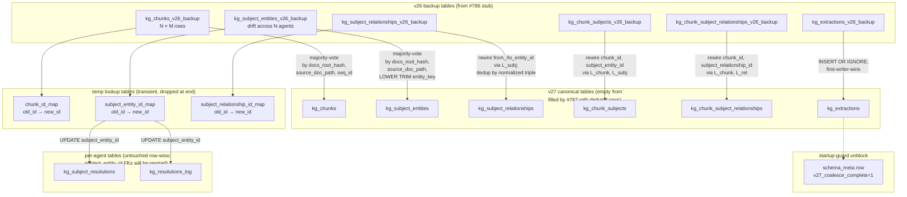

# feat(kg): data migration v26 → v27 — coalesce per-agent rows, preserve paid LLM extraction (T-B)

## Overview

#786 ships the v27 DDL skeleton: rename v26 shared-layer tables to `*_v26_backup`, create empty v27 tables under canonical names, leave a `-- TODO(#787): coalesce SQL goes here` marker inside `migrate_v26_to_v27()`. This plan ships the coalesce SQL that replaces that marker, plus the test harness that validates its seven ticket-specified invariants plus an 8th (insertion-order independence) added during plan peer review. The plan preserves the full contract from #786: same migration method, same non-destructive rename-preserve pattern, same `schema_meta.v27_coalesce_complete` marker as the unblock for #786's startup guard. Where #786 was architecturally novel (schema change, primary-key scope flip, deployment coordination), #787 is mostly SQL discipline — correct grouping, correct tiebreaks, correct FK rewiring, correct transactionality, correct test coverage.

## Problem Frame

Eleven agents each wrote independent LLM extractions over the same corpus. The observed drift was 26–43 distinct entity names across 11 agents on the same doc (~65% spread), so selecting by `MIN(id)` would systematically bias the post-migration graph toward whichever agent ingested first. The ticket's committed decision is **majority-vote by `(source_doc_path, normalized_entity_key)` with highest mean confidence as tiebreak** — preserving the LLM output that matches the most agents' extractions, dropping minority-of-1 outputs as drift rather than signal. Re-extraction is explicitly off the table (≈$40–60 and ≈38min per full corpus pass, and trading a deterministic SQL problem for another non-deterministic LLM pass).

#787's work is mechanical: read from `*_v26_backup` tables, coalesce with the committed selection strategy, write into v27 tables, rewire every FK that points into the collapsed rows via ID-lookup tables, drop the backups, write the marker, commit. All in one transaction. Seven invariants from the ticket body plus one added during plan peer review (insertion-order independence) form the AC, all run on a synthetic drift-simulating fixture.

## Requirements Trace

- **R1.** Replaces the `-- TODO(#787): coalesce SQL goes here` placeholder inside `migrate_v26_to_v27()` (from #786's Unit 2). Not a new method, not a new migration version.
- **R2.** Coalesces rows in the six shared-layer backup tables (`kg_chunks_v26_backup`, `kg_subject_entities_v26_backup`, `kg_subject_relationships_v26_backup`, `kg_chunk_subjects_v26_backup`, `kg_chunk_subject_relationships_v26_backup`, `kg_extractions_v26_backup`) into v27 canonical tables.
- **R3.** Selection strategy: majority-vote by `(source_doc_path, LOWER(TRIM(entity_key)))` for entities; analogous grouping for chunks, relationships, and chunk-subject linkages. Mean `confidence` as first tiebreak; `MIN(id)` as deterministic second tiebreak.
- **R4.** `entity_key` normalization in SQL: `LOWER(TRIM(entity_key))`. Must byte-match the Rust normalization `name.trim().to_lowercase()` from the committed decision. "Kubernetes" and "K8s" remain separate (exact-match, no fuzzy).
- **R5.** FK rewiring via temp lookup tables: `chunk_id_map`, `subject_entity_id_map`, `subject_relationship_id_map`. Every FK pointing into `kg_chunks(id)`, `kg_subject_entities(id)`, or `kg_subject_relationships(id)` must be rewired.
- **R6.** Preserve per-agent layer: `kg_subject_resolutions` and `kg_resolutions_log` row counts unchanged (their `subject_entity_id` FKs get rewired to point at winning v27 rows, but no rows added or removed).
- **R7.** `kg_extractions` gets `INSERT OR IGNORE` into the v27 table — first-writer-wins; subsequent agents' rows for the same `(docs_root_hash, source_doc_path)` are dropped.
- **R8.** All coalesce work happens inside `migrate_v26_to_v27`'s single transaction (`BEGIN IMMEDIATE; PRAGMA defer_foreign_keys = ON; ...; COMMIT;` — contract established by #786). Drop `*_v26_backup` tables at the end. Insert `schema_meta ('v27_coalesce_complete', '1')` as the LAST statement before COMMIT.
- **R9.** Synthetic-DB fixture generator (`build_v26_synthetic_db(agents, docs, drift_factor)`) in `tests/eval/kg_fixtures/mod.rs` — generates v26-shaped DBs with realistic extraction drift matching the observed 26–43 spread.
- **R10.** The 7 invariant tests from the ticket body at `crates/mika-agent/tests/eval/kg_v27_migration.rs` validating: (1) `kg_chunks` post-count per `(docs_root_hash, source_doc_path, source_doc_hash, seq_id)` uniqueness; (2) `kg_subject_resolutions` count preserved; (3) `kg_resolutions_log` count preserved; (4) zero orphan FKs across six FK-check queries; (5) chunk-text round-trip on 10 samples; (6) entity round-trip with majority-vote semantics on 10 samples; (7) per-agent resolution sanity. **Plus an 8th invariant added during plan peer review:** insertion-order independence — running the migration twice against fixtures with identical data but different insertion orders produces byte-identical winning row sets. Guards against tiebreak nondeterminism bugs.
- **R11.** Recovery procedure documented for DBs that migrated via #786-only (stuck at v27 with empty tables and backup tables still present). Exact operator SQL in the Recovery section. No automated recovery (no v28, no side-channel helper) per Vincent's constraint.

## Scope Boundaries

- **Non-goal:** schema DDL changes. #786 owns.
- **Non-goal:** per-agent `docs_root` config read. #778 owns.
- **Non-goal:** KG CLI (`mika kg status/purge/validate`). #779 owns.
- **Non-goal:** near-duplicate entity cleanup (`"Kubernetes"` vs `"K8s"` remaining separate post-migration). Exact-match normalization only; fuzzy matching is a future ticket's concern.
- **Non-goal:** re-extraction. Preserves paid LLM output; pure SQL transformation. Committed.
- **Non-goal:** automated recovery from the post-#786-stub state. Recovery is operator-invoked manual SQL per the Recovery section. Committed per #786's Deployment Coordination.
- **Non-goal:** changing the migration signature. `fn migrate_v26_to_v27(&self) -> Result<()>` stays uniform with the migration chain. The ticket body mentions `MigrationStats` return type — decision is to log stats inline via `tracing::info!` instead, keeping the chain uniform.

### Deferred to Separate Tasks

- Per-agent `docs_root` config + hard-error startup: **#778**.
- KG CLI surface: **#779**.
- Near-duplicate entity cleanup (fuzzy matching): future ticket post-milestone-#17.
- Operator recovery runbook as a reusable skill: mentioned inline in Recovery; promotion to a standalone runbook is a later concern.

## Context & Research

### Relevant code and patterns

- **Migration method** (#786's Unit 2): `crates/mika-agent/src/db.rs`, new `fn migrate_v26_to_v27(&self) -> Result<()>` added after `migrate_v25_to_v26` at line ~2979. Body structure from #786: single `execute_batch` wrapping `BEGIN IMMEDIATE; PRAGMA defer_foreign_keys = ON; <DDL>; INSERT INTO schema_version (version) VALUES (27); COMMIT;`. #787 inserts the coalesce SQL between the DDL and the `INSERT INTO schema_version`. Marker write goes just before the version bump.
- **`entity_key` population at write time:** `crates/mika-agent/src/kg/subject_extractor.rs:1007-1031` — `entity_key = format!("{type}:{name}")`. No normalization at write. LLM prompt soft-asks for lowercase but the code accepts whatever comes back. Confirmed: the migration MUST `LOWER(TRIM(entity_key))` for grouping, not group by raw `entity_key`.
- **`confidence` invariants:** `kg_subject_entities.confidence REAL NOT NULL CHECK (confidence >= 0.0 AND confidence <= 1.0)` at `crates/mika-agent/src/db.rs:~2839`. Same for `kg_subject_relationships`. `AVG(confidence)` is safe — no NULL fallback needed.
- **`source_doc_hash` columns:** `kg_chunks.source_doc_hash TEXT NOT NULL` at `db.rs:~2825` (non-null since v24). `kg_extractions.source_doc_hash TEXT` added in v26 migration (`db.rs:2966`) — **nullable**. Values are `SHA-256 hex of normalize_content()` from `crates/mika-agent/src/kg/lexical_ingestor.rs:540-569`, consistent per doc across all chunks of that doc. Dedup key for chunks: `(docs_root_hash, source_doc_path, source_doc_hash, seq_id)` — invariant #1 from ticket body.
- **Existing migration precedent for column-rewrite:** `migrate_v24_to_v25` at `db.rs:2788-2957` — 170 lines inline, `execute_batch`, `CREATE TABLE IF NOT EXISTS` + indexes. Pattern mirrors OK for scale. No prior precedent for row-count-reducing coalesce; #787 is novel.
- **Schema convergence test precedent:** `db.rs:11026` — `test_v1_and_incremental_schemas_converge()` extracts v24 DDL via `sqlite_master` introspection, then runs incremental migrations and compares against clean-slate. #787 doesn't need a convergence test (#786 ships Unit 4 for that); #787 needs DATA invariant tests.
- **Fixture helpers:** `crates/mika-agent/tests/eval/kg_fixtures/mod.rs` — existing `seed_chunk`, `seed_subject_entity`, `seed_chunk_subject`, `seed_resolution` helpers are single-row seeders. No drift-simulation helper exists. `PINNED_SCHEMA_VERSION` at line 25 — #786 bumps to 27 in its Unit 3 cutover; #787's test harness needs a way to land a v26-shaped DB for migration testing (addressed in Unit 1 below).
- **`execute_batch` multi-statement support:** `rusqlite = 0.32` (`Cargo.toml:28`). `execute_batch` supports multi-statement DDL+DML in one call, including `CREATE TEMP TABLE` + `INSERT INTO ... SELECT` + `UPDATE` + `DROP TABLE` inside an explicit transaction. Temp tables created inside `BEGIN...COMMIT` block are visible to subsequent statements in the same batch.
- **FK-rewire via lookup table — novel pattern:** grep across `crates/mika-agent/src/db.rs` for `CREATE TEMP TABLE` and `CREATE TABLE ... AS SELECT` returned zero hits. #787 introduces this pattern.

### Institutional learnings

- **`docs/solutions/database-issues/iso8601-timestamp-migration.md`** — closest precedent (multi-table column-rewrite, 17 tables). Critical lessons for #787: (1) **never `SELECT *` in migration copy steps** — always enumerate columns explicitly. The #1 P1 review bug in the v12 rewrite was exactly this. (2) **Fail-loud on lookup misses** — a missing lookup row must `RAISE(ABORT)` or be caught by a post-migration invariant check, never silently default to `0` or a synthesized ID. (3) Post-migration sanity check with `SELECT typeof(col), col FROM table LIMIT 10` where types matter.
- **`docs/solutions/best-practices/first-boot-cost-spike-after-tracking-table-migration-2026-04-23.md`** — migration-immutability rule: #787 edits #786's migration body in place. Legal because neither has run in prod yet. Once either deploys, the combined body is frozen. Also: **first-boot cost awareness** — the coalesce runs once per container on first boot after v27 ships; plan must model and bound wall-clock time.
- **`docs/solutions/database-issues/kg-schema-three-layer-sqlite-design.md`** — defines the 10-table v25 layout and the convergence test pattern (#786 owns the convergence test for structural equality; #787 focuses on data invariants on top of that).
- **`docs/solutions/workflow-issues/kg-milestone-14-autonomous-execution-retrospective-2026-04-22.md`** — "merge all, deploy once" rule continues to apply. #787 merges → #778 → #779 → full milestone deploy.
- **`docs/solutions/best-practices/kg-lexical-ingestion-composed-write-2026-04-22.md`** — single-transaction composed-write rule: the entire coalesce (read backups → compute majority vote → INSERT v27 → UPDATE FKs → DROP backups → INSERT marker) runs inside one `execute_batch` transaction. Marker write is the LAST statement before COMMIT. Partial commit leaves the DB in the post-stub state and the startup guard still blocks.

## Key Technical Decisions

- **`entity_key` normalization inline via `LOWER(TRIM(entity_key))`.** Not via a Rust scalar function registered on the connection. Rationale: `LOWER(TRIM(...))` in SQLite matches the Rust `.trim().to_lowercase()` byte-for-byte on ASCII entity names, which is what the current data is (LLM prompts ask for `<lowercase_underscore_name>` — soft guarantee; the drift is case/whitespace variants that `LOWER(TRIM(...))` collapses). If Unicode case-folding ever matters (non-ASCII entity names), that's a future ticket's concern.

- **Majority-vote tiebreak hierarchy:** (1) count of agents whose extraction contained this normalized key, descending; (2) mean `confidence` across those agents, descending; (3) `MIN(id)` of the contributing rows, ascending. Third tiebreak is deterministic and matches any arbitrary-but-stable ordering. The plan documents this as a three-level `ORDER BY` inside the winner-selection `WITH` CTE.

- **FK rewiring via three temp lookup tables.** `chunk_id_map(old_id INTEGER PRIMARY KEY, new_id INTEGER NOT NULL)`, `subject_entity_id_map(old_id INTEGER PRIMARY KEY, new_id INTEGER NOT NULL)`, `subject_relationship_id_map(old_id INTEGER PRIMARY KEY, new_id INTEGER NOT NULL)`. Built by joining v26_backup → v27 via the winning-group key. UPDATE statements on `kg_chunk_subjects`, `kg_chunk_subject_relationships`, `kg_subject_resolutions`, `kg_resolutions_log` use the maps. Temp tables dropped at end of transaction (or automatically at connection close).

- **Fail-loud on lookup miss.** Every UPDATE via a map table uses `WHERE subject_entity_id IN (SELECT old_id FROM subject_entity_id_map)` as a guard — if any row's `subject_entity_id` is missing from the map, the post-migration invariant test catches it via the FK-orphan queries (invariant #4). During implementation, if needed, add a pre-commit assertion inside the migration: `SELECT COUNT(*) FROM kg_subject_resolutions WHERE subject_entity_id NOT IN (SELECT old_id FROM subject_entity_id_map)` → must be 0. Surface this count in `tracing::info!` logs.

- **`INSERT OR IGNORE` on `kg_extractions` v27 insert** — first-writer-wins per #786's Unit 3 committed contract. The coalesce SELECT orders contributing `kg_extractions_v26_backup` rows by `MIN(id)` so the first row per `(docs_root_hash, source_doc_path)` wins deterministically.

- **Ordering within the coalesce SQL:** (1) Build `chunk_id_map` + `subject_entity_id_map` + `subject_relationship_id_map` as temp tables (no side effects yet). (2) INSERT into v27 tables in FK-safe order: `kg_chunks` first, then `kg_subject_entities`, then `kg_subject_relationships`, then `kg_chunk_subjects`, then `kg_chunk_subject_relationships`, then `kg_extractions`. (3) UPDATE `kg_subject_resolutions` and `kg_resolutions_log` via maps. (4) DROP the six `*_v26_backup` tables. (5) DROP the three temp lookup tables. (6) INSERT `schema_meta ('v27_coalesce_complete', '1')`. `defer_foreign_keys = ON` tolerates intermediate FK state; final COMMIT validates all FKs.

- **Migration wall-clock budget.** Expected scale: 11 agents × ~2,400 chunks × ~5 entities/chunk = ~132,000 subject_entity rows pre-migration. Post-migration: ~12,000 entities (11× dedup). SQL on this scale completes in single-digit seconds. Plan does NOT require batching or progress reporting within the migration. If prod data scale grows 10×, revisit.

- **No `MigrationStats` return type.** The ticket's suggestion to return `Result<MigrationStats>` is overruled: (a) existing migration chain uses `fn migrate_vN_to_vN+1(&self) -> Result<()>`, and uniformity matters more than the observability gain; (b) stats are logged via `tracing::info!("v27 coalesce: chunks {pre}->{post}, entities {pre}->{post}, ... elapsed {ms}ms")` from inside the migration body. If future migrations want richer return-type observability, that's a cross-cutting change, not this ticket's scope.

- **`docs_root_hash` and `docs_root` are computed in Rust before entering the SQL batch, then inlined into the SQL string.** v26 backup tables only carry `agent_id` — not `docs_root_hash` or `docs_root` — so the migration must materialize these values from the current process's configuration. Approach:
  1. At the top of `migrate_v26_to_v27` (after the idempotency guard), load `Settings` via the process's `home_dir` and call `kg::config::resolve_kg_docs_root(&settings)` to get the `PathBuf`, then `kg::config::hash_docs_root(&path)` to get the 16-hex-char hash string.
  2. Build the migration SQL via `format!()` with these values interpolated as quoted SQL string literals. Escape single quotes via `.replace("'", "''")` on the path string — paths don't contain SQL-injecting metacharacters, so this is sufficient.
  3. `self.conn.execute_batch(&sql)` executes the full migration (DDL + coalesce + marker + version bump) in one transaction.
  Alternative considered (Rust-driven `tx.execute()` per-statement with `?` params): rejected — would restructure the migration shape away from `execute_batch` (which #786's Unit 2 committed to) for no meaningful safety gain given the well-bounded input values.
  The semantic assumption: **v26 data's effective `docs_root` is whatever the current process resolves it to at migration time via the GLOBAL resolver.** Pre-#738 v26 deploys all used CWD-based defaults; post-#738 operators may set `MIKA_KG_DOCS_ROOT`. Either way, `resolve_kg_docs_root(&Settings::load(...))` gives the right answer for the currently-configured process. If an operator changes `docs_root` between v26 ingestion and v27 migration, the hash will differ — but that's the same kind of mismatch future ingestion writes would surface via #778's hard-error on path mismatch. Acceptable; Vincent's operator discipline covers it.
  
  **Coexistence with #778 (per-agent `docs_root`):** if #778 lands on main before #787 runs on any given host, different agents may have different `docs_root` values via `identity.toml`. The migration runs ONCE per DB, not per agent, so it must pick one canonical `docs_root`. The committed answer: **use the global resolver regardless of per-agent overrides**. v26 data predates per-agent scoping (v26 had no `[kg] docs_root` in `identity.toml`), so all v26 rows correctly belong to a single corpus identified by the global `docs_root_hash`. A future reader seeing `iterate-over-agents-and-use-each-one's-docs_root` in this migration should treat that as an incorrect "fix" — do not make it per-agent. The per-agent split only becomes real for ingestions POST-#778; v26 data is homogeneously shared.

- **Test fixture uses hardcoded v26 DDL for the migration-under-test path.** The fixture builder in `kg_fixtures/mod.rs` creates a v26-shaped DB by writing v26 DDL directly as a string constant — it does NOT go through `migrate_v1` (which post-#786 produces v27 directly). This duplicates the v26 DDL once, as test-only code, but v26 is frozen historically so drift risk is zero. Alternative (replay `migrate_v24_to_v25 + migrate_v25_to_v26` on a v24-shaped DB) is more indirection without real benefit.

- **The fixture seeds with realistic drift via a single `DriftProfile` enum — committed generation contract, not a fuzzy promise.** Three modes: `NoDrift`, `LightDrift`, `ObservedDrift`. `ObservedDrift` is specified as:
  - For each doc, define a **"true" entity set of 30 entities** (seeded deterministically from the doc path for reproducibility).
  - Each agent gets a random subset of **8–12 of those true entities** (uniform random per agent).
  - Each agent adds **2–4 agent-unique entities** (not in the true set).
  - Each agent adds **1–2 case/whitespace variants** of its shared entities (e.g., `"skill:Self-Dev"` vs `"skill:self-dev"`; variants collapse under `LOWER(TRIM(...))`).
  - Confidence per-entity varies within ±0.15 of a baseline-per-true-entity value.
  This produces 26–43 distinct raw `entity_key` values per doc (matching the observed spread) AND guarantees every majority-vote winner has ≥ 2 agents contributing to its group (so the mean-confidence tiebreak is actually exercised). `LightDrift` uses the same shape with lower variance (1 agent-unique, 0–1 variants, smaller confidence delta). `NoDrift` gives every agent the same 10-entity subset of the true set with identical confidence (majority vote is trivial).
  
  **The fixture includes a self-test assertion** as part of its module-level `#[test]`: after building `build_v26_synthetic_db(11, 10, ObservedDrift)`, assert (a) `SELECT COUNT(DISTINCT entity_key) FROM kg_subject_entities_v26_backup WHERE source_doc_path = ?` falls in 26–43 for every doc; (b) at least 30% of normalized-keys per doc have plurality ≥ 3 agents. If either assertion fails, the generator is broken and downstream invariant tests are meaningless — fail loud at fixture construction.
  
  Tests run each of the 8 invariants under `ObservedDrift` by default; `NoDrift` is the regression gate that confirms the migration does the right thing in the limit case (fresh install semantics).

## Open Questions

### Resolved during planning

- **Q: Should the coalesce use a Rust scalar function for `normalize_entity_key`?** → No. `LOWER(TRIM(entity_key))` in SQLite is sufficient for ASCII entity names and matches the Rust normalization byte-for-byte. Registering a scalar function adds complexity and serialization overhead per row with no correctness gain.
- **Q: `MIN(id)` or `ROW_NUMBER() OVER (...)` for the deterministic third tiebreak?** → `MIN(id)` inside a `WITH` CTE. Simpler SQL, no window function needed.
- **Q: Should `MigrationStats` be returned or logged?** → Logged via `tracing::info!`. Keeps migration chain signature uniform.
- **Q: Fail-loud vs fail-soft on FK lookup miss?** → Fail-loud. A missing lookup row is a bug, not data; invariant #4 catches it post-migration and rolls back the transaction.
- **Q: Recovery: automate via a post-migration hook OR document operator SQL?** → Document operator SQL. Vincent explicitly ruled out automated recovery (no v28, no side-channel). See Recovery section.
- **Q: Does the coalesce body need an explicit idempotency guard?** → No. #786's idempotency guard (`column_exists("kg_chunks", "docs_root_hash")` at top of method) covers the "migration already ran" case. Inside the coalesce, if `*_v26_backup` tables don't exist (e.g., somehow called when they were already dropped), the INSERT ... SELECT FROM backup_table fails with "no such table" — SQLite transaction rolls back. Fine.

### Deferred to implementation

- Exact CTE shape for majority-vote winner selection — directional pseudo-SQL is in High-Level Technical Design, but final SQL shape emerges from running against the fixture and verifying invariants.
- Exact index creation post-coalesce: #786's Unit 2 creates v27 indexes as part of the `CREATE TABLE`. If coalesce performance shows the indexes are slow to populate on INSERT, implementation may defer index creation to post-coalesce. Flag during implementation if needed; prefer the simpler "indexes created with table" path.
- Whether `DriftProfile::LightDrift` and `DriftProfile::NoDrift` are tested with the full 8 invariants or only a subset — implementer picks, as long as `ObservedDrift` gets all 8.
- **Exact mechanism for `Database` to access `home_dir` at migration time.** The migration needs `home_dir` to call `Settings::load(&home_dir)`. Two candidate shapes: (a) store `home_dir: PathBuf` as a field on `Database`, populated at `Database::open()` — matches other Database state and ripples zero call sites; (b) pass `home_dir` through `migrate()` as a parameter — ripples through the full migration chain. Option (a) is clearly simpler; implementer should verify during execution that `Database::open()` has `home_dir` in scope (it does — it's the function's input parameter). If for any reason `Database` cannot store it, fall back to option (b) with a signature update on `migrate()`.
- **Factor coalesce SQL into a helper function for testability?** Option: extract the coalesce-only portion (excluding the DDL rename-preserve and final marker/version-bump) into a private `fn coalesce_v26_to_v27(&self, conn: &Connection, docs_root: &Path, docs_root_hash: &str) -> Result<()>` helper. The helper takes explicit parameters so Unit 2's tests can exercise it without depending on Settings loading. Implementer decides: extract if the SQL is big enough (>50 lines inside `migrate_v26_to_v27`) or leave inline if it stays tight. The invariant tests can run against the full `migrate_v26_to_v27` either way.

## High-Level Technical Design

> *This illustrates the intended approach and is directional guidance for review, not implementation specification. The implementing agent should treat it as context, not code to reproduce.*

### Coalesce pipeline — data flow



### Pseudo-SQL sketch of the `kg_subject_entities` winner selection

This is directional, not commit-ready. Final SQL shape emerges from implementation + invariant tests.

```
-- Compute normalized keys once per row
WITH normalized AS (
    SELECT id, agent_id, docs_root_hash, docs_root, source_doc_path,
           LOWER(TRIM(entity_key)) AS nkey,
           type, name, confidence, properties_json, created_at, trace_id
    FROM kg_subject_entities_v26_backup
),
-- Count agents per (docs_root_hash, nkey)
group_counts AS (
    SELECT docs_root_hash, nkey,
           COUNT(DISTINCT agent_id) AS agent_count,
           AVG(confidence) AS mean_confidence
    FROM normalized
    GROUP BY docs_root_hash, nkey
),
-- Pick the winning ROW per group: highest agent_count, then highest confidence, then MIN(id)
winners AS (
    SELECT n.*, 
           ROW_NUMBER() OVER (
               PARTITION BY n.docs_root_hash, n.nkey
               ORDER BY gc.agent_count DESC,
                        gc.mean_confidence DESC,
                        n.id ASC
           ) AS rnk
    FROM normalized n
    JOIN group_counts gc
      ON gc.docs_root_hash = n.docs_root_hash
     AND gc.nkey = n.nkey
)
INSERT INTO kg_subject_entities
    (docs_root_hash, docs_root, entity_key, type, name, confidence, properties_json, created_at, trace_id)
SELECT docs_root_hash, docs_root, entity_key, type, name, confidence, properties_json, created_at, trace_id
FROM winners
WHERE rnk = 1;

-- Build the subject_entity_id_map: every v26 row → the winning v27 id
INSERT INTO subject_entity_id_map (old_id, new_id)
SELECT n.id AS old_id, v.id AS new_id
FROM normalized n
JOIN group_counts gc ON gc.docs_root_hash = n.docs_root_hash AND gc.nkey = n.nkey
JOIN kg_subject_entities v ON v.docs_root_hash = n.docs_root_hash AND LOWER(TRIM(v.entity_key)) = n.nkey;
```

Comparable shape for `kg_chunks` (group by `(docs_root_hash, source_doc_path, source_doc_hash, seq_id)`), `kg_subject_relationships` (group by `(docs_root_hash, nfrom_key, nto_key, type)` after applying `subject_entity_id_map` to resolve from/to entity ids first).

## Implementation Units

### Unit 1: Test fixture — v26 DDL helper + drift-simulating synthetic DB generator

- [ ] **Unit 1**

**Goal:** Add test-only helpers that materialize a v26-shaped in-memory DB with realistic extraction drift. Unlocks Unit 2's invariant tests. This unit has no runtime behavior change — pure test infrastructure.

**Requirements:** R9.

**Dependencies:** None (builds on #786's Unit 3 having landed — post-#786, fresh DBs are v27, so we need a v26 synthesizer).

**Files:**
- Modify: `crates/mika-agent/tests/eval/kg_fixtures/mod.rs` — add:
  - `pub fn v26_schema_ddl() -> &'static str` — returns a hardcoded SQL string containing the v26 DDL for all 10 KG tables (`kg_chunks`, `kg_subject_entities`, `kg_subject_relationships`, `kg_chunk_subjects`, `kg_chunk_subject_relationships`, `kg_extractions`, `kg_subject_resolutions`, `kg_resolutions_log`, plus `kg_entities` and `kg_relationships` domain tables for referential correctness). Taken verbatim from the pre-#786 `migrate_v1` clean-slate (capture once, pin forever — v26 is frozen).
  - `pub fn open_v26_in_memory() -> rusqlite::Connection` — opens a fresh SQLite in-memory DB, runs `v26_schema_ddl()`, seeds `schema_version` with `26`, and registers a test agent. Does NOT run the migration chain (which would take it to v27).
  - `pub fn build_v26_synthetic_db(agents: u32, docs_per_agent: u32, drift: DriftProfile) -> rusqlite::Connection` — populates an `open_v26_in_memory()` DB with realistic content. See Approach.
  - `pub enum DriftProfile { NoDrift, LightDrift, ObservedDrift }` — controls the per-agent variance of extracted entities/relationships for the same doc.

**Approach:**
- `v26_schema_ddl()` is a single `&'static str` constant. Include every table + index + unique-constraint from v26. Pin with a comment: `/// v26 DDL as of 2026-04-24 — frozen; do NOT update when schema version increments.`
- `open_v26_in_memory()` uses `rusqlite::Connection::open_in_memory()?`, calls `conn.execute_batch(v26_schema_ddl())?`, inserts a row into `agents` (the `kg_*.agent_id` FK target), and seeds `schema_version` to 26.
- `build_v26_synthetic_db` flow:
  1. Open v26 DB via `open_v26_in_memory`.
  2. For each of `agents` agents, insert an `agents` row (`agent_id = format!("agent-{i}")`).
  3. For each of `docs_per_agent` docs, generate a synthetic doc path (`docs/solutions/test-doc-{i}.md`), content-hash it, seed K chunks per doc (K=5 default).
  4. For each chunk, generate ~M entity extractions (M=5 default). Apply drift per `DriftProfile`:
     - `NoDrift`: every agent extracts the same entity set for the same doc (byte-identical `entity_key`, `confidence`).
     - `LightDrift`: ~10% of entities per-agent are unique (either different case/whitespace variants of shared entities, or agent-unique entities). Confidence varies within ±0.05.
     - `ObservedDrift`: committed contract per Key Technical Decisions — 30-entity "true set" per doc (deterministic from path), each agent draws 8–12 from it, adds 2–4 agent-unique, adds 1–2 case/whitespace variants, confidence ±0.15. Produces 26–43 distinct raw entity_keys per doc with majority-vote groups of plurality ≥ 2–3.
  5. Seed `kg_subject_relationships` with from/to entity pairs (3 relationships per doc).
  6. Seed `kg_chunk_subjects` and `kg_chunk_subject_relationships` to link chunks to subjects and chunk-rel linkages.
  7. Seed `kg_extractions` — one row per `(agent, doc)` marking the extraction.
  8. Seed `kg_subject_resolutions` and `kg_resolutions_log` for each agent — ~70% of the agent's subject entities get a resolution entry (linked to a domain entity from `kg_entities`, which the fixture pre-seeds with 20 entries).

**Patterns to follow:**
- Existing `seed_chunk`, `seed_subject_entity`, etc. in `kg_fixtures/mod.rs` for the row-shape.
- `db.rs:11026` (`test_v1_and_incremental_schemas_converge`) for the "raw SQL against a fresh connection" pattern.

**Test scenarios:**
- Happy path (smoke): `build_v26_synthetic_db(3, 5, DriftProfile::ObservedDrift)` returns a connection where `SELECT COUNT(*) FROM kg_chunks` returns `3 agents × 5 docs × 5 chunks/doc = 75`; `SELECT COUNT(DISTINCT source_doc_path) FROM kg_chunks` returns `5` (all agents share the doc corpus).
- Happy path (drift): for `ObservedDrift`, `SELECT COUNT(DISTINCT entity_key) FROM kg_subject_entities_v26_backup WHERE source_doc_path = ?` returns 26–43 distinct entity_keys per doc. Matches filed-time empirical.
- **Fixture self-test (fails loud on drift-generator bugs):** after `build_v26_synthetic_db(11, 10, ObservedDrift)`, assert (a) per-doc distinct `entity_key` count is in [26, 43], and (b) at least 30% of `LOWER(TRIM(entity_key))` groups per doc have ≥ 3 agents contributing. If either fails, downstream invariant tests are running against meaningless data — fail the fixture at construction time, not after mysterious downstream failures.
- **Fixture-coalesce column-match check:** after `open_v26_in_memory()`, for each of the 6 shared-layer backup-table-names, run `PRAGMA table_info(<table>)` and assert the column set exactly matches what #787's coalesce SQL SELECTs from `*_v26_backup`. If mika-dev (or a future editor) adds a column to the fixture DDL without updating the coalesce, or vice versa, the check catches it at fixture construction. This is cheap insurance against the "pinned DDL but someone edited it" failure mode.
- Edge case: `build_v26_synthetic_db(0, 0, DriftProfile::NoDrift)` returns an empty-but-valid v26 DB (tables exist, zero rows).
- Edge case: `DriftProfile::NoDrift` with 3 agents × 5 docs → `SELECT COUNT(DISTINCT entity_key) FROM kg_subject_entities WHERE source_doc_path = ?` returns exactly `M` (5) per doc — no variance.

**Verification:**
- `cargo test -p mika-agent tests::eval::kg_fixtures::v26_synthetic_db` passes (new test module inside the fixture file).
- The fixture does NOT depend on `migrate_v1` or any `migrate_vN_to_vM` function — it uses raw DDL.

### Unit 2: Coalesce SQL + 8 invariant tests (test-first)

- [ ] **Unit 2**

**Goal:** Replace the `-- TODO(#787): coalesce SQL goes here` placeholder inside `migrate_v26_to_v27()` with the actual coalesce SQL. Write the 8 invariant tests first (against `ObservedDrift` fixtures), watch them fail against the stub, then implement the coalesce to make them pass.

**Requirements:** R1, R2, R3, R4, R5, R6, R7, R8, R10.

**Dependencies:** Unit 1 (fixture infrastructure), and #786's Unit 2 (`migrate_v26_to_v27` method skeleton) + #786's Unit 3 (v27 clean-slate DDL + `schema_meta` table + startup guard).

**Files:**
- Modify: `crates/mika-agent/src/db.rs` — replace the `-- TODO(#787): coalesce SQL goes here` comment inside `migrate_v26_to_v27()` with the full coalesce SQL. Keep the surrounding `BEGIN IMMEDIATE; PRAGMA defer_foreign_keys = ON; <DDL>; <coalesce>; INSERT INTO schema_version...; COMMIT;` structure. Insert `INSERT INTO schema_meta (key, value) VALUES ('v27_coalesce_complete', '1');` immediately before the `schema_version` insert.
- Create: `crates/mika-agent/tests/eval/kg_v27_migration.rs` — new test module. Uses the fixture from Unit 1 to materialize v26 synthetic DBs, calls `migrate_v26_to_v27` via a test helper that wraps the `Database::migrate()` public API or invokes the method directly via a test-only `pub(crate)` visibility, and asserts the 8 invariants. One `#[test]` per invariant. Some invariants have multiple assertions — keep them as separate `#[test]` functions for clear failure messages.

**Approach:**
- **Execution note: test-first.** Before writing any coalesce SQL, write the 8 invariant tests. They will fail against the `-- TODO(#787)` stub. This characterizes the expected behavior precisely. Then implement the SQL.
- **Coalesce SQL structure inside `migrate_v26_to_v27`, in this order (matching Key Technical Decisions):**
  1. `CREATE TEMP TABLE chunk_id_map (old_id INTEGER PRIMARY KEY, new_id INTEGER NOT NULL);`
  2. `CREATE TEMP TABLE subject_entity_id_map (old_id INTEGER PRIMARY KEY, new_id INTEGER NOT NULL);`
  3. `CREATE TEMP TABLE subject_relationship_id_map (old_id INTEGER PRIMARY KEY, new_id INTEGER NOT NULL);`
  4. INSERT winning rows into `kg_chunks` (group by `(docs_root_hash, source_doc_path, source_doc_hash, seq_id)` — no majority vote needed here; chunks are text-deterministic per `source_doc_hash`).
  5. Populate `chunk_id_map` by joining `kg_chunks_v26_backup` to `kg_chunks` on the group key.
  6. INSERT winning rows into `kg_subject_entities` via the CTE in the pseudo-SQL sketch.
  7. Populate `subject_entity_id_map` by joining `kg_subject_entities_v26_backup` to `kg_subject_entities` on `(docs_root_hash, LOWER(TRIM(entity_key)))`.
  8. INSERT winning rows into `kg_subject_relationships`. Apply `subject_entity_id_map` inline to rewire `from_entity_id` and `to_entity_id` before grouping (otherwise majority vote can't group relationships that use different per-agent subject IDs). **Also apply `LOWER(TRIM(type))` to the relationship `type` in the grouping key** — `type` is a free-text TEXT column (no CHECK enum constraint at write time; LLM output), and observed drift across 11 agents extends to relationship types (`depends_on` vs `depends-on`, `USES` vs `uses`). Same normalization rule as `entity_key`. The winning row stores the original-cased `type` value (same preservation rule as `entity_key`); only the grouping key is normalized.
  9. Populate `subject_relationship_id_map`.
  10. INSERT into `kg_chunk_subjects` from `*_v26_backup` applying both `chunk_id_map` and `subject_entity_id_map`.
  11. INSERT into `kg_chunk_subject_relationships` from `*_v26_backup` applying `chunk_id_map` and `subject_relationship_id_map`.
  12. INSERT OR IGNORE into `kg_extractions` from `kg_extractions_v26_backup`, ordering by `MIN(id)` per `(docs_root_hash, source_doc_path)` so first-writer-wins is deterministic.
  13. UPDATE `kg_subject_resolutions SET subject_entity_id = (SELECT new_id FROM subject_entity_id_map WHERE old_id = kg_subject_resolutions.subject_entity_id)`.
  14. UPDATE `kg_resolutions_log SET subject_entity_id = ...` same pattern.
  15. DROP the six `*_v26_backup` tables.
  16. DROP the three temp lookup tables (explicit for clarity; they'd be dropped at connection close anyway).
  17. INSERT `schema_meta ('v27_coalesce_complete', '1')` on conflict do nothing. (INSERT OR IGNORE in case the row somehow pre-exists — belt-and-suspenders idempotency.)
  18. (The surrounding structure already handles `INSERT INTO schema_version (version) VALUES (27)` and `COMMIT`.)
- **Explicit column enumeration in every INSERT ... SELECT** — never `SELECT *` (per iso8601 learning).
- **`tracing::info!` logging at key phases** — "v27 coalesce: stage=chunks pre={N} post={M}", "stage=entities pre={N} post={M}", "elapsed {ms}ms". Logged BEFORE the COMMIT so partial-failure diagnostics survive rollback.

**Execution note:** Characterization-first. Write all 8 invariant tests before the coalesce SQL. Tests fail against the TODO stub → implement SQL → tests pass.

**Technical design:** see High-Level Technical Design above for the pseudo-SQL sketch.

**Patterns to follow:**
- `crates/mika-agent/src/db.rs:2788-2957` (`migrate_v24_to_v25`) for the inline-SQL-in-execute_batch scale.
- `docs/solutions/database-issues/iso8601-timestamp-migration.md` for the "enumerate columns explicitly" and "fail-loud on lookup miss" rules.
- `docs/solutions/best-practices/kg-lexical-ingestion-composed-write-2026-04-22.md` for the "single-transaction composed-write" discipline — all phases of the coalesce run inside one `execute_batch`.

**Test scenarios** (feature-bearing — 7 invariants from ticket body + 1 added during plan peer review):

- **Invariant 1 — Shared-corpus coalescing (`test_invariant_1_chunks_coalesce`):** Build v26 synthetic DB with 11 agents × 10 docs × `ObservedDrift`. Run migration. Assert `SELECT COUNT(*) FROM kg_chunks == SELECT COUNT(*) FROM (SELECT DISTINCT docs_root_hash, source_doc_path, source_doc_hash, seq_id FROM kg_chunks_v26_backup)`. Note: since v26_backup is dropped post-migration, snapshot the expected count BEFORE running migration.

- **Invariant 2 — Per-agent layer preserved (`test_invariant_2_resolutions_count`):** Snapshot `SELECT COUNT(*) FROM kg_subject_resolutions` pre-migration. Run migration. Assert post-count == pre-count exactly.

- **Invariant 3 — Resolution log preserved (`test_invariant_3_resolution_log_count`):** Same pattern for `kg_resolutions_log`.

- **Invariant 4 — Zero orphan FKs (`test_invariant_4_no_orphan_fks`):** Run migration. Assert all 6 orphan-check queries return 0 (from ticket body). Each in a separate assertion with a clear failure message naming which FK class failed.

- **Invariant 5 — Chunk-text round-trip (`test_invariant_5_chunk_text_roundtrip`):** BEFORE running migration, snapshot 10 random `(agent_id, source_doc_path, seq_id)` triples with their chunk `text` (from the v26 synthetic). Run migration. For each sample, query post-migration: `SELECT text FROM kg_chunks WHERE docs_root_hash = ? AND source_doc_path = ? AND seq_id = ?`. Assert byte-identical text.

- **Invariant 6 — Entity round-trip with majority-vote semantics (`test_invariant_6_entity_majority_vote`):** BEFORE running migration, for 10 random `(agent_id, source_doc_path)` pairs, compute the expected post-migration entity set per agent by: (a) gathering all agents' normalized-keys for that doc; (b) computing the per-key majority-vote; (c) the agent's post-migration resolved set == majority-vote winners for that doc (union across the agent's pre-migration keys that survived the vote). Run migration. Query actual per-agent resolved entities via `kg_subject_resolutions JOIN kg_subject_entities`. **Comparison rule: normalize both sides to `LOWER(TRIM(entity_key))` at comparison time.** The winning row preserves its original casing in the `entity_key` column (same preservation rule the coalesce applies — only the grouping key is normalized, stored data is original-cased); the test normalizes on read to match the Rust-side expected-set computation. Uses `assert_eq!(sorted_normalized_keys_expected, sorted_normalized_keys_actual)` with per-agent failure messages.

- **Invariant 7 — Per-agent resolution sanity (`test_invariant_7_resolution_fk_validity`):** Subsumed by invariant 4 at the FK level, but documented as a semantic guarantee. Assert every `(agent_id, subject_entity_id)` in `kg_subject_resolutions` has a matching row in `kg_subject_entities` via direct join (returns rows for all N).
- **Invariant 8 — Insertion-order independence (`test_invariant_8_insertion_order_independence`):** Build two v26 synthetic DBs with the SAME random seed and the SAME `build_v26_synthetic_db(11, 10, ObservedDrift)` parameters, but have the fixture insert rows in two different orders (e.g., one builds agent-by-agent, the other builds doc-by-doc). Run the migration on both. Assert the post-migration `kg_subject_entities` tables are identical by `(entity_key, type, name, confidence)` tuple set (ignoring auto-assigned `id` differences). This catches tiebreak nondeterminism bugs where a supposedly-deterministic ORDER BY accidentally depends on physical row order rather than the stated tiebreak chain. Critical because the three-level tiebreak (agent-count desc, mean-confidence desc, MIN(id) asc) must survive row-order permutation.

**Verification:**
- `cargo test --test kg_v27_migration` runs all 8 invariant tests + passes.
- `cargo build --workspace` passes.
- `cargo clippy --workspace --all-targets -- -D warnings` passes.
- Running the migration on a large synthetic fixture (`build_v26_synthetic_db(11, 100, ObservedDrift)` → ~5,500 chunks pre-coalesce) completes in under 30 seconds on the CI runner. If it exceeds that, flag as a performance concern for #786's "Migration transaction exceeds SQLite lock timeout" risk row.

### Unit 3: Recovery documentation — `docs/solutions/` runbook + plan-internal section

- [ ] **Unit 3**

**Goal:** Document the exact operator SQL to recover a DB that migrated via #786-only and landed in the "v27 tables empty, `*_v26_backup` tables present, `schema_meta.v27_coalesce_complete` absent" state. #786's startup guard refuses to return a `Database` handle in this state — the recovery runbook is the only path forward.

**Requirements:** R11.

**Dependencies:** Unit 2 (the recovery procedure references the migration's post-state shape, which Unit 2 finalizes).

**Files:**
- Create: `docs/solutions/database-issues/kg-v27-stuck-migration-recovery-2026-04-24.md` — standalone runbook, operator-facing.
- Modify: `crates/mika-agent/CLAUDE.md` — add a one-paragraph "KG v27 migration recovery" note in the KG section, pointing at the runbook file for operators. Keep it brief — details belong in the runbook.
- Modify (this plan itself): the "Recovery" section below should have the exact SQL inline so it's self-contained for reviewers; the standalone runbook is for operators to reference directly post-merge.

**Approach:**
- The runbook documents a single recovery procedure: **restore v26 state by renaming backup tables back to canonical names, reset `schema_version` to 26, then restart the service so `migrate_v26_to_v27` (with #787's full body) runs properly.**
- SQL is commented line-by-line so an operator with only `sqlite3` CLI access can follow.
- Runbook includes: (1) prerequisites (stop the service first; backup the DB file); (2) detection (how to confirm you're in the stuck state); (3) recovery steps; (4) verification (start the service, confirm `lexical_ingest_complete` logs, confirm `SELECT value FROM schema_meta WHERE key = 'v27_coalesce_complete'` returns `'1'`); (5) fallback if recovery fails (restore from filesystem backup — Vincent's `~/.mika/data/mika.db.bak` or similar).

**Test expectation:** none — pure documentation. Verification is manual spot-check by reading the runbook end-to-end.

**Patterns to follow:**
- Existing `docs/solutions/database-issues/*.md` runbook style.
- `docs/solutions/workflow-issues/*.md` operator-facing tone.

**Verification:**
- `rg "v27_coalesce_complete" docs/solutions/` returns the new runbook with the marker name matching the code.
- `rg "kg-v27-stuck-migration-recovery" crates/mika-agent/CLAUDE.md` returns the pointer from CLAUDE.md.
- Manual read-through: an operator with sqlite3 access should be able to follow the runbook end-to-end without external context.

## System-Wide Impact

- **Interaction graph:** The coalesce runs once per DB upgrade from v26 → v27, inside `migrate_v26_to_v27`. Startup callers of `Database::open()` benefit transparently — they either get a working `Database` handle (post-coalesce) or the `MigrationIncomplete` error from #786's guard. No new public API.
- **Error propagation:** SQL failures inside `execute_batch` propagate via `rusqlite::Error` → `anyhow::Error` via the existing `.context(...)` pattern. Transaction rolls back atomically on any failure; `schema_version` stays at 26 and `*_v26_backup` tables remain intact.
- **State lifecycle risks:**
  - Partial-write between stages: mitigated by single-transaction composed-write (`BEGIN IMMEDIATE; ...; COMMIT;`).
  - Temp tables leaking past migration: dropped explicitly at end of batch; also auto-dropped at connection close. No risk.
  - Drop-before-copy on `*_v26_backup` tables: explicit ordering — DROP happens AFTER all INSERT/UPDATE steps. Enforced by SQL sequence.
  - Mid-migration crash: transaction rollback restores pre-migration state. Next startup re-runs (idempotency guard in #786's method short-circuits).
- **API surface parity:** None. All changes are inside one migration method + tests + docs.
- **Integration coverage:** Unit 2's 8 invariant tests exercise the full coalesce pipeline end-to-end against synthetic v26 DBs. Unit-test-only coverage would miss the FK-rewire correctness (invariants 4, 5, 7).
- **Unchanged invariants:**
  - `migrate_v24_to_v25` and `migrate_v25_to_v26` are NOT edited (historical migrations frozen).
  - `Database::open()` signature and semantics: unchanged (still gated by #786's guard).
  - `LexicalIngestor`, `SubjectExtractor`, `query_knowledge_graph`: no changes (they already use v27 shape post-#786).
  - `schema_meta` table shape: unchanged (created in #786 with `key TEXT PRIMARY KEY, value TEXT NOT NULL`; #787 just INSERTs a row).

## Risks & Dependencies

| Risk | Likelihood | Impact | Mitigation |
|------|-----------|--------|------------|
| **Tiebreak nondeterminism** — a supposedly-deterministic ORDER BY chain accidentally depends on physical row-insertion order rather than the stated tiebreak hierarchy (agent-count desc, mean-confidence desc, MIN(id) asc). | Medium | High | Unit 2's Invariant 8 (insertion-order independence) runs the migration against two fixtures with identical data but different insertion orders; asserts identical winning rows. Catches the entire class. |
| **Schema drift hidden by `SELECT *`** — a copy step that uses `SELECT *` silently swallows any column addition/removal between v26 backup tables and v27 canonical tables, producing wrong row shapes. | Low | High | iso8601-migration learning applied: **never `SELECT *` in migration copy steps**. Explicit column enumeration on every `INSERT ... SELECT`. Unit 1's fixture-coalesce column-match check is a second line of defense — compares column sets between the fixture DDL and the coalesce SELECTs at fixture construction. |
| **FK lookup miss passes through silently**, leading to a dangling reference that passes the invariant check due to `defer_foreign_keys = ON`. | Medium | High | Fail-loud pattern: post-coalesce sanity queries inside the migration transaction check `COUNT(*) WHERE old_id NOT IN (SELECT old_id FROM xxx_map)` for each lookup map. Any positive result rolls back. Invariant 4 is the backup check after commit. |
| **Migration wall-clock time on prod-scale data** exceeds the SQLite `busy_timeout`. | Low | Medium | Worst-case estimate: 11 agents × 2,400 chunks × 5 entities = 132K entity rows, 26K chunk rows. SQL on this scale completes in single-digit seconds. If prod data scale grows 10×, revisit. Test harness runs a large-scale synthetic (11 × 100 × ObservedDrift) as a soft performance gate. |
| **`entity_key` normalization doesn't byte-match Rust** on Unicode inputs (non-ASCII entity names cause `LOWER(TRIM(...))` in SQLite and `.trim().to_lowercase()` in Rust to diverge). | Low | Medium | Current data is ASCII (LLM prompt asks for `<lowercase_underscore_name>`; observed drift is case/whitespace, not Unicode). If future data introduces Unicode entity names, the normalization in BOTH write-path and coalesce must switch to a consistent Unicode case-folding library. Documented as a deferred concern in Key Technical Decisions. |
| **Test fixture v26 DDL drifts** from the real v26 (e.g., someone adds an index to v26 retroactively). | Negligible | Medium | v26 is frozen historical state. The fixture DDL is pinned with a `/// frozen — do NOT update` comment. If anyone retroactively edits v26, that's a migration-immutability violation caught by #786's Unit 4 convergence test. |
| **#786's guard position changes** between when #787's plan is written and when #787 is implemented — invalidating the marker-insertion contract. | Negligible | High | #787's plan depends on #786's Units 2 and 3 landing without shape changes. If #786's peer-review round causes the `schema_meta` contract to shift, #787's plan must be updated before dispatch. Coordination handled by sequential grooming (which is in progress now). |
| **Operator misapplies the recovery SQL** on a DB that's NOT in the stuck state (e.g., runs it on a fresh v27 install). | Low | High | Runbook's step 2 ("detection") has explicit SQL queries that must pass before the operator proceeds to step 3. False positives are unlikely: the query `SELECT COUNT(*) FROM schema_meta WHERE key = 'v27_coalesce_complete'` returns 0 only in the stuck state and in pre-v27 installs. |
| **Partial-write visibility across agents in a multi-connection scenario.** | Negligible | High | SQLite WAL mode makes mid-transaction state invisible to other readers until COMMIT. The migration transaction uses `BEGIN IMMEDIATE` which acquires the writer lock; other connections block. No multi-connection races in this codebase (single `Database` per process; agents share a connection pool per-process). |

## Recovery — Operator Runbook for Stuck DBs

**If you are seeing:** `Database::open()` returns `MigrationIncomplete` with the error message `KG v27 migration incomplete — coalesce step from mika#787 has not run. Deploy #787 before starting.`

**Context:** Between #786's merge and #787's merge, a restart of `Database::open()` (even an accidental one — package upgrade, kernel upgrade, service auto-restart) ran #786's migration stub. The DB is now at `schema_version = 27` with empty v27 tables and preserved v26 rows in `*_v26_backup` tables. #786's startup guard correctly refuses to return a `Database` handle. You need to get the DB to either: (a) wait for #787 to merge-and-deploy (preferred), or (b) manually restore to v26 so #787's now-deployed migration runs fully on next startup.

**Prerequisite: stop the service.** `systemctl stop mika-agent` or equivalent. Do NOT run the recovery SQL against a running service.

**Prerequisite: backup the DB file.** `cp ~/.mika/data/mika.db ~/.mika/data/mika.db.recovery-backup-$(date +%s)`. Always.

**Detection (confirm you are in the stuck state):**

```sql
-- Run against ~/.mika/data/mika.db with sqlite3 CLI.

-- Step 1: Confirm schema_version is 27.
SELECT MAX(version) FROM schema_version;
-- Expected output: 27. If not 27, you are NOT in the stuck state — stop here.

-- Step 2: Confirm the coalesce_complete marker is absent.
SELECT COUNT(*) FROM schema_meta WHERE key = 'v27_coalesce_complete';
-- Expected output: 0. If 1, you are NOT in the stuck state — the migration already completed.

-- Step 3: Confirm v26 backup tables still exist (data preservation check).
SELECT name FROM sqlite_master WHERE type = 'table' AND name LIKE '%_v26_backup';
-- Expected output: 6 rows (kg_chunks_v26_backup, kg_subject_entities_v26_backup, etc.). 
-- If 0 rows, the backups were dropped — recovery via this procedure is NOT possible; 
-- restore from the filesystem backup instead.

-- Step 4: Confirm v27 tables exist but are empty.
SELECT 
  (SELECT COUNT(*) FROM kg_chunks) AS chunks,
  (SELECT COUNT(*) FROM kg_subject_entities) AS entities;
-- Expected output: chunks=0, entities=0. If non-zero, the migration was partially run 
-- in a way this procedure doesn't cover — restore from filesystem backup.
```

If all four detection steps produced the expected outputs, proceed.

**Recovery steps (restore to v26, re-run migration via #787's code):**

```sql
-- Run against ~/.mika/data/mika.db with sqlite3 CLI, service stopped.
BEGIN IMMEDIATE;
PRAGMA defer_foreign_keys = ON;

-- Step 1: Drop the empty v27 tables (canonical names).
DROP TABLE kg_chunks;
DROP TABLE kg_subject_entities;
DROP TABLE kg_subject_relationships;
DROP TABLE kg_chunk_subjects;
DROP TABLE kg_chunk_subject_relationships;
DROP TABLE kg_extractions;

-- Step 2: Rename v26 backup tables back to canonical names.
ALTER TABLE kg_chunks_v26_backup RENAME TO kg_chunks;
ALTER TABLE kg_subject_entities_v26_backup RENAME TO kg_subject_entities;
ALTER TABLE kg_subject_relationships_v26_backup RENAME TO kg_subject_relationships;
ALTER TABLE kg_chunk_subjects_v26_backup RENAME TO kg_chunk_subjects;
ALTER TABLE kg_chunk_subject_relationships_v26_backup RENAME TO kg_chunk_subject_relationships;
ALTER TABLE kg_extractions_v26_backup RENAME TO kg_extractions;

-- Step 3: Reset schema_version to 26 so migrate() re-dispatches v26 → v27.
DELETE FROM schema_version WHERE version = 27;

-- Step 4: Drop the schema_meta table so the migration starts from a clean slate
-- (no stale marker from the stub run). The actual re-dispatch trigger is Step 3
-- above (resetting schema_version to 26) combined with Step 2 (v26 tables back
-- under canonical names), which makes #786's idempotency guard — 
-- column_exists("kg_chunks", "docs_root_hash") — return false; the migration
-- then proceeds through DDL + coalesce, re-creating schema_meta as part of DDL.
DROP TABLE schema_meta;

COMMIT;
```

**Verification:**

1. Start the service: `systemctl start mika-agent`.
2. Check logs: expect `migrating database schema v26 -> v27` and `v27 coalesce: chunks N->M, entities N->M, ... elapsed Xms`.
3. Confirm the marker is written: `sqlite3 ~/.mika/data/mika.db "SELECT value FROM schema_meta WHERE key = 'v27_coalesce_complete';"` → expect `1`.
4. Confirm the service starts normally (no `MigrationIncomplete` error in logs).

**If recovery fails:**

Restore from the filesystem backup: `cp ~/.mika/data/mika.db.recovery-backup-<timestamp> ~/.mika/data/mika.db`. The DB returns to the exact state before the recovery attempt (v27 + empty tables + backup tables + no marker). Root-cause the failure before retrying (likely: #787's migration body has a bug — file an issue with the failing `tracing::info!` stage from logs).

## Ownership and Capability Check (Autonomous-Loop Gate)

Per Milestone #17 dispatch constraint: every step on the AC path must be executable by mika-dev without Vincent's intervention.

| Step | Executor | Capability verified |
|------|----------|---------------------|
| Unit 1 (fixture infrastructure) | mika-dev | `cargo build -p mika-agent && cargo test -p mika-agent tests::eval::kg_fixtures::v26_synthetic_db` |
| Unit 2 (coalesce + invariant tests) | mika-dev | `cargo build --workspace && cargo test --test kg_v27_migration && cargo clippy --workspace --all-targets -- -D warnings` |
| Unit 3 (recovery documentation) | mika-dev | Grep-based verification; manual read-through check belongs to Vincent at PR review |
| PR creation | mika-dev | Standard `/mika` pipeline |
| PR body: plan link + "replaces #786's TODO stub + writes v27_coalesce_complete marker" callout | mika-dev | Standard `/mika` PR body generation |
| CI pass | mika-dev | Standard CI; no new workflow steps |
| Merge | mika-dev | Auto-merge once CI green; no Vincent approval step on AC path |
| **Deploy (post-milestone)** | Vincent, post-milestone | Unblocks normal startup (both guard markers now write correctly; `Database::open()` returns `Ok` on both fresh installs and v26→v27 upgrades). |
| Post-merge spot-check | Vincent, optional | Run `cargo test --test kg_v27_migration` locally against a checkout of main; confirm all 8 invariant tests pass. Not on AC path. |
| **Recovery runbook exercise (post-merge, optional)** | Vincent | If any prod DB reached the stuck state, use the runbook. Not on AC path. |

No SQL to run on the AC path (the coalesce SQL lives in the migration, which runs automatically at startup post-deploy). No manual deploy, no human-in-the-loop on the invariant verification. Safe for full-autonomous dispatch.

## Sources & References

- **Origin issue:** [senara-solutions/mika#787](https://github.com/senara-solutions/mika/issues/787)
- **Milestone:** [senara-solutions/mika#17](https://github.com/senara-solutions/mika/milestone/17)
- **DAG position:** T-B. Blocked by: #786 (schema DDL). Blocks: #778 (per-agent config).
- **Authoritative upstream plan:** `docs/plans/2026-04-24-006-feat-kg-schema-v27-docs-root-hash-plan.md` (on branch `feat/786/schema-v27-docs-root-hash-as-shared-corpus`) — source of truth for schema, rename-preserve, startup guard, `schema_meta` table shape.
- **Institutional learnings:**
  - `docs/solutions/database-issues/iso8601-timestamp-migration.md` — enumerate columns, fail-loud on lookup miss
  - `docs/solutions/best-practices/first-boot-cost-spike-after-tracking-table-migration-2026-04-23.md` — migration immutability
  - `docs/solutions/database-issues/kg-schema-three-layer-sqlite-design.md` — v25 migration playbook
  - `docs/solutions/best-practices/kg-lexical-ingestion-composed-write-2026-04-22.md` — single-transaction composed-write discipline
  - `docs/solutions/workflow-issues/kg-milestone-14-autonomous-execution-retrospective-2026-04-22.md` — merge-all-then-deploy-once
- **Anchor files:**
  - `crates/mika-agent/src/db.rs` — `migrate_v26_to_v27` method body (edit site for coalesce SQL; ~line 2979)
  - `crates/mika-agent/src/db.rs:11026` — `test_v1_and_incremental_schemas_converge` (DDL-extraction precedent)
  - `crates/mika-agent/src/db.rs:2788-2957` — `migrate_v24_to_v25` (170-line inline migration reference)
  - `crates/mika-agent/src/kg/subject_extractor.rs:1007-1031` — `entity_key = format!("{type}:{name}")` (no normalization at write)
  - `crates/mika-agent/src/kg/lexical_ingestor.rs:540-569` — `compute_hash` for `source_doc_hash`
  - `crates/mika-agent/tests/eval/kg_fixtures/mod.rs` — fixture helpers (extend in Unit 1)
- **Downstream consumers (no change needed in #787):**
  - #778 (per-agent docs_root): depends on v27 schema being populated (this plan's output)
  - #779 (KG CLI): uses the populated v27 tables for `mika kg status`
