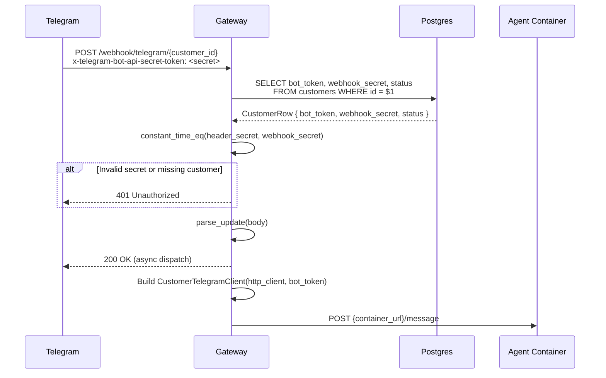
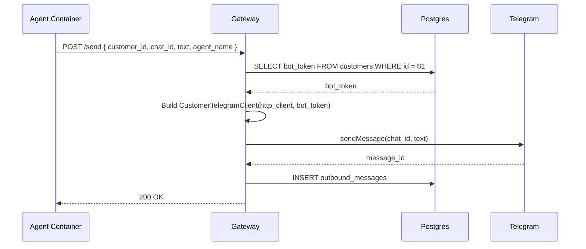
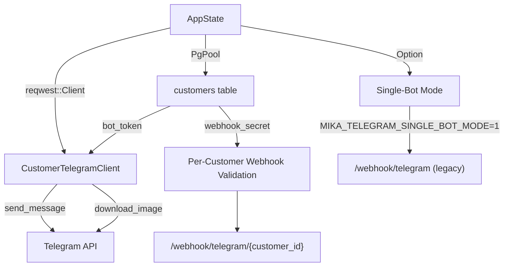

# Per-Customer Telegram Bot Routing

## Summary

Replace the single-shared-bot Telegram architecture in mika-gateway with per-customer bot routing. Each customer brings their own Telegram bot (created via @BotFather); the gateway stores the bot token, validates per-customer webhook secrets, and routes inbound/outbound messages through the correct bot. A backward-compatibility flag (`MIKA_TELEGRAM_SINGLE_BOT_MODE`) preserves the current single-bot behavior for migration.

---

## Problem Frame

The gateway currently holds ONE `TelegramClient` with ONE bot token (`MIKA_TELEGRAM_BOT_TOKEN`). All webhook traffic arrives at `/webhook/telegram` validated against a single `MIKA_TELEGRAM_WEBHOOK_SECRET`. This architecture cannot support multiple customers each with their own bot — a requirement for the per-customer isolation model where each family member (and future paying customer) creates their own bot via @BotFather.

The codebase has mixed/transitional state: `mika-cloud` already provisions per-customer bot tokens into agent pod secrets, but the gateway ignores them entirely. This ticket closes that gap.

---

## Requirements

- **R1.** Customers table stores per-customer `bot_token`, `bot_username`, and `webhook_secret` columns
- **R2.** Inbound webhooks arrive at `/webhook/telegram/{customer_id}` with per-customer secret validation
- **R3.** Outbound messages via `/send` use the customer's own bot token
- **R4.** Image/document downloads use the customer's bot token (Telegram file_ids are bot-specific)
- **R5.** Pairing flow (`/start <token>`) works through per-customer webhook route
- **R6.** Backward compatibility: `MIKA_TELEGRAM_SINGLE_BOT_MODE=1` preserves the current single-bot route and behavior
- **R7.** Gateway boots without `MIKA_TELEGRAM_BOT_TOKEN` when not in single-bot mode

---

## Key Technical Decisions

### KTD-1: TelegramClient architecture — shared HTTP client with per-token wrapper

**Decision:** Add a `CustomerTelegramClient` struct that borrows the shared `reqwest::Client` from `AppState` but carries a customer-specific `SecretString` bot token. The existing `TelegramClient` becomes the single-bot-mode client (optional in `AppState`).

**Rationale:** The `reqwest::Client` connection pool is expensive to construct and should be shared across all customers. Per-call token injection (Option A from the ticket) pollutes every method signature. Ephemeral `TelegramClient` instances (Option B) waste the connection pool. A lightweight wrapper (Option C) gives clean method ergonomics (`customer_client.send_message(chat_id, text)`) while reusing the shared pool.

**Shape:**
```
CustomerTelegramClient {
    client: reqwest::Client,   // borrowed from AppState.http_client
    bot_token: SecretString,   // from customers.bot_token
}
```

All existing `TelegramClient` methods (`send_message`, `download_image`, `get_file`, `set_webhook`) are factored into a trait or duplicated on `CustomerTelegramClient`. The internal helper methods (`api_url`, `download_file_bytes`, `validate_file_path`) are shared.

### KTD-2: Outbound `/send` — customer_id in payload, not chat_id lookup

**Decision:** Add `customer_id: Option<Uuid>` to `SendPayload`. When present, gateway looks up that customer's bot token by primary key. When absent (backward compat), falls back to the global `TelegramClient`.

**Rationale:** The agent pod already knows its `customer_id` (it's the container identity). Looking up bot_token by `chat_id` would require joining `customers` on a non-indexed path and is fragile when a customer hasn't paired yet (no `telegram_chat_id`). Primary key lookup is O(1).

### KTD-3: Bot token storage — ESCALATE to operator (security boundary decision)

**Status: Requires operator sign-off.** Two sound but conflicting arguments exist. The plan cannot unilaterally override the issue body's explicit security guidance. Citation: user_summary ("Operator can correct spec; architect cannot ratify divergence unilaterally"); review-guide.md § Orthogonality (security boundary decisions propagate to every consumer of the customers table).

**Option A — Plaintext in Postgres (plan's original position):**
Store `bot_token` as `TEXT` in the `customers` table, wrapped in `SecretString` in Rust code. The gateway already holds `MIKA_TELEGRAM_BOT_TOKEN` in process memory. The customers table is in the same trust boundary (gateway's own Postgres). Per-customer k8s Secret lookups would add N API calls per webhook (unacceptable latency at the webhook path — every inbound message would pay a k8s API call).

**Option B — k8s Secret refs (issue body's position):**
Store a secret-ref to a per-customer k8s Secret object. Gateway reads on-demand. Matches the existing `mika-agent-{id}-secrets` pattern. Avoids pgcrypto operational complexity. The latency concern is real but could be mitigated by caching.

**Option C — Middle ground (proposed):**
Store `bot_token` in Postgres but encrypted via `pgp_sym_encrypt` (pgcrypto). Gateway holds a symmetric key (from env var `MIKA_BOT_TOKEN_ENCRYPTION_KEY`). Query becomes `SELECT pgp_sym_decrypt(bot_token, $key) FROM customers WHERE id = $1`. This addresses the encrypt-at-rest intent (a DB dump does not leak plaintext tokens) while keeping the lookup to a single Postgres query (no k8s API latency). Operational cost: one additional env var on the gateway, pgcrypto extension enabled in Postgres.

**Implementation note:** Until the operator decides, this plan implements **Option A** (plaintext + `SecretString` in Rust) as the structural default. The column type is `TEXT` regardless of option chosen — Option C wraps the value at write time, transparent to the schema. Switching from A to C is a non-breaking follow-up (backfill existing rows + add decryption to the SELECT).

### KTD-4: Webhook registration — not in gateway startup

**Decision:** The gateway does NOT register webhooks at startup for per-customer bots. Webhook registration (`setWebhook`) happens at provisioning time, which is owned by `mika-cloud`'s console flow (separate ticket). The gateway only exposes the per-customer URL pattern.

**Rationale:** Iterating all active customers and calling `setWebhook` for each at startup adds O(N) Telegram API calls to boot time, is fragile to rate limits, and duplicates logic that already exists in the provisioning path. Telegram webhook registration is idempotent — calling it once at provision time is sufficient.

---

## Scope Boundaries

### In scope
- Database migration adding per-customer Telegram columns
- Per-customer webhook route and validation
- TelegramClient refactor for per-token operations
- Outbound `/send` with per-customer bot token
- Inbound message handler updates (text, photo, document, pairing)
- Backward-compat single-bot mode
- Tests for all new paths

### Deferred to Follow-Up Work
- **mika-cloud provisioning**: `setWebhook`/`deleteWebhook` calls at customer create/delete time (separate mika-cloud ticket)
- **Helm chart updates**: Remove gateway-level `MIKA_TELEGRAM_BOT_TOKEN` from `mika-cloud/helm/mika-gateway/values.yaml`. **Note (scope divergence from issue body AC):** The issue body lists "mika-cloud Helm chart updated to remove the obsolete gateway env vars" as an acceptance criterion. This plan defers it because it is a `mika-cloud` repo change, not a `mika` repo change — the plan's scope is the `mika` crate workspace only. The issue body should be updated to move this AC to "Out of scope / Follow-up" with an edit-notice comment per the issue-as-versioned-contract convention. Citation: user_summary (issue-as-versioned-contract)
- **pgcrypto encryption**: Column-level encryption for `bot_token` in Postgres (see KTD-3 — awaiting operator sign-off on storage approach; if Option C is chosen, this becomes in-scope rather than deferred)
- **Bot token rotation**: Pattern for customer-initiated token rotation
- **Admin API**: Endpoint for manual webhook registration (useful for dev/debug)
- **Webhook registration verification**: Startup health check that validates webhook registration state

---

## High-Level Technical Design

### Inbound Webhook Flow (per-customer)



### Outbound `/send` Flow (per-customer)



### Component Relationship



---

## Implementation Units

### U1. Database Migration 008 — Per-Customer Telegram Columns

**Goal:** Add `bot_token`, `bot_username`, and `webhook_secret` columns to the `customers` table.

**Requirements:** R1

**Dependencies:** None

**Files:**
- `crates/mika-gateway/migrations/008_customer_telegram_bot.sql` (create)

**Approach:** Three nullable `TEXT` columns added via `ALTER TABLE`. All nullable because existing rows have no bot token (they use the global bot). No default values — NULL means "use single-bot mode fallback." No table rebuild needed since these are additive nullable columns (Postgres handles this as metadata-only, no row rewrite).

**Patterns to follow:** Migration 007 (`orchestrator_inbox_messages`) for file naming. Migration 005 for simple `ALTER TABLE ADD COLUMN` pattern.

**Test scenarios:**
- Migration applies cleanly on a fresh database
- Migration applies on a database with existing customer rows (columns are NULL)
- Existing queries against `customers` table continue to work unchanged

**Verification:** `cargo build` succeeds (SQLx compile-time migration check). Existing gateway tests pass.

---

### U2. CustomerTelegramClient — Per-Token Wrapper

**Goal:** Factor Telegram API methods into a reusable shape that works with per-customer bot tokens while sharing the HTTP connection pool.

**Requirements:** R3, R4

**Dependencies:** None (parallel with U1)

**Files:**
- `crates/mika-gateway/src/telegram.rs` (modify)

**Approach:**

Create `CustomerTelegramClient` as a lightweight struct holding `reqwest::Client` (cloned from `AppState.http_client` — Clone is cheap, it's an `Arc` internally) and `SecretString` (the customer's bot token). Implement the same core methods as `TelegramClient`: `send_message`, `download_image`, `set_webhook`.

Extract shared logic (URL construction, file path validation, response parsing) into free functions or a shared trait to avoid code duplication between `TelegramClient` and `CustomerTelegramClient`. The static validation methods (`validate_file_path`) and response types (`TelegramResponse`, `TelegramSendResponse`, etc.) are already standalone — only `api_url`, `send_message`, `download_image`, `get_file`, `download_file_bytes`, and `set_webhook` need dual implementation.

A constructor: `CustomerTelegramClient::new(client: reqwest::Client, bot_token: SecretString)`.

`TelegramClient` remains for single-bot mode — it's constructed at startup with the global token. Both types share the same error type (`TelegramApiError`).

**Patterns to follow:** Existing `TelegramClient` method signatures and error handling patterns. The `SecretString` expose-at-boundary pattern from `docs/solutions/best-practices/secretstring-expose-at-boundary-pattern.md`.

**Test scenarios:**
- `CustomerTelegramClient` constructs from a reqwest::Client and SecretString
- `api_url` produces correct `https://api.telegram.org/bot{token}/{method}` URLs
- `validate_file_path` rejects traversal attacks (existing tests should still pass as the function is shared)
- Error types (`BotBlocked`, `RateLimited`, `Unauthorized`) are consistent between both client types

**Verification:** Existing telegram.rs tests pass. New unit tests for `CustomerTelegramClient` construction.

---

### U3. Per-Customer Webhook Route

**Goal:** Add `POST /webhook/telegram/{customer_id}` route that validates per-customer webhook secrets and dispatches messages using the customer's bot token.

**Requirements:** R2, R5

**Dependencies:** U1, U2

**Files:**
- `crates/mika-gateway/src/routes.rs` (modify)

**Approach:**

Add a new handler `handle_customer_webhook` that:

1. Extracts `customer_id: Uuid` from the path (Axum `Path` extractor)
2. Queries `SELECT id, status, bot_token, webhook_secret FROM customers WHERE id = $1` — extend `CustomerRow` or create a new query struct with the additional fields
3. Validates `x-telegram-bot-api-secret-token` header against the customer's `webhook_secret` using `constant_time_eq`. Returns **401 Unauthorized** for all failure cases: customer not found, invalid secret, or missing webhook_secret. A single 401 for all three prevents customer_id enumeration (an attacker cannot distinguish valid-but-wrong-secret from nonexistent). Citation: review-guide.md § KISS; standard webhook security practice (Stripe, GitHub webhooks return identical responses for invalid vs missing endpoints).
4. Returns 401 if `bot_token` is NULL (customer not yet configured for per-customer bot) — same 401, no distinguishable error shape
5. Parses update via existing `parse_update()`
6. Constructs `CustomerTelegramClient` from `state.http_client` and the customer's `bot_token`
7. Dispatches to modified handler functions that accept a generic telegram client

Register the route in `build_router()`:
```
.route("/webhook/telegram/{customer_id}", post(handle_customer_webhook).layer(RequestBodyLimitLayer::new(64 * 1024)))
```

The existing `/webhook/telegram` route remains — gated behind `MIKA_TELEGRAM_SINGLE_BOT_MODE` in U6.

**Handler refactoring:** The existing `handle_text_message`, `handle_photo_message`, `handle_pairing`, and reply helpers (`BareStart`, `Unsupported`) all use `state.telegram` directly. These need to accept a telegram client parameter instead. Two approaches:
- **(A)** Pass `&dyn TelegramSender` trait object (requires defining a trait)
- **(B)** Pass `CustomerTelegramClient` directly and construct one from the global token in single-bot mode

Approach **(B)** is simpler — `CustomerTelegramClient` is already the right abstraction. In single-bot mode, construct a `CustomerTelegramClient` from the global bot token. This avoids a trait hierarchy.

**Patterns to follow:** Existing `handle_webhook` structure (semaphore acquisition, async dispatch, dedup). The `a2a_routes` handler for `/{customer_id}/{agent_name}` path extraction pattern.

**Test scenarios:**
- Valid customer_id + valid webhook_secret → 200, message forwarded to container
- Valid customer_id + invalid webhook_secret → 401
- Non-existent customer_id → 401 (unified with invalid-secret to prevent enumeration)
- Customer with NULL bot_token → 401 (not configured)
- Customer with status "suspended" → 200 (silent drop, same as existing behavior)
- UUID parsing failure in path → 400 (Axum's Path extractor handles this)
- Semaphore at capacity → 503
- Dedup: duplicate update_id → 200 (no forward)

**Verification:** `cargo test` passes. Manual test with a real Telegram bot webhook (if available) or mock HTTP test.

---

### U4. Update Inbound Message Handlers

**Goal:** Modify all inbound message handlers to accept a customer-specific telegram client instead of using `state.telegram`.

**Requirements:** R4, R5

**Dependencies:** U2, U3

**Files:**
- `crates/mika-gateway/src/routes.rs` (modify)

**Approach:**

Update the signatures of these internal functions to accept a telegram client parameter:

- `handle_text_message` — replace `state.telegram.send_message()` calls (error replies) with the passed client
- `handle_photo_message` — replace `state.telegram.download_image()` with the passed client's method (critical: Telegram file_ids are bot-specific, using the wrong bot token silently fails)
- `handle_pairing` — replace `state.telegram.send_message()` for pairing success/failure replies
- `resolve_customer` — replace `state.telegram.send_message()` for "not paired" reply
- `reply_transient_error` — replace `state.telegram.send_message()`
- `BareStart` and `Unsupported` match arms in the webhook dispatch — these currently use `state.telegram` directly in the spawned task

The modified handlers receive a `CustomerTelegramClient` as a parameter. The caller (either `handle_customer_webhook` or the existing `handle_webhook` in single-bot mode) constructs the appropriate client.

The `forward_error_message` helper and `container_url` function don't use the telegram client — no changes needed.

**Patterns to follow:** The existing handler signatures — keep the same `&AppState` parameter for DB access and container routing; add the telegram client as an additional parameter.

**Test scenarios:**
- Photo message download uses the customer's bot token (not the global one)
- Pairing via per-customer webhook sends replies through the customer's bot
- Error replies (transient error, not paired) use the correct customer bot
- BareStart reply uses the customer's bot token
- Unsupported media type reply uses the customer's bot token

**Verification:** Existing tests pass (they test parsing, not client method dispatch). New integration-style tests verify the correct client is used.

---

### U5. Outbound `/send` with Per-Customer Bot Token

**Goal:** Modify `handle_send` to look up the customer's bot token and send via the customer's bot instead of the global one.

**Requirements:** R3

**Dependencies:** U1, U2

**Files:**
- `crates/mika-gateway/src/routes.rs` (modify)

**Approach:**

Add `customer_id: Option<Uuid>` to `SendPayload`. When `customer_id` is `Some`:
1. Query `SELECT bot_token FROM customers WHERE id = $1`
2. If customer not found or `bot_token` is NULL, return 400 with descriptive error
3. Construct `CustomerTelegramClient` from the customer's bot token
4. Send via `customer_client.send_message(chat_id, text_to_send)`

When `customer_id` is `None` (backward compat):
- Use `state.telegram` if available (single-bot mode)
- Return 400 if no global client and no customer_id (misconfigured)

Error responses (`BotBlocked` → 410, `RateLimited` → 429, etc.) remain unchanged.

The `outbound_messages` INSERT for reply routing remains unchanged — it stores `(telegram_message_id, chat_id, agent_name)` regardless of which bot sent the message.

**Agent-side change required (resolves OQ1):** Agent pods send outbound messages through the gateway's `/send` endpoint via `GatewayMessageSender` (`crates/mika-agent/src/messaging.rs`). The issue body's claim "Already works as-is … No change needed in agent code" is incorrect — the gateway's `/send` handler needs `customer_id` to look up the correct bot token. The required change is small and additive: add `customer_id: Option<String>` to `GatewayMessageSender` (populated from `Settings` or agent identity at construction time in `crates/mika-agent/src/server/mod.rs`), and include it in the JSON payload sent to `/send`. This is a backward-compatible additive field — existing agents without `customer_id` fall back to the global bot. The `GatewayMessageSender` is constructed in ~8 callsites in `server/mod.rs` and `server/handlers.rs`; all receive `customer_id` from the same source (the agent's container identity). This is a **mika-agent change**, not a gateway change, but is required for the gateway's per-customer outbound path to function. The issue body should be updated to correct the "no change needed" statement.

**Patterns to follow:** Existing `handle_send` structure. The `customer_id` field follows the same optional-additive pattern as `request_id` and `agent_name` in `SendPayload`.

**Test scenarios:**
- `/send` with valid `customer_id` → looks up bot token, sends via customer bot, 200
- `/send` with valid `customer_id` but customer not found → 400
- `/send` with valid `customer_id` but NULL bot_token → 400
- `/send` without `customer_id` in single-bot mode → uses global bot, 200
- `/send` without `customer_id` and no global bot → 400
- `/send` with `customer_id` and bot blocked → 410
- `/send` with `customer_id` and rate limited → 429
- Outbound message mapping still stored correctly for reply routing

**Verification:** `cargo test`. Manual test of outbound message delivery if environment available.

---

### U6. Backward Compatibility and Startup Changes

**Goal:** Make `MIKA_TELEGRAM_BOT_TOKEN` and `MIKA_TELEGRAM_WEBHOOK_SECRET` optional. Add `MIKA_TELEGRAM_SINGLE_BOT_MODE` flag to preserve legacy behavior.

**Requirements:** R6, R7

**Dependencies:** U3, U4, U5

**Files:**
- `crates/mika-gateway/src/settings.rs` (modify)
- `crates/mika-gateway/src/main.rs` (modify)
- `crates/mika-gateway/src/routes.rs` (modify — AppState fields)
- `crates/mika-gateway/CLAUDE.md` (modify — document new env vars)

**Approach:**

**Settings changes:**
- `telegram_bot_token: SecretString` → `telegram_bot_token: Option<SecretString>`
- `telegram_webhook_secret: SecretString` → `telegram_webhook_secret: Option<SecretString>`
- Add `telegram_single_bot_mode: Option<String>` (parsed as bool, default false)

**Validation at startup:**
- If `MIKA_TELEGRAM_SINGLE_BOT_MODE=1`: require `telegram_bot_token` and `telegram_webhook_secret` (fail-fast if missing). Register the global webhook as today.
- If single-bot mode off (default): `telegram_bot_token` and `telegram_webhook_secret` are optional. Skip global webhook registration. Log which mode is active.

**AppState changes:**
- `telegram: TelegramClient` → `telegram: Option<TelegramClient>` (populated only in single-bot mode)
- `webhook_secret: SecretString` → `webhook_secret: Option<SecretString>` (populated only in single-bot mode)

**Router changes:**
- The legacy `/webhook/telegram` route is always registered but returns 404 when `state.telegram` is `None` (gateway not in single-bot mode). This avoids conditional route registration complexity.
- The per-customer `/webhook/telegram/{customer_id}` route is always registered.

**CLAUDE.md updates:**
- Document `MIKA_TELEGRAM_SINGLE_BOT_MODE`
- Note that `MIKA_TELEGRAM_BOT_TOKEN` and `MIKA_TELEGRAM_WEBHOOK_SECRET` are now optional (required only in single-bot mode)
- `telegram_webhook_url_template` removed per YAGNI — no consumer exists in this plan. Add it in the future ticket that implements webhook registration (admin endpoint or mika-cloud provisioning). Citation: review-guide.md § YAGNI

**Patterns to follow:** The `orchestrator_inbox_enabled` pattern in settings/main for feature-flag gating. The `github_webhook_secret: Option<SecretString>` pattern for optional secrets.

**Test scenarios:**
- Gateway boots without `MIKA_TELEGRAM_BOT_TOKEN` when `MIKA_TELEGRAM_SINGLE_BOT_MODE` is not set
- Gateway boots with `MIKA_TELEGRAM_BOT_TOKEN` when `MIKA_TELEGRAM_SINGLE_BOT_MODE=1`
- Gateway fails to boot with `MIKA_TELEGRAM_SINGLE_BOT_MODE=1` but no `MIKA_TELEGRAM_BOT_TOKEN`
- Legacy `/webhook/telegram` returns 404 when not in single-bot mode
- Legacy `/webhook/telegram` works normally in single-bot mode
- Per-customer `/webhook/telegram/{customer_id}` works in both modes

**Verification:** `cargo build`, `cargo test`, `cargo clippy`. Gateway starts in both modes.

---

## Open Questions

- **~~OQ1.~~ Agent-side SendPayload update (RESOLVED):** Agent pods send outbound messages via `GatewayMessageSender` (`crates/mika-agent/src/messaging.rs`) through the gateway's `/send` endpoint. `GatewayMessageSender` does NOT currently carry `customer_id`. The required change: add `customer_id: Option<String>` to `GatewayMessageSender`, populated from agent container identity at construction time, and serialize it into the `/send` JSON payload. This contradicts the issue body's "no change needed in agent code" claim — the issue body should be updated. See U5 for the full agent-side change description.
- **OQ2. Webhook URL template source:** When mika-cloud calls `setWebhook`, it needs to know the gateway's public URL. Currently `MIKA_TELEGRAM_WEBHOOK_URL` is a single URL. The template pattern (`https://gateway.getmika.ai/webhook/telegram/{customer_id}`) belongs in mika-cloud's provisioning config, not the gateway — the gateway does not construct webhook URLs in this plan (KTD-4 defers registration to mika-cloud). Resolve in the mika-cloud follow-up ticket. The `telegram_webhook_url_template` setting was removed from U6 per YAGNI (no consumer in this plan).

---

## System-Wide Impact

- **Database:** Additive migration, no table rebuild. Existing queries unaffected (new columns are nullable and not referenced by existing code).
- **API contract:** `/send` payload gains optional `customer_id` field — backward compatible. `/webhook/telegram/{customer_id}` is a new endpoint. Legacy `/webhook/telegram` behavior unchanged in single-bot mode.
- **Configuration:** `MIKA_TELEGRAM_BOT_TOKEN` and `MIKA_TELEGRAM_WEBHOOK_SECRET` become optional. Existing deployments with these vars set continue to work unchanged (explicit single-bot mode or implicit fallback).
- **Cross-repo:** `mika-cloud` provisioning must call `setWebhook` with the per-customer URL and store `bot_token` + `webhook_secret` in the customers table. This is a separate ticket.
- **Performance:** Per-customer webhook path adds one DB query (customer lookup by PK) compared to the current path (customer lookup by chat_id). Net change is negligible — PK lookup replaces the existing chat_id lookup, not adding a second query.

---

## Sources & Research

- Ticket: mika#1454 — full architecture analysis and scope definition
- `docs/solutions/integration-issues/multi-agent-telegram-delivery-and-reply-routing.md` — existing multi-agent message routing architecture
- `docs/solutions/best-practices/secretstring-expose-at-boundary-pattern.md` — SecretString handling pattern
- `docs/solutions/logic-errors/send-message-chat-id-zero-no-channel-sentinel.md` — chat_id=0 sentinel handling (relevant for /send backward compat)
- `crates/mika-gateway/CLAUDE.md` — gateway architecture reference

---

## Revision history

- rev 2 (2026-06-09): addressed F1 by resolving OQ1 — confirmed agent pods use `GatewayMessageSender` via gateway `/send`, documented required `customer_id` addition to `GatewayMessageSender` in U5, corrected issue body's "no change needed" claim; addressed F2 by adding explicit scope-divergence note to the Helm chart deferral with citation to issue-as-versioned-contract convention; addressed F3 by restructuring KTD-3 as an operator-escalation with three options (plaintext, k8s secret-ref, pgcrypto middle ground) — cannot resolve unilaterally per "operator can correct spec; architect cannot ratify divergence" (architect's call on second-pass); addressed F4 by unifying all webhook validation failures to 401 Unauthorized (customer not found, invalid secret, missing secret all return 401) to prevent customer_id enumeration, updated test scenarios; addressed F5 by removing `telegram_webhook_url_template` from U6 settings — no consumer exists in this plan, add in the future ticket that needs it (YAGNI per review-guide.md).
