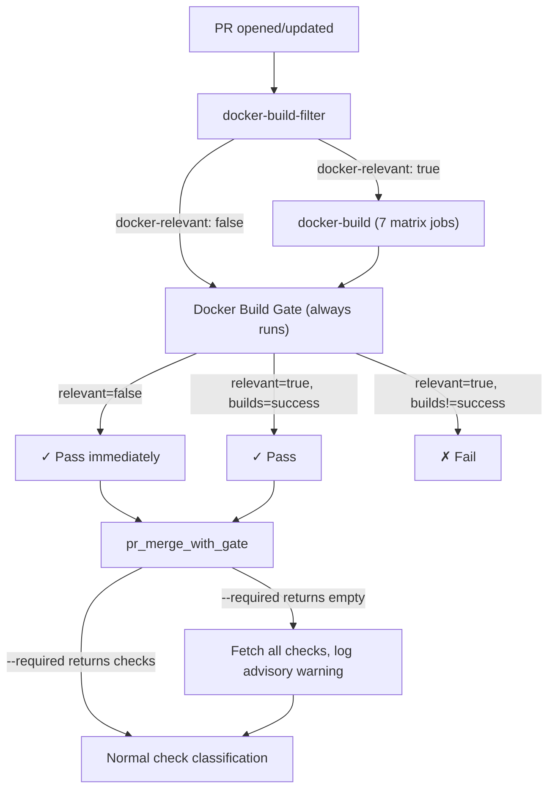

# Gate os/Dockerfile Docker builds as required CI checks before merge

## Summary

Add a CI gateway job (`Docker Build Gate`) that blocks PRs touching `os/Dockerfile` paths from merging until all per-role Docker build matrix jobs pass. Enhance `pr_merge_with_gate` with an advisory all-checks fallback when no required checks are configured as defense-in-depth.

---

## Problem Frame

`os/Dockerfile` per-role Docker build jobs run as a path-filtered matrix in CI (`docker-build` job in `.github/workflows/ci.yml`), but they cannot block merges because:

1. No branch protection exists on `main` — zero required status checks.
2. `pr_merge_with_gate` calls `gh pr checks --required`, which returns `[]` when no checks are marked required. `classify_checks([])` returns `AllPassed`, so the tool merges immediately.
3. Docker builds are PR-only — the `docker-build-filter` job has `if: github.event_name == 'pull_request'`, so they never run on push to main.

Evidence: PR #1480 (mika#1247) merged 2026-06-11T11:11:12Z with 5 docker-build matrix jobs still IN_PROGRESS. The builds became orphaned zombies.

---

## Requirements

**CI gate**

- R1. A PR modifying `os/Dockerfile` or `os/**` cannot merge until its per-role docker-build jobs (`mika-os`, `mika-runtime-server`, `mika-runtime-gateway`, `mika-runtime-cli`, `mika-runtime-all`) and legacy jobs (`mika-agent`, `mika-gateway`) conclude green.
- R2. Non-os PRs are not blocked or delayed by the Docker build matrix.
- R3. The bypass-actor direct-merge path still works for cases it's needed.

**Defense-in-depth**

- R4. When `pr_merge_with_gate` finds zero required checks, it fetches all checks and logs an advisory warning if non-required checks are pending or failing.
- R5. The advisory check does not block merges — it surfaces the gap for operator awareness.

**Post-merge validation**

- R6. Docker builds run on push to `main` when Docker-relevant paths change, catching broken Dockerfiles that slip through.

---

## Key Technical Decisions

- **CI gateway job pattern over branch protection alone.** GitHub's path-filtered jobs cannot be marked as required without deadlocking non-matching PRs. The standard solution is an always-running gateway job that either short-circuits or waits for the path-filtered jobs. This is the primary fix; branch protection is a recommended follow-up configuration step.
- **Advisory-only all-checks fallback.** Changing `pr_merge_with_gate` to block on non-required checks would be a behavioral change affecting all repos. Instead, add a warning-only fallback that surfaces the gap without breaking existing flows.
- **`if: always()` on the gateway job.** Required because `docker-build` may be skipped when `docker-relevant == false`. Without `always()`, the gateway would also be skipped and never report a status, defeating the purpose.
- **Push-to-main Docker builds as belt-and-suspenders.** Extend `docker-build-filter` and `docker-build` to also run on `push` events to `main` when Docker-relevant paths change. Catches regressions even if the PR gate is bypassed.

---

## Scope Boundaries

### Deferred to Follow-Up Work

- **Branch protection configuration.** Adding required status checks on `main` (including `Docker Build Gate`, `Check`, `Dashboard`) with bypass actors requires GitHub admin access and is a manual operator step. The plan documents the recommended configuration but does not automate it.
- **`ci_success_handler` and `verdict_handler` awareness.** These server-side handlers reuse `run_gh_checks --required` from `pr_merge_with_gate`. If branch protection is configured with required checks, they automatically benefit. No code changes needed in these handlers for the current fix.

---

## High-Level Technical Design

---

## Implementation Units

### U1. Add `docker-build-gate` CI gateway job

**Goal:** Create an always-running PR job that gates on Docker build results without deadlocking non-Docker PRs.

**Requirements:** R1, R2

**Dependencies:** None

**Files:**
- `.github/workflows/ci.yml`

**Approach:** Add a `docker-build-gate` job after the existing `docker-build` job. It uses `needs: [docker-build-filter, docker-build]` with `if: always()` to run on every PR regardless of path filter outcome. The step checks `needs.docker-build-filter.outputs.docker-relevant`: when `false`, exits 0 immediately; when `true`, checks `needs.docker-build.result` and exits non-zero unless `success`.

**Patterns to follow:** The existing `docker-build` job's `needs: docker-build-filter` and conditional `if` pattern. The `pipeline-artifacts` job's `if: github.event_name == 'pull_request'` pattern for PR-only gating.

**Test scenarios:**
- PR touching `os/Dockerfile`: `Docker Build Gate` waits for all 7 docker-build matrix jobs. If any fail, gate fails.
- PR touching only `src/main.rs`: `docker-relevant == false`, gate passes immediately with no delay.
- PR touching `Cargo.toml` (triggers Docker builds via path filter): gate waits for builds.
- Docker builds cancelled (e.g., concurrency cancellation): `needs.docker-build.result` is `cancelled`, gate fails.

**Verification:** Open a test PR that modifies `os/Dockerfile`. Verify `Docker Build Gate` shows as a pending check while docker-build matrix jobs run. Verify it turns green only after all matrix jobs pass.

---

### U2. Extend Docker builds to run on push to main

**Goal:** Catch broken Dockerfiles on `main` even if the PR gate is bypassed.

**Requirements:** R6

**Dependencies:** None (can be done in parallel with U1)

**Files:**
- `.github/workflows/ci.yml`

**Approach:** Modify the `docker-build-filter` job to also run when `github.event_name == 'push'` (it currently only runs on `pull_request`). The `docker-build` job's `if` condition already checks the filter output, so it will naturally run on push events when relevant paths change. The gateway job (U1) should remain PR-only since its purpose is merge gating.

**Patterns to follow:** The existing `check` job runs on both `push` and `pull_request` events via the top-level `on:` trigger (already configured). The `docker-build-filter` job just needs its `if: github.event_name == 'pull_request'` guard removed (or changed to include push).

**Test scenarios:**
- Push to `main` with `os/Dockerfile` change: docker-build matrix runs on main.
- Push to `main` with only Rust code: docker-build matrix is skipped (path filter returns false).
- PR to non-main branch: docker-build still runs via PR trigger (unchanged behavior).

**Verification:** After merging, verify that the merge commit's CI run shows Docker builds (not `skipped`/`Docker Build Filter: skipped`) when `os/Dockerfile` was changed.

---

### U3. Add advisory all-checks fallback in `pr_merge_with_gate`

**Goal:** Surface a diagnostic warning when no required checks are configured, alerting operators that the merge gate has no teeth.

**Requirements:** R4, R5

**Dependencies:** None (independent of U1/U2)

**Files:**
- `crates/mika-agent/src/tools/pr_merge_with_gate.rs`

**Approach:** After `run_gh_checks` with `--required` returns an empty list, run a second `run_gh_checks` call without `--required` to fetch all checks. If any non-required checks are in `fail` or `pending` bucket, emit a `warn!` log with `event = "merge_gate_no_required_checks"` listing the check names and states. The tool still proceeds with its normal flow (`AllPassed` for empty required checks). Add a new helper function `run_gh_all_checks` that calls `gh pr checks` without the `--required` flag, and a `check_advisory_all_checks` function that performs the advisory check.

The advisory warning should include: the fact that no required checks exist (suggesting branch protection is not configured), and the names/states of any non-required checks that are pending or failing.

**Patterns to follow:** The existing `run_gh_checks` function shape — same subprocess call pattern, same `GhCheck` deserialization. The existing `warn!` logging pattern with structured fields.

**Test scenarios:**
- Required checks empty, all non-required checks pass: no warning emitted, merge proceeds normally.
- Required checks empty, some non-required checks pending: warning emitted with check names, merge proceeds.
- Required checks empty, some non-required checks failing: warning emitted with check names, merge proceeds.
- Required checks empty, no checks at all: no warning emitted (nothing to warn about).
- Required checks present: advisory check skipped entirely (branch protection is configured, the normal flow handles it).
- `run_gh_all_checks` subprocess fails: warning logged, merge proceeds (fail-open for advisory).

**Verification:** Deploy the change, attempt a merge on a repo with no branch protection. Verify the warning appears in server logs when non-required checks are pending.

---

### U4. Document branch protection configuration

**Goal:** Provide operator instructions for configuring branch protection as the recommended follow-up.

**Requirements:** R3

**Dependencies:** U1 (the gateway job must exist before it can be marked as required)

**Files:**
- `docs/solutions/best-practices/` (new solution doc)

**Approach:** Create a solution doc covering: which checks to mark as required (`Docker Build Gate`, `Check`, `Dashboard`, `Pipeline Artifacts`), how to configure bypass actors for the PAT-based direct-merge path, and the interaction with `pr_merge_with_gate`'s `--required` flag. Include a note that once branch protection is configured, the U3 advisory fallback becomes a no-op (required checks will be returned by `--required`).

**Test expectation:** none — documentation only.

**Verification:** Operator follows the doc to configure branch protection. A test PR with failing Docker builds is blocked from merge.

---

## Risks & Dependencies

| Risk | Mitigation |
|------|-----------|
| `if: always()` on gateway job runs even when the workflow is cancelled, creating noise | The gateway checks `needs.docker-build.result` — cancelled builds produce `cancelled` result, which the gate correctly fails on |
| Docker builds are slow (Gentoo stage3), blocking PRs that touch `Cargo.toml`/`crates/**` | These PRs already trigger docker builds today — the gate just makes the existing builds blocking instead of fire-and-forget. GHA cache is already configured |
| Push-to-main docker builds fail, no automatic remediation | Post-merge builds are catch-and-alert only. Operator must investigate. The PR gate (U1) is the primary prevention |
| Advisory fallback (U3) adds a second `gh pr checks` API call on every merge | Only fires when required checks are empty — a degenerate configuration that should be temporary. Once branch protection is configured, this path is never hit |

---

## Sources & Research

- `.github/workflows/ci.yml` — existing CI workflow with `docker-build-filter` (line 177-203) and `docker-build` (line 204-241) jobs
- `crates/mika-agent/src/tools/pr_merge_with_gate.rs` — merge gate tool using `gh pr checks --required` (line 536-563) and `classify_checks` (line 483-496)
- `os/Dockerfile` — multi-stage Gentoo build with 6 named targets
- mika#1247 / PR #1480 — founding incident where 5 docker-build matrix jobs were orphaned mid-build at merge time
- GitHub docs on path-filtered required checks: the gateway-job pattern is the documented workaround for path-filtered checks that need to be required
