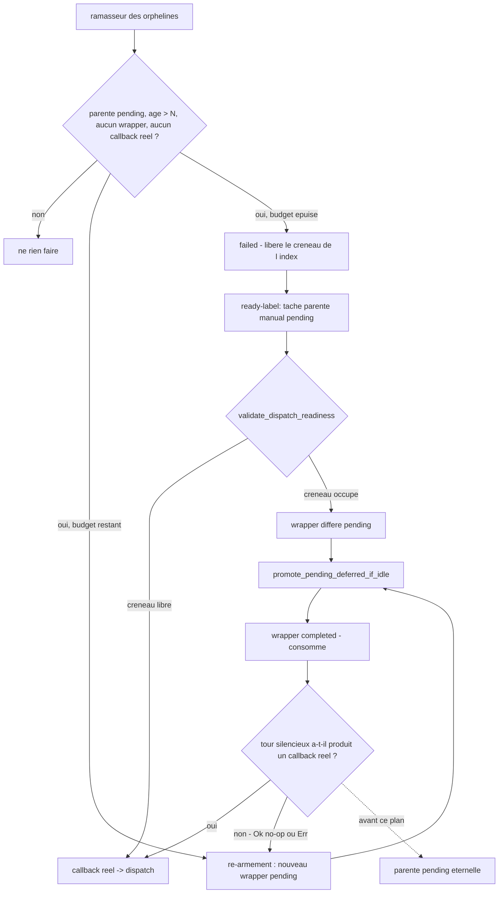

# Figement des tâches pending — ré-armement, expiration et sonde - Plan

## Goal Capsule

- **Objective:** une issue qui porte `ready` finit par être prise. Aucune ne peut rester indéfiniment comptée dans la file sans que personne ne travaille dessus, et si elle attend anormalement longtemps, l'opérateur l'apprend sans interroger la base.
- **Means:** rendre une tâche `pending` orpheline re-tentable au lieu de la laisser occuper à jamais le créneau de `idx_tasks_manual_active_ref_url` — ré-armement borné d'abord, expiration ensuite, sonde par-dessus (KTD2, KTD3).
- **Authority:** les mesures portées par mika#2045 et mika#2044 priment sur toute ré-observation. Le code `crates/mika-agent/src/task_engine/` prime sur la description qu'en donne le ticket.
- **Stop conditions:** ne pas toucher au partage de créneau par classe (`derive_dispatch_class`, `has_active_callback_tasks_excluding`) ni relâcher la garde anti-cascade de mika#1124. Ne pas supprimer ni relâcher `idx_tasks_manual_active_ref_url`.
- **Execution profile:** correctif de substrat p0 sur la boucle autonome. Chaque unité porteuse de comportement s'accompagne d'un test anti-vacuité qui échoue sans le correctif.
- **Tail ownership:** l'unité U5 laisse une trace exploitable dans `server.log` ; c'est elle qui remplace la remédiation manuelle décrite dans les commentaires de mika#2045.

---

## Product Contract

### Summary

Une tâche `manual` de `mika-dev` refusée pour créneau occupé est représentée dans la file par un *wrapper différé*. Ce plan garantit qu'un wrapper consommé sans avoir produit de dispatch réel est remplacé, que la tâche qu'il représentait est expirée si le remplacement échoue, et qu'un opérateur voit le phénomène pendant qu'il se produit.

### Problem Frame

Le chemin `ready-label` pré-crée une tâche parente `manual` (`crates/mika-agent/src/server/ready_label_handler.rs:170-205`), puis appelle `validate_dispatch_readiness`. Quand le créneau de la classe est occupé, le refus enregistre un wrapper différé enfant de cette parente (`crates/mika-agent/src/skills/executor.rs:1140-1200`, `register_deferred_callback` à `executor.rs:1903`).

La promotion de ce wrapper est destructive : `UPDATE tasks SET status='completed'` (`crates/mika-agent/src/db.rs:7426-7507`). Le wrapper quitte l'état `pending`, donc il quitte définitivement la file différée. Si le tour silencieux qui suit ne produit pas de dispatch réel, plus rien ne représente la tâche parente. Elle reste `pending` pour toujours, et l'index partiel `UNIQUE(agent_id, reference_url)` — `crates/mika-agent/src/db.rs:3045-3051`, exclut `completed/cancelled/failed/delivered` — interdit à une remplaçante de naître. L'issue porte `ready`, la file la compte, rien ne la prendra.

Deux chemins de consommation-sans-dispatch existent aujourd'hui dans `crates/mika-agent/src/task_engine/dispatcher.rs:495-600` :

1. `run_silent_agent` renvoie `Err` : on journalise `resume_agent run failed` et on ne fait rien — ni `mark_task_delivered`, ni détection R9, ni ré-inscription. Silence total.
2. `run_silent_agent` renvoie `Ok` sans que le tour ait appelé l'outil de dispatch : la détection R9 de mika#1124 émet `deferred_dispatch_noop_completion`, puis s'arrête. C'est un avertissement, pas une réparation.

Le chemin 1 explique l'occurrence mesurée du 2026-08-29 : `deferred_dispatch_noop_completion` a zéro occurrence entre 09:10Z et 09:51Z alors que quatre tâches se figeaient (mika#2045, commentaire 09:52Z). Huit `deferred_dispatch_promoted` (09:19→09:24) ont drainé la file ; les quatre tâches ne sont jamais ressorties.

Aucun ramasseur ne couvre ce cas. `reap_orphaned_parent_tasks` (#871), `complete_parent_tasks_on_callback_success` (#1162) et `reap_childless_stuck_parent_tasks` (#1687) filtrent tous sur `parent.status = 'in_progress'` (`crates/mika-agent/src/db.rs:7054-7086`). Une parente restée `pending` n'est vue par aucun d'eux.

Le coût est direct : 1966 `ready_label_task_create_failed` contre 1234 `ready_label_engine_dispatched` — la création de tâche échoue plus souvent qu'elle ne réussit (mika#2044). Et l'échec est muet : le message journalise l'erreur SQL brute sans nommer l'issue victime (`crates/mika-agent/src/server/ready_label_handler.rs:193-201`).

### Key Decisions

- **Le marqueur de figement est l'absence de wrapper, pas l'âge seul.** Une `pending` de 33 minutes derrière un créneau légitimement occupé est nominale (mika#2045, commentaire 10:36Z). Gouverne R1, R2, R4.
- **`fired_at` est banni comme marqueur.** 27 lignes renseignées sur 2334 : il ne sépare pas les deux populations (mika#2044, commentaire 07:35Z). Gouverne R1.
- **Réparer avant de jeter.** Une tâche expirée perd son travail ; une tâche ré-armée le reprend. Gouverne R3, R5.

### Requirements

**Classification**

- R1. Une tâche parente est *orpheline* quand elle est `pending`, plus vieille que le délai de grâce, qu'aucun wrapper différé `pending` ne la référence comme parent, et qu'aucun callback non-différé actif ne la référence non plus.
- R2. Une tâche parente qui possède un wrapper différé `pending` n'est jamais orpheline, quel que soit son âge.

**Ré-armement (volet a)**

- R3. Un wrapper différé qui se termine sans avoir produit de callback non-différé actif pour sa parente provoque l'inscription d'un wrapper de remplacement.
- R4. Le remplacement ne promeut rien en ligne : il dépose un wrapper `pending` que le filet périodique promouvra quand le créneau de la classe sera libre.
- R5. Le nombre de remplacements par tâche parente est borné ; au-delà, la tâche n'est plus ré-armée.

**Expiration (volet b)**

- R6. Une tâche orpheline est d'abord ré-armée. Elle n'est expirée que si le ré-armement échoue ou si son budget de ré-armements est épuisé.
- R7. L'expiration place la tâche en `failed`, ce qui la fait sortir de l'index partiel et permet au balayage `ready` de créer une remplaçante.
- R8. Le délai de grâce est configurable par variable d'environnement et vaut 2700 secondes (45 minutes) par défaut.

**Visibilité (volet c)**

- R9. Une sonde énumère les tâches orphelines avec leur issue, leur âge et leur nombre de ré-armements, en sortie lisible et en JSON.
- R10. Chaque ré-armement et chaque expiration émettent un événement structuré nommé et un événement d'audit.
- R11. `ready_label_task_create_failed` nomme l'issue refusée, l'identifiant de la tâche bloquante et son âge en secondes, dans des champs séparés.

### Scope Boundaries

**Dans le périmètre**

- Le cycle de vie des tâches parentes `manual` / `source='self_dev'` / `type='issue'` de la boucle autonome.
- Les deux chemins de terminaison d'un wrapper différé dans `dispatch_resume_agent`.

**Hors périmètre — reporté**

- Remplacer la promotion destructive par une promotion réversible (`pending` → `in_progress` → `completed`). Changement de forme plus large ; le ré-armement obtient le même résultat sans toucher au contrat de `promote_next_deferred_callback`.
- Diagnostiquer *pourquoi* un tour silencieux de wrapper échoue ou n'appelle pas l'outil. C'est la classe de mika#2029, distincte : ce plan garantit la reprise quelle qu'en soit la cause.

**Hors périmètre — hors identité**

- Relâcher ou supprimer `idx_tasks_manual_active_ref_url`. L'unicité est la protection contre le double dispatch ; le défaut est l'absence de sortie, pas l'index.
- Relâcher la garde anti-cascade de mika#1124. R4 existe précisément pour la respecter.

### Sources

- mika#2045 — corps et quatre commentaires de mesure (07:33Z, 08:41Z, 09:52Z, 10:36Z).
- mika#2044 — mesure fondatrice et sa correction sur `fired_at` (07:35Z).
- mika#1124 — garde anti-cascade et détection R9, citée en commentaire dans `crates/mika-agent/src/task_engine/dispatcher.rs:517-545`.
- mika#1011, mika#1070, mika#1175 — histoire de la promotion différée, inline puis par classe.
- `crates/mika-agent/src/db.rs:7566-7598` — `force_promote_deferred_for_class` et `ForcePromoteResult`.

---

## Planning Contract

### Key Technical Decisions

- KTD1. **Classer par prédicat lié à la tâche, pas par classe de dispatch.** La mesure du ticket distinguait orpheline et en-file via `mika tasks promote-deferred`, dont la réponse est portée par la classe. Le ramasseur peut faire mieux : `register_deferred_callback` fixe `parent_task_id` sur la tâche refusée (`crates/mika-agent/src/skills/executor.rs:1950-1953`), donc « existe-t-il un wrapper `pending` dont `parent_task_id` vaut cette tâche » répond exactement, tâche par tâche. Le prédicat par classe aurait déclaré orphelines toutes les tâches en attente derrière un créneau occupé — c'est le faux positif que R2 interdit. Gouverne R1, R2.
- KTD2. **Ré-armer en déposant un wrapper `pending`, jamais en promouvant en ligne.** mika#1124 a supprimé le chaînage en ligne parce que N wrappers promus d'affilée sans dispatch réel produisent une cascade qui vide la file. Déposer un wrapper `pending` rend la main au promoteur périodique `promote_pending_deferred_if_idle` (`crates/mika-agent/src/task_engine/engine.rs:586-604`), qui vérifie le créneau avant de promouvoir. Le ré-armement n'est pas la cascade que mika#1124 a fermée : celle-ci promouvait le wrapper *suivant*, celui d'une autre tâche, N fois dans la même pile d'appels. Le ré-armement insère une ligne `pending` pour *sa propre* parente et rend la main — aucune promotion, aucune récursion. Gouverne R3, R4.
- KTD3. **Budget de ré-armement porté par un compteur dédié dans `metadata` de la parente.** Compter les wrappers déjà créés pour la parente confondrait les inscriptions légitimes du chemin de refus avec les réparations. Un compteur `stuck_rearm_count` ne compte que les réparations. Il est **partagé** par les deux chemins de réparation — le ré-armement en ligne de U2 et celui du ramasseur de U3 l'incrémentent tous deux — de sorte que le budget borne le *total* des tentatives, pas chaque chemin séparément. Budget : 2, soit trois passages au plus par tâche. Il est porté par la colonne `metadata`, via `set_task_metadata_field` (`crates/mika-agent/src/db.rs:7173`), le mécanisme que le chien de garde des callbacks utilise déjà pour `first_dead_at`. Gouverne R5, R6.
- KTD4. **Délai de grâce à 2700 s.** La transition nominale `pending` → `failed` a été mesurée entre 17 et 25 minutes sur l'historique complet de mika#1887 (mika#2044, commentaire 07:35Z). 45 minutes est à 1,8× le haut de cette fenêtre et reste sous l'heure, comme le ticket l'exige. Variable `MIKA_STUCK_PENDING_REAPER_GRACE_SECS`, même forme que `MIKA_CHILDLESS_PARENT_REAPER_GRACE_SECS` (`crates/mika-agent/src/task_engine/engine.rs:44`). Gouverne R8.
- KTD5. **Le ré-armement traite les deux terminaisons du wrapper, y compris la branche `Err`.** Le chemin `Err` de `run_silent_agent` est aujourd'hui muet ; c'est lui qui correspond à l'occurrence mesurée du 09:10–09:51Z, où `deferred_dispatch_noop_completion` n'a pas firé. Ne traiter que la branche `Ok` laisserait le défaut observé intact. Gouverne R3, R10.

### High-Level Technical Design

Deux boucles de réparation se recouvrent volontairement. Le ré-armement en ligne (U2) agit à la seconde où le wrapper se consomme ; le ramasseur des orphelines (U3) est le filet qui rattrape tout chemin de consommation non couvert, y compris ceux qu'aucune lecture n'a encore nommés. La sonde (U4) reste vraie dans les deux cas.

### Assumptions

- La lecture de `stuck_rearm_count` tolère une valeur absente ou illisible en la traitant comme zéro. `set_task_metadata_field` construit le JSON par `json_set(COALESCE(metadata, '{}'), …)` (`crates/mika-agent/src/db.rs:7173-7179`), donc l'écriture est sûre ; c'est la lecture qui doit être indulgente.
- Le tour silencieux d'un wrapper ré-armé rejoue `original_call`, qui porte déjà `task_id` de la parente et le drapeau `__internal_deferred_dispatch` (`crates/mika-agent/src/skills/executor.rs:1926-1943`). Le ré-armement recopie ce `action_config` tel quel.

### Sequencing

U1 fournit les prédicats que U2, U3 et U4 consomment — elle passe en premier. U2 vient ensuite : elle extrait `rearm_deferred_callback`, que U3 appelle. U4 dépend de U1 seule. U5 est indépendante de tout le reste et peut être faite à n'importe quel moment.

---

## Implementation Units

### U1. Prédicats de classification en base

- **Goal:** répondre « cette tâche est-elle orpheline ? » sans ambiguïté, et énumérer celles qui le sont.
- **Requirements:** R1, R2
- **Files:** `crates/mika-agent/src/db.rs`, `crates/mika-agent/src/async_db.rs`
- **Approach:** ajouter `has_pending_deferred_wrapper_child(agent_id, parent_task_id) -> bool` (`trigger_type='callback'`, `status='pending'`, `label = 'long_running:run_claude_pilot:deferred'`, `parent_task_id = ?`) et `find_orphaned_pending_issue_tasks(agent_id, grace_seconds) -> Vec<OrphanedPendingTask>`. La seconde reprend la forme de `find_childless_stuck_parent_tasks` (`crates/mika-agent/src/db.rs:7054-7086`) : mêmes filtres `source='self_dev'`, `trigger_type='manual'`, `type='issue'`, même `strftime` sur `created_at`, mais `status='pending'` et **deux** `NOT EXISTS` au lieu du `NOT EXISTS` sur tout enfant : aucun enfant `callback` `pending` portant le label différé, et aucun enfant `callback` `pending`/`in_progress` ne portant **pas** ce label. Le second exclut la parente dont le dispatch réel est en vol, que le premier laisserait passer. L'âge est mesuré sur `created_at` et non sur `updated_at` : R2 protège déjà la tâche ré-armée, donc rien n'a besoin de redémarrer la fenêtre. La structure retournée porte `id`, `reference_url`, `created_at`, `age_seconds`, `rearm_count`. Exposer les deux via `async_db.rs`.
- **Test Scenarios** (`crates/mika-agent/src/db.rs`, module de tests) :
  - Parente `pending` de 60 min sans aucun enfant → orpheline.
  - Parente `pending` de 60 min avec un wrapper différé `pending` → **non** orpheline. C'est le test anti-vacuité de R2.
  - Parente `pending` de 60 min dont le seul wrapper différé est `completed` → orpheline.
  - Parente `pending` de 10 min sans wrapper → non orpheline (sous le délai).
  - Parente `in_progress` de 60 min sans wrapper → non retournée (hors population).
  - Parente `pending` de 60 min avec un callback **non**-différé actif → non orpheline.
  - Tâche d'un autre agent → non retournée.
- **Verification:** `cargo test -p mika-agent db::tests`

### U2. Ré-armement à la consommation du wrapper

- **Goal:** un wrapper qui se consomme sans avoir dispatché laisse derrière lui un wrapper de remplacement.
- **Requirements:** R3, R4, R5
- **Files:** `crates/mika-agent/src/task_engine/dispatcher.rs`, `crates/mika-agent/src/skills/executor.rs`
- **Approach:** extraire de `register_deferred_callback` une fonction `rearm_deferred_callback(db, parent_task_id, source_action_config) -> bool` qui recopie `action_config` du wrapper consommé, respecte le plafond `MAX_PENDING_DEFERRED_CALLBACKS` déjà en place et incrémente `stuck_rearm_count` sur la parente (KTD3). Dans `dispatch_resume_agent` (`crates/mika-agent/src/task_engine/dispatcher.rs:495-600`), l'appeler depuis les deux terminaisons (KTD5) : la branche `Err(e)` de `run_silent_agent` quand `task.label == DEFERRED_DISPATCH_LABEL`, et la branche R9 `Ok(false)` de `has_non_deferred_active_callback_child`. Ne jamais appeler `dispatch_next_deferred_callback` depuis ce chemin (KTD2). Émettre `deferred_dispatch_rearmed` avec `task_id`, `parent_task_id`, `rearm_count`, `cause` (`silent_turn_error` | `noop_completion`), plus l'événement d'audit correspondant.
- **Test Scenarios** (`crates/mika-agent/tests/eval/test_deferred_wrapper_rearm.rs`, nouveau) :
  - Wrapper consommé, parente sans callback réel actif, budget disponible → un wrapper `pending` frais existe pour la parente, `rearm_count` vaut 1.
  - Même cas avec `stuck_rearm_count` déjà au budget → aucun wrapper créé, aucune erreur.
  - Wrapper consommé alors que la parente **a** un callback non-différé actif → aucun ré-armement. Test anti-vacuité : le chemin sain n'est pas touché.
  - Wrapper consommé par la branche `Err` → ré-armement effectué et `cause = silent_turn_error`. Ce test échoue sans le correctif.
  - Ré-armement au plafond `MAX_PENDING_DEFERRED_CALLBACKS` → retourne `false` sans insérer.
  - `action_config` du wrapper de remplacement identique à celui du wrapper consommé, drapeau `__internal_deferred_dispatch` conservé.
- **Verification:** `cargo test -p mika-agent --test eval test_deferred_wrapper_rearm`

### U3. Ramasseur des tâches pending orphelines

- **Goal:** aucune tâche orpheline ne survit indéfiniment, et aucune tâche patiente n'est tuée.
- **Requirements:** R6, R7, R8
- **Files:** `crates/mika-agent/src/task_engine/engine.rs`
- **Approach:** ajouter `reap_orphaned_pending_issue_tasks()` et l'appeler dans le bloc `DB_SCAN_INTERVAL_TICKS` de `tick()` (`crates/mika-agent/src/task_engine/engine.rs:330-385`), après `reap_childless_stuck_parent_tasks` pour que les cas `in_progress` se résolvent d'abord. Ajouter `MIKA_STUCK_PENDING_REAPER_GRACE_SECS` et son accesseur sur le modèle de `childless_parent_reaper_grace_secs` (`crates/mika-agent/src/task_engine/engine.rs:1941-1947`), défaut 2700 (KTD4). Pour chaque candidat de `find_orphaned_pending_issue_tasks`, si `stuck_rearm_count < 2` : appeler `rearm_deferred_callback` avec l'`action_config` du wrapper le plus récent de la parente. Si la parente n'a jamais eu de wrapper, le reconstruire depuis ses propres colonnes — `dispatch_class` donne le `skill` (`implement` → `dev-pilot`, `groom` → `dev-groom`), `reference_url` donne le `prompt` sous la forme `<repo>#<num>`, et `task_id` est la parente — c'est-à-dire exactement le `dispatch_input` que `ready_label_handler` construit (`crates/mika-agent/src/server/ready_label_handler.rs:294-303`), plus le drapeau `__internal_deferred_dispatch`. Sinon, ou si le ré-armement retourne `false`, passer la tâche en `failed` avec un `result` nommant la cause, **et annuler d'abord tout wrapper différé résiduel de cette parente** : un wrapper survivant promu après l'expiration rejouerait un dispatch visant une parente morte pendant qu'une remplaçante existe déjà pour la même issue — un double dispatch. Événements `stuck_pending_task_rearmed` et `stuck_pending_task_expired`, plus audit dans les deux cas.
- **Test Scenarios** (`crates/mika-agent/src/task_engine/engine.rs`, module de tests, à côté des tests `promote_pending_deferred_if_idle` existants) :
  - Parente orpheline de 60 min, `rearm_count` 0 → ré-armée, toujours `pending`, un wrapper `pending` existe.
  - Parente orpheline de 60 min, `rearm_count` 2 → passée en `failed`.
  - Parente orpheline dont le ré-armement échoue (plafond atteint) → passée en `failed` au premier passage.
  - Parente `pending` de 60 min **avec** wrapper différé `pending` → intacte. Test anti-vacuité de R2, il échoue si le critère retombe sur l'âge seul.
  - Parente `pending` de 10 min sans wrapper → intacte.
  - Après expiration, `create_task` pour la même `reference_url` réussit. Test direct de R7 contre l'index partiel.
  - Parente expirée qui possédait un wrapper différé résiduel non-`pending`-mais-actif → ce wrapper est `cancelled` après l'expiration. Sans ce test, le double dispatch reste possible.
  - Parente orpheline dont `metadata` est absent ou illisible → traitée comme `rearm_count` 0, ré-armée, aucune panique.
  - Parente orpheline sans aucun wrapper historique → `action_config` reconstruit depuis `dispatch_class` et `reference_url`, et le wrapper créé porte `__internal_deferred_dispatch`.
  - `MIKA_STUCK_PENDING_REAPER_GRACE_SECS=60` → le seuil suit la variable.
- **Verification:** `cargo test -p mika-agent task_engine::engine::tests`

### U4. Sonde des tâches figées

- **Goal:** l'opérateur et le veilleur voient les tâches figées sans requête SQL.
- **Requirements:** R9, R10
- **Files:** `crates/mika-cli/src/cli.rs`, `crates/mika-cli/src/commands/tasks.rs`, `crates/mika-agent/src/task_engine/engine.rs`
- **Approach:** ajouter `TaskCommand::Stuck { format: OutputFormat }` à côté de `PromoteDeferred` (`crates/mika-cli/src/cli.rs:791-799`), servie par `find_orphaned_pending_issue_tasks`. Sortie texte : une ligne par tâche avec issue, âge en minutes et `rearm_count` ; sortie JSON : le tableau de structures. Code de sortie 0 dans les deux cas — c'est une sonde, pas une porte. Côté moteur, dans le même passage périodique que U3 et **avant** le ré-armement, émettre `loop_stuck_pending_tasks` avec `count` et la liste des issues quand `count > 0`. Rien n'est émis quand `count == 0`.
- **Test Scenarios:**
  - `crates/mika-cli/src/commands/tasks.rs` : deux tâches orphelines → deux lignes ; JSON contient `reference_url`, `age_seconds`, `rearm_count`.
  - Aucune tâche orpheline → message explicite, sortie 0, JSON tableau vide. Test anti-vacuité de R9.
  - Une tâche patiente derrière un créneau occupé n'apparaît pas dans la sonde.
  - `crates/mika-agent/src/task_engine/engine.rs` : `count == 0` → aucun `loop_stuck_pending_tasks` émis ; `count == 2` → un événement portant les deux issues.
- **Verification:** `cargo test -p mika-cli`, `cargo test -p mika-agent task_engine::engine::tests`

### U5. Nommer la victime dans `ready_label_task_create_failed`

- **Goal:** les 1966 lignes d'erreur SQL brute deviennent exploitables.
- **Requirements:** R11
- **Files:** `crates/mika-agent/src/server/ready_label_handler.rs`
- **Approach:** dans la branche `Err(e)` de `db.create_task` (`crates/mika-agent/src/server/ready_label_handler.rs:193-201`), appeler `find_active_task_by_ref_url` (`crates/mika-agent/src/db.rs:6137-6154`), qui répond déjà exactement à « quelle tâche occupe `(agent_id, reference_url)` », avant de journaliser. Aucune nouvelle méthode de base n'est nécessaire. Ajouter les champs `issue_url`, `blocking_task_id`, `blocking_task_status` et `blocking_task_age_secs`. Si la recherche du bloqueur échoue, journaliser quand même le message enrichi avec les champs de bloqueur absents — le diagnostic ne doit pas dépendre d'une seconde requête réussie.
- **Test Scenarios** (`crates/mika-agent/src/server/ready_label_handler.rs`, module de tests) :
  - Collision sur l'index → le champ `blocking_task_id` porte l'identifiant de la tâche existante et `blocking_task_age_secs` est cohérent avec son `created_at`.
  - Échec de `create_task` pour une autre cause → l'événement est émis sans champs de bloqueur, sans panique.
- **Verification:** `cargo test -p mika-agent server::ready_label_handler`

---

## Verification Contract

| Porte | Commande | Portée |
|---|---|---|
| Compilation | `cargo build --workspace` | toutes |
| Tests unitaires | `cargo test -p mika-agent` | U1, U2, U3, U4, U5 |
| Tests CLI | `cargo test -p mika-cli` | U4 |
| Lint | `cargo clippy --workspace --all-targets -- -D warnings` | toutes |
| Format | `cargo fmt --all --check` | toutes |

Preuve de non-vacuité, à exécuter avant de déclarer le plan tenu : neutraliser le prédicat de wrapper de U1 (le forcer à `false`) et vérifier que le test « parente patiente avec wrapper `pending` » de U3 échoue. Un correctif dont les tests passent sans lui ne prouve rien.

## Definition of Done

- [ ] `cargo build --workspace`, `cargo test -p mika-agent`, `cargo test -p mika-cli`, `cargo clippy --workspace --all-targets -- -D warnings` et `cargo fmt --all --check` passent.
- [ ] Chaque unité U1 à U5 a ses scénarios de test présents et verts.
- [ ] Le test anti-vacuité de R2 est présent dans U1 **et** U3.
- [ ] Aucun code d'essai abandonné ne reste dans le diff.
- [ ] Le corps de la PR nomme le mécanisme du volet (a) — promotion destructive plus consommation sans dispatch, sur les deux terminaisons — et cite `crates/mika-agent/src/db.rs:7426` et `crates/mika-agent/src/task_engine/dispatcher.rs:495-600`.
- [ ] Le corps de la PR porte `Closes #2045` et propose la fermeture de mika#2044 en disant lequel de R1 à R11 couvre chacune de ses quatre cases.

## Acceptance criteria

- [ ] Une tâche parente `pending` sans wrapper différé `pending`, plus vieille que le délai de grâce, est classée orpheline ; une tâche du même âge **avec** un wrapper `pending` ne l'est pas.
- [ ] Un wrapper différé qui se consomme sans produire de callback réel provoque l'inscription d'un wrapper de remplacement, sur la branche `Err` comme sur la branche no-op.
- [ ] Le ré-armement ne promeut jamais en ligne ; il dépose un wrapper `pending` que le promoteur périodique promeut.
- [ ] Une tâche `pending` dont le dispatch réel est en vol n'est jamais classée orpheline.
- [ ] Une tâche orpheline est ré-armée jusqu'à deux fois, puis expirée en `failed`.
- [ ] Après expiration, la création d'une tâche pour la même `reference_url` réussit, et tout wrapper différé résiduel de la tâche expirée est annulé.
- [ ] Le délai de grâce vaut 2700 s par défaut et suit `MIKA_STUCK_PENDING_REAPER_GRACE_SECS`.
- [ ] `mika tasks --agent <nom> stuck` liste les tâches orphelines avec issue, âge et nombre de ré-armements, en texte et en JSON, et ne signale rien quand il n'y en a aucune.
- [ ] `loop_stuck_pending_tasks` est émis quand le compte est non nul et absent quand il est nul.
- [ ] `deferred_dispatch_rearmed`, `stuck_pending_task_rearmed` et `stuck_pending_task_expired` sont émis avec leur événement d'audit.
- [ ] `ready_label_task_create_failed` porte `issue_url`, `blocking_task_id`, `blocking_task_status` et `blocking_task_age_secs`.
