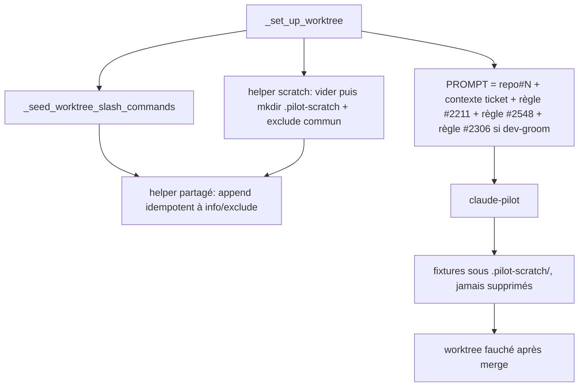

# Scratch pilote sans rm - Plan

**Ticket :** senara-solutions/mika#2548 — `fix(loop-substrate): le prompt dev-pilot ne doit pas rm -rf son scratch`

## Goal Capsule

- **Objective :** un ticket dispatché dans la boucle autonome n'est plus perdu parce que son pilote a voulu nettoyer un répertoire de travail temporaire ; le pilote construit ses fixtures, les laisse en place, et va jusqu'à la PR.
- **Means :** un répertoire scratch désigné, pré-créé et exclu de git par dispatch-lib (KTD1), plus une règle de dispatch injectée dans chaque PROMPT pilote qui interdit toute suppression **sous le scratch** et nomme la forme `git show` autorisée (KTD2, KTD7).
- **Autorité :** le corps de mika#2548 et la preuve mesurée ci-dessous ; en cas de conflit, la preuve du log l'emporte sur l'hypothèse `mktemp` du corps (voir Problem Frame).
- **Stop conditions :** s'arrêter et remonter si l'implémentation exige de toucher la politique claude-pilot (hors périmètre, R6) ou si le répertoire exclu salit quand même `git status` d'un worktree lié.
- **Profil d'exécution :** un seul fichier de production (`skills/bundled/_shared/dispatch-lib.sh`) et sa suite (`skills/bundled/_shared/test-dispatch-lib.sh`) ; bash pur, pas de Rust.
- **Qui finit :** le pipeline `/mika` de ce worktree ouvre la PR sur `senara-solutions/mika` ; le merge reste à mika-dev/opérateur.

---

## Product Contract

### Summary

dispatch-lib pré-crée `.pilot-scratch/` dans chaque worktree de dispatch et l'ajoute à l'`info/exclude` du common-dir, comme il le fait déjà pour les commandes semées (mika#1415). Une constante `_PILOT_SCRATCH_RULE`, appendue au PROMPT de tout pilote, dit où construire un scratch et interdit `rm`, `rm -rf` et `rmdir` dessus. Le répertoire repart vide à chaque préparation de worktree ; un résidu est invisible à git et fauché avec le worktree.

### Problem Frame

La tâche pilote `83db3a82` (ready-label mika#2054, tâche `c8b9b4c8`) est morte le 2026-09-26 à 16:37:50Z. Log `/var/log/claude-pilot/83db3a82-6d8d-4067-8527-29545419a63f.log`, lignes 962-1169 :

1. `mkdir -p verif-2054-redcheck/...` à la racine du worktree (autorisé `[bash-mkdir]`) ;
2. `git show origin/main:... > verif-2054-redcheck/...` refusé `[bash-git-readonly]` (non-terminal) — **aucune écriture n'a abouti, l'arbre créé est vide** ;
3. le pilote abandonne l'approche (« J'utilise l'approche la plus fidèle… », l.1067) et range : `rmdir verif-2054-redcheck/...` refusé deux fois (non-terminal) ;
4. `rm -rf verif-2054-redcheck` → `[policy:deny] ... (terminal)` → session tuée.

Le nettoyage n'était **pas** une réaction à un `git status` sale : git ne suit pas les répertoires vides, donc l'arbre restait propre et la recovery `wip-rescue` (mika#1282) n'était pas en jeu. C'était un réflexe de rangement après une approche abandonnée. `rm -rf` est terminal par design dans claude-pilot (`permissions._denial_is_terminal`, cpp#205) et doit le rester ; `rmdir` y est refusé. **Conséquence pour ce plan :** côté mika, rien de structurel n'empêche le réflexe de rangement lui-même — seule la règle de prompt le vise. La barrière structurelle qui fermerait la classe est dans la politique claude-pilot (rendre `rm`/`rmdir` sous le scratch désigné survivables ou autorisés), hors de ce dépôt (R6) : suivi nommé ci-dessous. Ce que mika livre ici est la moitié qui lui appartient : un lieu désigné, propre, exclu de git, et la consigne.

Le corps du ticket propose un scratch `mktemp -d` dans `/tmp`. La politique claude-pilot rend cette voie inutilisable pour un fixture : `cp`/`mv` vers `/tmp` restent refusés (cpp#209 les rend seulement survivables), l'outil Write hors worktree est refusé (mika#2211). Seuls `mkdir /tmp/...` et `cat > /tmp/... <<'EOF'` y sont sanctionnés (cpp#143, cpp#34). Le lieu fonctionnel est donc sous le worktree, dans un chemin que git ignore.

### Requirements

**Répertoire scratch structurel**

- R1. Tout worktree préparé par `_set_up_worktree` contient un répertoire `.pilot-scratch/` existant **et vide** avant le lancement du pilote, y compris quand le worktree est réutilisé.
- R2. Un fichier créé sous `.pilot-scratch/` n'apparaît jamais dans `git status --porcelain` du worktree, quel que soit le dépôt dispatché (mika, mika-cloud, mika-skills, mika-platform).
- R3. La préparation est idempotente : des dispatches répétés sur le même dépôt laissent une seule ligne `.pilot-scratch/` dans l'exclude commun.

**Règle portée au pilote**

- R4. Chaque PROMPT de dispatch contient une règle qui nomme `.pilot-scratch/` comme lieu du scratch et interdit `rm`, `rm -rf` et `rmdir` sur un scratch, en disant que `rm -rf` tue la session.
- R5. L'injection préserve le contrat mika#138 (première ligne `<repo>#<num>`), les trois invariants de position de mika#2178, et laisse la règle Fire-Disposition conditionnelle (mika#2306) en dernier sur un dispatch dev-groom.

**Frontière**

- R6. La politique claude-pilot n'est pas modifiée ; `rm -rf` reste terminal.

### Scope Boundaries

- La politique de permissions claude-pilot (dépôt `claude-pilot`, CC-spawns-only) : hors périmètre, R6.
- Le rapport « Halt event » de dispatch-lib qui cite le premier deny de la session au lieu du deny terminal (visible dans le résultat de la tâche `83db3a82`) : défaut distinct.
- Le refus `[bash-git-readonly]` de `git show … > fichier` : comportement de politique, hors périmètre.

#### Deferred to Follow-Up Work

- **Ticket claude-pilot (CC-spawns-only) : rendre `rm`/`rmdir` sous `<worktree>/.pilot-scratch/` autorisés ou survivables.** C'est la moitié structurelle qui fermerait le réflexe de rangement mesuré (KTD5). Garder `rm -rf` terminal partout ailleurs ; la forme serait une exception lexicale sur le chemin littéral, comme cpp#143 pour `mkdir /tmp/...`. À ouvrir sur `senara-solutions/claude-pilot` avec la preuve de la tâche `83db3a82`.
- `skills/bundled/_shared/tests/test_seed_worktree_slash_commands.sh` n'est câblé ni dans la cible `make test` ni dans la CI ; le câbler relève d'un ticket séparé.

---

## Planning Contract

### Key Technical Decisions

- KTD1. **Scratch sous le worktree, exclu par l'`info/exclude` du common-dir.** Seul lieu où le pilote peut écrire un fixture par Write, `mkdir` ou `cp` (Problem Frame). L'exclude du common-dir est celui que git consulte pour le statut d'un worktree lié ; l'exclude par worktree ne l'est pas (`docs/solutions/architecture-patterns/seed-scaffold-into-tracked-worktree-dir-via-git-exclude.md`). Choisi plutôt qu'un `/tmp` en tmpfs : `cp` et Write y sont refusés. Choisi plutôt qu'une entrée `.gitignore` : elle ne couvrirait que les dépôts qui la committent, alors que l'exclude est posé par dispatch-lib pour tout dépôt dispatché.
- KTD2. **Constante injectée dans le PROMPT, pas seulement dans une commande `.claude/commands/`.** Le PROMPT est le seul canal que tout pilote de tout dépôt lit (raisonnement documenté au-dessus de l'injection mika#2211 dans `_set_up_worktree`). Inconditionnelle : groomeurs et implémenteurs construisent tous deux des fixtures.
- KTD3. **Factoriser l'append idempotent d'exclude en helper partagé.** `_seed_worktree_slash_commands` contient déjà la logique (résolution du common-dir, garde du saut de ligne final, `grep -qxF` avant append). La dupliquer ferait diverger deux copies d'un invariant de propreté du worktree.
- KTD4. **Le motif d'exclusion est `.pilot-scratch/` avec la barre finale.** Il ne vise qu'un répertoire. Il s'applique aussi au checkout principal qui partage le common-dir, ce qui est sans effet : aucun dépôt ne suit ce chemin.
- KTD5. **Ce que la moitié structurelle couvre, et ce qu'elle ne couvre pas — dit honnêtement.** Elle couvre le résidu *non vide* : un fixture laissé sous `.pilot-scratch/` n'apparaît jamais dans `git status`, n'entre dans aucun commit, ne déclenche aucune recovery `wip-rescue`, et le répertoire repart vide à chaque préparation de worktree (KTD6). Elle **ne couvre pas** le réflexe de rangement mesuré dans l'incident fondateur (répertoires vides, voir Problem Frame) : contre lui, sur le dépôt mika, la règle de prompt est la seule barrière — la forme que `feedback_prompt_enforcement_empirically_confirmed_at_loop_substrate` juge fragile. La fermeture structurelle de cette moitié appartient à la politique claude-pilot et fait l'objet du suivi nommé en Scope Boundaries.
- KTD6. **Remise à zéro côté hôte à chaque préparation.** Un worktree est réutilisé entre itérations et reprises, et `_clean_worktree_for_rebase` (`git clean -fd` sans `-x`, `stash --include-untracked`) épargne les chemins exclus : sans remise à zéro, un scratch périmé d'un groom ou d'une itération précédente attendrait le pilote suivant, à qui la règle interdit de le supprimer — donc le pousserait vers le `rm -rf` terminal dès qu'il lui faut un répertoire vide. Le helper vide donc `.pilot-scratch/` côté hôte avant de le recréer, derrière `_assert_removable_worktree_path`, exactement comme le reset de `$wt/.iterate` dans `_clean_worktree_for_rebase`.

- KTD7. **Portée de l'interdit, et la commande qui a vraiment échoué (ajouté à la revue de code).** L'interdit porte sur les brouillons de `.pilot-scratch/`, pas sur « tout fichier » : un interdit global contredisait la règle mika#2211 injectée juste avant (« passe-le en `--body-file pr-body.md`, puis supprime-le »), et `pr-body.md` n'est gitignoré que dans mika — un pilote obéissant à la règle la plus récente l'aurait laissé à la racine de mika-cloud ou mika-skills, où le `git add -A` de la recovery l'aurait commité. La règle nomme donc `pr-body.md` comme seule exception (un `rm` simple, jamais `rm -rf`). Elle nomme aussi la forme `git show <ref>:<chemin> > .pilot-scratch/<chemin>`, seule sur sa ligne, que la politique autorise (cpp#35, `bash-git-show-redirect`) : dans l'incident fondateur, la commande refusée était un `git show … -- > … 2>/dev/null; wc -l`, refusée pour sa forme et non pour sa cible.

### High-Level Technical Design

### Assumptions

- Le répertoire `.pilot-scratch/` n'est pas un chemin control-plane pour claude-pilot : `_CONTROL_PLANE_PATTERNS` couvre `.git`, `.github/workflows`, `.claude`, `skills/bundled`, `.mika` et un fichier Rust, pas ce chemin (vérifié au commit `d9467dd` de claude-pilot).
- Le seeding s'exécute côté hôte avant le lancement bwrap ; l'`info/` monté en lecture seule dans le sandbox ne gêne donc pas l'écriture.

---

## Implementation Units

### U1. Helper partagé d'exclusion et répertoire scratch

- **Goal :** pré-créer `.pilot-scratch/` et l'exclure de git dans tout worktree de dispatch.
- **Requirements :** R1, R2, R3 ; KTD1, KTD3, KTD4, KTD6.
- **Dependencies :** aucune.
- **Files :** `skills/bundled/_shared/dispatch-lib.sh`, `skills/bundled/_shared/test-dispatch-lib.sh`.
- **Approach :**
  1. Extraire de `_seed_worktree_slash_commands` la résolution du common-dir et l'append idempotent dans un helper qui prend le worktree et le motif.
  2. Réécrire `_seed_worktree_slash_commands` sur ce helper sans changer son comportement.
  3. Ajouter le helper scratch : vider un `.pilot-scratch/` existant côté hôte derrière `_assert_removable_worktree_path` (KTD6), le recréer, puis appeler le helper d'exclusion avec `.pilot-scratch/`.
  4. L'appeler dans `_set_up_worktree` juste après `_seed_worktree_slash_commands`, inconditionnellement.
- **Patterns to follow :** `_seed_worktree_slash_commands` ; bloc de commentaire en tête de fonction citant le ticket et la preuve, comme ses voisins.
- **Test scenarios** (dans `test-dispatch-lib.sh`, repo git temporaire + worktree lié, comme les fixtures mika#1414 existantes) :
  - Après appel du helper scratch sur un worktree lié propre, `.pilot-scratch/` existe.
  - Un fichier écrit dans `.pilot-scratch/sub/f` laisse `git status --porcelain` vide.
  - Un fichier laissé dans `.pilot-scratch/` avant l'appel a disparu après : le répertoire existe et est vide (réutilisation de worktree, KTD6).
  - Deux appels successifs laissent exactement une ligne `.pilot-scratch/` dans l'exclude du common-dir.
  - Un exclude préexistant sans saut de ligne final n'est pas concaténé à la nouvelle entrée.
  - Un fichier hors `.pilot-scratch/` apparaît toujours dans `git status` (l'exclusion ne masque que le scratch).
  - Structure : l'appel au helper scratch figure dans le corps de `_set_up_worktree`.
  - Non-régression : les commandes semées restent exclues après la factorisation (le fichier semé n'apparaît pas dans `git status`).
- **Execution note :** contrôle négatif obligatoire — retirer l'appel d'exclusion, constater que le test du statut propre rougit, restaurer. Commiter le vert avant de muter.
- **Verification :** la suite passe, et le contrôle négatif a rougi.

### U2. Règle de dispatch dans le PROMPT

- **Goal :** chaque pilote reçoit la consigne de construire son scratch sous `.pilot-scratch/` et de ne jamais le supprimer.
- **Requirements :** R4, R5, R6 ; KTD2, KTD5.
- **Dependencies :** U1 (la règle nomme un répertoire que U1 garantit).
- **Files :** `skills/bundled/_shared/dispatch-lib.sh`, `skills/bundled/_shared/test-dispatch-lib.sh`.
- **Approach :**
  1. Définir `_PILOT_SCRATCH_RULE` à côté de `_PR_BODY_CONTAINMENT_RULE`, en français, quelques lignes, forme positive d'abord : où construire, pourquoi c'est sûr (exclu de git, fauché avec le worktree), puis l'interdit (`rm`, `rm -rf` qui tue la session, `rmdir` refusé) et le rejet du `cp` vers `/tmp`.
  2. Bloc de commentaire au-dessus : la preuve de la tâche `83db3a82`, pourquoi pas `/tmp`, renvoi à KTD5.
  3. Appendre au PROMPT dans `_set_up_worktree` juste après la règle mika#2211 et avant le bloc conditionnel Fire-Disposition (mika#2306), inconditionnellement — la règle FD doit rester la plus récente pour le groomeur, son seul levier étant la récence.
- **Patterns to follow :** `_PR_BODY_CONTAINMENT_RULE` et son bloc de tests mika#2211 dans `test-dispatch-lib.sh`.
- **Test scenarios :**
  - La constante est définie exactement une fois.
  - Elle est appendue dans `_set_up_worktree` (forme `PROMPT=$(printf '%s\n\n%s' "$PROMPT" "$_PILOT_SCRATCH_RULE")`).
  - L'injection est placée après la réaffectation `ITERATION CONTEXT:` et après l'injection mika#2211.
  - L'injection Fire-Disposition (mika#2306) suit toujours l'injection mika#2548 (helper `_t2178_after`).
  - Le texte contient `.pilot-scratch`, `rm -rf`, `rmdir` et le mot `terminal` (insensible à la casse).
  - L'injection n'est pas conditionnée au skill (pas dans le bloc `if [ "$SKILL" = "dev-groom" ]`).
- **Verification :** la suite passe ; un dry-run de dispatch montrerait la règle après la règle mika#2211 (et avant la règle FD sur dev-groom), la première ligne `<repo>#<num>` intacte.

---

## Verification Contract

| Commande | Ce qu'elle prouve |
|---|---|
| `make test-dispatch-lib` | U1 et U2 : structure, contenu de la règle, comportement git de l'exclusion (suite câblée en CI, mika#1772) |
| `bash skills/bundled/_shared/tests/test_seed_worktree_slash_commands.sh` | la factorisation de U1 ne régresse pas le seeding mika#1415 |
| `shellcheck skills/bundled/_shared/dispatch-lib.sh` (si disponible) | pas de nouvel avertissement |

---

## Definition of Done

- U1 et U2 livrés, suites vertes, contrôle négatif de U1 constaté rouge puis restauré.
- Aucun changement dans le dépôt claude-pilot.
- Pas de code d'essai abandonné dans le diff.
- PR ouverte sur `senara-solutions/mika` avec `Closes #2548`.

## Acceptance criteria

- [ ] Un worktree préparé par `_set_up_worktree` contient `.pilot-scratch/` vide (même réutilisé), et un fichier écrit dedans n'apparaît pas dans `git status --porcelain`.
- [ ] Deux préparations successives laissent une seule ligne `.pilot-scratch/` dans l'`info/exclude` du common-dir.
- [ ] Le PROMPT de tout dispatch contient une règle `mika#2548` qui nomme `.pilot-scratch/` et interdit `rm`, `rm -rf` (terminal) et `rmdir` sur le scratch.
- [ ] La première ligne du PROMPT reste `<repo>#<num>` ; la règle est placée après l'injection mika#2211 et avant la règle Fire-Disposition conditionnelle (mika#2306).
- [ ] Le seeding des commandes (mika#1415) reste propre après la factorisation.
- [ ] La politique claude-pilot n'est pas modifiée.
